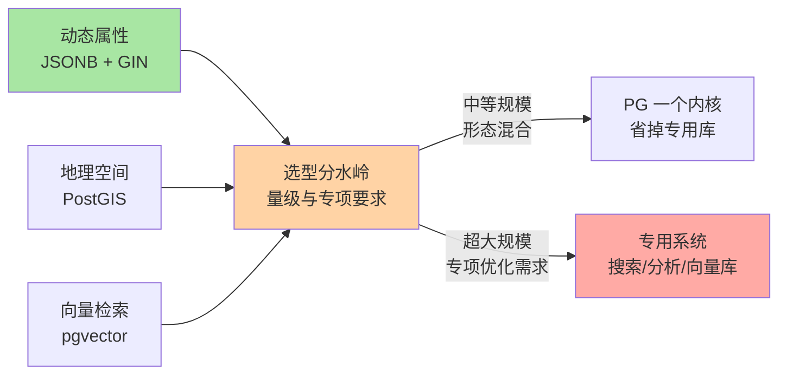
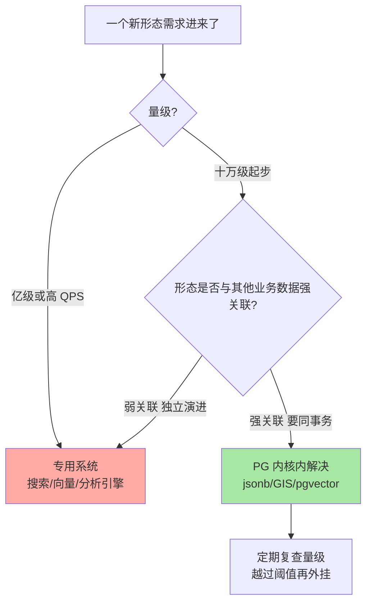

# JSONB 扩展性与生态选型：一个内核接住多少种数据形态

> 一句话：JSONB 把 JSON 解析成二进制再存（可 GIN 索引、可包含查询），是 PG 对「动态属性」这类半结构化数据的一等公民答案；扩展插件（PostGIS/pgvector/citext…）让一个内核接住地理、向量等多种形态——但「能接住」不等于「该一直接」，边界在量级与专项优化需求。

## 🎯 本文核心

**核心一句话：PG 的扩展性 = 类型扩展（JSONB 等内置富类型）+ 索引扩展（GIN 等访问方法）+ 插件扩展（CREATE EXTENSION 一句话装能力）三层叠加——这让中等规模的动态属性、地理、语义检索场景不必引入专用系统；而选型的分水岭在量级与专项要求：专用系统在超大规模下的专属优化，通用内核替代不了。**

组织主线（一张图看懂三层扩展性与选型边界）：



本篇先拆 JSONB 的机制（存什么、怎么索引、与 MySQL JSON 的差异），再过扩展插件生态，最后给「什么时候一步到位、什么时候坚持专用」的决策线。

## 一句话摘要

PG 有两种 JSON 类型：json 存原文（保留格式与键序、每次读都重新解析）与 **jsonb** 存解析后的二进制（写入慢一点、读取免解析、支持相等与包含运算符、可建 GIN 索引）——业务默认选 jsonb。配合 GIN 索引，`attrs @> '{"brand": "x"}'` 这类「文档包含某结构」的查询能走索引，补齐了关系型在半结构化数据上的短板（MySQL 的 JSON 类型是文本形态 + 虚拟列/多值索引的补丁式方案，能力在 8.0 有补齐但心智与生态不同，业内认知）。扩展生态是 PG 的招牌：CREATE EXTENSION 一句话装上 PostGIS（开源 GIS 事实标准之一，公开口径）、pgvector（向量相似检索）、citext（大小写不敏感文本）、pg_stat_statements（语句统计）等——插件登记进系统目录（第 2 篇讲过的自描述设计），能力就地生长。选型结论一句话：动态属性与多形态混合是 PG 的主场；单一形态冲到超大规模（亿级全文检索、亿级向量高 QPS、重分析），专用系统的专属优化无可替代。

## 5W 速记卡

| 维度 | 一句话 |
|---|---|
| What | JSONB 二进制 JSON + GIN 索引 + CREATE EXTENSION 插件生态 |
| Why | 动态属性/地理/向量等形态在关系内核内解决，少维护一套系统 |
| When | schema 频繁演进、多形态混合、中等规模专项场景的默认选项 |
| Where | 表列类型 jsonb + GIN 索引 + shared_preload/extension 目录 |
| How | 对照 MySQL：文本 JSON+虚拟列 → 二进制 jsonb+GIN；外挂系统 → 内核插件 |

## 一、JSONB 机制：二进制存储怎么换来索引能力

四要素具体值：

1. **存储形态**：写入时把 JSON 文本解析成分解后的二进制树（键、值、数组各自定长编码），查询按结构定位，不必每次全文解析——为什么这么设计？写入多花一步解析是刻意的设计取舍：代价是写入慢一点（业内认知 jsonb 写入比 json 慢一截），收益是读取免解析、判断运算与索引构建都快得多。
2. **比较语义**：jsonb 支持 `=`（结构相等）与 `@>`（包含）、`?`（含某键）等运算符——包含查询是「这个文档里有那一段结构吗」的语义，正好匹配动态属性的检索形态。
3. **索引方式**：GIN 倒排索引（第 3 篇讲过机制）把 JSON 内部的键值对（或 jsonb_path_ops 模式下的路径+值哈希，索引更小）拆进倒排，`@>` 与 `?` 类查询都能走索引。
4. **边界值**：单值与整文档受字段/行长度约束（TOAST 接管超大值，第 2 篇讲过）；同一个查询里 jsonb 函数链太深会牺牲可读性，复杂逻辑建议视图化。

```sql
-- 动态属性表的标准形态: 关系字段 + JSONB 动态区
CREATE TABLE products (
  id         bigint GENERATED ALWAYS AS IDENTITY PRIMARY KEY,
  name       text NOT NULL,
  category   text NOT NULL,
  attrs      jsonb NOT NULL DEFAULT '{}',   -- 品类不同的动态参数都进这里
  created_at timestamptz NOT NULL DEFAULT now()
);
-- GIN 索引: 让包含查询走索引
CREATE INDEX idx_products_attrs ON products USING GIN (attrs jsonb_path_ops);

-- 走索引的查询形态
SELECT name FROM products
WHERE category = 'laptop' AND attrs @> '{"ram_gb": 32, "touch": true}';
```

**追问：MySQL 8.0 也有 JSON 与函数索引，差距到底在哪？**
反方案对照：MySQL 的 JSON 是文本存储 + 按需解析，检索惯例是「把常用路径提成虚拟列再建索引」——能用，但每个检索路径都要一次建模动作；PG 的 jsonb + GIN 是「整文档结构直接进索引」，新增检索路径多数情况零建模。能力上 MySQL 8.0 的多值索引补齐了一部分（业内认知），差异更多在**心智**：PG 侧「动态属性进 jsonb」是默认直觉，MySQL 侧是「补丁组合」。选型时不看单点功能清单，看惯用形态谁顺手。

**再追问：jsonb 会不会被滥用成「无 schema 垃圾场」？**
打破砂锅说透：动态属性适合「低频检索、品类差异大」的字段；凡是高频过滤/强约束/要外键的字段（价格、库存、归属关系），留在关系列。业内常见的翻车形态是把所有字段都塞 jsonb——结果是约束丢了、统计信息失准、查询全靠 GIN 硬扛。**关系列管结构，jsonb 管差异**，这条边界不清，索引与优化器都会受累。

## 二、扩展插件生态：CREATE EXTENSION 的能力清单

```sql
-- 装插件 = 一句话, 能力登记进系统目录
CREATE EXTENSION IF NOT EXISTS postgis;        -- 地理空间
CREATE EXTENSION IF NOT EXISTS vector;         -- pgvector 向量
CREATE EXTENSION IF NOT EXISTS citext;         -- 大小写不敏感文本
CREATE EXTENSION IF NOT EXISTS pg_trgm;        -- 三元组模糊匹配
CREATE EXTENSION IF NOT EXISTS pg_stat_statements; -- 语句级统计
```

| 插件 | 解决什么 | 量级直觉（业内认知口径） |
|---|---|---|
| PostGIS | 几何类型 + 空间函数 + 空间索引（GiST），投影/拓扑/路径分析 | 开源 GIS 事实标准之一（公开口径），中大规模地理场景的主力 |
| pgvector | vector 类型 + 相似度运算符 + IVFFlat/HNSW 索引 | 十万到千万级向量、中等 QPS 的语义检索够用；亿级或高 QPS 要评估专用库 |
| citext/pg_trgm | 大小写不敏感、模糊/相似匹配 | 中小规模站内搜索、纠错建议 |
| pg_stat_statements | 语句级耗时统计（对应 MySQL slow log 的互补视角） | 性能排查第一现场 |

**设计思想**：插件的元信息、类型、运算符、索引方法全部走系统目录注册——「扩展」不是外挂脚本，是内核能力在目录体系内的正式公民。这是第 1 篇「单一引擎换来体系自洽」的生态层兑现：**内核开放注册面，生态就能在同一个事务、同一个备份、同一套权限体系里生长**。理解这个设计目标，就明白为什么装插件不用改内核、不用动存储格式。

## 三、什么时候 PG 一步到位省掉专用库

判断线不是功能有无，是**量级 × 形态混合度 × 运维预算**三因子：



**适合一步到位的典型**：商品动态属性检索（jsonb+GIN）、门店/配送地理计算（PostGIS）、十万到千万级文档语义检索（pgvector）、后台模糊搜索（pg_trgm）——共性是**量级中等、与业务关系数据强关联**，同库同事务省掉的是双写一致性、跨库 JOIN、两套运维的全家桶成本。

线上排查过一则公开社区常见同款案例：团队为「商品属性筛选」单独引入一套搜索引擎，双写同步链路故障导致搜索结果与主库不一致，排查三天定位到同步任务的断点重放缺陷；复盘结论是当时数据量仅数十万级、属性检索与交易表强关联——这个场景 PG 一个 GIN 索引就能闭环，专用系统属于超配。**省掉的不是软件钱，是一整条同步链路的一致性风险。**

## 四、什么时候该坚持专用系统

先摆反方案：为什么不用「PG 一扛到底」？因为专用系统的专项优化（列存压缩、倒排打分、向量召回的内存管理）在超大规模下按规模线性兑现收益，通用内核补不上这层。四条明确的「坚持专用」判断线：

- **超大规模全文检索**：亿级文档、复杂相关性排序、分词生态——搜索专用系统的倒排与打分体系是专项工程，PG 的 tsvector/pg_trgm 在这个量级的召回与延迟都吃亏（业内认知）。
- **重分析（列存压缩/向量化执行）**：亿级行聚合、扫描为主的分析，列式专用引擎的压缩比与扫描吞吐差一个量级——PG 的分析能力是「优化器强」，不是「列存快」。
- **超大规模向量 + 高 QPS**：亿级向量、低延迟召回、需要专门的内存管理与过滤策略时，专用向量系统的专项优化占优；pgvector 的定位是「够用的中量级 + 事务一致性红利」。
- **强消息语义**：百万级 TPS 的发布订阅、消息回溯——消息队列的存储与投递语义不是数据库内核的菜。

**追问：量级涨过阈值后，从 PG 迁到专用系统的成本高吗？**
这正是「先内核后外挂」路线的隐藏红利：数据模型与查询语义已经稳定，迁移是「数据搬家 + 双跑验证」，而不是「边定模型边选系统」的反向风险。业内常见的顺序就是：PG 内起步 → 量级触发 → 专项系统接管该形态，PG 保留其余数据——不是二选一，是接力。

## 五、jsonb 与 MySQL JSON 的区别速查

两种「动态属性方案」的机制差异集中在存储与索引架构上。jsonb 的二进制结构与 GIN 倒排是一体化架构，MySQL 的虚拟列方案是「文本存储 + 索引外挂」的组合架构——差异不是功能有无，是惯用路径的长短：

| 维度 | PostgreSQL jsonb | MySQL JSON |
|---|---|---|
| 存储 | 解析后二进制 | 文本（二进制包装） |
| 索引 | GIN 整文档结构倒排 | 虚拟列索引 / 多值索引（按路径建模） |
| 包含查询 | `@>` 原生运算符 + 走索引 | JSON_CONTAINS 函数 + 人工提列 |
| 新增检索路径 | 多数零建模 | 通常要先建虚拟列 |
| 一致心智 | 动态属性默认进 jsonb | 按需补丁组合 |

## 六、常见误区与代价

- **误区一：所有字段塞 jsonb 的「万能表」**。代价是约束丢失、统计信息失准、GIN 写入放大拖垮更新——关系列与动态区的边界（第四节第一段）必须先立。
- **误区二：GIN 建完就不管**。jsonb_path_ops 与默认 full 模式的索引体积与支持运算符不同（path_ops 更小但只服务包含类，机制以官方文档为准），写多场景不评估 fastupdate/pending list 就上量，写入延迟会先于你发现。
- **误区三：把插件当官方内核默认能力承诺**。插件有独立的成熟度与维护节奏，生产引入前看插件自身的版本与社区活跃度（业内认知）；云托管环境还要确认平台允许装哪些扩展。
- **误区四：pgvector 顶到亿级还硬扛**。召回质量与延迟双双劣化才想起换系统，迁移窗口已经被动——量级监控要前置，阈值临近就启动专用系统评估。

> 💡 **实战提示**
> - 💡 jsonb 列加 CHECK 约束兜底结构底线（如必含某键），动态不等于无底线——`CHECK (attrs ? 'version')` 一行约束省掉下游无数空值判断
> - 💡 用 pg_stat_statements 找出真正高频的检索路径，再决定哪些动态属性「晋升」为关系列——晋升的依据是访问频率，不是审美
> - 💡 插件升级与内核大版本升级分开演练：插件的兼容矩阵跟内核版本走，先在预发验证再动生产——对应 MySQL「先升从库再切主」的灰度习惯

## 七、你们可能会问

**Q1：动态属性到底放 jsonb 还是 EAV 拆行表（属性-值对）？**
EAV（一行一个属性）在 PG 里有历史包袱期的合理性，但查询要自连接、索引要按属性建、行数爆炸——jsonb 一列一索引就覆盖了绝大多数 EAV 场景。业内认知的现行共识：新项目优先 jsonb，EAV 只在「属性需要独立权限/审计」这类特殊约束下考虑。

**Q2：jsonb 的统计信息会不会让优化器失准？**
会受影响：jsonb 内部的值分布优化器默认知之甚少，复杂包含查询的行数估算可能偏差——表现是执行计划时好时坏。缓解：把高频过滤的键「晋升」为表达式索引与扩展统计（CREATE STATISTICS，机制以官方文档为准），或晋升为关系列。

**Q3：PG 内核内跑这么多形态，会不会互相拖累？**
会的：向量检索吃内存、GIS 计算吃 CPU、GIN 更新吃 IO——同一实例内混合负载要靠资源分组与负载隔离（表空间/参数分层，业内认知）。形态多到互相干扰时，「拆实例」比「换系统」先发生：PG 生态的灵活性允许你按形态拆库，而不必按形态换产品。

## 八、什么时候用/不用与 Trade-off

| 场景 | 推荐 | 不推荐 |
|---|---|---|
| 动态属性 + 高频包含查询 | jsonb + GIN | 万能 jsonb 表 / EAV 拆行 |
| 中量级语义检索 + 事务关联 | pgvector 同库闭环 | 直接上专用向量库（超配） |
| 亿级全文/重分析 | 专用搜索/列存系统 | PG 内核硬扛 |
| 与交易数据强关联的形态 | 同库同事务（PG） | 双写同步链路 |

Trade-off 的锚点是**通用性的边际成本曲线**：PG 内核内解决，前期的同步链路、双系统运维、一致性风险全是省掉的固定成本；但越过量级阈值后，专用系统的专项优化收益按规模线性放大而通用内核的劣化同步放大——两条曲线的交点就是切换点。选型的功力不在「选哪个」，在**识别自己站在交点的哪一侧**。量级分界一句话：十万级动态属性，jsonb+GIN 无脑闭环；千万级开始监控 GIN 写入放大与检索延迟；亿级专项形态，专用系统接管、PG 保留关系主阵地——这是接力不是替换。

## 开放问题

- 向量检索与事务数据同库的形态（pgvector 路线）与专用向量库的边界，会随内存硬件与索引算法演进持续移动——「够用的中量级」这一定位能覆盖到多大量级，是未来两年最值得跟踪的演进之一
- JSON 标准与 SQL/JSON 标准函数在两家（PG/MySQL）的收敛速度，决定「动态属性」这一层的方言成本会不会长期存在

## 🎯 核心带走

- **核心一句话**：JSONB 二进制 + GIN 倒排解决动态属性，插件生态（PostGIS/pgvector/citext…）让内核接住地理与向量——PG 的扩展性是「类型+索引+插件」三层叠加，选型分水岭在量级与专项要求
- **关系列/jsonb 边界**：高频过滤、强约束、外键关系进关系列；品类差异大的低频动态属性进 jsonb——关系列管结构，jsonb 管差异
- **哪里会破**：万能 jsonb 表丢约束、GIN 写入放大没评估、亿级向量硬扛 pgvector、插件成熟度没验证
- **取舍锚点**：省掉的是同步链路与双系统运维，付出去的是超量级后的专项优化——识别交点在哪一侧

## 自测三问

1. json 与 jsonb 的存储与索引差异是什么？业务默认选哪个？——答出「文本 vs 解析后二进制，GIN 只配 jsonb，默认 jsonb」算过。
2. 「关系列管结构，jsonb 管差异」怎么落地判断？——答出「高频过滤/强约束进关系列，品类差异低频动态进 jsonb」算过。
3. 从 PG 内核方案迁到专用系统的触发条件是什么？——答出「量级阈值 + 专项优化需求，接力而非替换」算过。

## 📌 数据与事实声明

- 写于 2026-09-24，jsonb 运算符、GIN 索引模式、CREATE EXTENSION 机制以 PostgreSQL 官方文档为准
- PostGIS「开源 GIS 事实标准之一」为公开口径；pgvector、citext 等插件能力以各自官方仓库/文档为准
- MySQL JSON/虚拟列/多值索引能力以 MySQL 8.0 官方文档为准；两者心智差异的表述为业内认知
- 量级判断（十万/千万/亿级）为业内认知，非基准测试结论；案例为公开技术社区常见问题模式的匿名化复述

## 📚 参考资料

| 类型 | 标题 | 来源 |
|---|---|---|
| 官方文档 | PostgreSQL: JSON Types（json vs jsonb） | postgresql.org/docs/（datatype-json 章节） |
| 官方文档 | PostgreSQL: GIN Indexes / Extending SQL | postgresql.org/docs/ |
| 官方仓库 | pgvector 向量扩展 | github.com/pgvector/pgvector |
| 官方文档 | PostGIS 官方文档 | postgis.net/documentation/ |
| 系列内链 | 本系列：MVCC 与索引的机制差异（GIN 机制） | [3_MVCC与索引的机制差异-入门.md](3_MVCC与索引的机制差异-入门.md) |
| 系列内链 | MySQL schema 设计与数据类型（JSON 对照侧） | [../../../mysql/入门层/从零开始认识MySQL系列/4_schema设计与数据类型-入门.md](../../../mysql/入门层/从零开始认识MySQL系列/4_schema设计与数据类型-入门.md) |
