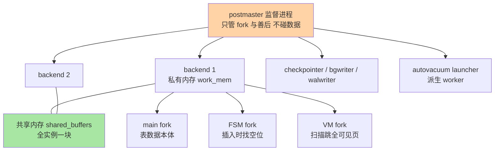
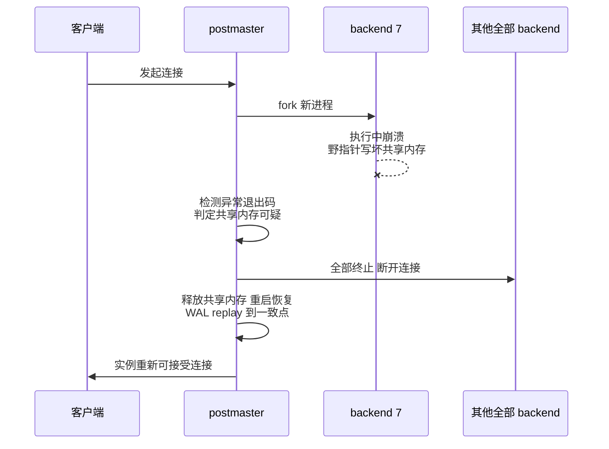

# 进程模型与存储布局深度：postmaster 进程树、fork 文件家族与内存账

> 入门层讲过「每连接一进程」的结论，本篇把结论拆成机制：postmaster 怎么管理进程树，一个 backend 进程的内存到底花在哪里，一张表在磁盘上为什么是 main/fsm/vm 四个文件而不是一个文件——每一层都给到参数与源码路径级。

## 一句话摘要

PG 实例是一个**进程树**：postmaster 是唯一的监督进程，负责监听端口、fork 出每连接一个的 backend，以及一批常驻辅助进程（checkpointer/bgwriter/walwriter/autovacuum launcher 等）；任何一个 backend 崩溃，postmaster 会把全部连接踢掉并走崩溃恢复——用「牺牲可用性换一致性」的监督模型。内存侧，每个 backend 的私有内存里真正的弹性开销是 work_mem（每个排序/哈希节点一份预算）与 maintenance_work_mem（维护操作专用），共享内存里的 shared_buffers 是全实例一块；磁盘侧，每张表在 pg_class 里登记一个 relfilenode，对应 main（数据）、fsm（空闲空间映射）、vm（可见性映射）、init（unlogged 表重置用）四个 fork 文件——FSM 服务插入定位，VM 服务全表扫描跳页与 VACUUM 提速，这两个辅助 fork 是 MySQL 没有的独立结构。

## 🎯 本文核心

**核心一句话：PG 的进程模型是「监督进程 + 每连接一进程 + 内存隔离」，存储模型是「一表多 fork 文件 + 8KB 页」——前者决定了连接数与内存的乘积关系（连接数 × 每节点 work_mem 才是真实内存上界），后者决定了插入定位与 VACUUM 加速的物理基础（FSM/VM 两个辅助 fork）。**

机制链：postmaster 监听 → fork backend → backend 申请私有内存（work_mem 按执行节点计费）+ 挂到共享内存（shared_buffers）→ 读写落到 base/<dboid>/<relfilenode> 的 main fork → 插入时查 FSM 找空位 → 扫描时查 VM 跳过全可见页。一张锚点图：



## 5W 速记卡

| 维度 | 一句话 |
|---|---|
| What | postmaster 进程树 + backend 私有/共享内存两层 + 一表四 fork 文件 |
| Why | 进程隔离换稳定性；辅助 fork 换插入定位与 VACUUM 提速 |
| When | 容量规划算内存账时、OOM 排查时、看磁盘文件不明白多了几个文件时 |
| Where | 源码 postmaster.c/bufmgr.c/md.c；磁盘 PGDATA/base/<dboid>/<relfilenode>[.fsm/.vm/.init] |
| How | pg_relation_filepath('表名') 直接列出四个 fork 的真实路径 |

## 一、边界：入门层讲过什么，本篇讲什么

| 内容 | 入门层（篇 2） | 本篇 |
|---|---|---|
| 每连接一进程 vs 线程的结论 | ✅ 讲过 | 不重复，直接拆 postmaster 机制 |
| work_mem 是「每节点预算」 | 提了一句 | **本文核心：完整内存账** |
| 8KB 页 / 1GB 段 / 单 WAL | ✅ 讲过 | 不重复 |
| main/fsm/vm 四个 fork 文件 | 未讲 | **本文核心二** |
| shared_buffers 与 InnoDB Buffer Pool 对照 | 未讲 | **本文核心三** |

前置阅读：入门层篇 2《进程模型与存储架构》。本篇所有参数默认值以 PostgreSQL 官方文档当前口径为准（文中标注公开口径），量级经验标注业内认知。

## 二、postmaster 进程树：监督、fork 与崩溃恢复

### 2.1 进程树全貌

postmaster 启动后不参与任何数据读写，它的职责只有三件：监听端口接受连接、fork 子进程、监督子进程生死。常驻辅助进程在启动早期 fork 完成：

| 进程 | 职责 | 关键参数 |
|---|---|---|
| checkpointer | 执行检查点，把脏页刷盘 + 推进 WAL 检查点记录 | checkpoint_timeout=5min、checkpoint_completion_target（公开口径默认 0.9） |
| bgwriter | 后台温柔刷脏页，让检查点压力变小 | bgwriter_delay=200ms |
| walwriter | 把 WAL buffer 周期性刷盘 | wal_writer_delay=200ms |
| autovacuum launcher | 调度者，按需 fork autovacuum worker（第 2 篇主角） | autovacuum_naptime=1min |
| wal sender / wal receiver | 流复制两端 | wal_level 决定 |
| backend | 每连接一个，干全部查询活 | max_connections=100 |

### 2.2 源码/关键路径

进程模型的主逻辑集中在 `src/backend/postmaster/postmaster.c`：`PostmasterMain` 完成监听与共享内存初始化，`ServerLoop` 主循环 `select` 等待连接，新连接到来调 `BackendStartup` fork 出 backend——backend 入口是 `src/backend/tcop/postgres.c` 的 `PostgresMain`（查询循环）。辅助进程各自有同名源码文件：checkpointer.c、bgwriter.c、autovacuum.c（launcher 与 worker 都在这里）。

监督语义是这套模型最硬的一条线：postmaster 检测到任一子进程异常退出（非正常退出码），会认为共享内存状态可能已被污染，于是**杀掉全部子进程、释放共享内存、重新走启动恢复**——这就是 pg_log 里常见的 "server process was terminated by signal ... terminating any other active server processes"。设计思想很明确：进程间没有地址空间隔离护栏的场景下（共享内存是手工管理的），与其赌一个野指针只坏了自己，不如整体重启换确定性。所以 PG 生产上「一个查询把整个实例拖崩」的表象，底层是这条监督规则在兜底。

**追问：既然线程更省资源，为什么不选线程模型（thread-per-connection）？**
第一层答案在隔离：线程共享地址空间，扩展插件（PG 生态大量 C 扩展）里的内存越界会直接污染整个进程——进程模型下最多崩一个连接，触发上面的监督重启；线程模型下崩的是全实例，且连体面重启的机会都未必有。第二层在历史与生态：PG 的扩展 ABI、信号处理、错误恢复（longjmp）都按进程边界设计，改线程等于重写内核的一半。

**再追问：fork 那么贵，新建连接延迟不是很难看？**
确实贵——fork + 进程初始化在毫秒级（业内认知，机器越好越快），对比线程的微秒级差一个量级以上。但 PG 团队没在内核里做线程化，而是把问题交给生态：PgBouncer 这类连接池把 fork 成本摊薄成「池内长连接复用」，这正是入门层讲的「连接池是 PG 刚需」的底层原因——不是连接池高级，是进程模型贵。

### 2.3 崩溃恢复的边界

崩溃场景用一张时序图看全过程——注意第 5 步是「踢掉所有人」而不是「踢掉闯祸者」：



postmaster 的监督是「全有或全无」：backend 崩了不是「踢掉那一个连接」，而是全实例重启。这条规则反过来给了运维一个推论：**PG 没有 partial crash 的中间态**——要么所有连接正常，要么全下线等待恢复（恢复时长由 WAL replay 决定，入门层讲过 crash recovery 走 WAL）。对照 MySQL：InnoDB 是线程模型，一个线程崩溃可能导致整个 mysqld 进程退出（取决于崩溃的线程与信号处理），所以两边其实都是「一损俱损」，差别在 PG 是**确定的**全量重启，MySQL 取决于崩溃位置。

## 三、每个 backend 的内存账：私有内存的真实开销

### 3.1 两层内存结构


私有内存里真正危险的是 work_mem 的**乘积语义**：它不是「每连接 4MB」的上限，而是「每个排序节点、每个哈希节点各有一份 4MB 预算」。一条 SQL 里有多少个节点可能超预算？

- `ORDER BY` / `DISTINCT`：1 个 sort 节点
- 多表 join 走 hash join：每张被哈希表一份（PG16 前 hash join 内外表各算，hash_mem_multiplier=2.0 放大，公开口径）
- 窗口函数、GROUP BY：各一个节点

**打破砂锅问到底：一条 SQL 最坏能吃多少？**举例：三表 join 全走 hash join + 最外层 ORDER BY，4 个节点 × 4MB × hash_mem_multiplier(哈希部分) —— 单连接最坏十几 MB 到几十 MB 起步；再乘连接数。100 个连接同时跑这种报表 SQL，理论弹性内存轻松过 GB 级（业内认知量级）。这就是「work_mem × 节点数 × 连接数」三乘积账——入门层只说了两乘积，本篇把「节点数」这一维补全。

### 3.2 事故复盘：一次 OOM 排查

某线上系统凌晨批量跑批，实例被内核 OOM killer 干掉，pg_log 只有 "terminated by signal 9"（匿名化复述的常见模式）。排查路径值得记：第一步看 `pg_stat_activity` 抓现场——但 OOM 已发生，只能回看日志时间线与慢查询记录；第二步复盘发现三件事叠加：运维把 max_connections 从 100 调到 500（应对连接报错）、把 work_mem 调到 32MB（应对报表慢）、跑批 SQL 恰好是多表 join + 大排序。三乘积账算下来 500 × 多节点 × 32MB，物理内存直接击穿。修复动作不是再调参数，而是**把连接收进池子里（回 50 个真实连接）、work_mem 回 8MB、跑批 SQL 拆分排序规模**——参数问题的表象，架构问题（连接治理缺失）的里子。

**追问：为什么不选「给每个会话设一个总内存上限」？**
因为 PG 的内存模型是「按需申请、用完归还」的堆分配，没有会话级内存配额器——这是 MySQL sort_buffer_size（会话级固定缓冲）与 work_mem（节点级弹性预算）的本质差异。为什么不选会话级固定预算？固定预分配会浪费（99% 的查询用不满），弹性按需会超卖（最坏同时超）——PG 选了后者，把风险交给容量规划。MySQL 的 sort_buffer 也是「用到才分配」但按会话粒度，两边都存在乘积超卖，只是粒度不同：这个差异决定了两边的内存监控口径不同（PG 盯 pg_stat_activity 里的执行节点，MySQL 盯会话变量）。

## 四、表文件的 fork 家族：main、fsm、vm、init

### 4.1 一张表在磁盘上是几个文件

每张表在 pg_class 里有 relfilenode，物理上是 `base/<数据库OID>/<relfilenode>` 一组文件（超 1GB 切段，入门层讲过）。但 `ls` 你会发现不止一个文件——它们是同一张表的**不同 fork**：

| fork | 内容 | 谁用 |
|---|---|---|
| main | 堆页本体（行数据） | 一切读写 |
| fsm | 空闲空间映射（FSM），记录每页还有多少空位 | INSERT/UPDATE 找放置页 |
| vm | 可见性映射（VM），每页 2 个位：全可见 / 全冻结 | 顺序扫描跳页、index-only scan、VACUUM 跳页 |
| init | 仅 unlogged 表有，崩溃重置时拿来还原空表 | 崩溃恢复 |

SQL 侧验证（生产排查第一步）：

```sql
-- 列出一张表全部 fork 的物理路径与大小
SELECT relfilenode::text,
       pg_size_pretty(pg_relation_size('orders', 'main')) AS main_size,
       pg_size_pretty(pg_relation_size('orders', 'fsm'))  AS fsm_size,
       pg_size_pretty(pg_relation_size('orders', 'vm'))   AS vm_size
FROM pg_class WHERE relname = 'orders';

-- 直接看路径（main fork；fsm/vm 在同路径后加 .fsm/.vm 后缀）
SELECT pg_relation_filepath('orders');
-- 典型输出形态: base/16384/24576
```

```bash
# 数据目录对照：同一路径下的 fork 家族
ls -lh $PGDATA/base/16384/ | grep 24576
# 24576      1.0G ...（main）
# 24576_fsm  3.5M ...（空闲空间映射）
# 24576_vm   120K ...（可见性映射）
```

### 4.2 源码/关键路径

fork 概念在源码里是 `RelFileNumber` 之外的 `ForkNumber` 枚举（MAIN_FORKNUM / FSM_FORKNUM / VISIBILITY_MAP_FORKNUM / INIT_FORKNUM），文件访问统一走存储管理器 `src/backend/storage/smgr/md.c`（mdcreate/mdread/mdnblocks，段文件逻辑在这层）。FSM 的查找逻辑在 `src/backend/storage/freespace`（freespace.c 维护每表空闲空间缓存，insert 时调 `RecordAndGetPageWithFreeSpace`）；VM 的位图操作在 `src/backend/access/heap/visibilitymap.c`（每页两个位：ALL_VISIBLE、ALL_FROZEN，后者是第 2 篇 freeze 的基础设施）。

两个 fork 的性能意义要分开说：

- **FSM 是写路径的基础设施**：没有它，找插入位置只能顺序扫页；有了它，插入定位近似 O(1)。表刚 truncate 后 fsm 为空，第一轮插入会逐步重建——所以「灌数据前 truncate」比「DELETE 后重灌」快，部分原因在 fsm 冷启动（业内认知）。
- **VM 是读路径与 VACUUM 的加速器**：顺序扫描遇到全可见页可以不查事务状态直接放行；index-only scan 靠 VM 判断「不用回表」；VACUUM 靠 VM 跳过干净页——这是第 2 篇 VACUUM 调优的物理前提。

**设计思想**：把「数据本体」与「元数据辅助结构」拆成独立 fork，换来的是各自独立的生命周期——VM/FSM 可以随时重建（VACUUM 会重写），坏了不伤数据本体。这个「辅助结构可再生」的思路与 InnoDB 把 change buffer/自适应哈希放内存（丢了能重建）是同一个哲学：**能推导出来的东西不值得持久化保证**。

### 4.3 业内惯例：磁盘文件层面的运维习惯

生产中看文件异常的几条惯例（业内认知）：表删除大文件后磁盘不释放，先确认没有长事务持有（第 2 篇展开）；看到 `.vm`/`.fsm` 缺失不必慌，VACUUM 会按需重建；做物理迁移（冷备份）时**必须连 .fsm/.vm 一起拷**，只拷 main 会在恢复后触发一轮空 fsm 的插入降速。磁盘水位监控按 fork 分别告警：main 增长是业务数据，fsm 异常暴涨通常意味着页碎片严重（频繁 UPDATE 的表常见），对策是调 fillfactor 或安排重组织（pg_repack 类工具，公开口径生态方案）。

## 五、与 MySQL InnoDB 的内存模型对照

| 维度 | PostgreSQL | MySQL InnoDB |
|---|---|---|
| 共享缓冲 | shared_buffers（默认 128MB，公开口径；惯例配到物理内存 25% 左右起步，业内认知） | innodb_buffer_pool_size（惯例配到 50%-70%，业内认知） |
| 页替换算法 | clock-sweep（近似 LRU，带使用计数） | 改良 LRU（young/old 子链表防全表扫描污染） |
| 会话级内存 | work_mem 每节点弹性 + temp_buffers | sort_buffer_size / join_buffer_size 每会话 |
| 维护内存 | maintenance_work_mem（VACUUM/建索引用） | 无直接对应（DDL 走共享资源） |
| 写缓冲 | 无独立写缓冲，靠 bgwriter/checkpointer | change buffer（二级索引写合并） |
| 崩溃防撕裂 | full_page_writes（检查点后首次改页写全页） | doublewrite buffer |

对照的要点不是「谁更好」，而是**监控与调优的抓手位置不同**：InnoDB 的内存故事几乎全部在 Buffer Pool 一个旋钮上；PG 的内存是「共享 buffers + 弹性 work_mem」两个世界，后者才是超卖风险所在。为什么 PG 的 shared_buffers 惯例配比比 InnoDB 低？因为 PG 依赖操作系统页缓存做二级缓存（每次读还有一次 OS cache 命中的机会），effective_cache_size 就是告诉优化器「OS cache 还有多少」的参数——这套「双层缓存」设计思想下，shared_buffers 只是第一层，配到 25%-40% 让 OS cache 有剩余空间（业内认知惯例）。InnoDB 则自带完整缓存层，buffer pool 就是唯一主力，所以配得更满。

**追问：为什么不选「把 OS cache 干掉、全部自己管」？**
Oracle/一些商业库走全自管路线，PG 与 MySQL 都保留了 OS cache 分层。原因在工程成本：自己管全量缓存要处理预读、淘汰、并发全链，且放弃文件系统层的成熟优化；保留 OS cache 换来的是双层容错（shared_buffers 未命中还有 OS cache 兜底），代价是缓存策略不透明、双重缓存有冗余。两边取舍不同但自洽——这正好呼应入门层篇 2 的结论：不要把一边的参数直觉原样搬到另一边。

## 六、量级三档：连接与内存的规模账

量级分档的约束来源先说清楚：**约束来自物理内存总量与进程地址空间的乘积效应**，核心变量是「连接数 × 节点数 × work_mem」。三档的核心问题各不相同：

| 量级 | 这一档的核心问题是 | 约束来源 | 思考方式 |
|---|---|---|---|
| 十万级日活、几十连接 | 这一档的核心问题是**默认参数够不够**，而不是怎么调优——默认 100 连接 + 4MB work_mem 完全够，乱调反而引入风险 | 默认值即安全区 | 默认值驱动：不调就是最优解 |
| 千万级、几百上千会话 | 这一档的核心问题是**乘积超卖**，而不是单参数大小——必须连接池化后按「真实并发 × 节点数」算账 | 物理内存 ÷ 最坏节点内存 | 预算驱动：把内存当预算分配给池 |
| 亿级、海量长连接（推送/物联网形态） | 这一档的核心问题是**架构分层**，而不是参数——单实例进程模型撑不住连接规模，必须中间件层（代理/分片）摊平 | 每连接进程成本 × 连接规模 | 架构驱动：连接治理前置到拓扑层 |

收尾两件套：自下而上看，三档的物理基础是同一个——fork 进程的固定成本加弹性 work_mem，量级抬升不改变公式，只改变公式里哪一项先爆；触发升级的信号也一致——连接报错/内存告警从「偶发」变「常态」，就是从下一档升到上一档的扳机，先查乘积账，再动参数，最后才动架构。

## 七、💡 实战提示

💡 **容量规划用「三乘积」别用「两乘积」**：内存上界 ≈ 连接数 × 单查询排序/哈希节点数 × work_mem（哈希再乘 hash_mem_multiplier）。报表系统按最坏 SQL 算，别按平均 SQL 算——OOM 从来不挑平均时刻发生。

💡 **`pg_stat_activity` 是进程模型的显微镜**：每个 backend 一行，state=active 的 query 字段配合 backend_type 能直接定位「谁在吃内存」。OOM 后第一动作是保留 pg_log 与慢查询日志，现场没了也能从时间线复盘。

💡 **看磁盘文件先想 fork**：`ls` 看到同名不同后缀的文件组（24576 / 24576_fsm / 24576_vm）不要当垃圾清理；物理备份工具（pg_basebackup 及生态方案）都会带上全部 fork，手工 `cp` 才会漏。

💡 **max_connections 调大前先算内存账**：它是「最大进程数」，不是「性能旋钮」。连接报错的正解是池化，不是加进程——调大它只是把报错换成 OOM。

## 八、你们可能会问

**Q1：backend 进程数最多多少？有没有硬上限？**
max_connections 是软上限（默认 100，公开口径），另预留 superuser_reserved_connections（默认 3）给管理连接。物理硬上限取决于内存与 PID 空间，实践瓶颈永远是内存三乘积账（业内认知）。连接数打满时新连接报 "too many clients"，此时 superuser 保留通道还能进——排查时这是救命的入口。

**Q2：autovacuum worker 算在 max_connections 里吗？**
不算。worker 由 launcher 按需 fork，数量走 autovacuum_max_workers（默认 3，公开口径），独立于 max_connections 的进程池。但注意 worker 也吃内存与 IO 预算——容量规划时它们是「隐形连接」。

**Q3：`.init` 文件是什么时候出现的？**
只有 unlogged 表有 init fork：unlogged 表崩溃后不保证内容，恢复时用 init fork 重置成空表结构。生产惯例：unlogged 只用于可丢弃的中间结果（业内认知），别拿它当内存表用——它不省内存，只是不写 WAL。

**Q4：为什么 `ps` 里看到很多 postgres 进程，名字都一样？**
PG 的进程名通过 `ps_display` 机制改成带角色的形式（如 "postgres: checkpointer"、"postgres: walwriter"、含 IP 的 backend 行）。这是排查的第一线索：进程名即职责，配合 pg_stat_activity 的 pid 列可以进程级对账。

## 九、什么时候用/不用与 Trade-off

| 场景 | 推荐 | 不推荐 |
|---|---|---|
| 高并发 OLTP | 池化到几十个真实连接，work_mem 保守 | 调大 max_connections 硬扛 |
| 报表/跑批 | 独立库或独立副本 + 单独 work_mem 档位 | 与 OLTP 共连接池同档参数 |
| 物理备份 | 生态工具带全 fork 的一致性备份 | 手工 cp 数据目录 |
| 磁盘排查 | pg_relation_filepath 按表定位 | 按文件大小盲目对号 |

Trade-off 的锚点是**隔离与成本**：进程模型买来的崩溃隔离与扩展安全性，用连接成本与内存超卖风险支付；辅助 fork（FSM/VM）买来的插入定位与扫描加速，用磁盘元数据开销与「辅助结构需维护」的复杂度支付。两笔交易都划算，但都有隐藏账单：前者要求你配池子、会算乘积；后者要求你理解 VACUUM 在维护它们（下一篇的主角）。

## 开放问题

- io_uring 等异步 IO 能力进入内核后（近年版本在演进，公开口径），「进程模型 + 每进程同步 IO」与线程模型、多路复用模型的成本差是否会被压缩，值得持续跟踪——从 2019 年前后社区首次系统讨论至今（公开口径），进程/线程之争的结论一直在随硬件演变
- 共享内存里 SLRU 缓冲（事务状态等）的调优空间长期偏小，社区对可配置化的讨论持续多年（公开口径），何时落地影响高并发子事务场景的容量模型
- 扩展生态（大量 C 扩展依赖进程地址空间隔离）与线程化改造如何兼容，是未来十年量级的架构议题——短期内进程模型仍是主线，这一判断在可预见的版本周期内不会变（业内认知）

## 🎯 核心带走

- **核心一句话**：postmaster 只管监督与 fork，backend 干全部活；内存 = 私有弹性（work_mem × 节点 × 连接的三乘积）+ 共享缓冲（shared_buffers + OS cache 双层）；磁盘 = 一表四 fork（main 数据 / fsm 插入定位 / vm 扫描与 VACUUM 提速 / init 重置）
- **最小动作集**：上池子、算三乘积、用 pg_relation_filepath 认文件、用 pg_stat_activity 对账进程
- **哪里会破**：max_connections 拍大 + work_mem 拍大 = OOM 组合拳；物理备份漏 fsm/vm；把辅助 fork 当垃圾删
- **取舍锚点**：隔离换成本、辅助结构换加速——两边账都要会算，别只背结论

## 自测三问

1. 一条 SQL 的 work_mem 上限怎么算？——答出「节点数 × work_mem，哈希乘 multiplier，再乘连接数」算过。
2. backend 崩了为什么全实例重启？——答出「共享内存可能被污染 + 监督进程全有或全无」算过。
3. VM fork 服务哪三件事？——答出「顺序扫描跳页 / index-only scan / VACUUM 跳页」算过。

## 📌 数据与事实声明

- 写于 2026-09-24；参数默认值（max_connections、work_mem、shared_buffers、autovacuum_naptime 等）以 PostgreSQL 官方文档当前默认口径为准
- 源码路径（postmaster.c、md.c、visibilitymap.c 等）以 PostgreSQL 官方源码仓库当前主干为准，具体函数名随版本演进可能有出入
- 内存成本量级、连接数经验、缓存配比惯例均为业内认知，非基准测试结论
- 事故案例为公开技术社区常见问题模式的匿名化复述，不指向任何特定公司或系统

## 📚 参考资料

| 类型 | 标题 | 来源 |
|---|---|---|
| 官方文档 | PostgreSQL: Server Configuration（work_mem/shared_buffers/max_connections） | postgresql.org/docs/ |
| 官方文档 | PostgreSQL: Database Physical Storage（fork/段/页） | postgresql.org/docs/ |
| 官方源码 | postmaster.c / md.c / visibilitymap.c | github.com/postgres/postgres |
| 公开口径 | PgBouncer 连接池文档 | pgbouncer.org/ |
| 系列内链 | 入门层：进程模型与存储架构 | [../../入门层/从零开始认识PostgreSQL系列/2_进程模型与存储架构-入门.md](../../入门层/从零开始认识PostgreSQL系列/2_进程模型与存储架构-入门.md) |
| 系列内链 | 本系列下一篇：MVCC 与 VACUUM 深度 | [2_MVCC与VACUUM深度-特性.md](2_MVCC与VACUUM深度-特性.md) |
