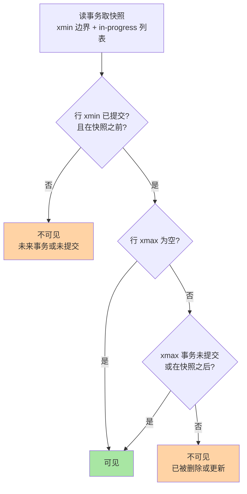
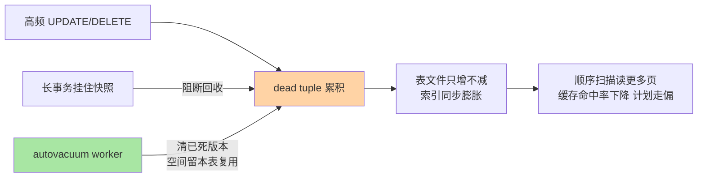
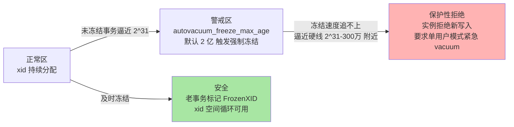

# MVCC 与 VACUUM 深度：xmin/xmax 版本账本、表膨胀与事务 ID 回卷

> 入门层讲过「PG 的 MVCC 旧版本留在表内、靠 VACUUM 回收」的结论，本篇拆机制：一行数据怎么带上 xmin/xmax 时间戳、快照判定可见性的完整链路、dead tuple 怎么把表撑到膨胀、autovacuum 的触发公式怎么调，以及最凶险的事故形态——事务 ID 回卷。

## 一句话摘要

PG 的 MVCC 是**表内版本化**：每行头部带 xmin（创建它的事务 ID）与 xmax（删除/更新它的事务 ID），UPDATE 不是原地改而是「旧行标 xmax + 新行插入」，DELETE 只标 xmax——旧数据物理上还躺在表里。读事务拿一个**快照**（在 procarray 里注册的 xid 边界），判定规则一句话：xmin 已提交且在快照之前、且 xmax 为空或未提交或在快照之后，这行对我可见。于是表的物理体积里同时装着所有历史版本，没人清理就一直涨——这就是**表膨胀**。回收工作是 VACUUM 的职责：清 dead tuple、释放空间给本表复用（不是还给操作系统），顺带冻结老事务 ID；autovacuum launcher 按「dead tuple 数超过 阈值 + 表大小 × scale_factor」触发 worker。最后一层风险藏在事务 ID 的 32 位空间里：XID 是循环使用的，老事务必须被 VACUUM **冻结**（标记为「永远过去」），否则回卷会让历史数据突然「变成未来」——这是 PG 数据库里少数能让实例拒绝服务的内置保护机制。

## 🎯 本文核心

**核心一句话：PG 把版本链摊在表里（xmin/xmax 行内账本），把回收责任外包给 VACUUM——这个设计的直接代价是表膨胀风险与 autovacuum 调优义务，极端代价是事务 ID 回卷保护；对照 InnoDB 的 undo 链设计，PG 选择的本质是「读路径零回溯、写路径欠账后还」。**

机制链：写事务分配 xid → 行头记 xmin/xmax → 读事务从 procarray 取快照 → 可见性判定决定看到哪个版本 → dead tuple 累积 → autovacuum 按 scale_factor 公式触发 worker 回收 + 冻结老 xid → freeze 落后逼近 2^31 警戒线触发 anti-wraparound 强制 vacuum。一张判定链路图：



## 5W 速记卡

| 维度 | 一句话 |
|---|---|
| What | xmin/xmax 行内版本 + 快照判定 + VACUUM 回收 dead tuple + 冻结防 xid 回卷 |
| Why | 表内版本化让读不回溯 undo；代价是膨胀必须有人收拾 |
| When | 表只涨不缩排查时、autovacuum 调参时、xid 告警出现时 |
| Where | pg_stat_user_tables.n_dead_tup、pg_class.reltuples、autovacuum 源码 autovacuum.c |
| How | 监控 n_dead_tup/reltuples 比例，大表按表覆盖 scale_factor，长事务是头号敌人 |

## 一、边界：入门层讲过什么，本篇讲什么

| 内容 | 入门层（篇 3） | 本篇 |
|---|---|---|
| MVCC 基本结论：旧版本留表内、读不加锁 | ✅ 讲过 | 不重复，直接拆行结构与判定 |
| xmin/xmax/t_cmin/t_cmax 四元组 | 提了名字 | **本文核心：字段语义与可见性判定链** |
| 表膨胀现象与 VACUUM 存在性 | 提了概念 | **本文核心二：膨胀账本与 autovacuum 触发公式** |
| 事务 ID 回卷 | 未讲 | **本文核心三** |
| 索引与 MVCC 的交互（索引膨胀） | 未讲 | 展开一节 |

## 二、行头账本：xmin、xmax 与 t_ctid

### 2.1 四个字段各管什么

PG 堆行（tuple）头部的 t_xmin/t_xmax 是事务 ID，t_cmin/t_cmax 是**命令 ID**（clog 序号，同一事务内多条纹语句的先后标记——注意 cmin/cmax 共享同一存储，同一事务内要么插入命令号要么删除命令号，不是同时有两个值）。t_ctid 指向本行的「新版本」位置——UPDATE 链就靠它把新旧行串起来。

一个高频更新的行，物理上长这样（示意）：

```sql
-- 查看行版本账本的最小实验（事务内自查）
BEGIN;
CREATE TABLE t_demo (id int, val text);  -- 实验表
INSERT INTO t_demo VALUES (1, 'v1');
UPDATE t_demo SET val = 'v2' WHERE id = 1;
SELECT xmin, xmax, cmin, cmax, ctid, val FROM t_demo;
-- 观察: 新行 xmin=当前事务ID, xmax=0(还活着); 旧行已被本轮 vacuum 前的视图跳过
ROLLBACK;
```

```sql
-- 生产排查: 数一张表的 dead tuple 存量与占比
SELECT relname, n_live_tup, n_dead_tup,
       round(n_dead_tup * 100.0 / greatest(n_live_tup,1), 1) AS dead_pct,
       last_autovacuum
FROM pg_stat_user_tables
ORDER BY n_dead_tup DESC LIMIT 10;
```

关键认知：**UPDATE = 旧行标 xmax + 新行插一次**，连主键没变也一样。所以高频 UPDATE 的表，写放大天然存在——每更新一次就多一个版本，直到 VACUUM 收走。

### 2.2 快照怎么取：procarray 里的边界

**追问：快照到底是什么东西？**
不是"某一时刻全库的备份"，而是一对边界加一个列表：快照记录「当前已分配到的最大 xid（xmax 边界）」与「取快照瞬间还在跑的 xid 列表（xip 列表）」。判定可见性时：xmin < 快照边界且不在 xip 里且已提交 → 对我而言"发生在过去"；否则"是未来或进行中"，不可见。源码路径在 `src/backend/storage/ipc/procarray.c` 的 `GetSnapshotData`——所有 backend 从同一个共享数组 procarray 里扫出活跃事务，这就是快照的成本来源（高并发下这是一条热点路径，新版本对此有持续优化，公开口径）。

**再追问：长事务为什么是万恶之源？**
因为它的 xid 会出现在**所有**后续快照的 xip 列表里——只要它活着，它启动之前的所有旧版本都必须保留（它可能随时读）。于是 autovacuum 对这些 dead tuple 无能为力：清了它就读不到了。这解释了所有膨胀事故的共同起点：一个被遗忘的连接（跑批挂起、备份工具、监听器）开着 `idle in transaction` 几天，期间高频更新的表版本堆成山。

**打破砂锅：快照为什么挂在每个进程自己的状态里，而不是全局一份？**
因为 MVCC 的语义就是「每个事务看到自己的时间点」——全局只存事实（procarray 里的活跃事务与提交记录 pg_xact/pg_subtrans 的提交位图），快照是每个读事务按需从事实推导的视图。这个「共享事实 + 私有视图」的设计思想，让读事务之间零协调：读不阻塞写、写不阻塞读的并发模型，全部建立在这套推导上。

### 2.3 为什么不选 InnoDB 式的 undo 链

这是 PG 与 MySQL 分叉最深的一刀，值得把反方案摆全：

| 维度 | PG 表内版本化 | InnoDB undo 链 |
|---|---|---|
| 旧版本位置 | 留在堆表里 | undo 表空间/回滚段 |
| 读旧版本 | 直接读旧行，零回溯 | 沿 undo 链回溯构造 |
| 空间形态 | 表膨胀风险，VACUUM 还 | undo 膨胀风险，回滚段清理 |
| UPDATE 写放大 | 每次更新全行复制（TOAST 外的大字段有优化） | 主键更新外多为原地改 + undo 记录 |
| 回滚成本 | 标记中止即可，物理上"反正没覆盖旧版" | 沿 undo 反向应用 |

**为什么不选 undo 方案？**PG 的回答是读路径：undo 链把成本压在读侧（长事务期间任何快照读旧版本都要走链），表内版本化把成本压在写侧（写时多复制一份）+ 后台清理。OLTP 读多写少的典型负载下，「读便宜写贵」更划算；这也是为什么 PG 的高频 UPDATE 场景反而更需要 VACUUM 调优——**两边都有长事务病，只是病灶位置不同：InnoDB 长事务堵的是 undo 清理，PG 长事务堵的是表回收**。为什么不选「原地更新 + 双缓冲」等其他方案？原地改必须先写 undo 才能保证一致性读，绕回 undo 方案；纯追加写（LSM 形态）则把读放大问题换成合并复杂度，PG 堆表要服务的是通用 OLTP 的点查与范围读，不是写吞吐优先的场景。

## 三、表膨胀：dead tuple 的账本与 autovacuum 触发公式

### 3.1 膨胀怎么发生



三个必须分清的概念：**dead tuple**（行已不可见于任何未来快照，等回收）；**空间复用**（VACUUM 清出的空间标记为可复用，还给本表的 FSM——第 1 篇讲的 fsm fork 在这里接上，但不会缩减表文件）；**真正缩表**（VACUUM FULL 重写整表拿排他锁，或 pg_repack 类工具在线重写，生态方案公开口径）。生产上「表 100GB、有效数据 30GB」的经典形态，多数是前两者欠账多年的结果。

### 3.2 autovacuum 的触发与调参

触发公式（公开口径，PG12+ 含 autovacuum_vacuum_insert_scale_factor 一并给出）：

```
触发条件 = n_dead_tup > autovacuum_vacuum_threshold
         + autovacuum_vacuum_scale_factor × reltuples
默认: threshold = 50, scale_factor = 0.2
```

解读这张账：默认公式意味着**2000 万行的表要攒 400 万 dead tuple 才触发**——大表的 scale_factor 太钝，这是调参的第一共识。业内惯例的分档（业内认知）：

| 表量级 | 惯例做法 | 为什么 |
|---|---|---|
| 小表（<10 万行） | 默认即可 | 阈值 50 + 20% 已经足够灵敏 |
| 中表（百万级） | scale_factor 压到 0.05-0.1 | 让触发更跟手，代价是 vacuum 更频繁 |
| 大表（千万到亿级） | 按表覆盖：scale_factor 0.01-0.05 或改用绝对阈值 | 20% 的绝对值太大，等不起 |
| 高频更新热表 | 叠加 autovacuum_vacuum_cost_limit 调大 / cost_delay 调小 | 让单轮 vacuum 干得动，追上产生速度 |

成本限速是第二层旋钮：autovacuum worker 每处理一个缓冲要「花费」成本额度，超过 vacuum_cost_limit 就睡 vacuum_cost_delay——这套节流默认是保护业务 IO 的，但对「dead tuple 产生速度 > 清理速度」的热表就成了永远追不上的死循环。为什么默认值偏保守？因为 autovacuum 的设计思想是**后台温柔公民**：宁可慢，不可抢业务的 IO——调参就是在「温柔」与「追得上」之间重新定价。

**事故复盘一：追不上的热表**。某线上配置表每秒被更新数百次（匿名化复述的常见模式），autovacuum 按默认参数每天跑一轮，dead tuple 常年 30%+，查询越来越慢。排查路径：pg_stat_user_tables 看到 n_dead_tup 巨大且 last_autovacuum 显示"跑过但没用"→ 复盘结论是「跑得完一轮，追不上一天」；修复按表覆盖 scale_factor=0.02 + cost_delay=0，让 worker 短平快高频跑，膨胀率回到个位数。

**事故复盘二：长事务冻结全场**。同一个系统另一次故障：跑批任务断连后留下一个 `idle in transaction` 三天的会话，期间核心订单表 UPDATE 千万次，autovacuum 全程无法回收（快照挂住），表体积翻倍，磁盘告警。修复顺序也值得记：先杀长事务释放快照 → 手动 vacuum 观察回收进度（pg_stat_progress_vacuum，公开口径视图）→ 最后才是加「长事务超时告警」。教训的排序：**预防（idle_in_transaction_session_timeout）远比事后缩表便宜**。

### 3.3 索引的膨胀：MVCC 的连带账单

index-only scan 之外，索引条目本身也有 MVCC 问题：堆里的行死了，索引里的对应条目不会立刻消失——VACUUM 会顺带清理索引条目（这是 vacuum 要扫索引的原因）。但高频更新的表，索引膨胀往往比表膨胀更隐蔽：B-tree 页里大量半死条目让索引又高又厚。业内惯例（业内认知）：REINDEX CONCURRENTLY（PG12+）在线重建；持续膨胀的先查 autovacuum 是否追平，再查更新模式（只更新非索引列是良方——被更新列不在任何索引里时，HOT 链可以不进索引，这是 PG 的 HOT update 优化，公开口径）。

## 四、事务 ID 回卷：32 位循环的定时炸弹

### 4.1 机制推演

XID 是 32 位无符号整数，用完不是报错而是**循环**——比较大小用的是模运算下的环形距离。环形世界里「过去/未来」是相对的，必须有人把足够老的事务**冻结**成特殊标记（FrozenXID，视为"无限过去"，永可见），否则一旦回卷点越过未冻结事务，历史数据会突然被判定为"来自未来"而不可见——数据层面等于灾难。



**追问：为什么不干脆把 xid 扩成 64 位，一劳永逸？**
答案是账本代价：行头的 xmin/xmax 存的就是 xid，从 32 位扩到 64 位意味着**每一行的头部膨胀**——亿级行的库，行头涨几个字节就是 GB 级的存储与缓存放大。社区的折中是 64 位纪元（epoch，公开口径）辅助环形比较，行内仍存 32 位短 ID——空间与安全之间，这个折中就是现状。所以回卷防护在可见的未来仍是必答题，不是历史遗留。

关键参数账（公开口径默认值）：vacuum_freeze_min_age=5000 万（多老才值得冻结）、autovacuum_freeze_max_age=2 亿（强制 anti-wraparound vacuum 的触发线）、硬保护线约在 2^31 减去余量处——到达后实例拒绝分配新 xid，报错形态是 "database is not accepting commands to avoid wraparound data loss"。2^32 的 xid 空间 ÷ 2 亿的警戒距离，意味着**每个 xid 空间周期内必须至少完成一轮全库冻结**；写热点库 xid 消耗快（每个写事务至少消耗一个），业内有大型系统按天烧掉上亿 xid 的案例（业内认知），冻结节奏必须独立监控。

**事故复盘三：拒绝服务的清晨**。某系统长期忽视 xid 消耗监控，某个库的 anti-wraparound vacuum 长期被业务高峰挤占（成本限速下跑得极慢），某天逼近硬线，实例开始拒绝写入，业务停摆（匿名化复述的公开案例模式）。复盘结论三条：xid 余量（pg_current_xact_id 距离 2^31 的环形距离，业内有现成监控口径）必须进告警；anti-wraparound vacuum 的会话不允许被 cost 限速卡死（紧急场景调大 cost_limit）；大表 freeze 慢的根因往往是「多年未按 min_age 冻结、一次补课」，日常小步冻结才是正解。

### 4.2 源码/关键路径

VACUUM 主流程在 `src/backend/access/heap/vacuumlazy.c`（新版本重命名过，公开口径）：扫堆页 → 按 VM 跳过干净页（第 1 篇的 vm fork 在此接上）→ 回收 dead tuple → 索引清理阶段 → 冻结老 xid（freeze 逻辑在 heapam 层）。autovacuum 的调度者在 `src/backend/postmaster/autovacuum.c`：launcher 每 autovacuum_naptime（默认 1 分钟）醒来，按统计信息挑表 fork worker，worker 数量上限 autovacuum_max_workers（默认 3）。触发判断的数据源是 pg_stat_user_tables 的 n_dead_tup/n_mod_since_analyze（统计收集器维护），表大小与上次 vacuum 时间从 pg_class 读——所以**统计信息本身不实时**，刚灌完大表的库要手动 ANALYZE/VACUUM 补一次基线。

## 五、量级三档：膨胀治理的规模账

约束来源先钉死：**回收速度与膨胀产生速度的赛跑**，两个速度都随表规模与写入 QPS 线性涨，但治理手段的成本是阶梯跳变的。

| 量级 | 这一档的核心问题是 | 思考方式 |
|---|---|---|
| 十万级写入/日 | 这一档的核心问题是**默认参数对不对**，而不是工具——默认 autovacuum 全够，别乱动 | 默认值驱动 |
| 百万到千万级热表 | 这一档的核心问题是**参数追不追得上**——按表覆盖 scale_factor + 放开 cost 限速，让后台跑赢前台 | 预算驱动：把 IO 预算分给 autovacuum |
| 亿级大表/全天高峰 | 这一档的核心问题是**架构形态**——分区把大表拆成小表让 vacuum 单元变小、更新改造成 append 形态、冷热分离 | 架构驱动：缩小回收单元 |

收尾两件套：自下而上看，从默认参数到分区架构，每一档的升级都由同一个信号触发——dead_pct 常态化超标且 vacuum 时长持续劣化；触发升级前先确认上一档的手段已用尽，直接跳档会造成运维复杂度的浪费。

## 六、💡 实战提示

💡 **盯两个比例就够日常巡检**：n_dead_tup/n_live_tup 超过 10-20% 告警（业内认知阈值），pg_class.reltuples 与实际 count 的偏差反映统计新鲜度。不要等表体积翻倍才动手。

💡 **长事务监控先于一切调参**：pg_stat_activity 里 state='idle in transaction' 超过阈值的会话直接告警 + 配 idle_in_transaction_session_timeout 兜底。90% 的膨胀事故起点是一个被遗忘的连接（业内认知）。

💡 **xid 余量单独建监控**：距警戒线的环形距离按日环比，跌速异常（写热点突增）提前介入。这是 PG 里少有的「不处理会自毁」的机制，优先级高于一切性能问题。

💡 **vacuum 不是敌人，是环卫工**：看到 autovacuum 占 IO 就杀进程是反模式——它不跑，膨胀和 xid 风险一起回来。正解是调它的速度，不是关它。

## 七、你们可能会问

**Q1：VACUUM 之后表文件会变小吗？**
普通 VACUUM 不会——清出的空间留在表内复用（通过 FSM）。要还给操作系统得 VACUUM FULL（重写整表，排他锁，业务停写）或 pg_repack 类在线工具（生态方案，公开口径）。惯例：能靠复用解决就不缩表，缩表安排在维护窗口。

**Q2：为什么 autovacuum 明明在跑，膨胀还是控制不住？**
三个常见缺口：一是 cost 限速让 worker 慢于产生速度（看 pg_stat_progress_vacuum 的实际推进）；二是长事务挂快照，dead tuple 根本"不 dead"（查 pg_stat_activity 与复制槽——**复制槽滞后是另一个隐藏长事务**）；三是 scale_factor 对大表太钝，还没触发就先膨胀了。三个缺口对着查，命中率极高（业内认知）。

**Q3：t_cmin/t_cmax 为什么我在表里查不到真实值？**
cmin/cmax 只在**同一事务内**有意义（判断本事务后续命令能否看到前面的写入），跨事务查询时它会被重用为组合值（combo cid），不能当时间戳用。要还原"这行是谁什么时候写的"，惯例是应用层加 created_by/created_at 字段，别指望系统列（业内认知）。

**Q4：HOT update 是什么，为什么它重要？**
更新时若新版本能放进同一页、且更新的列不涉及任何索引，则走 HOT（Heap-Only Tuple）：不插入新索引条目，靠页内的版本链。它把「更新一行 = 动所有索引」降为「只动堆」，是高频更新表的头号优化方向。做法：fillfactor 留空隙（第 1 篇的页结构）+ 更新列与索引列解耦。

## 八、什么时候用/不用与 Trade-off

| 场景 | 推荐 | 不推荐 |
|---|---|---|
| 日常膨胀治理 | 监控 + 按表覆盖 autovacuum 参数 | 出事才 VACUUM FULL 突击 |
| 高频更新热表 | HOT 优化 + fillfactor + 拆更新列 | 放任全行复制全索引维护 |
| 大表历史数据 | 分区 + 冷数据分离 | 单表亿行硬扛 vacuum |
| 已膨胀表的收缩 | pg_repack 类在线工具 | 高峰期 VACUUM FULL |

Trade-off 的锚点是**读写成本的位置**：PG 表内版本化把成本放在写侧与后台清理（写放大 + VACUUM 义务），换来读路径零回溯与回滚近零成本；InnoDB undo 链把成本放在读侧与回滚（快照回溯 + undo 清理），换来写入更省。没有免费方案，只有「你的负载读多还是写多」的匹配题。量级提醒：单表到亿级，这套表内版本化 + 后台回收的模型开始吃力，分区的本质是把「一个巨型回收单元」拆成「多个小型回收单元」——成本模型没变，单元变小了。

## 开放问题

- undo 层回归的讨论在社区从未停止（公开口径）：未来版本若引入独立 undo 结构，本篇的整套膨胀治理心智要不要重学，值得持续跟踪版本演进
- 回看十年演进（公开口径）：从 VACUUM 的单进程形态到并行 vacuum、从统计收集器进程到共享内存统计，回收链路一直在变快；但「表内版本化 + 后台回收」的底层模型自诞生以来未变——治理思路的半衰期比参数长得多
- autovacuum 的多 worker 协同调度对超多表库（数万张表的分片库）仍偏粗放，按表优先级调度的改进讨论持续多年（公开口径）

## 🎯 核心带走

- **核心一句话**：xmin/xmax 行内账本 + 快照推导 = 读不阻塞写；代价三件套 = 表膨胀（n_dead_tup 监控 + scale_factor 按表调）+ 索引连带膨胀（HOT/REINDEX）+ xid 回卷风险（冻结监控不可关）
- **最小动作集**：巡检两个比例、长事务告警、xid 余量告警、大表按表覆盖 autovacuum 参数
- **哪里会破**：长事务/复制槽挂快照 → 膨胀失控；anti-wraparound 被 cost 限速卡死 → 回卷拒绝服务；高频更新没走 HOT → 索引翻倍膨胀
- **取舍锚点**：读便宜写贵的表内版本化 vs 写省读贵的 undo 链——按负载选，别按信仰选

## 自测三问

1. 为什么 PG 的 DELETE 不释放空间而 InnoDB 也一样要后台清理？各自的机制名字与位置？——答出「PG dead tuple 在堆内靠 VACUUM / InnoDB undo 标记靠 purge」算过。
2. autovacuum 默认触发公式是什么？大表为什么要按表覆盖？——答出「threshold + scale_factor × reltuples，20% 对大表太钝」算过。
3. 长事务拖垮回收的完整链路？——答出「xid 挂进所有后续快照 xip → 旧版本不能清 → autovacuum 无能为力」算过。

## 📌 数据与事实声明

- 写于 2026-09-24；默认参数（autovacuum_vacuum_scale_factor=0.2、threshold=50、freeze_min_age=5000 万、freeze_max_age=2 亿、max_workers=3、naptime=1min 等）以 PostgreSQL 官方文档当前口径为准
- xid 硬保护线、HOT update、HOT/combo cid 等机制语义以官方文档与源码为准，函数名与文件名随版本演进可能调整
- 膨胀比例阈值、xid 消耗速度、案例均为业内认知或公开技术社区匿名化模式复述，非特定系统数据

## 📚 参考资料

| 类型 | 标题 | 来源 |
|---|---|---|
| 官方文档 | PostgreSQL: Routine Vacuuming（autovacuum/冻结/回卷防护） | postgresql.org/docs/ |
| 官方文档 | PostgreSQL: Monitoring Stats（pg_stat_user_tables/pg_stat_progress_vacuum） | postgresql.org/docs/ |
| 官方源码 | vacuumlazy.c / autovacuum.c / procarray.c | github.com/postgres/postgres |
| 公开口径 | pg_repack 在线重组织工具 | github.com/reorg/pg_repack |
| 系列内链 | 本系列：进程模型与存储布局深度（fsm/vm fork 基础） | [1_进程模型与存储布局深度-特性.md](1_进程模型与存储布局深度-特性.md) |
| 系列内链 | 入门层：MVCC 与索引的机制差异 | [../../入门层/从零开始认识PostgreSQL系列/3_MVCC与索引的机制差异-入门.md](../../入门层/从零开始认识PostgreSQL系列/3_MVCC与索引的机制差异-入门.md) |
