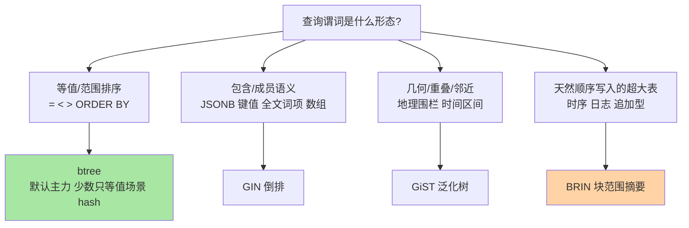
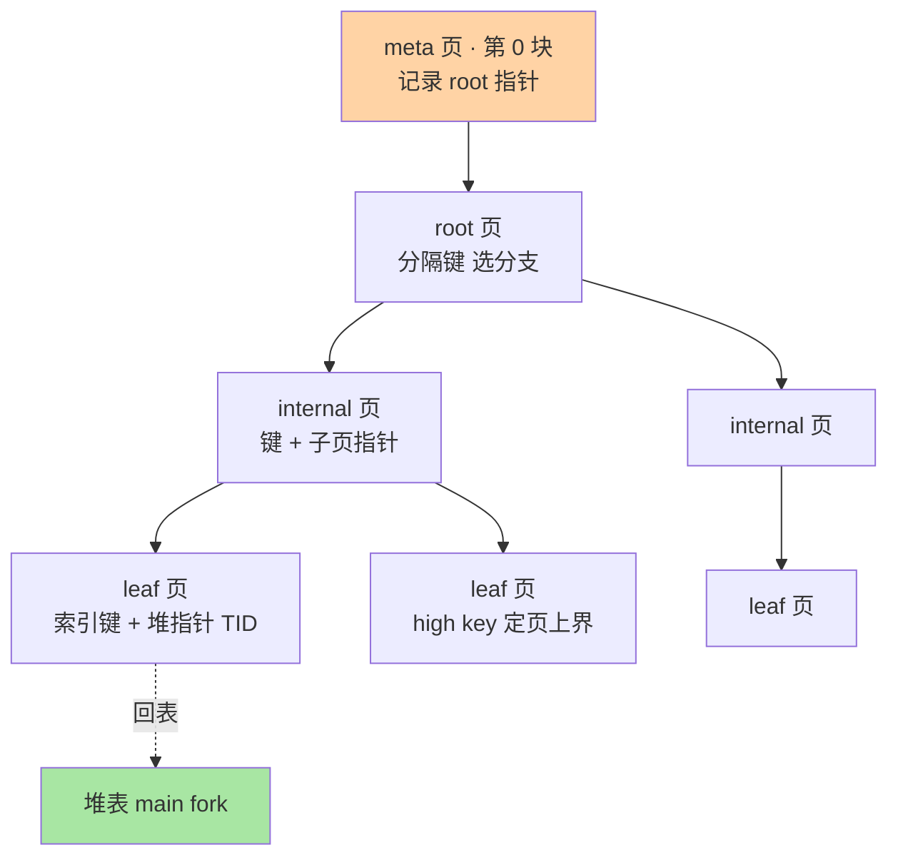
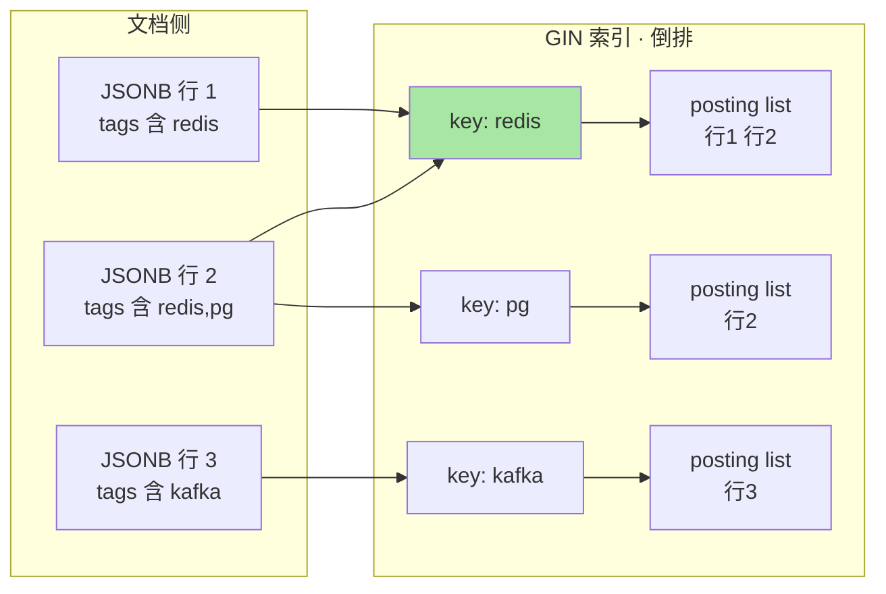

# 索引家族全景：B-tree 之外——GIN、GiST、BRIN、Hash 与选型决策

> 入门层讲过 B-tree 的机制与 MVCC 对索引的连带影响，本篇补全家族图谱：B-tree 的页内结构、GIN 的倒排账本、GiST 的泛化框架、BRIN 的极简摘要、Hash 的翻身史，最后收敛成一张选型决策表——「什么时候建什么索引」不再靠记忆，靠数据形态推理。

## 一句话摘要

PG 的索引不是一种结构而是一个**访问方法（AM）插件体系**：pg_am 系统表登记了 btree/gin/gist/brin/hash/spgist 六种内置 AM，每种只承诺「给我一个操作符类，我回答哪些行匹配」。B-tree 是通用主力（页结构为 meta/root/internal/leaf 层级，页内有序数组二分查找），只服务可排序且能比较的查询；GIN 是**倒排**结构（key → 行位置列表/树），为「包含」语义而生——JSONB 键值、全文检索词项；GiST 是**泛化搜索树框架**（R-tree 变体家族），为几何/范围/邻近语义而生，还支撑排除约束；BRIN 是**块范围摘要**（每 N 个块记 min/max），几十 MB 摘要索引亿级行表，前提是物理顺序与列值强相关；Hash 在 PG10 后补齐 WAL 记录终于可用于生产，但只服务等值。选型的本质不是「哪个高级」，而是**查询谓词语义与数据物理形态的匹配**：谓词决定 AM 家族（等值范围→btree/hash，包含→GIN，几何→GiST，顺序相关范围→BRIN），形态决定该 AM 能不能发挥（BRIN 遇乱序数据直接退化）。

## 🎯 本文核心

**核心一句话：PG 索引选型是两步推理——第一步按谓词语义选 AM（btree 通用但最大，GIN 解决包含，GiST 解决空间与范围重叠，BRIN 用摘要换体积，hash 只等值），第二步按数据物理形态验证 AM 的前提（BRIN 要顺序相关、GIN 要接受更新代价、部分索引要谓词稳定）；两步都对，索引才生效。**

机制链：建索引 → pg_am 选访问方法 → pg_opclass 绑定操作符类 → 索引按 AM 结构组织 → 查询谓词被优化器匹配到对应操作符 → AM 回答"哪些块/哪些行" → 回堆取完整行。选型决策树：

## 5W 速记卡

| 维度 | 一句话 |
|---|---|
| What | 六种内置 AM（btree/GIN/GiST/BRIN/hash/SP-GiST）+ 部分索引/表达式索引/INCLUDE 三种横切玩法 |
| Why | AM 插件化让每种谓词语义都有对口结构，通用 btree 不必大包大揽 |
| When | JSONB/全文慢查询、亿级大表索引太大、地理与范围查询、索引膨胀治理 |
| Where | pg_am/pg_index 系统表、pg_stat_user_indexes 使用统计、源码 access/ 目录各 AM 子目录 |
| How | 先看谓词再看数据形态，最后用 EXPLAIN 验证走没走（第 4 篇展开） |

## 一、边界：入门层讲过什么，本篇讲什么

| 内容 | 入门层 | 本篇 |
|---|---|---|
| B-tree 基本原理、为什么范围查询快 | ✅ 讲过 | 不重复，补**页级物理结构** |
| 索引与 MVCC 的连带（索引膨胀、HOT） | ✅ 篇 3 讲过 | 只引用结论 |
| GIN/GiST/BRIN/Hash | 未讲 | **本文核心** |
| 部分索引/表达式索引/INCLUDE | 未讲 | **本文核心二** |
| 优化器怎么决定用不用索引 | 未讲 | 留给第 4 篇 |

## 二、B-tree 页结构：从「树」到「页内有序数组」

入门层讲了树形逻辑，本篇下探一层：每个 B-tree 索引是一组 8KB 页（第 1 篇讲过页与 fork），页分四类角色——meta 页（固定第 0 块，记根位置）、root、internal、leaf。真正的查找发生在**两个层级**：树层级从根往下选分支（内部页的分隔键，含 high key 上界），页层级在叶页内部的**有序 ItemId 数组上二分**。

**追问：页内为什么是二分而不是页内哈希？**
因为叶页还要服务**范围扫描**：二分定位到起点后沿叶子链（兄弟指针）顺序扫，等值只是范围扫描的特例。页内哈希只能答"在不在"，答不了"接下来是谁"——B-tree 的核心资产是**有序性**，一切范围、排序、前缀能力都从这里来。这也是为什么 hash 索引只有等值可用的原因（后面展开）。

**再追问：为什么 PG 的 B-tree 索引条目比想象中大？**
因为索引条目带 MVCC 负担：堆里的行死了，索引条目要等 VACUUM 清理（第 2 篇讲过）。另外 PG 的索引没有「覆盖即免回表」的天然优化——补这刀的是 INCLUDE 子句：`CREATE INDEX ON t(a) INCLUDE (b)` 把 b 塞进叶页但不参与键排序，让 index-only scan 能覆盖更多查询（公开口径，PG11+）。业内惯例（业内认知）：INCLUDE 用于「查询要取的列多、但又不希望它们扰动排序语义」的场景，代价是叶页变厚、缓存命中率摊薄。

## 三、GIN：倒排账本与「包含」语义

### 3.1 结构与代价

GIN（Generalized Inverted Index）的本质是**倒排**：从「值 → 行」变成「词/键 → 行列表」。对 JSONB，索引的 key 是「键路径 + 值」；对全文检索，key 是词位（lexeme）。命中一个 key 后拿到的不是单行而是一串堆位置（posting list，长了升级为 posting tree）。

代价也来自倒排本源：一行 INSERT 涉及 N 个 key，就要在 N 个倒排位置挂账——**更新代价与行的 key 数成正比**。GIN 的缓解机制是 fastupdate：更新先进每索引一个的 pending list（未排序缓冲区），攒到 gin_pending_list_limit（默认 4MB，公开口径）再批量合并进倒排主结构。这是把写延迟转嫁成「后台合并 + 查询偶发变慢」——查询碰到 pending list 时要顺带扫它。

### 3.2 事故复盘：JSONB 写多读少的组合拳

某线上系统用 JSONB 存商品扩展属性，GIN 索引建好后读查询毫秒级，但批量导入时段写入吞吐掉一个量级（匿名化复述常见模式）。排查路径：pg_stat_activity 里大量进程等待在 GIN 页的锁上 → 看 pending list 反复触发合并 → 复盘结论：**导入节奏与 pending list 阈值打架**——攒到 4MB 就同步合并一次，合并时锁住主结构。修复两条：导入窗口临时 `SET fastupdate = off`（该会话直写主结构，避开反复合并），或导入前 drop 索引导完重建——亿级行形态下「后建索引」比「边写边维护」快一个量级以上（业内认知）。

**追问：为什么 JSONB 查询不建普通 B-tree 表达式索引就好？**
对**稳定的提取路径**（如 `data->>'status'`）表达式 B-tree 完全成立且更小——这是为什么有些团队只给高频谓词建表达式索引。**为什么不选它作为默认方案？**因为 JSONB 的查询形态是开放的：今天查 status、明天查 tags 包含、后天全文模糊——GIN 一次建好服务全部 key，表达式索引一个谓词一个。选型分界（业内认知惯例）：谓词封闭且高频 → 表达式 B-tree；谓词开放或包含/全文语义 → GIN。两者叠加（GIN 主索引 + 热点谓词表达式索引）是大表 JSONB 的成熟形态。

## 四、GiST 与 BRIN：一个管空间，一个管体积

### 4.1 GiST：泛化搜索树框架

GiST 不是一棵具体的树，而是**框架**：实现「键的合并、一致性与惩罚函数」就能长出一棵自己的树——地理数据的 R-tree 变体、范围类型索引、近邻排序（KNN，`<->` 操作符）都长在这框架上。实用场景四类：PostGIS 地理围栏（生态公开口径）、时间/区间类型的重叠查询、排除约束（EXCLUDE，如「同一房间预定时间不得重叠」的数据库级保证）、KNN 最近邻。为什么空间数据不选 B-tree？因为「包围盒重叠」这种谓词没有全序关系——你无法把二维区域排成一条线还保持查询语义，R-tree 家族的树形分割是几何数据的正解。**为什么 GIS 老用户还常提 SP-GiST？**它是另一套框架（空间分区树，kd-tree/四叉树形态），对非重叠分割的数据更省空间，本文点到为止（公开口径文档为准）。

### 4.2 BRIN：亿级表的几十 MB 摘要

BRIN（Block Range Index）的思路极端简约：把表按块分成组（pages_per_range 默认 128，公开口径），每组只记 min/max 摘要。查询时先查摘要排除不可能的块组，再精查候选块。它的体积极小（亿级行、宽数百字节的表，BRIN 通常 MB 量级，B-tree 则 GB 量级——业内认知的常见比例），前提只有一个：**列的物理顺序与值顺序强相关**（correlation 高）。

**打破砂锅：为什么物理顺序这么关键？**
因为摘要的粒度是「块组」——若块组内 min/max 跨度巨大（乱序数据），摘要就失去排除能力，查询退化成「几乎所有块组都候选」，等于全表扫描还多付一层摘要查询。时序表（按时间追加写）、自增主键表是天然适配形态；随机更新的表是天然不适配形态。

**事故复盘：建错顺序的 BRIN**。某系统把 BRIN 建在一张「按客户号写入但按时间查询」的宽表上（匿名化复述），上线后查询没变快。排查路径：EXPLAIN 显示 Bitmap Heap Scan 扫的块数与全表扫接近 → 查 pg_stats 的 correlation 列接近 0 → 复盘结论：**写入顺序与查询列无关，BRIN 前提不成立**；修复是把表改为按时间分区 + 各分区内部天然时间序，BRIN 摘要立即恢复排除能力。教训一句话：BRIN 是「数据形态的索引」，先看形态再谈索引。

### 4.3 Hash 的翻身与局限

Hash 索引早期（PG10 前）不记 WAL、崩溃后可能损坏，是半废弃状态；PG10 起补齐 WAL 记录后可用于生产（公开口径）。但定位仍是窄场景：**只有等值**（无范围、无排序、无唯一约束支持），且它相对 B-tree 等值的优势（O(1) 理论）在实践中常被 B-tree 的缓存友好性抵消。**为什么不选 hash 当默认？**业内人士共识（业内认知）：等值场景 B-tree 已经够快，hash 省 O(log n) 但页结构对范围缓存不友好，收益场景极少——它存在的意义更多是补全语义，不是替代 B-tree。

### 4.4 AM 插件体系的设计思想

把六种 AM 放回一起看，PG 的底层设计哲学就浮出来了：**索引访问方法是一个开放接口，不是一个内置清单**。pg_am 系统表登记每种方法的回调（建页、查键、插入、清理），扩展可以注册全新 AM——生态里的列存与向量检索扩展（公开口径的项目）正是从这个口子长出来的。这与第 1 篇讲的「系统目录自描述」一脉相承：数据库自己的元数据也是普通表，扩展登记自己走的也是同一套目录机制。对照 InnoDB 的架构：MySQL 把索引做进引擎内核（B+ 树是唯一主力，全文索引是特化的独立实现），扩展性体现为「换引擎」；PG 把扩展性下沉到「换访问方法」——粒度差一个层级，生态形态就完全不同：前者长出存储引擎生态，后者长出索引与类型生态。理解这一点，再看六种内置 AM 就不是「六个要背的名字」，而是同一接口下的六个实现样例——看懂一个，其余按语义对号入座。

## 五、横切三件套：部分索引、表达式索引与使用统计

### 5.1 部分索引与表达式索引

部分索引只索引**满足 WHERE 的行**：`CREATE INDEX ON orders(created_at) WHERE status = 'pending'`——订单表 99% 是历史单、活跃单只有几万行的典型形态下，索引体积缩两个量级。表达式索引把**函数结果**作为键：`CREATE INDEX ON users(lower(email))`。两者的共同前提是**查询谓词必须与索引谓词/表达式精确匹配**（优化器按语义匹配，不是模糊匹配），这也是它们最常见的失效原因。

**事故复盘：部分索引"没生效"**。某系统建了 `WHERE status='pending'` 的部分索引，查询仍全表扫（匿名化复述）。排查路径：EXPLAIN 看谓词形态 → 发现应用传参是 `status = $1` 且参数类型不匹配（varchar vs text 的隐式差异）导致谓词不匹配 → 统一类型后命中。复盘沉淀的规则：部分索引上线必须用 EXPLAIN 验证命中形态（第 4 篇展开验证方法），且查询侧谓词要写成与索引定义**字面一致**。

### 5.2 业内惯例：索引的运维账

生产索引治理的惯例清单（业内认知）：① 定期看 pg_stat_user_indexes 的 idx_scan——长期为 0 的索引是「只耗写放大不赚读加速」的负资产，下线前观察一个完整业务周期；② 索引数量与写吞吐直接挂钩，每加一个索引，该表每次 UPDATE/INSERT 都多一份维护账（第 2 篇 HOT 优化的前提是更新列不在任何索引里）；③ 重建用 REINDEX CONCURRENTLY（PG12+，公开口径）避免锁表；④ 建索引本身用 CREATE INDEX CONCURRENTLY，代价是更长的构建时间与失败后留 invalid 索引（查 pg_index.indisvalid 清理）。

## 六、量级三档：索引选型的规模账

约束来源钉死：**索引体积 × 写放大 × 缓存占用的三边账**，随行数线性涨，但「换 AM」能改变系数。三档的核心问题：

| 量级 | 这一档的核心问题是 | 思考方式 |
|---|---|---|
| 十万行以内 | 这一档的核心问题是**要不要索引**，而不是选哪种——全表扫描可能比任何索引都快（第 4 篇代价模型展开） | 成本直觉驱动：先不建 |
| 百万到千万级 | 这一档的核心问题是**匹配谓词形态**——B-tree 默认，特殊谓词换对口 AM | 谓词驱动：按查询形态建 |
| 亿级以上 | 这一档的核心问题是**体积与更新代价**——BRIN 换体积、分区换单元、部分索引换命中率，别让二级索引总价比表还贵 | 系数驱动：换结构不改问题 |

这一档再往上就进入架构层议题：亿级宽表的索引治理往往牵动上下游——上游写入形态（乱序还是顺序）决定 BRIN 可行性，下游查询形态决定分区键，分区键又反过来约束每张二级索引的作用域（分区表的索引是分区局部的，公开口径）。也就是说，大表索引选型从来不是单表决策，而是写入架构、存储布局与查询拓扑的三方会审——这也是「系数驱动」思考方式的真实含义：系数改不动了，就改系统。

收尾两件套：自下而上看，从「不建」到「换结构」，每一档都是同一道三边账在更大系数下的重算；触发升级的信号一致——索引体积逼近表体积、写入吞吐因索引劣化、缓存命中率下滑，三条中两条就该重审 AM 选型。

## 七、💡 实战提示

💡 **建索引前先跑 pg_stats 看 correlation**：接近 1 的顺序数据是 BRIN 的黄金候选；接近 0 的乱序数据，BRIN 直接排除。这一步比事后调优便宜一百倍。

💡 **JSONB 索引分两层做**：GIN 主索引保底服务开放查询，高频稳定谓词另建表达式 B-tree。别用一条索引赌所有查询形态。

💡 **idx_scan=0 的索引是负债不是资产**：每季度审一次 pg_stat_user_indexes，配合业务日历排除季节性误杀。写多读少的表尤其要狠。

💡 **唯一约束也走 B-tree**：UNIQUE 语义当前只有 btree 支撑（公开口径），别在唯一列上尝试其他 AM。

## 八、你们可能会问

**Q1：一个表能同时建多种 AM 的索引吗？**
能，各 AM 独立工作，优化器按谓词挑。常见组合：主键 B-tree + JSONB 的 GIN + 时间列 BRIN——三份账（写放大）要一起算。惯例是先建确认有查询收益的，别预建「以后可能用」的。

**Q2：GIN 的 pending list 会不会丢数据？**
不会。pending list 是索引页内的正式结构，查询可见、崩溃可恢复，只是「未合并进倒排主结构」。它影响的是性能形态（偶发合并变慢），不是正确性。

**Q3：EXCLUDE 约束与 UNIQUE 有什么区别？**
UNIQUE 排除「相等」，EXCLUDE 排除「满足指定操作符的任意关系」——比如时间区间重叠（&&操作符）。它必须建在支持该操作符的 AM 上（通常是 GiST）。这是把业务规则下沉到数据库的经典工具，比应用层检查更能防并发漏洞（业内认知）。

**Q4：BRIN 能替代分区吗？**
不能，两者解决不同问题。BRIN 缩小的是「找块的候选范围」，分区缩小的是「扫表的候选单元」（第 2 篇讲过分区让 vacuum 单元变小）。时序大表的成熟形态是两者叠加：按时间分区 + 分区内 BRIN 或分区键 B-tree。

**Q5：复合索引的列顺序怎么定？与 MySQL 的经验一致吗？**
一致（业内认知惯例）：等值条件列在前、范围条件列在后，最左前缀原则两边通用——因为 B-tree 的有序性按列顺序逐级建立，跳过首列就无从定位。PG 特有的补充：INCLUDE 列不参与排序语义，「范围列放键里还是放 INCLUDE 里」取决于是否还要它参与过滤；另外 pg_stats 里有各列前缀的 distinct 统计（n_distinct 与 MCV），能直接估算「列顺序对过滤能力的差异」，比拍脑袋排序更有依据。

## 九、什么时候用/不用与 Trade-off

| AM | 用 | 不用 | Trade-off 锚点 |
|---|---|---|---|
| B-tree | 默认首选：等值/范围/排序/唯一 | 非排序语义（包含/几何） | 通用性换体积与写放大 |
| GIN | JSONB/全文/数组包含 | 写吞吐敏感的高频更新场景 | 读加速换更新代价（pending list 缓解） |
| GiST | 地理/范围重叠/KNN/排除约束 | 纯等值范围（btree 更强） | 语义覆盖换精度（包围盒有假阳性） |
| BRIN | 顺序写入超大表的范围查询 | 乱序数据、中小表 | 体积换相关性前提 |
| Hash | 仅等值且 B-tree 缓存不友好时 | 一切需要范围/排序/唯一的场景 | 理论 O(1) 换语义贫瘠 |

## 开放问题

- 生态里「向量化扫描 + 压缩列存」方向的扩展（公开口径的社区项目）在改写「行存堆 + 二级索引」的成本模型，未来 AM 家族会不会长出列存成员，值得跟踪版本与生态演进
- 自适应索引（按查询负载自动建/删）在学术与工业界讨论多年（公开口径），与 pg_stat 统计结合的半自动治理工具何时成为主流仍在观察
- 回看这段演进（业内认知）：从早期「只有 B-tree 可用」到六种 AM 并存再到扩展 AM 生态萌芽，索引体系的边界一直在向外推——但「谓词语义匹配结构」这条选型主线从未变过，变的只是可选结构的清单

## 🎯 核心带走

- **核心一句话**：索引选型 = 谓词语义选 AM（btree 通用/GIN 包含/GiST 空间/BRIN 摘要/hash 仅等值）+ 数据形态验前提（BRIN 看 correlation、GIN 看更新节奏、部分索引看谓词稳定性），两步都对索引才生效
- **最小动作集**：建前看 pg_stats.correlation、建后 EXPLAIN 验命中、每季度审 idx_scan、JSONB 双层索引
- **哪里会破**：BRIN 建在乱序数据、GIN 撞上导入高峰、部分索引谓词字面不匹配、INCLUDE 把叶页撑厚缓存摊薄
- **取舍锚点**：没有万能 AM，只有「语义匹配 + 形态匹配」——错配的索引比没有索引更糟（白付写放大）

## 自测三问

1. GIN 为什么更新慢？fastupdate 换来了什么？——答出「key 数正比写代价 + pending list 把写延迟转嫁后台合并」算过。
2. BRIN 失效的唯一前提条件是什么？怎么提前判断？——答出「物理顺序与列值相关性崩坏，看 pg_stats.correlation」算过。
3. 部分索引最常见的失效原因？——答出「查询谓词与索引谓词不按字面/语义精确匹配」算过。

## 📌 数据与事实声明

- 写于 2026-09-24；AM 语义、默认参数（gin_pending_list_limit=4MB、pages_per_range=128、hash 的 WAL 支持自 PG10 起、INCLUDE 自 PG11 起、REINDEX CONCURRENTLY 自 PG12 起）以 PostgreSQL 官方文档当前口径为准
- 索引体积比例、缓存影响、案例均为业内认知或公开技术社区匿名化模式复述
- PostGIS/SP-GiST 等生态能力以各自官方文档为准

## 📚 参考资料

| 类型 | 标题 | 来源 |
|---|---|---|
| 官方文档 | PostgreSQL: Indexes（AM 总览/部分索引/表达式索引/INCLUDE） | postgresql.org/docs/ |
| 官方文档 | PostgreSQL: GiST / BRIN / GIN / SP-GiST 各章 | postgresql.org/docs/ |
| 官方源码 | access/nbtree/gin/gist/brin/hash 各子目录 | github.com/postgres/postgres |
| 公开口径 | PostGIS 官方文档（GiST 地理索引实践） | postgis.net/ |
| 系列内链 | 本系列：MVCC 与 VACUUM 深度（索引膨胀与 HOT） | [2_MVCC与VACUUM深度-特性.md](2_MVCC与VACUUM深度-特性.md) |
| 系列内链 | 入门层：MVCC 与索引的机制差异 | [../../入门层/从零开始认识PostgreSQL系列/3_MVCC与索引的机制差异-入门.md](../../入门层/从零开始认识PostgreSQL系列/3_MVCC与索引的机制差异-入门.md) |
