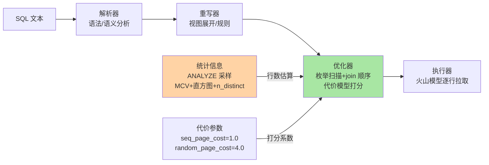
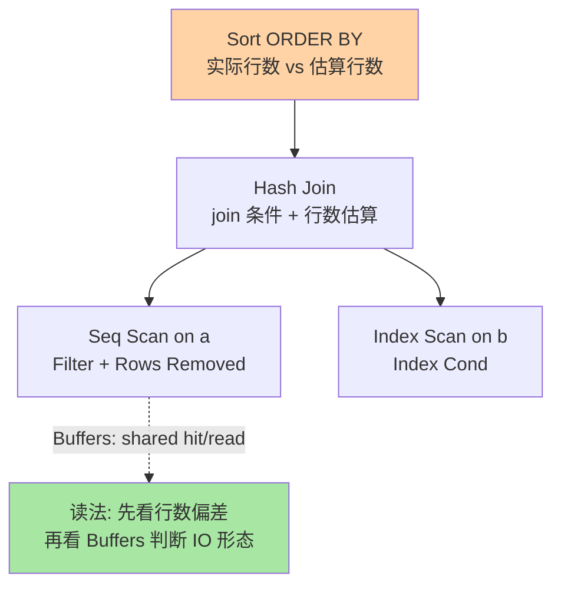
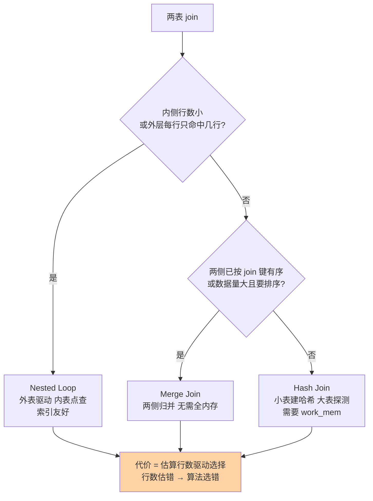

# 查询优化器与执行计划深度：代价模型、行数估算与计划劣化

> EXPLAIN 的输出人人会看个大概，本篇讲看不懂的部分：优化器怎么把 SQL 变成计划树、每个节点的代价数字是怎么算出来的、行数估算为什么会错得离谱，以及计划"昨天还快今天变慢"的完整归因链——最后对照 MySQL 优化器，把两边思路差异讲透。

## 一句话摘要

PG 优化器是**基于代价（CBO）的动态规划搜索**：一条 SQL 经过解析与重写后，优化器枚举扫描方式（顺序扫/索引扫/位图扫）、join 算法（嵌套循环/哈希/归并）与 join 顺序，用统一的代价模型给每个候选计划打分，选总分最低的。代价模型的原料是**统计信息**——ANALYZE 采样出的最常见值（MCV）、直方图与 distinct 数——由它估算每个节点的行数，行数再乘以每行代价系数。所以计划劣化的归因链几乎是确定的：**行数估错 → 代价算错 → 计划选错**，而行数估错的两大根源是统计过期与独立性假设失效。EXPLAIN (ANALYZE, BUFFERS) 是唯一的验证工具：它给出计划树每节点的真实行数、循环次数与缓存命中，估算行数与实际行数的偏差位置就是问题位置。与 MySQL 的思路差异集中在三点：PG 原生三算法可选（MySQL 8 前只有嵌套循环一招）、PG 默认带 MCV+直方图统计（MySQL 8 才补直方图且需手动建）、PG 代价是相对单位可按存储调参（MySQL 调整面窄）——两边都懂，迁移与联合排障才不吃亏。

## 🎯 本文核心

**核心一句话：优化器的输出质量 = 统计信息质量 × 代价模型假设与现实的贴合度——排障的完整套路因此固定为：EXPLAIN (ANALYZE, BUFFERS) 找「估算行数与真实行数」分叉的节点 → 归因到统计过期/估算假设失效/代价参数失真 → 分别用 ANALYZE/改写 SQL/调参数修复。**

机制链：SQL → 解析树 → 重写（规则/视图展开）→ 优化器枚举计划空间（动态规划，join 数超 geqo_threshold=12 换遗传算法，公开口径）→ 代价模型打分 → 最优计划树 → 执行器逐节点拉取数据。一张流水线图：



## 5W 速记卡

| 维度 | 一句话 |
|---|---|
| What | CBO 动态规划 + 统计信息驱动行数估算 + 代价参数打分 + EXPLAIN ANALYZE 验证 |
| Why | 计划空间组合爆炸，必须靠估算剪枝；估算必有误差，所以排障方法论可以标准化 |
| When | 慢查询归因、计划忽快忽慢、迁移存储后计划劣化、升级版本前后对比 |
| Where | EXPLAIN (ANALYZE, BUFFERS)、pg_stats、源码 optimizer/ 目录 costsize.c/selfuncs.c |
| How | 找估算/实际行数分叉节点 → 三选一归因 → ANALYZE / 改写 / 调参 |

## 一、边界：入门层讲过什么，本篇讲什么

入门层没系统讲过执行计划——只在索引篇提过「索引让查询走点查」。本篇的边界：

| 内容 | 入门层 | 本篇 |
|---|---|---|
| 索引怎么匹配谓词（第 3 篇） | — | 只作前置结论引用 |
| EXPLAIN 输出怎么读 | 未讲 | **本文核心：逐层读法** |
| 代价模型与统计信息 | 未讲 | **本文核心二** |
| 计划劣化归因方法论 | 未讲 | **本文核心三** |
| 与 MySQL 优化器对照 | 入门层篇 1 提过引擎差异 | 展开到优化器思路层 |

## 二、EXPLAIN (ANALYZE, BUFFERS)：逐层读法

### 2.1 计划树怎么读

执行计划是一棵自上而下的树，数据自下而上流动（火山模型：上层节点逐行向下层拉取）：



读法四步（业内认知惯例）：① 自上而下先看**顶层节点类型**（Sort/Hash Join 决定内存需求，呼应第 1 篇 work_mem）；② 每个扫描节点对齐 **estimated rows 与 actual rows**——差一个数量级以上就是估算偏差信号；③ `Rows Removed by Filter` 大说明存储层过滤了大量行（索引没选好的典型形态）；④ `Buffers: shared hit/read/dirtied` 判断 IO 形态，read 高说明缓存未命中（对照第 1 篇双层缓存模型）。

```sql
-- 标准排查姿势：ANALYZE 真实执行 + BUFFERS 看 IO
EXPLAIN (ANALYZE, BUFFERS, SETTINGS)
SELECT o.id, u.name FROM orders o JOIN users u ON o.user_id = u.id
WHERE o.created_at > now() - interval '7 days';
-- 关注: Join 节点两侧行数、Sort 是否溢盘(Sort Method: external merge)
```

注意 EXPLAIN ANALYZE 会**真实执行**：写语句（INSERT/UPDATE/DELETE）会真正生效——惯例是包在 `BEGIN; ... ROLLBACK;` 里跑（业内认知）。

### 2.2 源码/关键路径

优化器主线在 `src/backend/optimizer/`：`plan/planner.c` 总控，`path/costsize.c` 是代价模型的全部公式（cost_seqscan / cost_index / cost_hashjoin 等每个都可直接读，公式与官方文档的代价参数一一对应），`path/allpaths.c` 负责 join 顺序搜索（join_collapse_limit=8 以内动态规划，超出换 genetic 遗传算法 geqo，公开口径）。行数估算在 `utils/adt/selfuncs.c`，读 pg_stats 的 MCV/直方图/correlation；ANALYZE 的采样实现在 `commands/analyze.c` 的 `acquire_sample_rows`（系统页随机采样，不是全扫——这就是统计「快但有抽样误差」的根源）。执行计划缓存的细节值得点名：prepared statement 执行若干次后（默认 5 次，公开口径）会从 custom plan 切到 generic plan（参数不用具体值做估算），generic plan 若不适合参数分布，就出现「prepared 后变慢」的经典劣化形态。

## 三、代价模型：数字是怎么算出来的

### 3.1 代价的相对单位

代价不是毫秒，是**相对成本单位**：seq_page_cost=1.0 是基准（顺序读一页的成本），random_page_cost=4.0 表示随机读一页贵 4 倍，cpu_tuple_cost=0.01、cpu_operator_cost=0.0025 是每行/每操作符的 CPU 系数（公开口径默认值）。这套相对机制的底层原理：绝对时间随硬件漂移，相对比值相对稳定，而优化器只需要在候选计划间比大小、不需要预测绝对耗时——两套体系天然解耦。

**追问：SSD 时代 random_page_cost=4.0 还合理吗？**
4.0 的假设是机械盘随机读与顺序读的差距（寻道时间是主导）。SSD/云盘把随机读拉近顺序读，业内惯例（业内认知）把 random_page_cost 调到 1.1-2.0，让优化器更倾向索引扫描。反过来，冷数据大表（缓存基本无效）调高 effective_cache_size 之外的假设会更准。这解释了一类经典事故：**本地开发机（SSD）验证过的计划，搬到 HDD 备库后形态大变**——参数假设变了，计划跟着变。

**再追问：并行的代价怎么进模型？**
并行扫描有 setup 代价（fork worker，呼应第 1 篇进程模型）与每行传递代价（parallel_tuple_cost），节点行数低于 min_parallel_table_scan_size（默认 8MB，公开口径）根本不启用并行；max_parallel_workers_per_gather 默认 2。**打破砂锅：为什么并行不是越多越好？**worker 是真实进程，每个都要消耗共享内存与调度成本（第 1 篇的三乘积账同样适用）；且上层节点（如 Gather Merge 的排序归并）可能成为单点瓶颈，worker 再多也堵在汇聚层——所以并行度是「下游汇聚能力 × 内存预算」的函数，不是「越大越快」的旋钮。

### 3.2 join 三算法的选择逻辑



对照 MySQL：8.0.18 前只有嵌套循环一条路（block nested loop 缓解无索引场景），之后补了 hash join（公开口径）；PG 三个算法原生齐备。思路差异的本质在**执行模型**：MySQL 的哲学是「索引到位一切好说」（所以它对索引的依赖更重），PG 的哲学是「无索引时也有物理上合理的算法兜底」（代价是 planner 更复杂、行为更依赖统计质量）。

## 四、计划劣化：行数估算偏差的归因链

### 4.1 行数怎么估、为什么错

单表估算靠 pg_stats 三件套：MCV（最常见值及频率，回答"这个值占多少比例"）、直方图（回答"这个范围占多少比例"）、n_distinct（回答"总共有多少个不同值"）。多条件组合时优化器用**独立性假设**（各条件概率相乘）与均匀性假设。

**打破砂锅：独立性假设什么时候崩？**
条件之间相关时。`WHERE city='杭州' AND district='西湖区'` 的真实比例远高于两概率相乘——district 本来就依赖 city。优化器有扩展统计（CREATE STATISTICS，公开口径）手工登记列间依赖来修，但默认不建。同理，函数包裹的列（`WHERE lower(email)=...` 没有表达式索引时）、跨表相关性、参数化查询的 generic plan，都是估算偏差的高发点。估算偏差不直接等于慢——它通过代价模型**放大**成算法选错（上面 join 决策图的 CW 节点）：估内表 10 行选嵌套循环，实际 1000 万行，就是灾难级差异。

### 4.2 事故复盘一：30 分钟变 3 秒

某线上报表每日凌晨跑 30+ 分钟，业务扩量后阈值告警（匿名化复述常见模式）。排查路径：EXPLAIN (ANALYZE, BUFFERS) 对比发现核心 join 节点 estimated rows=1、actual rows=2100 万——估算与实际差 7 个数量级，优化器据此选了嵌套循环；手动 ANALYZE 该表后估算恢复、计划切到 hash join、耗时 3 秒。复盘根因：该表夜间大批量写入后**统计信息停留在写入前**（autovacuum 的自动 ANALYZE 走 autovacuum_analyze_scale_factor=0.1，大表还没攒够触发线）；修复是跑批末尾显式 ANALYZE。教训：**统计信息的时效性是批处理链路的一部分**，跟事务一样要写进跑批脚本。

### 4.3 事故复盘二：换盘之后的计划漂移

某系统从机械盘迁到云 SSD，迁完部分查询反而变慢（匿名化复述）。排查路径：对比迁移前后 EXPLAIN，多个查询从索引扫变成了顺序扫或反之 → 复盘结论：random_page_cost=4.0 的假设在新盘上失真，索引扫描被系统性低估。修复按表分级：OLTP 热表会话级 `SET random_page_cost=1.5`（或库级统一调整），冷数据归档库维持默认——**代价参数是存储假设的声明，换存储就该重新声明**（业内认知惯例）。

### 4.4 为什么不选别的优化器形态

**为什么不选基于规则的优化器（RBO）？**早年数据库确实走过 RBO 路线（固定规则表：「有索引就用索引」），但它无法回答「数据量变了之后哪条规则更好」——1 行的表全表扫比索引快（第 3 篇量级三档的第一条），这条常识 RBO 表达不出来。CBO 用一套统一的度量把所有计划拉到同一标尺，这是它取代 RBO 的根本原因，代价是引入了统计信息这个新的依赖（于是有了本节的全部故事）。**为什么不选机器学习优化器？**学术与工业界都有尝试（公开口径：learned optimizer 一直是热点方向），工程落地的阻力在稳定性与可解释性——数据库要的是「可预期的劣化」而不是「平均更快但偶发离谱」，且 ML 模型面对新负载分布的泛化风险难以兜底。现阶段的共识形态是 CBO 为主、ML 做代价校正或索引推荐这类「建议层」能力（业内认知）。

## 五、与 MySQL 优化器的思路对照

| 维度 | PostgreSQL | MySQL (8.x) |
|---|---|---|
| join 算法 | nestloop / hash / merge 三件套 | 嵌套循环为主，8.0.18+ 补 hash join（公开口径） |
| 统计信息 | ANALYZE 自动采样，MCV+直方图默认就有 | InnoDB 持久统计 + 直方图需手动 ANALYZE TABLE ... UPDATE HISTOGRAM |
| 代价可调面 | 代价参数全开放（seq/random/cpu 系列） | 调整面窄（成本模型内部固定权重为主） |
| 连接顺序搜索 | 动态规划 + geqo 遗传兜底 | 有限搜索 + hint 生态引导 |
| hint 文化 | 官方长期不内置（生态扩展补，新版有 pg_hint_plan 生态，公开口径），靠统计调优 | hint 是官方一等公民 |
| 计划复用 | prepared statement 混合 custom/generic 策略 | 服务端 prepared + 优化器按会话决策 |

对照的实践含义：从 MySQL 迁 PG 的团队要补**统计信息运维**的习惯（PG 优化器更「信统计」，统计烂计划就烂）；反向迁移要补 **hint 之外的手法**（PG 里改写 SQL 与调统计比找 hint 更治本）。**追问：为什么两边 hint 文化差异这么大？**PG 社区的设计思想是「计划错了修计划的原因」（统计/参数/改写），hint 被视为掩盖问题的绷带；MySQL 社区更务实「线上先 hint 止血再查根因」。两种文化各有代价，团队两边都要会——止血要快，根因要挖。

## 六、量级三档：优化问题的规模账

约束来源钉死：**优化器搜索空间随 join 数指数涨、估算误差随查询复杂度放大**——小查询误差无所谓，大查询误差是指数级选错。三档的核心问题：

| 量级 | 这一档的核心问题是 | 思考方式 |
|---|---|---|
| 单表/两表 join | 这一档的核心问题是**索引对不对**，而不是优化器——两三个候选计划，估错了伤害有限 | 索引驱动：第 3 篇的活 |
| 千万级多表 join（4-8 表） | 这一档的核心问题是**行数估算质量**——统计时效与独立性假设主导一切 | 统计驱动：ANALYZE 进流程 |
| 亿级/十表以上 join | 这一档的核心问题是**别让优化器自由发挥**——拆解查询、物化中间结果、分区剪枝，把搜索空间手动压小 | 架构驱动：改写优先于调参 |

收尾两件套：自下而上看，三档用的是同一个代价模型，变的只是误差被放大的倍数；触发升级的信号一致——EXPLAIN 里估算与实际的偏差从一个数量级涨到多个、join 表数逼近 collapse_limit，就是往上一档迁移的扳机。

## 七、💡 实战提示

💡 **EXPLAIN (ANALYZE, BUFFERS) 是唯一事实**：估算行数与实际行数差 10 倍以内的节点先放过，差一个数量级的节点才是嫌疑人。SETTINGS 选项能显示非默认参数，排查「同库不同会话计划不同」时必备。

💡 **跑批脚本里 ANALYZE 和 commit 一样是标配**：大批量写完先 ANALYZE 再跑下游查询——一行命令，消灭一整类「批后变慢」事故（业内认知惯例）。

💡 **别背代价参数，记它们的假设**：random_page_cost=4.0 假设机械盘、effective_cache_size 假设 OS cache 可用量（呼应第 1 篇双层缓存）、work_mem 进的是 join/sort 的算法选择账。换硬件、改内存配置，就重新核对这些声明。

💡 **hint 是止血药不是处方**：先 hint 止血保住线上，48 小时内完成统计修复或 SQL 改写，再把 hint 摘掉——长期 hint 堆积会让计划彻底不可推理。

## 八、你们可能会问

**Q1：EXPLAIN 不加 ANALYZE 显示的计划和实际执行的不一致吗？**
一致——都是优化器的输出，同一条 SQL 在同一统计与参数下不会两个答案。不一致的错觉来自「统计信息在两次执行之间变了」（autovacuum 自动 ANALYZE、数据写入），所以对比计划时先确认统计时点。加 ANALYZE 后才多出 actual rows/Buffers 这些**运行时**指标。

**Q2：JIT 是什么，要不要开？**
PG11+ 对表达式计算做即时编译（公开口径），定位是分析型长查询（扫描行数巨大、表达式密集）收益明显；OLTP 点查关着更好——编译本身的耗时就超过收益。默认 jit=on 但 cost 阈值让短查询自动跳过（业内认知惯例），深究时用 EXPLAIN 看 JIT 节点实际耗时再定。

**Q3：为什么同一个 prepared statement 有时快有时慢？**
custom/generic plan 的切换：前几次按具体参数定制计划，之后切通用计划。参数分布偏斜的表（比如某用户占 90% 行数）会被 generic plan 坑——估算用的是「平均假设」。识别看 pg_prepared_statements 与 EXPLAIN 的 generic 标记，解法是不用它、或让查询保持 custom（公开口径机制）。

**Q4：优化器会看分区表的全局统计吗？**
分区表统计按分区收集，优化器跨分区估算靠父子层级汇总（公开口径机制）。分区数极多时估算偏差变大、计划时间也变长——这是第 3 篇「分区换单元」的另一面：单元小了，统计的拼装误差要管。惯例是分区数控制在百级以内（业内认知），配合分区剪枝（partition pruning）让计划只碰相关分区。

## 九、什么时候用/不用与 Trade-off

| 场景 | 推荐 | 不推荐 |
|---|---|---|
| 慢查询排查 | EXPLAIN (ANALYZE, BUFFERS) 定位偏差节点 | 凭感觉加索引/改配置 |
| 批处理链路 | 批末显式 ANALYZE 再下游查询 | 依赖 autovacuum 自动补 |
| 迁移存储/硬件 | 重核代价参数假设 + 抽样回归对比计划 | 假设参数跨存储通用 |
| 优化器自由发挥失控 | 改写 SQL/拆解/物化中间表 | 无脑堆 hint 长期供奉 |

Trade-off 的锚点是**估算的便宜与失真**：统计采样换来了秒级 ANALYZE 与可维护性，付出的是抽样误差与独立性假设的系统性偏差；CBO 换来了对数据量的自适应，付出的是「统计质量成为新的运维义务」。这条义务躲不掉——PG 把优化器的自由度交给了统计信息，统计信息就回到了你手里。

## 开放问题

- learned optimizer 方向持续演进（公开口径），「CBO 主干 + ML 校正」的混合形态若成熟，本篇的归因方法论要不要加一层模型可解释性工具，值得跟踪
- 新版本对高并发下采样统计的自适应刷新（公开口径讨论中）若落地，统计时效性义务会部分转移回内核——届时本篇 4.2 的复盘模式要改写
- 回看优化器的架构演进（业内认知）：从 RBO 到 CBO 用了十年量级，从固定代价参数到自适应代价调整的探索至今未停——这条演变的主线是「估算工艺越来越细」，不变的是「估算驱动决策」这条底层原理，学方法论的价值因此比背某个版本的行为长得多
- 分布式形态下的全局优化器（跨节点 join 顺序与数据搬移代价）是另一个量级的架构问题，社区与商业发行版的方案仍在分化（公开口径），单机优化器的边界在哪值得持续观察

## 🎯 核心带走

- **核心一句话**：计划质量 = 统计质量 × 代价假设贴合度；排障套路固定为「EXPLAIN (ANALYZE, BUFFERS) 找估算/实际行数分叉 → 归因统计过期/独立性假设/代价参数 → ANALYZE/改写/调参三选一」
- **最小动作集**：跑批末尾 ANALYZE、换盘重核 random_page_cost、大表 join 先看 pg_stats、hint 只做 48 小时止血
- **哪里会破**：统计过期选错 join 算法、generic plan 撞上偏斜参数、并行度拍脑袋调大、分区表统计拼装误差
- **取舍锚点**：CBO 的自适应换统计运维义务——自由度给了优化器，责任就落回使用方

## 自测三问

1. 代价模型的单位是什么？为什么不用毫秒？——答出「相对单位 + 只比大小不测绝对时间 + 硬件解耦」算过。
2. 行数估算偏差的两大系统性根源？——答出「统计过期 + 独立性/均匀性假设失效（相关列）」算过。
3. PG 与 MySQL 优化器最核心的一条思路差异？——答出「三 join 算法 vs 索引驱动嵌套循环 / 或统计默认自带 vs 手动直方图」算过。

## 📌 数据与事实声明

- 写于 2026-09-24；代价参数默认值（seq_page_cost=1.0、random_page_cost=4.0、cpu_tuple_cost=0.01、geqo_threshold=12、join_collapse_limit=8、min_parallel_table_scan_size=8MB 等）以 PostgreSQL 官方文档当前口径为准
- MySQL 侧（hash join 自 8.0.18、直方图语法）以 dev.mysql.com 官方文档为准
- 案例、参数经验值（random_page_cost 调参区间、分区数百级惯例）均为业内认知或公开技术社区匿名化模式复述

## 📚 参考资料

| 类型 | 标题 | 来源 |
|---|---|---|
| 官方文档 | PostgreSQL: Using EXPLAIN（逐节点读法） | postgresql.org/docs/ |
| 官方文档 | PostgreSQL: Query Planning（代价参数/统计/并行） | postgresql.org/docs/ |
| 官方源码 | optimizer/plan/planner.c、path/costsize.c、utils/adt/selfuncs.c | github.com/postgres/postgres |
| 公开口径 | MySQL 8.0 Reference Manual: Optimizer（hash join/直方图） | dev.mysql.com/doc/ |
| 系列内链 | 本系列：索引家族全景（谓词匹配与 AM 选型） | [3_索引家族全景：Btree之外-特性.md](3_索引家族全景：Btree之外-特性.md) |
| 系列内链 | 本系列：进程模型与存储布局深度（work_mem/并行进程成本） | [1_进程模型与存储布局深度-特性.md](1_进程模型与存储布局深度-特性.md) |
