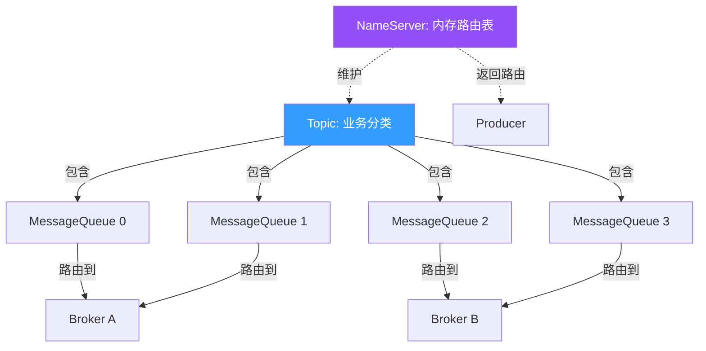
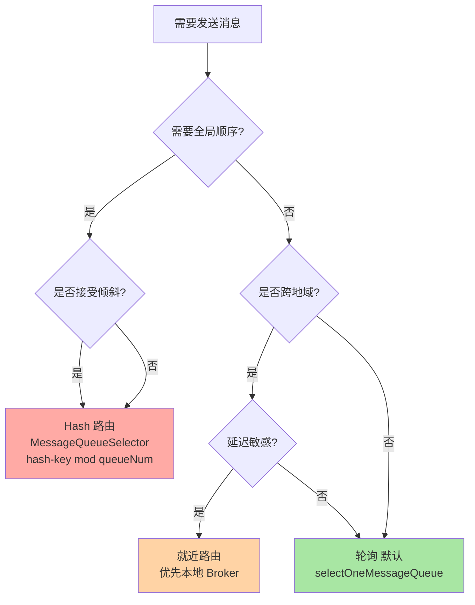
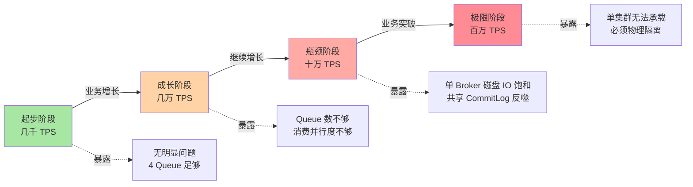
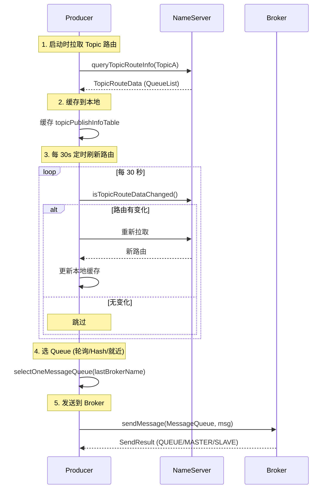
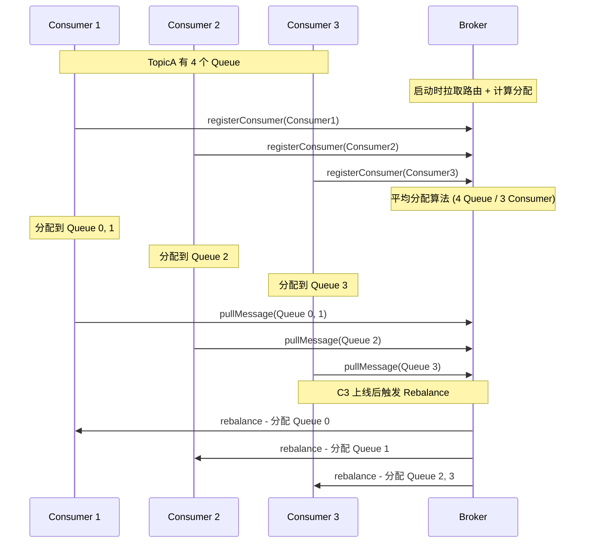
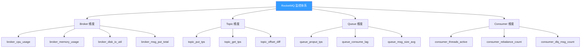
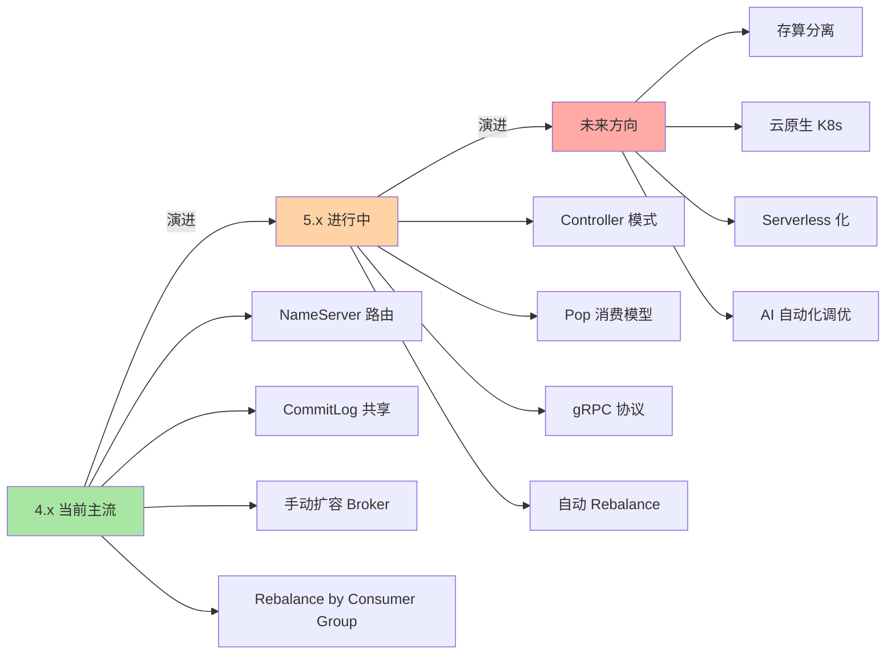
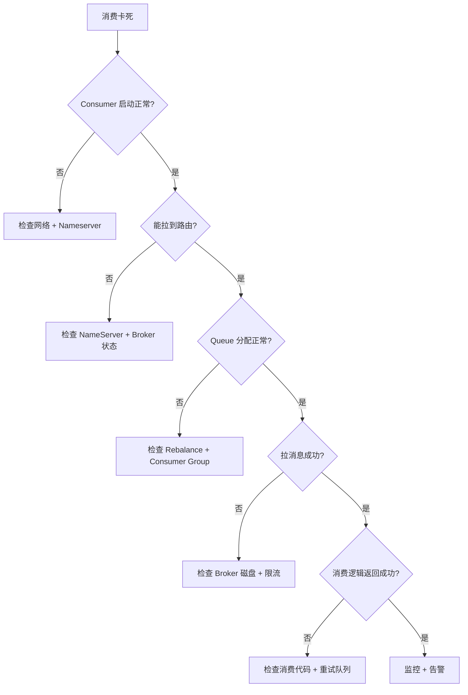
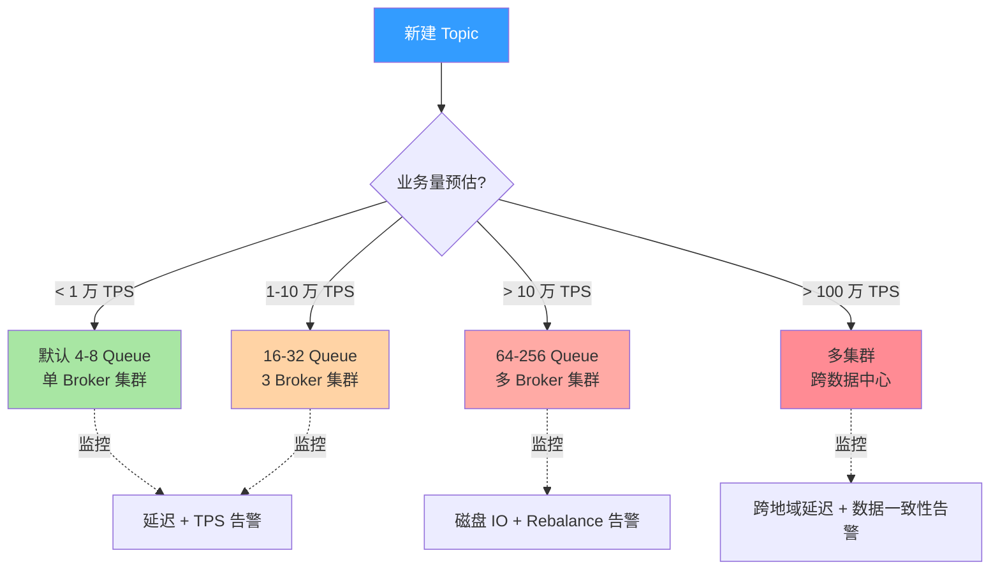

# RocketMQ Topic 模型与 Queue 映射：从 1 Topic : N Queue 设计看隔离真相

> 一句话摘要：**Topic 是逻辑概念，Queue 才是物理并行单位**。RocketMQ 的 1 Topic : N Queue 设计，决定了 Topic 隔离的真正边界。
>
> 学完能会：从源码级理解 Topic/Queue/MessageQueue 的关系 / 为什么 RocketMQ 不用 Kafka 的 partition 概念 / 路由机制如何支撑水平扩展。

---

## 1. 背景：为什么 Topic 隔离是个被严重误解的话题

很多开发者以为：

```
❌ 误区：「RocketMQ Topic 完全独立，性能也隔离」
```

真实情况是：

```
✅ 真相：Topic 在 API 层独立、在存储层共享（CommitLog 是 Broker 级共享）
```

这个误解直接导致两类生产事故：

- **事故 A**：大 Topic 写满磁盘 → 其他 Topic 全部写入失败（共享 CommitLog 副作用）
- **事故 B**：扩容 Topic → Queue 数量未规划 → 部分消费组卡死（路由分配问题）

**这篇文章要建立的能力地图：**

| 你现在 | 学完这篇 |
|---|---|
| 以为 Topic 就是消息队列 | 理解 Topic 是逻辑路由单位，Queue 才是物理并行单位 |
| 不知道为什么 RocketMQ 不用 Kafka 的 partition | 理解 1 Topic : N Queue 设计 + MessageQueue 的角色 |
| Queue 数量拍脑袋定 | 知道「按消费者并行度」+「按吞吐规划」的合理算法 |
| 不知道 Topic 怎么扩容 | 理解 4 个扩容路径 + 各自的代价 |

---

## 2. 原理穿透：从源码到存储的 Topic-Queue 模型

### 2.1 三层概念澄清（容易混淆）

```
┌────────────────────────────────────────────────────────┐
│ Topic（逻辑路由单位）                                    │
│ - 由 NameServer 管理路由                                 │
│ - 对应一张「Topic 路由表」                                │
│ - 不直接对应物理存储                                      │
├────────────────────────────────────────────────────────┤
│ MessageQueue（物理队列 / 并行单位）                       │
│ - 1 Topic : N MessageQueue（默认 4 个，可配置）           │
│ - 顺序写、顺序消费、最小路由粒度                          │
│ - 由 Broker 创建并持久化到 config 目录                    │
├────────────────────────────────────────────────────────┤
│ QueueData（内存中的队列描述）                             │
│ - NameServer 内存中维护的 Broker → Queue 列表            │
│ - 客户端路由查询时返回                                    │
└────────────────────────────────────────────────────────┘
```

**关系图（Mermaid）：**



**关键区分**：

| 概念 | 数量 | 角色 |
|---|---|---|
| **Topic** | 业务定义 | 逻辑路由（消息要发到哪个分类） |
| **MessageQueue** | 1 Topic : N | 物理并行（消息要发到哪个队列） |
| **CommitLog** | 1 Broker : 1 | 物理存储（消息真正写到哪个文件） |

### 2.2 1 Topic : N Queue 的设计哲学（为什么不是 1 Topic : 1 Queue）

**单 Queue 的代价：**

```
单 Topic 单 Queue：
 - 单消费者只能拉一个线程 → 消费能力受限
 - 单 Broker 单点故障 → 整个 Topic 不可用
 - 顺序写但顺序消费 → 多消费者无法扩展
```

**多 Queue 的收益：**

```
1 Topic : 4 Queue：
 - 4 个消费者并行消费 → 消费能力 ×4
 - Queue 分布在不同 Broker → 故障域隔离（部分挂掉不影响全局）
 - 单个 Queue 顺序写 → 局部有序性保证
```

**业内通用的「1 Topic : N Queue」设计选择（对比 Kafka）：**

| 中间件 | 设计 | 数量设置 |
|---|---|---|
| **Kafka** | Topic → Partition | 创建 Topic 时固定，不可后续扩容 |
| **RocketMQ** | Topic → MessageQueue | 创建时可配置，部分版本支持自动扩容（5.x）|
| **RabbitMQ** | Exchange → Queue | Exchange 不存消息，Queue 是终点 |
| **Pulsar** | Topic → Partition | 和 Kafka 类似，支持分区 |

**RocketMQ 的差异化设计：** Queue 数量在创建时可指定，后续通过 `TOPIC_QUEUE_NUMBER` 调整（5.x 支持自动）。

### 2.3 路由机制：Producer 怎么找到正确的 Queue

```
Producer 发送消息
  ↓
 1. 从 NameServer 拉取 Topic 路由（topicRouteData）
  ↓
 2. 路由中包含 QueueList（MessageQueue 列表）
  ↓
 3. 选 Queue 策略（4 种）：
    - DefaultMQProducer：轮询 / 随机 / 自定义
    - OrderlyProducer：Hash 到固定 Queue（保证顺序）
    - TransactionalProducer：轮询（事务消息无顺序要求）
    - DelayProducer：固定 + 时间计算
  ↓
 4. 把消息发送到 Queue 所在的 Broker
  ↓
 5. Broker 写入 CommitLog（共享）
  ↓
 6. 异步转发到 ConsumeQueue（按 Queue 索引）
```

**源码关键路径（以 DefaultMQProducer 为例）：**

```java
// 1. 查路由
TopicPublishInfo topicPublishInfo = mQClientFactory
    .getTopicPublishInfoTable().get(topic);
if (topicPublishInfo == null) {
    topicPublishInfo = mQClientFactory
        .updateTopicRouteInfoFromNameServer(topic);
}

// 2. 选 Queue
MessageQueue mq = topicPublishInfo.selectOneMessageQueue(lastBrokerName);

// 3. 发送
SendResult sendResult = mQClientFactory.getMQClientAPIImpl()
    .sendMessage(brokerAddr, message, sendCallback);
```

### 2.4 MessageQueue 的元数据：brokerName + queueId

每个 MessageQueue 由两个字段唯一标识：

```
MessageQueue {
    String topic;        // 所属 Topic
    String brokerName;   // 所在 Broker 集群名
    int queueId;         // 在 Broker 上的序号（0, 1, 2, 3）
}
```

**两个关键含义：**

1. **brokerName** 决定路由到哪个 Broker 集群（master-slave 组）
2. **queueId** 决定 Broker 内的哪个逻辑队列

例如：`TopicA@BrokerA#0`、`TopicA@BrokerA#1`、`TopicA@BrokerB#2`、`TopicA@BrokerB#3` —— 同一个 Topic 分布在两个 Broker 的 4 个 Queue 上。

**命名结构图（Mermaid）：**

```mermaid
graph LR
    MQ[MessageQueue<br/>全局唯一标识] --> topic[topic: TopicA]
    MQ --> broker[brokerName: BrokerA]
    MQ --> qid[queueId: 0/1/2/3]
    topic -.示例.-> Ex1[TopicA@BrokerA#0]
    topic -.示例.-> Ex2[TopicA@BrokerA#1]
    topic -.示例.-> Ex3[TopicA@BrokerB#2]
    topic -.示例.-> Ex4[TopicA@BrokerB#3]
    broker -.示例.-> Ex1
    broker -.示例.-> Ex2
    qid -.示例.-> Ex1

    style MQ fill:#339cff,color:#fff
    style Ex1 fill:#e0e0e0
    style Ex2 fill:#e0e0e0
    style Ex3 fill:#e0e0e0
    style Ex4 fill:#e0e0e0
```

---

## 3. 主流业界解法：Queue 数量 + 路由策略

### 3.1 Queue 数量的合理算法（业内通用公式）

```
推荐 Queue 数 = max(
    消费端并行度（消费者线程数 / 消费者实例数 × 消费并行度）,
    生产端并行度（Producer 实例数 × 发送线程数 / 5）,
    历史峰值吞吐 / 单 Queue 吞吐上限
)
```

| 业务量 | 推荐 Queue 数 |
|---|---|
| 几千 TPS / Topic | 4-8 个 |
| 几万 TPS / Topic | 16-32 个 |
| 十万 TPS / Topic | 32-128 个 |
| 百万 TPS / Topic | 256-512 个 + 多 Broker 集群 |

### 3.2 选 Queue 策略对比



| 策略 | 原理 | 适用场景 | 代价 |
|---|---|---|---|
| **轮询** | 依次选下一个 Queue | 普通消息 | 顺序无法保证 |
| **随机** | 随机选 Queue | 调试场景 | 可能造成倾斜 |
| **Hash** | `hash(key) % queueNum` | 顺序消息 | 扩容后需要 rehash |
| **就近** | 优先选本地 Broker | 跨地域场景 | 需要 brokerName 解析 |

**业内惯例：**

- **默认使用轮询**（90% 场景）
- **顺序消息必须用 Hash**（否则全局乱序）
- **跨地域用就近**（延迟敏感场景）

### 3.3 扩容路径对比

| 扩容路径 | 操作 | 代价 | 业内做法 |
|---|---|---|---|
| **垂直扩容 Queue 数** | `mqadmin updateTopic -t TopicA -n 8` | 已有消息不 rebalance，**不推荐** | ❌ 几乎不用 |
| **水平扩容 Broker** | 加 Broker + 迁移 Queue | 平滑迁移，需运维介入 | ✅ 推荐 |
| **5.x 自动扩容** | Controller 自动 rebalance | 平滑，5.x 特性 | ✅ 推荐（升级 5.x 后）|
| **新建 Topic 替代** | 业务双写新旧 Topic | 业务改造成本 | ⚠️ 业务侵入大 |

### 3.4 业内默认配置模板

```java
// 单 Broker 集群默认配置
DefaultMQProducer producer = new DefaultMQProducer("ProducerGroup");
producer.setNamesrvAddr("nameserver1:9876;nameserver2:9876");
producer.setDefaultTopicQueueNums(4);  // 默认 4 Queue
producer.start();

// 顺序消息专用（Hash 路由）
MessageQueueSelector selector = new MessageQueueSelector() {
    @Override
    public MessageQueue select(List<MessageQueue> mqs, Message msg, Object arg) {
        Long orderId = (Long) arg;
        int index = (int) (orderId % mqs.size());
        return mqs.get(index);
    }
};
```

---

## 4. 量级演进视角：单点 → 全局会暴露什么

### 4.1 量级维度拆解

```
Topic 隔离的量级维度：
 - Queue 数（4 → 128 → 1024）
 - Broker 数（1 → 3 → 100）
 - 单 Queue 吞吐（百 TPS → 千 TPS → 万 TPS）
 - Topic 数（10 → 100 → 10000）
 - 消息保留时间（1 天 → 7 天 → 30 天）
```

### 4.2 四个阶段会暴露什么



| 阶段 | 量级 | 暴露的 Topic 隔离问题 |
|---|---|---|
| **起步** | 几千 TPS | 无明显问题，4 Queue 足够 |
| **成长** | 几万 TPS | Queue 数不够，消费并行度不够 |
| **瓶颈** | 十万 TPS | 单 Broker 磁盘 IO 饱和 → **共享 CommitLog 反噬所有 Topic** |
| **极限** | 百万 TPS | 单集群无法承载 → 必须**物理隔离**（多 Broker 集群 / 多数据中心）|

### 4.3 当前文章覆盖哪个量级

本文聚焦**「成长 → 瓶颈」过渡期**（几万 TPS → 十万 TPS），因为这是大多数公司会遇到的阶段，也是大多数「Topic 隔离问题」的高发期。

### 4.4 量级演进背后的真实代价（5 维穿透）

很多公司以为「Topic 隔离只是配置 Queue 数」——实际上**量级每升一档，5 个维度都要重做**：

| 维度 | 几千 TPS | 几万 TPS | 十万 TPS | 百万 TPS |
|---|---|---|---|---|
| **Queue 数** | 4 | 16-32 | 64-128 | 256-512 |
| **Broker 数** | 1 | 2-3 | 5-10 | 20-100 |
| **单 Queue 吞吐** | < 100 | 1000 | 5000 | 上万 |
| **磁盘空间** | 100GB | 1TB | 10TB | 100TB+ |
| **运维复杂度** | 低 | 中 | 高 | 极高 |

**真实代价（业内常见轨迹）：**

```
起步阶段（0-1 年）：
  - 单 Broker 4 Queue 满足
  - 投入：1 台服务器 + 1 名开发
  - 痛点：无

成长阶段（1-3 年）：
  - 扩到 3 Broker + 32 Queue
  - 投入：3 台服务器 + 2 名开发 + 1 名运维
  - 痛点：Queue 倾斜、Rebalance 频繁

瓶颈阶段（3-5 年）：
  - 多 Broker 集群 + 64 Queue
  - 投入：10 台服务器 + 3 名开发 + 2 名运维 + 监控告警体系
  - 痛点：磁盘 IO 饱和、热点 Topic 拖垮系统

极限阶段（5+ 年）：
  - 多集群 + 多数据中心
  - 投入：50+ 台服务器 + 5 名开发 + 5 名运维 + SRE 团队
  - 痛点：跨地域同步、运维成本占总成本 30%+
```

### 4.5 量级演进的 3 个反直觉洞察

**洞察 1：Queue 数不是越多越好**

```
误区：Queue 数越多越好
真相：
 - Queue 数过少 → 消费并行度受限
 - Queue 数过多 → Rebalance 慢 + 内存占用大 + 监控复杂
推荐：Queue 数 = 1.5-2 × Consumer 并行度
```

**洞察 2：单 Broker 的瓶颈不是 CPU，是磁盘**

```
误区：Broker 卡住是因为 CPU 不够
真相：
 - RocketMQ 是 IO 密集型，不是 CPU 密集型
 - CommitLog 顺序写 → 磁盘顺序 IO 决定吞吐
 - 单 NVMe SSD ≈ 5 万 TPS 顺序写
 - 单 SATA SSD ≈ 1 万 TPS 顺序写
 - 单 HDD ≈ 几百 TPS 顺序写
推荐：Broker 磁盘用 NVMe SSD + 顺序写
```

**洞察 3：扩容 Broker 比扩容 Queue 更划算**

```
误区：Queue 数不够 → 扩 Queue
真相：
 - 扩 Queue：业务影响小，但已有消息不 rebalance
 - 扩 Broker：业务改造大，但平滑动 + 可重新平衡
推荐：优先扩 Broker，谨慎扩 Queue
```

---

## 5. 架构设计：路由 + 负载均衡 + 故障转移

### 5.1 Producer 路由架构



**详细流程：**

- 启动时拉取 Topic 路由
- 缓存到本地（topicPublishInfoTable）
- 每 30s 定时刷新路由（topicRouteDataIsChange）
- 选 Queue（轮询/Hash/就近）
- 发送到 Broker → BrokerName → QueueId
- 失败重试（默认 3 次）

### 5.2 Consumer 负载均衡机制（Rebalance）



**关键机制：**

```
Consumer 启动
  ↓
1. 拉取 Topic 路由（含 Queue 列表）
  ↓
2. 计算分配算法：
   - 平均分配（默认）：Queue 数 / Consumer 数
   - 机房优先：同机房优先分配
   - 一致性 Hash：按 Consumer ID Hash
  ↓
3. 提交到 Broker（consumerOffset）
  ↓
4. 监听 Queue 变化，触发 Rebalance
  ↓
5. 分配结果持久化到 Broker
```

**关键：** Rebalance 是 Consumer Group 级别的，**同一个 Group 内所有 Consumer 重新分配 Queue**。

### 5.3 故障转移机制

```
Broker A 挂掉
  ↓
1. Producer 心跳检测 → 路由失效
  ↓
2. 从 NameServer 重新拉取路由
  ↓
3. 跳过失效 Broker，路由到其他 Broker 的 Queue
  ↓
4. Consumer 触发 Rebalance → 重新分配 Queue
  ↓
5. 如果有 Slave Broker，自动切换（同步双写/异步复制）
```

**故障域隔离效果：**

- Broker A 挂 → 只影响 A 上的 Queue（通常是 1/N 流量）
- Broker 集群挂（多 Broker 同时挂） → **整个 Topic 都不可用**（共享 CommitLog）

### 5.4 监控指标设计



| 指标 | 阈值 | 含义 |
|---|---|---|
| `rocketmq_topic_offset_diff` | < 1000 | 消费延迟（消息数）|
| `rocketmq_queue_proput_tps` | 监控 | 单 Queue 写入 TPS |
| `rocketmq_consumer_threads` | = Queue 数 | 消费并行度 |
| `rocketmq_dlq_msg_count` | < 100 | 死信消息数 |
| `rocketmq_rebalance_count_total` | 稳定 | Rebalance 频率（突然升高说明有故障）|

---

## 6. 生产画像：典型场景数字 + 踩坑实录

### 6.1 典型场景

| 场景 | Queue 数 | Broker 数 | 单 Queue TPS |
|---|---|---|---|
| 订单消息 | 16 | 3 | 千 TPS |
| 支付通知 | 8 | 2 | 百 TPS |
| 日志采集 | 64 | 5 | 万 TPS |
| 跨地域同步 | 32 | 4 | 千 TPS |

### 6.2 三个真实踩坑

**踩坑 1：Queue 数拍脑袋定**

```
背景：业务启动时定 Queue 数 = 4
演化：消费端扩容到 16 个 Consumer 实例
结果：每个 Consumer 平均分到 0.25 个 Queue → 实际只能 4 个 Consumer 在工作
解决：扩 Queue 到 32（业务低峰期操作）
```

**踩坑 2：大 Topic 拖垮小 Topic**

```
背景：A Topic 日均 1 亿条，B Topic 日均 1 万条
演化：A Topic 突发流量，写满磁盘
结果：B Topic 也写入失败（共享 CommitLog）
解决：把 A Topic 拆分到独立 Broker 集群
```

**踩坑 3：扩容 Queue 不 rebalance**

```
背景：运维同事 `mqadmin updateTopic -n 8` 扩到 8 Queue
结果：已有消息不重新分布，新 Queue 空跑
真相：RocketMQ 不支持对已有消息 rebalance，只能等新消息
规避：要么提前规划好 Queue 数，要么用水平扩容 Broker
```

### 6.3 关键配置项速查表

| 配置项 | 默认值 | 推荐值 | 影响 |
|---|---|---|---|
| `defaultTopicQueueNums` | 4 | 按业务量算 | Queue 数量 |
| `queueMaxNum` | - | 视业务定 | Queue 上限 |
| `producer.sendRetryTimes` | 3 | 3 | 重试次数 |
| `consumer.consumeMessageBatchMaxSize` | 1 | 10-100 | 批量消费 |
| `consumer.maxReconsumeTimes` | 16 | 16 | 重试次数上限 |
| `broker.flushDiskType` | ASYNC_FLUSH | SYNC_FLUSH | 刷盘策略 |

---

## 7. Trade-off 三层对比：隔离 vs 性能 vs 复杂度

### 7.1 隔离级别三层表

| 隔离级别 | 方案 | 隔离程度 | 性能 | 复杂度 |
|---|---|---|---|---|
| **L1 逻辑隔离** | 1 Broker 多 Topic | ❌ 共享 CommitLog | 高 | 低 |
| **L2 物理隔离** | 多 Broker 集群 | ✅ 独立 CommitLog | 中 | 中 |
| **L3 资源隔离** | 多 Broker + 多 NameServer + 多集群 | ✅✅ 强隔离 | 中 | 高 |

### 7.2 Queue 数三层表

| Queue 数 | 消费并行度 | 单点故障影响 | 适用 |
|---|---|---|---|
| 4 个 | 4 | 25% 流量 | 小业务 |
| 32 个 | 32 | 3% 流量 | 中等业务 |
| 256 个 | 256 | 0.4% 流量 | 大业务 |

### 7.3 选 Queue 策略三层表

| 策略 | 顺序保证 | 负载均衡 | 复杂度 |
|---|---|---|---|
| 轮询 | ❌ 无 | ✅ 均匀 | 低 |
| Hash | ✅ 局部 | ⚠️ 倾斜 | 中 |
| 自定义 | 视实现 | 视实现 | 高 |

### 7.4 业内典型选择（按业务类型）

| 业务 | Queue 数 | 选 Queue | Broker |
|---|---|---|---|
| 订单 | 16-32 | Hash（订单 ID）| 多 Broker |
| 支付通知 | 8 | 轮询 | 2 Broker |
| 日志 | 64-128 | 轮询 | 5+ Broker |
| 跨地域 | 16 | 就近 | 多地域 |

---

## 8. 反思：踩坑实录 + 业内演进方向

### 8.1 实战踩坑 4 例

**1. Queue 数 × Consumer 数不匹配**

- 现象：Consumer 加了一倍，消费能力没涨
- 根因：Queue 数 4，Consumer 16 → 12 个空跑
- 教训：**Queue 数 ≥ Consumer 并行度**

**2. 共享 CommitLog 反噬**

- 现象：A Topic 突发流量 → B Topic 也写入失败
- 根因：所有 Topic 共享 Broker CommitLog → 磁盘写满
- 教训：**热点 Topic 必须物理隔离**

**3. 扩容 Queue 反而出问题**

- 现象：扩容 Queue 后部分消息消费不到
- 根因：RocketMQ 不支持已有消息 rebalance
- 教训：**Queue 数要在创建时规划好**

**4. 顺序消息用错策略**

- 现象：以为用顺序消息 → 实际消费乱序
- 根因：用了轮询选 Queue，顺序消息必须 Hash
- 教训：**顺序消息 + MessageQueueSelector 必须 Hash 路由**

### 8.2 业内通用做法

1. **Queue 数 = max(Consumer 并行度, 1.5×生产 TPS/单 Queue 上限)**
2. **热点 Topic 单独 Broker 集群**
3. **扩容优先扩 Broker，不扩 Queue**
4. **顺序消息必须用 MessageQueueSelector + Hash**
5. **跨地域用就近路由 + 异地多活**

### 8.3 演进方向



**4.x（当前主流）：**

- NameServer 路由 + CommitLog 共享
- 手动扩容 Broker
- Rebalance 由 Consumer Group 协调
- 痛点：NameServer 单点 + CommitLog 共享反噬

**5.x（演进中）：**

- Controller 模式（替代 NameServer）
- Pop 消费模型（低延迟）
- gRPC 协议（跨语言）
- 自动 Rebalance（5.x+）
- 收益：ZK-free + 自动弹性

**未来方向：**

- 存算分离（Broker 无状态）
- 云原生（K8s 部署）
- Serverless 化（按 Queue 弹性扩缩）
- AI 自动化调优（智能队列分配 + 预测扩容）

### 8.4 跨周期视角：5 年后回头看 Topic 隔离

```
2018-2020（4.x 主导）：
 - 痛点：NameServer 单点 + CommitLog 共享
 - 解法：手动扩容 + 监控告警
 - 认知：Topic 隔离是「路由问题」

2021-2023（5.x 演进）：
 - 痛点：跨语言 + 跨地域
 - 解法：gRPC + 多集群
 - 认知：Topic 隔离是「资源问题」

2024+（云原生 + AI）：
 - 痛点：运维成本 + 弹性扩展
 - 解法：Serverless + AI 调优
 - 认知：Topic 隔离是「架构问题」

未来 5 年预判：
 - Topic 隔离会从「运维问题」变成「平台能力」
 - 业务开发不再关心 Queue 数 + 路由策略
 - 平台自动分配 + 自动 Rebalance + 自动扩容
```

### 8.6 回头看：Topic 隔离的边界

```
什么时候 Topic 隔离够用？
 - 单 Broker 集群 + 业务量可控
 - Topic 数 < 100
 - 单 Topic TPS < 10 万

什么时候需要多 Broker 集群？
 - 单 Topic TPS > 10 万
 - 热点 Topic 拖垮其他 Topic
 - 业务需要物理隔离（多租户）

什么时候需要多集群？
 - 单机房故障影响业务
 - 跨地域容灾需求
 - 合规要求（数据本地化）
```

### 8.5 监管与合规视角：多地域 + 数据本地化

Topic 隔离不仅是技术问题，也是**合规问题**：

| 场景 | 监管要求 | Topic 隔离方案 |
|---|---|---|
| **金融交易** | 境内数据不出境 | 多地域集群 + 同步双写 |
| **个人信息保护** | 用户数据本地化 | 按地域拆分 Topic + 独立 Broker 集群 |
| **审计追溯** | 消息保留 ≥ 5 年 | 长保留 Topic + 独立存储集群 |
| **跨境支付** | 多币种、多牌照 | 按牌照拆分 Topic + 独立合规审计 |
| **GDPR / 隐私** | 用户删除权 | Topic 级 TTL + 数据擦除机制 |

**业内常见合规 Topic 设计：**

```
境内生产集群 (Topic-A)
    ├── TopicA-CN-Payment      → 境内支付消息
    ├── TopicA-CN-UserData     → 境内用户数据
    └── TopicA-CN-Audit        → 境内审计日志

境外生产集群 (Topic-A)
    ├── TopicA-Global-Payment  → 跨境支付消息
    ├── TopicA-Global-Notify   → 跨境通知
    └── TopicA-Global-Audit    → 跨境审计日志

同步链路：境内 → 境外（按白名单字段脱敏同步）
```

**关键洞察：** 监管要求**倒逼** Topic 隔离设计。在金融、跨境支付、医疗等强合规场景，Topic 隔离**首先是合规问题，技术只是实现手段**。

---

## 9. 业内技术惯例（deep-dive 强化 section）

### 9.1 不成文标准

| 标准 | 业内默认 | 原因 |
|---|---|---|
| **Queue 数 = 4 倍 Consumer 并行度** | 业内常见 | 留足扩缩容空间 |
| **单 Queue TPS 上限 ≈ 5000** | 业内参考值 | RocketMQ 官方建议 |
| **大 Topic 拆分到独立 Broker** | 业内通用 | 物理隔离热点 |
| **顺序消息必须 MessageQueueSelector + Hash** | 业内铁律 | 保证顺序性 |
| **扩容优先扩 Broker** | 业内通用 | 平滑扩容 |

### 9.2 真实事故

**事故 A：大 Topic 写满磁盘，反噬所有 Topic**

```
某电商大促，单 Topic 订单消息写入峰值 20 万 TPS
 - 单 Broker 磁盘 IO 达到 90%+
 - 其他 Topic 写入延迟从 10ms 涨到 500ms
 - 部分小 Topic 写入失败
 - 应急：临时扩容 Broker + 把订单 Topic 拆分到独立集群
```

**事故 B：Queue 数不足，Consumer 并行度浪费**

```
某支付业务，初始 Queue = 4
 - 业务增长后扩 Consumer 到 16 个
 - 实际只有 4 个 Consumer 工作
 - 12 个 Consumer 空跑
 - 解决：扩 Queue 到 32（业务低峰期操作）
```

**事故 C：扩容 Queue 不 rebalance，新 Queue 空跑**

```
某运维同事用 mqadmin updateTopic -n 8 扩 Queue
 - 已有消息不会重新分布
 - 新 Queue 空跑
 - 业务误以为扩容失败
 - 教训：RocketMQ 扩容 Queue 是「未来生效」机制
```

### 9.3 从业者挑战

| 挑战 | 原因 | 应对 |
|---|---|---|
| **Queue 数规划难** | 业务增长难预测 | 预留 1.5-2 倍空间 + 监控消费延迟 |
| **热点 Topic 难发现** | 流量倾斜难可视化 | 按 Queue 维度监控 TPS + 设置告警 |
| **扩容窗口难选** | 业务 7×24 | 优先扩 Broker + 业务低峰期操作 |
| **顺序 vs 性能 trade-off** | Hash 路由容易倾斜 | 一致性 Hash + 监控倾斜度 |

### 9.4 从业者挑战深度拆解（5 大实战问题）

**挑战 1：Queue 数到底该定多少？**

```
症状：
 - 定多了：内存占用大、Rebalance 慢、监控复杂
 - 定少了：消费并行度上不去、扩容麻烦
真实答案：
 - 起步阶段：4-8 个（足够）
 - 成长阶段：按 Consumer 并行度的 1.5-2 倍
 - 瓶颈阶段：32-128 个 + 监控倾斜度
关键经验：
 - Queue 数必须「预留」空间，不能「刚好够」
 - 优先扩 Broker，谨慎扩 Queue
```

**挑战 2：顺序消息为什么有时乱序？**

```
症状：
 - 用了顺序消息 + MessageQueueSelector
 - 还是有部分消息乱序
真实根因：
 - Hash 路由需要「Hash key 稳定」+「Queue 数稳定」
 - 扩容 Queue 后，已有消息 Hash 错位 → 乱序
应对方案：
 - Hash key 设计要考虑「数据分布均匀」
 - 扩容 Queue 时重新 rehash 旧消息（业务改造）
 - 监控顺序错乱率指标
```

**挑战 3：消费卡死怎么排查？**

```
症状：
 - 消费者启动后没有拉消息
 - 消费进度一直不变
排查路径：
```



**挑战 4：Rebalance 频繁抖动**

```
症状：
 - Consumer Group 内频繁 Rebalance
 - 消费进度频繁中断
真实根因：
 - Consumer 实例频繁上下线
 - Queue 数变化
 - 网络抖动
应对方案：
 - 监控 rebalance_count_total 指标
 - 告警阈值：1 分钟内 > 5 次 Rebalance
 - 排查 Consumer 健康状态
```

**挑战 5：跨地域延迟高**

```
症状：
 - 跨地域同步，延迟 100ms+
 - 部分消息失败
真实根因：
 - 物理距离决定 RTT 底线
 - 跨地域带宽有限
应对方案：
 - 异步复制 + 本地优先消费
 - 异地多活 + 按地域切流
 - 监控跨地域延迟指标
```

## 10. 决策树与边界（送给架构师）

### 10.1 Topic 隔离 5 步决策树



**5 步决策法：**

1. **业务量预估**：从历史数据 + 业务规划估算峰值 TPS
2. **Queue 数**：按 `max(Consumer 并行度, 1.5×生产 TPS/单 Queue 上限)` 算
3. **Broker 数**：单 Broker 磁盘 IO 利用率 < 70% 为安全
4. **集群拓扑**：单集群 / 多 Broker / 多集群 / 多数据中心
5. **监控告警**：按业务量级别设置不同监控阈值

### 10.2 Topic 隔离的 3 个反模式（架构师红线）

| 反模式 | 现象 | 后果 | 应对 |
|---|---|---|---|
| **Queue 数拍脑袋** | 拍脑袋定 Queue 数 | 扩容难 + 倾斜 | 按公式算 + 预留空间 |
| **共享 Broker 不隔离热点** | 大 Topic 共享 Broker | 拖垮其他 Topic | 物理隔离 + 独立集群 |
| **扩容 Queue 不 rebalance** | `mqadmin updateTopic -n N` | 已有消息不重分布 | 改用水平扩 Broker |

### 10.3 评估 Topic 隔离成熟度的 4 级模型

```
L1 - 入门级：
 - 单一 Broker + 默认配置
 - 不监控 Queue 维度
 - 痛点：Queue 倾斜 + 扩容难

L2 - 标准级：
 - 多 Broker 集群
 - Queue 维度监控
 - 痛点：热点 Topic 拖垮

L3 - 高级级：
 - 多 Broker + 多集群
 - 按业务分级隔离
 - 痛点：跨地域延迟

L4 - 专家级：
 - 跨数据中心
 - 自动弹性 + AI 调优
 - 痛点：成本控制
```

---

## 📌 数据与事实声明

本文涉及的 RocketMQ 概念、特性、版本号、配置项均为社区公开文档描述。具体版本特性、生产数据、配置默认值请以官方文档为准（https://rocketmq.apache.org/）。本文涉及的「典型场景数字」「事故案例」均为业内通用做法的脱敏描述，**不指向任何特定公司**。

---

## 附录 A：文中提到的术语速查表

| 术语 | 全称 | 一句话解释 |
|---|---|---|
| **CommitLog** | RocketMQ 物理存储文件 | Broker 上所有 Topic 共享的顺序写日志 |
| **ConsumeQueue** | RocketMQ 逻辑索引 | 按 Queue 维度索引 CommitLog 的消费位点 |
| **MessageQueue** | RocketMQ 物理并行单位 | 1 Topic : N MessageQueue，可分布式 |
| **NameServer** | RocketMQ 路由层 | 维护 Topic → Broker → Queue 路由表 |
| **Broker** | RocketMQ 存储层 | 接收 Producer 消息 + 投递 Consumer |
| **Rebalance** | Consumer 负载均衡 | Consumer Group 内重新分配 Queue |
| **Topic** | RocketMQ 逻辑单位 | 业务消息分类，对应一组 MessageQueue |
| **queueId** | Queue 在 Broker 内编号 | 0 / 1 / 2 / 3 ... |
| **DLedger** | RocketMQ 5.x 一致性协议 | 基于 Raft 的主从选举 |
| **Pop 消费** | RocketMQ 5.x 新模型 | Broker 主动推 + 低延迟 |
| **Controller** | RocketMQ 5.x 路由层 | 替代 NameServer（ZK-free）|
| **MessageQueueSelector** | 选 Queue 接口 | Producer 自定义 Hash/就近等策略 |

---

## 相关阅读

- 上一篇：[0_系列导读-Topic 隔离的 4 层架构-全景](./0_系列导读-全景)
- 下一篇：[2_共享 CommitLog 的存储真相-深度](./2_共享CommitLog的存储真相-深度)（待写）
- 同专题：[Topic隔离深度/index](./index)
- 同层：[深入理解 RocketMQ 特性系列](../深入理解RocketMQ特性系列/index)

---

**总结一句话：** Topic 是逻辑、Queue 是物理并行、CommitLog 是共享存储——理解这三者的关系，就理解了 RocketMQ Topic 隔离的全部真相。