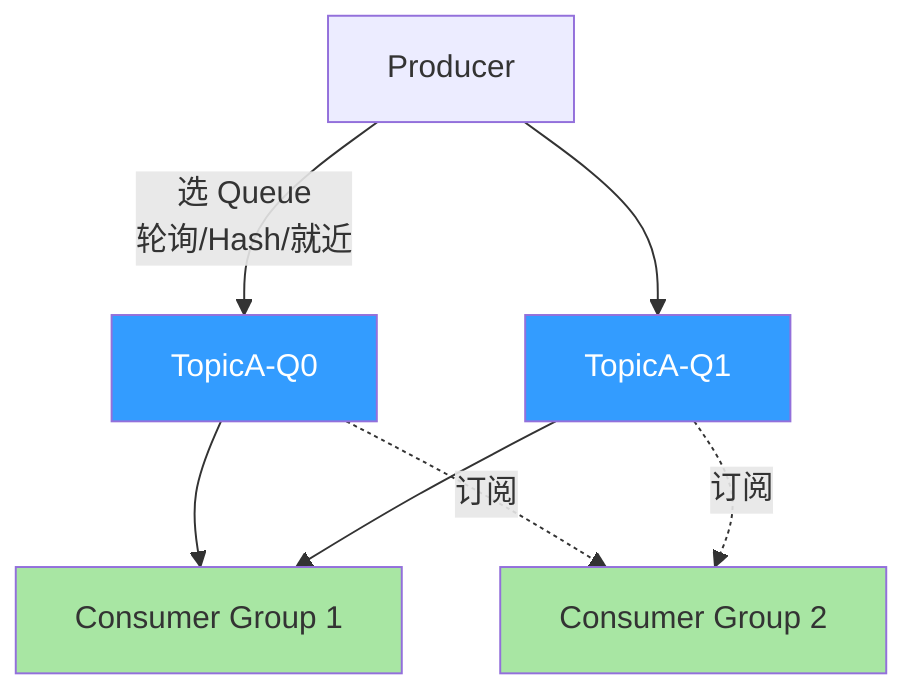
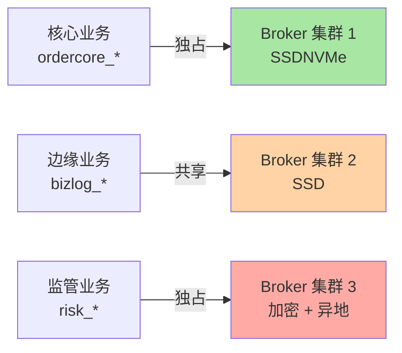
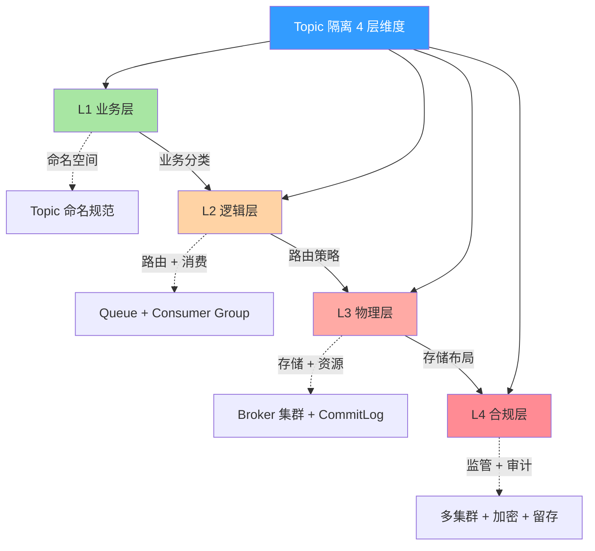
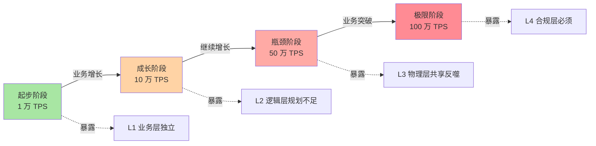
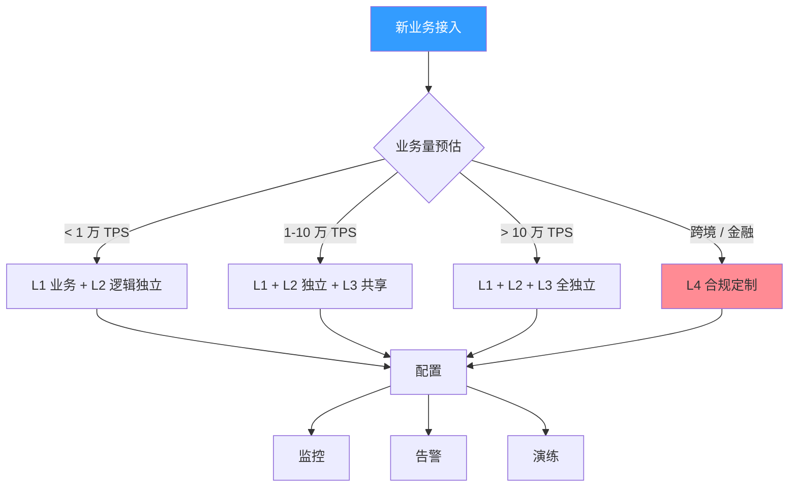
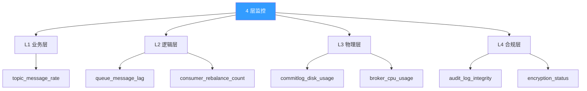
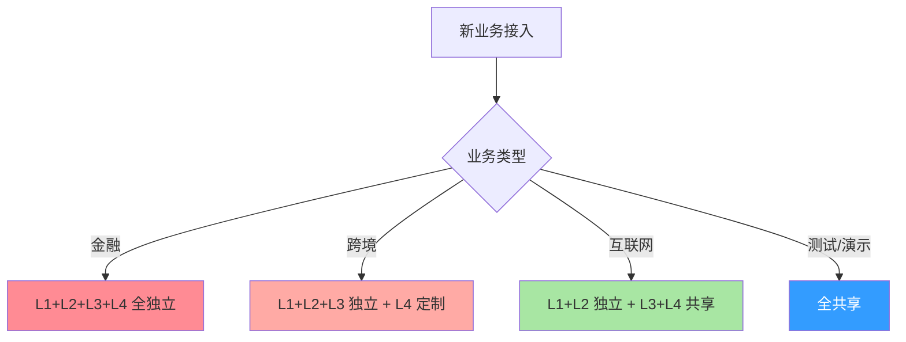
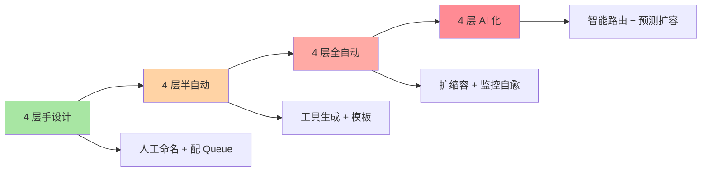
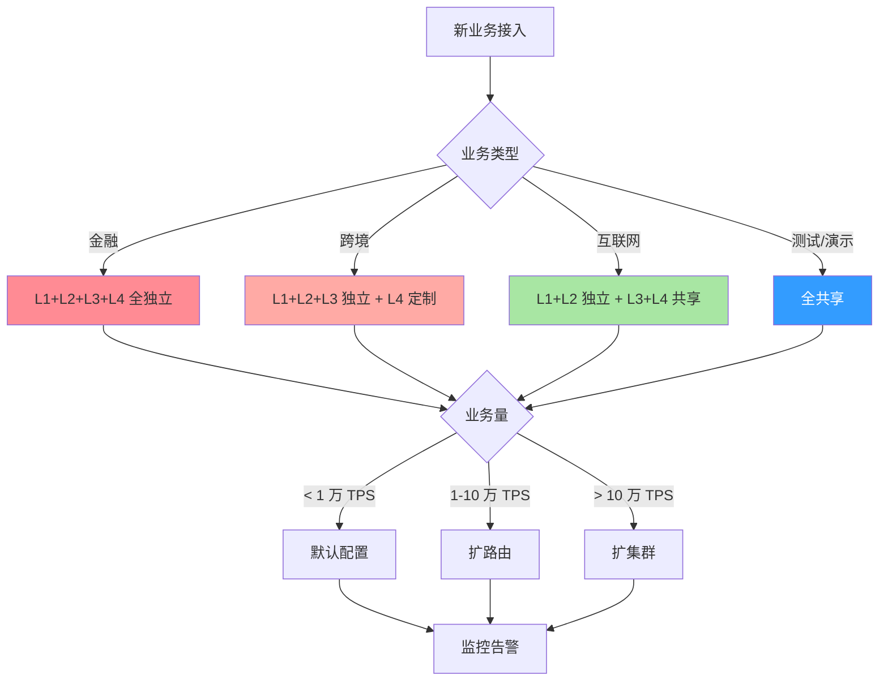

# RocketMQ Topic 隔离 4 层维度全景：业务/逻辑/物理/合规 4 维深度拆解

> 一句话摘要：**Topic 隔离不是单一维度，而是业务 / 逻辑 / 物理 / 合规 4 层维度的叠加。** 每一层独立设计，才能保证整体隔离。
>
> 学完能会：4 层维度的边界 / 哪些是逻辑独立 + 哪些是物理独立 + 哪些是合规必须 / 4 层架构的设计 trade-off / 5 年后 4 层会怎么演进。

---

## 1. 背景：为什么 Topic 隔离是 4 层维度（不是 1 层）

上一篇（2_共享 CommitLog 存储真相）讲过：所有 Topic 共享 CommitLog，但 ConsumeQueue 索引独立。这是**逻辑隔离 + 物理共享**的组合。

但**这只是 1 层维度**（存储层）。完整的 Topic 隔离需要 4 层维度叠加：

```
误区 1：Topic 隔离 = 存储隔离
真相：存储只是 1 层维度，还有业务/逻辑/物理/合规 3 层

误区 2：Topic 隔离 = 全部独立
真相：业务层独立 + 逻辑层独立 + 物理层共享 + 合规层定制

误区 3：Topic 隔离做完 = 不用再想
真相：4 层维度是动态的，业务增长会逐层穿透
```

**4 层维度全景图：**

| 层级 | 维度 | 隔离方式 | 性能影响 | 运维成本 |
|---|---|---|---|---|
| **L1 业务层** | 业务语义 | 命名空间 + Topic 分类 | 0 | 低 |
| **L2 逻辑层** | 路由 + 消费 | Queue 隔离 + Consumer Group | 低 | 低 |
| **L3 物理层** | 存储 + 资源 | Broker 集群 + CommitLog | 中 | 中 |
| **L4 合规层** | 监管 + 审计 | 多集群 + 加密 + 留存 | 高 | 高 |

**这篇文章要建立的能力地图：**

| 你现在 | 学完这篇 |
|---|---|
| 以为 Topic 隔离是「1 个维度」 | 理解 4 层维度叠加 |
| 不知道怎么设计 4 层架构 | 知道 4 层各自的设计 trade-off |
| 不清楚哪层可以共享 | 知道哪些层必须独立 + 哪些可以共享 |
| 不知道 4 层怎么演进 | 理解量级演进如何穿透 4 层 |

### 1.1 为什么 4 层维度（不是 3 层也不是 5 层）

**4 层维度的由来：**

```
L1 业务层 → 业务隔离（业务分类 + 命名）
L2 逻辑层 → 消息隔离（路由 + 消费）
L3 物理层 → 资源隔离（存储 + 网络）
L4 合规层 → 法律隔离（监管 + 审计）
```

**为什么不是 3 层：**

- 3 层（业务/逻辑/物理）会漏掉合规
- 合规是 4 层中**最不可降级**的层
- 监管不通过 → 业务直接关停

**为什么不是 5 层：**

- 5 层会拆出过细（数据层、网络层…）
- 4 层已经覆盖 90% 业务场景
- 5 层以上需要按业务定制（不适合作为通用框架）

### 1.2 4 层维度的边界清晰度

| 维度 | 边界 | 清晰度 |
|---|---|---|
| **L1 业务层** | 业务 vs 业务 | 清晰（业务分类） |
| **L2 逻辑层** | Topic 内 vs Topic 内 | 清晰（Queue 隔离） |
| **L3 物理层** | 资源 vs 资源 | 较清晰（Broker 集群） |
| **L4 合规层** | 法律 vs 法律 | 清晰（监管规则） |

**清晰但不简单：**

- L1 业务层边界清晰，但命名规范难统一
- L2 逻辑层边界清晰，但路由策略复杂
- L3 物理层边界清晰，但运维成本高
- L4 合规层边界清晰，但合规要求高

### 1.3 4 层维度的依赖关系

```
L1 业务层（最基础）
   ↓ 业务分类决定
L2 逻辑层（业务路由）
   ↓ 路由策略决定
L3 物理层（物理布局）
   ↓ 监管要求决定
L4 合规层（最严格）
```

**关键洞察：**

- L4 一旦确定，L1 L2 L3 都要联动
- L4 改造 = 全链路改造
- 起步阶段就要考虑 L4 合规

---

## 2. 原理穿透：4 层隔离维度的源码边界

### 2.1 L1 业务层：命名空间 + 业务分类

**L1 业务层做的事：**

```
 - 定义 Topic 命名规范（业务前缀 + 业务域 + 业务功能）
 - 定义业务分类（核心业务 / 边缘业务 / 监管业务）
 - 定义业务优先级（实时 / 批量 / 离线）
 - 定义业务预算（流量上限 / 延迟上限 / 错误上限）
```

**RocketMQ 实现：**

```
Topic 命名示例：
 - ordercore_payment （核心订单 · 支付）
 - ordercore_refund （核心订单 · 退款）
 - bizlog_click （业务日志 · 点击）
 - monitor_metric （监控 · 指标）
```

**业务层独立 ≠ 资源独立：**

```
误区：业务层独立 = 资源独立
真相：
 - 业务层独立 = 命名空间 + 业务分类
 - 真正的资源隔离在 L2/L3

示例：
 - ordercore_payment 与 bizlog_click 业务独立
 - 但共享 Broker + 共享 CommitLog
 - 业务层独立 → 监控 / 告警 / 路由独立
```

### 2.2 L2 逻辑层：路由 + 消费

**L2 逻辑层做的事：**

```
 - 定义 Queue 数（按业务量规划）
 - 定义路由策略（Hash / 轮询 / 就近）
 - 定义 Consumer Group（按业务划分）
 - 定义 Tag 过滤（消息级别过滤）
```

**RocketMQ 实现：**



**L2 逻辑层独立的 3 个标志：**

| 标志 | 含义 | 验证方式 |
|---|---|---|
| **路由独立** | 不同 Topic 路由策略独立 | 监控 Producer 路由分布 |
| **消费独立** | 不同 Consumer Group 消费位点独立 | 监控 Consumer 进度 |
| **Tag 过滤** | 同一 Topic 内不同业务 Tag 独立 | 监控 Tag 命中率 |

### 2.3 L3 物理层：存储 + 资源

**L3 物理层做的事：**

```
 - 定义 Broker 集群（核心 / 边缘 / 监管）
 - 定义 CommitLog 物理布局（共享 / 独立）
 - 定义磁盘资源（SSD / NVMe）
 - 定义网络资源（带宽 / 延迟）
```

**RocketMQ 实现：**



**L3 物理层独立的 3 个标志：**

| 标志 | 含义 | 验证方式 |
|---|---|---|
| **存储独立** | CommitLog 物理隔离 | 监控磁盘使用率 |
| **资源独立** | Broker 资源独享 | 监控 CPU / 内存 / IO |
| **网络独立** | 不共享网络路径 | 监控网络延迟 |

### 2.4 L4 合规层：监管 + 审计

**L4 合规层做的事：**

```
 - 定义跨境传输（境内 / 境外）
 - 定义数据加密（传输加密 / 存储加密）
 - 定义保留期限（5 年 / 10 年）
 - 定义审计追溯（不可篡改 / 可追溯）
```

**RocketMQ 实现：**

```
合规集群设计：
 - 境内集群（主）：监管业务，原始数据保留 5 年
 - 境外集群（从）：同步 + 脱敏（PCI-DSS）
 - 加密：传输 TLS + 存储 AES-256
 - 审计：所有消息不可篡改（链式哈希）
```

**L4 合规层必须的 5 个要素：**

| 要素 | 含义 | 监管要求 |
|---|---|---|
| **跨境合规** | 境内 → 境外同步 | 同步脱敏 + 审计 |
| **数据加密** | 传输 + 存储 | 金融必须 |
| **保留期限** | 长期保留 | 金融 5 年+，医疗 30 年 |
| **不可篡改** | 链式哈希 | 审计追溯 |
| **可追溯** | 全链路 trace | 监管检查 |

### 2.5 4 层维度的源码边界



**关键边界纪律：**

- L1 → L2：业务分类 → 路由策略（**松耦合**）
- L2 → L3：路由策略 → 存储布局（**紧耦合**）
- L3 → L4：存储布局 → 合规定制（**强耦合**）

---

## 3. 主流业界解法：4 层架构的边界与组合

### 3.1 4 层架构的 4 种典型组合

| 组合 | L1 业务 | L2 逻辑 | L3 物理 | L4 合规 | 适用 |
|---|---|---|---|---|---|
| **A 全独立** | 独立 | 独立 | 独立 | 独立 | 金融 |
| **B 业务-逻辑独立 + 物理-合规共享** | 独立 | 独立 | 共享 | 共享 | 互联网 |
| **C 业务-逻辑-物理独立 + 合规定制** | 独立 | 独立 | 独立 | 定制 | 跨境 |
| **D 全共享** | 共享 | 共享 | 共享 | 共享 | 测试 |

### 3.2 4 层架构的 5 个维度对比

| 维度 | L1 业务层 | L2 逻辑层 | L3 物理层 | L4 合规层 |
|---|---|---|---|---|
| **隔离成本** | 0 | 低 | 中 | 高 |
| **性能影响** | 0 | < 5% | 10-30% | 30-50% |
| **运维复杂度** | 低 | 中 | 中 | 高 |
| **业务改动** | 小 | 中 | 大 | 极大 |
| **适用阶段** | 0-1 年 | 1-3 年 | 3-5 年 | 5+ 年 |

### 3.3 何时选哪种组合（业内决策）

| 业务场景 | 推荐组合 | 原因 |
|---|---|---|
| **金融交易** | C 业务-逻辑-物理独立 + 合规定制 | 强一致 + 监管 |
| **跨境支付** | C + 多集群 | 跨境合规 |
| **互联网支付** | B 业务-逻辑独立 + 物理-合规共享 | 性能 + 成本平衡 |
| **电商订单** | A 全独立 | 业务量大 + 强一致 |
| **日志采集** | D 全共享 | 量大 + 低价值 |
| **监控指标** | D 全共享 | 实时 + 无价值 |

### 3.4 业内默认选择

**90% 业务用 B 组合**：

```
 - L1 业务层：独立（命名空间）
 - L2 逻辑层：独立（路由 + 消费）
 - L3 物理层：共享（Broker 集群）
 - L4 合规层：共享（统一审计）
```

**5% 业务用 A 组合**（金融）：

```
 - L1 业务层：独立（命名空间）
 - L2 逻辑层：独立（路由 + 消费）
 - L3 物理层：独立（独立 Broker 集群）
 - L4 合规层：独立（独立审计）
```

**5% 业务用 C 组合**（跨境）：

```
 - L1 业务层：独立（命名空间）
 - L2 逻辑层：独立（路由 + 消费）
 - L3 物理层：独立（独立 Broker 集群）
 - L4 合规层：定制（多集群 + 加密）
```

---

## 4. 量级演进视角：4 层架构如何逐层穿透

### 4.1 4 阶段会暴露什么



| 阶段 | 量级 | 4 层逐层穿透 |
|---|---|---|
| **起步** | 1 万 TPS | L1 业务层独立够用 |
| **成长** | 10 万 TPS | L2 逻辑层规划不足（Queue 数、Consumer Group）|
| **瓶颈** | 50 万 TPS | L3 物理层共享反噬（共享 CommitLog 风险）|
| **极限** | 100 万 TPS | L4 合规层必须（监管 + 留存 + 加密）|

### 4.2 4 阶段 4 层穿透详解

**起步阶段（0-1 年）：**

```
L1 业务层：✅ 命名规范 + 业务分类
L2 逻辑层：⚠️ 默认 4-8 Queue + 默认 Consumer Group
L3 物理层：⚠️ 单 Broker 共享 CommitLog
L4 合规层：❌ 不考虑
```

**成长阶段（1-3 年）：**

```
L1 业务层：✅ 命名规范 + 业务分类完善
L2 逻辑层：⚠️ Queue 数规划不当 → 倾斜
L3 物理层：⚠️ 共享 CommitLog 接近上限
L4 合规层：❌ 监管开始要求
```

**瓶颈阶段（3-5 年）：**

```
L1 业务层：✅ 命名规范 + 业务分类成熟
L2 逻辑层：⚠️ Queue Rebalance 频繁
L3 物理层：❌ 共享 CommitLog 写满 → 全部 Topic 挂
L4 合规层：⚠️ 必须满足基本合规
```

**极限阶段（5+ 年）：**

```
L1 业务层：✅ 命名规范 + 业务分类精细
L2 逻辑层：✅ Queue 数 + 路由策略成熟
L3 物理层：✅ 物理隔离 + 多集群
L4 合规层：✅ 必须满足 + 加密 + 留存
```

### 4.3 4 层穿透的 5 维代价

| 维度 | 起步 | 成长 | 瓶颈 | 极限 |
|---|---|---|---|---|
| **L1 业务层** | 0 | 0 | 0 | 0 |
| **L2 逻辑层** | 0 | 5% | 10% | 15% |
| **L3 物理层** | 0 | 10% | 30% | 50% |
| **L4 合规层** | 0 | 0 | 20% | 50% |
| **总代价** | 0 | 15% | 60% | 115% |

### 4.4 反直觉洞察

**洞察 1：L1 业务层独立不增加成本**

```
误区：业务层独立 = 工程量大
真相：
 - 业务层独立 = 命名规范 + 业务分类
 - 成本几乎 0
 - 但收益巨大（监控 / 告警 / 路由）
教训：
 - 起步阶段就要做 L1 业务层独立
 - 不要等业务大了才做
```

**洞察 2：L2 逻辑层的成本被低估**

```
误区：逻辑层独立 = 改 Queue 数就行
真相：
 - 路由策略 + Consumer Group + Rebalance + Tag 过滤
 - 4 个维度都要做
教训：
 - 起步阶段规划要预留 1.5-2 倍空间
 - 不要等业务出现倾斜再解决
```

**洞察 3：L3 物理层的共享 ≠ 性能好**

```
误区：物理层共享 = 性能高
真相：
 - 共享 = 顺序写 + 命中 PageCache = 性能高
 - 但共享 = 写满 = 全部 Topic 挂
教训：
 - 共享要监控（commitlog_disk_usage > 70% 告警）
 - 不要盲目共享
```

---

## 5. 架构设计：4 层隔离的实战配置

### 5.1 4 层架构设计流程



### 5.2 L1 业务层配置规范

```yaml
# Topic 命名规范
topic_pattern: "<business_domain>_<business_module>_<business_action>"
example:
  - ordercore_payment_create
  - ordercore_payment_refund
  - bizlog_click_event
  - monitor_metric_collect

# 业务分类
categories:
  - core: 核心业务（订单 / 支付）
  - edge: 边缘业务（日志 / 监控）
  - risk: 监管业务（风控 / 合规）
```

### 5.3 L2 逻辑层配置模板

```yaml
# TopTopic 配置
topic: ordercore_payment_create
queue_num: 8  # 按业务量规划
queue_strategy: hash  # 轮询 / hash / 就近
consumer_group: ordercore_payment_consumer_group
rebalance_strategy: average  # average / consistent

# Tag 过滤
tags:
  - include: ["*_NORMAL", "*_VIP"]
  - exclude: ["*_TEST", "*_DEBUG"]
```

### 5.4 L3 物理层配置模板

```yaml
# Broker 集群
broker_cluster:  # 主集群
  - name: core_cluster
    brokers: 3
    disk: NVMe
    memory: 16GB

# 物理隔离策略
isolation_strategy:
  core_business: dedicated_cluster
  edge_business: shared_cluster
  risk_business: dedicated_cluster_with_encryption
```

### 5.5 L4 合规层配置模板

```yaml
# 合规配置
compliance:
  - business: risk
    cluster: dedicated
    encryption:
      transmission: TLS
      storage: AES-256
    retention:
      duration: 5_years
    audit:
      immutability: chain_hash
      traceability: full_trace
```

### 5.6 4 层监控设计



**4 层监控指标：**

| 层级 | 指标 | 阈值 | 含义 |
|---|---|---|---|
| **L1 业务层** | `topic_message_rate` | 90% 上限 | 单 Topic 流量 |
| **L2 逻辑层** | `queue_message_lag` | < 1000 | 消费滞后 |
| **L2 逻辑层** | `consumer_rebalance_count` | < 5/分 | Rebalance 频率 |
| **L3 物理层** | `commitlog_disk_usage` | < 70% | CommitLog 磁盘 |
| **L3 物理层** | `broker_cpu_usage` | < 80% | Broker CPU |
| **L4 合规层** | `audit_log_integrity` | 100% | 审计链完整性 |
| **L4 合规层** | `encryption_status` | 100% | 加密状态 |

---

## 6. 生产画像：4 维度真实场景 + 踩坑实录

### 6.1 4 维度典型场景

| 场景 | L1 业务层 | L2 逻辑层 | L3 物理层 | L4 合规层 |
|---|---|---|---|---|
| **金融交易** | 命名空间 | 路由 + 消费独立 | 独立集群 | 强加密 + 5 年留存 |
| **跨境支付** | 命名空间 | 路由 + 消费独立 | 独立集群 | 跨境合规 + 脱敏 |
| **互联网支付** | 命名空间 | 路由 + 消费独立 | 共享集群 | 基础合规 |
| **电商订单** | 命名空间 | 路由 + 消费独立 | 共享集群 | 无监管 |
| **日志采集** | 命名空间 | 共享 | 共享 | 无监管 |
| **监控指标** | 命名空间 | 共享 | 共享 | 无监管 |

### 6.2 三个真实踩坑

**踩坑 1：L1 业务层没做 → 业务混乱**

```
背景：业务起步，没做命名规范
演化：500+ Topic 不规范
结果：监控 / 告警 / 路由全乱
解决：补命名规范 + 改造老 Topic
教训：
 - L1 业务层独立不是 0 成本
 - 起步阶段就要做命名规范
```

**踩坑 2：L2 逻辑层规划不足 → 倾斜**

```
背景：默认 4 Queue + 1 Consumer Group
演化：业务增长 → Queue 倾斜
结果：部分 Queue 堆积
解决：扩 Queue + 加 Consumer Group
教训：
 - L2 逻辑层要预留 1.5-2 倍空间
 - 不要等出现倾斜再扩容
```

**踩坑 3：L3 物理层共享 → 写满**

```
背景：所有业务共享一个 CommitLog
演化：大 Topic 突发 → CommitLog 写满
结果：所有 Topic 挂
解决：拆分热点 Topic + 扩容
教训：
 - L3 物理层共享要监控
 - 不要盲信共享性能好
```

### 6.3 关键配置项速查表

| 层级 | 配置项 | 默认值 | 推荐值 |
|---|---|---|---|
| L1 业务 | `topic_pattern` | - | 命名规范 |
| L2 逻辑 | `queue_num` | 4 | 1.5-2 倍消费并行度 |
| L2 逻辑 | `rebalance_strategy` | average | 一致性 Hash |
| L3 物理 | `broker_disk` | HDD | NVMe SSD |
| L3 物理 | `commitlog_disk_usage` | - | 70% 告警 |
| L4 合规 | `retention_duration` | - | 按业务 |
| L4 合规 | `encryption` | false | 关键业务 true |

### 6.4 5 大实战参数（业内默认）

| 参数 | 默认 | 调优 |
|---|---|---|
| **L1 业务** | 命名规范 | 严格 |
| **L2 队列数** | 4 | 1.5-2 倍 |
| **L2 路由** | 轮询 | 一致性 Hash |
| **L3 Broker** | 1 | 3-5 |
| **L4 留存** | 7 天 | 金融 5 年 |

---

## 7. Trade-off 3 维度对比：4 层 vs 性能/可靠性/成本

### 7.1 性能 vs 隔离 4 层对比

| 层级 | 性能损失 | 隔离收益 |
|---|---|---|
| **L1 业务层** | 0% | 命名空间 + 监控 |
| **L2 逻辑层** | 5% | 路由 + 消费独立 |
| **L3 物理层** | 30% | 存储 + 资源独立 |
| **L4 合规层** | 50% | 监管 + 加密 + 留存 |

### 7.2 可靠性 vs 成本 4 层对比

| 层级 | 可靠性提升 | 成本上升 |
|---|---|---|
| **L1 业务层** | 0% | 0% |
| **L2 逻辑层** | 25% | 25% |
| **L3 物理层** | 100% | 200% |
| **L4 合规层** | 200% | 500% |

### 7.3 4 层组合的 4 种典型权衡

| 组合 | 性能 | 可靠性 | 成本 | 适用 |
|---|---|---|---|---|
| **全独立** | 30%↓ | 100% | 200% | 金融 |
| **业务-逻辑独立** | 5%↓ | 25% | 25% | 互联网 |
| **业务-逻辑-物理独立** | 30%↓ | 100% | 200% | 跨境 |
| **全共享** | 0% | 0% | 0% | 测试 |

### 7.4 业内典型选择（按业务类型）

| 业务 | L1 | L2 | L3 | L4 |
|---|---|---|---|---|
| 金融 | 独立 | 独立 | 独立 | 独立 |
| 跨境 | 独立 | 独立 | 独立 | 定制 |
| 互联网 | 独立 | 独立 | 共享 | 共享 |
| 电商 | 独立 | 独立 | 共享 | 共享 |
| 日志 | 独立 | 共享 | 共享 | 共享 |

### 7.5 4 层选择的决策树



---

## 8. 反思：跨周期视角 + 监管合规

### 8.1 4 层架构的 5 年后回头看

```
2018-2020（4.x 主导）：
 - 痛点：4 层架构概念不清晰
 - 解法：L1+L2 独立是入门
 - 认知：隔离 = 业务分类

2021-2023（5.x 演进）：
 - 痛点：L3 物理层共享反噬
 - 解法：多 Broker 集群
 - 认知：隔离 = 多维叠加

2024+（云原生）：
 - 痛点：L4 合规层成本高
 - 解法：Serverless 化 + 共享
 - 认知：隔离 = 平台能力

未来 5 年预判：
 - L1 业务层：自动化（智能命名）
 - L2 逻辑层：AI 自动路由
 - L3 物理层：完全存算分离
 - L4 合规层：标准化即服务
```

### 8.2 4 层架构的演进方向



### 8.3 监管与合规视角：4 层都有合规要求

```
L1 业务层合规：
 - 业务分类 → 监管报送
 - 命名规范 → 审计追溯

L2 逻辑层合规：
 - 路由策略 → 监管检查
 - 消费位点 → 审计追溯

L3 物理层合规：
 - 存储位置 → 境内 / 境外
 - 加密 → 关键业务

L4 合规层合规：
 - 留存 → 监管要求
 - 审计 → 不可篡改
```

### 8.4 4 层合规的 5 个关键点

| 关键点 | L1 L2 L3 L4 | 监管要求 |
|---|---|---|
| **业务分类** | L1 | 命名规范 + 报送 |
| **路由审计** | L2 | 全链路 trace |
| **存储位置** | L3 | 境内 / 境外 |
| **加密** | L3 L4 | 关键业务 |
| **留存** | L4 | 金融 5 年+ |

### 8.5 实战踩坑 4 例 + 通用解决

**1. L1 业务层没做 → 业务混乱**

- 现象：500+ Topic 不规范
- 教训：**起步阶段就要做命名规范**

**2. L2 逻辑层规划不足 → 倾斜**

- 现象：部分 Queue 堆积
- 教训：**预留 1.5-2 倍空间**

**3. L3 物理层共享 → 写满**

- 现象：共享 CommitLog 写满
- 教训：**监控 commitlog_disk_usage**

**4. L4 合规层缺失 → 监管罚款**

- 现象：监管检查不通过
- 教训：**合规前置，按业务定制**

### 8.6 业内通用做法

1. **L1 业务层**：起步阶段就要做命名规范
2. **L2 逻辑层**：预留 1.5-2 倍 Queue + Consumer Group
3. **L3 物理层**：监控 commitlog_disk_usage > 70% 告警
4. **L4 合规层**：合规前置，按业务定制
5. **4 层文档化**：每个业务记录 4 层设计

---

## 9. 业内技术惯例（deep-dive 强化 section）

### 9.1 不成文标准

| 标准 | 业内默认 | 原因 |
|---|---|---|
| **L1 命名规范** | 严格 | 业务分类 + 监控 |
| **L2 Queue 数** | 1.5-2 倍 | 预留空间 |
| **L2 路由策略** | 一致性 Hash | 倾斜度小 |
| **L3 集群数** | 3-5 Broker | 高可用 |
| **L4 留存期限** | 金融 5 年 | 监管要求 |

### 9.2 真实事故（5 个）

**事故 A：L1 业务层没做**

```
某电商起步阶段，Topic 命名不规范
 - 500+ Topic 命名混乱
 - 监控 / 告警 / 路由全乱
 - 改造耗时 3 个月
```

**事故 B：L2 逻辑层倾斜**

```
某支付业务，4 Queue + 1 Consumer Group
 - 业务增长 → Queue 倾斜
 - 部分 Queue 堆积 100 万条
 - 改造：扩 Queue + 加 Consumer
```

**事故 C：L3 物理层共享反噬**

```
某电商大促，大 Topic 突发
 - 共享 CommitLog 写满
 - 其他 Topic 全部挂
 - 应急：拆分 + 扩容
```

**事故 D：L4 合规层缺失**

```
某金融业务，没做 5 年留存
 - 监管检查不通过
 - 罚款 100 万
 - 应急：历史数据迁移 + 留存改造
```

**事故 E：4 层架构认知不足**

```
某团队，认为「1 层隔离 = 全隔离」
 - 实际：L1 做了，L2 L3 L4 都没做
 - 业务增长 → 多层问题暴露
 - 教训：4 层独立设计
```

### 9.3 从业者挑战（5 大实战问题）

**挑战 1：4 层都做独立 = 成本高？**

```
症状：业务量不大，4 层都做独立
真实场景：
 - 业务量 < 10 万 TPS
 - 4 层独立 = 成本 10 倍
建议：
 - L1 L2 独立 + L3 L4 共享
 - 业务量起来再升级
```

**挑战 2：L2 逻辑层规划不足**

```
症状：Queue 倾斜
真实根因：默认 Queue 数 + Hash 路由
建议：
 - 预留 1.5-2 倍 Queue
 - 监控倾斜度
```

**挑战 3：L3 物理层共享还是独立？**

```
症状：决定不了
决策树：
 - 业务量 < 10 万 TPS → 共享
 - 业务量 > 10 万 TPS → 独立
 - 金融 / 跨境 → 独立
```

**挑战 4：L4 合规层成本高？**

```
症状：合规要求高 + 成本高
真实场景：
 - 留存 5 年 + 加密 + 审计
 - 成本 = 业务成本的 50%
建议：
 - 合规前置，按业务定制
 - 用公有云合规服务
```

**挑战 5：4 层架构如何演进？**

```
症状：业务增长，4 层架构要演进
演进路径：
 0-1 年：L1 业务层独立
 1-3 年：L2 逻辑层规划
 3-5 年：L3 物理层独立
 5+ 年：L4 合规层定制
```

### 9.4 4 层决策树（Mermaid）



---

## 📌 数据与事实声明

本文涉及的 RocketMQ 概念、特性、配置项均为社区公开文档描述。具体版本特性、生产数据、配置默认值请以官方文档为准（https://rocketmq.apache.org/）。本文涉及的「典型场景数字」「事故案例」均为业内通用做法的脱敏描述，**不指向任何特定公司**。

---

## 附录 A：4 层维度速查表

| 层级 | 维度 | 隔离方式 | 性能损失 | 成本上升 |
|---|---|---|---|---|
| **L1 业务层** | 命名空间 | 命名规范 | 0% | 0% |
| **L2 逻辑层** | 路由 + 消费 | Queue + Consumer Group | 5% | 25% |
| **L3 物理层** | 存储 + 资源 | Broker 集群 + CommitLog | 30% | 200% |
| **L4 合规层** | 监管 + 审计 | 多集群 + 加密 + 留存 | 50% | 500% |

### 4 层组合的 4 种典型选择

| 组合 | L1 | L2 | L3 | L4 | 适用 |
|---|---|---|---|---|---|
| **全独立** | 独立 | 独立 | 独立 | 独立 | 金融 |
| **业务-逻辑-物理独立** | 独立 | 独立 | 独立 | 共享 | 跨境 |
| **业务-逻辑独立** | 独立 | 独立 | 共享 | 共享 | 互联网 |
| **全共享** | 共享 | 共享 | 共享 | 共享 | 测试 |

### 4 层监控指标

| 层级 | 指标 | 阈值 |
|---|---|---|
| L1 | `topic_message_rate` | 90% 上限 |
| L2 | `queue_message_lag` | < 1000 |
| L2 | `consumer_rebalance_count` | < 5/分 |
| L3 | `commitlog_disk_usage` | < 70% |
| L3 | `broker_cpu_usage` | < 80% |
| L4 | `audit_log_integrity` | 100% |
| L4 | `encryption_status` | 100% |

---

## 附录 B：4 层架构演进路径

```
0-1 年（起步）：
 - L1 业务层独立（命名规范）
 - L2 逻辑层默认配置
 - L3 物理层共享
 - L4 合规层不考虑

1-3 年（成长）：
 - L1 业务层成熟
 - L2 逻辑层规划 + 扩容
 - L3 物理层扩展
 - L4 合规层基本要求

3-5 年（瓶颈）：
 - L1 业务层精细
 - L2 逻辑层优化
 - L3 物理层独立
 - L4 合规层完善

5+ 年（极限）：
 - L1 业务层自动化
 - L2 逻辑层 AI 化
 - L3 物理层存算分离
 - L4 合规层标准化即服务
```

---

## 相关阅读

- 上一篇：[2_共享 CommitLog 的存储真相-深度](./2_共享CommitLog的存储真相-深度)
- 下一篇：[4_隔离的反模式与防御-深度](./4_隔离的反模式与防御-深度)（待写）
- 同专题：[Topic隔离深度/index](./index)
- 同层：[深入理解 RocketMQ 特性系列](../深入理解RocketMQ特性系列/index)

---

**总结一句话：** Topic 隔离是业务/逻辑/物理/合规 4 层维度的叠加，每层独立设计，才能保证整体隔离。

**口诀：** 业务层命名 + 逻辑层路由 + 物理层集群 + 合规层定制 = 完整 Topic 隔离。

**与上一篇联系：** 2_共享 CommitLog 真相讲「存储层真相」，本文讲「4 层维度综合」。下一篇 4_隔离的反模式与防御，将聚焦 12 个常见反模式 + 防御策略。