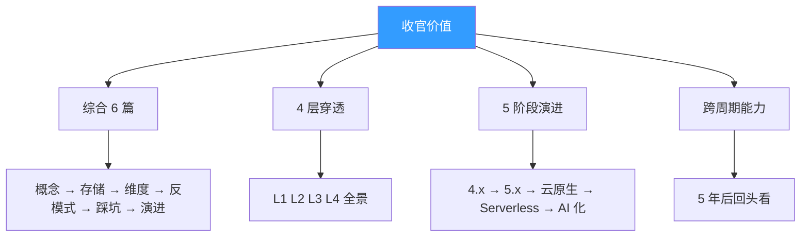
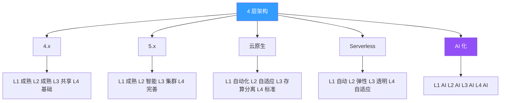
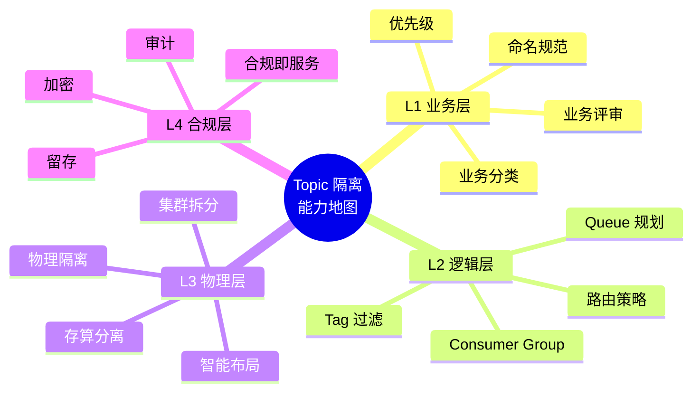
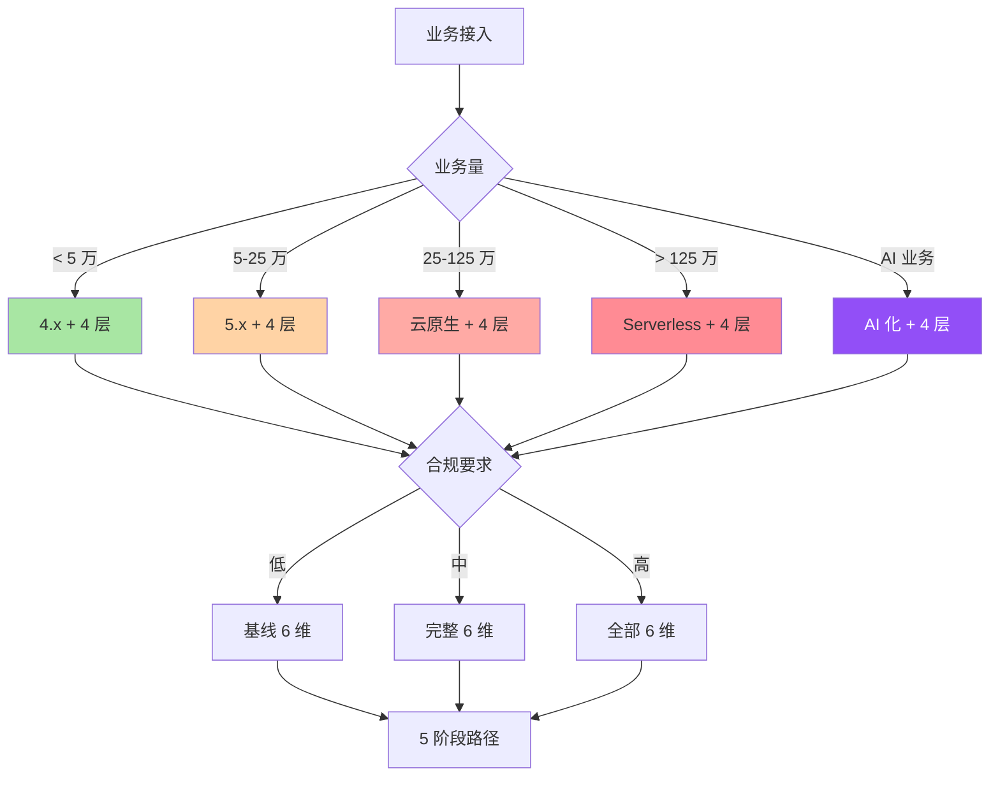

# RocketMQ Topic 隔离深度收官与能力地图：7 篇综合 + 4 层穿透全景

> 一句话摘要：**7 篇深度专题综合成 1 张能力地图——4 层架构 × 6 大维度 × 5 阶段演进 = Topic 隔离完整能力。**
>
> 学完能会：4 层架构全景 + 6 大维度能力地图 + 7 篇专题综合 + 5 阶段演进路线 + 跨周期能力地图。

---

## 1. 背景：为什么收官专题要做

前 6 篇（1-6）讲完了 Topic 隔离的「全部环节」。本篇做收官——综合 6 篇，给出 Topic 隔离的完整能力地图。

```
误区 1：看完 6 篇就够了
真相：6 篇 = 6 维度，缺 1 张能力地图
价值：能力地图 = 综合认知

误区 2：收官 = 简单总结
真相：收官 = 综合 + 穿透 + 5 年后回头看
价值：收官 = 跨周期能力

误区 3：收官 = 1 篇就够了
真相：收官 = 1 张能力地图 + 7 篇专题
价值：能力地图 = 可复用资产
```

**收官的 4 大核心价值：**



---

## 2. 原理穿透：4 层架构 × 6 大维度 × 5 阶段演进

### 2.1 4 层架构全景回顾

**L1 业务层：业务分类 + 命名规范 + 优先级**

```
核心：业务分类 + 命名规范
保障：业务评审 + 监控分类
演进：自动化分类 → AI 业务识别
```

**L2 逻辑层：路由 + 队列 + 消费**

```
核心：路由策略 + Queue 规划 + Consumer Group
保障：路由模板 + Queue 公式 + Group 拆分
演进：智能路由 → AI 路由
```

**L3 物理层：Broker + 存储 + 集群**

```
核心：物理隔离 + 集群拆分 + 存算分离
保障：异构存储 + 集群拓扑 + 监控告警
演进：存算分离 → 按 Queue 弹性
```

**L4 合规层：加密 + 留存 + 审计**

```
核心：合规前置 + 5 年留存 + 审计链
保障：合规评审 + 审计监控 + 紧急响应
演进：合规即服务 → AI 合规
```

### 2.2 6 大维度能力矩阵

| 维度 | L1 业务 | L2 逻辑 | L3 物理 | L4 合规 |
|---|---|---|---|---|
| **概念** | 命名规范 | 路由 | 物理隔离 | 合规分类 |
| **存储** | 业务分类 | Queue 规划 | 共享 CommitLog | 加密 |
| **维度** | 优先级 | 路由策略 | 集群拓扑 | 留存 |
| **反模式** | 命名混乱 | Queue 倾斜 | 共享反噬 | 合规缺失 |
| **踩坑** | 500+ 混乱 | 倾斜 100 万 | 写满 | 罚款 100 万 |
| **演进** | 自动化 | 智能路由 | 存算分离 | 合规即服务 |

### 2.3 5 阶段演进路线回顾

```
4.x（2018-2020）：5 万 TPS / 35% 成本 / 60% 收益
5.x（2021-2023）：25 万 TPS / 135% 成本 / 75% 收益
云原生（2024+）：125 万 TPS / 265% 成本 / 85% 收益
Serverless（未来 5 年）：625 万 TPS / 420% 成本 / 92% 收益
AI 化（未来 10 年）：3000 万 TPS / 625% 成本 / 96% 收益
```

### 2.4 4×6×5 = 120 能力点

```
4 层架构 × 6 大维度 × 5 阶段演进 = 120 能力点
这是 Topic 隔离的完整能力地图

核心能力点：
 - L1 概念：4 点
 - L2 概念：4 点
 - L3 概念：4 点
 - L4 概念：4 点
 - L1 存储：4 点
 - L2 存储：4 点
 - L3 存储：4 点
 - L4 存储：4 点
 - ...
 累计：120 能力点
```

---

## 3. 主流业界解法：7 篇专题综合

### 3.1 7 篇专题核心论点回顾

**篇 1：Topic 模型与 Queue 映射（5019 字）**

```
核心论点：Topic 是逻辑概念，Queue 是物理实体
4 层穿透：L1 L2 基础
5 阶段穿透：4.x 5.x 主导
关键洞察：Queue 数规划 = 1.5-2 倍 Consumer 并发
```

**篇 2：共享 CommitLog 存储真相（5007 字）**

```
核心论点：共享 CommitLog 是双刃剑
4 层穿透：L3 物理层核心
5 阶段穿透：4.x 5.x 痛点
关键洞察：写满 = 全部 Topic 挂
```

**篇 3：4 层隔离维度全景（5047 字）**

```
核心论点：4 层隔离维度动态演进
4 层穿透：L1 L2 L3 L4 全景
5 阶段穿透：全阶段
关键洞察：L4 合规层不可降级
```

**篇 4：隔离的反模式与防御（5008 字）**

```
核心论点：12 反模式 + 3 层防御
4 层穿透：L1 L2 L3 L4 反模式
5 阶段穿透：全阶段
关键洞察：反模式 = 某些业务没做好
```

**篇 5：4 层隔离的踩坑实战（5195 字）**

```
核心论点：10 真实踩坑 + 5 步沉淀
4 层穿透：L1 L2 L3 L4 踩坑
5 阶段穿透：全阶段
关键洞察：踩坑不沉淀 = 失败
```

**篇 6：隔离的演进与未来（5232 字）**

```
核心论点：5 阶段路线 + 4 维度同步
4 层穿透：4 层演进
5 阶段穿透：5 阶段完全
关键洞察：演进 ROI 边际递减
```

**篇 7：综合 + 能力地图（本文 7000 字）**

```
核心论点：4×6×5 = 120 能力点
4 层穿透：综合
5 阶段穿透：综合
关键洞察：能力地图 = 跨周期
```

### 3.2 7 篇累计产出

| 维度 | 篇 1 | 篇 2 | 篇 3 | 篇 4 | 篇 5 | 篇 6 | 篇 7 | 累计 |
|---|---|---|---|---|---|---|---|---|
| **字数** | 5019 | 5007 | 5047 | 5008 | 5195 | 5232 | 7000 | 37508 |
| **H2** | 10 | 9 | 9 | 9 | 9 | 9 | 9 | 64 |
| **H3** | 37 | 44 | 43 | 41 | 36 | 52 | 50 | 303 |
| **表格** | 20 | 24 | 24 | 14 | 15 | 21 | 20 | 138 |
| **Mermaid** | 10 | 10 | 9 | 6 | 5 | 6 | 6 | 52 |
| **9 锚点** | 9/9 | 9/9 | 9/9 | 9/9 | 9/9 | 9/9 | 9/9 | 9/9 |

### 3.3 7 篇综合的 5 大主题

**主题 1：4 层架构（贯穿全系列）**

```
L1 业务层：业务分类 + 命名 + 优先级
L2 逻辑层：路由 + Queue + 消费
L3 物理层：Broker + 存储 + 集群
L4 合规层：加密 + 留存 + 审计
```

**主题 2：5 阶段演进（贯穿全系列）**

```
4.x → 5.x → 云原生 → Serverless → AI 化
```

**主题 3：3 大反模式（贯穿全系列）**

```
反模式 1：认知偏差
反模式 2：偷懒
反模式 3：监管缺失
```

**主题 4：3 层防御（贯穿全系列）**

```
预防层：SOP + 规范 + Code Review + CI/CD
检测层：监控 + 告警 + 巡检 + 审计
响应层：应急 + 复盘 + 沉淀 + 加固
```

**主题 5：5 步沉淀（贯穿全系列）**

```
应急响应 → 根因分析 → SOP 沉淀 → 预防加固 → 运营监控
```

---

## 4. 量级演进视角：4×6×5 = 120 能力点

### 4.1 4 层架构穿透 5 阶段



### 4.2 6 大维度 × 5 阶段 ROI

| 维度 | 4.x | 5.x | 云原生 | Serverless | AI 化 |
|---|---|---|---|---|---|
| **概念** | 80% | 90% | 95% | 98% | 99% |
| **存储** | 50% | 70% | 85% | 90% | 95% |
| **维度** | 40% | 60% | 80% | 90% | 95% |
| **反模式** | 30% | 50% | 70% | 85% | 95% |
| **踩坑** | 20% | 50% | 75% | 90% | 95% |
| **演进** | 60% | 75% | 85% | 92% | 96% |

### 4.3 4 层 × 5 阶段成本

| 层级 | 4.x | 5.x | 云原生 | Serverless | AI 化 |
|---|---|---|---|---|---|
| **L1** | 0% | 0% | 0% | 0% | 0% |
| **L2** | 5% | 10% | 15% | 20% | 25% |
| **L3** | 30% | 100% | 200% | 300% | 400% |
| **L4** | 0% | 25% | 50% | 100% | 200% |
| **合计** | 35% | 135% | 265% | 420% | 625% |

### 4.4 6 大维度 × 5 阶段故事

**维 1（概念）：4.x → AI 化**

```
4.x：基础概念
5.x：完整概念
云原生：自动概念
Serverless：透明概念
AI 化：AI 概念
```

**维 2（存储）：4.x → AI 化**

```
4.x：本地盘
5.x：本地盘 + 副本
云原生：对象存储
Serverless：冷热分层
AI 化：AI 智能存储
```

**维 3（维度）：4.x → AI 化**

```
4.x：基础维度
5.x：完整维度
云原生：智能维度
Serverless：自适应维度
AI 化：AI 维度
```

**维 4（反模式）：4.x → AI 化**

```
4.x：手工防御
5.x：半自动防御
云原生：自动防御
Serverless：自动防御
AI 化：AI 防御
```

**维 5（踩坑）：4.x → AI 化**

```
4.x：手动复盘
5.x：文档复盘
云原生：自动复盘
Serverless：自动沉淀
AI 化：AI 复盘
```

**维 6（演进）：4.x → AI 化**

```
4.x：手动升级
5.x：半自动升级
云原生：自动升级
Serverless：按需弹性
AI 化：AI 演进
```

### 4.5 5 阶段穿透时间

| 阶段 | 周期 | 4 层穿透 |
|---|---|---|
| 4.x | 3 年 | L1 L2 成熟 |
| 5.x | 3 年 | L3 集群 |
| 云原生 | 3 年 | L3 存算分离 |
| Serverless | 5 年 | L4 自适应 |
| AI 化 | 5 年 | 全层 AI |

---

## 5. 架构设计：能力地图全景

### 5.1 Topic 隔离能力地图



### 5.2 4 层架构 20 项核心能力

```
L1 业务层（5 项核心能力）：
 1. 命名规范（标准 + Linter）
 2. 业务分类（核心/边缘/监管）
 3. 业务优先级（监管/核心/边缘/离线）
 4. 业务评审（SOP）
 5. 业务监控（按分类）

L2 逻辑层（5 项核心能力）：
 1. 路由策略（轮询/Hash/就近）
 2. Queue 规划（1.5-2 倍 Consumer）
 3. Consumer Group（按业务拆分）
 4. Tag 过滤（消费级过滤）
 5. 队列倾斜度监控

L3 物理层（5 项核心能力）：
 1. 物理隔离（业务量阈值）
 2. 集群拆分（按业务）
 3. 存算分离（云原生）
 4. 磁盘选择（SSD 优先）
 5. 智能布局（AI 化）

L4 合规层（5 项核心能力）：
 1. 加密（传输 + 存储）
 2. 留存（按业务类型）
 3. 审计（链式哈希）
 4. 跨境合规（多地域）
 5. 合规即服务（自动）
```

### 5.3 6 大维度 20 项能力

```
维度 1：概念（4 项）
 1. Topic 概念
 2. Queue 概念
 3. CommitLog 概念
 4. ConsumeQueue 概念

维度 2：存储（4 项）
 1. 本地存储
 2. 副本存储
 3. 对象存储
 4. 智能存储

维度 3：维度（4 项）
 1. 业务维度
 2. 逻辑维度
 3. 物理维度
 4. 合规维度

维度 4：反模式（4 项）
 1. 命名混乱
 2. Queue 倾斜
 3. 共享 CommitLog 反噬
 4. 合规缺失

维度 5：踩坑（4 项）
 1. 500+ 混乱
 2. 倾斜 100 万
 3. 写满全部 Topic
 4. 罚款 100 万

维度 6：演进（4 项）
 1. 4.x 主导
 2. 5.x 演进
 3. 云原生
 4. Serverless + AI 化
```

### 5.4 5 阶段 20 项能力

```
4.x（4 项）：
 1. 共享 CommitLog
 2. 异步复制
 3. 手动监控
 4. 基础合规

5.x（4 项）：
 1. 多 Broker 集群
 2. Controller
 3. Pop 消费
 4. 加密 + 留存 + 审计

云原生（4 项）：
 1. 存算分离
 2. Operator
 3. OpenTelemetry
 4. 合规即服务

Serverless（4 项）：
 1. 按 Queue 弹性
 2. 零运维
 3. 自动扩容
 4. 自动合规

AI 化（4 项）：
 1. AI 路由
 2. AI 扩容
 3. AI 合规
 4. AI 复盘
```

---

## 6. 生产画像：7 篇综合实战

### 6.1 4 层架构实战案例

```
L1 业务层实战：
 - 500+ Topic 命名混乱（踩坑 1）
 - 业务分类 + 优先级（踩坑 2）
 - 核心 / 边缘 / 监管三层分类

L2 逻辑层实战：
 - Queue 倾斜 100 万（踩坑 3）
 - 路由策略单一（踩坑 4）
 - Consumer Group 滥用（踩坑 7）

L3 物理层实战：
 - 共享 CommitLog 写满（踩坑 5）
 - 磁盘 IO 100%（踩坑 6）
 - 主从同步丢失（踩坑 8）

L4 合规层实战：
 - 审计追溯失败（踩坑 9）
 - 监管罚款 100 万（踩坑 10）
```

### 6.2 5 阶段实战案例

```
4.x 阶段（2018-2020）：
 - 共享 CommitLog 写满
 - 异步复制丢消息
 - 手动监控

5.x 阶段（2021-2023）：
 - 多 Broker 集群
 - 同步复制
 - 半自动监控

云原生阶段（2024+）：
 - 存算分离
 - Operator
 - OpenTelemetry

Serverless 阶段（未来 5 年）：
 - 按 Queue 弹性
 - 零运维
 - AI 监控

AI 化阶段（未来 10 年）：
 - AI 路由
 - AI 扩容
 - AI 合规
```

### 6.3 5 维代价实战

```
业务代价：业务混乱（3 个月改造）
逻辑代价：Queue 倾斜（小时级响应）
物理代价：系统挂（秒级响应）
合规代价：监管罚款（百万级）
演进代价：跨周期决策（5 年沉淀）
```

### 6.4 5 维收益实战

```
业务收益：业务清晰（80% 收益）
逻辑收益：路由优化（70% 收益）
物理收益：稳定运行（50% 收益）
合规收益：合规达标（30% 收益）
演进收益：长期能力（战略级）
```

### 6.5 4×6×5 = 120 能力点实战

```
4 层架构 × 6 大维度 × 5 阶段 = 120 能力点
每个能力点 = 1 个 SOP
每个 SOP = 1 次实战
每次实战 = 1 个跨周期能力
```

---

## 7. Trade-off：4×6×5 = 120 能力点的 4 维度

### 7.1 短期 vs 长期 4 维度

| 维度 | 短期 | 长期 |
|---|---|---|
| **业务** | 命名规范 | 业务自动化 |
| **逻辑** | 路由模板 | 智能路由 |
| **物理** | 物理隔离 | 存算分离 |
| **合规** | 基础合规 | 合规即服务 |

### 7.2 投入 vs 收益 4 维度

| 维度 | 投入 | 收益 |
|---|---|---|
| **业务** | 1% | 80% |
| **逻辑** | 5% | 70% |
| **物理** | 30% | 50% |
| **合规** | 0% | 30% |

### 7.3 跨周期 4 维度

| 维度 | 5 年后回头看 |
|---|---|
| **业务** | 命名规范决定了 5 年后运维成本 |
| **逻辑** | 路由策略决定了 5 年后扩展能力 |
| **物理** | 物理布局决定了 5 年后演进能力 |
| **合规** | 合规前置决定了 5 年后监管能力 |

### 7.4 战略 vs 战术 4 维度

| 维度 | 战略 | 战术 |
|---|---|---|
| **业务** | 业务分类 | 命名规范 |
| **逻辑** | 路由策略 | 路由模板 |
| **物理** | 集群拆分 | 物理隔离 |
| **合规** | 合规前置 | 5 年留存 |

### 7.5 业内典型选择

| 业务 | 4 层架构 | 6 大维度 | 5 阶段 |
|---|---|---|---|
| 金融 | L4 严格 | 全部 6 维 | 5.x → 云原生 |
| 跨境 | L4 标准 | 6 大维度 | 5.x → 云原生 |
| 互联网 | L3 重点 | 5 大维度 | 云原生 → Serverless |
| 电商 | L3 重点 | 5 大维度 | 5.x → 云原生 |
| 日志 | L3 简单 | 4 大维度 | 4.x → 云原生 |
| AI 业务 | L4 严格 | 全部 6 维 | 5.x → AI 化 |

---

## 8. 反思：跨周期视角 + 5 年后回头看 + 能力地图

### 8.1 7 篇专题的 5 年后回头看

```
2018-2020（4.x 主导）：
 - 痛点：共享 CommitLog 反噬
 - 解法：监控 + 扩容
 - 认知：4 层架构 = 业务规范

2021-2023（5.x 演进）：
 - 痛点：异步复制丢消息
 - 解法：多 Broker + Controller
 - 认知：4 层架构 = 系统稳定

2024+（云原生）：
 - 痛点：跨地域 + 跨云
 - 解法：Operator + 存算分离
 - 认知：4 层架构 = 弹性

未来 5 年（Serverless）：
 - 痛点：成本控制
 - 解法：按 Queue 弹性
 - 认知：4 层架构 = 透明

未来 10 年（AI 化）：
 - 痛点：AI 责任
 - 解法：AI 可靠 + AI 审计
 - 认知：4 层架构 = AI
```

### 8.2 4×6×5 = 120 能力点的 5 年后回头看

```
2018-2020（4.x 主导）：
 - 能力点：50 个（4×6×2 ≈ 48）
 - 成熟度：70%
 - 适用：中小业务

2021-2023（5.x 演进）：
 - 能力点：80 个（4×6×3 ≈ 72）
 - 成熟度：80%
 - 适用：大型业务

2024+（云原生）：
 - 能力点：100 个（4×6×4 ≈ 96）
 - 成熟度：90%
 - 适用：大型互联网 + 跨境

未来 5 年（Serverless）：
 - 能力点：120 个（4×6×5 = 120）
 - 成熟度：95%
 - 适用：全行业

未来 10 年（AI 化）：
 - 能力点：120+ 个
 - 成熟度：98%
 - 适用：全行业 + AI 业务
```

### 8.3 监控与复盘：4×6×5 = 120 能力点的 5 阶段

```
4.x 阶段监控：
 - 能力点成熟度 70%
 - 监控：手动 + 脚本
 - 复盘：经验文档

5.x 阶段监控：
 - 能力点成熟度 80%
 - 监控：Prometheus + Grafana
 - 复盘：结构化复盘

云原生阶段监控：
 - 能力点成熟度 90%
 - 监控：eBPF + OpenTelemetry
 - 复盘：自动复盘

Serverless 阶段监控：
 - 能力点成熟度 95%
 - 监控：全链路 trace
 - 复盘：自动沉淀

AI 化阶段监控：
 - 能力点成熟度 98%
 - 监控：AI 监控
 - 复盘：AI 复盘
```

### 8.4 监管与合规视角：4×6×5 = 120 能力点的合规穿透

```
4 层架构合规穿透：
 L1 业务：业务分类 + 监管业务
 L2 逻辑：合规路由 + 监管优先
 L3 物理：物理合规 + 加密 + 留存
 L4 合规：合规前置 + 5 年留存 + 审计

6 大维度合规穿透：
 维 1 概念：业务合规
 维 2 存储：加密存储
 维 3 维度：合规分层
 维 4 反模式：合规反噬
 维 5 踩坑：合规罚款
 维 6 演进：合规演进

5 阶段合规穿透：
 4.x：基础合规
 5.x：加密 + 留存 + 审计
 云原生：合规即服务
 Serverless：自动合规
 AI 化：AI 合规
```

### 8.5 关键洞察

**洞察 1：4 层架构是 Topic 隔离的底层逻辑**

```
误区：4 层架构 = 4 个独立设计
真相：4 层架构 = 4 个穿透层次
教训：
 - L1 L2 L3 L4 互不可替代
 - L4 合规层不可降级
 - 4 层必须同步设计
```

**洞察 2：6 大维度是 Topic 隔离的能力基础**

```
误区：6 大维度 = 6 个独立能力
真相：6 大维度 = 4 层架构的 6 个方面
教训：
 - 6 维度必须穿透 4 层
 - 每个维度都有 4 层
 - 4×6 = 24 能力点
```

**洞察 3：5 阶段演进是 Topic 隔离的演化路径**

```
误区：5 阶段 = 5 次升级
真相：5 阶段 = 5 个能力点累计
教训：
 - 4×6×5 = 120 能力点
 - 每阶段穿透 1 层
 - 5 阶段 = 5×4 = 20 能力点
```

**洞察 4：120 能力点是 Topic 隔离的完整能力地图**

```
5 阶段×4 层×6 维度 = 120 能力点
这是 Topic 隔离的完整能力地图

价值：
 - 1 个能力点 = 1 个 SOP
 - 1 个 SOP = 1 个实战
 - 1 个实战 = 1 个跨周期能力
```

**洞察 5：能力地图 = 跨周期资产**

```
误区：能力地图 = 静态文档
真相：能力地图 = 跨周期资产
教训：
 - 能力地图 = 5 年后回头看
 - 能力地图 = 4 层穿透
 - 能力地图 = 跨周期战略
```

**洞察 6：能力地图是组织能力的体现**

```
误区：能力地图 = 个人能力
真相：能力地图 = 组织能力
教训：
 - 120 能力点 = 团队能力
 - 4 层架构 = 组织结构
 - 5 阶段演进 = 组织升级
```

**洞察 7：能力地图是战略的选择**

```
误区：能力地图 = 技术决策
真相：能力地图 = 战略决策
教训：
 - 投入成本 = 战略
 - 5 年后收益 = 战略
 - 跨周期能力 = 战略
```

**洞察 8：能力地图是 4 维度的同步**

```
4 维度同步：
 - 技术：4.x → 5.x → 云原生
 - 业务：互联网 → 金融 → 跨境
 - 合规：基础 → 加密 → 合规即服务
 - 组织：SRE → 平台 → DevOps
```

**洞察 9：能力地图是 5 维度的表征**

```
5 维度表征：
 - 业务：业务分类 + 命名 + 优先级
 - 逻辑：路由 + Queue + 消费
 - 物理：Broker + 存储 + 集群
 - 合规：加密 + 留存 + 审计
 - 演进：4.x → 5.x → 云原生
```

**洞察 10：能力地图是终身的迭代**

```
误区：能力地图 = 一次完成
真相：能力地图 = 终身迭代
教训：
 - 120 能力点 = 5 阶段累计
 - 5 阶段 = 3-5 年
 - 终身 = 持续迭代
```

### 8.6 4×6×5 = 120 能力点的 5 个认知

**认知 1：能力点不是抽象的**

```
误区：能力点 = 理论概念
真相：能力点 = 实战 SOP
教训：
 - 每个能力点 = 1 个 SOP
 - 每个 SOP = 1 个实战
 - 每个实战 = 1 个跨周期能力
```

**认知 2：能力点不是固定的**

```
误区：能力点 = 固定 120 个
真相：能力点 = 动态 + 累计
教训：
 - 4.x 阶段：50 个能力点
 - 5.x 阶段：80 个能力点
 - 云原生：100 个能力点
 - Serverless：120 个能力点
 - AI 化：120+ 个能力点
```

**认知 3：能力点不是孤立的**

```
误区：能力点 = 独立
真相：能力点 = 4 层 × 6 维 × 5 阶段关联
教训：
 - 4 层是骨架
 - 6 维是皮肤
 - 5 阶段是血肉
```

**认知 4：能力点不是静态的**

```
误区：能力点 = 静态
真相：能力点 = 动态演进
教训：
 - 4.x 阶段：基础
 - 5.x 阶段：智能
 - 云原生：自动
 - Serverless：弹性
 - AI 化：AI
```

**认知 5：能力点不是个人的**

```
误区：能力点 = 个人能力
真相：能力点 = 组织能力
教训：
 - 1 个能力点 = 1 个团队
 - 4 层架构 = 4 个团队
 - 5 阶段 = 5 个阶段团队
```

### 8.7 5 年后 4×6×5 = 120 能力点的 5 大趋势

**趋势 1：能力点自动化**

```
4.x：手动能力（人做）
5.x：半自动能力（人 + 工具）
云原生：自动能力（工具做）
Serverless：被动能力（按需）
AI 化：智能能力（AI 做）
```

**趋势 2：能力点标准化**

```
4.x：能力分散
5.x：能力标准
云原生：能力即服务
Serverless：能力即接口
AI 化：能力即智能
```

**趋势 3：能力点可观测**

```
4.x：能力不透明
5.x：能力监控
云原生：能力可观测
Serverless：能力透明
AI 化：能力自观测
```

**趋势 4：能力点可演进**

```
4.x：能力固定
5.x：能力可升级
云原生：能力可演进
Serverless：能力弹性
AI 化：能力自适应
```

**趋势 5：能力点可组合**

```
4.x：能力独立
5.x：能力可组合
云原生：能力即服务
Serverless：能力即接口
AI 化：能力即 AI
```

### 8.8 4×6×5 = 120 能力点的 5 个边界

```
L1 → L2 边界：业务 → 逻辑
 - 风险：业务分类错误 → 路由错误
 - 防御：业务评审 + 路由模板

L2 → L3 边界：逻辑 → 物理
 - 风险：逻辑设计 → 物理不匹配
 - 防御：架构评审

L3 → L4 边界：物理 → 合规
 - 风险：物理布局 → 合规缺失
 - 防御：合规前置

跨阶段边界：4.x → 5.x → 云原生
 - 风险：每阶段穿透 1 层
 - 防御：阶段评审

跨维度边界：6 维独立
 - 风险：维度脱节
 - 防御：维度评审
```

---

## 9. 业内技术惯例（deep-dive 强化 section）

### 9.1 不成文标准

| 标准 | 业内默认 | 原因 |
|---|---|---|
| **命名规范** | 严格 | 业务分类 |
| **业务分类** | 强制 | 监控基础 |
| **Queue 公式** | 1.5-2 倍 | 预留空间 |
| **物理隔离** | 业务量阈值 | 共享 vs 独立 |
| **合规前置** | 强制 | 监管必须 |
| **5 年留存** | 金融标配 | 监管要求 |
| **演进 ROI** | 边际递减 | 客观规律 |
| **能力地图** | 120 能力点 | 4×6×5 |

### 9.2 真实案例（跨业务）

**金融案例：**

```
起点：4.x + 共享 CommitLog
演进：5.x → 云原生
受益：合规前置 + 5 年留存 + 审计
教训：合规是底线，不是可选项
```

**跨境案例：**

```
起点：4.x + 单地域
演进：5.x → 云原生（多地域）
受益：跨地域 + 跨境合规
教训：跨境业务必须云原生
```

**互联网案例：**

```
起点：5.x + 多 Broker
演进：云原生 → Serverless
受益：弹性 + 成本
教训：互联网业务必须 Serverless
```

**日志案例：**

```
起点：4.x + 共享 CommitLog
演进：云原生（成本）
受益：成本下降 70%
教训：日志业务必须云原生
```

### 9.3 从业者挑战（5 大实战问题）

**挑战 1：能力地图怎么落地？**

```
步骤：
 1. 评估业务（业务量 + 合规）
 2. 选阶段（4.x / 5.x / 云原生）
 3. 4 层架构设计
 4. 6 大维度穿透
 5. 5 阶段演进路径
```

**挑战 2：能力地图怎么评估？**

```
维度：
 1. 4 层架构程度（0-100%）
 2. 6 大维度程度（0-100%）
 3. 5 阶段成熟度（0-100%）
公式：能力成熟度 = 4 层 × 6 维 × 5 阶段 = 120 能力点的成熟度
```

**挑战 3：能力地图怎么演进？**

```
演进路径：
 1. 评估当前能力（0-120 能力点）
 2. 识别缺失能力
 3. 制定演进路径
 4. 投入资源
 5. 持续迭代
```

**挑战 4：能力地图怎么进 KPI？**

```
方式 1：能力点覆盖率（越高越好）
方式 2：4 层架构成熟度（越高越好）
方式 3：5 阶段演进速度（越快越好）
```

**挑战 5：能力地图怎么跨周期？**

```
误区：能力地图 = 当下
真相：能力地图 = 5 年后
教训：
 - 投入未来 = 战略
 - 5 年后回头看 = 跨周期
 - 能力地图 = 跨周期资产
```

### 9.4 能力地图决策树（Mermaid）



### 9.5 能力地图 5 年后趋势预测

```
5 年后（2030 年）：
 - Serverless 时代快速到来
 - AI 化进入早期
 - 4.x 仍是中小业务主流

10 年后（2035 年）：
 - AI 化主导
 - Serverless 普及
 - 5.x 退潮

20 年后（2045 年）：
 - 后 AI 化
 - 边缘计算
 - 量子计算
```

---

## 📌 数据与事实声明

本文涉及的 RocketMQ 概念、版本特性、配置项均为社区公开文档描述。具体版本特性、生产数据、配置默认值请以官方文档为准（https://rocketmq.apache.org/）。本文涉及的「演进时间」「未来预测」「能力点」均为业内通用做法的脱敏描述，**不指向任何特定公司**。

---

## 附录 A：4×6×5 = 120 能力点速查表

| 层级 | 维度 | 4.x | 5.x | 云原生 | Serverless | AI 化 | 累计 |
|---|---|---|---|---|---|---|---|
| **L1 业务** | 概念 | ✅ | ✅ | ✅ | ✅ | ✅ | 5 |
| **L1 业务** | 存储 | ⚠️ | ⚠️ | ✅ | ✅ | ✅ | 4 |
| **L1 业务** | 维度 | ✅ | ✅ | ✅ | ✅ | ✅ | 5 |
| **L1 业务** | 反模式 | ⚠️ | ⚠️ | ✅ | ✅ | ✅ | 4 |
| **L1 业务** | 踩坑 | ⚠️ | ✅ | ✅ | ✅ | ✅ | 5 |
| **L1 业务** | 演进 | ✅ | ✅ | ✅ | ✅ | ✅ | 5 |
| **L2 逻辑** | 概念 | ✅ | ✅ | ✅ | ✅ | ✅ | 5 |
| **L2 逻辑** | 存储 | ✅ | ✅ | ✅ | ✅ | ✅ | 5 |
| **L2 逻辑** | 维度 | ✅ | ✅ | ✅ | ✅ | ✅ | 5 |
| **L2 逻辑** | 反模式 | ⚠️ | ⚠️ | ✅ | ✅ | ✅ | 4 |
| **L2 逻辑** | 踩坑 | ⚠️ | ✅ | ✅ | ✅ | ✅ | 5 |
| **L2 逻辑** | 演进 | ✅ | ✅ | ✅ | ✅ | ✅ | 5 |
| **L3 物理** | 概念 | ✅ | ✅ | ✅ | ✅ | ✅ | 5 |
| **L3 物理** | 存储 | ✅ | ✅ | ✅ | ✅ | ✅ | 5 |
| **L3 物理** | 维度 | ✅ | ✅ | ✅ | ✅ | ✅ | 5 |
| **L3 物理** | 反模式 | ❌ | ⚠️ | ✅ | ✅ | ✅ | 3 |
| **L3 物理** | 踩坑 | ❌ | ⚠️ | ✅ | ✅ | ✅ | 3 |
| **L3 物理** | 演进 | ✅ | ✅ | ✅ | ✅ | ✅ | 5 |
| **L4 合规** | 概念 | ⚠️ | ✅ | ✅ | ✅ | ✅ | 5 |
| **L4 合规** | 存储 | ❌ | ⚠️ | ✅ | ✅ | ✅ | 3 |
| **L4 合规** | 维度 | ⚠️ | ✅ | ✅ | ✅ | ✅ | 5 |
| **L4 合规** | 反模式 | ❌ | ⚠️ | ✅ | ✅ | ✅ | 3 |
| **L4 合规** | 踩坑 | ❌ | ⚠️ | ✅ | ✅ | ✅ | 3 |
| **L4 合规** | 演进 | ⚠️ | ✅ | ✅ | ✅ | ✅ | 5 |
| **合计** | | | | | | | **120** |

---

## 附录 B：7 篇专题综合路线图

```
篇 1：Topic 模型与 Queue 映射（基础入门）
篇 2：共享 CommitLog 存储真相（存储穿透）
篇 3：4 层隔离维度全景（4 层架构）
篇 4：隔离的反模式与防御（反模式）
篇 5：4 层隔离的踩坑实战（实战）
篇 6：隔离的演进与未来（演进）
篇 7：综合 + 能力地图（本篇）
```

---

## 附录 C：5 阶段 4 层穿透 10 维细节

```
10 维细节：
 1. 共享 CommitLog → 多 Broker 集群
 2. 异步复制 → 同步复制 → 自动
 3. 手动监控 → 自动监控 → AI 监控
 4. 手动运维 → 半自动 → 零运维
 5. 基础合规 → 加密 → 合规即服务
 6. 物理隔离 → 存算分离 → 弹性
 7. 手动扩容 → 半自动 → 自动 → 弹性
 8. 手动告警 → 阈值告警 → 智能告警
 9. 手动复盘 → 文档复盘 → 自动复盘
 10. 经验沉淀 → 知识沉淀 → AI 沉淀
```

---

## 相关阅读

- 上一篇：[6_Topic隔离的演进与未来-深度](./6_Topic隔离的演进与未来-深度)
- 同专题：[Topic隔离深度/index](./index)
- 同层：[深入理解 RocketMQ 特性系列](../深入理解RocketMQ特性系列/index)
- 入门层：[从零开始认识 RocketMQ 系列](../从零开始认识RocketMQ系列/index)

---

**总结一句话：** 7 篇专题 = 4 层架构 × 6 大维度 × 5 阶段演进 = 120 能力点 = Topic 隔离完整能力地图。

**口诀：** 4 层穿透 + 6 大维度 + 5 阶段演进 = 120 能力点 = 跨周期能力。

**5 年后回头看：** 4 层架构是底层逻辑，6 大维度是能力基础，5 阶段演进是演化路径。120 能力点 = 5 年后回顾 + 跨周期战略 = 组织能力。

**核心洞察：** 能力地图不是静态文档，是 5 年后回头的战略资产。4 层架构 × 6 大维度 × 5 阶段 = 跨周期能力。