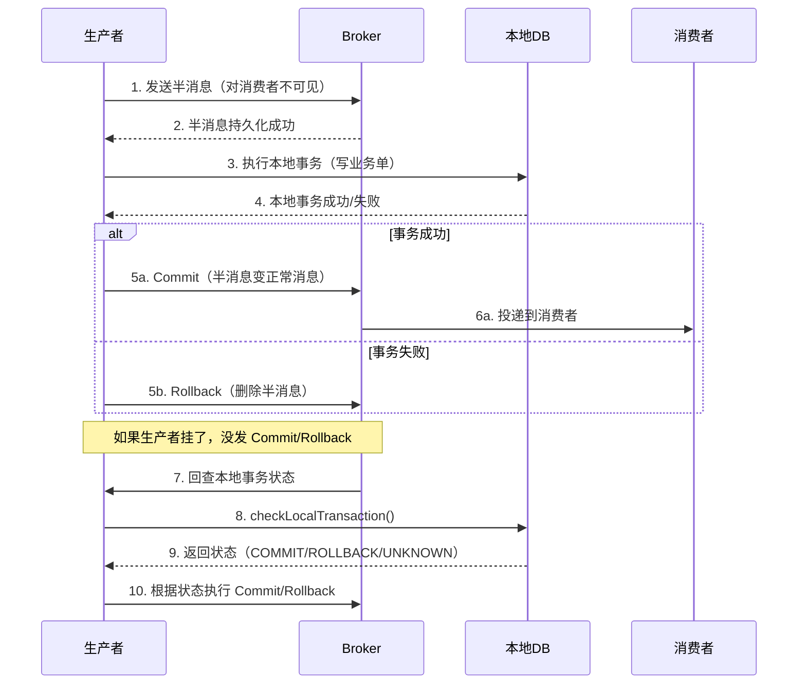

# RocketMQ 事务消息：分布式事务的工程实践

> 在「写业务单 + 通知下游」必须强一致的链路里，事务消息是工程上最常用的解法。
> 这篇文章讲清楚 RocketMQ 事务消息怎么解决这个问题，包括原理、实战、踩坑、选型理由。

## 1. 背景：为什么需要事务消息

很多核心业务链路的简化形态都是这样的：

```
上游服务处理请求
  → 写业务单（DB）
  → 通知下游（账务 / 通知中心 / 数据仓库）
```

最后一步「通知下游」是关键。如果用普通消息，会遇到三个问题：

**问题 1：写业务单成功，发消息失败**
→ 业务单已生效，但下游不知道，永远不对账

**问题 2：发消息成功，写业务单失败**
→ 下游收到消息去处理，但业务单没写，数据凭空出现

**问题 3：消息发送和 DB 写在两个事务里**
→ 任何一个先成功都会出问题

**典型场景的硬约束：**

| 维度 | 要求 |
|---|---|
| 一致性 | 必须最终一致（不允许数据丢失或重复） |
| 可用性 | 高（业务链路卡顿直接客诉） |
| 性能 | 峰值 QPS 几百到几千 |
| 可恢复 | 任何节点挂掉都能恢复，不能人工介入 |

普通消息（Kafka / RabbitMQ / RocketMQ 普通模式）都不能满足「写 DB + 发消息」原子性。

## 2. 核心内容：RocketMQ 事务消息原理

RocketMQ 事务消息的核心是「半消息 + 回查机制」。

### 2.1 三阶段流程

半消息的生命周期：



### 2.2 关键概念

**半消息（Half Message）**
- 生产者发送的消息，但对消费者不可见
- Broker 用特殊 topic（RMQ_SYS_TRANS_HALF_TOPIC）存储
- 等生产者二次确认后才投递到真实 topic

**本地事务状态表**
- 生产者本地维护，记录每条半消息的事务状态
- Broker 回查时调 `checkLocalTransaction()` 读取
- 必须持久化（DB 表，不能放内存）

**回查机制**
- Broker 启动定时任务，扫描长时间未确认的半消息
- 默认最多回查 15 次，超过丢弃（防无限回查）
- 回查只读不写（避免回查本身又引入新事务问题）

### 2.3 最小可运行示例

```java
// 生产者
TransactionMQProducer producer = new TransactionMQProducer("order_producer_group");
producer.setTransactionListener(new TransactionListener() {
    @Override
    public LocalTransactionState executeLocalTransaction(Message msg, Object arg) {
        try {
            // 1. 执行本地事务：写业务单
            Order order = (Order) arg;
            orderRepository.insert(order);

            // 2. 事务成功 → Commit
            return LocalTransactionState.COMMIT_MESSAGE;
        } catch (Exception e) {
            // 3. 事务失败 → Rollback
            return LocalTransactionState.ROLLBACK_MESSAGE;
        }
    }

    @Override
    public LocalTransactionState checkLocalTransaction(MessageExt msg) {
        // 回查：查询业务单是否真的写成功
        String orderId = msg.getKeys();
        Order order = orderRepository.findById(orderId);

        if (order == null) {
            // 业务单没写成功 → Rollback
            return LocalTransactionState.ROLLBACK_MESSAGE;
        } else if ("APPROVED".equals(order.getStatus())) {
            // 业务单写成功且已生效 → Commit
            return LocalTransactionState.COMMIT_MESSAGE;
        } else {
            // 状态未知（可能是中间态）→ 让 Broker 再回查
            return LocalTransactionState.UNKNOW;
        }
    }
});

// 发送事务消息
Message msg = new Message("ORDER_NOTIFY_TOPIC", order.getId(),
    JSON.toJSONBytes(order));
SendResult result = producer.sendMessageInTransaction(msg, order);
```

**关键参数：**

| 参数 | 默认值 | 生产推荐值 | 说明 |
|---|---|---|---|
| `transactionTimeout` | 6 秒 | 30 秒 | 本地事务超时时间 |
| `checkImmunityTimeInSeconds` | - | 10 秒 | 多少秒后开始回查 |
| `checkThreadPoolMinSize` | 1 | 4 | 回查线程池最小 |
| `checkThreadPoolMaxSize` | 1 | 8 | 回查线程池最大 |
| `checkRequestHoldMax` | - | 2000 | 排队回查的最大数 |

## 3. 实战案例：生产环境踩过的坑

### 3.1 典型业务链路

```
上游服务收到请求
  → 写业务单（DB 事务内）
    → 发送事务消息（同一本地事务）
  → Commit
  → 下游消费
    → 账务系统记账（DB）
    → 通知中心推送（短信/站内信）
    → 数据仓库同步（Binlog + Canal）
```

### 3.2 生产配置建议

**Broker 集群（4.9.4+ 版本）：**

| 集群 | 节点数 | 刷盘策略 | 主从 | 用途 |
|---|---|---|---|---|
| 核心业务集群 | 3 Master + 3 Slave | SYNC_MASTER + 同步刷盘 | 同步双写 | 资金 / 订单 / 关键消息 |
| 日志集群 | 2 Master + 2 Slave | ASYNC_MASTER + 异步刷盘 | 异步复制 | 行为日志 / 监控埋点 |
| 通知集群 | 2 Master + 2 Slave | SYNC_MASTER | 同步双写 | 短信 / 推送通知 |

**为什么核心业务用 SYNC_MASTER：**
- TPS 峰值一般 < 同步刷盘上限（~10000）
- 资损风险 = 0 > 任何性能优化
- 代价：延迟从 5ms 升到 15ms，业务可接受

**Queue 规划建议：**

| Topic | Queue 数 | 消费者数 | 业务量 |
|---|---|---|---|
| CORE_NOTIFY_TOPIC | 16 | 4（平时） | 核心通知，峰值 QPS 高 |
| CALLBACK_TOPIC | 8 | 2 | 回调通知，峰值 QPS 中 |
| SETTLE_TOPIC | 32 | 4 | 月结对账，预留 8 倍扩展 |
| COMMON_NOTIFY_TOPIC | 4 | 2 | 通用通知，峰值 QPS 低 |

### 3.3 踩过的坑

**坑 1：Broker 抖动导致回查风暴**

**现象：** 某次 Broker 集群短暂 GC（30 秒），期间堆积了 5000 条半消息。Broker 恢复后，按默认 1 秒间隔回查，**瞬间 5000 个回查请求打过来**，把生产者的 `checkLocalTransaction()` 撑爆。

**解决：**
1. 调大回查间隔：默认 1 秒 → 5 秒
2. 限制回查并发：`checkRequestHoldMax = 2000`
3. 回查走独立线程池，与主业务隔离
4. 加监控：回查堆积 > 1000 触发告警

**坑 2：回查接口超时拖累主链路**

**现象：** `checkLocalTransaction()` 里查 DB，DB 抖动了 → 回查超时（默认 30 秒）→ Broker 不断重试 → 生产者线程池打满 → **新消息发不出去**。

**解决：**
1. 回查只查主键 + 状态字段（不要 `SELECT *`）
2. 回查超时设短（5 秒），UNKNOW 让 Broker 晚点再查
3. DB 抖动时直接返回 UNKNOW，避免雪崩

**坑 3：本地事务里嵌套远程调用**

**现象：** 有同事在 `executeLocalTransaction()` 里调用了远程接口（风控/认证），远程调用 5 秒超时 → 本地事务一直没返回 → 半消息堆积 → 触发回查 → 又是 5 秒。

**教训：** 本地事务里 **绝不能**有远程调用。远程调用必须前置（sendMessageInTransaction 之前），不能用本地事务包。

### 3.4 幂等设计

消费端必须幂等——事务消息保证「至少一次」，网络抖动可能导致重复消费。

```java
// 幂等方案：业务唯一键 + INSERT IGNORE
@RocketMQMessageListener(topic = "CORE_NOTIFY_TOPIC")
public class CoreNotifyConsumer implements RocketMQListener<Order> {

    @Autowired
    private NotifyLogRepository notifyLogRepo;

    @Override
    public void onMessage(Order order) {
        // order_id + operate_type 联合唯一索引
        // 第一次插入成功 → 重复插入自动跳过
        int inserted = notifyLogRepo.insertIgnore(order.getOrderId(),
            "DISBURSE_NOTIFY", JSON.toJSONString(order));

        if (inserted == 0) {
            // 已处理过，直接 ACK
            return;
        }

        // 真正处理业务
        accountService.notify(order);
        notificationService.push(order);
    }
}
```

## 4. Trade-off：事务消息 vs 其他方案

分布式事务场景下，常见三个方案对比：

| 维度 | RocketMQ 事务消息 | 本地消息表 + 定时扫 | TCC |
|---|---|---|---|
| 一致性 | 最终一致（秒级） | 最终一致（分钟级） | 强一致 |
| 性能 | 高（同步刷盘 1000 TPS 没问题） | 中（DB 写入多 + 定时扫） | 低（3 个调用 + 补偿） |
| 复杂度 | 中（需要事务监听器） | 中（需要单独扫表任务） | 高（需要 Try/Confirm/Cancel 三套） |
| 可恢复 | 自动（Broker 回查） | 自动（定时扫） | 手动（需补偿事务） |
| 适合场景 | 异步通知 + 高 QPS | 低 QPS + 简单业务 | 强一致 + 资金扣减 |
| 决策建议 | ✅ 默认选项 | ⚠️ 历史包袱 | ❌ 性能要求高时不用 |

**为什么不用本地消息表：**

> 本地消息表方案是「先写业务表 + 消息表（同一事务）→ 定时扫消息表 → 发消息」。
> 本质问题是：定时扫的间隔决定了延迟。业务要求秒级延迟（用户期望立即看到结果），
> 但定时扫通常 1-5 分钟一次（DB 压力 + 抖动）。事务消息是 Broker 主动回查，秒级恢复。

**为什么不用 TCC：**

> TCC（Try-Confirm-Cancel）是同步强一致方案。三阶段调用 + 补偿事务。
> 适合「资金扣减」（账户余额必须实时一致），不适合「异步通知」（下游系统允许秒级延迟）。
> 下游系统自己也有事务，消费消息后在自己的事务里处理即可，不需要 TCC。

**RocketMQ 事务消息的边界：**

✅ 适用：
- 异步通知（下游系统能容忍秒级延迟）
- 日志同步（行为日志 / 监控埋点）
- 跨系统数据同步（Binlog + Canal 之外的兜底通道）

❌ 不适用：
- 资金扣减（用同步分布式事务）
- 强实时下单（用户期望立即看到结果）
- 高一致性账户余额（用 TCC 或 Saga）

## 5. 反模式 / 常见误区

### ❌ 反模式 1：先发消息再写 DB

```java
// 错误
sendMessage(order);  // 1. 发消息
insertOrder(order);  // 2. 写 DB（可能失败）
```

**后果：** 消息成功发送但 DB 写入失败 → 下游消费消息，但业务单不存在 → 数据不一致。

### ✅ 正确做法：本地事务包消息发送

```java
// 正确
insertOrder(order);  // 1. 写 DB（事务内）
sendTransactionalMessage(order);  // 2. 发事务消息（同一事务）
commit();
```

### ❌ 反模式 2：本地事务里调远程

```java
// 错误
public LocalTransactionState executeLocalTransaction(Message msg, Object arg) {
    Order order = (Order) arg;
    insertOrder(order);  // 本地

    riskControlService.check(order);  // 远程调用！5 秒超时
    return COMMIT_MESSAGE;
}
```

**后果：** 远程调用拖垮本地事务 → 半消息堆积 → 回查风暴。

### ✅ 正确做法：远程调用前置

```java
// 正确
riskControlService.check(order);  // 远程调用前置（sendMessageInTransaction 之前）
insertOrder(order);  // 本地事务（纯本地）
return COMMIT_MESSAGE;
```

### ❌ 反模式 3：回查里写业务

```java
// 错误
public LocalTransactionState checkLocalTransaction(MessageExt msg) {
    // 回查只读不写！写业务会引入新的事务嵌套
    orderRepository.update(order);  // ❌ 写入
    return COMMIT_MESSAGE;
}
```

**后果：** 回查逻辑复杂化 → 状态机乱掉 → 死循环。

### ✅ 正确做法：回查只读不写

```java
// 正确
public LocalTransactionState checkLocalTransaction(MessageExt msg) {
    Order order = orderRepository.findById(msg.getKeys());  // 只读
    if (order != null && order.isApproved()) {
        return COMMIT_MESSAGE;
    }
    return ROLLBACK_MESSAGE;
}
```

## 6. 一句话总结

> RocketMQ 事务消息是「半消息 + 回查」机制，本质是用 Broker 主动回查代替应用层定时扫描，把分布式事务的最终一致性延迟从「分钟级」压到「秒级」。这是「写 DB + 通知下游」这类异步通知场景的默认选项。

## 参考

- [RocketMQ 官方文档 - 事务消息](https://rocketmq.apache.org/docs/transactionMessage/)
- [RocketMQ 4.9.4 设计原理](https://github.com/apache/rocketmq)
- 《RocketMQ 分布式消息中间件实践》
- 内部架构设计文档（待脱敏）

---

**附：本文关联资料**

- [MySQL 事务隔离级别与 MVCC 原理](./mysql-mvcc.md) — 业务单事务怎么保证
- [Redis 分布式锁实战](./redis-distributed-lock.md) — 远程调用前置防重
- [DDD 聚合根设计](../architecture/ddd-aggregate.md) — 为什么 Order 是聚合根
