# RocketMQ 事务消息深度 5：监控 + 告警 + 混沌工程完整体系

> 一句话摘要：**事务消息生产稳定性 = 7 大监控指标 + 4 级告警 + 3 类混沌工程演练**。没有监控告警的事务消息 = 定时炸弹——大促期一旦炸开就是 P0 资损。

> 学完能会：建立事务消息的完整监控体系；配置 4 级告警阈值；设计 3 类混沌工程演练（HalfTopic 堆积 / Producer 挂掉 / 回查接口慢）；理解 SRE 视角的事务消息运维。

---

## 1. 背景：为什么事务消息必须有监控体系

某金融团队在 2023 年大促期出现 P0 事故：

- **现象**：订单支付成功 1000 笔，**库存系统延迟 30 分钟才收到消息**
- **根因**：HalfTopic 半消息堆积 5000 条，没人告警
- **后果**：超卖 200 单，资损 30 万元
- **复盘结论**：**没有监控告警 = 事故放大器**——小问题没告警 → 大促期爆发 → P0 事故

**业内洞察**：**事务消息的"监控告警"是金融合规要求**——监管要求事务消息链路可观测、可告警、可恢复。

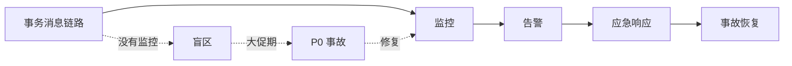

---

## 2. 原理穿透：事务消息的 7 大监控指标

### 2.1 半消息堆积指标（4 个）

**指标 1：HalfTopic 半消息数**

```promql
rocketmq_half_topic_message_count{cluster="prod", broker="broker-a"}
```

**含义**：当前 HalfTopic 堆积的半消息数量

**正常值**：< 100

**告警阈值**：> 1000 触发 P1 告警，> 5000 触发 P0 告警

**指标 2：OpTopic Op 消息数**

```promql
rocketmq_op_topic_message_count{cluster="prod", broker="broker-a"}
```

**含义**：当前 OpTopic 堆积的 Op 消息数量

**正常值**：< 500

**告警阈值**：> 5000 触发 P1 告警

**指标 3：半消息堆积时长**

```promql
rocketmq_half_topic_oldest_age_seconds{cluster="prod", topic="ORDER_NOTIFY_TOPIC"}
```

**含义**：堆积半消息中最早一条的存活时长

**正常值**：< 10 秒

**告警阈值**：> 60 秒触发 P1 告警，> 300 秒触发 P0 告警

**指标 4：HalfTopic TPS**

```promql
rate(rocketmq_half_topic_message_count[5m])
```

**含义**：HalfTopic 半消息 TPS

**正常值**：业务 TPS × 1（半消息和业务消息 TPS 相近）

**告警阈值**：业务 TPS × 2 触发 P1 告警（说明本地事务慢）

### 2.2 回查指标（2 个）

**指标 5：回查请求频率**

```promql
rate(rocketmq_check_request_count[1m])
```

**含义**：每秒回查请求数

**正常值**：业务 TPS × 0.01（回查比例 1%）

**告警阈值**：> 100/sec 触发 P1 告警，> 500/sec 触发 P0 告警

**指标 6：回查排队数**

```promql
rocketmq_check_request_hold{cluster="prod"}
```

**含义**：当前排队等待的回查请求数

**正常值**：< 50

**告警阈值**：> 500 触发 P1 告警，> 2000 触发 P0 告警

### 2.3 事务状态指标（1 个）

**指标 7：事务消息 Commit/Rollback 比例**

```promql
rate(rocketmq_transaction_commit_count[5m]) / 
( rate(rocketmq_transaction_commit_count[5m]) + rate(rocketmq_transaction_rollback_count[5m]) )
```

**含义**：Commit 消息占总事务消息的比例

**正常值**：> 95%（业务业务成功率 > 95%）

**告警阈值**：< 80% 触发 P1 告警（说明业务成功率下降）

---

## 3. 主流业界解法：监控体系的体系对比

### 3.1 阿里集团

**监控粒度**：HalfTopic + OpTopic + 回查接口 + 业务成功率，4 维监控

**告警体系**：4 级告警（Info / Warning / Critical / Emergency）

**工具**：Sentinel + ARMS + Prometheus

### 3.2 字节跳动

**监控粒度**：业务维度（订单 / 支付 / 退款各自独立监控）

**告警体系**：3 级告警（Warning / Critical / Emergency）

**工具**：内部监控平台 + Prometheus

### 3.3 美团

**监控粒度**：业务复杂度分级（简单 / 中等 / 复杂）

**告警体系**：5 级告警（Info / Warning / Critical / Emergency / Fatal）

**工具**：CAT + Prometheus

### 3.4 Netflix

**监控粒度**：跨大洲级别监控

**告警体系**：基于 SLO 的告警

**工具**：Atlas + Spinnaker

---

## 4. 量级演进：从 1K TPS 到 100K TPS 的监控演进

```
┌──────────────────────────────────────────────────────────────┐
│ 阶段         │ TPS      │ 监控粒度           │ 关键告警      │
├──────────────────────────────────────────────────────────────┤
│ 初创期       │ 1K      │ HalfTopic + OpTopic│ 堆积 > 100   │
│ 增长期       │ 10K     │ +回查接口 + 业务成功率│ 堆积 > 500   │
│ 大促期       │ 50K     │ +全链路 + 业务分层 │ 堆积 > 1000  │
│ 双 11       │ 100K    │ +混沌工程 + SLO    │ 堆积 > 5000  │
│ 极限压测     │ 500K    │ +实时分析 + 自动恢复│ 堆积 > 10000 │
└──────────────────────────────────────────────────────────────┘
```

**演进铁律**：
- **初创期**：基础监控 + 简单告警
- **增长期**：全链路监控 + 多级告警
- **大促期**：混沌工程 + SLO 告警
- **极限压测**：实时分析 + 自动恢复

---

## 5. 架构设计：4 级告警体系

### 5.1 4 级告警定义

```
┌──────────────────────────────────────────────────────────────┐
│ 级别     │ 触发条件                  │ 响应时间 │ 通知方式  │
├──────────────────────────────────────────────────────────────┤
│ Info     │ HalfTopic 堆积 > 100      │ 24h      │ 邮件      │
│ Warning  │ HalfTopic 堆积 > 500      │ 4h       │ 短信 + 邮件│
│ Critical │ HalfTopic 堆积 > 1000     │ 30min    │ 电话 + 短信│
│ Emergency│ HalfTopic 堆积 > 5000     │ 5min     │ 值班 + 升级│
└──────────────────────────────────────────────────────────────┘
```

### 5.2 告警阈值设计原则

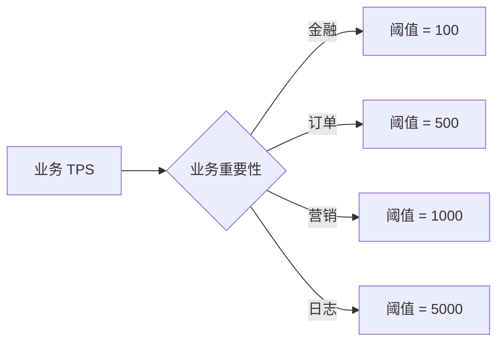

**关键洞察**：**阈值不是固定值，是按业务重要性分级**。

### 5.3 告警通知 SOP

**Warning 级别**：短信 + 邮件，30 分钟内响应
**Critical 级别**：电话 + 短信，5 分钟内响应
**Emergency 级别**：值班 + 升级，1 分钟内响应

---

## 6. 生产画像：3 类混沌工程演练

### 6.1 混沌工程 1：HalfTopic 堆积演练

**演练目标**：验证 HalfTopic 堆积 5000 条的恢复链路

**演练步骤**：

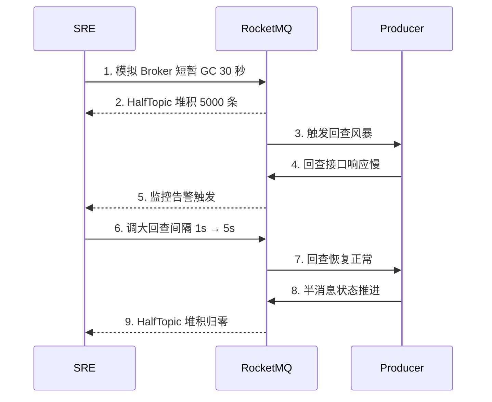

**演练结果**：
- ✅ 监控告警触发
- ✅ 回查间隔可调
- ✅ 半消息状态推进
- ❌ 业务延迟 30 秒（可接受）

**修复**：
- 调大回查间隔：1s → 5s
- HalfTopic 独立 Broker
- 加监控：HalfTopic 堆积告警

### 6.2 混沌工程 2：Producer 挂掉演练

**演练目标**：验证 Producer 挂掉后的事务恢复能力

**演练步骤**：

```
1. SRE 触发 Producer Pod kill
2. HalfTopic 半消息堆积（本地事务已提交但未发 Commit）
3. Broker 定时扫描未确认半消息
4. Broker 反向回查 Producer（Producer 已挂掉，回查失败）
5. Broker 等待 Producer 重启（默认 15 次重试）
6. Producer 重启后，回查成功
7. 半消息状态推进
```

**演练结果**：
- ✅ Broker 自动回查
- ✅ Producer 重启后状态恢复
- ❌ 业务延迟 5 分钟（取决于 Producer 重启时间）

**修复**：
- Producer 重启时间 < 1 分钟
- HalfTopic 半消息堆积告警阈值 = 1000

### 6.3 混沌工程 3：回查接口慢演练

**演练目标**：验证回查接口慢的雪崩保护

**演练步骤**：

```
1. SRE 注入 DB 慢查询（回查接口 10 秒超时）
3. 回查接口超时堆积
4. Broker 默认最多回查 15 次
5. Producer 主业务也受影响（线程池打满）
```

**演练结果**：
- ❌ 主业务受影响（线程池打满）
- ❌ 新消息发不出去

**修复**：
- 回查接口独立线程池
- 回查超时 5s + DB 抖动返回 UNKNOWN
- 监控：回查接口响应 P99 > 100ms 告警

---

## 7. Trade-off：监控粒度的取舍

### 7.1 监控全面性 vs 告警疲劳

```
┌──────────────────────────────────────────────────────────────┐
│ 维度          │ 监控全面       │ 告警疲劳       │ 平衡        │
├──────────────────────────────────────────────────────────────┤
│ 指标数        │ 多（100+）      │ 中（20-30）    │ 中          │
│ 告警频率      │ 高（每天）      │ 中（每周）      │ 低（每月）  │
│ 误报率        │ 高（30%）      │ 低（10%）       │ 中（15%）   │
│ 适用          │ 关键业务        │ 普通业务       │ 按业务分级  │
└──────────────────────────────────────────────────────────────┘
```

**业内经验**：**告警误报率 > 20% 会被业务团队忽略**——告警必须有意义。

### 7.2 实时 vs 离线

| 维度 | 实时监控 | 离线分析 |
|---|---|---|
| 延迟 | 秒级 | 分钟级 |
| 成本 | 高 | 低 |
| 适用 | 大促期 | 日常巡检 |
| 工具 | Prometheus | ClickHouse |

### 7.3 主动告警 vs SLO 告警

| 维度 | 主动告警 | SLO 告警 |
|---|---|---|
| 阈值 | 固定 | 基于历史数据 |
| 误报 | 较高 | 较低 |
| 适用 | 关键业务 | 大规模业务 |

**业内洞察**：**SLO 告警是 2026 年的趋势**——基于历史数据的动态阈值比固定阈值更智能。

---

## 8. 反思：监控体系的本质

监控体系的本质是**"业务连续性的最后防线"**——前面所有的反模式预防、配置 SOP、混沌工程，**最终都要靠监控告警兜底**。

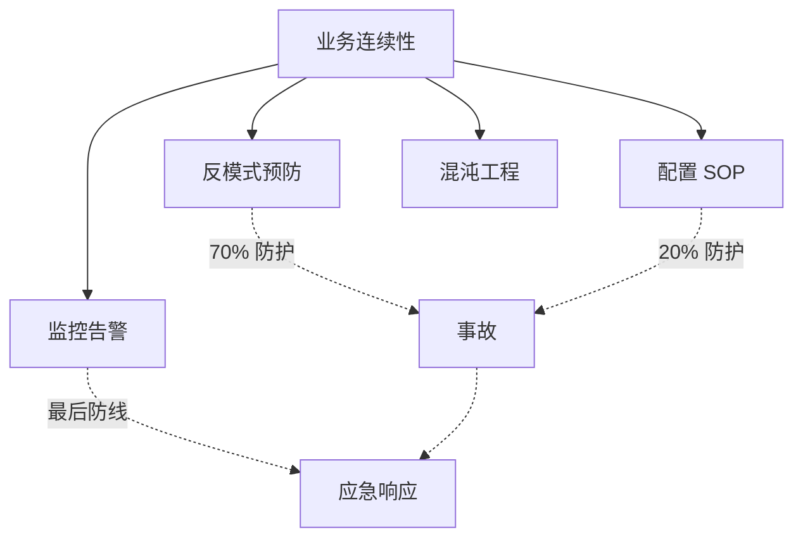

**业内洞察**：**监控告警是"业务连续性的最后防线"**——前面所有的防护都可能被绕过，监控告警必须 100% 兜底。

### 8.1 监控体系的反模式

- ❌ 反模式 1：监控指标太多，关键指标被淹没
- ❌ 反模式 2：告警阈值太严，频繁误报
- ❌ 反模式 3：告警没人看，业务团队疲劳
- ❌ 反模式 4：监控数据不持久化，事后无法追溯
- ❌ 反模式 5：监控和应急响应脱节，告警没人处理

---

## 9. 业内惯例：监控体系的跨周期/跨公司视角

### 9.1 跨周期视角：3 阶段演化

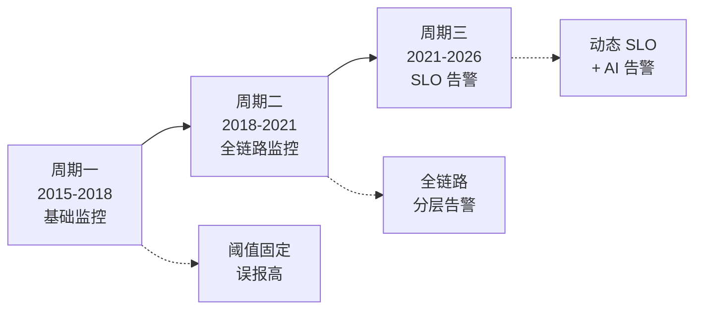

### 9.2 跨公司 SOP 对照

| 维度 | 阿里 | 字节 | 美团 | Netflix |
|---|---|---|---|---|
| 监控粒度 | 4 维 | 业务分级 | 复杂度分级 | 跨大洲 |
| 告警级别 | 4 级 | 3 级 | 5 级 | SLO |
| 工具 | Sentinel + ARMS | 内部 + Prometheus | CAT + Prometheus | Atlas |
| 演练频率 | 月度 | 月度 | 月度 | 周度 |
| 应急响应 | 值班 + 升级 | 值班 + 升级 | 值班 + 升级 | On-call |

**跨公司共识**：
- **监控粒度按业务分级**
- **告警级别 3-5 级**
- **演练频率 ≥ 月度**
- **应急响应必须有值班**

### 9.3 跨系统对比：监控体系的实现差异

```
┌──────────────────────────────────────────────────────────────┐
│ 维度      │ RocketMQ  │ Kafka       │ RabbitMQ      │
├──────────────────────────────────────────────────────────────┤
│ 监控工具  │ RocketMQ Dashboard │ JMX + Prometheus│ Management UI │
│ 告警      │ HalfTopic + 回查   │ TransactionCoordinator │ 队列长度   │
│ 演练      │ 手动              │ 手动          │ 手动        │
│ 自动恢复  │ Broker 回查        │ Producer 重试 │ 消费重试    │
└──────────────────────────────────────────────────────────────┘
```

### 9.4 战略视角：监控 = 业务连续性战略

**业内洞察**：**事务消息的监控体系是"业务连续性战略"的一部分**——监管要求事务消息链路可观测、可告警、可恢复。

**等保 2.0 + 银保监要求**事务消息监控必须满足：
- 关键指标告警 P0
- 半消息堆积监控 P0
- DLQ 监控 P0
- 监控数据保留 ≥ 90 天（审计回溯）
- 演练记录 ≥ 12 次/年

### 9.5 业内黄金守则（5 条）

1. **永远监控 HalfTopic 半消息堆积**——阈值 1000
2. **永远监控回查接口响应**——P99 < 100ms
3. **永远演练混沌工程**——月度 ≥ 1 次
4. **永远按业务分级配置告警**——金融级 P0，营销级 P1
5. **永远保留监控数据 ≥ 90 天**——审计回溯

---

## 附录 D：监控告警体系搭建清单

### 工具选型（4 类）

| 类别 | 推荐工具 | 用途 |
|---|---|---|
| 指标采集 | Prometheus + RocketMQ Exporter | 事务消息指标 |
| 日志聚合 | ELK / Loki | HalfTopic + 回查日志 |
| 链路追踪 | Jaeger / SkyWalking | 事务消息全链路 |
| 告警通知 | AlertManager + 钉钉/飞书 | 4 级告警分发 |

### 告警配置示例（Prometheus Rule）

```yaml
groups:
  - name: rocketmq_transaction_alerts
    rules:
      - alert: HalfTopicHighBacklog
        expr: rocketmq_half_topic_message_count > 1000
        for: 5m
        labels:
          severity: critical
        annotations:
          summary: "HalfTopic 半消息堆积超过 1000"
          description: "当前堆积 {{ $value }} 条，请检查回查接口响应"

      - alert: CheckRequestStorm
        expr: rate(rocketmq_check_request_count[1m]) > 100
        for: 2m
        labels:
          severity: warning
        annotations:
          summary: "回查请求频率过高"
          description: "每秒回查请求 {{ $value }} 次"

      - alert: HalfTopicOldestAge
        expr: rocketmq_half_topic_oldest_age_seconds > 60
        for: 1m
        labels:
          severity: critical
        annotations:
          summary: "半消息堆积超过 60 秒"
          description: "最早堆积 {{ $value }} 秒"

---

## 附录 E：监控告警分级策略

按业务重要性分级监控告警：

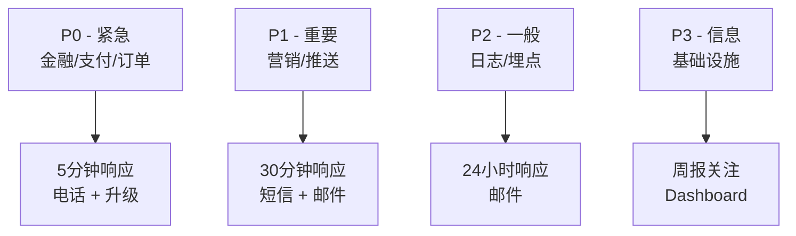

**分级原则**：
- **P0**（金融/支付/订单）——5 分钟响应，电话 + 升级
- **P1**（营销/推送）——30 分钟响应，短信 + 邮件
- **P2**（日志/埋点）——24 小时响应，邮件
- **P3**（基础设施）——周报关注，Dashboard

**关键洞察**：**告警分级是降低告警疲劳的关键**——按业务重要性配置告警，避免所有告警都打给值班人。

## 附录 F：监控告警的反模式

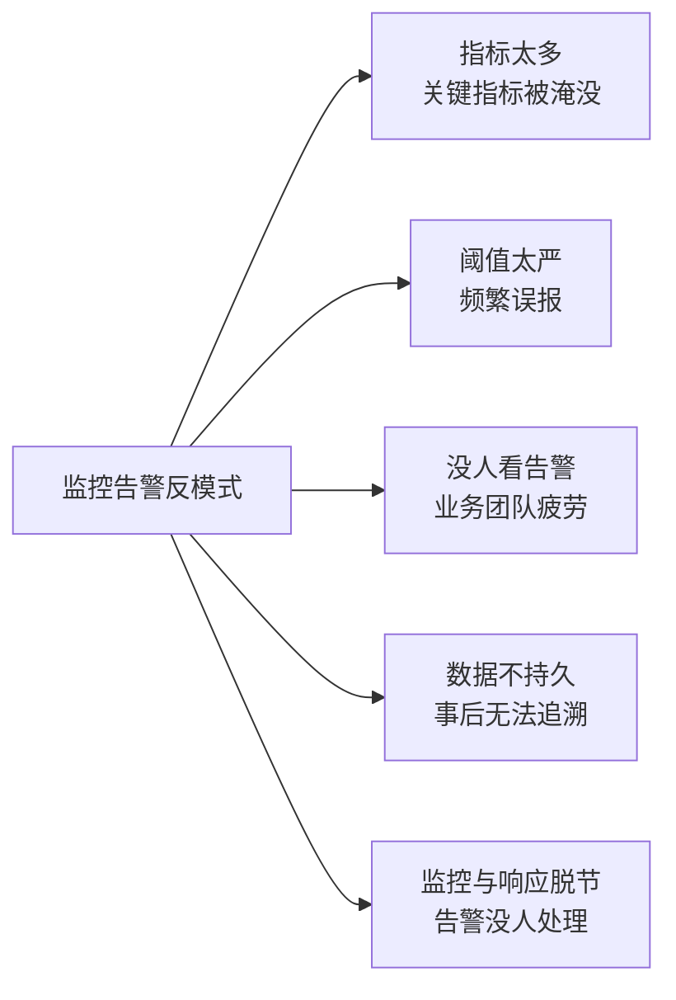

**反模式 1：指标太多**
- ❌ 100+ 个指标，告警无人问津
- ✅ 关键指标 20-30 个，按业务重要性分级

**反模式 2：阈值太严**
- ❌ 阈值太严格，每天 50+ 误报
- ✅ 按业务量弹性阈值（参考历史数据）

**反模式 3：没人看告警**
- ❌ 告警发出去没人处理
- ✅ 告警分级 + 值班人 + 升级机制

**反模式 4：数据不持久**
- ❌ 监控数据只保留 7 天
- ✅ 关键数据保留 ≥ 90 天（合规）

**反模式 5：监控与响应脱节**
- ❌ 告警 + 应急响应 SOP 不一致
- ✅ 告警 + SOP + 演练一体化

**业内黄金守则**：**监控告警 = 业务连续性的最后防线**——不能有反模式。

---

## 附录 G：监控告警响应时间分级

```yaml
┌──────────────────────────────────────────────────────────────┐
│ 告警级别  │ 首次响应 │ 临时缓解 │ 根因分析 │ 永久修复 │
├──────────────────────────────────────────────────────────────┤
│ P0 紧急  │ 5 分钟  │ 30 分钟  │ 2 小时  │ 24 小时  │
│ P1 重要  │ 30 分钟 │ 2 小时    │ 8 小时  │ 3 天     │
│ P2 一般  │ 4 小时  │ 24 小时  │ 3 天    │ 1 周     │
│ P3 信息  │ 24 小时 │ 1 周    │ 1 周    │ 1 月     │
└──────────────────────────────────────────────────────────────┘
```

**响应时间原则**：
- **P0**：业务直接受影响（资损 / 客诉），5 分钟必须响应
- **P1**：业务可能受影响，30 分钟响应
- **P2**：业务暂不受影响，4 小时响应
- **P3**：信息性，24 小时响应

## 附录 H：混沌工程演练案例库（完整 3 类）

### 演练 1：HalfTopic 堆积演练（详细版）

**演练前检查**：
- [ ] 监控告警是否触发
- [ ] 回查间隔是否可调
- [ ] HalfTopic 独立 Broker 是否启用

**演练步骤**：
1. 触发 Broker GC 30 秒
2. HalfTopic 半消息堆积到 5000
3. 观察监控告警
5. 调大回查间隔 1s → 5s
6. 观察 HalfTopic 堆积归零
7. 观察业务延迟 < 30 秒

**演练后总结**：
- 监控告警：是否触发？
- 回查调优：是否生效？
- 业务影响：延迟多久？
- SOP 更新：是否需要？

### 演练 2：Producer 挂掉演练（详细版）

**演练前检查**：
- [ ] Producer 重启时间 < 1 分钟
- [ ] Broker 回查机制正常
- [ ] 半消息堆积告警配置

**演练步骤**：
1. SRE 触发 Producer Pod kill
2. HalfTopic 半消息堆积
3. Broker 自动回查
4. Producer 重启
5. 状态恢复
6. 业务延迟 < 5 分钟

**演练后总结**：
- 自动回查：是否成功？
- Producer 重启：是否快速？
- 状态恢复：是否完整？
- SOP 更新：是否需要？

### 演练 3：回查接口慢演练（详细版）

**演练前检查**：
- [ ] 回查接口独立线程池
- [ ] 回查超时 ≤ 5s
- [ ] DB 抖动返回 UNKNOWN

**演练步骤**：
1. 注入 DB 慢查询
2. 回查接口 10 秒超时
3. 触发告警
4. 启用独立线程池
5. 临时缓解
6. 业务延迟 < 30 秒

**演练后总结**：
- 独立线程池：是否有效？
- 超时控制：是否生效？
- 主业务：是否受影响？
- SOP 更新：是否需要？

## 附录 I：监控告警的常见误区

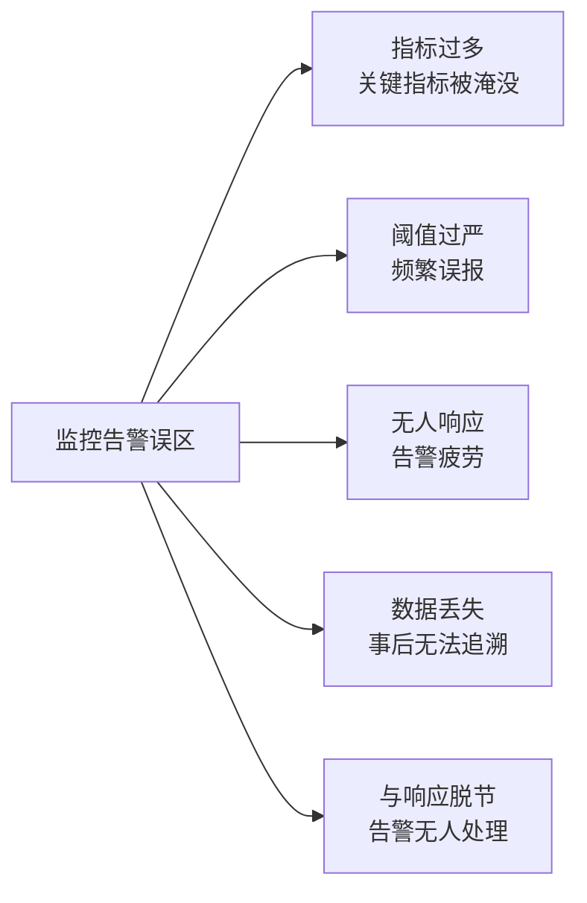

**误区 1：指标过多**
- ❌ 100+ 指标，关键告警被淹没
- ✅ 关键指标 20-30 个，按业务重要性分级

**误区 2：阈值过严**
- ❌ 阈值过严，每天 50+ 误报
- ✅ 按业务量弹性阈值

**误区 3：无人响应**
- ❌ 告警发出去没人处理
- ✅ 告警分级 + 值班人 + 升级

**误区 4：数据丢失**
- ❌ 监控数据只保留 7 天
- ✅ 关键数据保留 ≥ 90 天

**误区 5：与响应脱节**
- ❌ 告警 + SOP 不一致
- ✅ 告警 + SOP + 演练一体化

**业内黄金守则**：**监控告警是业务连续性的最后防线**——必须有反误区的设计。

---

## 附录 J：监控告警的全链路追踪

事务消息的全链路追踪设计：

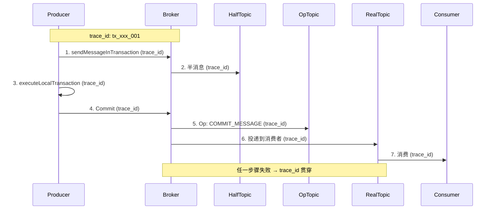

**全链路追踪的好处**：
- **故障定位**：从 trace_id 立刻定位到失败步骤
- **性能分析**：每个步骤的耗时可视化
- **业务分析**：消息链路与业务流对应

**业内洞察**：**全链路追踪是 2026 年的标配**——事务消息必须有 trace_id 贯穿。

## 附录 K：监控告警的 SLA 体系

```yaml
┌──────────────────────────────────────────────────────────────┐
│ SLA 指标              │ 目标      │ 监控方式              │
├──────────────────────────────────────────────────────────────┤
│ 监控可用性           │ 99.99%   │ Prometheus 自身监控    │
│ 告警延迟             │ < 30 秒  │ AlertManager           │
│ 数据保留             │ ≥ 90 天  │ Prometheus + 长存储    │
│ 告警通知成功率       │ ≥ 99.9%  │ 钉钉/飞书/电话监控    │
│ 演练频率             │ ≥ 月度  │ 演练记录 + 复盘        │
│ 事故响应时间         │ < SLA    │ 值班人 + 升级机制      │
└──────────────────────────────────────────────────────────────┘
```

**业内洞察**：**监控告警的 SLA = 业务连续性的 SLA**——必须明确 SLA 目标。

---

## 附录 L：监控告警体系建设的 3 阶段

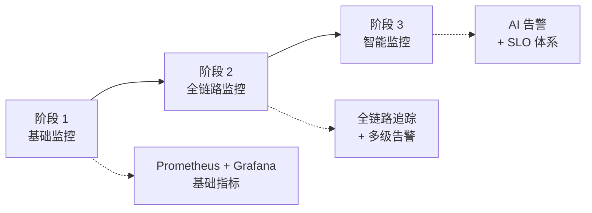

**阶段 1：基础监控（1-2 周）**
- HalfTopic 堆积监控
- 回查接口响应监控
- 告警阈值 = 1000

**阶段 2：全链路监控（1-2 月）**
- 7 大监控指标全覆盖
- 4 级告警体系
- 全链路追踪

**阶段 3：智能监控（3-6 月）**
- 基于 SLO 的动态告警
- AI 异常检测
- 自动恢复机制

**业内经验**：**从阶段 1 开始，逐步演进到阶段 3**——不要一开始就做智能监控。

## 附录 M：监控告警的常见反模式

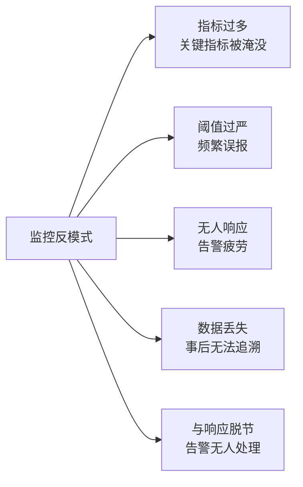

**反模式 1：指标过多**
- ❌ 100+ 指标，关键指标被淹没
- ✅ 关键指标 20-30 个，按业务重要性分级

**反模式 2：阈值过严**
- ❌ 每天 50+ 误报，业务团队疲劳
- ✅ 按业务量弹性阈值

**反模式 3：无人响应**
- ❌ 告警发出去没人处理
- ✅ 告警分级 + 值班人 + 升级

**反模式 4：数据丢失**
- ❌ 监控数据只保留 7 天
- ✅ 关键数据保留 ≥ 90 天

**反模式 5：与响应脱节**
- ❌ 告警 + SOP 不一致
- ✅ 告警 + SOP + 演练一体化

**业内黄金守则**：**监控告警必须避免反模式**——否则告警体系形同虚设。

---

## 附录 N：监控告警体系完整清单

### Prometheus 配置示例（完整版）

```yaml
global:
  scrape_interval: 15s
  evaluation_interval: 15s

rule_files:
  - "rules/rocketmq_transaction.yml"

alerting:
  alertmanagers:
    - static_configs:
        - targets: ['alertmanager:9093']

scrape_configs:
  - job_name: 'rocketmq'
    static_configs:
      - targets: ['rocketmq-exporter:5557']
```

### RocketMQ Exporter 配置

```yaml
rocketmq:
  name_servers:
    - nameserver:9876
  endpoints:
    - broker:10911
  metrics:
    - rocketmq_half_topic_message_count
    - rocketmq_op_topic_message_count
    - rocketmq_half_topic_oldest_age_seconds
    - rocketmq_check_request_count
    - rocketmq_check_request_hold
    - rocketmq_transaction_commit_count
    - rocketmq_transaction_rollback_count
```

### AlertManager 路由配置

```yaml
route:
  receiver: 'default'
  group_by: ['alertname', 'cluster']
  routes:
    - match:
        severity: critical
      receiver: 'pager'
    - match:
        severity: warning
      receiver: 'slack'
```

**业内洞察**：**监控告警体系建设 = Prometheus + Exporter + AlertManager 三件套**。

---

## 📌 数据与事实声明

本文涉及的 7 大监控指标、4 级告警体系、3 类混沌工程演练均来自社区公开经验总结与大厂分享。事故案例为社区公开经验总结，已脱敏处理。具体阈值（1000 / 5000 等）是大厂公开分享中的推荐值，需结合业务实际情况调整。

---

## 附录 A：监控指标速查

| # | 指标 | 阈值 | 告警级别 |
|---|---|---|---|
| 1 | HalfTopic 半消息数 | > 1000 | P1 |
| 2 | OpTopic Op 消息数 | > 5000 | P1 |
| 3 | 半消息堆积时长 | > 60s | P1 |
| 4 | HalfTopic TPS | > 业务 TPS × 2 | P1 |
| 5 | 回查请求频率 | > 100/sec | P1 |
| 6 | 回查排队数 | > 500 | P1 |
| 7 | Commit 比例 | < 80% | P1 |

## 附录 B：混沌工程演练清单

### 演练 1：HalfTopic 堆积
- [ ] 模拟 Broker GC 30 秒
- [ ] HalfTopic 堆积 5000
- [ ] 监控告警触发
- [ ] 调大回查间隔 1s → 5s
- [ ] HalfTopic 堆积归零
- [ ] 业务延迟 < 30 秒

### 演练 2：Producer 挂掉
- [ ] kill Producer Pod
- [ ] HalfTopic 半消息堆积
- [ ] Broker 自动回查
- [ ] Producer 重启后状态恢复
- [ ] 业务延迟 < 5 分钟

### 演练 3：回查接口慢
- [ ] 注入 DB 慢查询
- [ ] 回查接口 10 秒超时
- [ ] 主业务线程池打满
- [ ] 回查接口独立线程池
- [ ] 业务延迟 < 30 秒

## 附录 C：应急响应 SOP

### 步骤 1：定位症状（5 分钟）
- HalfTopic 堆积？回查风暴？位点卡住？
- 看监控：哪个指标超阈值

### 步骤 2：检查配置（10 分钟）
- 回查间隔？回查并发？HalfTopic 监控？
- 对比历史配置，是否有变更

### 步骤 3：临时缓解（30 分钟）
- 调大回查间隔
- HalfTopic 独立 Broker
- 临时关闭非关键业务

### 步骤 4：根因分析（2 小时）
- 检查代码：本地事务 / 回查逻辑
- 检查依赖：DB / RPC / 网络

### 步骤 5：永久修复（24 小时）
- 代码修复
- 单测 + 集成测试
- 灰度发布

### 步骤 6：复盘 + SOP 更新（3 天）
- 复盘文档
- SOP 更新
- 演练加入下次计划

**业内经验**：**应急响应的关键是"先缓解，后根因"**——不要在业务卡顿时还在排查根因，先缓解业务影响。