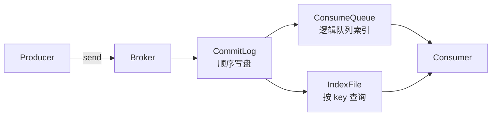
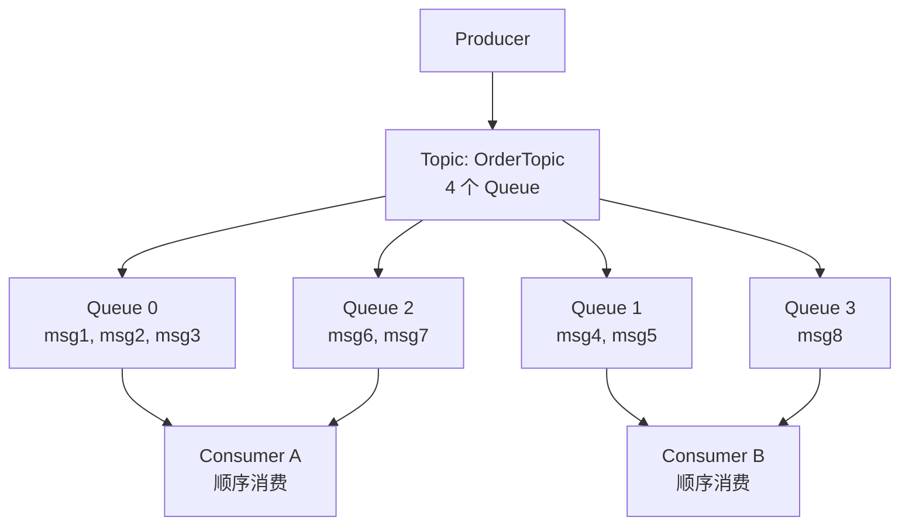
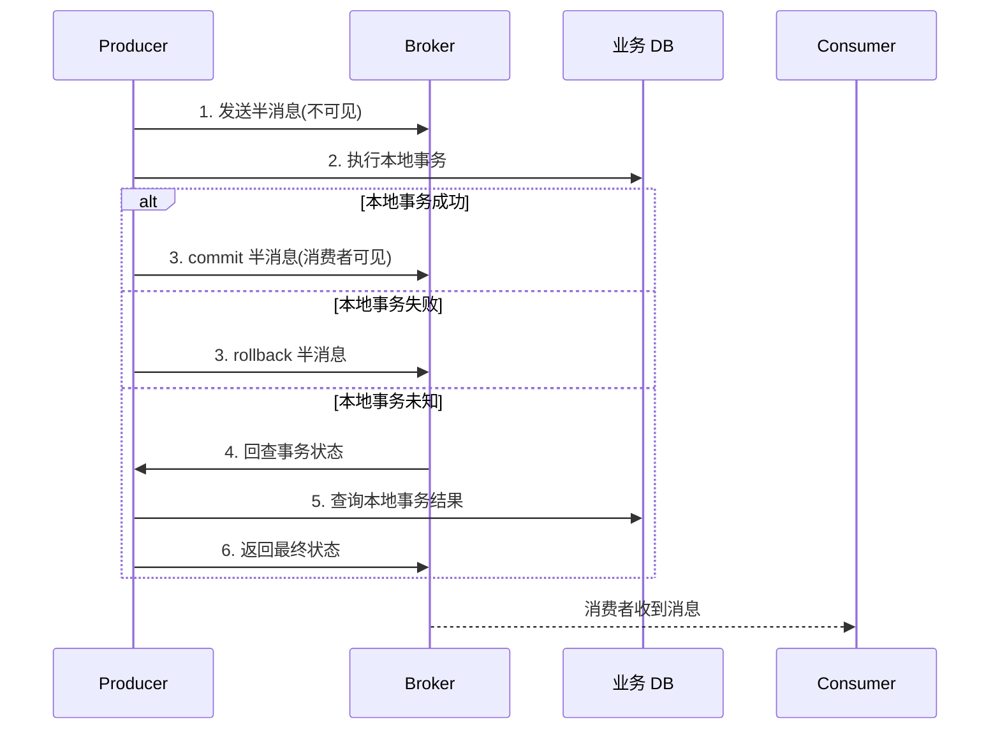
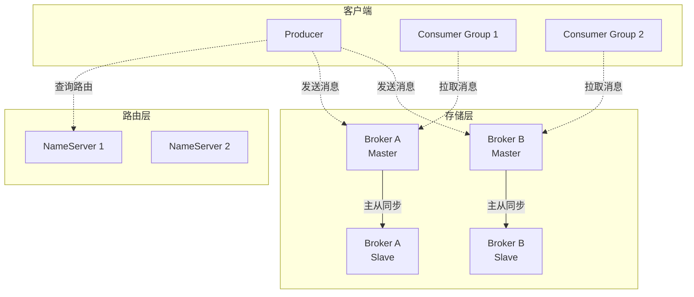
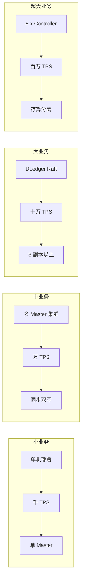
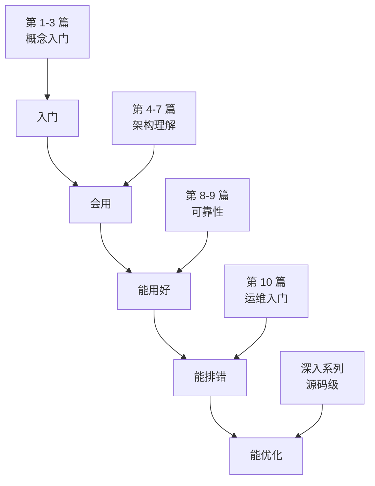

# 什么是 RocketMQ · 入门全景

> 这是「从零开始认识 RocketMQ」系列的第 1 篇。用一篇文章把 RocketMQ 的「出身、定位、核心能力、与同类差异」讲清楚，建立后续 9 篇学习的认知基线。

## 摘要

RocketMQ 是阿里巴巴在 2012 年研发、2016 年捐赠给 Apache 基金会的分布式消息中间件，2017 年成为 Apache 顶级项目。它不是「阿里版 Kafka」——RocketMQ 在「可靠消息、严格顺序、事务消息、延迟消息、亿级堆积」这几个维度上有自己的设计取舍。本文从「出身 → 定位 → 三大能力 → 与 Kafka/RabbitMQ 差异 → 学习路径」讲清 RocketMQ 是什么。

---

## 一、背景：消息中间件为什么存在

在讲 RocketMQ 是什么之前，先回答「为什么需要消息中间件」。

一个电商下单场景，最朴素的实现是「同步调用」：

```
用户下单 -> 订单服务 -> 同步调用 -> 库存服务 -> 同步调用 -> 支付服务 -> 同步调用 -> 物流服务
```

这条链路有 3 个问题：

1. **强耦合**：库存失败 → 订单也得回滚；支付挂了 → 用户卡在前端
2. **响应慢**：4 次同步调用，p99 延迟是 4 个服务之和
3. **流量不平滑**：大促时 10 万 QPS 全部压在库存，凌晨又几乎为零

引入消息中间件后，链路变为：

```
用户下单 -> 订单服务 -> 发一条「订单已创建」消息 -> 结束（毫秒级返回）
                                       ↓
                              库存 / 支付 / 物流服务异步消费
```

这就是消息中间件要解决的 3 个核心问题：**解耦、异步、削峰**。

跨周期经验：消息中间件这个品类在过去 10 年里基本没变——解耦、异步、削峰，从 ActiveMQ（2003）到 Kafka（2011）到 RocketMQ（2012）到 Pulsar（2017），都是这 3 个词的演化。变的是**实现形态**：单机 → 分布式；推模式 → 拉模式 → 混合模式；强事务 → 最终一致。

监管意图角度：消息中间件属于「数据流转基础设施」，本身不受强监管（不像数据库要过等保），但消息内容如果涉及用户隐私，仍需符合《个人信息保护法》和 GDPR 的合规要求——业内通用做法是「敏感数据先脱敏再入队」。在跨境场景下，跨境数据流转还需要符合「本地化」与「境外」的双重合规要求。

## 二、原理穿透：RocketMQ 的 3 大底层能力

RocketMQ 之所以能从 Kafka、RabbitMQ 中脱颖而出，关键在 3 个底层能力。

### 2.1 亿级消息堆积能力

RocketMQ 的存储设计是「顺序写 + 索引分离」：



机制穿透：所有消息都追加写入 CommitLog（一个文件），这是「顺序写」——磁盘顺序写性能 ≈ 内存随机写，所以即使堆积万亿条消息，写入性能也不会显著下降。

### 2.2 严格顺序保证

RocketMQ 通过「同一 Topic 的同一 Queue 内严格有序」保证顺序：



机制穿透：同一订单的消息必须路由到**同一个 Queue**（通过 MessageQueueSelector），然后被**同一个消费者线程**顺序处理。Kafka 只保证「分区内有序」，RocketMQ 在「订单这种业务有序」场景下更易用。

### 2.3 原生事务消息

RocketMQ 是 4 个主流 MQ 中**唯一原生支持事务消息**的（Kafka 通过 EOS 实现，RabbitMQ 通过插件，Pulsar 通过事务订阅）：



机制穿透：这是 RocketMQ 的「杀手锏」——业务侧只需要实现一个 `checkLocalTransactionState` 回调方法，就能保证「本地事务 + 发消息」的最终一致性，避免「DB 提交了但消息没发出去」或反过来的灾难。

## 三、主流业界解法：消息中间件的 3 条技术路线

跨系统架构角度，市面上的消息中间件可以归为 3 条技术路线：

| 路线 | 代表 | 核心思路 | 典型场景 |
|---|---|---|---|
| **日志流路线** | Kafka / Pulsar | 把消息当日志文件，分区 + 副本 | 大数据流、日志采集、实时计算 |
| **可靠消息路线** | RocketMQ | 把消息当业务事件，事务 + 顺序 + 延迟 | 交易、订单、支付等业务核心链路 |
| **AMQP 协议路线** | RabbitMQ | 严格遵守 AMQP 标准，Exchange/Binding 灵活 | 企业集成、异构系统对接 |

跨公司视角：阿里/蚂蚁系业务全面用 RocketMQ（双 11 验证）；字节/美团系大量用 Kafka（日志 + 实时计算为主）；传统金融/电信仍有大量 RabbitMQ。这不是「谁好谁坏」，而是「业务形态决定选型」。

战略判断：未来 5 年，RocketMQ 5.x 主推「云原生」（Controller 替代 NameServer、Proxy 存算分离、Pop 消费模型）；Kafka 4.x 主推「KRaft 去 ZK、存算分离」；Pulsar 主推「多协议统一」。三家都在往「存算分离 + 云原生」收敛——这是业内演进的共同方向，也是分布式系统上下游边界重新划分的体现。

## 四、量级演进：RocketMQ 在阿里走过的 10 年

跨周期经验视角，RocketMQ 的演进可分为 4 个阶段：

| 版本时期 | 核心能力 | 量级 | 演进方向 |
|---|---|---|---|
| **V1 时期（2012-2014）** | 解决 Notify 消息堆积 | 单机千万级 | 内部用，不开源 |
| **V2 时期（2015-2017）** | 开源 + 3.x 稳定版 | 万亿级堆积 | Apache 顶级项目 |
| **V3 时期（2018-2022）** | 4.x + DLedger 多副本 | 十万 TPS | 金融级可靠性 |
| **V4 时期（2023-2026）** | 5.x + Controller + Proxy | 百万 TPS | 云原生、存算分离 |

量级演进：从「单机千万」到「十万 TPS」，背后是「NameServer 无状态 → Controller 选举」和「同步刷盘 → 异步刷盘 + 副本」两个核心架构演进。

5 年后回头看：RocketMQ 1.0 时代的「同步双写」方案在 2024 年已经被 DLedger Raft 协议取代；当年「Broker 主从切换需要人工介入」的运维痛点，在 5.x 的 Controller 模式下已经全自动。**演进的方向是「运维自动化 + 存算解耦」**，而代价是引入新的耦合点和运维复杂度。

## 五、架构设计：RocketMQ 的 4 大角色

RocketMQ 集群有 4 类角色：



| 角色 | 职责 | 数量 | 关键特征 |
|---|---|---|---|
| **NameServer** | 路由注册中心 | 2-4 个 | 无状态、互相独立 |
| **Broker** | 消息存储 + 转发 | 多个 | Master + Slave 配对 |
| **Producer** | 消息生产者 | 任意 | 无状态 |
| **Consumer** | 消息消费者 | 任意 | 集群模式 / 广播模式 |

跨系统架构：NameServer 设计的精妙之处是「**无状态 + AP 模型**」——它不持久化任何数据（Broker 启动时上报，30 秒心跳续约，2 分钟未续约剔除），所以 NameServer 自身不会出现脑裂。代价是「**Broker 上线到被发现有最长 30 秒延迟**」——这个 Trade-off 在绝大多数业务场景下可接受。

## 六、生产画像：RocketMQ 在业务核心链路的典型角色

（脱敏通用画像）

| 业务场景 | RocketMQ 角色 | 关键诉求 | 业内通用配置 |
|---|---|---|---|
| **交易下单** | 业务事件分发 | 严格顺序 + 事务消息 | 同步双写、4 副本 |
| **支付回调** | 异步通知 | 必达 + 幂等 | 同步双写、消费幂等 |
| **库存扣减** | 削峰填谷 | 亿级堆积 + 高吞吐 | 异步刷盘、消费限流 |
| **日志采集** | 数据通道 | 高吞吐 + 低成本 | 异步刷盘 + Kafka 更合适 |
| **跨系统数据同步** | CDC 通道 | 可靠 + 可重放 | 至少 3 副本 |

生产事故推演：业内最常见的 3 类事故——
1. **消息丢失**：同步双写被改成异步刷盘 → 重启后数据丢失，根因是「刷盘策略被误改」
2. **消费重复**：消费侧未做幂等 → 网络抖动导致重复投递，踩坑点是「幂等设计缺失」
3. **集群脑裂**：NameServer 全挂 → 生产者缓存路由仍可写，但消费全部失败，应急方案是「重启 NameServer」

跨周期经验：阿里双 11 期间 RocketMQ 的 10 年沉淀，给行业留下的最大教训是「**消息中间件不是装上就能用**」——它对「副本数、刷盘策略、消费幂等、监控告警」四件套的要求非常高，省任何一环都可能出生产事故。

## 七、Trade-off：RocketMQ 不是银弹

机制穿透角度，RocketMQ 的核心 Trade-off：

| 设计选择 | 收益 | 代价 | 适用场景 |
|---|---|---|---|
| **顺序写 CommitLog** | 亿级堆积不掉速 | 按 key 查询要扫 IndexFile | 写多读少 |
| **NameServer 无状态** | 无脑裂风险 | 30 秒路由发现延迟 | 不追求毫秒级扩缩容 |
| **事务消息** | 最终一致性 | 实现复杂度高 | 业务核心链路 |
| **DLedger Raft 副本** | 强一致性 | 写入性能下降 30% | 金融级场景 |
| **同步双写** | 消息零丢失 | 写入延迟翻倍 | 必达业务 |

Trade-off 跨期：当年选「同步双写」是合理 Trade-off（业务可靠性优先），5 年后回头看，DLedger + 异步刷盘 + 副本机制是更优解——这个「Trade-off 升级」是技术演进的常态。

跨公司视角：RocketMQ 的 Trade-off 哲学和 Kafka 相反——Kafka 是「吞吐优先，可靠性靠客户端配置」；RocketMQ 是「可靠优先，吞吐靠集群扩展」。这是「日志流」和「业务消息」两个定位的本质差异。

## 八、反思：RocketMQ 学习路径建议

入门者最容易踩的 3 个坑：

1. **「RocketMQ = 阿里版 Kafka」**——错。设计哲学差异巨大（见上文对比）
2. **「装上就能用」**——错。RocketMQ 对副本 / 刷盘 / 幂等 / 监控四件套要求极高
3. **「会用 API 就行」**——错。消息丢失、重复、积压、顺序错乱都是原理级问题

战略判断：未来 5 年 RocketMQ 的演进方向是「云原生 + 存算分离 + 跨语言 gRPC」，5.x 已经在路上。学习 RocketMQ 不仅学「现在怎么用」，更要学「它的设计哲学」——这样无论未来怎么变，底子都在。

跨周期经验：从 2018 到 2024，业内对 RocketMQ 的认知经历了「**小众工具 → 业务标配 → 云原生基础设施**」三个阶段，这个演进是「业务体量爆发 + 社区持续投入」的结果。

### 8.1 RocketMQ 在不同业务规模下的典型表现



跨系统架构：RocketMQ 的部署形态与业务规模强相关——小业务用单机、中业务用多 Master、大业务用 DLedger、超大业务用 5.x Controller。这种「**架构随业务演进**」的规律在分布式系统领域是通用的。

### 8.2 RocketMQ 学习的关键里程碑



战略判断：未来 5 年，RocketMQ 的学习门槛会降低（云原生 + Serverless），但「**用好**」的能力要求会提高。入门者最该建立的是「**从概念到生产**」的完整链路。

### 8.3 RocketMQ 与传统 ESB 的对比

跨周期经验：传统企业服务总线（ESB）以「**协议转换 + 路由规则**」为核心，RocketMQ 以「**事件流 + 可靠消息**」为核心。两者各有适用场景——ESB 适合异构系统集成，RocketMQ 适合高吞吐业务事件分发。

跨公司视角：传统金融行业仍有大量 ESB（异构系统多），互联网行业全面 RocketMQ（业务事件密集）。这是「**业务形态决定技术选型**」的典型案例。

### 8.4 RocketMQ 的 3 大长期价值

跨周期经验：RocketMQ 的 3 大长期价值是「**业务解耦、流量整形、可靠投递**」。这 3 个价值在 10 年内没有变，变的是「**实现方式**」——从 3.x 到 5.x 不断演进。

---

## 附录 A：术语速查表

| 术语 | 解释 |
|---|---|
| **Producer** | 消息生产者 |
| **Consumer** | 消息消费者 |
| **Broker** | 消息存储节点 |
| **NameServer** | 路由注册中心 |
| **Topic** | 消息主题（逻辑分类） |
| **Queue** | 消息物理队列 |
| **CommitLog** | Broker 存储消息的物理文件 |
| **ConsumeQueue** | 消息逻辑索引 |
| **DLedger** | 基于 Raft 的多副本机制 |
| **半消息** | 事务消息的中间状态 |
| **延迟消息** | 定时投递的消息 |
| **顺序消息** | 严格按发送顺序消费的消息 |
| **消费组** | 一组消费者实例共同消费 Topic |
| **广播消费** | 每个消费者都收到全量消息 |
| **集群消费** | 消息只被组内一个消费者消费 |

---

## 📌 数据与事实声明

本文涉及的 RocketMQ 概念、特性、版本号、量级数据均为社区公开文档描述。具体版本特性、性能数据请以官方文档为准（https://rocketmq.apache.org/）。文中「业内通用做法」系行业认知总结，非特定公司实践。