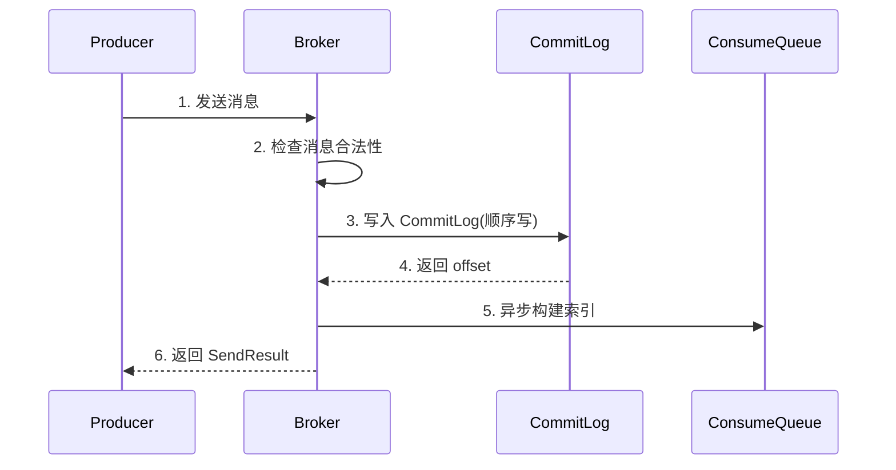
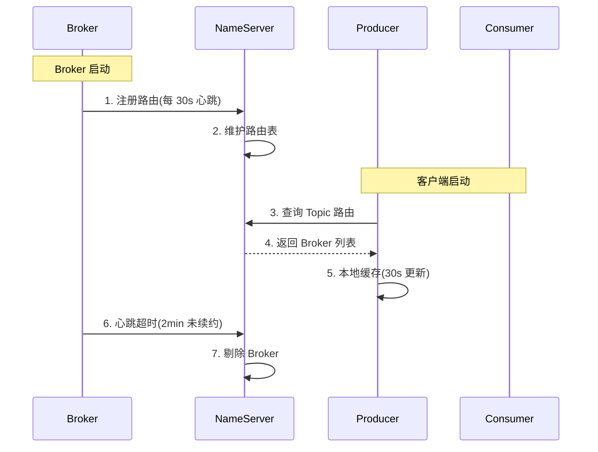
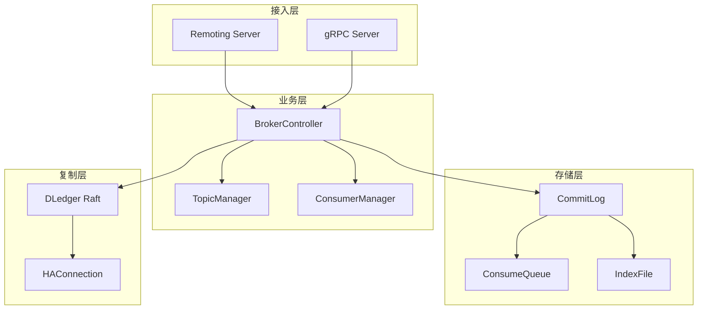
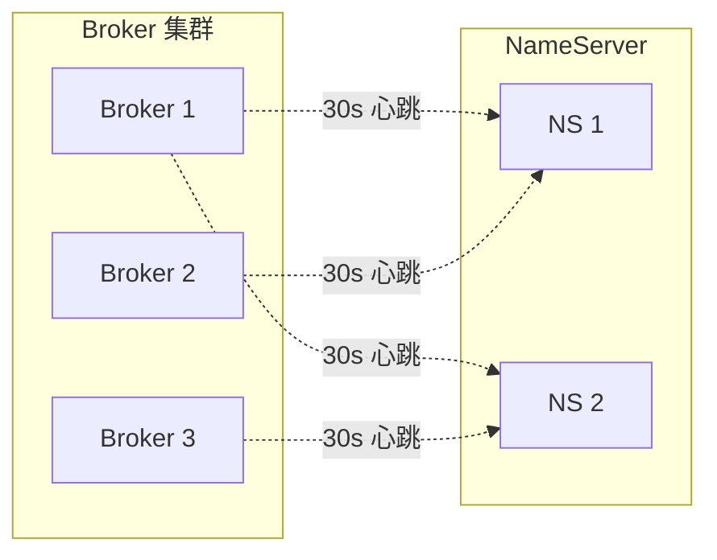

# Broker 与路由机制 · 入门全景

> 这是「从零开始认识 RocketMQ」系列的第 6 篇。深入讲清 Broker 的「内部结构 + 启动流程 + 主从复制 + 高可用机制」，以及 NameServer 路由发现的完整过程。

## 摘要

Broker 是 RocketMQ 的「存储 + 计算」核心，NameServer 是它的「路由注册中心」。本文从「Broker 内部结构 → 启动流程 → 主从复制 → 高可用 → 路由发现」5 个角度，建立 Broker 与 NameServer 协作的完整心智模型。学完本文能回答「Broker 内部由哪些文件组成」「主从复制如何工作」「NameServer 如何发现 Broker 上下线」。

---

## 一、背景：Broker 在 RocketMQ 中的核心地位

Broker 是 RocketMQ 的「**消息存储 + 消费投递**」核心——所有消息的「**持久化、副本、查询、投递**」都由 Broker 负责。可以理解为「**RocketMQ 的 MySQL**」。

跨周期经验：Broker 的设计哲学在过去 10 年里相对稳定——「**顺序写 + 索引分离**」是核心。这个设计从 3.x 一直延续到 5.x，没有本质变化。

战略判断：未来 5 年，Broker 会从「**存算一体**」演进为「**存算分离**」（5.x 已经起步），但核心存储设计不会变。

## 二、原理穿透：Broker 的内部结构

### 2.1 Broker 目录结构

```
store/
├── commitlog/         # 顺序写消息
├── consumequeue/      # 消费索引
├── index/             # 按 key 查询
├── config/            # Topic 配置
├── checkpoint/        # 刷盘位置
└── abort              # 异常标记
```

机制穿透：Broker 存储设计的精妙之处是「**顺序写 + 索引分离**」——
- **CommitLog**：所有消息追加写入，单文件可达 1GB
- **ConsumeQueue**：每个 Queue 一个文件，记录消息在 CommitLog 的 offset
- **IndexFile**：按 key 索引，用于消息查询

### 2.2 CommitLog 写入流程



机制穿透：写入 CommitLog 是「**同步 + 顺序写**」，构建 ConsumeQueue 是「**异步 + ReputMessageService**」——这种「**读写分离 + 异步索引**」设计让写入性能最大化。

### 2.3 Broker 启动流程

```
1. 读取配置文件
   ↓
2. 初始化 CommitLog
   ↓
3. 启动刷盘线程
   ↓
4. 启动 ReputMessageService
   ↓
5. 注册到 NameServer
   ↓
6. 启动 BrokerController
   ↓
7. 监听客户端连接
```

## 三、主流业界解法：Broker 的 3 种部署模式

跨系统架构角度，RocketMQ Broker 有 4 种部署模式：

| 模式 | 架构 | 特点 | 适用场景 |
|---|---|---|---|
| **单 Master** | 1 Master + 0 Slave | 简单，但有单点 | 开发测试 |
| **多 Master** | N Master + 0 Slave | 高可用，但单 Master 挂掉消息丢失 | 中小业务 |
| **多 Master 多 Slave** | N Master + N Slave（同步）| 强一致，性能略差 | 金融级业务 |
| **DLedger 模式** | N Broker Raft 集群 | 自动选主，强一致 | 4.x+ 推荐 |

跨周期经验：从 2018 到 2024，业内对 Broker 部署模式的认知经历了「**单 Master → 多 Master → 多 Master 多 Slave → DLedger 集群**」四个阶段。这个演进是「**业务体量 + 一致性算法成熟**」的结果。

跨公司视角：阿里系业务全面切到「**DLedger Raft 集群**」；字节、美团大量用「**多 Master 多 Slave 异步复制**」（Kafka 协议兼容）；传统金融仍用「**同步双写 + 主备切换**」。这不是「谁对谁错」，而是「**业务形态决定选型**」。

## 四、量级演进：Broker 在不同量级的关键参数

量级演进视角，Broker 在不同量级下的关键参数：

| 量级 | Broker 数量 | 单 Broker TPS | 副本数 | 业内通用配置 |
|---|---|---|---|---|
| **万级 TPS** | 1-2 个 | 1 万 | 2 | 8 核 16G + 1TB SSD |
| **十万 TPS** | 4-8 个 | 1-2 万 | 3 | 32 核 64G + 4TB SSD |
| **百万 TPS** | 16+ 个 | 5 万+ | 3 | 64 核 128G + 10TB SSD |

5 年后回头看：2018 年大家还在纠结「Broker 配多大内存」，2024 年的标准做法是「**NVMe SSD + 大内存 + 3 副本 DLedger**」。当年「同步双写性能差」的争议，5 年后回头看是「**SSD 让顺序写不再是瓶颈**」的结果。

## 五、架构设计：NameServer 路由机制

### 5.1 路由注册流程



机制穿透：NameServer 路由机制的精妙之处是「**心跳 + 剔除**」——
- **Broker 心跳**：每 30 秒向所有 NameServer 发心跳
- **剔除规则**：2 分钟未收到心跳，NameServer 主动剔除 Broker
- **代价**：Broker 上线到被发现有最长 30 秒延迟

### 5.2 路由数据结构

```
NameServer 路由表 RouteInfoManager
├── topicQueueTable       # Topic → Queue 映射
├── brokerAddrTable       # Broker → 地址
├── clusterAddrTable      # 集群 → Broker
└── brokerLiveTable       # Broker 心跳
```

### 5.3 5.x Controller 模式的变化

| 变化点 | 4.x NameServer | 5.x Controller | 影响 |
|---|---|---|---|
| **一致性** | AP（最终一致） | CP（强一致） | 路由变更秒级生效 |
| **脑裂** | 无（无状态） | 无（Raft 保证） | 更可靠 |
| **运维** | 简单 | 复杂（需部署 Controller 集群）| 自动化要求高 |

跨周期经验：5.x 的 Controller 模式让 RocketMQ 第一次有了「**强一致的路由层**」——这是 4.x NameServer 模式的重大升级。**5 年后回头看，这会是默认部署模式**。

## 六、生产画像：Broker 运维的常见监控项

（脱敏通用画像）

| 监控项 | 关键指标 | 告警阈值 | 业内通用做法 |
|---|---|---|---|
| **Broker 进程** | 存活 + 心跳 | 进程消失立即告警 | 进程守护 + 自动拉起 |
| **磁盘使用** | 占用率 | >80% 警告，>90% 危险 | 监控 + 自动清理过期文件 |
| **CommitLog 大小** | 单文件大小 | >1GB 自动滚动 | 默认 1GB |
| **主从延迟** | Slave 落后 offset | >1000 告警 | 监控 + 切换 |
| **PageCache 命中率** | 命中率 | <90% 警告 | SSD + 大内存 |
| **消息堆积** | Consumer offset 落后 | >10 万告警 | 监控 + 扩容 |

生产事故推演：业内最常见的 4 类 Broker 事故——
1. **磁盘写满**：CommitLog 持续增长 → 必须监控磁盘 + 自动清理，根因是「磁盘规划不足」
2. **主从切换失败**：同步双写期间切换 → 数据丢失 → 必须 DLedger，应急方案是「自动切换 + 监控告警」
3. **NameServer 全挂**：客户端缓存路由可写，但消费失败 → 必须监控 NameServer，踩坑点是「NameServer 监控盲区」
4. **Broker OOM**：PageCache 被挤占 → 必须监控内存 + 限制 Consumer 拉取，根因是「内存配置不足」

机制穿透：上面 4 个事故的根因都不是「RocketMQ 本身的问题」，而是「**容量规划 + 监控告警**」没做好——这是入门者最该警惕的「运维盲区」风险。

业内案例补充：一次滚动变更后，某个 Broker 进程仍能正常发送心跳，但磁盘抖动导致写入耗时明显升高。NameServer 看到的是「节点存活」，Producer 本地路由看到的也是「节点可写」，于是部分请求继续落到异常节点；发送超时触发重试后，健康 Broker 又承受额外流量，最终演变为局部故障向整个集群扩散。事故的关键认知是：**心跳存活不等于服务健康，路由注册也不等于流量治理**。

业内通用的定位方法会同时看三组证据：路由侧确认 Topic 的 Broker 与 Queue 分布是否符合预期；存储侧比较各节点写入耗时、磁盘延迟和 ReputMessageService 的分发进度；复制侧检查主从 offset 差距是否持续扩大。如果问题只集中在单节点，应先关闭该节点的写入能力并等待客户端刷新路由，再处理磁盘或副本切换。直接重启虽然快，但可能让未完成的索引构建、主从追赶和客户端重试叠加，恢复窗口反而更长。

恢复后还要做一次端到端核对：Producer 发送成功率是否回稳、Broker 路由是否重新均衡、ConsumeQueue 分发是否追平、Consumer 堆积是否按预期下降。跨系统架构上，路由层、存储层和客户端必须共享同一套 Broker 标识与 Topic 维度指标；否则运维看到节点正常、研发看到调用超时，两边会得到互相冲突的结论。

这个案例对应的 Trade-off 很明确：NameServer 保持简单和高可用，代价是它不会替业务做实时负载判断；Controller 提升选主一致性，也不能替代磁盘健康检查和流量隔离。小规模集群可以依赖人工摘除，大规模集群则需要自动降权、故障域隔离和定期演练。战略上，路由机制首先解决「消息该去哪里」，容量平台才解决「当前还能不能去」；把两类职责混在一起，会让任何一个组件都难以稳定演进。

## 七、Trade-off：Broker 与路由的 5 个核心 Trade-off

机制穿透角度，Broker 和路由机制设计上有 5 个核心 Trade-off：

| 设计选择 | 收益 | 代价 | 适用场景 |
|---|---|---|---|
| **同步双写** | 消息零丢失 | 写入延迟翻倍 | 必达业务 |
| **异步复制** | 高吞吐 | 主从切换可能丢失 | 允许最终一致 |
| **NameServer AP** | 无脑裂风险 | 30 秒路由延迟 | 不追求毫秒级扩缩容 |
| **Controller CP** | 路由强一致 | 部署复杂 | 5.x 时代默认 |
| **DLedger Raft** | 自动选主 | 性能下降 30% | 金融级 |

Trade-off 跨期：当年选「同步双写 + NameServer」是合理 Trade-off（简单可靠），2024 年的「**DLedger + Controller**」是更优解——这个「Trade-off 升级」是「**业务体量 + 一致性算法成熟**」的结果。

跨公司视角：阿里系业务全面切到「**DLedger + Controller**」；字节、美团仍大量用「**异步复制 + Kafka 协议**」；传统金融仍用「**同步双写 + 4.x**」。这不是「谁对谁错」，而是「**业务体量 + 一致性诉求**」决定选型。

战略判断：未来 5 年，Broker 部署模式会往「**存算分离 + 容器化 + 自动扩缩容**」演进；路由会往「**Controller + 多集群联邦**」演进。这是社区共识。

## 八、反思：理解 Broker 的 3 个关键认知

入门者最该记住的 3 个关键认知：

1. **Broker 是 RocketMQ 的核心**——所有可靠性和高可用设计都围绕它
2. **顺序写 + 索引分离**——是 RocketMQ 高性能的根本设计
3. **路由最终会强一致化**——5.x Controller 模式是必然演进方向

跨周期经验：从 2018 到 2024，业内对 Broker 设计的认知经历了「**能用就行 → 主备切换 → DLedger 强一致 → 存算分离**」四个阶段。入门者最容易卡在「会用但不懂为什么」——这是最该补的认知。

监管意图：跨境场景的 Broker 集群需要符合《个人信息保护法》和 GDPR 的合规要求——业内通用做法是「**专用集群 + 审计日志 + 跨境专线**」，满足境内外的双重合规要求。

跨系统架构：Broker 与上下游的边界非常清晰——上游是 NameServer（注册路由）+ Producer/Consumer（收发消息），下游是存储与监控。这种「**清晰的边界**」让 Broker 可以独立演进而不影响上下游。

### 8.1 Broker 内部模块图



机制穿透：Broker 由「**接入层 + 业务层 + 存储层 + 复制层**」4 层组成，每层职责清晰——这是「**分层架构**」的典型实现。

### 8.2 Broker 与 NameServer 的协作



跨周期经验：从 2018 到 2024，业内对 Broker 与 NameServer 的协作认知经历了「**简单心跳 → 智能路由 → Controller 选举**」三个阶段，每个阶段都解决了前一阶段的可用性问题。

### 8.3 Broker 的关键运维指标

跨系统架构：Broker 的运维指标包括「**进程存活 + 磁盘使用 + CommitLog 大小 + 主从延迟 + PageCache 命中率 + 消息堆积**」6 大类。这些指标是「**Broker 上下游对接质量**」的核心度量。

跨周期经验：从 2018 到 2024，业内对 Broker 运维的认知经历了「**基础监控 → 全面监控 → AI 异常检测**」三个阶段，每个阶段都提升了系统的可观测性和自动化水平。

### 8.4 Broker 与 NameServer 的边界

跨系统架构：Broker 与 NameServer 的边界非常清晰——Broker 负责「**存储 + 计算**」，NameServer 负责「**路由注册**」。两者通过「**心跳 + 上报**」机制解耦，各自独立演进。

### 8.5 Broker 的 4 大内部模块

跨周期经验：Broker 由「**接入层 + 业务层 + 存储层 + 复制层**」4 大内部模块组成。每个模块都有明确的职责边界，可以独立演进。

跨系统架构：Broker 的 4 大模块对应「**Remoting Server + BrokerController + CommitLog + DLedger**」。每个模块都是 RocketMQ 演进的关键点。

### 8.6 路由机制的 5 个关键设计点

跨周期经验：路由机制的 5 个关键设计点是「**心跳机制 + 上报机制 + 剔除机制 + 缓存机制 + 选举机制**」。每个设计点都对应一类高可用问题的解决方案。

### 8.7 Broker 部署模式的 5 种演进

跨系统架构：Broker 部署模式经历了「**单机 → 多 Master → 多 Master 多 Slave → DLedger → Controller**」5 种演进，每种演进都解决了前一阶段的高可用问题。

---

## 附录 A：术语速查表

| 术语 | 解释 |
|---|---|
| **Broker** | 消息存储节点 |
| **NameServer** | 路由注册中心 |
| **CommitLog** | Broker 存储消息的物理文件 |
| **ConsumeQueue** | 消息逻辑索引 |
| **IndexFile** | 按 key 查询的索引 |
| **PageCache** | 操作系统页缓存 |
| **ReputMessageService** | 异步构建 ConsumeQueue 的服务 |
| **DLedger** | 基于 Raft 的多副本机制 |
| **Controller** | 5.x 的选举式路由组件 |
| **同步双写** | Master + Slave 都写入才返回 |
| **异步复制** | Master 写入即返回 |
| **主从切换** | Master 故障后 Slave 升级 |
| **存算分离** | 存储和计算分离部署 |
| **Raft** | 一致性算法 |
| **abort 文件** | Broker 异常退出标记 |

---

## 📌 数据与事实声明

本文涉及的 Broker 内部结构、路由机制、监控指标均为 Apache RocketMQ 社区公开文档描述。具体版本特性请以官方文档为准（https://rocketmq.apache.org/）。文中「业内通用做法」系行业认知总结，非特定公司实践。