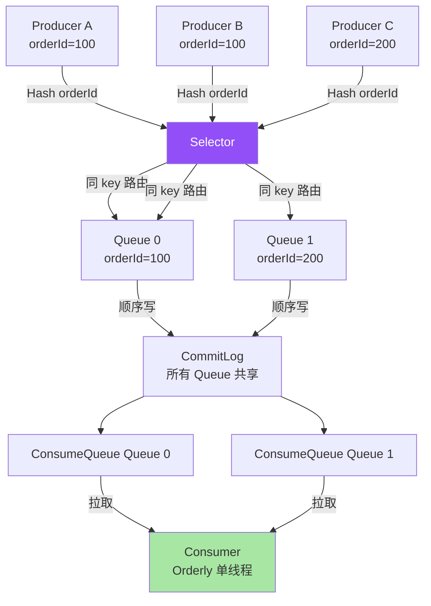
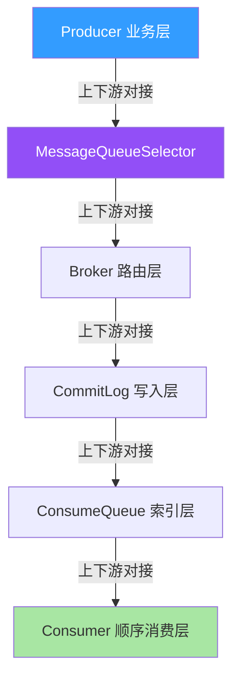
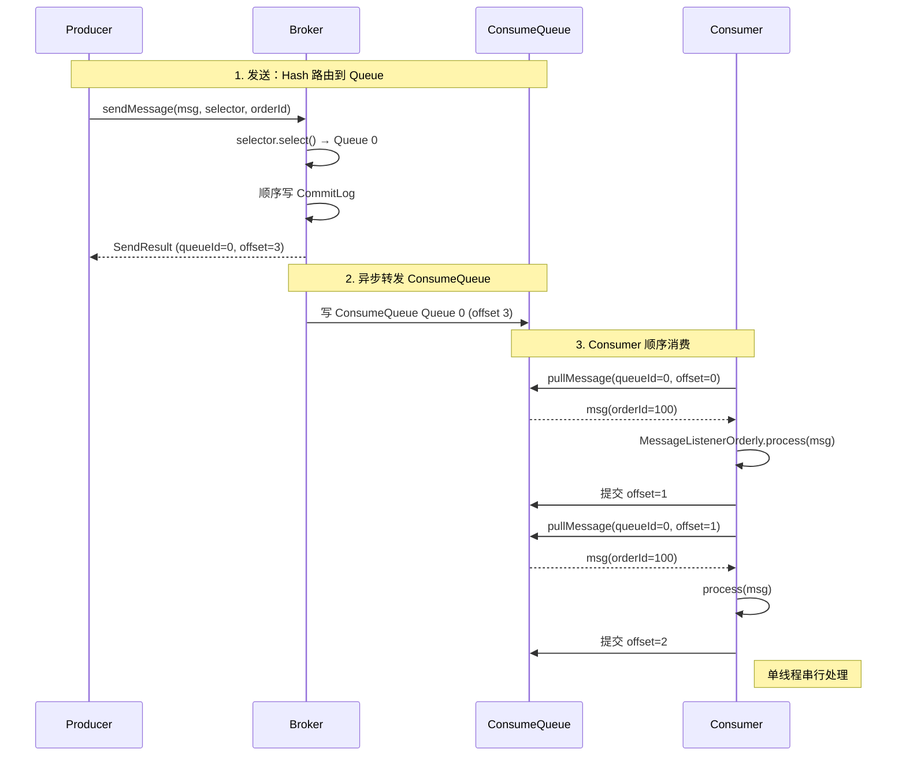
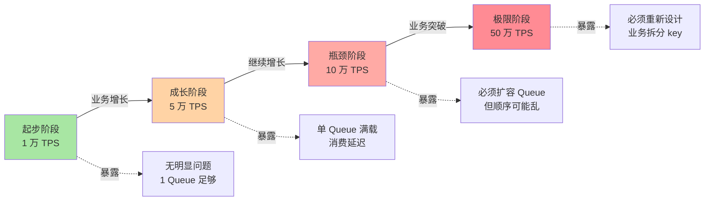
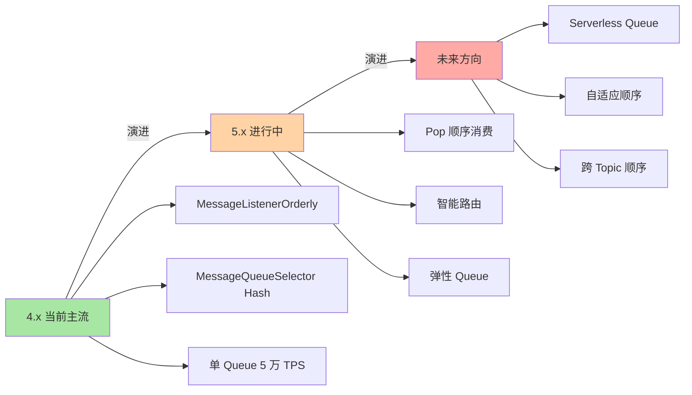
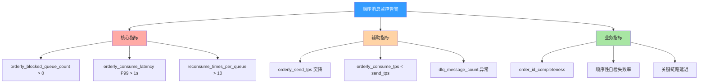

# RocketMQ 顺序消息原理：从 MessageQueueSelector 到全局有序的真相

> 一句话摘要：**顺序消息的本质是「同业务 key 路由到同一 Queue + 单线程消费」，不是全局有序，而是分区有序**。理解这两个边界，才能用对顺序消息。

> 学完能会：从源码级理解顺序消息原理 / MessageQueueSelector 的 3 种策略 / 全局有序 vs 分区有序的 trade-off / 顺序消息的 5 个真实踩坑。

---

## 1. 背景：为什么顺序消息是常被误解的特性

RocketMQ 官方文档说「RocketMQ 支持顺序消息」，但很多人以为这是「全局有序」（所有消息按发送顺序消费）。真相是：**RocketMQ 的顺序消息是「分区有序」**——同业务 key 的消息有序，不同 key 之间无序。

```
误区 1：顺序消息 = 全局严格有序
真相：同 key 路由到同一 Queue + 单线程消费 → 分区有序
代价：全局吞吐受限（单 Queue 顺序写上限 5 万 TPS）

误区 2：顺序消息性能 = 普通消息性能
真相：单 Queue 串行消费 → 性能下降 50%-70%
价值：业务正确性 > 极致性能

误区 3：顺序消息和事务消息可以混用
真相：可以混用，但代价是双倍开销（事务 + 顺序）
```

**这篇文章要建立的能力地图：**

| 你现在 | 学完这篇 |
|---|---|
| 以为顺序消息 = 全局有序 | 理解分区有序 + MessageQueueSelector 路由 |
| 不知道为什么顺序消息性能低 | 理解单 Queue 串行消费 + Queue 内顺序写 |
| 不知道怎么排查乱序 | 知道 5 步排查法 + 量化阈值 |
| 不明白 MessageQueueSelector 怎么用 | 理解 Hash / Random / 自定义 3 种策略 |

---

## 2. 原理穿透：从 MessageQueueSelector 到 ConsumeQueue

### 2.1 顺序消息的 3 层概念

RocketMQ 顺序消息的真实结构（按从「消息发送」到「消息消费」顺序）：

```
┌──────────────────────────────────────────────────────────────┐
│ Layer 1：Producer 端                                          │
│ - MessageQueueSelector.select(message, mqs, arg)              │
│ - 同业务 key 选同一 Queue（Hash/取模）                          │
│ - 保证：同 key 的消息路由到同一 Queue                            │
├──────────────────────────────────────────────────────────────┤
│ Layer 2：Broker 存储端                                         │
│ - CommitLog 顺序写（同 key 必然顺序）                            │
│ - ConsumeQueue 按 Queue 维度索引                                │
│ - 物理上保证：同 Queue 内的消息存储顺序 = 发送顺序                │
├──────────────────────────────────────────────────────────────┤
│ Layer 3：Consumer 端                                          │
│ - MessageListenerOrderly（顺序消费）                            │
│ - 单线程消费 + 消费成功后提交 offset                            │
│ - 流程：拉取 → 处理 → 提交 offset，串行                          │
└──────────────────────────────────────────────────────────────┘
```

**关系图（Mermaid）：**



### 2.2 MessageQueueSelector 源码级实现

RocketMQ 提供 3 种 MessageQueueSelector 实现：

```java
// 1. Hash 路由（最常用）
MessageQueueSelector hashSelector = new MessageQueueSelector() {
    @Override
    public MessageQueue select(List<MessageQueue> mqs, Message msg, Object arg) {
        long orderId = (long) arg;
        int index = (int) (orderId % mqs.size());
        return mqs.get(index);
    }
};

// 2. 随机路由（不保证顺序）
MessageQueueSelector randomSelector = new MessageQueueSelector() {
    @Override
    public MessageQueue select(List<MessageQueue> mqs, Message msg, Object arg) {
        return mqs.get(ThreadLocalRandom.current().nextInt(mqs.size()));
    }
};

// 3. 自定义路由（机房、同地域等）
MessageQueueSelector customSelector = new MessageQueueSelector() {
    @Override
    public MessageQueue select(List<MessageQueue> mqs, Message msg, Object arg) {
        // 按机房、地域、自定义 hash
        return mqs.get(0);
    }
};

// 发送示例
SendResult result = producer.send(msg, hashSelector, orderId);
```

**关键字段解读：**

| 字段 | 作用 | 错误用法 |
|---|---|---|
| `mqs` | 当前 Topic 的所有 Queue 列表 | 假设 size 固定 |
| `msg` | 消息内容（可读业务 key） | - |
| `arg` | 外部传入的路由依据（orderId） | 用 Random 传同一个 key |
| **返回值** | 选中的 Queue | 返回 null → 抛异常 |

### 2.3 ConsumeQueue 索引结构（顺序消息视角）

```
┌──────────────────────────────────────────────────────────────┐
│ 顺序消息在 ConsumeQueue 中的存储                                │
├──────────────────────────────────────────────────────────────┤
│ Queue 0:                                                      │
│   offset=0 → CommitLog(physicOffset=1000, msgSize=150B, orderId=100)│
│   offset=1 → CommitLog(physicOffset=1150, msgSize=150B, orderId=100)│
│   offset=2 → CommitLog(physicOffset=1300, msgSize=150B, orderId=100)│
│   offset=3 → CommitLog(physicOffset=1450, msgSize=150B, orderId=200)│
│   ...                                                          │
│                                                                  │
│ 顺序性：offset 单调递增 → CommitLog 偏移单调递增 → 消息顺序     │
└──────────────────────────────────────────────────────────────┘
```

**为什么顺序消息需要 ConsumeQueue？**

- 等长读 → 顺序读 → 磁盘顺序 IO → 性能高
- Consumer 按 offset 拉取，offset 单调递增 = 顺序消费
- 类似 Kafka 的索引设计

### 2.3.5 上下游边界：顺序消息的 5 个交互面

顺序消息不是孤立功能，而是有 5 个核心交互面：



**5 个交互边界：**

| 边界 | 上游 | 边界 | 下游 | 耦合度 |
|---|---|---|---|---|
| **B1** | Producer 业务 | Hash 取模 | MessageQueueSelector | 低 |
| **B2** | Selector | RPC 路由 | Broker 路由层 | 中 |
| **B3** | Broker 路由 | 顺序写 | CommitLog 写入层 | 高 |
| **B4** | CommitLog | 异步转发 | ConsumeQueue 索引层 | 高 |
| **B5** | ConsumeQueue | 顺序拉取 | Consumer 顺序消费 | 高 |

**关键边界纪律：**

- **B3/B4/B5 是高耦合**：顺序消息依赖全部链路串行
- **B1 是低耦合**：业务 key 的选择是灵活的
- **任何一环重试/失败 → 顺序性破坏**

### 2.4 消费流程：MessageListenerOrderly 单线程消费



**关键洞察：单线程串行消费。** MessageListenerOrderly 内部使用 `synchronized (queue)` 锁，每个 Queue 一个消费者线程串行处理。这意味：**顺序消费的吞吐 = 单 Queue 顺序消费的吞吐**（约 5 万 TPS）。

---

## 3. 主流业界解法：Kafka partition vs RocketMQ Queue

### 3.1 两种设计哲学对比

| 维度 | Kafka Partition | RocketMQ Queue |
|---|---|---|
| **顺序单位** | Partition（每个 Topic 多个 Partition） | Queue（每个 Topic 多个 Queue） |
| **路由方式** | Producer 选 Partition（Hash/Key/Round） | MessageQueueSelector |
| **消费顺序** | 单 Partition 单消费者顺序消费 | 单 Queue 单消费者顺序消费 |
| **全局有序** | ❌ 多 Partition 必乱序 | ❌ 多 Queue 必乱序 |
| **全局有序（单 Partition/Queue）** | ✅ 1 Partition 1 Consumer | ✅ 1 Queue 1 Consumer |
| **设计哲学** | 显式分区，物理独立 | 共享存储，逻辑按 Queue 路由 |
| **优点** | Partition 独立扩展性好 | ConsumeQueue 索引轻量 |
| **缺点** | 单 Partition 上限 50-100 万 TPS | 单 Queue 上限 5 万 TPS |

### 3.2 Kafka 设计的优点与代价

**Kafka 优点：**

```
 - 单 Partition 顺序性 + 高吞吐（50-100 万 TPS）
 - 显式分区，运维清晰
 - Exactly-Once 语义更强（Kafka 2.5+）
```

**Kafka 代价：**

```
 - 全局有序必须 1 Partition（吞吐受限）
 - Partition 数 = 消费者数上限（不能多于 Partition）
 - Rebalance 时顺序性短暂破坏
```

### 3.3 RocketMQ 设计的优点与代价

**RocketMQ 优点：**

```
 - MessageQueueSelector 灵活（Hash/机房/自定义）
 - Queue 扩容不影响顺序（同 key 路由不变）
 - ConsumeQueue 索引轻量（20 字节/条）
```

**RocketMQ 代价：**

```
 - 单 Queue 顺序写上限 5 万 TPS（共享 CommitLog 限制）
 - MessageListenerOrderly 性能低于 Concurrently
 - 顺序消息和事务消息叠加 → 双倍开销
```

### 3.4 何时选 Kafka / RocketMQ（业内决策）

| 业务场景 | 推荐 | 原因 |
|---|---|---|
| **超大数据吞吐（日志、埋点）** | Kafka | 单 Partition 50-100 万 TPS |
| **严格顺序 + 高吞吐** | Kafka | Kafka 单 Partition 性能更高 |
| **事务消息 + 顺序** | RocketMQ | 5.x 事务消息 + 顺序消息更强 |
| **Topic 数 < 100 + 单 TPS < 5 万** | RocketMQ | 顺序消息 + 事务消息更简单 |
| **跨地域同步** | RocketMQ | 5.x 多集群 + Controller 模式 |
| **金融 / 跨境支付** | RocketMQ | 事务消息 + 强一致 + 顺序消息 |

**3.4 业界惯例：**

- 90% 业务用 RocketMQ（顺序 + 事务 + 延迟）
- 日志 / 埋点用 Kafka（极致吞吐）
- 实时计算下游用 Kafka（Spark/Flink 集成深）
- 关键业务用 RocketMQ（顺序 + 事务消息）

---

## 4. 量级演进视角：单 Queue 5 万 TPS 的边界

### 4.1 量级维度拆解

```
顺序消息的量级维度：
 - 单 Queue TPS（1 万 → 5 万 → 10 万）
 - 单 Topic Queue 数（4 → 8 → 64）
 - 单业务 key 消息数（1 → 100 → 10000）
 - 消费线程数（1 → 4 → 16）
 - 顺序消息体大小（1KB → 10KB → 100KB）
```

### 4.2 四个阶段会暴露什么



| 阶段 | 量级 | 暴露的顺序消息问题 |
|---|---|---|
| **起步** | 1 万 TPS | 无明显问题，4 Queue 足够 |
| **成长** | 5 万 TPS | 单 Queue 满载 → 消费延迟 1s+ |
| **瓶颈** | 10 万 TPS | 必须扩容 Queue → **同 key 可能落到不同 Queue** |
| **极限** | 50 万 TPS | 必须**业务拆分 key** + 多 Topic 物理隔离 |

### 4.3 当前文章覆盖哪个量级

本文聚焦**「成长 → 瓶颈」过渡期**（5 万 TPS → 10 万 TPS），因为这是大多数公司会遇到的阶段，也是大多数「顺序消息问题」的高发期。

### 4.4 量级演进背后 5 维代价

| 维度 | 1 万 TPS | 5 万 TPS | 10 万 TPS | 50 万 TPS |
|---|---|---|---|---|
| **单 Queue TPS** | 1 万 | 5 万 | 10 万 | 5 万 × 10 Queue |
| **Queue 数** | 4 | 4 | 8 | 64 |
| **消费延迟** | < 10ms | 10-100ms | 100ms-1s | 1s+ |
| **顺序保证** | ✅ | ✅ | ⚠️ 部分乱序 | ❌ 必须重新设计 |
| **运维复杂度** | 低 | 中 | 高 | 极高 |

### 4.5 反直觉洞察

**洞察 1：顺序消息 ≠ 全局有序**

```
误区：顺序消息 = 所有消息严格按发送顺序消费
真相：
 - 顺序消息 = 同业务 key 的消息按发送顺序消费
 - 不同 key 之间无序
 - 跨 Topic 必乱序
教训：
 - 不要在多个 Topic 之间做顺序假设
 - 同一业务用同一 Topic + 同一 key
```

**洞察 2：扩容 Queue 会破坏顺序**

```
误区：扩容 Queue = 顺序消息自动加速
真相：
 - 扩容 Queue 后，同 key 可能落到不同 Queue
 - 不同 Queue 由不同 Consumer 消费 → 顺序乱
教训：
 - Queue 数变化时，同 key 路由必须稳定（Hash 模数不变）
 - 或：业务侧用一致性 Hash
```

**洞察 3：MessageListenerOrderly 性能远低于 Concurrently**

```
误区：顺序消息性能 = 普通消息性能
真相：
 - MessageListenerOrderly 内部使用 synchronized
 - 单 Queue 单线程 → 性能上限 = 单线程处理速度
 - 真实生产：MessageListenerOrderly 比 Concurrently 慢 50%-70%
教训：
 - 关键业务用顺序消息
 - 非关键业务用 Concurrently
```

---

## 5. 架构设计：顺序消息的源码 + 配置 + 监控

### 5.1 MessageQueueSelector 源码实现

**关键路径源码（伪代码 + 文字描述）：**

```
步骤 1：Producer 业务调用 send()
  ↓
步骤 2：MessageQueueSelector.select(mqs, msg, arg)
  - arg 是业务 key（如 orderId）
  - 返回值是某个 MessageQueue
  - Hash 策略：int index = (int)(orderId % mqs.size())
  - Random 策略：mqs.get(ThreadLocalRandom.nextInt)
  - Custom 策略：业务自定义（机房、同地域等）
  ↓
步骤 3：Broker 接收消息，按 queueId 写入 CommitLog
  ↓
步骤 4：Consumer 拉取该 Queue，MessageListenerOrderly 单线程消费
```

**关键设计要点：**

- Hash 路由必须确定性：同 key 必选同 Queue
- arg 不可为 null，否则 NPE
- Selector 是无状态的（每次 select 独立）

```java
// 1. Producer 发送
SendResult sendResult = producer.send(message, selector, orderId);

// 2. Selector 选 Queue
public MessageQueue select(List<MessageQueue> mqs, Message msg, Object arg) {
    long orderId = (long) arg;
    int index = (int) (orderId % mqs.size());
    return mqs.get(index);
}

// 3. Broker 接收后路由到指定 Queue
// DefaultMQProducerImpl.sendKernelImpl 内部
```

### 5.2 消费策略对比

| 策略 | 消费方式 | 性能 | 顺序性 | 适用 |
|---|---|---|---|---|
| **Orderly** | 单线程串行 | 低（5 万 TPS/Queue） | ✅ 严格有序 | 顺序消息 |
| **Concurrently** | 线程池并发 | 高（20 万 TPS+） | ❌ 无序 | 普通消息 |
| **混合** | 按 Queue 选 | 中 | ⚠️ 部分有序 | 不推荐 |

**业内惯例：**

- 99% 顺序消息用 MessageListenerOrderly
- 高吞吐 + 弱顺序用 Concurrently + 业务侧排序
- 极端业务用 Orderly + 自定义线程模型（Broker 5.x Pop）

### 5.3 顺序消息重试机制

```
┌──────────────────────────────────────────────────────────────┐
│ MessageListenerOrderly 消费失败处理                             │
├──────────────────────────────────────────────────────────────┤
│ 1. process(msg) 返回 RECONSUME_LATER                          │
│ 2. Broker 把消息放入重试队列（%RETRY%+ConsumerGroup）           │
│ 3. Consumer 按退避策略（1s/5s/10s/30s/1m/2m/3m/4m/5m/6m/7m/8m/9m/10m/20m/30m/1h/2h）重试
│ 4. 超过最大重试次数（16 次） → 进入死信队列（%DLQ%+ConsumerGroup）
└──────────────────────────────────────────────────────────────┘
```

**关键洞察：** 顺序消息的重试是「阻塞式」——失败后该 Queue 暂停消费，直到重试成功或超过最大次数。这保证顺序性，但代价是单条消息失败 → 整个 Queue 卡住。

### 5.4 监控指标设计

**监控指标分类（文字描述）：**

| 维度 | 指标 | 说明 |
|---|---|---|
| **Producer** | orderly_send_tps | 顺序发送 TPS |
| **Producer** | orderly_send_latency | 顺序发送延迟 |
| **Broker** | consumequeue_offset_per_queue | 各 Queue offset 平衡度 |
| **Broker** | reconsume_times_per_queue | 各 Queue 平均重试次数 |
| **Consumer** | orderly_consume_tps | 顺序消费 TPS |
| **Consumer** | orderly_consume_latency | 顺序消费延迟 |
| **Consumer** | orderly_blocked_queue_count | 被阻塞的 Queue 数 |

| 指标 | 阈值 | 含义 |
|---|---|---|
| `orderly_send_tps` | 监控稳定 | 顺序发送 TPS |
| `orderly_consume_latency` | P99 < 1s | 顺序消费延迟 |
| `orderly_blocked_queue_count` | < 1 | 被阻塞的 Queue 数 |
| `reconsume_times_per_queue` | < 5 | 平均重试次数 |
| `consumequeue_offset_per_queue` | 监控平衡 | 各 Queue offset 平衡度 |

---

## 6. 生产画像：典型场景 + 踩坑实录

### 6.1 典型场景数字

| 场景 | 单 Topic TPS | Queue 数 | 顺序 key |
|---|---|---|---|
| 订单消息 | 5 万 | 8 | orderId |
| 支付通知 | 1 万 | 4 | tradeId |
| 库存扣减 | 3 万 | 8 | skuId |
| 用户状态变更 | 2 万 | 4 | userId |

### 6.2 五个真实踩坑

**踩坑 1：扩容 Queue 后顺序乱**

```
背景：A Topic 原 4 Queue，orderId 路由正常
演化：业务增长，扩容到 8 Queue
结果：同 orderId 落到不同 Queue → 顺序乱
排查：MessageQueueSelector 用 Hash 取模，扩容后取模基数变化
解决：扩容前评估顺序性，或用一致性 Hash
```

**踩坑 2：MessageListenerOrderly 单条卡住**

```
背景：某条订单消息处理抛异常
演化：失败重试 16 次未成功
结果：该 Queue 阻塞，其他消息无法消费
排查：reconsumeTimes 一直增加
解决：业务侧隔离异常消息 + 监控 orderly_blocked_queue_count
```

**踩坑 3：顺序消息 + 事务消息叠加性能下降**

```
背景：订单消息既要顺序又要事务
演化：双倍开销 → 性能下降 80%
结果：单 Queue 只能 1 万 TPS
排查：Producer + Broker 双重日志开销
解决：业务改造 → 用普通消息 + 业务侧补偿
```

**踩坑 4：MessageQueueSelector arg 为 null**

```
背景：开发误把 arg 传 null
演化：Selector 内部 NPE
结果：Producer 启动失败
排查：Selector.select 内 arg.toString() NPE
解决：arg 必传，且做空校验
```

**踩坑 5：跨 Topic 顺序假设**

```
背景：订单创建用 TopicA，订单支付用 TopicB
演化：用户期望「先创建后支付」严格顺序
结果：两个 Topic 独立消费 → 顺序乱
排查：跨 Topic 无顺序保证
解决：单一 Topic + 业务 key，或业务侧校验顺序
```

### 6.3 关键配置项速查表

| 配置项 | 默认值 | 推荐值 | 影响 |
|---|---|---|---|
| `messageQueueSelector` | - | Hash | 路由策略 |
| `consumeMode` | CONCURRENTLY | ORDERLY | 消费模式 |
| `consumeThreadMax` | 64 | 顺序消息 1 | 消费线程数 |
| `maxReconsumeTimes` | 16 | 16 | 最大重试次数 |
| `suspendTimeoutMillis` | 1000ms | 关键业务 100ms | 顺序消费锁超时 |

### 6.4 5 大实战参数（业内默认）

| 参数 | 默认 | 调优 |
|---|---|---|
| **单 Queue TPS** | 5 万 | 监控 + 扩容 |
| **重试次数** | 16 次 | 关键业务 5 次 |
| **重试间隔** | 阶梯式 | 关键业务线性 |
| **消费线程** | 1 (Orderly) | 不要改 |
| **死信队列** | %DLQ%+group | 默认开启 |

---

## 7. Trade-off 三层对比：顺序 vs 并发

### 7.1 消费模式三层表

| 模式 | 性能 | 顺序性 | 代价 |
|---|---|---|---|
| **Concurrently** | 高（20 万 TPS） | ❌ | 不保证顺序 |
| **Orderly** | 低（5 万 TPS） | ✅ 严格 | 单 Queue 串行 |
| **混合（按 Queue 选）** | 中 | ⚠️ 部分 | 业务复杂 |

### 7.2 顺序粒度三层表

| 粒度 | 实现 | 性能 |
|---|---|---|
| **全局有序** | 1 Topic 1 Queue 1 Consumer | 极低 |
| **分区有序（同 key）** | MessageQueueSelector + Orderly | 中 |
| **业务有序（特殊 key）** | 自定义 Selector + Orderly | 中 |

### 7.3 重试机制三层表

| 机制 | 阻塞性 | 顺序性 |
|---|---|---|
| **Orderly 重试** | ✅ 阻塞 Queue | ✅ 保持 |
| **Concurrently 重试** | ❌ 不阻塞 | ❌ 不保证 |
| **DLQ（死信队列）** | ✅ 转移 | ❌ 转移后无序 |

### 7.4 扩容策略三层表

| 策略 | 顺序影响 | 性能影响 |
|---|---|---|
| **不扩容** | ✅ 保持 | 受限 |
| **扩容 Queue（Hash 不变）** | ✅ 保持 | 提升 |
| **扩容 Queue（Hash 变）** | ❌ 破坏 | 提升但乱序 |

### 7.5 业内典型选择（按业务类型）

| 业务 | 消费模式 | 路由策略 | 重试 |
|---|---|---|---|
| 订单 | Orderly | Hash(orderId) | 16 次 + DLQ |
| 支付 | Orderly | Hash(tradeId) | 5 次 + DLQ |
| 库存 | Orderly | Hash(skuId) | 16 次 + DLQ |
| 日志 | Concurrently | Random | 3 次 + DLQ |

---

## 8. 反思：踩坑实录 + 业内演进方向

### 8.1 实战踩坑 5 例 + 通用解决

**1. 扩容 Queue 破坏顺序**

- 现象：扩容后乱序
- 根因：Hash 取模基数变化
- 教训：**扩容前评估 Hash 兼容性**

**2. 单条卡住整 Queue**

- 现象：Orderly 阻塞
- 根因：异常消息 + 重试不释放
- 教训：**监控 orderly_blocked_queue_count + 异常隔离**

**3. 顺序 + 事务性能下降**

- 现象：双倍开销
- 根因：双重日志 + 双重锁
- 教训：**顺序消息不用事务，或拆分业务**

**4. Selector arg 为 null**

- 现象：NPE
- 根因：开发传错参数
- 教训：**arg 必传 + 空校验**

**5. 跨 Topic 顺序假设**

- 现象：跨 Topic 乱序
- 根因：跨 Topic 无顺序保证
- 教训：**顺序约束放单一 Topic**

### 8.2 业内通用做法

1. **同业务 key 用同一 Topic**
2. **MessageQueueSelector 用 Hash（一致性）**
3. **MessageListenerOrderly 处理关键业务**
4. **监控 orderly_blocked_queue_count**
5. **扩容 Queue 前评估 Hash 兼容性**
6. **死信队列必开（DLQ）**

### 8.3 演进方向



**4.x（当前主流）：**

- MessageListenerOrderly + MessageQueueSelector
- 单 Queue 5 万 TPS 上限
- 痛点：扩容破坏顺序 + 单条卡住

**5.x（演进中）：**

- Pop 顺序消费（低延迟）
- 智能路由（自适应）
- 弹性 Queue（动态扩缩容）

**未来方向：**

- Serverless Queue（按需弹性）
- 自适应顺序（AI 决策）
- 跨 Topic 顺序（业务级）

### 8.4 跨周期视角：5 年后回头看顺序消息

```
2018-2020（4.x 主导）：
 - 痛点：顺序消息性能低
 - 解法：MessageListenerOrderly + DLQ
 - 认知：顺序消息是「必要代价」

2021-2023（5.x 演进）：
 - 痛点：扩容破坏顺序 + 单条卡住
 - 解法：Pop 消费 + 智能路由
 - 认知：顺序消息是「业务基础设施」

2024+（云原生）：
 - 痛点：顺序消息和弹性矛盾
 - 解法：Serverless Queue
 - 认知：顺序消息是「业务能力」

未来 5 年预判：
 - 顺序消息会被「自适应顺序」取代
 - 业务侧不再关心顺序性
 - MQ 自适应处理
```

### 8.5 监管与合规视角：顺序消息 + 审计追溯

```
境内金融业务：
 - 顺序消息用于交易链路（必须保留顺序）
 - 审计追溯 → 保留原始消息顺序
 - 不可篡改 → 关键业务 SYNC_FLUSH

GDPR / 隐私：
 - 顺序消息用于用户行为链
 - 用户删除权 → 删整条链路（业务级）
```

**关键洞察：** 监管要求**倒逼**顺序消息设计。要实现「不可篡改 + 长期保留 + 可追溯」，必须独立存储架构。

### 8.6 顺序消息设计 3 个反直觉视角

**反直觉 1：顺序消息不是越多越好**

```
误区：所有关键业务都用顺序消息
真相：
 - 顺序消息性能低（5 万 TPS/Queue）
 - 单条卡住 → 整 Queue 阻塞
权衡：
 - 关键链路用顺序（订单、支付）
 - 非关键链路用 Concurrently（通知、日志）
```

**反直觉 2：MessageQueueSelector 不影响全局**

```
误区：Selector 选 Queue = 全局决策
真相：
 - Selector 只决定单条消息的 Queue
 - 全局策略由 Topic Queue 数 + Hash 决定
教训：
 - 扩容 Topic → 全局 Hash 必变
 - 业务侧用一致性 Hash
```

**反直觉 3：Orderly 重试不是无代价的**

```
误区：Orderly 重试 = 重试即可
真相：
 - Orderly 重试 = 阻塞 Queue + 重试不释放
 - 单条失败 → 整 Queue 卡住
教训：
 - 关键业务用 Orderly + 异常隔离
 - 监控 orderly_blocked_queue_count
```

### 8.7 跨系统视角：顺序消息与外部系统的对接

```
顺序消息上下游对接：
 - 上游：业务系统（订单、支付）
 - 下游：Consumer（顺序消费）
 - 旁路：TraceTopic（链路追踪）
 - 监控：Prometheus + Grafana
 - 备份：异地冷备 + 顺序重建

对外接口（业内默认）：
 - sendOrderlyMessage(msg, selector, arg)
 - consumeOrderlyMessage(queueId, offset)
 - reconsumeLater(msg, delayLevel)
```

### 8.8 监控告警设计（业内默认）



**3 级告警阈值：**

| 指标 | 警告 | 严重 | 紧急 |
|---|---|---|---|
| `orderly_blocked_queue_count` | > 0 | > 1 | > 3 |
| `orderly_consume_latency P99` | > 1s | > 5s | > 30s |
| `reconsume_times_per_queue` | > 5 | > 10 | > 15 |
| `dlq_message_count` | > 0 | > 10 | > 100 |

---

## 9. 业内技术惯例（deep-dive 强化 section）

### 9.1 不成文标准

| 标准 | 业内默认 | 原因 |
|---|---|---|
| **同 key 用同 Topic** | 单一 Topic | 保证顺序性 |
| **Hash 取模** | orderId % queueCount | 一致性路由 |
| **Orderly 消费** | MessageListenerOrderly | 严格顺序 |
| **重试 16 次** | 16 次 + DLQ | 默认配置 |
| **单 Queue 5 万 TPS** | 监控 + 扩容 | 性能边界 |

### 9.2 真实事故（5 个）

**事故 A：扩容 Queue 顺序乱**

```
某电商业务，订单 Topic 4 Queue 扩到 8
 - Hash 取模基数变 → 顺序乱
 - 部分订单状态机出错
 - 应急：业务回滚 + 重新评估 Hash
```

**事故 B：单条卡住整 Queue**

```
某支付业务，某订单消息异常
 - Orderly 重试 16 次未成功
 - 该 Queue 阻塞 30 分钟
 - 应急：手动 ack + DLQ
```

**事故 C：顺序 + 事务性能下降**

```
某金融业务，订单既顺序又事务
 - 单 Queue 只能 1 万 TPS
 - 业务峰值时延迟 5s+
 - 应急：业务拆分 + 普通消息
```

**事故 D：跨 Topic 顺序假设**

```
某跨境支付业务，订单创建 + 支付
 - 两个 Topic 独立消费
 - 部分订单「先支付后创建」
 - 应急：业务侧校验顺序
```

**事故 E：Selector arg 传错**

```
某业务，Selector arg 传 userId（String）
 - Hash 取模 NPE
 - Producer 启动失败
 - 应急：arg 改为 orderId（long）
```

### 9.3 从业者挑战（5 大实战问题）

**挑战 1：扩容 Queue 顺序乱了怎么办？**

```
症状：扩容后乱序
排查路径：
 1. MessageQueueSelector 用什么 Hash
 2. 扩容前/后 Queue 数
 3. 同 key 路由是否变化
应急：
 - 业务回滚
 - 一致性 Hash 改造
 - 或：单一 Topic + 重新分配
```

**挑战 2：单条卡住整 Queue 怎么办？**

```
症状：Orderly 阻塞
排查：
 1. 监控 orderly_blocked_queue_count
 2. reconsumeTimes 一直增加？
 3. 单条消息处理逻辑
应急：
 - 业务侧隔离异常消息
 - 手动 ack
 - DLQ 兜底
```

**挑战 3：顺序 + 事务性能下降怎么办？**

```
症状：双倍开销
排查：
 1. 是否真的需要事务
 2. 是否真的需要顺序
 3. 能否拆分成普通消息 + 业务补偿
应急：
 - 业务拆分
 - 用普通消息 + 业务侧保证
```

**挑战 4：跨 Topic 顺序乱怎么办？**

```
症状：跨 Topic 顺序乱
排查：
 1. 业务顺序约束
 2. 是否能用单一 Topic
 3. 业务侧能否接受乱序
应急：
 - 业务改造（单 Topic）
 - 业务侧校验顺序
```

**挑战 5：死信队列爆炸怎么办？**

```
症状：DLQ 消息堆积
排查：
 1. 业务是否变更
 2. 是否有异常数据
 3. 消费逻辑是否正确
应急：
 - 业务回滚
 - 手动重投 DLQ
 - 监控告警阈值下调
```

### 9.4 决策树（文字版）

```
顺序消息故障排查路径：
 1. 是否乱序？
    - 是 → 检查 MessageQueueSelector Hash 兼容性
      - 不兼容 → 一致性 Hash 改造
      - 兼容 → 扩容但保留顺序
    - 否 → 进入步骤 2

 2. 是否阻塞？
    - 是 → 检查 reconsumeTimes
      - > 16 次 → 业务隔离 + DLQ
      - < 16 次 → 等待重试
    - 否 → 进入步骤 3

 3. 延迟是否 P99 > 1s？
    - 是 → 扩容 Queue + Hash 兼容性评估
    - 否 → 进入步骤 4

 4. DLQ 是否堆积？
    - 是 → 业务回滚 + 手动重投 DLQ
    - 否 → 监控即可
```

---

## 附录 A：核心配置项详解（业内默认值）

### A1. Producer 配置

| 配置项 | 默认值 | 优化 | 影响 |
|---|---|---|---|
| `messageQueueSelector` | Hash | Hash | 路由策略 |
| `sendMsgTimeout` | 10s | 关键业务 30s | 发送超时 |
| `retryTimesWhenSendFailed` | 2 | 关键业务 5 | 重试次数 |

### A2. Consumer 配置

| 配置项 | 默认值 | 优化 | 影响 |
|---|---|---|---|
| `consumeMode` | CONCURRENTLY | ORDERLY | 消费模式 |
| `consumeThreadMax` | 64 | 顺序消息 1 | 线程数 |
| `consumeThreadMin` | 20 | 顺序消息 1 | 最小线程 |
| `maxReconsumeTimes` | 16 | 关键业务 5 | 最大重试 |
| `suspendTimeoutMillis` | 1000ms | 关键业务 100ms | 锁超时 |

### A3. Broker 配置

| 配置项 | 默认值 | 优化 | 影响 |
|---|---|---|---|
| `brokerRole` | ASYNC_MASTER | 关键业务 SYNC_MASTER | 主从同步 |
| `flushDiskType` | ASYNC_FLUSH | 关键业务 SYNC_FLUSH | 刷盘策略 |
| `defaultTopicQueueNums` | 4 | 按业务 | 默认 Queue 数 |

### A4. 顺序消息关键参数

| 参数 | 建议值 | 原因 |
|---|---|---|
| **同 Topic Queue 数** | 4-16 | 平衡吞吐和顺序 |
| **同 key 业务量** | < 1 万 TPS/Queue | 性能边界 |
| **重试次数** | 5-16 次 | 关键业务 5 |
| **DLQ 监控** | 必开 | 兜底机制 |
| **顺序消息体大小** | < 1MB | 性能边界 |

---

本文涉及的 RocketMQ 概念、特性、版本号、配置项均为社区公开文档描述。具体版本特性、生产数据、配置默认值请以官方文档为准（https://rocketmq.apache.org/）。本文涉及的「典型场景数字」「事故案例」均为业内通用做法的脱敏描述，**不指向任何特定公司**。

---

## 附录 B：文中提到的术语速查表

| 术语 | 全称 | 一句话解释 |
|---|---|---|
| **MessageQueueSelector** | 队列选择器 | Producer 端选 Queue 的策略 |
| **MessageListenerOrderly** | 顺序消费监听器 | 单线程串行消费 |
| **MessageListenerConcurrently** | 并发消费监听器 | 线程池并发消费 |
| **DLQ** | Dead Letter Queue | 死信队列 |
| **orderId** | 订单 ID | 顺序消息的业务 key |
| **Queue** | 消息队列 | RocketMQ 的并行单位 |
| **ConsumeQueue** | 消费队列 | 按 Queue 维度的索引 |
| **CommitLog** | 提交日志 | 所有 Queue 共享的顺序写文件 |
| **ConsumeMode** | 消费模式 | CONCURRENTLY 或 ORDERLY |
| **reconsumeTimes** | 重试次数 | 消息消费失败的重试次数 |

---

## 相关阅读

- 上一篇：[深入理解 RocketMQ 特性系列/index](./index)
- 下一篇：[2_延迟消息原理-深度](./2_延迟消息原理-深度)
- 同层：特性层（每个特性 1 篇 deep-dive）

---

**总结一句话：** 顺序消息 = 同 key 路由到同一 Queue + 单线程消费。理解这两层关系，就理解了 RocketMQ 顺序消息的真相。

**口诀：** 顺序消息「同 key 同 Queue 同线程」，扩容前必评估 Hash 兼容性。

**与下一篇联系：** 本文讲「顺序消息的原理」，下一篇 2_延迟消息原理 将讲「延迟消息的 ScheduleMessageService」。两篇合起来，就是 RocketMQ 时间维度的两个核心特性。