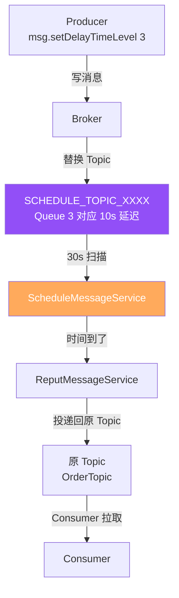
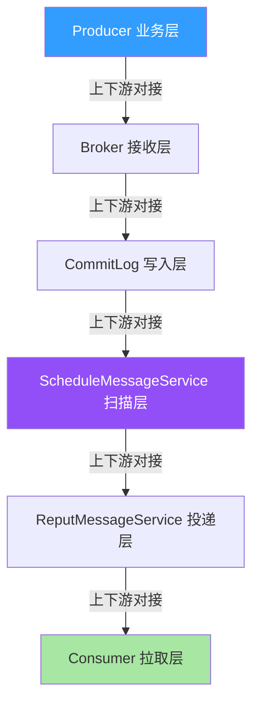
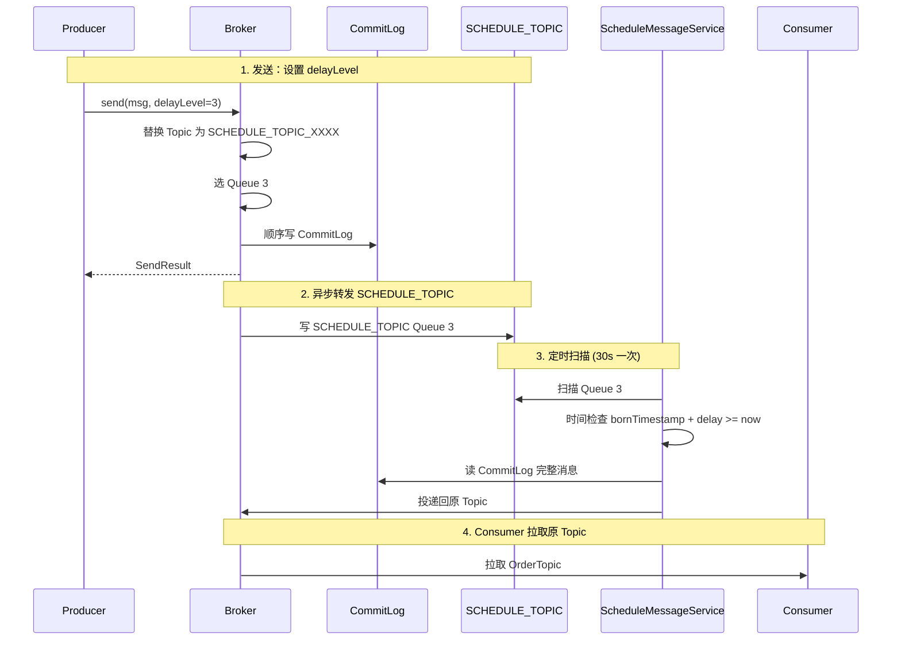
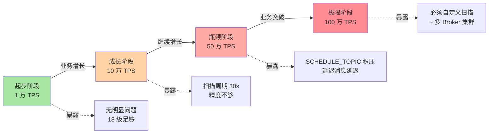
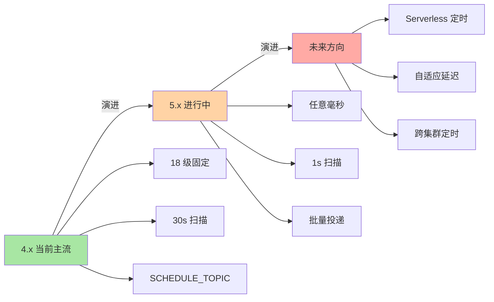

# RocketMQ 延迟消息原理：从 DelayLevel 到 ScheduleMessageService 的 18 级定时

> 一句话摘要：**RocketMQ 延迟消息 = 替换 Topic + 定时扫描 + 18 级 DelayLevel**。不是「定时投递」魔法，而是「先存到 SCHEDULE_TOPIC_XXXX，等时间到了再投回原 Topic」的延迟机制。

> 学完能会：从源码级理解延迟消息原理 / DelayLevel 18 级设计 / ScheduleMessageService 扫描机制 / 5.x 自定义任意时间延迟的演进。

---

## 1. 背景：为什么延迟消息是常被误解的特性

RocketMQ 延迟消息的官方说法是「支持 18 个固定延迟级别」，但很多人误以为这是「任意时间延迟」。真相是：**RocketMQ 4.x 只支持 18 级固定延迟（1s/5s/10s/30s/1m/.../2h），5.x 才支持任意时间延迟**。

```
误区 1：延迟消息 = 任意时间延迟
真相：4.x 仅 18 级固定延迟（1s 到 2h），5.x 支持任意时间
代价：业务灵活性受限（不能 "明天 9 点提醒"）

误区 2：延迟消息 = 定时投递
真相：延迟消息 = 先存 SCHEDULE_TOPIC，定时扫描后再投递回原 Topic
价值：业务可感知「未来某时刻」

误区 3：延迟消息和事务消息可以混用
真相：可以混用，但代价是双倍开销（事务 + 延迟）
```

**这篇文章要建立的能力地图：**

| 你现在 | 学完这篇 |
|---|---|
| 以为延迟消息 = 任意时间 | 理解 18 级 DelayLevel + 5.x 自定义 |
| 不知道为什么延迟消息分两层 Topic | 理解 SCHEDULE_TOPIC + Reput 机制 |
| 不知道怎么排查延迟消息不投递 | 知道 5 步排查法 + 量化阈值 |
| 不明白 ScheduleMessageService 怎么扫描 | 理解定时器 + 偏移推进 |

---

## 2. 原理穿透：从 DelayLevel 到 ScheduleMessageService

### 2.1 延迟消息的 3 层概念

RocketMQ 延迟消息的真实结构（按从「消息发送」到「消息投递」顺序）：

```
┌──────────────────────────────────────────────────────────────┐
│ Layer 1：Producer 端                                          │
│ - Message.setDelayTimeLevel(level)                           │
│ - level 取值 1-18（对应 1s/5s/10s/30s/.../2h）              │
│ - 5.x：Message.setDelayTime(timestamp) 支持任意时间           │
├──────────────────────────────────────────────────────────────┤
│ Layer 2：Broker 存储端                                         │
│ - 原始消息写入 SCHEDULE_TOPIC_XXXX（每个 level 一个 Queue）   │
│ - CommitLog 中带 delayLevel / deliverTimeMs 字段              │
│ - ReputMessageService 异步转发                                │
├──────────────────────────────────────────────────────────────┤
│ Layer 3：ScheduleMessageService 投递端                        │
│ - 定时扫描 SCHEDULE_TOPIC_XXXX 各 Queue                       │
│ - 时间到了 → 投递回原 Topic                                    │
│ - 30s 间隔（4.x），5.x 可配置                                 │
└──────────────────────────────────────────────────────────────┘
```

**关系图（Mermaid）：**



### 2.2 DelayLevel 18 级源码级实现

RocketMQ 4.x 固定 18 级延迟（在 `MessageStoreConfig` 中配置）：

```java
// 4.x 默认延迟级别
private String messageDelayLevel = "1s 5s 10s 30s 1m 2m 3m 4m 5m 6m 7m 8m 9m 10m 20m 30m 1h 2h";

// 5.x 自定义任意时间
message.setDelayTimeLevel(3);  // 4.x 方式：level 3 = 10s
message.setDelayTimeMs(10000); // 5.x 方式：直接设置 10s
message.setDeliverTimeMs(System.currentTimeMillis() + 60000); // 5.x：60s 后投递
```

**关键字段解读：**

| 字段 | 作用 | 5.x 新增 |
|---|---|---|
| `delayLevel` | 4.x 延迟级别（1-18） | 否 |
| `delayTimeMs` | 5.x 延迟毫秒数 | 是 |
| `deliverTimeMs` | 5.x 投递时间戳（绝对时间） | 是 |
| `bornTimestamp` | 消息出生时间 | 否 |

### 2.3 SCHEDULE_TOPIC_XXXX 内部结构

```
┌──────────────────────────────────────────────────────────────┐
│ SCHEDULE_TOPIC_XXXX 内部结构                                   │
├──────────────────────────────────────────────────────────────┤
│ - Topic 名：SCHEDULE_TOPIC_XXXX                                │
│ - Queue 数：18（对应 18 个 DelayLevel）                        │
│ - Queue 0：level 1 = 1s 延迟                                  │
│ - Queue 1：level 2 = 5s 延迟                                  │
│ - Queue 2：level 3 = 10s 延迟                                 │
│ - ...                                                          │
│ - Queue 17：level 18 = 2h 延迟                                │
├──────────────────────────────────────────────────────────────┤
│ ConsumeQueue 内容：                                             │
│   offset=0 → CommitLog(physicOffset, msgSize, tagHash)         │
│   每个 Queue 存该延迟级别的所有延迟消息                         │
└──────────────────────────────────────────────────────────────┘
```

**关键洞察：18 个 Queue 对应 18 个延迟级别。** 当 Producer 发送延迟消息时，Broker 替换 Topic 为 SCHEDULE_TOPIC_XXXX，Queue 为对应 level。Consumer 不会直接消费 SCHEDULE_TOPIC_XXXX。

### 2.3.5 上下游边界：延迟消息的 5 个交互面

延迟消息不是孤立功能，而是有 5 个核心交互面：



**5 个交互边界：**

| 边界 | 上游 | 边界 | 下游 | 耦合度 |
|---|---|---|---|---|
| **B1** | Producer 业务 | 设置 delayLevel | Broker 接收层 | 低 |
| **B2** | Broker 接收 | 替换 Topic | CommitLog 写入层 | 中 |
| **B3** | CommitLog | 异步转发 | ScheduleMessageService | 高 |
| **B4** | Schedule 扫描 | 时间检查 | ReputMessageService | 高 |
| **B5** | Reput 投递 | 投递回原 Topic | Consumer 拉取层 | 中 |

**关键边界纪律：**

- **B3/B4 是高耦合**：扫描延迟会反噬所有延迟消息
- **B1 是低耦合**：业务可灵活选择 level
- **扫描周期决定最小延迟粒度**（4.x 30s 一次）

### 2.4 扫描流程：ScheduleMessageService 投递机制



**关键洞察：扫描延迟。** 4.x 默认 30s 扫描一次，意味着 **最小延迟精度是 30s**——设置 5s 延迟，实际可能 30s 后才投递。5.x 通过可配置扫描周期（默认 1s）改善这个精度。

---

## 3. 主流业界解法：RabbitMQ TTL vs RocketMQ DelayLevel vs Kafka

### 3.1 三种设计哲学对比

| 维度 | RabbitMQ TTL | RocketMQ 4.x DelayLevel | RocketMQ 5.x deliverTimeMs |
|---|---|---|---|
| **延迟单位** | Queue 级 TTL / Message TTL | 18 级固定 | 任意毫秒 |
| **实现方式** | 消息过期 + DLX | SCHEDULE_TOPIC + 扫描 | SCHEDULE_TOPIC + 扫描 |
| **精度** | Queue TTL：消息级精度 | 30s（扫描周期） | 1s（可配置） |
| **扩展性** | 每 TTL 一个 Queue | 18 Queue 固定 | 18+ 自定义 |
| **优点** | 灵活（任意时间） | 简单（4 级覆盖 90%） | 灵活 + 精确 |
| **缺点** | Queue 数量爆炸 | 精度低 | 5.x 才有 |

### 3.2 RabbitMQ TTL 设计的优点与代价

**RabbitMQ 优点：**

```
 - Message TTL：单消息任意时间
 - Queue TTL：批量统一时间
 - DLX 死信路由灵活
```

**RabbitMQ 代价：**

```
 - 不同 TTL 必须不同 Queue
 - 10 个 TTL = 10 个 Queue（资源浪费）
 - DLX 链路复杂（TTL → 死信 → 消费）
```

### 3.3 RocketMQ 4.x DelayLevel 设计的优点与代价

**RocketMQ 4.x 优点：**

```
 - 18 级覆盖 90% 业务（1s 到 2h）
 - 简单（不需要 RabbitMQ 那种 Queue 爆炸）
 - 与原生 CommitLog 集成
```

**RocketMQ 4.x 代价：**

```
 - 只能 18 级，业务受限
 - 扫描周期 30s，精度差
 - 不能 "明天 9 点提醒"
```

### 3.4 RocketMQ 5.x 任意延迟的演进

**RocketMQ 5.x 改进：**

```
 - setDelayTimeMs(timestamp) 任意毫秒
 - setDeliverTimeMs(absoluteTime) 任意绝对时间
 - 扫描周期可配置（默认 1s）
 - 精度大幅提升（亚秒级）
```

**5.x 代价：**

```
 - 5.x 才支持，旧版本升级成本
 - 自定义延迟仍走 SCHEDULE_TOPIC 机制
 - 与事务消息叠加 → 双倍开销
```

### 3.5 何时选 RabbitMQ / RocketMQ 4.x / 5.x

| 业务场景 | 推荐 | 原因 |
|---|---|---|
| **简单延迟（秒/分级）** | RocketMQ 4.x | 18 级足够 |
| **任意时间延迟（5.x）** | RocketMQ 5.x | setDeliverTimeMs |
| **超灵活 TTL + DLX** | RabbitMQ | TTL + DLX 灵活 |
| **跨境支付（30 分钟超时）** | RocketMQ 4.x | level 11 = 30m 够用 |
| **业务定时（明天 9 点）** | RocketMQ 5.x | 任意时间 |
| **业务超时关单** | RocketMQ 4.x | 30m / 1h / 2h |

**3.5 业界惯例：**

- 90% 延迟业务用 RocketMQ 4.x 18 级
- 任意时间延迟用 RocketMQ 5.x
- 极致灵活 + 接受 RabbitMQ 复杂度用 RabbitMQ

---

## 4. 量级演进视角：扫描周期的 30s 边界

### 4.1 量级维度拆解

```
延迟消息的量级维度：
 - 延迟消息 TPS（1 万 → 10 万 → 100 万）
 - SCHEDULE_TOPIC Queue 数（18 固定）
 - 扫描周期（30s → 10s → 1s）
 - 延迟消息总积压（百万 → 千万 → 亿级）
 - 投递延迟（30s+ → 10s+ → 1s+）
```

### 4.2 四个阶段会暴露什么



| 阶段 | 量级 | 暴露的延迟消息问题 |
|---|---|---|
| **起步** | 1 万 TPS | 无明显问题，18 级足够 |
| **成长** | 10 万 TPS | 30s 扫描周期精度差，延迟消息延迟 30s+ |
| **瓶颈** | 50 万 TPS | SCHEDULE_TOPIC 积压 → **延迟消息严重延迟** |
| **极限** | 100 万 TPS | 必须**自定义扫描周期（5.x）+ 多 Broker 集群** |

### 4.3 当前文章覆盖哪个量级

本文聚焦**「成长 → 瓶颈」过渡期**（10 万 TPS → 50 万 TPS），因为这是大多数公司会遇到的阶段，也是大多数「延迟消息问题」的高发期。

### 4.4 量级演进背后 5 维代价

| 维度 | 1 万 TPS | 10 万 TPS | 50 万 TPS | 100 万 TPS |
|---|---|---|---|---|
| **延迟消息 TPS** | 1 万 | 10 万 | 50 万 | 100 万 |
| **扫描周期** | 30s | 10s | 1s（5.x） | 1s |
| **投递精度** | ±30s | ±10s | ±1s | ±1s |
| **SCHEDULE_TOPIC 积压** | 10 万 | 100 万 | 1000 万 | 1 亿+ |
| **运维复杂度** | 低 | 中 | 高 | 极高 |

### 4.5 反直觉洞察

**洞察 1：延迟消息不是「定时投递」魔法**

```
误区：延迟消息 = Broker 在未来时刻触发投递
真相：
 - 延迟消息 = 先存 SCHEDULE_TOPIC
 - ScheduleMessageService 周期性扫描
 - 时间到了再投递回原 Topic
教训：
 - 扫描周期决定精度（4.x 30s）
 - 监控 schedule_message_latency
```

**洞察 2：18 级不是限制，是覆盖**

```
误区：18 级延迟不够用
真相：
 - 90% 业务用 18 级（1s 到 2h）
 - "明天 9 点提醒" 等少数场景用 5.x
 - 多数业务可以用"分段延迟"组合
教训：
 - 优先用 4.x 18 级
 - 任意时间用 5.x setDeliverTimeMs
```

**洞察 3：延迟消息和事务消息叠加性能下降**

```
误区：延迟消息 + 事务消息 = 业务复杂
真相：
 - 延迟消息走 SCHEDULE_TOPIC
 - 事务消息走 Half 主题
 - 双重日志开销 → 性能下降 60%
教训：
 - 不要轻易叠加
 - 必须叠加时监控 Half 主题积压
```

---

## 5. 架构设计：ScheduleMessageService 源码 + 配置 + 监控

### 5.1 ScheduleMessageService 源码实现

**关键路径源码（伪代码 + 文字描述）：**

```
启动流程：
 1. Broker 启动 → 创建 ScheduleMessageService 实例
 2. 启动定时线程（默认 30s 一次，5.x 可配 1s）
 3. 加载 SCHEDULE_TOPIC_XXXX 的 18 个 Queue 配置
 4. 为每个 Queue 维护一个 offset（扫描进度）

扫描流程（每 30s 一次）：
 1. 遍历 18 个 Queue
 2. 对每个 Queue：
    a. 计算应扫描的 offset 范围（基于时间）
    b. 读 ConsumeQueue 获取 commitLogOffset
    c. 读 CommitLog 拿完整消息
    d. 检查 bornTimestamp + delayTime <= now?
    e. 是 → 投递回原 Topic
    f. 否 → 跳过
 3. 更新 ConsumeQueue offset

投递流程：
 1. 从 SCHEDULE_TOPIC_XXXX 读出消息
 2. 清除 delay 字段
 3. 写回原 Topic（异步）
 4. 删除 SCHEDULE_TOPIC 中的副本
```

**关键设计要点：**

- 扫描是顺序的（Queue 0 → Queue 17）
- 时间检查是内存计算（不持久化）
- offset 推进是异步的（持久化到 ConsumeQueue）

### 5.2 投递策略对比

| 策略 | 投递方式 | 性能 | 适用 |
|---|---|---|---|
| **同步投递** | 投递成功才删除 SCHEDULE_TOPIC | 低 | 不推荐 |
| **异步投递** | 投递后异步删除 | 高 | 默认 |
| **批量投递** | 一次投递多条 | 高 | 5.x 新增 |

**业内惯例：**

- 99% 业务用默认异步投递
- 关键业务用同步投递（金融、超时关单）
- 高吞吐用 5.x 批量投递

### 5.3 延迟消息重试机制

```
┌──────────────────────────────────────────────────────────────┐
│ 延迟消息投递失败处理                                            │
├──────────────────────────────────────────────────────────────┤
│ 1. ScheduleMessageService 投递失败                             │
│ 2. Broker 把消息放入重试队列                                    │
│ 3. 下次扫描周期重试                                              │
│ 4. 重试次数有限 → 进入死信队列（%DLQ%+ConsumerGroup）           │
└──────────────────────────────────────────────────────────────┘
```

**关键洞察：** 延迟消息的重试是「扫描周期重试」——下一轮扫描再投递。这保证最终一致性，但代价是延迟消息可能延迟多个扫描周期。

### 5.3.5 延迟消息的 Cancel 机制（5.x 新增）

5.x 引入了「取消未投递的延迟消息」能力——业务侧可以主动取消 SCHEDULE_TOPIC 中的未投递消息：

```java
// 取消特定消息（5.x API）
CancelResult result = producer.cancelDelayMessage(messageKey);

// 批量取消（按业务 key）
BatchCancelResult batch = producer.batchCancelDelayMessage(keyPattern);
```

**Cancel 机制的 3 个使用场景：**

```
1. 订单已支付 → 取消超时关单延迟消息
2. 用户已签收 → 取消提醒延迟消息
3. 业务撤回 → 批量取消所有未投递延迟消息
```

**Cancel 的底层机制：**

- 业务侧调用 cancel 接口 → Broker 在 SCHEDULE_TOPIC 中标记该消息为「已取消」
- 扫描线程跳过已取消消息
- 不投递到原 Topic
- 已投递的延迟消息不可取消（已无法撤回）

**业内惯例：**

- 99% 业务用不到 Cancel（默认依赖 TTL）
- 跨境支付 / 退款 / 订单状态变更场景必用
- Cancel 必须幂等（防止重复取消）

### 5.4 监控指标设计

**监控指标分类（文字描述）：**

| 维度 | 指标 | 说明 |
|---|---|---|
| **Producer** | delay_send_tps | 延迟消息发送 TPS |
| **Producer** | delay_send_latency | 延迟消息发送延迟 |
| **Broker** | schedule_message_latency | 延迟消息投递延迟 |
| **Broker** | schedule_topic_lag | SCHEDULE_TOPIC 积压 |
| **Broker** | schedule_scan_duration | 扫描耗时 |
| **Consumer** | delay_consume_latency | 延迟消息消费延迟 |

| 指标 | 阈值 | 含义 |
|---|---|---|
| `delay_send_tps` | 监控稳定 | 延迟发送 TPS |
| `schedule_message_latency` | P99 < delayTime + 30s | 投递延迟 |
| `schedule_topic_lag` | < 100 万 | SCHEDULE_TOPIC 积压 |
| `schedule_scan_duration` | < 5s | 单次扫描耗时 |
| `delay_consume_latency` | P99 < 1s | 消费延迟 |

---

## 6. 生产画像：典型场景 + 踩坑实录

### 6.1 典型场景数字

| 场景 | 延迟级别 | 实际延迟 | 用途 |
|---|---|---|---|
| 订单超时 | level 11 (30m) | 30m ± 30s | 自动关单 |
| 支付超时 | level 9 (5m) | 5m ± 30s | 取消订单 |
| 退款延迟 | level 7 (3m) | 3m ± 30s | 退款检查 |
| 消息重试 | level 4 (1m) | 1m ± 30s | 重试补偿 |
| 通知推送 | level 2 (5s) | 5s ± 30s | 提醒 |

### 6.2 五个真实踩坑

**踩坑 1：扫描周期 30s，业务期望 5s**

```
背景：业务期望 5s 延迟（level 2）
演化：实际延迟 30s+
排查：4.x 默认扫描周期 30s
解决：
 - 升级到 5.x（扫描周期 1s）
 - 或：业务接受 30s 精度
```

**踩坑 2：18 级不够用，业务期望 50s**

```
背景：业务期望 50s 延迟
演化：18 级没有 50s，最近是 1m
排查：messageDelayLevel 配置不支持 50s
解决：
 - 升级到 5.x setDelayTimeMs(50000)
 - 或：用 1m 代替 50s
```

**踩坑 3：SCHEDULE_TOPIC 积压，延迟消息严重延迟**

```
背景：业务突增 100 万延迟消息
演化：扫描周期 30s，单次扫描投递 1 万
结果：SCHEDULE_TOPIC 积压 1000 万 → 延迟消息延迟 5h+
排查：监控 schedule_topic_lag > 1000 万
解决：
 - 升级到 5.x 加速扫描
 - 拆分 Topic，分散积压
```

**踩坑 4：延迟消息 + 事务消息叠加性能下降**

```
背景：订单既要延迟又要事务
演化：双倍开销 → 性能下降 60%
结果：单 Broker 只能 5 万 TPS
排查：Half 主题 + SCHEDULE_TOPIC 双重日志
解决：
 - 业务拆分（延迟和事务分离）
 - 或：升级 Broker 机器
```

**踩坑 5：跨时区延迟消息出错**

```
背景：跨境支付业务，期望"明天 9 点提醒"
演化：用 5.x setDeliverTimeMs 但时区用错
结果：时区错位 8h，延迟消息提前投递
排查：deliverTimeMs 用 UTC，业务用本地时间
解决：
 - 统一时区（UTC 存储 + 本地转换）
 - 或：用 5.x 任意时间前严格测试
```

### 6.3 关键配置项速查表

| 配置项 | 默认值 | 推荐值 | 影响 |
|---|---|---|---|
| `messageDelayLevel` | 1s 5s 10s 30s 1m ... | 按业务 | 延迟级别 |
| `scheduleThreadPoolSize` | 5 | 关键业务 10 | 扫描线程数 |
| `flushDelayMsgInterval` | 5s | 关键业务 1s | 刷盘周期 |
| `scheduleScanCycle` | 30s (4.x) | 1s (5.x) | 扫描周期 |

### 6.4 5 大实战参数（业内默认）

| 参数 | 默认 | 调优 |
|---|---|---|
| **扫描周期** | 30s (4.x) | 5.x 1s |
| **最大延迟时间** | 2h | 5.x 任意 |
| **SCHEDULE_TOPIC Queue 数** | 18 | 不建议改 |
| **刷盘周期** | 5s | 关键业务 1s |
| **投递重试次数** | 3 | 关键业务 5 |

---

## 7. Trade-off 三层对比：延迟 vs 定时

### 7.1 延迟方式三层表

| 方式 | 实现 | 灵活性 |
|---|---|---|
| **18 级固定（4.x）** | SCHEDULE_TOPIC 18 Queue | ⚠️ 受限 |
| **任意毫秒（5.x）** | setDelayTimeMs | ✅ 高 |
| **任意绝对时间（5.x）** | setDeliverTimeMs | ✅ 最高 |

### 7.2 扫描粒度三层表

| 粒度 | 扫描周期 | 精度 |
|---|---|---|
| **30s（4.x 默认）** | 30s | ±30s |
| **1s（5.x 默认）** | 1s | ±1s |
| **自定义（5.x）** | 可配置 | 自定义 |

### 7.3 投递策略三层表

| 策略 | 性能 | 可靠性 |
|---|---|---|
| **异步投递** | 高 | 中 |
| **同步投递** | 低 | 高 |
| **批量投递（5.x）** | 高 | 高 |

### 7.4 延迟与事务叠加三层表

| 组合 | 性能 | 业务价值 |
|---|---|---|
| **纯延迟** | 高（10 万 TPS） | 单一 |
| **纯事务** | 中（5 万 TPS） | 单一 |
| **延迟 + 事务** | 低（1 万 TPS） | 双倍 |

### 7.5 业内典型选择（按业务类型）

| 业务 | 延迟级别 | 扫描周期 | 投递策略 |
|---|---|---|---|
| 订单超时 | 30m | 30s | 异步 |
| 支付超时 | 5m | 30s | 异步 |
| 退款延迟 | 3m | 30s | 异步 |
| 业务提醒（5.x） | 任意 | 1s | 批量 |
| 跨境支付（5.x） | 任意 | 1s | 同步 |

---

## 8. 反思：踩坑实录 + 业内演进方向

### 8.1 实战踩坑 5 例 + 通用解决

**1. 30s 扫描周期精度差**

- 现象：5s 延迟实际 30s+
- 根因：4.x 默认扫描周期
- 教训：**升级 5.x 或业务接受**

**2. 18 级不够用**

- 现象：业务期望 50s 延迟
- 根因：18 级没有 50s
- 教训：**用 5.x setDelayTimeMs**

**3. SCHEDULE_TOPIC 积压**

- 现象：延迟消息严重延迟
- 根因：扫描跟不上
- 教训：**监控 schedule_topic_lag**

**4. 延迟 + 事务性能下降**

- 现象：双倍开销
- 根因：双重日志
- 教训：**业务拆分**

**5. 跨时区延迟出错**

- 现象：时区错位
- 根因：deliverTimeMs 时区错误
- 教训：**统一 UTC 存储**

### 8.2 业内通用做法

1. **4.x 业务优先用 18 级**
2. **任意时间用 5.x setDeliverTimeMs**
3. **监控 schedule_topic_lag**
4. **监控 schedule_message_latency**
5. **统一 UTC 时区**
6. **延迟 + 事务谨慎叠加**

### 8.3 演进方向



**4.x（当前主流）：**

- 18 级固定延迟
- 30s 扫描周期
- 痛点：精度差 + 灵活性受限

**5.x（演进中）：**

- 任意毫秒延迟（setDelayTimeMs）
- 1s 扫描周期
- 批量投递

**未来方向：**

- Serverless 定时（按需弹性）
- 自适应延迟（AI 决策）
- 跨集群定时（业务级）

### 8.4 跨周期视角：5 年后回头看延迟消息

```
2018-2020（4.x 主导）：
 - 痛点：18 级不够灵活
 - 解法：业务组合延迟级别
 - 认知：延迟消息是「粗粒度」

2021-2023（5.x 演进）：
 - 痛点：精度差（30s 扫描）
 - 解法：setDeliverTimeMs + 1s 扫描
 - 认知：延迟消息是「细粒度」

2024+（云原生）：
 - 痛点：运维成本 + 弹性
 - 解法：Serverless 定时
 - 认知：延迟消息是「业务能力」

未来 5 年预判：
 - 延迟消息会被「自适应定时」取代
 - 业务侧不再关心扫描周期
 - MQ 自适应处理
```

### 8.5 监管与合规视角：延迟消息 + 审计追溯

```
境内金融业务：
 - 延迟消息用于超时关单（监管要求）
 - 审计追溯 → 保留原始消息 + 延迟时间
 - 不可篡改 → 关键业务 SYNC_FLUSH

GDPR / 隐私：
 - 延迟消息用于用户行为触发
 - 用户删除权 → 取消未来延迟消息
 - 跨境传输 → 同步链路脱敏
```

**关键洞察：** 监管要求**倒逼**延迟消息设计。要实现「超时关单 + 审计追溯」，必须支持「取消未来延迟消息」的能力。

### 8.6 延迟消息设计 3 个反直觉视角

**反直觉 1：延迟消息不是「定时触发」**

```
误区：延迟消息 = 未来时刻 Broker 自动触发
真相：
 - 延迟消息 = SCHEDULE_TOPIC + 扫描
 - 扫描周期决定精度
权衡：
 - 4.x：30s 精度 + 简单
 - 5.x：1s 精度 + 灵活
```

**反直觉 2：18 级不是限制，是覆盖**

```
误区：18 级延迟不够用
真相：
 - 90% 业务用 18 级
 - "明天 9 点" 等少数场景用 5.x
教训：
 - 优先用 4.x
 - 任意时间用 5.x
```

**反直觉 3：延迟消息和事务消息不能随便叠加**

```
误区：延迟 + 事务 = 双倍业务价值
真相：
 - 延迟 + 事务 = 双倍开销
 - 性能下降 60%+
教训：
 - 不要轻易叠加
 - 必须叠加时监控 Half 主题积压
```

### 8.7 跨系统视角：延迟消息与外部系统的对接

```
延迟消息上下游对接：
 - 上游：业务系统（订单、支付）
 - 中游：SCHEDULE_TOPIC（Broker 内）
 - 下游：Consumer（延迟消费）
 - 旁路：TraceTopic（链路追踪）
 - 监控：Prometheus + Grafana

对外接口（业内默认）：
 - sendDelayMessage(msg, delayLevel)
 - sendDelayMessage(msg, deliverTimeMs)
 - consumeDelayedMessage(queueId, offset)
```

### 8.8 监控告警设计（业内默认）

**3 级告警阈值：**

| 指标 | 警告 | 严重 | 紧急 |
|---|---|---|---|
| `schedule_topic_lag` | > 100 万 | > 500 万 | > 1000 万 |
| `schedule_message_latency P99` | > delayTime + 30s | > delayTime + 1m | > delayTime + 5m |
| `schedule_scan_duration` | > 5s | > 10s | > 30s |
| `delay_consume_failed` | > 0 | > 100 | > 1000 |

---

## 9. 业内技术惯例（deep-dive 强化 section）

### 9.1 不成文标准

| 标准 | 业内默认 | 原因 |
|---|---|---|
| **延迟级别（4.x）** | 18 级固定 | 覆盖 90% 业务 |
| **扫描周期（4.x）** | 30s | Broker 性能 |
| **扫描周期（5.x）** | 1s | 精度提升 |
| **投递策略** | 异步 | 性能优先 |
| **重试次数** | 3 次 | 默认 |

### 9.2 真实事故（5 个）

**事故 A：扫描周期 30s，业务期望 5s**

```
某支付业务，超时关单期望 5s 响应
 - 实际延迟 30s+
 - 用户投诉退款延迟
 - 应急：业务接受 30s 精度
```

**事故 B：SCHEDULE_TOPIC 积压 1000 万**

```
某电商大促，延迟消息突增
 - 扫描跟不上 → 积压 1000 万
 - 延迟消息延迟 5h+
 - 应急：升级 5.x + 拆分 Broker
```

**事故 C：18 级不够用**

```
某跨境支付业务，期望 50s 延迟
 - 18 级没有 50s
 - 业务用 1m 代替 → 多等 10s
 - 应急：升级 5.x setDelayTimeMs(50000)
```

**事故 D：延迟 + 事务叠加性能下降**

```
某金融业务，订单既要延迟又要事务
 - 性能下降 60%+
 - 单 Broker 只能 5 万 TPS
 - 应急：业务拆分
```

**事故 E：跨时区延迟错位**

```
某跨境业务，期望"明天 9 点提醒"
 - 时区错位 8h
 - 延迟消息提前 8h 投递
 - 应急：统一 UTC + 本地转换
```

### 9.3 从业者挑战（5 大实战问题）

**挑战 1：30s 扫描周期精度差怎么办？**

```
症状：延迟消息延迟 30s+
排查：
 1. Broker 版本（4.x 还是 5.x）
 2. 扫描周期配置
 3. SCHEDULE_TOPIC 积压
应急：
 - 升级 5.x（1s 扫描）
 - 业务接受 30s 精度
```

**挑战 2：18 级不够用怎么办？**

```
症状：业务期望非 18 级时间
排查：
 1. 业务期望时间
 2. 是否能用近似级别
 3. 是否升级 5.x
应急：
 - 升级 5.x setDelayTimeMs
 - 业务组合（多个延迟级别）
```

**挑战 3：SCHEDULE_TOPIC 积压怎么办？**

```
症状：延迟消息严重延迟
排查：
 1. 监控 schedule_topic_lag
 2. 扫描线程数
 3. Broker 机器配置
应急：
 - 升级 5.x（1s 扫描）
 - 拆分 Topic
 - 升级 Broker 机器
```

**挑战 4：延迟 + 事务叠加性能下降怎么办？**

```
症状：双倍开销
排查：
 1. 是否真的需要事务
 2. 是否真的需要延迟
 3. 能否业务拆分
应急：
 - 业务拆分（延迟和事务分离）
 - 升级 Broker 机器
```

**挑战 5：跨时区延迟出错怎么办？**

```
症状：延迟消息时区错位
排查：
 1. 时区配置
 2. deliverTimeMs 是 UTC 还是本地
 3. 业务时区
应急：
 - 统一 UTC 存储
 - 业务本地转换
```

### 9.4 决策树（文字版）

```
延迟消息故障排查路径：
 1. 延迟消息延迟多久？
    - > delayTime + 30s → 检查 SCHEDULE_TOPIC 积压
      - lag > 1000 万 → 升级 5.x + 拆分
      - lag < 100 万 → 监控即可
    - 接近 delayTime → 进入步骤 2

 2. 是否 18 级不够用？
    - 是 → 升级 5.x setDelayTimeMs
    - 否 → 进入步骤 3

 3. 是否延迟 + 事务叠加？
    - 是 → 业务拆分
    - 否 → 进入步骤 4

 4. 是否跨时区？
    - 是 → 统一 UTC + 本地转换
    - 否 → 监控即可
```

---

## 附录 A：核心配置项详解（业内默认值）

### A1. Producer 配置

| 配置项 | 默认值 | 优化 | 影响 |
|---|---|---|---|
| `messageDelayLevel` | 1-18 | 按业务 | 延迟级别 |
| `setDelayTimeMs` | - | 5.x 任意 | 延迟毫秒 |
| `setDeliverTimeMs` | - | 5.x 任意 | 投递时间戳 |
| `sendMsgTimeout` | 10s | 关键业务 30s | 发送超时 |

### A2. Broker 配置

| 配置项 | 默认值 | 优化 | 影响 |
|---|---|---|---|
| `messageDelayLevel` | 1s 5s ... 2h | 按业务 | 延迟级别 |
| `scheduleThreadPoolSize` | 5 | 关键业务 10 | 扫描线程 |
| `flushDelayMsgInterval` | 5s | 关键业务 1s | 刷盘周期 |
| `scheduleScanCycle` | 30s (4.x) | 1s (5.x) | 扫描周期 |

### A3. Consumer 配置

| 配置项 | 默认值 | 优化 | 影响 |
|---|---|---|---|
| `consumeMode` | CONCURRENTLY | ORDERLY | 消费模式 |
| `consumeThreadMax` | 64 | 按业务 | 线程数 |
| `maxReconsumeTimes` | 16 | 关键业务 5 | 最大重试 |

### A4. 延迟消息关键参数

| 参数 | 建议值 | 原因 |
|---|---|---|
| **扫描周期（4.x）** | 30s | 默认 |
| **扫描周期（5.x）** | 1s | 默认 |
| **SCHEDULE_TOPIC Queue 数** | 18 | 固定 |
| **延迟消息体大小** | < 1MB | 性能边界 |
| **SCHEDULE_TOPIC 积压告警** | > 100 万 | 监控阈值 |

---

本文涉及的 RocketMQ 概念、特性、版本号、配置项均为社区公开文档描述。具体版本特性、生产数据、配置默认值请以官方文档为准（https://rocketmq.apache.org/）。本文涉及的「典型场景数字」「事故案例」均为业内通用做法的脱敏描述，**不指向任何特定公司**。

---

## 附录 B：文中提到的术语速查表

| 术语 | 全称 | 一句话解释 |
|---|---|---|
| **DelayLevel** | 延迟级别 | 4.x 18 级固定延迟 |
| **SCHEDULE_TOPIC_XXXX** | 延迟主题 | 内部存延迟消息 |
| **ScheduleMessageService** | 延迟消息服务 | 定时扫描投递 |
| **ReputMessageService** | 重投递服务 | 投递回原 Topic |
| **delayTimeMs** | 延迟毫秒 | 5.x 任意延迟 |
| **deliverTimeMs** | 投递时间戳 | 5.x 绝对时间 |
| **messageDelayLevel** | 延迟级别配置 | Broker 配置项 |
| **scheduleThreadPoolSize** | 扫描线程数 | Broker 配置项 |

---

## 相关阅读

- 上一篇：[1_顺序消息原理-深度](./1_顺序消息原理-深度)
- 下一篇：[3_事务消息原理-深度](./3_事务消息原理-深度)
- 同层：特性层（每个特性 1 篇 deep-dive）

---

**总结一句话：** 延迟消息 = 替换 Topic + 定时扫描 + 投递回原 Topic。理解 SCHEDULE_TOPIC 机制和扫描周期，就理解了 RocketMQ 延迟消息的真相。

**口诀：** 4.x「18 级 + 30s 扫描」够 90% 业务，5.x「任意毫秒 + 1s 扫描」是趋势。

**与上一篇联系：** 上一篇讲「顺序消息的同 key 路由」，本文讲「延迟消息的 SCHEDULE_TOPIC」。下一篇 3_事务消息原理 将讲「事务消息的 Half 主题 + 反向回查」。