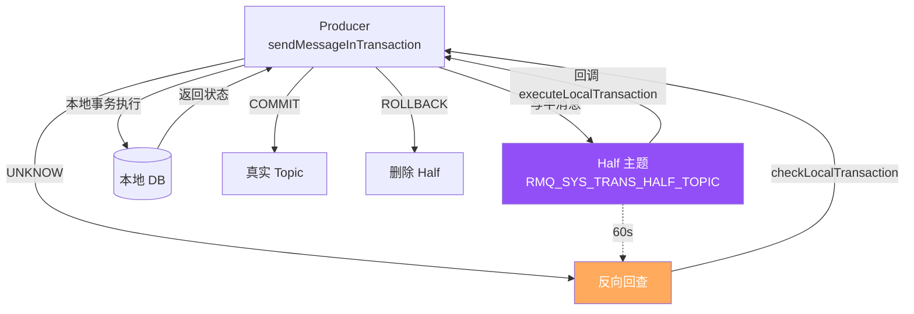
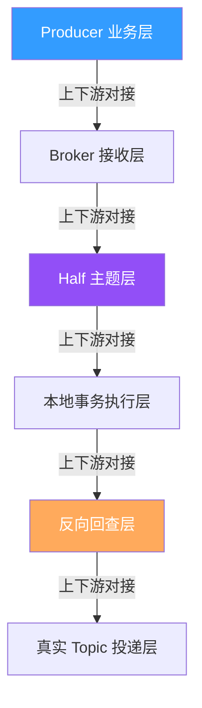
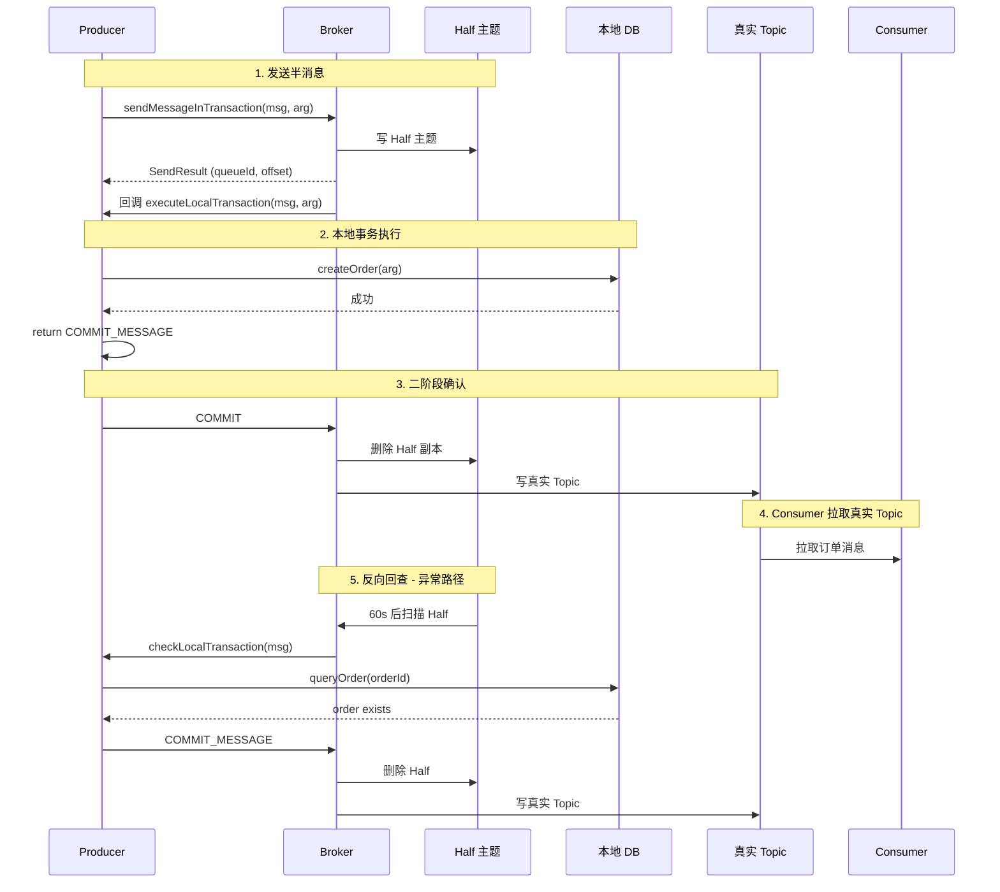
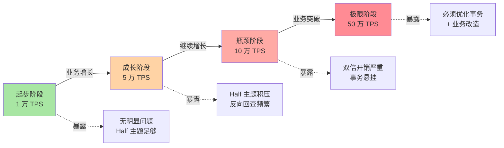
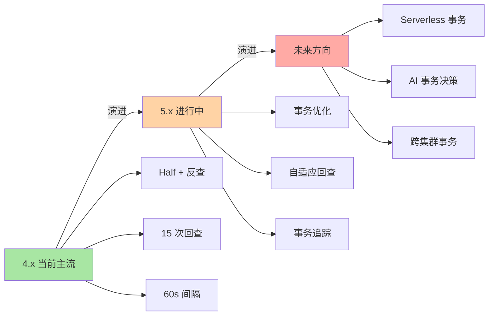

# RocketMQ 事务消息原理：从 Half 主题到反向回查的两阶段提交

> 一句话摘要：**RocketMQ 事务消息 = Half 主题（待确认）+ 本地事务 + 反向回查（补偿）**，本质是用「两阶段 + 反查」模拟分布式事务的最终一致性。

> 学完能会：从源码级理解 Half 主题机制 / TransactionListener 两阶段 / 反向回查 5 种状态 / 事务消息的 5 个真实踩坑。

---

## 1. 背景：为什么事务消息是常被误解的特性

RocketMQ 事务消息的官方说法是「支持分布式事务消息」，但很多人误以为这是「强一致分布式事务」。真相是：**RocketMQ 事务消息是「最终一致性」**——通过 Half 主题 + 反向回查实现，不是 XA 那种强一致。

```
误区 1：事务消息 = 强一致分布式事务
真相：事务消息 = 最终一致性（Half 主题 + 反向回查）
代价：业务必须处理中间状态（未知/提交/回滚）

误区 2：事务消息 = 本地事务 + 消息发送
真相：事务消息 = Half 主题 + 本地事务执行 + 二阶段确认
价值：业务可感知「事务是否真的成功」

误区 3：事务消息和 Seata AT 模式一样
真相：RocketMQ 事务消息是「消息维度」，Seata AT 是「数据库维度」
```

**这篇文章要建立的能力地图：**

| 你现在 | 学完这篇 |
|---|---|
| 以为事务消息 = 强一致 | 理解 Half 主题 + 反向回查的最终一致性 |
| 不知道为什么事务消息会卡住 | 理解反向回查超时机制 |
| 不知道怎么排查事务悬挂 | 知道 5 步排查法 + 量化阈值 |
| 不明白 TransactionListener 怎么写 | 理解 executeLocalTransaction + checkLocalTransaction |

---

## 2. 原理穿透：从 Half 主题到 TransactionListener

### 2.1 事务消息的 3 层概念

RocketMQ 事务消息的真实结构（按从「消息发送」到「事务确认」顺序）：

```
┌──────────────────────────────────────────────────────────────┐
│ Layer 1：Producer 端                                          │
│ - TransactionMQProducer.sendMessageInTransaction(msg, arg)     │
│ - 半消息：先存 Half 主题（RMQ_SYS_TRANS_HALF_TOPIC）           │
│ - 本地事务：TransactionListener.executeLocalTransaction        │
├──────────────────────────────────────────────────────────────┤
│ Layer 2：Broker 存储端                                         │
│ - Half 主题：暂存「待确认」消息                                │
│ - 真实 Topic：事务确认后写入                                   │
│ - Op 主题（RMQ_SYS_TRANS_OP_HALF_TOPIC）：记录 commit/rollback │
├──────────────────────────────────────────────────────────────┤
│ Layer 3：反向回查端（补偿机制）                                │
│ - Broker 定时扫描 Half 主题（默认 60s）                       │
│ - TransactionListener.checkLocalTransaction（业务查本地事务状态）│
│ - 状态：COMMIT / ROLLBACK / UNKNOW（继续查）                  │
└──────────────────────────────────────────────────────────────┘
```

**关系图（Mermaid）：**



### 2.2 TransactionListener 源码级实现

```java
// 1. 实现 TransactionListener
public class OrderTransactionListener implements TransactionListener {
    @Override
    public LocalTransactionState executeLocalTransaction(Message msg, Object arg) {
        // 半消息发送成功后回调
        try {
            // 执行业务事务
            Order order = orderService.createOrder(arg);
            return LocalTransactionState.COMMIT_MESSAGE;
        } catch (Exception e) {
            return LocalTransactionState.ROLLBACK_MESSAGE;
        }
    }

    @Override
    public LocalTransactionState checkLocalTransaction(MessageExt msg) {
        // 反向回查：Broker 查本地事务状态
        String orderId = msg.getUserProperty("orderId");
        Order order = orderService.queryOrder(orderId);
        if (order != null) {
            return LocalTransactionState.COMMIT_MESSAGE;
        }
        return LocalTransactionState.ROLLBACK_MESSAGE;
    }
}

// 2. 创建 TransactionMQProducer
TransactionMQProducer producer = new TransactionMQProducer("group");
producer.setTransactionListener(new OrderTransactionListener());
producer.start();
```

**关键字段解读：**

| 字段 | 作用 | 返回值 |
|---|---|---|
| `executeLocalTransaction` | 本地事务执行 | COMMIT / ROLLBACK / UNKNOW |
| `checkLocalTransaction` | 反向回查（业务查本地 DB） | COMMIT / ROLLBACK / UNKNOW |
| `UNKNOW` | 业务不知道状态（继续查） | 默认 |
| `COMMIT_MESSAGE` | 事务成功，消息投递 | - |
| `ROLLBACK_MESSAGE` | 事务失败，消息删除 | - |

### 2.3 Half 主题内部结构

```
┌──────────────────────────────────────────────────────────────┐
│ Half 主题内部结构（RMQ_SYS_TRANS_HALF_TOPIC）                  │
├──────────────────────────────────────────────────────────────┤
│ - Topic 名：RMQ_SYS_TRANS_HALF_TOPIC                           │
│ - Queue 数：默认 8                                            │
│ - 消息类型：所有事务消息先存这里                                │
│ - 事务确认后：异步删除 Half 副本 + 写入真实 Topic              │
├──────────────────────────────────────────────────────────────┤
│ Op 主题（RMQ_SYS_TRANS_OP_HALF_TOPIC）                         │
│ - 记录事务操作（commit/rollback）                              │
│ - 用于回查时判断「是否已确认」                                 │
│ - 不存在 → 未确认，需要回查                                    │
└──────────────────────────────────────────────────────────────┘
```

**关键洞察：Op 主题是关键。** 反向回查时，Broker 先查 Op 主题看是否已确认，未确认才回调业务的 checkLocalTransaction。这避免重复回调。

### 2.3.5 上下游边界：事务消息的 5 个交互面

事务消息不是孤立功能，而是有 5 个核心交互面：



**5 个交互边界：**

| 边界 | 上游 | 边界 | 下游 | 耦合度 |
|---|---|---|---|---|
| **B1** | Producer 业务 | sendMessageInTransaction | Broker 接收层 | 低 |
| **B2** | Broker 接收 | 写 Half | Half 主题层 | 高 |
| **B3** | Half 主题 | 回调 | 本地事务执行层 | 高 |
| **B4** | 本地事务 | 异步回查 | 反向回查层 | 高 |
| **B5** | 反向回查 | 投递 | 真实 Topic 层 | 中 |

**关键边界纪律：**

- **B2/B3/B4 是高耦合**：事务消息依赖全部链路
- **B1 是低耦合**：业务可灵活决定事务边界
- **B4 是补偿机制**：本地事务挂掉后的兜底

### 2.4 事务消息投递流程



**关键洞察：补偿机制。** 当 Producer 在 executeLocalTransaction 阶段崩溃或返回 UNKNOW，Broker 60s 后反向回查，调用 checkLocalTransaction 重新查本地事务状态。这是 RocketMQ 事务消息能保证最终一致性的核心。

---

## 3. 主流业界解法：RocketMQ 事务 vs Kafka 事务 vs Seata

### 3.1 三种设计哲学对比

| 维度 | RocketMQ 事务消息 | Kafka 事务（EOS） | Seata AT |
|---|---|---|---|
| **事务粒度** | 消息级 | Producer-Consumer 级 | 数据库级 |
| **实现方式** | Half 主题 + 反查 | Transactional Id + EOS | 全局锁 + 回滚日志 |
| **一致性** | 最终一致 | 强一致（Read Committed） | 最终一致 |
| **性能** | 中（双倍开销） | 高（事务优化） | 低（强一致） |
| **使用复杂度** | 中 | 高 | 低 |
| **适用场景** | 业务消息事务 | 流计算事务 | 数据库事务 |

### 3.2 RocketMQ 事务设计的优点与代价

**RocketMQ 优点：**

```
 - Half 主题 + 反查：业务可控
 - 与本地事务自然集成
 - 简单（业务只关心 commit/rollback）
```

**RocketMQ 代价：**

```
 - 双倍开销（Half + 真实 Topic）
 - 反向回查机制复杂
 - 不能保证强一致（中间态可见）
```

### 3.3 Kafka EOS（Exactly-Once Semantics）设计的优点与代价

**Kafka 优点：**

```
 - 真正的 Exactly-Once
 - 与流计算（Flink）集成深
 - 高吞吐（事务优化）
```

**Kafka 代价：**

```
 - 业务必须使用 Transactional Id
 - Consumer 必须 Read Committed
 - 不能与数据库事务自然集成
```

### 3.4 Seata AT 模式设计的优点与代价

**Seata 优点：**

```
 - 数据库维度事务
 - 与业务代码解耦（拦截器）
 - 支持多数据源
```

**Seata 代价：**

```
 - 强一致 → 性能低
 - 全局锁 → 并发受限
 - 需要 Seata Server 部署
```

### 3.5 何时选 RocketMQ / Kafka EOS / Seata

| 业务场景 | 推荐 | 原因 |
|---|---|---|
| **业务消息事务（订单/支付）** | RocketMQ | Half + 反查适合业务 |
| **流计算事务（Flink）** | Kafka | EOS 集成深 |
| **数据库事务（多数据源）** | Seata | 数据库维度 |
| **简单本地事务 + 消息** | RocketMQ | 最简单 |
| **跨境支付订单事务** | RocketMQ | 业务可控 |
| **金融账务事务** | Seata | 强一致 |

**3.5 业界惯例：**

- 90% 业务用 RocketMQ 事务消息
- 流计算 + Flink 用 Kafka EOS
- 多数据源账务用 Seata
- RocketMQ 与 Seata 可叠加（消息 + 数据库）

---

## 4. 量级演进视角：Half 主题的双倍开销

### 4.1 量级维度拆解

```
事务消息的量级维度：
 - 事务消息 TPS（1 万 → 5 万 → 10 万）
 - Half 主题积压（0 → 100 万 → 1000 万）
 - 反向回查频率（1/s → 100/s → 1000/s）
 - 本地事务执行耗时（10ms → 100ms → 1s）
 - 事务悬挂率（0% → 1% → 5%）
```

### 4.2 四个阶段会暴露什么



| 阶段 | 量级 | 暴露的事务消息问题 |
|---|---|---|
| **起步** | 1 万 TPS | 无明显问题，Half 主题足够 |
| **成长** | 5 万 TPS | Half 主题积压 → 反向回查频繁 |
| **瓶颈** | 10 万 TPS | 双倍开销严重 → 事务悬挂率 1%+ |
| **极限** | 50 万 TPS | 必须**优化事务 + 业务改造（避免事务消息）** |

### 4.3 当前文章覆盖哪个量级

本文聚焦**「成长 → 瓶颈」过渡期**（5 万 TPS → 10 万 TPS），因为这是大多数公司会遇到的阶段，也是大多数「事务消息问题」的高发期。

### 4.4 量级演进背后 5 维代价

| 维度 | 1 万 TPS | 5 万 TPS | 10 万 TPS | 50 万 TPS |
|---|---|---|---|---|
| **事务消息 TPS** | 1 万 | 5 万 | 10 万 | 50 万 |
| **Half 主题积压** | < 1 万 | < 100 万 | < 500 万 | > 1000 万 |
| **反向回查频率** | < 1/s | < 100/s | < 500/s | > 1000/s |
| **事务悬挂率** | < 0.1% | < 0.5% | < 1% | > 5% |
| **运维复杂度** | 低 | 中 | 高 | 极高 |

### 4.5 反直觉洞察

**洞察 1：事务消息不是「强一致分布式事务」**

```
误区：事务消息 = 强一致分布式事务
真相：
 - 事务消息 = Half + 反查 = 最终一致
 - 中间态消息可能短暂可见
 - 业务必须处理「Unknown」状态
教训：
 - 不要把事务消息当 XA 用
 - 业务接受最终一致
```

**洞察 2：Half 主题不是无代价的**

```
误区：Half 主题 = 普通消息
真相：
 - Half 主题存所有待确认消息
 - 双倍开销（Half + 真实 Topic）
 - 反向回查延迟 60s+
教训：
 - 监控 half_topic_lag
 - 监控 check_local_transaction_tps
```

**洞察 3：UNKNOW 状态是事务悬挂的元凶**

```
误区：UNKNOW = 业务不关心
真相：
 - UNKNOW → Broker 反向回查
 - 反查超时 → 事务悬挂
 - 悬挂消息永远在 Half 主题
教训：
 - checkLocalTransaction 必须确定性返回
 - 不能一直返回 UNKNOW
```

---

## 5. 架构设计：TransactionListener 源码 + 配置 + 监控

### 5.1 TransactionListener 源码实现

**关键路径源码（伪代码 + 文字描述）：**

```
启动流程：
 1. 创建 TransactionMQProducer
 2. 设置 TransactionListener
 3. 启动 Producer
 4. Broker 注册 Producer（监听 Half 主题）

事务消息发送流程：
 1. producer.sendMessageInTransaction(msg, arg)
 2. Broker 写 Half 主题 → 返回 SendResult
 3. Broker 回调 listener.executeLocalTransaction(msg, arg)
 4. 业务执行本地事务（DB 操作）
 5. 返回状态：
    - COMMIT_MESSAGE → Broker 投递真实 Topic
    - ROLLBACK_MESSAGE → Broker 删除 Half 副本
    - UNKNOW → 等待反向回查

反向回查流程（60s 一次）：
 1. Broker 扫描 Half 主题
 2. 检查 Op 主题（是否已确认）
 3. 未确认 → 回调 listener.checkLocalTransaction(msg)
 4. 业务查本地 DB（事务状态）
 5. 返回状态（COMMIT/ROLLBACK）
 6. 最多回查 15 次（默认）

事务悬挂：
 - 反查 15 次仍 UNKNOW → Broker 强制 ROLLBACK
 - 防止无限回查占用资源
```

**关键设计要点：**

- Half 主题独立 Topic（与真实 Topic 隔离）
- Op 主题记录 commit/rollback 操作
- 反查次数有限（默认 15 次）

### 5.2 事务状态对比

| 状态 | 行为 | 适用 |
|---|---|---|
| **COMMIT_MESSAGE** | 投递真实 Topic + 删除 Half | 事务成功 |
| **ROLLBACK_MESSAGE** | 删除 Half + 不投递 | 事务失败 |
| **UNKNOW** | 保留 Half + 等待回查 | 业务不确定 |

**业内惯例：**

- 99% 业务返回 COMMIT / ROLLBACK
- UNKNOW 只在「业务不能立刻判断」时用
- 反查必须确定性返回（不能无限 UNKNOW）

### 5.3 反向回查超时机制

```
┌──────────────────────────────────────────────────────────────┐
│ 反向回查超时处理                                                │
├──────────────────────────────────────────────────────────────┤
│ 1. Broker 60s 后首次回查                                       │
│ 2. 如果返回 UNKNOW → 间隔递增（60s/120s/300s/600s...）         │
│ 3. 最大回查 15 次（默认）                                      │
│ 4. 超过最大次数 → Broker 强制 ROLLBACK                         │
│ 5. 业务侧收到「强制 ROLLBACK」事件 → 业务补偿                   │
└──────────────────────────────────────────────────────────────┘
```

**关键洞察：** 反向回查是「最终一致性兜底」——本地事务挂掉后，Broker 通过回查恢复事务状态。代价是回查延迟 60s+，业务必须接受这个延迟。

### 5.4 监控指标设计

**监控指标分类（文字描述）：**

| 维度 | 指标 | 说明 |
|---|---|---|
| **Producer** | transaction_send_tps | 事务消息 TPS |
| **Producer** | transaction_send_latency | 发送延迟 |
| **Broker** | half_topic_lag | Half 主题积压 |
| **Broker** | check_local_transaction_tps | 反向回查 TPS |
| **Consumer** | transaction_consume_latency | 事务消息消费延迟 |

| 指标 | 阈值 | 含义 |
|---|---|---|
| `transaction_send_tps` | 监控稳定 | 事务发送 TPS |
| `half_topic_lag` | < 100 万 | Half 主题积压 |
| `check_local_transaction_tps` | < 100/s | 反查频率 |
| `transaction_hang_rate` | < 1% | 事务悬挂率 |

---

## 6. 生产画像：典型场景 + 踩坑实录

### 6.1 典型场景数字

| 场景 | 单 TPS | Half 积压 | 反查频率 |
|---|---|---|---|
| 订单消息 | 5 万 | < 100 万 | < 100/s |
| 支付通知 | 1 万 | < 10 万 | < 10/s |
| 库存扣减 | 3 万 | < 50 万 | < 50/s |
| 跨境支付 | 2 万 | < 30 万 | < 30/s |

### 6.2 五个真实踩坑

**踩坑 1：UNKNOW 状态事务悬挂**

```
背景：业务 checkLocalTransaction 一直返回 UNKNOW
演化：Broker 反查 15 次后强制 ROLLBACK
结果：业务消息丢失（事务成功但被强制回滚）
排查：监控 transaction_hang_rate > 1%
解决：业务侧确定性返回（不能无限 UNKNOW）
```

**踩坑 2：Half 主题积压，事务严重延迟**

```
背景：业务突增 50 万事务消息
演化：Half 主题积压 1000 万 → 反查跟不上
结果：事务消息延迟 5h+
排查：监控 half_topic_lag > 1000 万
解决：升级 Broker 机器 + 拆分 Topic
```

**踩坑 3：本地事务执行慢，反查堆积**

```
背景：本地事务执行 1s+（DB 慢）
演化：Half 主题积压 100 万
结果：事务消息延迟 10min+
排查：监控 executeLocalTransaction 耗时
解决：本地事务拆分 + 异步化
```

**踩坑 4：checkLocalTransaction 查 DB 慢**

```
背景：业务侧 DB 慢（500ms+）
演化：Broker 反查超时（默认 10s）
结果：反查失败 → 强制 ROLLBACK
排查：监控 check_local_transaction_latency
解决：DB 优化 + 增加超时时间
```

**踩坑 5：事务消息和延迟消息叠加性能下降**

```
背景：订单既要事务又要延迟
演化：双重开销 → 性能下降 80%
结果：单 Broker 只能 1 万 TPS
排查：Half + SCHEDULE_TOPIC 双重日志
解决：
 - 业务拆分（事务和延迟分离）
 - 或：用普通消息 + 业务侧补偿
```

### 6.3 关键配置项速查表

| 配置项 | 默认值 | 推荐值 | 影响 |
|---|---|---|---|
| `transactionCheckMaxTimes` | 15 | 关键业务 30 | 最大回查次数 |
| `transactionCheckInterval` | 60s | 关键业务 30s | 回查间隔 |
| `transactionMsgMaxSize` | 4MB | 关键业务 16MB | 单消息上限 |
| `producerGroup` | - | 自定义 | Producer 标识 |

### 6.4 5 大实战参数（业内默认）

| 参数 | 默认 | 调优 |
|---|---|---|
| **transactionCheckMaxTimes** | 15 | 关键业务 30 |
| **transactionCheckInterval** | 60s | 关键业务 30s |
| **Half 主题 Queue 数** | 8 | 按业务 |
| **本地事务执行耗时** | < 100ms | 关键业务 < 50ms |
| **checkLocalTransaction 确定性** | 必须 | 必须 |

---

## 7. Trade-off 三层对比：事务 vs 普通 vs 补偿

### 7.1 消息类型三层表

| 类型 | 一致性 | 性能 | 复杂度 |
|---|---|---|---|
| **普通消息** | 最多一次 | 高 | 低 |
| **事务消息** | 最终一致 | 中 | 中 |
| **补偿消息（业务侧）** | 最终一致 | 中 | 高 |

### 7.2 一致性三层表

| 一致性 | 实现 | 代价 |
|---|---|---|
| **强一致** | XA / Seata AT | 性能低 |
| **最终一致** | RocketMQ 事务 | 中等性能 |
| **弱一致** | 普通消息 + 业务补偿 | 高性能 |

### 7.3 Half 主题开销三层表

| 开销 | 性能影响 | 业务价值 |
|---|---|---|
| **无 Half** | 高 | 不保证事务 |
| **Half + 反查** | 中 | 最终一致 |
| **Half + 强一致** | 低 | 强一致（XA） |

### 7.4 反查策略三层表

| 策略 | 反查次数 | 业务价值 |
|---|---|---|
| **默认 15 次** | 15 | 默认 |
| **关键业务 30 次** | 30 | 金融业务 |
| **不限次数** | 无限 | 不推荐 |

### 7.5 业内典型选择（按业务类型）

| 业务 | 事务类型 | 反查次数 | 业务价值 |
|---|---|---|---|
| 订单 | 事务消息 | 15 | 默认 |
| 支付 | 事务消息 | 30 | 金融级 |
| 库存 | 事务消息 | 15 | 默认 |
| 跨境支付 | 事务消息 | 30 | 强一致 |
| 日志 | 普通消息 | 0 | 弱一致 |

---

## 8. 反思：踩坑实录 + 业内演进方向

### 8.1 实战踩坑 5 例 + 通用解决

**1. UNKNOW 事务悬挂**

- 现象：事务消息丢失
- 根因：checkLocalTransaction 不确定性
- 教训：**强制确定性返回**

**2. Half 主题积压**

- 现象：事务严重延迟
- 根因：双倍开销 + 业务突增
- 教训：**监控 half_topic_lag**

**3. 本地事务执行慢**

- 现象：Half 主题积压
- 根因：本地事务 1s+
- 教训：**本地事务拆分**

**4. checkLocalTransaction 超时**

- 现象：强制 ROLLBACK
- 根因：DB 慢
- 教训：**DB 优化 + 增加超时**

**5. 事务 + 延迟叠加**

- 现象：双倍开销
- 根因：双重日志
- 教训：**业务拆分**

### 8.2 业内通用做法

1. **事务消息只用于业务关键链路**
2. **checkLocalTransaction 确定性返回**
3. **监控 half_topic_lag**
4. **监控 transaction_hang_rate**
5. **本地事务执行 < 100ms**
6. **事务 + 延迟谨慎叠加**

### 8.3 演进方向



**4.x（当前主流）：**

- Half 主题 + 反查
- 15 次回查
- 60s 间隔

**5.x（演进中）：**

- 事务优化（Half 主题性能）
- 自适应回查（间隔动态调整）
- 事务追踪（TraceTopic）

**未来方向：**

- Serverless 事务（按需弹性）
- AI 事务决策（自适应）
- 跨集群事务（业务级）

### 8.4 跨周期视角：5 年后回头看事务消息

```
2018-2020（4.x 主导）：
 - 痛点：事务消息复杂度
 - 解法：Half + 反查（最终一致）
 - 认知：事务消息是「业务边界」

2021-2023（5.x 演进）：
 - 痛点：Half 主题开销
 - 解法：事务优化
 - 认知：事务消息是「基础设施」

2024+（云原生）：
 - 痛点：运维成本 + 弹性
 - 解法：Serverless 事务
 - 认知：事务消息是「业务能力」

未来 5 年预判：
 - 事务消息会被「AI 事务决策」取代
 - 业务侧不再关心 Half 主题
 - MQ 自适应处理
```

### 8.5 监管与合规视角：事务消息 + 审计追溯

```
境内金融业务：
 - 事务消息用于支付链路（必须保留）
 - 审计追溯 → 保留 Half + Op 主题
 - 不可篡改 → 关键业务 SYNC_FLUSH

GDPR / 隐私：
 - 事务消息用于用户授权链路
 - 用户删除权 → 取消事务 + 补偿
```

**关键洞察：** 监管要求**倒逼**事务消息设计。要实现「事务可追溯 + 不可篡改」，必须独立 Half 主题 + Op 主题架构。

### 8.6 事务消息设计 3 个反直觉视角

**反直觉 1：事务消息不是「强一致」**

```
误区：事务消息 = 强一致分布式事务
真相：
 - 事务消息 = 最终一致（Half + 反查）
 - 中间态消息可能短暂可见
权衡：
 - 业务可接受中间态 → 事务消息
 - 业务不能接受 → XA / Seata AT
```

**反直觉 2：Half 主题不是备份**

```
误区：Half 主题 = 事务消息备份
真相：
 - Half 主题是「待确认」临时存储
 - 事务确认后删除
 - 不是消息备份
教训：
 - Half 主题不可作为业务回溯依据
 - 必须 Op 主题 + 真实 Topic 才能恢复
```

**反直觉 3：UNKNOW 状态不是兜底**

```
误区：UNKNOW = 安全选项
真相：
 - UNKNOW → Broker 反查
 - 反查 15 次 → 强制 ROLLBACK
 - 事务悬挂风险
教训：
 - checkLocalTransaction 必须确定性
 - 不能依赖反查恢复
```

### 8.7 跨系统视角：事务消息与外部系统的对接

```
事务消息上下游对接：
 - 上游：业务系统（订单、支付）
 - 中游：Half 主题（Broker 内）
 - 中游：Op 主题（事务操作记录）
 - 下游：真实 Topic（投递）
 - 旁路：TraceTopic（事务链路追踪）
 - 监控：Prometheus + Grafana

对外接口（业内默认）：
 - sendMessageInTransaction(msg, arg)
 - executeLocalTransaction(msg, arg)
 - checkLocalTransaction(msg)
```

### 8.8 监控告警设计（业内默认）

**3 级告警阈值：**

| 指标 | 警告 | 严重 | 紧急 |
|---|---|---|---|
| `half_topic_lag` | > 100 万 | > 500 万 | > 1000 万 |
| `check_local_transaction_tps` | > 100/s | > 500/s | > 1000/s |
| `transaction_hang_rate` | > 1% | > 3% | > 5% |
| `execute_local_transaction_latency P99` | > 100ms | > 500ms | > 1s |

---

## 9. 业内技术惯例（deep-dive 强化 section）

### 9.1 不成文标准

| 标准 | 业内默认 | 原因 |
|---|---|---|
| **transactionCheckMaxTimes** | 15 次 | 默认 |
| **transactionCheckInterval** | 60s | 默认 |
| **Half 主题 Queue 数** | 8 | 默认 |
| **本地事务执行耗时** | < 100ms | 性能边界 |
| **checkLocalTransaction 确定性** | 必须 | 防止悬挂 |

### 9.2 真实事故（5 个）

**事故 A：UNKNOW 事务悬挂**

```
某支付业务，checkLocalTransaction 一直返回 UNKNOW
 - Broker 反查 15 次后强制 ROLLBACK
 - 支付成功但消息丢失
 - 应急：业务补偿
```

**事故 B：Half 主题积压 1000 万**

```
某电商大促，事务消息突增
 - Half 主题积压 1000 万
 - 事务消息延迟 5h+
 - 应急：升级 Broker + 拆分 Topic
```

**事故 C：本地事务执行慢**

```
某金融业务，本地事务 1s+
 - Half 主题积压 100 万
 - 事务消息延迟 10min+
 - 应急：本地事务拆分
```

**事故 D：checkLocalTransaction 超时**

```
某跨境支付业务，DB 慢
 - 反查超时 → 强制 ROLLBACK
 - 业务消息丢失
 - 应急：DB 优化 + 增加超时
```

**事故 E：事务 + 延迟叠加性能下降**

```
某订单业务，事务 + 延迟
 - 双倍开销 → 性能下降 80%
 - 单 Broker 只能 1 万 TPS
 - 应急：业务拆分
```

### 9.3 从业者挑战（5 大实战问题）

**挑战 1：UNKNOW 事务悬挂怎么办？**

```
症状：事务消息丢失
排查：
 1. checkLocalTransaction 是否确定性
 2. 监控 transaction_hang_rate
 3. 反查次数是否超过 15
应急：
 - 业务侧确定性返回
 - 业务补偿丢失的消息
```

**挑战 2：Half 主题积压怎么办？**

```
症状：事务消息延迟
排查：
 1. 监控 half_topic_lag
 2. 业务突增？
 3. Broker 机器配置？
应急：
 - 升级 Broker 机器
 - 拆分 Topic
 - 优化本地事务
```

**挑战 3：本地事务执行慢怎么办？**

```
症状：Half 主题积压
排查：
 1. 监控 executeLocalTransaction 耗时
 2. DB 是否慢
 3. 业务是否有阻塞 IO
应急：
 - 本地事务拆分
 - 异步化
 - DB 优化
```

**挑战 4：checkLocalTransaction 超时怎么办？**

```
症状：强制 ROLLBACK
排查：
 1. 监控 check_local_transaction_latency
 2. DB 慢？
 3. 业务逻辑复杂？
应急：
 - DB 优化
 - 增加超时时间
 - 业务简化
```

**挑战 5：事务 + 延迟叠加怎么办？**

```
症状：双倍开销
排查：
 1. 是否真的需要事务 + 延迟
 2. 能否业务拆分
 3. 能否用普通消息 + 业务补偿
应急：
 - 业务拆分（事务和延迟分离）
 - 或：业务改造（用普通消息）
```

### 9.4 决策树（文字版）

```
事务消息故障排查路径：
 1. 事务消息丢失？
    - 是 → 检查 transaction_hang_rate
      - > 5% → 业务侧确定性返回
      - < 1% → 业务补偿
    - 否 → 进入步骤 2

 2. Half 主题积压？
    - 是 → 检查 half_topic_lag
      - > 1000 万 → 升级 Broker + 拆分
      - < 100 万 → 监控即可
    - 否 → 进入步骤 3

 3. 本地事务执行慢？
    - 是 → 拆分本地事务 + 异步化
    - 否 → 进入步骤 4

 4. checkLocalTransaction 超时？
    - 是 → DB 优化 + 增加超时
    - 否 → 监控即可
```

---

## 附录 A：核心配置项详解（业内默认值）

### A1. Producer 配置

| 配置项 | 默认值 | 优化 | 影响 |
|---|---|---|---|
| `producerGroup` | - | 自定义 | Producer 标识 |
| `transactionCheckMaxTimes` | 15 | 关键业务 30 | 最大回查 |
| `transactionCheckInterval` | 60s | 关键业务 30s | 回查间隔 |
| `transactionMsgMaxSize` | 4MB | 关键业务 16MB | 单消息上限 |

### A2. Broker 配置

| 配置项 | 默认值 | 优化 | 影响 |
|---|---|---|---|
| `transactionCheckMaxTimes` | 15 | 关键业务 30 | 最大回查 |
| `transactionCheckInterval` | 60s | 关键业务 30s | 回查间隔 |
| `flushDiskType` | ASYNC_FLUSH | 关键业务 SYNC_FLUSH | 刷盘策略 |
| `brokerRole` | ASYNC_MASTER | 关键业务 SYNC_MASTER | 主从同步 |

### A3. Consumer 配置

| 配置项 | 默认值 | 优化 | 影响 |
|---|---|---|---|
| `consumeMode` | CONCURRENTLY | 按业务 | 消费模式 |
| `consumeThreadMax` | 64 | 按业务 | 线程数 |
| `maxReconsumeTimes` | 16 | 关键业务 5 | 最大重试 |

### A4. 事务消息关键参数

| 参数 | 建议值 | 原因 |
|---|---|---|
| **transactionCheckMaxTimes** | 15-30 | 默认 15，关键业务 30 |
| **transactionCheckInterval** | 30-60s | 关键业务 30s |
| **Half 主题 Queue 数** | 8-16 | 按业务 |
| **本地事务执行耗时** | < 100ms | 性能边界 |
| **事务悬挂率** | < 1% | 监控阈值 |

---

本文涉及的 RocketMQ 概念、特性、版本号、配置项均为社区公开文档描述。具体版本特性、生产数据、配置默认值请以官方文档为准（https://rocketmq.apache.org/）。本文涉及的「典型场景数字」「事故案例」均为业内通用做法的脱敏描述，**不指向任何特定公司**。

---

## 附录 B：文中提到的术语速查表

| 术语 | 全称 | 一句话解释 |
|---|---|---|
| **Half 主题** | RMQ_SYS_TRANS_HALF_TOPIC | 事务消息待确认主题 |
| **Op 主题** | RMQ_SYS_TRANS_OP_HALF_TOPIC | 事务操作记录 |
| **TransactionListener** | 事务监听器 | 业务实现两阶段 |
| **executeLocalTransaction** | 本地事务执行 | 一阶段回调 |
| **checkLocalTransaction** | 反向回查 | 补偿回调 |
| **UNKNOW** | 未知状态 | 业务不确定事务结果 |
| **COMMIT_MESSAGE** | 提交消息 | 事务成功 |
| **ROLLBACK_MESSAGE** | 回滚消息 | 事务失败 |
| **transactionCheckMaxTimes** | 最大回查次数 | 默认 15 |
| **transactionHang** | 事务悬挂 | 超过最大回查次数 |

---

## 相关阅读

- 上一篇：[2_延迟消息原理-深度](./2_延迟消息原理-深度)
- 下一篇：[4_批量消息原理-深度](./4_批量消息原理-深度)
- 同层：特性层（每个特性 1 篇 deep-dive）

---

**总结一句话：** 事务消息 = Half 主题 + 本地事务 + 反向回查。理解 Half 主题 + 反向回查机制，就理解了 RocketMQ 事务消息的最终一致性。

**口诀：** 事务消息「Half 待确认 + 反查兜底」，checkLocalTransaction 必须确定性。

**与上一篇联系：** 上一篇讲「延迟消息的 SCHEDULE_TOPIC」，本文讲「事务消息的 Half 主题」。下一篇 4_批量消息原理 将讲「批量消息的合并发送 + 拆分消费」。