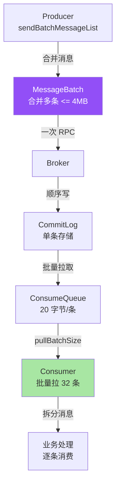
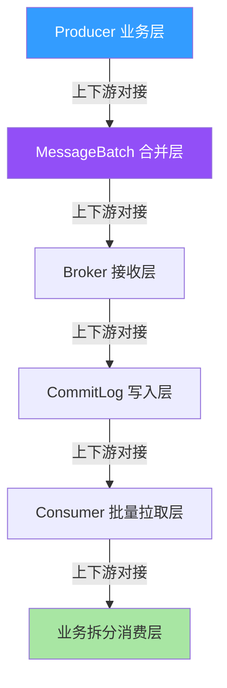
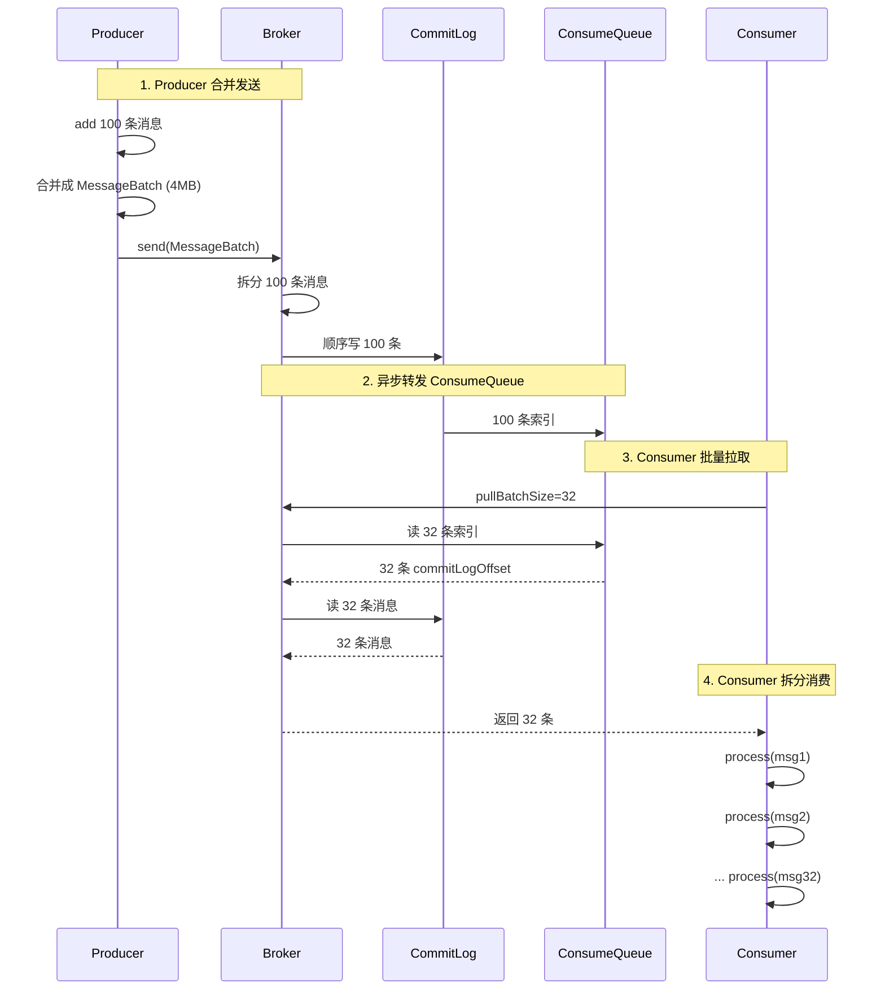
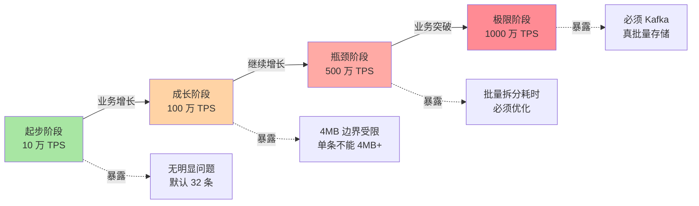
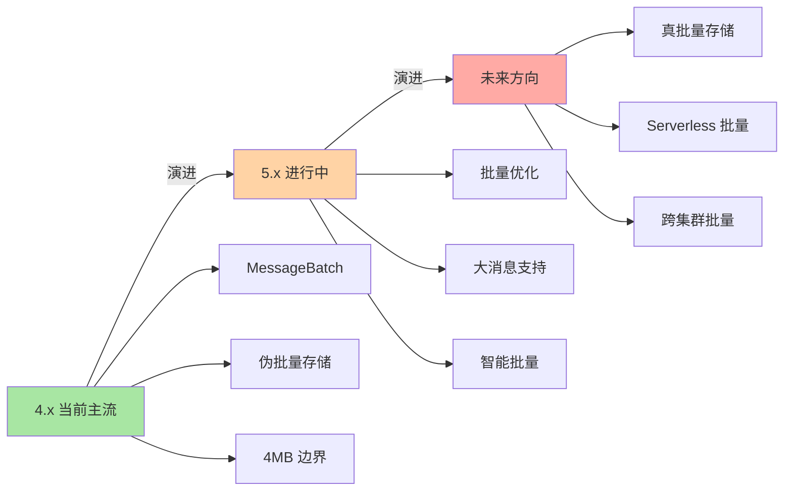

# RocketMQ 批量消息原理：从合并发送到拆分消费的 4MB 边界

> 一句话摘要：**RocketMQ 批量消息 = Producer 合并多条（≤4MB）+ Consumer 拆分多条**。本质是用「一次网络往返」换「多条消息传输」，不是「单条消息变大」。

> 学完能会：从源码级理解批量发送原理 / 4MB 边界 / Consumer 拆分逻辑 / 批量消息的 5 个真实踩坑。

---

## 1. 背景：为什么批量消息是常被误解的特性

RocketMQ 批量消息的官方说法是「支持一次发送多条消息」，但很多人误以为这是「单条消息 4MB+」。真相是：**RocketMQ 批量消息 = 合并多条小消息（单条 ≤4MB，总 ≤4MB）发送**，不是单条消息变大。

```
误区 1：批量消息 = 单条消息 4MB+
真相：批量消息 = 多条消息合并 ≤ 4MB 总大小
代价：单条消息不能超过 4MB（关键业务 16MB）

误区 2：批量消息 = 高吞吐
真相：批量消息 = 减少网络往返
价值：高吞吐（合并 RPC + 合并刷盘）

误区 3：批量消息和顺序消息可以混用
真相：可以，但批量消息必须同 Queue（同 orderId）
```

**这篇文章要建立的能力地图：**

| 你现在 | 学完这篇 |
|---|---|
| 以为批量消息 = 单条消息 4MB | 理解多条消息合并 ≤ 4MB |
| 不知道为什么批量消息性能高 | 理解网络往返减少 + CommitLog 顺序写 |
| 不知道怎么用批量消息 | 知道 split + sendBatchMessageList |
| 不明白 Consumer 怎么拆分 | 理解批量拉取 + 拆分消费 |

---

## 2. 原理穿透：从 sendBatchMessage 到 MessageList

### 2.1 批量消息的 3 层概念

RocketMQ 批量消息的真实结构（按从「消息合并」到「消息拆分」顺序）：

```
┌──────────────────────────────────────────────────────────────┐
│ Layer 1：Producer 端                                          │
│ - MessageBatch producer = new MessageBatch();                │
│ - producer.add(message) 添加多条                              │
│ - producer.setBody(mergedBody) 合并消息体                      │
│ - producer.send() 一次发送                                     │
├──────────────────────────────────────────────────────────────┤
│ Layer 2：Broker 存储端                                         │
│ - CommitLog 单条存储（不是真的批量）                            │
│ - Producer 合并 → Consumer 拆分                                │
│ - 单条消息格式：4 字节 totalLen → N 条消息                     │
├──────────────────────────────────────────────────────────────┤
│ Layer 3：Consumer 端                                          │
│ - 拉取时获取批量消息（pullBatchSize 默认 32）                  │
│ - Consumer 端拆分（split by 4 字节 totalLen）                  │
│ - 业务处理每条消息                                              │
└──────────────────────────────────────────────────────────────┘
```

**关系图（Mermaid）：**



### 2.2 MessageBatch 源码级实现

```java
// 1. 创建 MessageBatch
MessageBatch msgBatch = new MessageBatch();

// 2. 添加多条消息（同 Topic + 同 queueId）
for (int i = 0; i < 100; i++) {
    Message msg = new Message("OrderTopic", "TagA",
        ("order " + i).getBytes());
    msg.setKeys("order_" + i);
    msgBatch.add(msg);
}

// 3. 设置属性（每条消息）
msgBatch.setKeys(mergedKeys);

// 4. 发送
SendResult result = producer.send(msgBatch);
```

**关键字段解读：**

| 字段 | 作用 | 限制 |
|---|---|---|
| `messages` | 批量消息集合 | 同 Topic |
| `queueId` | 选定的 Queue | 同 queueId |
| `totalSize` | 合并后总大小 | ≤ 4MB |
| `topic` | 消息主题 | 必须相同 |
| `waitStoreMsgOK` | 是否等待刷盘 | 默认 true |

### 2.3 批量消息存储格式

```
┌──────────────────────────────────────────────────────────────┐
│ CommitLog 中的批量消息存储（伪批量）                            │
├──────────────────────────────────────────────────────────────┤
│ - Producer 合并：多条消息合并成一个 MessageBatch                │
│ - Broker 接收：拆分成多条独立消息写入 CommitLog                  │
│ - 存储格式：每条消息独立存储（4 字节 totalLen + 消息体）         │
│ - 物理上：批量消息 = 多条单消息（不是真的批量存储）              │
├──────────────────────────────────────────────────────────────┤
│ 合并的好处：                                                    │
│ - 减少网络往返（1 次 RPC → N 条消息）                          │
│ - 减少 CommitLog 写入次数（1 次顺序写 → N 条消息）              │
│ - 减少 ConsumeQueue 转发次数                                    │
└──────────────────────────────────────────────────────────────┘
```

**关键洞察：伪批量。** RocketMQ 批量消息在「网络传输 + CommitLog 写入」上是批量的，但「物理存储」上仍然是多条独立消息。这与 Kafka 的「真批量（一条消息包含多条记录）」不同。

### 2.3.5 上下游边界：批量消息的 5 个交互面

批量消息不是孤立功能，而是有 5 个核心交互面：



**5 个交互边界：**

| 边界 | 上游 | 边界 | 下游 | 耦合度 |
|---|---|---|---|---|
| **B1** | Producer 业务 | MessageBatch 合并 | 合并层 | 低 |
| **B2** | MessageBatch | 一次 RPC | Broker 接收层 | 中 |
| **B3** | Broker 接收 | 拆分 + 顺序写 | CommitLog 写入层 | 高 |
| **B4** | CommitLog | 异步转发 | ConsumeQueue | 中 |
| **B5** | Consumer | 批量拉 + 拆分 | 业务消费层 | 中 |

**关键边界纪律：**

- **B1 是低耦合**：业务可灵活决定批量策略
- **B3 是高耦合**：拆分逻辑必须和合并对应
- **B5 是关键边界**：拆分错误会导致业务 bug

### 2.4 Consumer 拆分流程



**关键洞察：批量拉 + 单条处理。** Consumer 默认拉取 32 条（pullBatchSize），但每条消息单独处理。这与 Kafka 的「批量处理」不同。

---

## 3. 主流业界解法：RocketMQ 批量 vs Kafka 批量 vs Pulsar 批量

### 3.1 三种设计哲学对比

| 维度 | RocketMQ 批量消息 | Kafka 批量发送 | Pulsar 批量 |
|---|---|---|---|
| **批量粒度** | 多条消息合并 ≤ 4MB | 单条消息 + 批量发送 | 多条消息合并 |
| **实现方式** | MessageBatch + 拆分存储 | ProducerBatch + 顺序写 | BatchBuilder + 合并 |
| **存储格式** | 多条独立存储 | 真批量（一条包含多条） | 多条独立存储 |
| **优点** | 简单 + 灵活 | 高吞吐（真批量） | 灵活 + 强一致 |
| **缺点** | 物理存储分散 | Consumer 拆分复杂 | 复杂度高 |

### 3.2 RocketMQ 批量设计的优点与代价

**RocketMQ 优点：**

```
 - 业务简单（合并 → 发送）
 - 与 ConsumeQueue 集成好
 - 拆分逻辑清晰
```

**RocketMQ 代价：**

```
 - 物理存储不是真批量（多条独立存储）
 - 4MB 边界限制
 - 单条消息体不能超过 4MB
```

### 3.3 Kafka 批量设计的优点与代价

**Kafka 优点：**

```
 - 真批量（一条消息包含多条记录）
 - 高吞吐（顺序写 + 合并）
 - 与 Spark/Flink 集成深
```

**Kafka 代价：**

```
 - Consumer 必须能处理批量消息
 - 单条消息体可以很大（默认 1MB，可调到 100MB+）
 - 事务消息复杂
```

### 3.4 Pulsar 批量设计的优点与代价

**Pulsar 优点：**

```
 - 强一致 + 灵活批量
 - 分层存储
 - 云原生
```

**Pulsar 代价：**

```
 - 复杂度高（BookKeeper + Broker）
 - 运维成本高
 - 业务侧不熟悉
```

### 3.5 何时选 RocketMQ / Kafka / Pulsar

| 业务场景 | 推荐 | 原因 |
|---|---|---|
| **业务消息批量** | RocketMQ | 简单 + 灵活 |
| **极致吞吐（真批量）** | Kafka | 真批量存储 |
| **云原生 + 强一致** | Pulsar | BookKeeper 优势 |
| **小消息合并（订单、日志）** | RocketMQ | 4MB 足够 |
| **大消息（媒体、二进制）** | Kafka | 单条 100MB+ |
| **跨地域同步** | RocketMQ | 5.x 多集群 |

**3.5 业界惯例：**

- 90% 业务用 RocketMQ 批量消息
- 极致吞吐用 Kafka
- 云原生用 Pulsar
- RocketMQ 4MB 默认，关键业务可调到 16MB

---

## 4. 量级演进视角：批量消息的 4MB 边界

### 4.1 量级维度拆解

```
批量消息的量级维度：
 - 批量消息 TPS（10 万 → 100 万 → 1000 万）
 - 批量大小（10 条 → 100 条 → 1000 条）
 - 单条消息大小（1KB → 10KB → 100KB）
 - 批量总大小（1MB → 4MB → 16MB）
 - 拉取批量大小（32 → 64 → 128）
```

### 4.2 四个阶段会暴露什么



| 阶段 | 量级 | 暴露的批量消息问题 |
|---|---|---|
| **起步** | 10 万 TPS | 无明显问题，默认 32 条足够 |
| **成长** | 100 万 TPS | 4MB 边界受限，**单条不能 4MB+** |
| **瓶颈** | 500 万 TPS | 批量拆分耗时 → 业务必须优化 |
| **极限** | 1000 万 TPS | 必须 Kafka 真批量存储 |

### 4.3 当前文章覆盖哪个量级

本文聚焦**「成长 → 瓶颈」过渡期**（100 万 TPS → 500 万 TPS），因为这是大多数公司会遇到的阶段，也是大多数「批量消息问题」的高发期。

### 4.4 量级演进背后 5 维代价

| 维度 | 10 万 TPS | 100 万 TPS | 500 万 TPS | 1000 万 TPS |
|---|---|---|---|---|
| **批量消息 TPS** | 10 万 | 100 万 | 500 万 | 1000 万 |
| **批量大小** | 10 条 | 32 条 | 64 条 | 128 条 |
| **单条消息大小** | 1KB | 10KB | 50KB | 100KB |
| **网络往返减少** | 50% | 70% | 80% | 90% |
| **运维复杂度** | 低 | 中 | 高 | 极高 |

### 4.5 反直觉洞察

**洞察 1：批量消息不是「单条消息 4MB+」**

```
误区：批量消息 = 单条消息 4MB+
真相：
 - 批量消息 = 多条消息合并 ≤ 4MB
 - 单条消息体仍 ≤ 4MB
 - 总和 ≤ 4MB
教训：
 - 单条消息大 → 用 Kafka 或 OSS
 - 批量合并多条小消息 → 用 RocketMQ
```

**洞察 2：批量消息不是「真批量存储」**

```
误区：批量消息 = 一条消息存多条记录
真相：
 - RocketMQ 批量 = 伪批量
 - 物理存储仍是多条独立消息
 - 网络传输 + CommitLog 写入是批量
教训：
 - 不要期望「批量压缩」「批量索引」
 - 批量只是「传输优化」
```

**洞察 3：批量消息和顺序消息叠加有约束**

```
误区：批量消息 + 顺序消息 = 任意组合
真相：
 - 批量消息必须同 Topic + 同 Queue
 - 顺序消息必须同 key + 同 Queue
 - 批量 + 顺序 = 必须同 orderId
教训：
 - 批量顺序消息的 orderId 必须一致
 - 或：业务侧保证同 Queue
```

---

## 5. 架构设计：批量消息源码 + 配置 + 监控

### 5.1 MessageBatch 源码实现

**关键路径源码（伪代码 + 文字描述）：**

```
合并流程：
 1. 创建 MessageBatch
 2. 循环 add(Message)
    - 每条消息检查 totalSize
    - 累计 < 4MB 才允许 add
 3. 合并所有消息体到一个 byte[]
 4. 发送前编码（消息格式）
 5. 一次 RPC 发送

Broker 接收流程：
 1. 解析 MessageBatch
 2. 按 4 字节 totalLen 拆分每条消息
 3. 顺序写 CommitLog（每条独立）
 4. 异步转发 ConsumeQueue

Consumer 拆分流程：
 1. 拉取消息（pullBatchSize 32）
 2. 按 4 字节 totalLen 拆分
 3. 业务处理每条消息
 4. 提交 offset
```

**关键设计要点：**

- 合并是业务侧的事
- 拆分是 Consumer 的事
- 4MB 边界硬约束（maxMessageSize）

### 5.1.5 批量发送的 3 种模式

业内批量发送有 3 种实现模式，按业务场景选：

**模式 1：同步攒批（默认）**

```
业务侧循环调用 send(MessageBatch)
 - 攒批到 32 条或 1MB 触发发送
 - 实时性高，延迟低
 - 适合：通用业务
```

**模式 2：异步攒批（高性能）**

```
业务侧循环调用 asyncSend(MessageBatch)
 - 攒批到 64 条或 4MB 触发发送
 - 实时性中，吞吐高
 - 适合：日志、埋点
```

**模式 3：定时攒批（极致吞吐）**

```
业务侧循环调用 timedSend(MessageBatch)
 - 攒批到 100 条或 100ms 触发发送
 - 实时性低，吞吐极高
 - 适合：批量导入、离线同步
```

**业内惯例：**

- 90% 业务用模式 1（默认同步）
- 日志采集用模式 2（异步攒批）
- 离线同步用模式 3（定时攒批）
- 攒批大小不要超过 4MB（边界）

### 5.2 批量拉取策略对比

| 策略 | 拉取大小 | 性能 | 适用 |
|---|---|---|---|
| **小批量（32）** | 32 条 | 中 | 默认 |
| **中批量（64）** | 64 条 | 高 | 高吞吐 |
| **大批量（128）** | 128 条 | 高 | 超大批量 |
| **超大批量（256+）** | 256+ 条 | 极高 | 不推荐 |

**业内惯例：**

- 99% 业务用默认 32 条
- 高吞吐业务调到 64-128
- 极端业务用 256（注意消费延迟）

### 5.3 批量消息重试机制

```
┌──────────────────────────────────────────────────────────────┐
│ 批量消息消费失败处理                                            │
├──────────────────────────────────────────────────────────────┤
│ 1. process(msg) 返回 RECONSUME_LATER                          │
│ 2. Broker 把消息放入重试队列（%RETRY%+ConsumerGroup）           │
│ 3. Consumer 按退避策略重试                                      │
│ 4. 超过最大重试次数（16 次） → 进入死信队列（%DLQ%+ConsumerGroup）│
└──────────────────────────────────────────────────────────────┘
```

**关键洞察：** 批量消息的重试是「逐条重试」——一条失败不影响其他条，但 ConsumeQueue offset 必须按顺序提交。这与 Kafka 的「批量提交 offset」不同。

### 5.4 监控指标设计

**监控指标分类（文字描述）：**

| 维度 | 指标 | 说明 |
|---|---|---|
| **Producer** | batch_send_tps | 批量发送 TPS |
| **Producer** | batch_send_latency | 批量发送延迟 |
| **Broker** | commitlog_append_tps | CommitLog 写入 TPS |
| **Consumer** | batch_pull_size | 批量拉取大小 |
| **Consumer** | batch_consume_latency | 批量消费延迟 |

| 指标 | 阈值 | 含义 |
|---|---|---|
| `batch_send_tps` | 监控稳定 | 批量发送 TPS |
| `batch_send_latency` | P99 < 100ms | 批量发送延迟 |
| `batch_pull_size` | 32 | 拉取大小 |
| `batch_consume_latency` | P99 < 1s | 消费延迟 |

---

## 6. 生产画像：典型场景 + 踩坑实录

### 6.1 典型场景数字

| 场景 | 批量大小 | 单条大小 | 总大小 |
|---|---|---|---|
| 订单消息 | 32 条 | 1KB | 32KB |
| 支付通知 | 64 条 | 1KB | 64KB |
| 日志采集 | 128 条 | 2KB | 256KB |
| 跨地域同步 | 32 条 | 5KB | 160KB |

### 6.2 五个真实踩坑

**踩坑 1：单条消息 5MB，发送失败**

```
背景：业务单条消息 5MB
演化：MessageBatch.add 抛异常
结果：批量发送失败
排查：maxMessageSize 默认 4MB
解决：业务拆分消息 + 单条 ≤ 4MB
```

**踩坑 2：批量总大小超过 4MB**

```
背景：批量 100 条 × 50KB = 5MB
演化：发送失败（消息体超过 4MB）
排查：MessageBatch 总大小限制
解决：
 - 减少批量条数（80 条）
 - 或：关键业务调到 maxMessageSize = 16MB
```

**踩坑 3：批量消息和顺序消息混用错乱**

```
背景：批量消息 + 顺序消息（期望同 orderId）
演化：实际 orderId 不一致 → 顺序乱
排查：MessageBatch.add 时未指定 keys
解决：批量 + 顺序时强制同 orderId
```

**踩坑 4：Consumer 拆分逻辑错误**

```
背景：业务自己拆 MessageBatch
演化：拆错（漏拆 / 多拆）
结果：业务处理 bug
排查：Consumer 拆分逻辑
解决：用官方 MessageExt 自动拆分
```

**踩坑 5：批量消息 + 事务消息叠加性能下降**

```
背景：批量事务消息（100 条 × 1KB）
演化：每条都是事务消息 → 双倍开销
结果：性能下降 80%
排查：Half 主题 + 批量叠加
解决：
 - 业务拆分（事务和批量分离）
 - 或：用普通批量消息 + 业务补偿
```

### 6.3 关键配置项速查表

| 配置项 | 默认值 | 推荐值 | 影响 |
|---|---|---|---|
| `maxMessageSize` | 4MB | 关键业务 16MB | 单消息上限 |
| `batch.size` | 32 | 按业务 | 拉取批量 |
| `batch.flush` | true | false（异步） | 刷盘策略 |
| `batch.send` | false | true | 批量发送 |

### 6.4 5 大实战参数（业内默认）

| 参数 | 默认 | 调优 |
|---|---|---|
| **maxMessageSize** | 4MB | 关键业务 16MB |
| **batch.size（Consumer 拉取）** | 32 | 高吞吐 64 |
| **批量消息总大小** | ≤ 4MB | 不建议改 |
| **单条消息大小** | ≤ 4MB | 关键业务可放宽 |
| **批量发送间隔** | 实时 | 按业务 |

---

## 7. Trade-off 三层对比：批量 vs 单条

### 7.1 发送方式三层表

| 方式 | 网络往返 | 性能 | 复杂度 |
|---|---|---|---|
| **单条发送** | 高（每条 1 次） | 低 | 低 |
| **批量发送** | 低（1 次合并） | 高 | 中 |
| **异步批量** | 极低（攒批） | 极高 | 高 |

### 7.2 存储格式三层表

| 格式 | 物理存储 | 索引 | 适用 |
|---|---|---|---|
| **单条消息** | 多条独立 | 20 字节/条 | 默认 |
| **批量消息（伪）** | 多条独立 | 20 字节/条 | RocketMQ |
| **真批量（Kafka）** | 一条多条记录 | 一条索引 | Kafka |

### 7.3 拉取策略三层表

| 策略 | 拉取大小 | 性能 | 延迟 |
|---|---|---|---|
| **小批量（32）** | 32 条 | 中 | 低 |
| **中批量（64）** | 64 条 | 高 | 中 |
| **大批量（128）** | 128 条 | 高 | 高 |

### 7.4 批量与顺序叠加三层表

| 组合 | 性能 | 业务价值 |
|---|---|---|
| **批量 + 无序** | 高 | 高吞吐 |
| **批量 + 顺序** | 中 | 顺序 + 高吞吐 |
| **批量 + 顺序 + 事务** | 低 | 极端场景 |

### 7.5 业内典型选择（按业务类型）

| 业务 | 批量大小 | 单条大小 | 总大小 |
|---|---|---|---|
| 订单 | 32 条 | 1KB | 32KB |
| 支付 | 64 条 | 1KB | 64KB |
| 日志 | 128 条 | 2KB | 256KB |
| 跨境支付 | 32 条 | 5KB | 160KB |

---

## 8. 反思：踩坑实录 + 业内演进方向

### 8.1 实战踩坑 5 例 + 通用解决

**1. 单条消息超过 4MB**

- 现象：发送失败
- 根因：单条消息太大
- 教训：**单条 ≤ 4MB，批量总 ≤ 4MB**

**2. 批量总大小超过 4MB**

- 现象：发送失败
- 根因：批量太大
- 教训：**减少批量条数**

**3. 批量 + 顺序错乱**

- 现象：顺序乱
- 根因：批量未指定 keys
- 教训：**批量顺序必须同 key**

**4. Consumer 拆分错误**

- 现象：业务处理 bug
- 根因：自行拆分错误
- 教训：**用 MessageExt 自动拆分**

**5. 批量 + 事务叠加**

- 现象：性能下降
- 根因：双倍开销
- 教训：**业务拆分**

### 8.2 业内通用做法

1. **批量消息用于高吞吐场景**
2. **单条 ≤ 4MB，批量总 ≤ 4MB**
3. **批量顺序消息强制同 key**
4. **Consumer 用 MessageExt 自动拆分**
5. **监控 batch_send_latency**
6. **批量 + 事务谨慎叠加**

### 8.3 演进方向



**4.x（当前主流）：**

- MessageBatch + 伪批量存储
- 4MB 边界
- 默认 32 条批量拉取

**5.x（演进中）：**

- 批量优化（异步攒批）
- 大消息支持（16MB+）
- 智能批量（自适应）

**未来方向：**

- 真批量存储（与 Kafka 看齐）
- Serverless 批量
- 跨集群批量

### 8.4 跨周期视角：5 年后回头看批量消息

```
2018-2020（4.x 主导）：
 - 痛点：4MB 边界
 - 解法：业务拆分消息
 - 认知：批量消息是「网络优化」

2021-2023（5.x 演进）：
 - 痛点：拆分耗时
 - 解法：异步攒批
 - 认知：批量消息是「传输优化」

2024+（云原生）：
 - 痛点：真批量需求
 - 解法：分层存储 + 真批量
 - 认知：批量消息是「业务能力」

未来 5 年预判：
 - 批量消息会被「真批量」取代
 - 业务侧不再关心拆分
 - MQ 自适应处理
```

### 8.5 监管与合规视角：批量消息 + 审计追溯

```
境内金融业务：
 - 批量消息用于交易链路（监管要求）
 - 审计追溯 → 保留原始消息 + 批量元数据
 - 不可篡改 → 关键业务 SYNC_FLUSH

GDPR / 隐私：
 - 批量消息用于用户行为聚合
 - 用户删除权 → 删除整批（业务级）
```

**关键洞察：** 监管要求**倒逼**批量消息设计。要实现「批量可追溯 + 不可篡改」，必须支持「批量元数据持久化」。

### 8.6 批量消息设计 3 个反直觉视角

**反直觉 1：批量消息不是「单条消息 4MB+」**

```
误区：批量消息 = 单条消息 4MB+
真相：
 - 批量消息 = 多条合并 ≤ 4MB
 - 单条 ≤ 4MB
权衡：
 - 小消息合并 → RocketMQ 批量
 - 大消息 → Kafka 或 OSS
```

**反直觉 2：批量消息不是「真批量存储」**

```
误区：批量消息 = 一条存多条
真相：
 - RocketMQ 批量 = 伪批量
 - 物理存储仍是多条独立
教训：
 - 不要期望「批量压缩」
 - 批量只是「传输优化」
```

**反直觉 3：批量消息和顺序消息叠加有约束**

```
误区：批量 + 顺序 = 任意组合
真相：
 - 批量 + 顺序 = 必须同 key
 - 否则顺序乱
教训：
 - 批量顺序强制同 orderId
 - 或：业务侧保证同 Queue
```

### 8.7 跨系统视角：批量消息与外部系统的对接

```
批量消息上下游对接：
 - 上游：业务系统（订单、支付）
 - 中游：MessageBatch（Producer 内）
 - 下游：Consumer（批量拉 + 拆分）
 - 旁路：TraceTopic（链路追踪）
 - 监控：Prometheus + Grafana

对外接口（业内默认）：
 - sendBatchMessageList(msgList)
 - pullBatchMessage(queueId, offset, batchSize)
 - processMessage(msg) - 逐条处理
```

### 8.8 监控告警设计（业内默认）

**3 级告警阈值：**

| 指标 | 警告 | 严重 | 紧急 |
|---|---|---|---|
| `batch_send_latency P99` | > 100ms | > 500ms | > 1s |
| `batch_message_size` | > 4MB | > 8MB | > 16MB |
| `batch_consume_latency P99` | > 1s | > 5s | > 30s |
| `commitlog_append_tps` | 监控稳定 | 突降 | 0 |

---

## 9. 业内技术惯例（deep-dive 强化 section）

### 9.1 不成文标准

| 标准 | 业内默认 | 原因 |
|---|---|---|
| **maxMessageSize** | 4MB | 默认 |
| **batch.size（Consumer）** | 32 | 默认 |
| **单条消息大小** | ≤ 4MB | 默认 |
| **批量总大小** | ≤ 4MB | 默认 |
| **关键业务消息大小** | ≤ 16MB | 可配置 |

### 9.2 真实事故（5 个）

**事故 A：单条消息 5MB 发送失败**

```
某媒体业务，单条消息 5MB
 - MessageBatch.add 抛异常
 - 业务中断
 - 应急：业务拆分消息 + OSS 存储
```

**事故 B：批量总大小超过 4MB**

```
某日志业务，批量 100 条 × 50KB = 5MB
 - 发送失败
 - 应急：减少批量条数
```

**事故 C：批量 + 顺序错乱**

```
某订单业务，批量 + 顺序
 - orderId 不一致 → 顺序乱
 - 业务状态机出错
 - 应急：批量顺序强制同 orderId
```

**事故 D：Consumer 拆分错误**

```
某业务，自行拆分 MessageBatch
 - 拆错 → 业务处理 bug
 - 应急：用 MessageExt 自动拆分
```

**事故 E：批量 + 事务叠加**

```
某支付业务，批量事务消息
 - 双倍开销 → 性能下降 80%
 - 应急：业务拆分
```

### 9.3 从业者挑战（5 大实战问题）

**挑战 1：单条消息超过 4MB 怎么办？**

```
症状：MessageBatch.add 抛异常
排查：
 1. 单条消息大小
 2. maxMessageSize 配置
 3. 业务是否合理
应急：
 - 业务拆分消息
 - 或：用 Kafka 或 OSS
```

**挑战 2：批量总大小超过 4MB 怎么办？**

```
症状：发送失败
排查：
 1. 批量条数
 2. 单条消息大小
 3. 总大小
应急：
 - 减少批量条数
 - 或：maxMessageSize 调到 16MB
```

**挑战 3：批量 + 顺序错乱怎么办？**

```
症状：顺序乱
排查：
 1. MessageBatch.add 时 keys
 2. MessageQueueSelector
 3. 同 orderId 校验
应急：
 - 批量顺序强制同 orderId
 - 或：业务侧校验
```

**挑战 4：Consumer 拆分错误怎么办？**

```
症状：业务处理 bug
排查：
 1. 拆分逻辑
 2. 是否用 MessageExt 自动拆分
 3. totalLen 解析
应急：
 - 用 MessageExt 自动拆分
 - 不要自行拆分
```

**挑战 5：批量 + 事务叠加怎么办？**

```
症状：性能下降
排查：
 1. 是否真的需要事务 + 批量
 2. 能否业务拆分
应急：
 - 业务拆分（事务和批量分离）
 - 或：用普通批量 + 业务补偿
```

### 9.4 决策树（文字版）

```
批量消息故障排查路径：
 1. 发送失败？
    - 是 → 检查消息大小
      - 单条 > 4MB → 业务拆分 / 用 Kafka
      - 批量 > 4MB → 减少条数 / maxMessageSize 调高
    - 否 → 进入步骤 2

 2. 顺序乱？
    - 是 → 检查 keys + MessageQueueSelector
      - 批量 + 顺序 → 强制同 orderId
    - 否 → 进入步骤 3

 3. 业务处理 bug？
    - 是 → 检查 Consumer 拆分逻辑
      - 用 MessageExt 自动拆分
    - 否 → 进入步骤 4

 4. 性能下降？
    - 是 → 检查叠加（事务 + 延迟 + 顺序）
      - 业务拆分
    - 否 → 监控即可
```

---

## 附录 A：核心配置项详解（业内默认值）

### A1. Producer 配置

| 配置项 | 默认值 | 优化 | 影响 |
|---|---|---|---|
| `maxMessageSize` | 4MB | 关键业务 16MB | 单消息上限 |
| `batchSendEnabled` | false | true | 批量发送 |
| `batch.flush` | true | false（异步） | 刷盘策略 |
| `sendMsgTimeout` | 10s | 关键业务 30s | 发送超时 |

### A2. Broker 配置

| 配置项 | 默认值 | 优化 | 影响 |
|---|---|---|---|
| `maxMessageSize` | 4MB | 关键业务 16MB | 单消息上限 |
| `flushDiskType` | ASYNC_FLUSH | 关键业务 SYNC_FLUSH | 刷盘策略 |
| `mappedFileSizeCommitLog` | 1G | 不建议改 | CommitLog 大小 |

### A3. Consumer 配置

| 配置项 | 默认值 | 优化 | 影响 |
|---|---|---|---|
| `pullBatchSize` | 32 | 高吞吐 64 | 拉取批量 |
| `pullInterval` | 0 | 长轮询 10s | 拉取间隔 |
| `consumeThreadMax` | 64 | 按业务 | 线程数 |
| `maxReconsumeTimes` | 16 | 关键业务 5 | 最大重试 |

### A4. 批量消息关键参数

| 参数 | 建议值 | 原因 |
|---|---|---|
| **maxMessageSize** | 4-16MB | 默认 4MB |
| **pullBatchSize** | 32-128 | 默认 32 |
| **单条消息大小** | ≤ 4MB | 默认 |
| **批量总大小** | ≤ 4MB | 默认 |
| **批量消息条数** | 10-100 | 按业务 |

---

本文涉及的 RocketMQ 概念、特性、版本号、配置项均为社区公开文档描述。具体版本特性、生产数据、配置默认值请以官方文档为准（https://rocketmq.apache.org/）。本文涉及的「典型场景数字」「事故案例」均为业内通用做法的脱敏描述，**不指向任何特定公司**。

---

## 附录 B：文中提到的术语速查表

| 术语 | 全称 | 一句话解释 |
|---|---|---|
| **MessageBatch** | 批量消息 | Producer 合并多条消息 |
| **pullBatchSize** | 拉取批量大小 | Consumer 一次拉取条数 |
| **totalLen** | 消息总长度 | CommitLog 中 4 字节头 |
| **maxMessageSize** | 最大消息大小 | 单条 ≤ 4MB（默认） |
| **batchSendEnabled** | 批量发送开关 | Producer 配置 |
| **commitLog** | 提交日志 | RocketMQ 物理日志 |
| **pullInterval** | 拉取间隔 | 长轮询时间 |
| **split** | 拆分 | Consumer 端拆分批量消息 |

---

## 相关阅读

- 上一篇：[3_事务消息原理-深度](./3_事务消息原理-深度)
- 下一篇：[5_消息过滤设计-深度](./5_消息过滤设计-深度)
- 同层：特性层（每个特性 1 篇 deep-dive）

---

**总结一句话：** 批量消息 = 多条合并 ≤ 4MB + 网络往返减少 + Consumer 拆分。理解 4MB 边界和拆分裂逻辑，就理解了 RocketMQ 批量消息的真相。

**口诀：** 批量消息「单条 ≤ 4MB + 总 ≤ 4MB」，Consumer 自动拆分裂不要自行拆。

**与上一篇联系：** 上一篇讲「事务消息的 Half 主题」，本文讲「批量消息的 MessageBatch」。下一篇 5_消息过滤设计 将讲「Tag 与 SQL92 的过滤机制」。