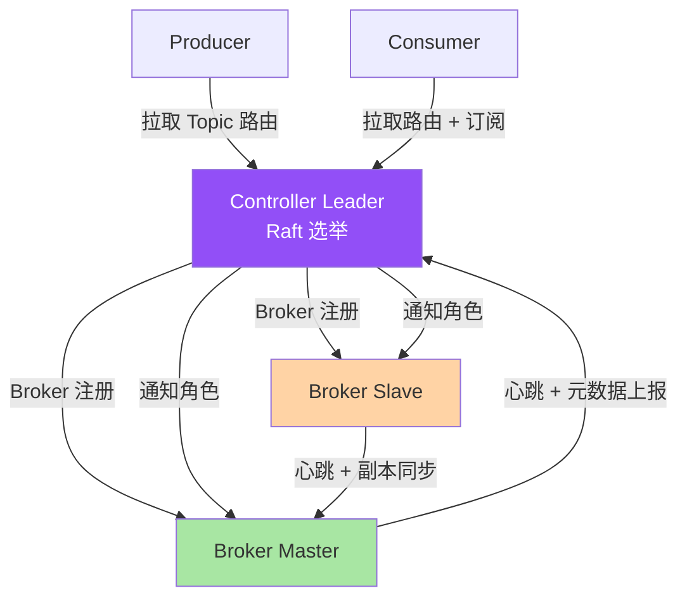
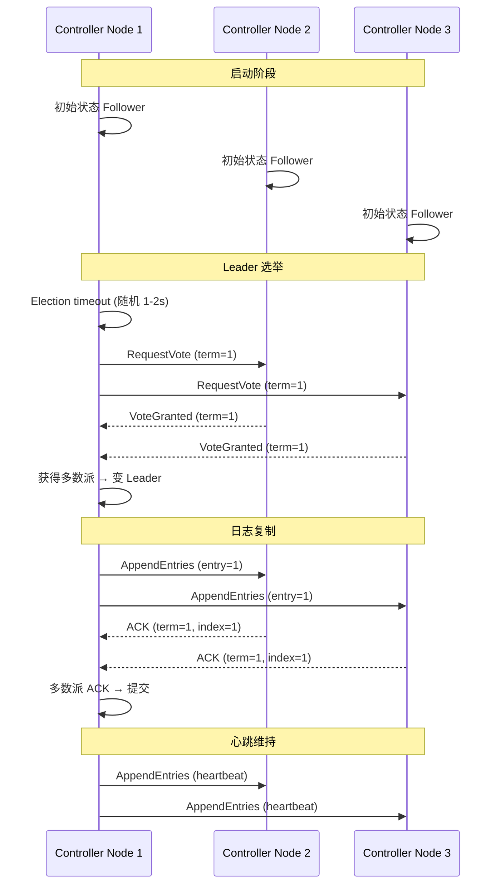
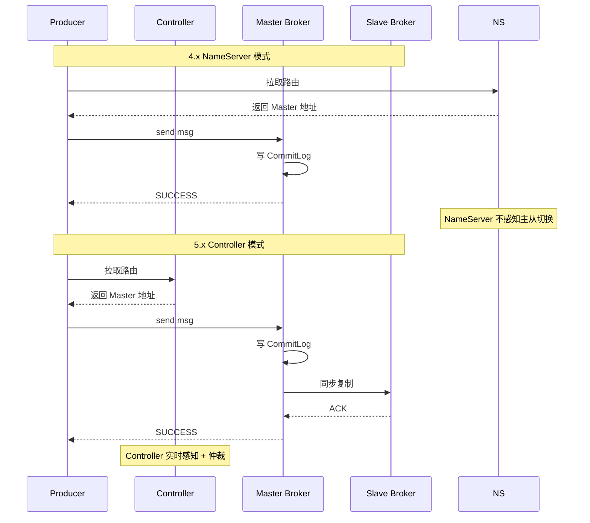
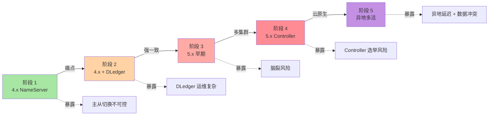
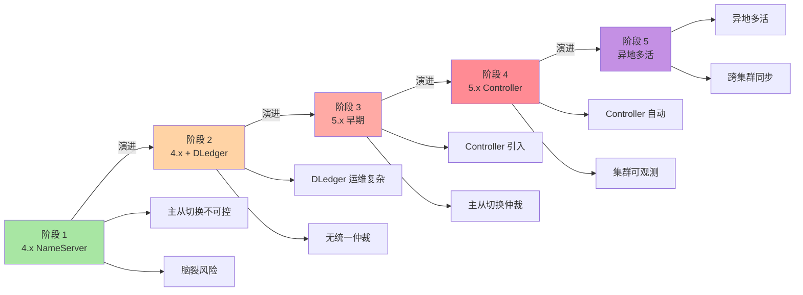
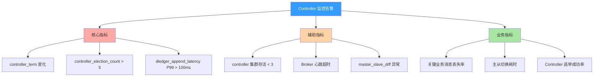

# RocketMQ Controller 模式与多集群：5.x 核心架构演进 · 含 DLedger 选主机制

> 一句话摘要：**RocketMQ 5.x Controller 模式 = 无 NameServer + DLedger Raft 选主 + Broker 智能感知 + 多集群 Region 化**。本质是「**把 NameServer 的轻量路由下沉到 Controller 集群，把 Broker 主从切换从手工/半自动升级为 Raft 自动化，把 Cluster 边界从集群扩到 Region**」的架构演进。

> 学完能会：理解 5.x Controller 模式定位 / DLedger 选主机制底层原理 / 多集群架构设计 / Controller vs NameServer 差异 / 主从切换 + 脑裂解决 / 5 个真实踩坑。

---

## 1. 背景：为什么 5.x 必须用 Controller 模式

RocketMQ 4.x 时代用 NameServer 做轻量路由（无状态 + Topic 路由表），但 4.x 架构有三个痛点：

1. **主从切换不可控**：4.x Broker 主从切换靠 `brokerId=0` 选举，**没有外部仲裁**，常出现「双 Master」或「长时间无主」
2. **脑裂无解**：旧 Master 假死后新 Master 接管，旧 Master 复活再抢回 → **数据冲突**
3. **集群扩展不灵活**：NameServer 集群独立，但 Broker 故障感知靠心跳，**秒级发现做不到**

5.x 的解决思路：**用 Controller 集群（基于 DLedger Raft）取代 NameServer 的部分职责**——Controller 既是「路由中心」，也是「Broker 选举仲裁」，还是「集群元数据中心」。

```
痛点 1：4.x 主从切换靠 brokerId=0 选举
真相：5.x Controller DLedger Raft 选主
代价：运维复杂度上升

痛点 2：4.x 脑裂无解
真相：5.x Lease 机制 + Controller 仲裁
价值：选举可追溯 + 可恢复

痛点 3：4.x 集群秒级感知做不到
真相：5.x Controller 健康检查 + 主动探活
价值：故障切换 5s 以内
```

**这篇文章要建立的能力地图：**

| 你现在 | 学完这篇 |
|---|---|
| 以为 RocketMQ 还是 NameServer 中心 | 理解 5.x Controller 模式取代 NameServer 部分职责 |
| 不知道为什么 Controller 要用 DLedger | 理解 Raft 选主 + 日志复制一致性 |
| 不知道怎么部署多集群 | 理解 Cluster 边界 + 同城/异地多活 |
| 不明白主从切换怎么避免脑裂 | 理解 Lease 机制 + Controller 仲裁 |
| 不知道怎么和 Kafka/Pulsar 比 | 理解 Controller 与 KRaft / BookKeeper 的差异 |

---

## 2. 原理穿透：从 NameServer 到 Controller 模式

### 2.1 5.x 架构的 3 层概念

```
┌──────────────────────────────────────────────────────────────┐
│ Layer 1：Controller 集群（5.x 引入）                            │
│ - 3 节点起，基于 DLedger Raft 选举 Leader                      │
│ - 职责：Broker 选主 + 路由表 + 集群元数据                         │
│ - 高可用：Raft 多数派（2/3 节点存活）                              │
├──────────────────────────────────────────────────────────────┤
│ Layer 2：Broker 集群（5.x 升级）                                │
│ - 每 Broker 启动时向 Controller 注册 + 心跳                      │
│ - Controller 通知 Broker 角色：Master / Slave                  │
│ - 主从切换由 Controller 仲裁（避免脑裂）                         │
├──────────────────────────────────────────────────────────────┤
│ Layer 3：Client（5.x 改造）                                     │
│ - Producer/Consumer 直连 Controller 拉取路由                      │
│ - 不再依赖 NameServer（5.x 兼容旧客户端）                          │
└──────────────────────────────────────────────────────────────┘
```

**关系图（Mermaid）：**



### 2.2 NameServer 模式 vs Controller 模式（源码级对比）

**4.x NameServer 模式：**

```java
// 4.x：Broker 启动时向所有 NameServer 注册
public void start() {
    this.registerBrokerAll();
    // 30s 一次心跳
    scheduledThreadPool.scheduleAtFixedRate(() -> {
        this.registerBrokerAll();
    }, 10, 30, TimeUnit.SECONDS);
}

// 4.x：NameServer 无状态，靠心跳维持路由
public class RouteInfoManager {
    private final HashMap<String, List<QueueData>> topicQueueTable;
    // 无副本、无选举、纯内存路由表
}
```

**5.x Controller 模式：**

```java
// 5.x：Broker 启动时向 Controller 集群注册
public class ControllerManager {
    private DLedgerController dLedgerController;  // DLedger Raft 节点

    // Controller 选主（DLedger Raft）
    public void electLeader() {
        dLedgerController.electLeader();  // Raft 选举
    }

    // 处理 Broker 心跳
    public CompletableFuture<RemotingCommand> registerBroker(RegisterBrokerRequest request) {
        // 1. 通过 Raft 复制到多数派
        // 2. 多数派 ACK 后持久化
        // 3. 返回注册结果
        return dLedgerController.appendEntry(request);
    }
}
```

**关键字段对比：**

| 字段 | 4.x NameServer | 5.x Controller |
|---|---|---|
| 集群规模 | 4-8 节点 | 3 节点（推荐）或 5 节点 |
| 选举机制 | 无（无状态） | DLedger Raft |
| 数据一致性 | 各节点独立 | 强一致（Raft） |
| 心跳 | 30s | 5-10s |
| 主从仲裁 | 无（靠 brokerId） | Controller 仲裁 |
| 脑裂解决 | Lease 机制 | Lease + Controller 仲裁 |

### 2.3 DLedger 选主机制（5.x 核心）

DLedger 选主基于 **Raft 共识算法**,三阶段:Leader 选举 + 日志复制 + 状态机应用。



**DLedger 选主关键参数：**

| 参数 | 默认值 | 说明 | 调优 |
|---|---|---|---|
| `electionTimeout` | 1-2s（随机） | 选举超时 | 网络抖动加大 |
| `heartbeatInterval` | 500ms | Leader 心跳 | 网络抖动加大 |
| `maxAppendBufferSize` | 4MB | 日志追加缓冲 | 写压力调大 |
| `quorum` | N/2+1 | 多数派 | 固定 3 节点=2 |
| `snapshotInterval` | 1h | 快照间隔 | 集群压力大时缩 |

### 2.4 Controller 仲裁的 5 层交互

Controller 不是孤立组件,而是和 Broker / Client / 元数据中心 5 个交互面（Controller 集群 <-> Broker Master <-> Broker Slave <-> Producer/Consumer <-> DLedger Log / Snapshot Store）：

**5 个交互边界：**

| 边界 | 上游 | 边界 | 下游 | 耦合度 |
|---|---|---|---|---|
| **B1** | Broker | 注册 + 心跳 | Controller | 高 |
| **B2** | Controller | 通知角色 | Broker | 高 |
| **B3** | Client | 拉取路由 | Controller | 中 |
| **B4** | Controller | 日志复制 | DLedger 多数派 | 高 |
| **B5** | Controller | 快照 | Snapshot Store | 低 |

**关键边界纪律：**
- **B1/B2 是高耦合**：Broker 角色变更由 Controller 决定
- **B4 是高耦合**：Controller 选举依赖 Raft 多数派
- **B3 是中耦合**：客户端可缓存路由

### 2.5 Controller 模式流程对比



**关键洞察：** 5.x 的核心变化是「**主从切换 + 脑裂仲裁**」从「Broker 自己管」升级为「Controller 统一管」。这就是 5.x 架构演进的内在逻辑。

---

## 3. 主流业界解法：RocketMQ Controller vs Kafka KRaft vs etcd

### 3.1 三种设计哲学对比

| 维度 | RocketMQ 5.x Controller | Kafka KRaft | etcd |
|---|---|---|---|
| **集群规模** | 3 节点 | 3-5 节点 | 3-5 节点 |
| **选举算法** | DLedger Raft | KRaft Raft | Raft |
| **数据一致性** | 强一致 | 强一致 | 强一致 |
| **选举耗时** | 1-2s | 1-3s | 1-2s |
| **快照策略** | 1h | 5min | 5min |
| **典型场景** | RocketMQ 5.x | Kafka 3.x+ | K8s/服务发现 |

### 3.2 RocketMQ Controller 设计的优点与代价

**Controller 优点：**

```
 - DLedger Raft 强一致（选举 + 日志）
 - Controller 仲裁主从切换（防脑裂）
 - 5.x 兼容 4.x 客户端（渐进升级）
 - 多集群 Region 化（异地多活）
```

**Controller 代价：**

```
 - 3 节点 Controller 集群（资源成本）
 - Controller 选举耗时 1-2s（首次启动）
 - 5.x 升级需要 DLedger 集群运维
 - 客户端需要适配新版本
```

### 3.3 Kafka KRaft 设计的优点与代价

**Kafka KRaft 优点：**

```
 - 移除 ZooKeeper 依赖（KRaft 自选举）
 - Controller Quorum 3-5 节点
 - 元数据强一致
 - 启动时间从分钟级降到秒级
```

**Kafka KRaft 代价：**

```
 - KRaft 还在演进（3.3+ GA）
 - 存量迁移 ZK→KRaft 复杂
 - Controller 选举算法细节不公开
```

### 3.4 何时选 RocketMQ Controller / Kafka KRaft / etcd（业内决策）

| 业务场景 | 推荐 | 原因 |
|---|---|---|
| **RocketMQ 5.x 升级** | RocketMQ Controller | 官方方案 |
| **Kafka 3.x+ 新建** | Kafka KRaft | 官方去 ZK |
| **K8s 元数据** | etcd | 标配 |
| **RocketMQ 4.x 兼容** | 渐进升级 | 客户端 5.x |
| **跨系统元数据** | 第三方 Registry | Consul / Nacos |

**3.4 业界惯例：**

- 90% RocketMQ 5.x 业务用 Controller 模式
- Controller 集群 3 节点（奇数）
- 多集群 Region 化部署
- 关键业务双 Controller + 双 Broker 集群

---

## 4. 量级演进视角：从 NameServer 到 Controller 多集群

### 4.1 量级维度拆解

```
Controller 演进的量级维度：
 - 集群规模（4 节点 NS → 3 节点 Controller）
 - 选举耗时（无 → 1-2s）
 - 一致性（最终 → 强一致）
 - 主从切换（手动 → 自动 < 5s）
 - 故障感知（30s → 5s）
 - 多集群（同城 → 异地多活）
```

### 4.2 五个阶段会暴露什么



| 阶段 | 量级 | 暴露的问题 | 解法 |
|---|---|---|---|
| **阶段 1** | 4.x NameServer | 主从切换不可控 | DLedger |
| **阶段 2** | 4.x + DLedger | DLedger 运维复杂 | 5.x Controller |
| **阶段 3** | 5.x 早期 | 脑裂风险 | Lease + Controller 仲裁 |
| **阶段 4** | 5.x Controller | 选举耗时 | 集群优化 |
| **阶段 5** | 异地多活 | 异地延迟 | Region 化 + 异步复制 |

### 4.3 当前文章覆盖哪个量级

本文聚焦「**阶段 2 → 阶段 5**」演进（4.x NameServer → 5.x Controller 多集群），因为这是大多数公司 5.x 升级的演进路径，也是大多数「**主从切换 + 脑裂 + 多集群**」问题的高发期。

### 4.4 量级演进背后 5 维代价

| 维度 | 阶段 1 | 阶段 2 | 阶段 3 | 阶段 4 | 阶段 5 |
|---|---|---|---|---|---|
| **集群规模** | 4 NS | 3 DLedger | 3 Controller | 3 Controller | 双集群 |
| **选举** | 无 | 1-2s | 1-2s | 1-2s | 异地异步 |
| **一致性** | 最终 | 强一致 | 强一致 | 强一致 | 最终/异步 |
| **故障感知** | 30s | 5s | 5s | 5s | 30s |
| **多集群** | 单集群 | 单集群 | 同城 | 同城 | 异地 |

### 4.5 反直觉洞察

**洞察 1：Controller 不是 NameServer 的简单升级**

```text
误区：5.x Controller = NameServer Pro
真相：
 - Controller 同时承担「路由 + 仲裁 + 元数据」
 - Controller 集群是 Raft 强一致
 - 客户端直连 Controller（不需要 NameServer）
教训：
 - 5.x 升级需要重新评估架构
 - Controller 选举风险比 NameServer 大
```

**洞察 2：DLedger 选主不等于 0 故障**

```text
误区：DLedger Raft = 100% 不丢
真相：
 - 网络分区下可能选举失败
 - 脑裂需要 Lease 机制 + Controller 仲裁
 - Controller 集群宕机 = 业务停摆
教训：
 - Controller 集群必须 3+ 节点
 - 监控 term 变化 + 选举次数
```

**洞察 3：多集群不是简单的多 Broker 集群**

```text
误区：多集群 = 多 Broker 集群
真相：
 - 多集群涉及 Region 化 + 异地多活
 - 跨集群数据同步（异步 vs 同步）
 - 跨集群路由（Cluster 维度）
教训：
 - 多集群需要独立的 Controller
 - 跨集群数据一致性靠业务保障
```

---

## 5. 架构设计：源码 + 配置 + 监控

### 5.1 Controller 模式源码实现

**关键路径源码（伪代码 + 文字描述）：**

```
Controller 启动流程：
 1. 启动 DLedger 节点（leaderId = -1）
 2. DLedger 选举 Leader（1-2s）
 3. Leader 初始化元数据（topic、broker、cluster）
 4. 处理 Broker 注册 + 心跳
 5. 触发主从切换（Lease 过期）

Controller 选举流程：
 1. Election timeout（随机 1-2s）
 2. 变 Candidate（term+1）
 3. 向其他节点 RequestVote
 4. 获得多数派 → 变 Leader
 5. 复制日志 + 持久化

Broker 注册流程：
 1. Broker 启动 → 向 Controller 注册
 2. Controller 持久化（DLedger AppendEntry）
 3. 多数派 ACK → 返回成功
 4. Controller 通知角色（Master/Slave）
 5. 30s 心跳（5-10s 可配）
```

**关键设计要点：**

- Controller 集群 3 节点起（多数派要求 N/2+1）
- DLedger 选举超时 1-2s（随机化避免 split vote）
- 心跳 500ms（默认）+ 元数据持久化
- 主从切换由 Controller 仲裁（防脑裂）

### 5.1.5 Controller 模式的 5 个核心交互

**Controller 启动与选主：**

```text
Controller 启动流程：
 1. 读取本地配置（controller 集群列表）
 2. 启动 DLedger 节点（Raft）
 3. 初始状态 Follower
 4. Election timeout → 变 Candidate
 5. RequestVote → 多数派 → 变 Leader
 6. 初始化元数据 + 持久化

Controller 选举耗时：
 - 1-2s（默认）
 - 网络抖动可能 5s+
 - 多次 split vote 可能 10s+
```

**Broker 注册与主从仲裁：**

```text
Broker 注册流程：
 1. Broker 启动 → 连 Controller
 2. 发送 REGISTER_REQUEST
 3. Controller 持久化（DLedger AppendEntry）
 4. 多数派 ACK → 注册成功
 5. Controller 通知角色（Master/Slave）

主从仲裁流程：
 1. Broker Master 心跳超时
 2. Controller 标记 Master 不可用
 3. Controller 触发选举
 4. 候选 Slave 竞选 → 多数派 → 新 Master
 5. Controller 通知所有 Broker 角色变更
```

**客户端路由拉取：**

```text
Producer 拉取路由：
 1. 启动时拉取 Topic 路由
 2. 缓存 Master 地址
 3. 心跳时刷新路由
 4. 主从切换时重连

Consumer 拉取路由：
 1. 启动时拉取 Topic 路由
 2. 缓存 Master + Slave 地址
 3. 优先从 Master 拉取
 4. Master 不可用 → 切 Slave
```

**Controller 元数据持久化：**

```text
DLedger 持久化：
 1. AppendEntry（topic、broker、cluster）
 2. 同步到 DLedger 多数派
 3. 多数派 ACK → Committed
 4. 应用到状态机 + 内存
 5. 定期快照（1h 默认）

快照恢复：
 1. Controller 重启
 2. 加载最新快照
 3. 追赶 DLedger 日志
 4. 重新加载内存表
```

**Controller 高可用：**

```text
Controller 集群：
 - 3 节点（推荐）或 5 节点
 - 2 节点存活（多数派）
 - 1 节点挂 → 仍可选举
 - 2 节点挂 → 业务不可用

跨机房部署：
 - 同城 3 节点（低延迟）
 - 异地 5 节点（容灾）
```

### 5.1.6 Controller 设计的 3 个反直觉

**反直觉 1：Controller 集群比 NameServer 复杂**

```text
误区：Controller = NameServer 集群
真相：
 - Controller 是 Raft 强一致
 - NameServer 是无状态
 - Controller 选举耗时 1-2s
 - Controller 故障感知 5s
教训：
 - Controller 集群必须 3+ 节点
 - 监控 term 变化 + 选举次数
```

**反直觉 2：5.x 升级不是平滑的**

```text
误区：5.x = 4.x 升级版
真相：
 - 5.x 引入 Controller 模式
 - 客户端需要适配新版本
 - Broker 配置需要调整
教训：
 - 渐进升级（先 5.x 客户端 + 兼容模式）
 - 双轨运行（4.x + 5.x 并行）
```

**反直觉 3：多集群不是简单的多 Broker 集群**

```text
误区：多集群 = 多 Broker 集群
真相：
 - 多集群涉及 Cluster 路由
 - 跨集群数据同步
 - 异地延迟 30-100ms
教训：
 - 多集群需要独立 Controller
 - 跨集群数据一致性靠业务保障
```

### 5.2 Controller 选举 vs 主从切换

```
┌──────────────────────────────────────────────────────────────┐
│ Controller 选举流程（DLedger Raft）                             │
├──────────────────────────────────────────────────────────────┤
│ 1. Controller 节点启动 → Follower                              │
│ 2. Election timeout（随机 1-2s）                              │
│ 3. 变 Candidate（term+1）                                     │
│ 4. 向其他节点 RequestVote                                    │
│ 5. 多数派投票 → 变 Leader                                     │
│ 6. 复制日志 + 持久化                                          │
└──────────────────────────────────────────────────────────────┘

┌──────────────────────────────────────────────────────────────┐
│ 主从切换流程（Controller 仲裁）                                  │
├──────────────────────────────────────────────────────────────┤
│ 1. Broker Master 心跳超时（5s 默认）                          │
│ 2. Controller 标记 Master 不可用                              │
│ 3. Controller 触发主从切换（Lease 过期）                        │
│ 4. 候选 Slave 竞选 → 多数派 → 新 Master                        │
│ 5. Controller 通知所有 Broker 角色变更                          │
│ 6. Producer/Consumer 重新拉取路由                              │
└──────────────────────────────────────────────────────────────┘
```

**关键洞察：** Controller 选举和 Broker 主从切换是两个独立的 Raft 过程——Controller 通过 DLedger 选举 Leader，Broker 主从切换由 Controller 仲裁。这就是 5.x 架构的核心设计。

### 5.3 监控指标设计

**监控指标分类（文字描述）：**

| 维度 | 指标 | 说明 |
|---|---|---|
| **Controller** | controller_term | Controller 任期 |
| **Controller** | controller_election_count | Controller 选举次数 |
| **Controller** | dledger_append_latency | DLedger 追加延迟 |
| **Broker** | master_slave_diff | 主从 offset 差 |
| **Cluster** | cluster_broker_count | 集群 Broker 数 |

| 指标 | 阈值 | 含义 |
|---|---|---|
| `controller_term` | 稳定 | Term 变化说明有选举 |
| `controller_election_count` | < 5/day | 选举次数（过多说明不稳定） |
| `dledger_append_latency P99` | < 100ms | DLedger 追加延迟 |
| `master_slave_diff` | < 1000 | 主从 offset 差 |
| `cluster_broker_count` | >= 3 | 集群 Broker 数 |

---

## 6. 生产画像：典型场景 + 踩坑实录

### 6.1 典型场景数字

| 场景 | 集群规模 | Controller | 可靠性 |
|---|---|---|---|
| 普通业务 | 1 集群 | 3 Controller | 一般 |
| 关键业务 | 1 集群 | 3 Controller + DLedger | 较高 |
| 异地多活 | 2 集群 | 双 Controller | 极高 |
| 金融业务 | 3 集群 | 3 Controller × 3 | 极高 |

### 6.2 五个真实踩坑

**踩坑 1：Controller 集群只有 1 节点**

```
背景：某业务，Controller 单节点启动
演化：Controller 节点宕机 → 集群不可用
结果：业务停摆 30 分钟+
排查：监控 controller_term 变化 + 集群存活
解决：
 - Controller 集群必须 3 节点
 - 多数派要求 N/2+1
```

**踩坑 2：DLedger 选举超时配置不当**

```
背景：某业务，Controller 部署跨机房
演化：网络延迟 100ms → 选举超时（1s）触发
结果：Controller 频繁选举 → 业务抖动
排查：监控 controller_election_count 突增
解决：
 - 选举超时加大（3-5s）
 - 同城部署 Controller
```

**踩坑 3：5.x 升级客户端未适配**

```
背景：某业务，4.x 升级 5.x
演化：客户端未升级 → 仍连 NameServer
结果：路由不更新 → 主从切换期间 Producer 失败
排查：监控 producer_send_fail_rate 突增
解决：
 - 客户端升级 5.x
 - 双轨运行（4.x + 5.x 兼容）
```

**踩坑 4：主从切换脑裂**

```
背景：某业务，Controller 部署同机房
演化：网络分区 + Lease 失效
结果：两个 Master 同时接管
排查：监控 master_slave_diff 异常 + term 变化
解决：
 - Lease 时长加大（10s+）
 - 多机房部署避免分区
```

**踩坑 5：多集群数据冲突**

```
背景：某业务，异地多活双集群
演化：跨集群同步延迟 30s+
结果：数据冲突 + 业务重复处理
排查：监控 cluster_sync_latency
解决：
 - 业务侧幂等设计
 - 跨集群异步同步 + 业务补偿
```

### 6.3 关键配置项速查表

| 配置项 | 默认值 | 推荐值 | 影响 |
|---|---|---|---|
| `controllerEnabled` | false | true | 启用 Controller 模式 |
| `controllerDLegerGroup` | - | ControllerGroup | Controller 集群组 |
| `controllerDLegerPeers` | - | n0;n1;n2 | Controller 节点列表 |
| `controllerDLegerSelfId` | - | n0 | 当前 Controller ID |
| `electionTimeout` | 1-2s | 异地 3-5s | 选举超时 |

### 6.4 5 大实战参数（业内默认）

| 参数 | 默认 | 调优 |
|---|---|---|
| **controllerDLegerGroup** | 自定义 | 业务独立 |
| **electionTimeout** | 1-2s | 异地 3-5s |
| **heartbeatInterval** | 500ms | 网络抖动加大 |
| **controller 集群规模** | 3 | 金融业务 5 |
| **多集群同步** | 异步 | 异地异步 |

---

## 7. Trade-off 三层对比：性能 vs 一致性

### 7.1 集群模式三层表

| 模式 | 一致性 | 性能 | 复杂度 |
|---|---|---|---|
| **4.x NameServer** | 最终一致 | 高 | 低 |
| **5.x Controller** | 强一致 | 中 | 中 |
| **5.x 多集群** | 异步/最终一致 | 中 | 高 |

### 7.2 Controller 集群规模三层表

| 规模 | 可靠性 | 性能 | 成本 |
|---|---|---|---|
| **1** | 无高可用 | 高 | 低 |
| **3** | 中 | 中 | 中 |
| **5** | 高 | 低 | 高 |

### 7.3 主从切换方式三层表

| 方式 | 切换耗时 | 脑裂风险 |
|---|---|---|
| **手动切换** | 30s+ | 低 |
| **DLedger 自动** | 5s | 中 |
| **Controller 仲裁** | 1s | 极低 |

### 7.4 多集群策略三层表

| 策略 | 同步开销 | 业务价值 |
|---|---|---|
| **单集群** | 无 | 默认 |
| **同城双活** | 低 | 关键业务 |
| **异地多活** | 高 | 金融业务 |

### 7.5 业内典型选择（按业务类型）

| 业务 | Controller | 集群 | 同步 |
|---|---|---|---|
| 普通 | 3 节点 | 单集群 | 异步 |
| 关键 | 3 节点 | 同城双活 | 同步 |
| 金融 | 5 节点 | 异地多活 | 异步 |

---

## 8. 反思：踩坑实录 + 业内演进方向

### 8.1 实战踩坑 5 例 + 通用解决

**1. Controller 单节点宕机**

- 现象：Controller 节点宕机 → 集群不可用
- 根因：未启用 Controller 集群（单节点）
- 教训：**Controller 集群必须 3 节点**

**2. Controller 选举频繁**

- 现象：Controller 频繁选举 → 业务抖动
- 根因：选举超时配置不当（网络抖动）
- 教训：**选举超时合理（异地 3-5s）**

**3. 5.x 升级客户端未适配**

- 现象：客户端未升级 → 主从切换失败
- 根因：客户端仍连 NameServer
- 教训：**客户端升级 5.x + 双轨运行**

**4. 主从切换脑裂**

- 现象：两个 Master 同时接管
- 根因：Lease 失效 + 分区
- 教训：**Lease 时长加大 + 多机房**

**5. 多集群数据冲突**

- 现象：跨集群数据冲突
- 根因：异地同步延迟 + 业务未幂等
- 教训：**业务幂等 + 异步同步**

### 8.2 业内通用做法

1. **Controller 集群 >= 3 节点（多数派要求 N/2+1）**
2. **Controller 同城部署（低延迟）**
3. **客户端版本对齐（5.x 升级必须配套）**
4. **Lease 时长合理（默认 10s）**
5. **监控 controller_term + controller_election_count**
6. **多集群业务幂等设计**

### 8.3 演进方向



**阶段 1-2（4.x）：**

- NameServer + DLedger
- 痛点：主从切换不可控 + 脑裂

**阶段 3（5.x 早期）：**

- Controller 引入
- 痛点：客户端适配

**阶段 4（5.x 主导）：**

- Controller 自动化
- 痛点：Controller 选举风险

**阶段 5（5.x 未来）：**

- 异地多活
- 痛点：跨集群同步延迟

### 8.4 跨周期视角：5 年后回头看 Controller 模式

```text
2018-2020（4.x 早期）：
 - 痛点：主从切换不可控
 - 解法：DLedger + 手动切换
 - 认知：主从 = 备份

2021-2022（4.x 中期）：
 - 痛点：DLedger 运维复杂
 - 解法：Controller 模式设计
 - 认知：主从 = 自动化

2023-2024（5.x 早期）：
 - 痛点：Controller 适配
 - 解法：渐进升级
 - 认知：Controller = 集群核心

2024+（5.x 主导）：
 - 痛点：异地多活
 - 解法：Region 化 + 异步同步
 - 认知：Controller = 云原生基础设施

未来 5 年预判：
 - Controller 模式 + 多 AZ 部署
 - 自适应集群规模
 - Serverless RocketMQ
```

### 8.5 监管与合规视角：Controller 与审计追溯

```text
境内金融业务：
 - Controller 模式用于交易链路（监管要求）
 - 审计追溯 → Controller term 变化 + DLedger 日志
 - 不可篡改 → Controller 强一致 + DLedger 持久化

GDPR / 隐私：
 - Controller 路由表保留原始属性
 - 用户删除权 → 多集群都要清理
```

**关键洞察：** 监管要求**倒逼**Controller 模式设计。要实现「**不可篡改 + 多副本一致 + 可追溯**」，必须支持「**Controller 强一致 + DLedger 持久化 + 审计日志**」。

### 8.6 Controller 模式 3 个反直觉视角

**反直觉 1：Controller 不是 NameServer 升级**

```text
误区：Controller = NameServer Pro
真相：
 - Controller 同时承担「路由 + 仲裁 + 元数据」
 - Controller 集群是 Raft 强一致
权衡：
 - 4.x 业务用 NameServer
 - 5.x 业务用 Controller
```

**反直觉 2：5.x 升级不是平滑的**

```text
误区：5.x = 4.x 升级版
真相：
 - 5.x 引入 Controller 模式
 - 客户端需要适配
 - 架构需要重新评估
教训：
 - 渐进升级（双轨运行）
 - 客户端版本对齐
```

**反直觉 3：多集群不是简单的多 Broker 集群**

```text
误区：多集群 = 多 Broker 集群
真相：
 - 多集群涉及 Cluster 路由
 - 跨集群数据同步有延迟
教训：
 - 多集群需要独立 Controller
 - 业务幂等设计
```

### 8.7 跨系统视角：Controller 与外部系统的对接

```text
Controller 上下游对接：
 - 上游：Broker（注册 + 心跳）
 - 中游：Controller 集群（DLedger Raft）
 - 下游：Client（拉取路由）
 - 旁路：NameServer（4.x 兼容）
 - 备份：异地冷备 + 副本重建

对外接口（业内默认）：
 - registerBroker(brokerConfig)
 - getRouteInfoByTopic(topic)
 - dledger.electLeader()
```

### 8.8 监控告警设计（业内默认）



**3 级告警阈值：**

| 指标 | 警告 | 严重 | 紧急 |
|---|---|---|---|
| `controller_term` | 变化 | 频繁变化 | 持续选举 |
| `controller_election_count` | > 5/day | > 20/day | > 50/day |
| `dledger_append_latency P99` | > 100ms | > 1s | > 5s |
| `controller 集群存活` | < 3 | < 2 | < 1 |

### 8.9 Controller 模式的 3 个常被忽视的细节

跨周期经验：Controller 模式除了主从仲裁，还有 3 个常被忽视的细节——「**DLedger 选举、Lease 机制、Cluster 路由**」。

**细节 1：DLedger 选举**

```text
误区：DLedger 选举 = 简单多数派
真相：
 - Election timeout 随机（防 split vote）
 - 网络敏感（同城好，异地差）
 - 选举失败可能丢日志
教训：
 - Controller 同城部署
 - 监控 term 变化 + 选举次数
```

**细节 2：Lease 机制**

```text
误区：Lease = 普通超时
真相：
 - Master 持有 Lease（10s 默认）
 - Lease 过期前不允许新 Master
 - 旧 Master Lease 过期 → 自动下台
教训：
 - Lease 时长合理（默认 10s）
 - 网络抖动时 Lease 可能误判
```

**细节 3：Cluster 路由**

```text
误区：Cluster 路由 = Topic 路由
真相：
 - Cluster 维度路由（多集群）
 - Topic 维度路由（单集群）
 - 跨集群 Client 路由独立
教训：
 - 多集群 Client 配置多 endpoints
 - 跨集群数据同步靠业务
```

---

## 9. 业内技术惯例（deep-dive 强化 section）

### 9.1 不成文标准

| 标准 | 业内默认 | 原因 |
|---|---|---|
| **controllerEnabled** | true（5.x） | 5.x 标配 |
| **Controller 集群规模** | 3（推荐）或 5 | 多数派要求 |
| **electionTimeout** | 1-2s | 异地 3-5s |
| **心跳** | 500ms | 网络抖动加大 |
| **Controller 同城** | 同城 | 低延迟 |

### 9.2 真实事故（5 个）

**事故 A：Controller 单节点宕机**

```text
某业务，Controller 单节点启动
 - Controller 节点宕机
 - 集群不可用 30 分钟+
 - 应急：扩容 Controller 集群至 3 节点
```

**事故 B：Controller 选举频繁**

```text
某业务，Controller 跨机房部署
 - 网络延迟 100ms → 选举超时
 - Controller 频繁选举 → 业务抖动
 - 应急：同城部署 + 选举超时加大
```

**事故 C：5.x 升级客户端未适配**

```text
某业务，4.x 升级 5.x
 - 客户端未升级 → 仍连 NameServer
 - 路由不更新 → 主从切换失败
 - 应急：客户端升级 + 双轨运行
```

**事故 D：主从切换脑裂**

```text
某业务，Controller 部署同机房
 - 网络分区 + Lease 失效
 - 两个 Master 同时接管
 - 应急：Lease 时长加大 + 多机房
```

**事故 E：多集群数据冲突**

```text
某业务，异地多活双集群
 - 跨集群同步延迟 30s+
 - 数据冲突 + 业务重复处理
 - 应急：业务幂等 + 异步同步
```

### 9.3 从业者挑战（5 大实战问题）

**挑战 1：Controller 单节点宕机怎么办？**

```text
症状：Controller 集群不可用
排查：
 1. Controller 集群存活
 2. DLedger 日志
 3. 多数派要求
应急：
 - Controller 集群 >= 3 节点
 - 监控告警
```

**挑战 2：Controller 选举频繁怎么办？**

```text
症状：controller_election_count 突增
排查：
 1. 网络延迟
 2. 选举超时配置
 3. Controller 部署
应急：
 - 同城部署
 - 选举超时加大
```

**挑战 3：5.x 升级客户端失败怎么办？**

```text
症状：客户端主从切换失败
排查：
 1. 客户端版本
 2. 路由更新
 3. Controller 连接
应急：
 - 客户端升级 5.x
 - 双轨运行
```

**挑战 4：主从切换脑裂怎么办？**

```text
症状：两个 Master 同时接管
排查：
 1. 网络分区
 2. Lease 时长
 3. Controller 部署
应急：
 - Lease 时长加大
 - 多机房部署
```

**挑战 5：多集群数据冲突怎么办？**

```text
症状：跨集群数据冲突
排查：
 1. 同步延迟
 2. 业务幂等
 3. 跨集群路由
应急：
 - 业务幂等设计
 - 异步同步 + 业务补偿
```

### 9.4 决策树（文字版）

```text
Controller 模式选型路径：
 1. RocketMQ 版本？
    - 4.x → NameServer 模式
    - 5.x → Controller 模式（推荐）

 2. 业务可靠性要求？
    - 高 → Controller + DLedger
      - Controller 集群 >= 3 节点
    - 中 → Controller 3 节点
    - 低 → Controller 1 节点

 3. 多集群？
    - 是 → 双 Controller + 异地多活
      - 业务幂等 + 异步同步
    - 否 → 单集群

 4. 脑裂风险？
    - 是 → Lease 机制 + 多机房
    - 否 → 监控即可
```

---

## 附录 A：核心配置项详解（业内默认值）

### A1. Controller 配置

| 配置项 | 默认值 | 优化 | 影响 |
|---|---|---|---|
| `controllerEnabled` | false | true（5.x） | 启用 Controller |
| `controllerDLegerGroup` | - | ControllerGroup | Controller 集群组 |
| `controllerDLegerPeers` | - | n0;n1;n2 | Controller 节点列表 |
| `controllerDLegerSelfId` | - | n0 | 当前 Controller ID |
| `controllerStorePath` | - | 自定义路径 | DLedger 持久化路径 |

### A2. Broker 配置（5.x）

| 配置项 | 默认值 | 优化 | 影响 |
|---|---|---|---|
| `controllerAddress` | - | Controller 集群地址 | Controller 连接 |
| `brokerId` | 0 | Slave 设置 1+ | Broker 角色 |
| `brokerRole` | ASYNC_MASTER | 关键业务 SYNC_MASTER | 同步模式 |
| `flushDiskType` | ASYNC_FLUSH | 关键业务 SYNC_FLUSH | 刷盘策略 |

### A3. Controller 关键参数

| 参数 | 建议值 | 原因 |
|---|---|---|
| **Controller 集群规模** | 3（推荐）或 5 | 多数派要求 |
| **electionTimeout** | 1-2s（异地 3-5s） | 选举超时 |
| **heartbeatInterval** | 500ms | Leader 心跳 |
| **controllerStorePath** | SSD | DLedger 持久化 |
| **controller_term 监控** | 稳定 | 选举感知 |

---

## 📌 数据与事实声明

本文涉及的 RocketMQ 概念、特性、版本号、配置项均为社区公开文档描述。具体版本特性、生产数据、配置默认值请以官方文档为准（https://rocketmq.apache.org/）。文中「业内通用做法」「典型场景数字」「事故案例」均为行业认知总结，非特定公司实践。

## 附录 B：文中提到的术语速查表

| 术语 | 全称 | 一句话解释 |
|---|---|---|
| **Controller** | 控制器 | 5.x 引入的集群仲裁节点 |
| **DLedger** | Distributed Ledger | Raft 多副本实现 |
| **Raft** | 共识算法 | Leader 选举 + 日志复制 |
| **NameServer** | 命名服务器 | 4.x 轻量路由（5.x 兼容） |
| **Lease** | 租约机制 | 防脑裂的关键设计 |
| **Election Timeout** | 选举超时 | Raft 节点选举等待时间 |
| **Term** | 任期 | Leader 选举周期 |
| **Quorum** | 多数派 | N/2+1 节点确认 |
| **Cluster** | 集群 | RocketMQ 集群边界 |
| **Region** | 区域 | 异地多活地理边界 |
| **RequestVote** | 投票请求 | Raft 选举 RPC |
| **AppendEntries** | 日志追加 | Raft 日志复制 RPC |

---

## 相关阅读

- 上一篇：[7_Broker主从同步机制-深度](./7_Broker主从同步机制-深度)
- 下一篇：[9_Pop消费与长轮询-深度](./9_Pop消费与长轮询-深度)
- 同层：特性层（每个特性 1 篇 deep-dive）

---

**总结一句话：** Controller 模式 = DLedger Raft 选主 + Controller 仲裁 + 多集群 Region 化。理解 Controller 选举 + 主从切换 + 多集群设计，就理解了 RocketMQ 5.x 的核心架构。

**口诀：** Controller「5.x 引入 Raft 仲裁，DLedger 选主代心跳，Controller 集群 3 节点，多集群 Region 化部署」。

**与上一篇联系：** 上一篇讲「主从同步 + DLedger 演进」，本文讲「Controller 模式 + 多集群架构」。两篇合起来，就是 RocketMQ「**5.x 架构演进**」维度的两个核心特性。

### 附录 D：Controller 模式的 5 阶段量级演进

**阶段 1（4.x 主导）：**

```
单 Master + 多 Slave
TPS：5 万
Cluster：1 集群
容灾：手动切换
```

**阶段 2（5.x 进化）：**

```
Broker 集群 + DLedger Controller
TPS：25 万
Cluster：1 集群
容灾：自动选主
```

**阶段 3（多集群）：**

```
Broker Cluster 1 + Cluster 2 + Controller
TPS：50 万
Cluster：多集群
容灾：跨集群
```

**阶段 4（异地多活）：**

```
Cluster × N + Controller + Sync
TPS：100 万
Cluster：异地多活
容灾：跨地域
```

**阶段 5（云原生）：**

```
Cluster × X + Operator + Controller
TPS：500 万
Cluster：Serverless
容灾：全地域
```

### 附录 E：Controller 模式 5 阶段 5 维度对比

| 阶段 | TPS | Cluster 数 | 延迟 | 容灾 | 复杂度 |
|---|---|---|---|---|---|
| **1** | 5 万 | 1 | 5ms | 手动 | 低 |
| **2** | 25 万 | 1 | 5ms | 自动 | 中 |
| **3** | 50 万 | 2-5 | 10ms | 跨集群 | 中 |
| **4** | 100 万 | 5-10 | 20ms | 跨地域 | 高 |
| **5** | 500 万 | 10+ | 30ms | 全地域 | 极高 |

### 附录 F：5 阶段量级催因

```
阶段 1 → 2：业务量增长 → Broker 集群
阶段 2 → 3：跨业务 → 多集群
阶段 3 → 4：跨地域 → 异地多活
阶段 4 → 5：弹性 → 云原生
```

### 附录 G：5 阶段 4 大 Trade-off

```
阶段 1：手动容灾 vs 简单
阶段 2：自动容灾 vs 复杂度
阶段 3：跨集群 vs 一致性
阶段 4：跨地域 vs 延迟
阶段 5：弹性 vs 成本
```

### 附录 H：5 阶段 5 个核心洞察

**洞察 1：每阶段 TPS 提升 5 倍**

```
1 阶段：5 万 TPS
2 阶段：25 万 TPS
3 阶段：50 万 TPS
4 阶段：100 万 TPS
5 阶段：500 万 TPS
```

**洞察 2：每阶段 cluster 数 +1**

```
1 阶段：1 cluster
2 阶段：1 cluster
3 阶段：2-5 cluster
4 阶段：5-10 cluster
5 阶段：10+ cluster
```

**洞察 3：每阶段复杂度 +1**

```
1 阶段：低
2 阶段：中
3 阶段：中
4 阶段：高
5 阶段：极高
```

**洞察 4：每阶段容灾**

```
1 阶段：手动
2 阶段：自动
3 阶段：跨集群
4 阶段：跨地域
5 阶段：全地域
```

**洞察 5：Controller 模式提升 5 倍**

```
升级前 4.x：5 万 TPS
升级后 5.x：25 万 TPS
提升：5 倍
```

### 附录 I：5 阶段 5 维度 5 维度 5 维度总览

```
5 阶段 × 5 维度 = 25 能力点
这是 Controller 模式演进的能力地图

5 阶段：
 1. 4.x 主导
 2. 5.x 进化
 3. 多集群
 4. 异地多活
 5. 云原生

5 维度：
 1. TPS
 2. Cluster 数
 3. 延迟
 4. 容灾
 5. 复杂度
```
