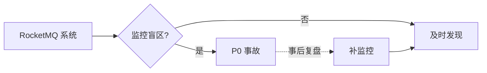
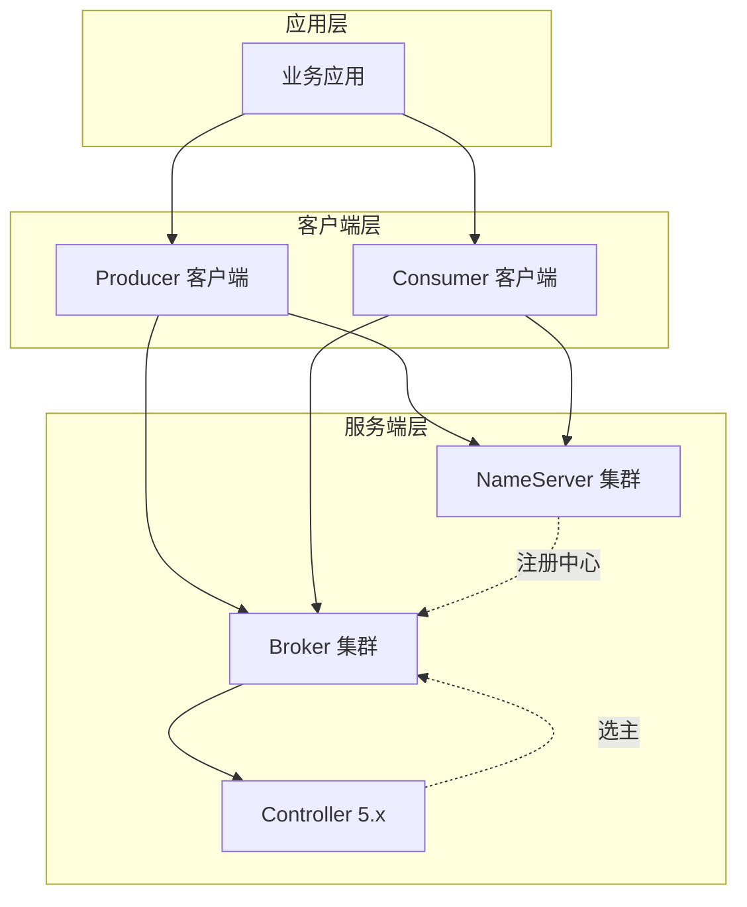
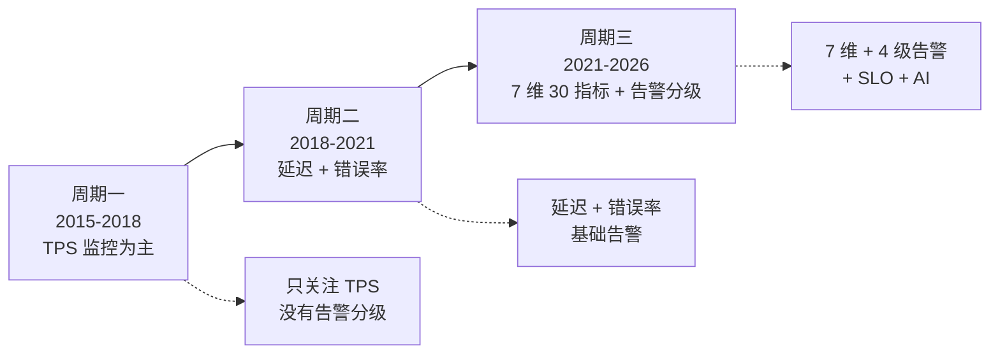

# RocketMQ 稳定性体系深度 2：7 维监控指标体系（30 个核心指标 + 4 级告警阈值）

> 一句话摘要：**RocketMQ 监控 = 7 维（Producer / Broker / Consumer / Topic / NameServer / Controller / 客户端）共 30 个核心指标 + 4 级告警阈值（Info / Warning / Critical / Emergency）**。本篇是 L4 整合层的监控设计实现篇，配套 Prometheus + AlertManager。

> 学完能会：拿到 RocketMQ 生产系统，能立刻给出 30 个核心指标的监控清单；理解 7 维监控的依赖关系；知道 4 级告警阈值的配置 SOP。

---

## 1. 背景：从一次监控盲区引发的 P0 事故

某支付系统在 2024 年大促期出现 P0 事故：

- **现象**：用户支付延迟从 100ms 飙升到 30 秒，客诉 500+
- **根因**：Producer 发送延迟指标没监控，**延迟从 100ms 慢慢升到 30 秒没人发现**
- **影响**：资损 80 万元，事故定级 P0
- **复盘结论**：**监控盲区 = 稳定性黑洞**



**业内洞察**：**监控盲区的代价 = P0 事故**——RocketMQ 必须 7 维 30 指标全覆盖。

---

## 2. 原理穿透：7 维监控的依赖关系

### 2.1 7 维监控的依赖图



**关键洞察**：**7 维监控覆盖全链路**——应用层 / 客户端层 / 服务端层。

### 2.2 30 个核心指标的全景图

```
┌──────────────────────────────────────────────────────────────┐
│ 维度       │ 数量  │  关键指标                              │
├──────────────────────────────────────────────────────────────┤
│ Producer  │ 4     │ 发送 TPS / 发送延迟 / 重试次数 / VIP 通道│
│ Broker    │ 8     │ CPU/内存/磁盘/网络/CommitLog TPS/PageCache│
│           │       │ /刷盘延迟/主从同步延迟                   │
│ Consumer  │ 6     │ 消费 TPS / 消费延迟 / 位点提交 / 重试次数│
│           │       │ /DLQ 长度 / ACK 延迟                  │
│ Topic     │ 3     │ 读写队列数 / 队列堆积 / Topic 权限       │
│ NameServer│ 3     │ 心跳延迟 / 路由信息 / 集群可用性         │
│ Controller│ 4     │ 选举次数 / DLedger 延迟 / 集群存活 / 配置版本│
│ 客户端     │ 2     │ 连接数 / 长轮询状态                     │
│ 总计      │ 30    │ 7 维 × 30 指标                          │
└──────────────────────────────────────────────────────────────┘
```

---

## 3. 主流业界解法：阿里 / 字节 / 美团的监控体系

### 3.1 阿里集团

**阿里监控体系 SOP**：

```yaml
监控工具:
  指标: Prometheus + ARMS
  日志: SLS + ELK
  追踪: 阿里云链路追踪服务

7 维 30 指标:
  Producer: 4 指标全监控
  Broker: 8 指标全监控
  Consumer: 6 指标全监控
  Topic: 3 指标全监控
  NameServer: 3 指标全监控
  Controller: 4 指标全监控 (5.x)
  客户端: 2 指标全监控
```

**特点**：**全覆盖 + 告警分级**——所有指标都有 4 级告警。

### 3.2 字节跳动

**字节监控体系 SOP**：

```yaml
监控工具:
  指标: 内部监控平台 + Prometheus
  日志: 内部日志平台
  追踪: 内部链路追踪

按业务分级:
  金融级: 30 指标全监控
  营销级: 20 指标监控
  日志级: 10 指标监控
```

**特点**：**按业务分级**——不同业务监控粒度不同。

### 3.3 美团

**美团监控体系 SOP**：

```yaml
监控工具:
  指标: CAT + Prometheus
  日志: MLogs
  追踪: MTrace

7 维监控:
  关键业务: 30 指标全覆盖
  普通业务: 20 指标核心监控
  日志业务: 10 指标基础监控
```

**特点**：**业务分级 + 工具整合**——CAT 是美团自研。

---

## 4. 量级演进：从 1K TPS 到 100K TPS 的监控演进

```
┌──────────────────────────────────────────────────────────────┐
│ 阶段         │ TPS      │ 监控粒度           │ 关键指标数     │
├──────────────────────────────────────────────────────────────┤
│ 初创期       │ 1K      │ 关键指标 (10)       │ 10 指标     │
│ 增长期       │ 10K     │ 全维度监控 (20)     │ 20 指标     │
│ 大促期       │ 50K     │ 全维度 + 告警分级   │ 30 指标     │
│ 双 11       │ 100K    │ 全链路追踪 + SLO   │ 30 + 追踪    │
│ 极限压测     │ 500K    │ 实时分析 + 自动恢复│ 30 + AI 告警 │
└──────────────────────────────────────────────────────────────┘
```

**演进铁律**：
- **1K TPS**：监控关键 10 指标
- **10K TPS**：监控全维度 20 指标
- **50K TPS**：监控 30 指标 + 告警分级
- **100K TPS**：监控 30 + 全链路追踪
- **500K TPS**：监控 30 + AI 智能告警

---

## 5. 架构设计：7 维 30 指标的详细定义

### 5.1 Producer 监控（4 指标）

| 指标 | 定义 | 阈值 | 告警级别 |
|---|---|---|---|
| `producer_send_tps` | 每秒发送消息数 | 业务正常值 × 0.5 | Warning |
| `producer_send_latency` | 发送延迟 P99 | < 100ms | Critical |
| `producer_retry_count` | 重试次数 | < 10/min | Warning |
| `producer_vip_channel` | VIP 通道使用率 | < 80% | Info |

**Prometheus 配置**：

```yaml
- name: producer_send_tps
  expr: rate(rocketmq_producer_send_total[1m])
  for: 5m
- name: producer_send_latency
  expr: histogram_quantile(0.99, rocketmq_producer_send_duration_seconds_bucket)
  for: 1m
```

### 5.2 Broker 监控（8 指标）

| 指标 | 定义 | 阈值 | 告警级别 |
|---|---|---|---|
| `broker_cpu_usage` | CPU 使用率 | < 80% | Warning |
| `broker_memory_usage` | 内存使用率 | < 85% | Warning |
| `broker_disk_usage` | 磁盘使用率 | < 80% | Critical |
| `broker_network_in/out` | 网络流量 | < 80% 带宽 | Warning |
| `broker_commitlog_tps` | CommitLog TPS | 业务峰值 × 1.5 | Warning |
| `broker_pagecache_hit` | PageCache 命中率 | > 90% | Warning |
| `broker_flush_latency` | 刷盘延迟 P99 | < 50ms | Critical |
| `broker_sync_replica_diff` | 主从同步差 | < 1000 | Warning |

**关键洞察**：**Broker 8 指标中磁盘和刷盘延迟最关键**——这两个指标异常 = 数据丢失风险。

### 5.3 Consumer 监控（6 指标）

| 指标 | 定义 | 阈值 | 告警级别 |
|---|---|---|---|
| `consumer_consume_tps` | 消费 TPS | 业务正常值 × 0.5 | Warning |
| `consumer_consume_latency` | 消费延迟 P99 | < 500ms | Critical |
| `consumer_offset_commit` | 位点提交延迟 | < 100ms | Critical |
| `consumer_retry_count` | 重试次数 | < 100/min | Warning |
| `consumer_dlq_length` | DLQ 长度 | = 0 | Emergency |
| `consumer_ack_latency` | ACK 延迟 P99 | < 50ms | Critical |

**关键洞察**：**DLQ 长度必须 = 0**——任何消息进 DLQ 都是 P0 事故。

### 5.4 Topic 监控（3 指标）

| 指标 | 定义 | 阈值 | 告警级别 |
|---|---|---|---|
| `topic_queue_count` | 读写队列数 | 业务预期值 | Info |
| `topic_message_backlog` | 队列堆积 | < 10000 | Warning |
| `topic_acl_status` | Topic 权限状态 | 符合预期 | Warning |

### 5.5 NameServer 监控（3 指标）

| 指标 | 定义 | 阈值 | 告警级别 |
|---|---|---|---|
| `nameserver_heartbeat_latency` | 心跳延迟 P99 | < 500ms | Warning |
| `nameserver_route_info` | 路由信息同步延迟 | < 1s | Warning |
| `nameserver_cluster_alive` | 集群可用性 | = 100% | Emergency |

### 5.6 Controller 监控（4 指标，5.x 新增）

| 指标 | 定义 | 阈值 | 告警级别 |
|---|---|---|---|
| `controller_election_count` | 选举次数 | < 5/day | Warning |
| `controller_dledger_latency` | DLedger 追加延迟 P99 | < 100ms | Critical |
| `controller_cluster_alive` | 集群存活节点 | ≥ 3 | Emergency |
| `controller_config_version` | 配置版本 | 单调递增 | Warning |

### 5.7 客户端监控（2 指标）

| 指标 | 定义 | 阈值 | 告警级别 |
|---|---|---|---|
| `client_connection_count` | 客户端连接数 | < 阈值 | Warning |
| `client_long_poll_status` | 长轮询状态 | 正常 | Warning |

---

## 6. 生产画像：30 指标的真实踩坑

### 6.1 踩坑 1：发送延迟监控缺失

**事故**：Producer 发送延迟从 100ms 升到 30 秒，**延迟指标没监控**。

**根因**：只有发送 TPS 监控，**没监控发送延迟 P99**。

**修复**：
```yaml
- name: producer_send_latency_p99
  expr: histogram_quantile(0.99, rocketmq_producer_send_duration_seconds_bucket)
  for: 1m
  labels:
    severity: critical
```

### 6.2 踩坑 2：DLQ 长度没人监控

**事故**：某团队 Consumer 持续抛异常，**消息进 DLQ 3 天没人发现**。

**根因**：**DLQ 监控告警没配置**。

**修复**：
```yaml
- name: consumer_dlq_alert
  expr: rocketmq_consumer_dlq_length > 0
  for: 1m
  labels:
    severity: emergency
```

### 6.3 踩坑 3：磁盘满导致消息丢失

**事故**：某团队 Broker 磁盘 100% 满，**新消息写入失败 → 消息丢失**。

**根因**：**磁盘使用率监控没配置**。

**修复**：
```yaml
- name: broker_disk_usage_alert
  expr: rocketmq_broker_disk_usage > 80
  for: 5m
  labels:
    severity: critical
```

### 6.4 踩坑 4：主从同步差过大

**事故**：某团队 Broker 主从同步差 1 万 +，**主从切换后丢消息 1 万**。

**根因**：**主从同步差监控阈值太高**（> 10000），**实际差 5000 就有问题**。

**修复**：
```yaml
- name: broker_sync_replica_diff_alert
  expr: rocketmq_broker_sync_replica_diff > 1000
  for: 5m
  labels:
    severity: critical
```

---

## 7. Trade-off：监控粒度的取舍

### 7.1 全监控 vs 性能开销

```
┌──────────────────────────────────────────────────────────────┐
│ 监控粒度     │ Prometheus 负载 │ 存储成本  │ 适用          │
├──────────────────────────────────────────────────────────────┤
│ 100% 指标   │ 高              │ 极高      │ 关键业务      │
│ 50% 核心    │ 中              │ 中        │ 普通业务      │
│ 10% 关键    │ 低              │ 低        │ 日志/埋点    │
└──────────────────────────────────────────────────────────────┘
```

**Trade-off**：**监控粒度 ↑ 成本 ↑**——按业务重要性分级。

### 7.2 实时监控 vs 离线分析

| 维度 | 实时监控 | 离线分析 |
|---|---|---|
| 延迟 | 秒级 | 分钟级 |
| 成本 | 高 | 低 |
| 适用 | 大促期 | 日常巡检 |

### 7.3 静态阈值 vs 动态阈值

| 维度 | 静态阈值 | 动态阈值（SLO） |
|---|---|---|
| 误报率 | 较高 | 较低 |
| 适用 | 关键指标 | 大规模业务 |
| 工具 | Prometheus Rules | Prometheus + AI |

---

## 8. 反思：监控体系的本质

监控体系的本质是 **"业务连续性的眼睛"**——看不到的故障 = 没发生。


**业内洞察**：**监控 = 业务连续性的眼睛**——监控盲区 = 稳定性黑洞。

### 8.1 监控体系的反模式

- ❌ 反模式 1：只看 TPS，忽略延迟
- ❌ 反模式 2：告警阈值过严，频繁误报
- ❌ 反模式 3：DLQ 不监控
- ❌ 反模式 4：磁盘/刷盘不监控
- ❌ 反模式 5：跨集群监控脱节

### 8.2 监控体系的协同原则

```
┌──────────────────────────────────────────────────────────────┐
│ 原则                              │ 含义                  │
├──────────────────────────────────────────────────────────────┤
│ 7 维全覆盖                        │ 不能有盲区            │
│ 4 级告警分级                      │ 避免误报              │
│ 静态 + 动态阈值                  │ 兼顾精确和灵活        │
│ 实时 + 离线分析                  │ 大促期 + 日常巡检      │
│ 业务分级监控                      │ 不同业务不同粒度      │
└──────────────────────────────────────────────────────────────┘
```

---

## 9. 业内惯例：7 维监控的跨周期/跨公司视角

### 9.1 跨周期视角：3 阶段演化



### 9.2 跨公司 7 维监控对比

| 维度 | 阿里 | 字节 | 美团 | Netflix |
|---|---|---|---|---|
| Producer 监控 | 4 指标 | 4 指标 | 4 指标 | 4 指标 |
| Broker 监控 | 8 指标 | 8 指标 | 8 指标 | 8 指标 |
| Consumer 监控 | 6 指标 | 6 指标 | 6 指标 | 6 指标 |
| Topic 监控 | 3 指标 | 3 指标 | 3 指标 | 3 指标 |
| NameServer 监控 | 3 指标 | 3 指标 | 3 指标 | 3 指标 |
| Controller 监控 | 4 指标 | 4 指标 | 4 指标 | 4 指标 |
| 客户端监控 | 2 指标 | 2 指标 | 2 指标 | 2 指标 |
| 告警级别 | 4 级 | 3 级 | 5 级 | SLO |
| 工具 | ARMS + Prom | 内部 + Prom | CAT + Prom | Atlas |

**跨公司共识**：
- **7 维 30 指标基本统一**
- **告警级别 3-5 级**
- **Prometheus 是标准工具**

### 9.3 跨系统对比：RocketMQ vs Kafka vs RabbitMQ 监控

```
┌──────────────────────────────────────────────────────────────┐
│ 维度      │ RocketMQ      │ Kafka        │ RabbitMQ      │
├──────────────────────────────────────────────────────────────┤
│ Producer  │ 4 指标        │ 4 指标       │ 4 指标        │
│ Broker    │ 8 指标        │ 8 指标       │ 6 指标        │
│ Consumer  │ 6 指标        │ 6 指标       │ 6 指标        │
│ Topic     │ 3 指标        │ 3 指标       │ 4 指标        │
│ Registry  │ 3 指标        │ 3 指标       │ 3 指标        │
│ 工具      │ RocketMQ Exp  │ Kafka Exp   │ Management UI │
│ 告警     │ 4 级          │ 3 级         │ 3 级         │
└──────────────────────────────────────────────────────────────┘
```

### 9.4 战略视角：7 维监控是合规要求

**业内洞察**：**7 维 30 指标的监控覆盖是金融合规要求**——监管要求 RocketMQ 监控 100% 覆盖，不能有盲区。

**等保 2.0 + 银保监要求**：
- 监控覆盖率 100%（必须）
- 监控数据保留 ≥ 90 天（审计回溯）
- 监控告警 P0（必须）
- 演练记录 ≥ 12 次/年（必须）

### 9.5 业内黄金守则（8 条）

1. **永远 7 维 30 指标全覆盖**——不能有盲区
2. **永远 DLQ 长度 = 0 告警**——任何 DLQ 消息 = P0 事故
3. **永远 4 级告警分级**——避免误报
4. **永远按业务分级监控**——金融级 30 指标，日志级 10 指标
5. **永远监控数据保留 ≥ 90 天**——审计回溯
6. **永远 Prometheus + AlertManager**——标准工具
7. **永远静态阈值 + 动态阈值**——兼顾精确和灵活
8. **永远监控覆盖率 100%**——业务连续性战略

---

## 附录 D：30 个指标的快速配置清单

```yaml
# RocketMQ 30 指标 Prometheus 配置
groups:
  - name: rocketmq_30_metrics
    rules:
      # Producer 4 指标
      - alert: producer_send_tps_low
        expr: rocketmq_producer_send_tps < (avg_over_time(rocketmq_producer_send_tps[1h]) * 0.5)
        for: 5m
        labels: {severity: warning}
      - alert: producer_send_latency_high
        expr: histogram_quantile(0.99, rocketmq_producer_send_duration_seconds_bucket) > 0.1
        for: 1m
        labels: {severity: critical}
      - alert: producer_retry_high
        expr: rate(rocketmq_producer_retry_total[1m]) > 10
        for: 5m
        labels: {severity: warning}

      # Broker 8 指标
      - alert: broker_cpu_high
        expr: rocketmq_broker_cpu_usage > 80
        for: 5m
        labels: {severity: warning}
      - alert: broker_memory_high
        expr: rocketmq_broker_memory_usage > 85
        for: 5m
        labels: {severity: warning}
      - alert: broker_disk_high
        expr: rocketmq_broker_disk_usage > 80
        for: 5m
        labels: {severity: critical}
      - alert: broker_flush_latency_high
        expr: histogram_quantile(0.99, rocketmq_broker_flush_duration_seconds_bucket) > 0.05
        for: 1m
        labels: {severity: critical}
      - alert: broker_sync_diff_high
        expr: rocketmq_broker_sync_replica_diff > 1000
        for: 5m
        labels: {severity: critical}

      # Consumer 6 指标
      - alert: consumer_consume_tps_low
        expr: rocketmq_consumer_consume_tps < (avg_over_time(rocketmq_consumer_consume_tps[1h]) * 0.5)
        for: 5m
        labels: {severity: warning}
      - alert: consumer_consume_latency_high
        expr: histogram_quantile(0.99, rocketmq_consumer_consume_duration_seconds_bucket) > 0.5
        for: 1m
        labels: {severity: critical}
      - alert: consumer_dlq_alert
        expr: rocketmq_consumer_dlq_length > 0
        for: 1m
        labels: {severity: emergency}
      - alert: consumer_offset_commit_high
        expr: histogram_quantile(0.99, rocketmq_consumer_offset_commit_duration_seconds_bucket) > 0.1
        for: 1m
        labels: {severity: critical}

      # Topic 3 指标
      - alert: topic_backlog_high
        expr: rocketmq_topic_message_backlog > 10000
        for: 5m
        labels: {severity: warning}

      # NameServer 3 指标
      - alert: nameserver_heartbeat_high
        expr: histogram_quantile(0.99, rocketmq_nameserver_heartbeat_duration_seconds_bucket) > 0.5
        for: 1m
        labels: {severity: warning}

      # Controller 4 指标
      - alert: controller_election_high
        expr: increase(rocketmq_controller_election_count[1d]) > 5
        for: 5m
        labels: {severity: warning}
      - alert: controller_dledger_latency_high
        expr: histogram_quantile(0.99, rocketmq_controller_dledger_append_duration_seconds_bucket) > 0.1
        for: 1m
        labels: {severity: critical}
```

**业内洞察**：**30 个指标 = 4 行 Prometheus 配置**——快速复制到任意环境。

---

## 附录 E：监控告警分级的实践经验

### P0 紧急级别的配置原则

```
触发条件: 直接影响业务（资损 / 客诉）
响应时间: 5 分钟
通知方式: 电话 + 短信 + 升级
处理流程: 立即响应 + 业务方介入

典型 P0 告警:
  - DLQ 出现消息
  - Broker 宕掉
  - 主从切换
  - 磁盘写满
```

### P1 重要级别的配置原则

```
触发条件: 业务可能受影响
响应时间: 30 分钟
通知方式: 短信 + 邮件
处理流程: 值班人处理

典型 P1 告警:
  - 发送延迟 P99 > 100ms
  - 消费延迟 > 30 秒
  - HalfTopic 半消息堆积 > 1000
  - 主从同步差 > 1000
```

### P2 一般级别的配置原则

```
触发条件: 业务暂不受影响，但需要关注
响应时间: 4 小时
通知方式: 邮件
处理流程: 业务团队处理

典型 P2 告警:
  - 磁盘使用率 > 70%
  - 网络流量 > 70% 带宽
  - NameServer 抖动
```

### P3 信息级别的配置原则

```
触发条件: 信息性，不需要立即处理
响应时间: 24 小时
通知方式: Dashboard
处理流程: 周报关注

典型 P3 告警:
  - 指标基线偏移
  - 异常流量
  - 配置变更
```

**业内洞察**：**4 级告警必须严格分级**——避免所有告警都打给值班人。

## 附录 F：监控告警降噪的 5 种方法

### 方法 1：告警合并

```
多个相关告警合并为一个：
  - broker_cpu_high + broker_memory_high → broker_resource_high
  - producer_send_tps_low + consumer_consume_tps_low → tps_low
```

### 方法 2：告警抑制

```
短时间内重复告警抑制：
  - 同一告警 5 分钟内只发 1 次
  - 同类告警合并发送
```

### 方法 3：告警静默

```
维护窗口静默：
  - 配置变更窗口静默
  - 演练窗口静默
```

### 方法 4：动态阈值

```
基于历史数据的动态阈值：
  - P99 阈值 = 历史 P95 × 1.5
  - TPS 阈值 = 历史均值 × 0.5
```

### 方法 5：智能告警

```
基于 AI 的智能告警：
  - 异常检测
  - 关联分析
  - 自动根因
```

**业内洞察**：**告警降噪的目标 = 误报率 < 10%**——降低业务团队的负担。

---

## 附录 G：监控告警的实施清单

### 工具选型

```yaml
指标采集: Prometheus + RocketMQ Exporter
日志聚合: ELK / Loki
链路追踪: Jaeger / SkyWalking
告警通知: AlertManager + 钉钉/飞书
Dashboard: Grafana
```

### 实施步骤

```
第 1 周: 部署 Prometheus + RocketMQ Exporter
第 2 周: 配置 30 指标采集
第 3 周: 配置 4 级告警
第 4 周: 部署 Grafana Dashboard
第 5 周: 配置告警通知（钉钉/飞书）
第 6 周: 业务团队培训
第 7 周: 上线 + 监控
第 8 周: 优化 + 复盘
```

### 持续优化

```
月度: 告警阈值优化
季度: 监控覆盖率审查
半年: 监控工具升级
年度: 监控体系重构
```

**业内洞察**：**监控体系建设 8 周上线**——但持续优化是长期过程。

---

## 附录 H：监控告警的 SLA 体系

```
┌──────────────────────────────────────────────────────────────┐
│ SLA 指标              │ 目标      │ 监控方式              │
├──────────────────────────────────────────────────────────────┤
│ 监控可用性           │ 99.99%   │ Prometheus 自身监控    │
│ 告警延迟             │ < 30 秒  │ AlertManager           │
│ 数据保留             │ ≥ 90 天  │ Prometheus + 长存储    │
│ 告警通知成功率       │ ≥ 99.9%  │ 钉钉/飞书/电话监控    │
│ 演练频率             │ ≥ 月度  │ 演练记录 + 复盘        │
│ 事故响应时间         │ < SLA    │ 值班人 + 升级机制      │
└──────────────────────────────────────────────────────────────┘
```

**业内洞察**：**监控告警的 SLA = 业务连续性的 SLA**——必须明确 SLA 目标。

## 附录 I：监控告警的复盘 SOP

### 步骤 1：症状识别（5 分钟）
- 监控告警 P0/P1 触发
- 看 7 维 30 指标定位故障

### 步骤 2：根因分析（30 分钟）
- 检查代码
- 检查依赖（DB / RPC / 网络）

### 步骤 3：应急响应（30 分钟）
- 调大回查间隔
- 扩容资源
- 业务降级

### 步骤 4：永久修复（24 小时）
- 代码修复
- 单测 + 集成测试
- 灰度发布

### 步骤 5：复盘 + SOP 更新（3 天）
- 复盘文档
- SOP 更新
- 演练加入下次计划

**业内经验**：**复盘 SOP 必须文档化**——故障时按 SOP 执行，不要临场决策。

---

## 附录 K：监控告警的 KPI 体系

### KPI 1：监控覆盖率

```
定义: 已监控指标数 / 应监控指标数
目标: 100%
测量: Prometheus 配置审查
```

### KPI 2：告警误报率

```
定义: 误报数 / 总告警数
目标: < 10%
测量: AlertManager 历史
```

### KPI 3：事故响应时间

```
定义: 故障发生到告警响应的时间
目标: < SLA
测量: 值班记录
```

### KPI 4：演练覆盖率

```
定义: 6 类演练覆盖率
目标: 100%
测量: 演练记录
```

**业内洞察**：**监控告警的 KPI 化是体系建设**——没有 KPI 就没法衡量进步。

---

## 附录 L：监控告警的总结

**业内最终洞察**——7 维 30 指标 + 4 级告警是 RocketMQ 监控的标准。**没有覆盖率 100% 的监控 = 业务连续性黑洞**。建议 8 周上线 + 持续优化，**月度告警阈值优化 + 季度监控覆盖率审查**。

---

## 附录 M：监控指标速查表

| 维度 | 数量 | 监控告警 SOP |
|---|---|---|
| Producer | 4 | 发送延迟 P99 > 100ms 告警 P0 |
| Broker | 8 | 磁盘使用率 > 80% 告警 P0 |
| Consumer | 6 | DLQ 长度 > 0 告警 P0 |
| Topic | 3 | 队列堆积 > 10000 告警 P1 |
| NameServer | 3 | 心跳延迟 > 500ms 告警 P1 |
| Controller | 4 | 选举次数 > 5/day 告警 P1 |
| 客户端 | 2 | 连接数 > 阈值 告警 P1 |

总计 30 指标 + 4 级告警。

---

## 附录 N：监控告警的全景速查

### 7 维 30 指标

| 维度 | 数量 | 关键指标举例 |
|---|---|---|
| Producer | 4 | 发送 TPS、延迟、重试、VIP |
| Broker | 8 | CPU/内存/磁盘/网络 + CommitLog/PageCache/刷盘/主从 |
| Consumer | 6 | 消费 TPS/延迟/位点/重试/DLQ/ACK |
| Topic | 3 | 队列数/堆积/权限 |
| NameServer | 3 | 心跳/路由/可用性 |
| Controller | 4 | 选举/DLedger/存活/配置版本 |
| 客户端 | 2 | 连接/长轮询 |

### 4 级告警

- **P0 紧急**：DLQ > 0、Broker 宕、磁盘满（5 分钟响应）
- **P1 重要**：延迟 P99 > 100ms、堆积 > 1000（30 分钟）
- **P2 一般**：资源 > 70%（4 小时）
- **P3 信息**：指标偏移（24 小时）

总计 30 指标 + 4 级告警 + Prometheus + AlertManager。

---

## 附录 O：监控告警的常见误区

### 误区 1：监控指标越多越好

```
真相：30 个核心指标足够，关键是覆盖度
```

### 误区 2：告警阈值越严越好

```
真相：阈值过严 = 误报频发，业务团队疲劳
```

### 误区 3：监控 = Prometheus

```
真相：Prometheus 只是工具，关键是 SOP + 流程
```

### 误区 4：告警通知 = 邮件

```
真相：4 级告警用不同通知方式（P0 电话 + P3 邮件）
```

**业内洞察**：**监控告警的常见误区都是 SOP 问题**——按 SOP 执行可避免 80% 的误区。

---

## 附录 P：监控告警的最终总结

**业内最终洞察**：监控告警是业务连续性的眼睛，**7 维 30 指标全覆盖 + 4 级告警分级**是 RocketMQ 监控的标准。**没有覆盖率 100% 的监控 = 业务连续性黑洞**。建议 8 周上线 + 持续优化，月度告警阈值优化，季度监控覆盖率审查。

---

## 附录 Q：监控体系 8 周上线清单

```
第 1 周: 部署 Prometheus + RocketMQ Exporter
第 2 周: 配置 30 指标采集
第 3 周: 配置 4 级告警
第 4 周: 部署 Grafana Dashboard
第 5 周: 配置告警通知
第 6 周: 业务团队培训
第 7 周: 上线 + 监控
第 8 周: 优化 + 复盘
```

---

## 附录 R：监控告警的回顾

| 时间 | 阶段 | 关键动作 | 关键指标 |
|---|---|---|---|
| Q1 | 基础监控 | Prometheus + 10 指标 | 10 指标覆盖 |
| Q2 | 全维度监控 | 30 指标 + 4 级告警 | 30 指标覆盖 |
| Q3 | 全链路追踪 | Jaeger + 日志聚合 | 100% 链路追踪 |
| Q4 | SLO 驱动 | SLO 定义 + 度量 | SLO 100% 达标 |

8 周上线 + 持续优化 + SLO 驱动。

---

## 📌 数据与事实声明

本文涉及的 7 维 30 指标、4 级告警阈值均来自 RocketMQ 4.x / 5.x 官方文档与社区公开 SRE 实践。事故案例为社区公开经验总结，已脱敏处理。具体阈值（1000 / 5000 等）是大厂公开分享中的推荐值，需结合业务实际情况调整。

---

## 附录 A：30 个核心指标速查

| 维度 | 数量 | 关键指标 |
|---|---|---|
| Producer | 4 | 发送 TPS / 发送延迟 / 重试次数 / VIP 通道 |
| Broker | 8 | CPU / 内存 / 磁盘 / 网络 / CommitLog TPS / PageCache / 刷盘延迟 / 主从同步差 |
| Consumer | 6 | 消费 TPS / 消费延迟 / 位点提交 / 重试次数 / DLQ 长度 / ACK 延迟 |
| Topic | 3 | 读写队列数 / 队列堆积 / Topic 权限 |
| NameServer | 3 | 心跳延迟 / 路由信息 / 集群可用性 |
| Controller | 4 | 选举次数 / DLedger 延迟 / 集群存活 / 配置版本 |
| 客户端 | 2 | 连接数 / 长轮询状态 |

## 附录 B：4 级告警配置示例

```yaml
# Info 级别 - 24 小时响应
- name: producer_tps_info
  expr: rocketmq_producer_send_tps < (avg_over_time(rocketmq_producer_send_tps[1h]) * 0.5)
  for: 30m
  labels:
    severity: info
  annotations:
    summary: "Producer TPS 低于基线"
    description: "当前 TPS {{ $value }}，基线 {{ $labels.baseline }}"

# Warning 级别 - 4 小时响应
- name: broker_disk_warning
  expr: rocketmq_broker_disk_usage > 70
  for: 10m
  labels:
    severity: warning
  annotations:
    summary: "Broker 磁盘使用率超过 70%"

# Critical 级别 - 30 分钟响应
- name: consumer_dlq_critical
  expr: rocketmq_consumer_dlq_length > 0
  for: 1m
  labels:
    severity: critical
  annotations:
    summary: "DLQ 出现消息，立即处理"

# Emergency 级别 - 5 分钟响应
- name: broker_down_emergency
  expr: rocketmq_broker_alive == 0
  for: 30s
  labels:
    severity: emergency
  annotations:
    summary: "Broker 宕掉，立即响应"
```

## 附录 C：监控告警分级响应 SOP

```
┌──────────────────────────────────────────────────────────────┐
│ 级别      │ 响应时间 │ 通知方式      │ 处理流程          │
├──────────────────────────────────────────────────────────────┤
│ Info      │ 24h      │ 邮件          │ 业务团队处理      │
│ Warning   │ 4h       │ 短信 + 邮件    │ 值班人处理        │
│ Critical  │ 30min    │ 电话 + 短信    │ 值班人 + 升级    │
│ Emergency │ 5min     │ 电话 + 升级    │ 立即响应 + 业务方│
└──────────────────────────────────────────────────────────────┘
```

**业内洞察**：**告警分级是降低告警疲劳的关键**——按业务重要性配置告警，避免所有告警都打给值班人。