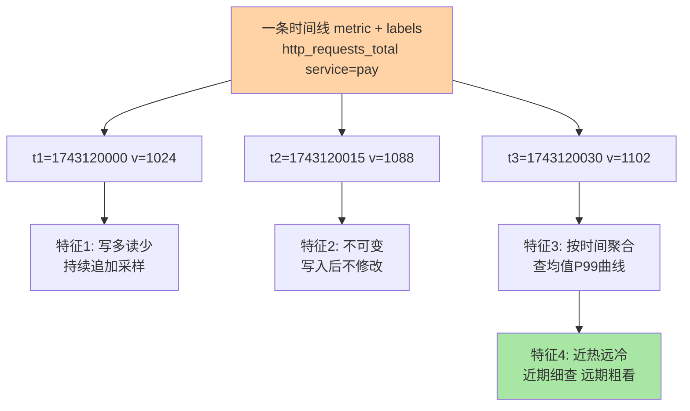
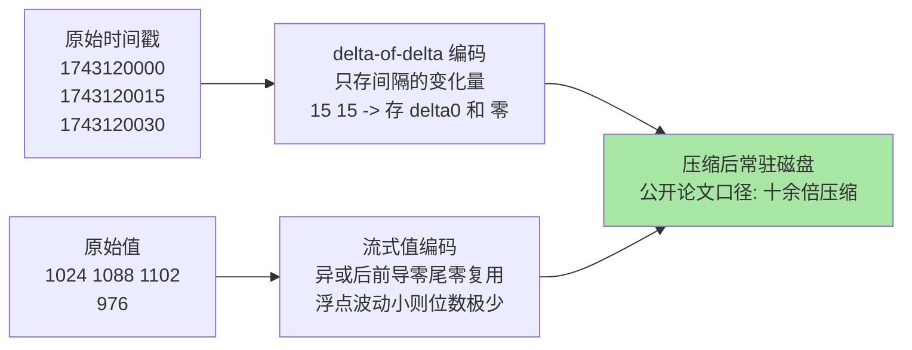

# 时序数据库是什么与特殊性：为时间轴而生的存储

> 一句话：时序数据库（TSDB）是专门存「指标随时间的采样点」的数据库——数据模型是「一条时间线 + 一串带时间戳的值」，四大特征（写多读少/不可变/按时间聚合/近期热远期冷）决定了它的压缩、降采样与保留策略三板斧。

## 🎯 本文核心

**核心一句话：时序数据的特殊性是「同一条时间线持续追加、永不回头修改」——专用库把这个规律压榨到极致：按时间线组织存储使相邻数据高度相似（压缩率远超通用库），按时间分块使老数据整块可过期可降采样（删除零成本），按时间聚合的查询形态使预计算收益最大化——每一个设计都从「时间是唯一的物理轴」这条约束推导。**

一图看懂时序数据的形态与四特征：



组织主线：什么是时序数据（真实形态）→ 四个特征逐个拆 → 为什么 MySQL 存不了监控指标 → 专用库的压缩与降采样底牌 → 边界。

## 一句话摘要

时序数据库（Time Series Database，TSDB）存的是「**指标（metric）+ 标签集（labels）+ 时间戳 + 值**」的四元组序列：一条时间线（同 metric 同 labels）随时间持续产生采样点。业内量级：一台主机 15 秒采一次基础指标就是每天数万个点， 千台规模的集群每天新增样本量轻松上亿（业内认知）——这种「永不停表的写入洪流 + 只按时间查」的负载与业务库完全不同。通用关系库存它会在索引膨胀与写入吞吐上双双崩塌；专用 TSDB 的底牌是两张：**时间专用压缩**（时间戳 delta-of-delta、值 gorilla 类流式编码，公开论文 Facebook 2015 口径压缩率可达十余倍）与**分层生命周期**（近期全精度、远期降采样、过期整块删除）。代价：它不是业务库——不能改历史、不做事务、不支持任意维度的随机点查。

## 5W 速记卡

| 维度 | 一句话 |
|---|---|
| What | 专用存「指标 + 标签 + 时间戳采样」的数据库（TSDB） |
| Why | 写入洪流 + 按时间聚合的负载，通用行存四堵墙扛不住 |
| When | 监控指标/IoT 传感/事件计数等持续采样场景 |
| Where | 观测体系存储层（Prometheus/VM 生态）或独立集群 |
| How | 按时间线写入，按时间范围聚合查询，按保留策略过期 |

## 一、什么是时序数据：先看真实形态

一条监控指标在内存里的真实样子：

```text
# 一条时间线: 指标名 + 标签集
http_requests_total{service="payment", method="POST", code="200"}
# 上面这条线的采样序列(时间戳秒, 值):
1743120000 -> 1024
1743120015 -> 1088
1743120030 -> 1102
1743120045 -> 976
```

拆开看三要素：**指标名**回答「测什么」（请求总数/CPU 使用率/队列深度）；**标签集**回答「在哪个维度上测」（哪个服务/哪台实例/哪个状态码——标签组合唯一确定一条时间线）；**采样序列**回答「随时间怎么变」。查询永远长这样：「过去 1 小时 payment 服务 P99 延迟曲线」「按服务聚合过去 24 小时错误率 Top10」——**输入是时间范围 + 标签过滤，输出是曲线或聚合值**，这个查询形态就是专用库所有设计的目标函数。

时序数据不只监控：IoT 传感器读数（温度/位置每秒上报）、金融行情（逐笔价格）、应用事件流（每秒事件计数）——共同点都是「一条线持续追加采样」。

## 二、四个特征逐个拆：每个特征都是一条设计约束

### 特征一：写多读少，持续追加

与业务库「写一次读多次」相反，监控指标是「每个点写一次、以聚合方式读」——单台采集器每秒上报成百上千个点，写入是持续的洪流而非事务峰值。追问：写入洪流到底有多「洪」？按千条时间线 × 15 秒采样算，每秒新增采样点数千到数万，且是 7x24 持续流——没有业务库那种「低谷期」。约束推导：存储引擎必须为「顺序批量追加」优化，不能为「单行随机读写」优化——这正是 ClickHouse 遇到的同款矛盾，解法也同款（LSM/追加式存储的底层机制）。再追问一层：写入洪流会持续多久？答案是不会停——采样间隔是常数，机器规模只增不减，这类「无洪峰、恒高压」的负载特征比峰值型更考验引擎的可持续吞吐。

### 特征二：写入后不可变

历史采样点不修改（CPU 使用率在 10:00 的值不会变成别的）——纠错靠追加新点而非改旧点。约束推导：不需要 B+ 树的行级随机更新能力，数据块写完即可压缩成只读文件；「不可变」还让多副本同步与并发读天然简单。反方案分析——为什么不用「可更新」的通用表？可变性要求索引与日志两套机制保证一致性，换来的能力（改历史）在时序场景恰恰是不要的：为不需要的能力付架构税。

### 特征三：查询按时间聚合

没有「查某一条采样点」的业务诉求（查 10:00:00 那一秒的 CPU 值没有意义），要的是「时间范围内按标签聚合的曲线/分位数」。约束推导：预计算与降采样收益巨大——「过去 7 天每 5 分钟的均值」可以提前算好存着，查询时直接取。

### 特征四：近期热远期冷

排障看最近几小时（秒级精度），周报看趋势（分钟精度够用），年度审计看形态（小时精度）——**访问频率与精度需求随时间老化同步衰减**。约束推导：分层存储与保留策略有了物理依据：热层全精度、冷层降采样、过期删除。

## 三、为什么不用 MySQL 存监控指标：算一笔账

用 MySQL 建 `metrics(metric_name, labels, ts, value)` 表存采样点，会先后撞上四堵墙（业内普遍经验）：

1. **写入吞吐墙**：thousand 台机器 × 每条时间线 15 秒一个点，每秒数万行持续 INSERT——行存 + 索引实时维护的写入路径撑不住洪峰（业内认知：单机 MySQL 持续万行/秒级写入已接近舒适区上限）
2. **索引与存储膨胀墙**：时间戳 + 标签字符串每个点都完整存一份，索引体积比数据还大；而时间戳本是高度可预测的序列，通用库完全没利用
3. **查询形态墙**：「过去 1 小时按服务聚合 P99」在 MySQL 是大范围范围扫描 + GROUP BY，亿级行下分钟级起步；时序库同类查询亚秒
4. **过期删除墙**：只留 30 天 → 每天要 DELETE 几天前的亿级行——B+ 树删除触发索引维护与空间回收风暴（线上排查过的团队都知道：大批量 DELETE 是 MySQL 运维噩梦之一）；而时序库按时间块组织，过期 = 整块丢弃

四堵墙的共同根源：**通用行存把每个点当「独立的行」，时序库把每条线当「连续的流」**——组织粒度不同，物理成本天差地别。打破砂锅问到底：为什么索引膨胀墙在时序场景无解？因为时间戳列的唯一价值就是「范围扫描」，B+ 树为「精确点查」设计的机制在这里全是纯开销——通用索引的底层原理与时序查询形态正面冲突。设计思想层面这是「数据的自然结构决定存储结构」的又一例证。

## 四、专用库的两张底牌：压缩与降采样

### 底牌一：时间专用压缩

时间戳单调递增且间隔规律，值的波动范围有限——专用编码把「冗余的规律」榨出来：



效果用数字感受（公开论文 Facebook Gorilla 2015 口径）：16 字节的时间戳 + 值对，压缩后平均不足 2 字节；业内普遍认知 TSDB 相比通用行存存储成本降一个数量级。其底层机制是「把可预测性变成信息熵的削减」：时间戳间隔越规律、值波动越小，编码位数越少——压缩率是数据规律性的函数，不是算法的魔法。**压缩不止省钱**：磁盘 I/O 是扫描查询的瓶颈，数据小十倍查询就快十倍。

### 底牌二：降采样与保留策略

降采样 = 把原始精度（15 秒/点）按更粗窗口聚合存储（5 分钟均值/最大值），与保留策略联动：原始数据留 7 天 → 5 分钟粒度留 30 天 → 1 小时粒度留 1 年。查询按时间范围自动选层：查今天用原始层、查季度趋势用粗粒度层——**近期热远期冷从负担变成了分层架构**。这套生命周期管理是时序库的标配能力，通用库要自建定时任务手工搬运。

> 💡 **实战提示**
> - 标签设计是时序库第一课：标签基数（如 user_id 做标签）决定时间线数量——百万用户各自一条线会把基数爆炸成千万条线，直接压垮索引；高基数字段放业务库，标签只放「有限枚举的维度」
> - 采样频率与保留期要一起定：15 秒精度留一周与 5 分钟精度留半年，存储成本可能同量级——先问「这个精度留多久」，再谈采集
> - 评估时序库先看写入吞吐与压缩率实测，再看功能表：写入洪峰扛不住，功能再多都是零

## 五、与业务数据库的区别：一张表看清

| 维度 | 业务库（MySQL 等） | 时序数据库（TSDB） |
|---|---|---|
| 数据模型 | 行 = 业务实体 | 线 = 指标 + 标签，点 = 采样 |
| 写入模式 | 事务性随机读写 | 持续批量追加，写多读少 |
| 可变性 | 随时 UPDATE | 不可变，纠错靠追加 |
| 典型查询 | 按主键取行 + 条件查询 | 时间范围 + 标签聚合曲线 |
| 压缩 | 通用压缩 2-3 倍（业内认知） | 时间专用编码十余倍（公开口径） |
| 生命周期 | 数据长期保留 | 保留策略 + 降采样 + 整块过期 |
| 事务 | ACID | 无（追加不回滚） |
| 定位 | 业务事实源 | 指标/事件的观测数据层 |

一句话分工：**业务库存「发生了什么」，时序库存「随时间怎么变」**——订单金额存业务库，接口延迟曲线存时序库，互不越界。

## 六、典型使用场景

- **基础设施与应用监控**：CPU/内存/延迟/QPS/错误率——时序库的原生主场（Prometheus 生态的存储层）
- **IoT 传感数据**：百万设备温度/位置/电量持续上报，高写入吞吐 + 长保留
- **业务指标观测**：订单量/支付成功率/队列积压的业务大盘——把业务事件转成计数指标入时序库
- **事件流计数**：风控事件/埋点 PVUV 的分钟级计数曲线（明细归明细库，计数归时序库）
- 量级分档一句话：几百条时间线用 MySQL + 定时聚合表就够；千条线以上或秒级采样必须上 TSDB；十万条线、亿级日增样本要考虑集群化与分层存储——线数与采样频率相乘才是真实量级。

## 七、什么时候用与不用：明确推荐

- **什么时候用**：数据是「指标随时间的采样」、写入持续高速、查询按时间聚合、需要自动过期与降采样——四条满足即**明确推荐** TSDB，不要用通用库硬扛
- **什么时候不用**：业务交易数据（要事务）、需要修改/删除单点（不可变约束）、按非时间维度的随机点查为主（明细查业务库）、数据总量小（几百条线以内 MySQL 足够）——时序库的不可变与无事务是硬边界
- **怎么配**：业务事实在 OLTP 库 → 关键事件转成指标进 TSDB 做观测 → 明细流水进 ClickHouse 做多维分析——三层各管一个时间形态

## 八、Trade-off：专用化的代价清单

时序库的设计取舍：**押注「时间是唯一主轴、历史不可变」的负载假设，放弃通用性**。得到的：十余倍压缩、写入洪流吞吐、分层生命周期自动化；放弃的：事务能力、单点修改、任意维度随机读。反方案分析——「为什么不用 ClickHouse 存时序？」可以（业内确实有团队这么做），但 TSDB 在时间线管理、保留/降采样自动化、监控生态集成上是原生能力，ClickHouse 要自己搭；「为什么不用 ES 存指标？」倒排索引为全文检索设计，数值流压缩率与写入吞吐都不如 TSDB（业内基准共识）——每个引擎都在自己假设的负载上最优。

## 九、你们可能会问

**Q1：时序库和「能存时间戳的数据库」区别到底在哪？**
区别不在能不能存，在「按时间的组织方式」：TSDB 按时间分块、按线聚簇、按规律编码——压缩、过期、聚合查询都是这个组织方式的红利。通用库存时间戳只是「多一列」，组织方式没变，四堵墙一堵都不会少。

**Q2：标签基数爆炸是什么？怎么发现？**
把高基数字段（用户 ID/订单号）放进标签，时间线数量随值数量线性爆炸（百万用户 = 百万条线），写入与索引双双雪崩。发现手段：时序库的活跃时间线总数指标（Prometheus 生态里就是 `prometheus_tsdb_head_series` 类指标）持续上涨就该排查标签设计——这是新团队线上排查频率最高的问题之一。

**Q3：降采样会丢信息吗？排障时要原始精度怎么办？**
会丢——降采样只保留聚合统计（均值/最大/最小），波动细节没了。分层设计就是答案：近期热层保留原始精度够排障，远期只留趋势形态够复盘；两层配合，而不是一个精度包打天下。打破砂锅问一句：能不能全部保留原始精度？能，但存储成本随时间线性上涨且查询更慢——精度、成本、速度三者的取舍没有免费午餐。

## 十、开放问题

- TSDB 与通用 OLAP 的边界在融合：ClickHouse 类引擎补时间线管理，TSDB 补分析 SQL 能力——「专用 vs 通用」的钟摆在动态摆动
- 云托管与存算分离让分层存储下沉到对象存储，保留策略的实现形态在演变，两年后的架构与今天不同

## 十一、自测三问

1. 时序数据四特征分别推导出专用库的哪条设计？
2. MySQL 存监控指标的四堵墙是什么？共同根源一句话？
3. 标签基数爆炸的机制是什么？为什么高基数字段不能做标签？

下一篇讲「Prometheus 与 VictoriaMetrics 双雄」：拉模型怎么工作、单机到集群的扩展路线、三家主流 TSDB 的定位对比。

## 🎯 核心带走

- **核心一句话**：时序库 = 把「时间是唯一主轴、历史不可变」压榨到极致的专用存储——按线组织 + 按时间分块带来十余倍压缩与零成本过期，降采样把近期热远期冷变成分层架构
- **主线**：真实形态（指标+标签+采样）→ 四特征四约束 → MySQL 四堵墙 → 压缩与降采样底牌 → 分工边界
- **哪里会坏**：标签基数爆炸、精度与保留期不配套、把业务交易数据塞进来
- **边界**：本篇是模型与特征层；具体产品架构在篇 2，集群化与高可用属特性层

## 📌 数据与事实声明

- 写于 2026-09-24；压缩编码（delta-of-delta、gorilla 类）以公开论文 Facebook Gorilla（VLDB 2015）与 Prometheus/VictoriaMetrics 官方文档公开口径为准
- 「压缩十余倍」「千台集群日增上亿样本」「MySQL 万行/秒写入舒适区」为业内经验认知与公开口径，按采集频率与硬件实测
- 免责：具体产品能力与参数随版本演进变化，以官方文档为准

## 📚 参考资料

| 类型 | 标题 | 来源 |
|---|---|---|
| 公开论文 | Gorilla: A Fast, Scalable, In-Memory Time Series Database（VLDB 2015） | 公开学术出版物 |
| 官方文档 | Prometheus Documentation（Storage 章） | prometheus.io/docs |
| 官方文档 | VictoriaMetrics 官方文档 | docs.victoriametrics.com |
| 系列导航 | 时序数据库系列目录 | `docs/data/timeseries/index.md` |
