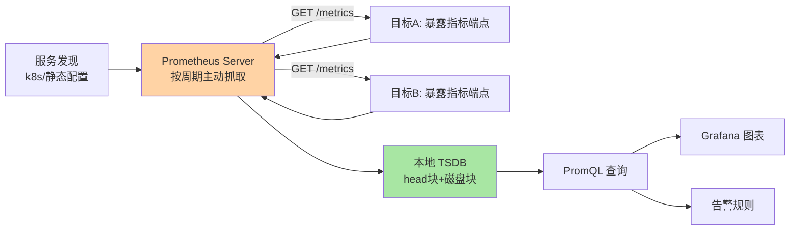
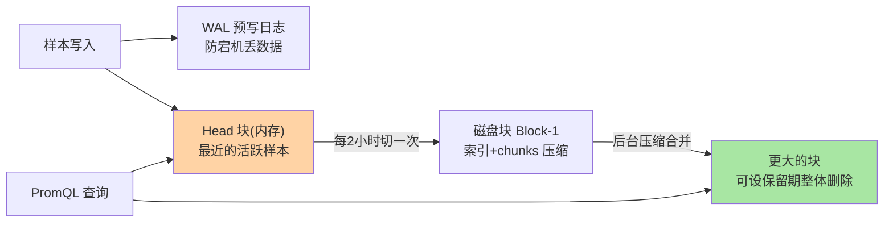

# Prometheus 与 VictoriaMetrics 双雄：拉模型与扩展路线

> 一句话：Prometheus 用「主动拉取 + 单机 TSDB」定义了云原生监控的事实标准（公开口径：CNCF 毕业项目），VictoriaMetrics 用「兼容它的查询方言 + 更省的存储与横向扩展」补上大规模的短板——双雄分工是入门时序监控的第一张地图。

## 🎯 本文核心

**核心一句话：Prometheus 的本质是「拉模型」——服务端按注册的目标主动抓取 `/metrics` 端点，抓取即发现（拉不到 = 服务可能挂了）；其 TSDB 按两小时块组织（内存头块 + 磁盘块 + WAL），单机架构简单但纵向扩展有天花板；VictoriaMetrics 走「单机优先、集群按需」路线，以更低资源吃下更大的时间线基数——两者是「标准生态 vs 大规模工程化」的互补，不是非此即彼。**

一图看懂 Prometheus 的拉模型全景：

组织主线：拉模型为什么成立 → TSDB 块结构怎么转 → 单机边界在哪 → VM 的扩展路线 → 三家产品定位对比 → 选型边界。

## 一句话摘要

**Prometheus** 是 pull 模型的监控系统：从服务发现拿到目标列表，每隔固定周期（默认 30 秒，业内常见配置）主动抓取目标暴露的 HTTP 指标端点，样本写入本地 TSDB，用 PromQL 查询与告警。**VictoriaMetrics（VM）** 是后起的开源时序库（公开口径：以低资源占用与高基数处理著称），提供与 Prometheus 兼容的抓取组件（vmagent）与查询方言（MetricsQL），单机版即可吃下数十百万级活跃时间线（公开文档口径），集群版按写入/存储/查询三角色拆分横向扩展。定位对比一句话：**InfluxDB 是「多用途时序平台」（自带写入协议/查询语言/生态全家桶），TimescaleDB 是「PostgreSQL 之上的时序扩展」（SQL 生态原生），Prometheus/VM 是「监控指标专用」**——监控场景看双雄，通用时序平台看另外两家（业内认知）。

## 5W 速记卡

| 维度 | 一句话 |
|---|---|
| What | Prometheus 拉模型监控标准 + VictoriaMetrics 兼容扩展的双雄格局 |
| Why | 监控指标负载需要专用采集语义与存储，双雄各占标准与效率 |
| When | 云原生指标监控/大规模指标平台/业务红线告警 |
| Where | 单机 Prometheus 起步，VM 单机/集群承接规模，远端写接长存储 |
| How | 目标暴露 /metrics 端点，服务端发现并周期抓取，PromQL 查询告警 |

## 一、拉模型：为什么「监控端主动抓」而不是「业务端主动推」

推模型（业务进程把指标发往服务端）直觉自然，但拉模型赢了生态，原因有三层：

1. **抓取即健康检查**：拉不到端点，本身就是「目标异常」的信号——监控语义与采集动作合一，不用另建探活体系
2. **服务端控制节奏**：采样频率、目标列表全在监控侧统一管理，新业务零配置接入（只需暴露一个端点）；推模型下每个业务方都要管理「发往哪、失败重试、缓冲」，采集逻辑分散
3. **故障隔离**：业务方不用关心监控系统在不在——监控系统挂了不影响业务进程，恢复后补抓即可（指标是「当前状态快照」语义，不是事件流）

追问：拉模型什么时候不合适？短生命周期任务（批处理作业活 30 秒就退出，可能一次都抓不到）——生态的答案是 Pushgateway 中转组件，让短任务先推到网关、再由 Prometheus 拉网关。再追问一层：这不是又变回推了吗？是的——拉为主、推补边角，模型选择从来是负载约束下的取舍而非信仰。

## 二、Prometheus 的 TSDB 结构：两小时一块的转盘

三个要点：**Head 块**在内存承接最新写入与查询，每 2 小时（默认，官方文档口径）落盘成一个不可变块——这套块式结构的底层机制与篇 1 的「不可变」特征一脉相承；**WAL** 保证内存块宕机可回放；**不可变块**让压缩、保留期删除（整块丢弃）与远端复制都极简——篇 1「不可变」特征的教科书式落地。倒排索引把「标签对 → 时间线列表」建好，PromQL 的标签过滤才能在百万时间线中快速收窄。

单机架构的代价也随之而来：**本地磁盘容量与单机内存决定时间线上限**——倒排索引常驻内存的设计原理决定了这个天花板，活跃时间线数百万级后 OOM 与查询变慢是社区高频问题（业内普遍反馈），其故障机制是索引内存随时间线数线性增长而非查询并发；原生的高可用靠跑两个抓相同目标的实例（数据不互查）——「简单」与「大规模」的矛盾，正是 VM 切入的缝。

## 三、VictoriaMetrics 的扩展路线：单机优先，集群按需

VM 的设计思想：**先用单机吃掉尽可能大的量（工程优化：索引与压缩重写），单机真到顶再按角色拆集群**——而不是一上来就分布式。

- **单机形态**：一个二进制 = 写入 + 存储 + 查询，配合 vmagent（兼容 Prometheus 抓取）即可整体替换存储层，Grafana 与告警链路不用改（VM 查询方言兼容 PromQL，公开文档口径）
- **集群形态**：vminsert（写入路由/按时间线哈希分布）+ vmstorage（存储节点，水平加机器）+ vmselect（查询聚合）三角色分离——时间线按哈希散到多节点，写入与查询并行扩展，分布式机制刻意保持简单（哈希路由，不做跨节点 JOIN 类复杂操作）
- **资源收益**：公开基准与社区普遍反馈下，同量级数据 VM 的内存与磁盘占用显著低于 Prometheus（公开口径，量级随负载浮动）——核心优化在倒排索引结构与浮点压缩。打破砂锅问一层：内存省在哪？Prometheus 的倒排索引把标签对到时间线的映射全量放内存，VM 重写了这套索引的存储原理，把大头挪到磁盘并按需缓存——同一种功能的两种实现，资源画像完全不同

一个匿名化的迁移复盘：某平台监控从单机 Prometheus 起家，一年后活跃时间线涨到五百万级，查询内存溢出成为常态（当时排查路径：先看 head 块内存与活跃时间线曲线，确认是规模问题不是查询写法问题）；迁移 VM 单机后资源占用降至原先三分之一，后续量级再涨才拆集群——复盘结论：**先确认瓶颈是规模，再换引擎；单机优先的路线让迁移分了两步走，每步风险可控**。

> 💡 **实战提示**
> - 活跃时间线数量是监控系统的「体温计」：标签随意组合（如把 pod 名、请求 ID 塞进标签）会让时间线数暴涨——上线前先卡标签基数规范，比事后扩容便宜得多
> - Prometheus 原生高可用是「双跑不互查」，长期存储与全局视图要靠远端写入（remote write）到 VM/Thanos 类后端——单机 Prometheus 适合百级节点以下起步，别把它的边界当万能
> - 告警规则与仪表盘是「代码」：进版本库管理、走评审——监控系统的可维护性一半在存储引擎，一半在这套配置工程化

## 四、与 InfluxDB 的区别：三家定位先于选型

| 维度 | Prometheus / VM | InfluxDB | TimescaleDB |
|---|---|---|---|
| 定位 | 监控指标专用 | 多用途时序平台 | PostgreSQL 时序扩展 |
| 查询语言 | PromQL / MetricsQL | InfluxQL / Flux | 原生 SQL（PG 方言） |
| 拉取生态 | 服务发现 + 抓取生态最全 | 推送为主（多协议接入） | 推送/SQL 写入 |
| 数据假设 | 数值采样、追加不可变 | 通用时序（可带字段多） | 关系表 + 时序优化 |
| 谁在用 | 云原生监控事实标准（公开口径） | IoT/工业平台 | 已有 PG 栈与 SQL 团队 |

选型的第一问不是「哪家快」，是「数据是不是监控指标」：是 → 双雄生态无可替代（Kubernetes/服务发现/告警链路全打通）；不是监控而是 IoT 设备多字段数据 → InfluxDB 类平台更合身；团队核心资产是 SQL 与 PG 运维体系 → TimescaleDB 让时序能力长在熟悉的地基上。反方案分析——「为什么监控不用 TimescaleDB 一个库全包？」监控的抓取生态、PromQL 语义与告警体系是十年生态积累，数据库层省下的成本会在采集与查询层加倍还回去——选型选的是生态位，不只是存储引擎。

## 五、典型使用场景

- **云原生基础设施监控**：Kubernetes 集群、节点、容器的指标采集与告警——Prometheus 原生主场
- **大规模指标平台**：多集群/多租户统一监控，亿级日增样本——VM 集群形态的典型场
- **业务红线指标告警**：错误率/延迟/积压的分位数曲线与阈值告警
- **IoT/设备监控的通用时序需求**：多字段读数、SQL 分析为主——评估 InfluxDB/TimescaleDB（业内认知）
- 量级分档一句话：几百节点单机 Prometheus 足够；千节点级或百万活跃时间线上 VM 单机；多集群全局视图与十亿级日样本上 VM 集群或 Thanos 分层——量级台阶决定形态，别提前为集群复杂度买单。

## 六、常见误区与代价

- ❌ **「Prometheus 是数据库」**：它是监控系统——本地存储默认短保留（官方默认 15 天量级），长期存储靠远端写后端；把它当唯一存储的团队都在保留期上踩过坑
- ❌ **「VM 兼容 PromQL 所以是无脑平替」**：查询方言兼容是大头，但告警生态组件、抓取配置细节仍有差异（公开文档有兼容清单）——迁移前按自家告警链路做回归，不要只看存储层
- ❌ **「指标越多监控越好」**：时间线基数是成本与查询延迟的直接函数——无规范的高基数标签会让整个平台退化，这是线上排查频率最高的故障类型之一
- ❌ **「拉模型抓不到就是数据丢了」**：抓取间隔决定数据粒度，短于间隔的毛刺天然不可见——监控看到的是「采样后的世界」

## 七、什么时候用与不用：明确推荐

- **什么时候用 Prometheus**：云原生环境指标监控、百节点以下起步、需要成熟告警生态——**明确推荐**作为监控体系起点
- **什么时候上 VictoriaMetrics**：活跃时间线到数十万级、单机 Prometheus 内存吃紧、需要长保留与全局查询——单机起步按需升集群（业内常见路径）
- **什么时候不用双雄**：非监控的通用时序（IoT 多字段/事件分析）、需要 SQL 生态与关系约束、需要事务性写入——回篇 1 的场景判定，InfluxDB/TimescaleDB 或通用 OLAP 更合位
- **怎么配邻居**：指标进双雄 → 日志进 ES/Loki → 链路进 tracing 系统——可观测性三支柱各管一摊，别让一个引擎全包

## 八、Trade-off：双雄押了什么、放弃了什么

Prometheus 的设计取舍：**押注「单机简单性 + 拉模型生态」，放弃原生横向扩展与长期存储**——简单使它成为标准，简单也是它的天花板；这份克制正是它最值得学的设计哲学。VM 的取舍：**押注「兼容生态 + 资源效率」，放弃自建标准**——借 Prometheus 的生态势能，在存储层做极致工程优化。反方案分析：「为什么 Thanos/长期存储方案不直接替代 VM？」Thanos 走「对象存储分层」路线保留 Prometheus 原生形态，VM 走「替换存储引擎」路线换更高效率——两条路线都对，选哪条取决于团队更在意「形态兼容」还是「资源成本」；「为什么不用推模型统一一切？」第一节的三层原因已经回答——拉模型把采集语义与监控语义合一，这个绑定的价值至今无人推翻。双雄并存的格局本身就是权衡的产物：生态标准与工程效率各有拥趸。

## 九、你们可能会问

**Q1：拉模型怎么监控「监控不到了」的实例？**
拉不到本身会进入 `up` 指标（up=0 表示抓取失败）——目标失联是一种被监控的状态，不是监控盲区。这也是拉模型「抓取即健康检查」设计的自洽之处。

**Q2：从 Prometheus 迁 VM，业务要改什么？**
理想答案是什么都不改：vmagent 兼容抓取配置，查询方言兼容 PromQL，Grafana 数据源换个地址。实际要做的是回归告警规则与函数行为差异（公开文档列了兼容性清单）——「兼容」是工程度问题，不是零与一。

**Q3：先学 Prometheus 还是直接学 VM？**
先学 Prometheus：它的数据模型、标签体系、PromQL 是整个生态的通用语言（VM/Thanos/各类探针都围绕它）——学会标准，再理解某家对标准的工程优化，认知路径最短。打破砂锅问一句：为什么不学「最新最好」的那家？因为监控领域的护城河是生态互操作，脱离生态谈产品优势是空中楼阁。

## 十、开放问题

- 可观测性三支柱（指标/日志/链路）走向统一存储的尝试持续出现（统一查询层、关联分析），「分而治之」与「一栈式」的争论业内尚无定论
- 流式指标（OTLP 直推、不落抓取端点）在抬头的推信号——拉模型的统治地位在未来十年是否延续，值得跟踪

## 十一、自测三问

1. 拉模型赢在三层什么？短生命周期任务的补丁是什么？
2. Prometheus TSDB 的 Head 块、WAL、不可变块各管什么？单机天花板在哪？
3. VM 单机/集群形态怎么分角色？与 Thanos 路线的关键差异一句话？

## 🎯 核心带走

- **核心一句话**：Prometheus = 拉模型 + 单机块式 TSDB + 生态标准；VictoriaMetrics = 兼容生态 + 单机极致效率 + 按角色集群化——监控指标场景从 Prometheus 起步，规模顶到 VM，非监控时序看 InfluxDB/TimescaleDB
- **主线**：拉模型三层理由 → 块式存储结构 → 单机边界 → VM 扩展路线 → 三家定位表 → 选型边界
- **哪里会坏**：标签基数失控、把 Prometheus 当长期存储、迁移不做告警回归
- **边界**：本篇是产品定位层；Thanos 分层、高可用细节、告警规则体系属特性层内容

## 📌 数据与事实声明

- 写于 2026-09-24；拉模型、TSDB 块结构（2 小时块/WAL）、默认参数与兼容性以 Prometheus 与 VictoriaMetrics 官方文档公开口径为准
- 「CNCF 毕业项目」「资源占用对比」「活跃时间线量级」为公开口径与业内经验认知，随版本与负载浮动
- 免责：文中迁移案例已匿名化与泛化处理，用于说明路径不指向任何具体公司

## 📚 参考资料

| 类型 | 标题 | 来源 |
|---|---|---|
| 官方文档 | Prometheus Documentation（Storage/Overview 章） | prometheus.io/docs |
| 官方文档 | VictoriaMetrics 官方文档（单机与集群架构） | docs.victoriametrics.com |
| 官方文档 | InfluxDB / TimescaleDB 官方文档 | docs.influxdata.com / docs.timescale.com |
| 系列导航 | 时序数据库系列目录 | `docs/data/timeseries/index.md` |
