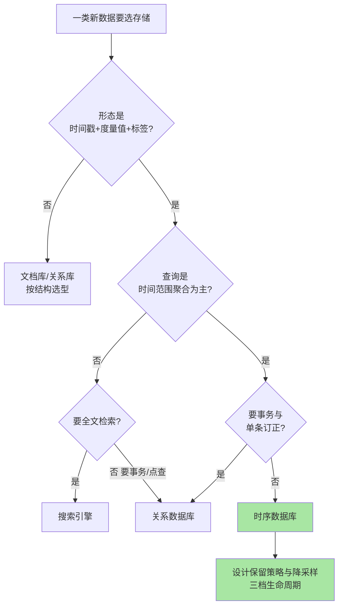

# 场景选型与边界：什么数据该进时序库，什么不该

> 一句话：时序库不是「更快的关系库」——它为「时间索引的度量值、只追加、按时间过期」这一类负载而生；选型判断的本质是看数据形态与生命周期是否匹配它的存储假设，匹配则事半功倍，错配则两头受损。

## 🎯 本文核心

**核心一句话：选型只看三个匹配——数据形态匹配（时间戳 + 度量值 + 标签，无事务无关联修改）、查询形态匹配（按时间范围 + 标签过滤后做聚合，而不是随机点查或全文检索）、生命周期匹配（新数据热、老数据降精度直至过期删除）；三条全中就进时序库，任何一条不中先考虑其他存储——「该不该用」比「用哪家」重要一个量级。**

组织主线：该用与不该用的场景清单 → 保留策略与降采样怎么设计 → 与关系库/搜索引擎/文档库的区别辨析 → 一张选型决策流图收口。

入门层前两篇讲过「时序数据为什么特殊（写多读聚合、时间不可变）」与「监控领域的双雄产品格局」，本篇收尾入门层：回到选型视角——什么数据该进、什么不该进、进去了生命周期怎么管。

## 一句话摘要

时序数据库是为「按时间组织的度量值」优化的专用存储：写入端吃高吞吐追加，查询端吃时间范围聚合，存储端靠时间分区与压缩把老数据成本压到极低。它的每一项优化都对应明确的负载假设，因此**边界清晰**：监控指标、IoT 传感读数、应用事件流、业务埋点这类「追加型度量数据」是主场；交易流水（要事务与关联）、文档数据（要字段级随机更新）、全文检索（要倒排索引与相关性）是禁区——硬塞进时序库等于用错工具。生命周期管理（保留策略 retention + 降采样 downsampling）是时序库选型后最先要做的设计决策：原始精度留多久、聚合精度留多久、何时过期，三档设计直接决定存储成本曲线（业内经验：降采样后老数据存储可降一到两个数量级，公开口径量级）。

## 5W 速记卡

| 维度 | 一句话 |
|---|---|
| What | 为「时间索引度量值」优化的专用库，边界由负载假设决定 |
| Why | 写多读聚合 + 按时间过期的负载，通用库要么慢要么贵 |
| When | 监控/IoT/事件流/埋点进；交易/文档/检索不进 |
| Where | 热数据在线查询，老数据降采样或转冷存储 |
| How | 三问选型（形态/查询/生命周期）+ 三档保留设计 |

## 一、典型使用场景：四类主场负载

四类场景共享同一个数据形态骨架——「什么对象 + 什么时间 + 度量了什么 + 打了什么标签」：

| 场景 | 典型数据 | 查询形态 | 规模压力点 |
|---|---|---|---|
| 监控指标 | 主机/服务/接口的 CPU、延迟、错误率 | 近期时间窗聚合 + 告警判断 | 采集频率 × 指标基数 |
| IoT 传感 | 设备每秒/每分钟上报的温度、位置、状态 | 时间范围 + 设备标签过滤聚合 | 设备数 × 上报频率 |
| 应用事件流 | 请求日志事件、状态变更事件 | 按时间 + 事件属性统计 | 事件产生速率 |
| 业务埋点 | 页面曝光、点击、转化漏斗事件 | 时间窗内按维度聚合分析 | 埋点维度基数 |

共同点值得复述一遍：**只追加、不修改；查「一段时间的整体形态」，不查「某一条记录」；老数据价值衰减，可以降精度**。三条全满足，时序库的压缩、分区裁剪、预聚合机制才全部兑现。

## 二、不该用的场景：三类禁区与代价

反着看，三类数据硬进时序库会发生什么：

- **交易数据**：订单、账务、库存这类要事务一致性、要关联更新、要随时订正单条记录的数据——时序库不提供完整事务语义，订正 = 追加修正记录，关联查询能力弱。放进时序库的代价：一致性与可订正性双输。交易数据的正确归宿是关系库，分析需求走「同步到分析库」的链路
- **文档数据**：用户资料、配置、内容主体这类字段结构各异、需要字段级随机更新的数据——时序库的更新语义是「追加新点」，没有文档级 CRUD。代价：要么字段塞不进度量模型，要么更新变成数据膨胀
- **全文检索**：日志内容搜索、模糊匹配、相关性排序这类查询——时序库的时间分区索引帮不上忙，没有倒排索引与分词体系，这类查询要么慢要么做不了。代价：检索需求被迫退化为精确匹配。日志场景的正确架构通常是「检索走搜索引擎、指标走时序库」的分工

追问：日志算时序数据吗？拆开看——日志里的「指标化部分」（错误率、耗时分布）是标准时序数据，进时序库；「原始文本部分」要自由检索，进搜索或对象存储。一条日志两条归宿，按查询需求拆分而不是按数据来源划分——这是设计思想层面的分野：**存储选型跟着查询形态走，不跟着数据名字走**。

## 三、与时序场景邻居们的区别：一张辨析表

初学者最容易把时序库和几个「看起来也能装时间数据」的邻居混淆，区别在负载假设：

| 维度 | 时序数据库 | 关系数据库 | 搜索引擎 | 文档数据库 |
|---|---|---|---|---|
| 核心负载 | 时间范围聚合 | 事务与关联 CRUD | 全文检索与相关性 | 灵活结构的文档读写 |
| 写入模型 | 高吞吐追加 | 单行事务写 | 文档索引写 | 文档级 CRUD |
| 更新语义 | 追加新点（旧点不变） | 原地行更新 | 重建文档索引 | 原地文档更新 |
| 压缩重点 | 时间与标签列压缩（数量级收益） | 行存压缩（有限） | 倒排结构压缩 | 文档存储压缩（有限） |
| 过期设计 | 按时间自动过期是内建能力 | 手动归档删数据 | 手动或按索引策略 | 手动清理 |
| 典型错配 | 拿来做交易库 | 拿来做高频指标聚合 | 拿来做数值聚合分析 | 拿来做时序聚合 |

一张表记不住所有区别没关系，记住判断动作：**先问查询是什么形态，再问生命周期要不要自动过期——两个答案都指向时序库才进**。

## 四、保留策略与降采样：进去了之后的第一设计

### 4.1 三档生命周期模型

时序数据的价值随时间衰减，但衰减速度不均匀——刚产生的数据要看原始精度，一周前的数据看分钟级就够，一年前的数据看小时级趋势即可。三档模型（业内通用做法，公开口径）：

- **保留策略（retention）**：按时间自动删除过期数据的引擎内建机制——「过期」不是定时任务扫表删除，而是按时间分区整体裁剪，成本近乎为零；这是时序库与通用库在生命周期管理上的本质区别
- **降采样（downsampling）**：定时把原始精度聚合成低精度档（如每 10 秒的原始点聚合成每分钟的平均/最大/最小），聚合结果写入降采样表，原始数据到期由保留策略回收——**先有降采样落地，才敢让原始数据过期**，顺序不能反

### 4.2 设计三问

定参数前回答三个问题：**原始精度需要保留多久**（排障要回看多久的历史原始点）；**聚合档要保留哪些统计量**（平均之外，最大值/最小值/分位数是否需要——平均会抹掉尖峰，告警复盘常需要 max）；**各档保留多久**（受合规与业务回看需求约束，不是越久越好）。三问有答案，保留策略与降采样任务就能一次定稳。

实践叙事（匿名化复盘）：某团队上线初期没做降采样，原始 10 秒级采集点全量保留，半年后存储成本翻了几倍，被迫紧急设计降采样——但历史数据已按默认策略过期，长期趋势档缺失，年度对比报表只能从头积累。教训沉淀：**保留策略是选型当周就该定的决策，晚定一个月就少一个月的趋势数据，这类数据损失不可逆**。

## 五、常见误区与代价：踩坑复盘

四个高频误区，每一个都有真实代价（以下均为业内常见踩坑形态，公开技术社区口径）：

- **误区一「时序库是万能日志库」**：把原始日志整条塞进时序库再用标签过滤当检索用——查询形态不匹配（要的是全文检索），代价是既没有检索体验、又浪费了时序库的聚合优势。排查信号：团队开始抱怨「搜不了、查不准」，这就是存储选型错配的症状
- **误区二「先过期后降采样」**：默认保留策略先跑起来，降采样「以后再补」——过期不可逆，趋势数据永久缺失（见第四节的复盘）。正确顺序是设计思想层面的：**聚合档先累积，原始数据再让位**
- **误区三「标签随便加」**：把高基数字段（用户 ID、请求 ID）放进标签——标签组合数即时间线数量，随意拼接会让索引基数爆炸，写入与查询双双劣化。追问：为什么时序库对标签基数这么敏感？因为每个「标签组合」都是一条独立索引的时间线，基数爆炸 = 索引爆炸；再追问一层：为什么不动态合并时间线？合并语义会破坏「同一条时间线内数据连续可比」的查询假设——这是底层模型的约束，不是实现缺陷
- **误区四「按功能清单选型」**：对着产品特性表打分，不看自己的查询形态——功能再全，负载假设不匹配就是零分。为什么不用「功能最全的那个」？因为专用化的价值恰恰来自它放弃了什么：放弃通用性的产品，才换得到数量级的专用性能

## 六、选型决策流图

把前四节收成一张决策流——拿到一类数据，按箭头走一遍：

量级分档意识一句话：万级设备以下任何时序库都轻松承载，选型重点在生态与运维；千万级活跃时间线开始存储与查询成本主导，压缩率与降采样能力是核心指标；亿级时间线必须配套集群化方案与冷热分层——量级每上一档，选型权重从「功能」移向「成本」。回头看这十年的演进，这个权重迁移也是整个时序生态的主线：产品竞争的焦点从「功能清单」逐步移向「单位存储成本」。

> 💡 **实战提示**
> - 选型前先导出真实查询清单（最近一个月的查询形态统计），比按产品特性表打分靠谱得多——负载假设匹配比功能全重要
> - 降采样任务上线前用影子表验证聚合口径（avg/max/分位数各保留什么），口径错档后回补成本极高
> - 指标基数（标签组合数）是隐形成本炸弹：标签取值随意拼（如把用户 ID 放进标签）会让时间线数量爆炸，设计标签时先问「这个标签会被拿来过滤聚合吗」

## 七、Trade-off：专用化的代价

时序库的选型取舍本质是**专用与通用的取舍**：押注「时间索引 + 只追加 + 自动过期」的负载假设，换来数量级的压缩率与聚合吞吐；代价是模型僵化（不是度量形态的数据装不进去）、更新能力弱（没有事务与行级订正）、以及多一套存储组件的运维面。反方案分析——「为什么不干脆全用关系库加索引扛？」万级数据量以下确实可以（这也是很多系统起步的方式），但高频采集场景下通用库的写入吞吐、压缩率、过期成本都会先于功能到顶——「先用通用库、量级到了再迁移」是常见的演进路径，代价是迁移期两套口径并存。「为什么不把所有数据都堆进搜索引擎？」检索引擎解决「找得到」，解决不了「算得省」——数值聚合的压缩与预聚合机制它没有，存储成本差距随数据量指数拉开。架构层面记一条：存储选型是整个数据架构的分工问题，不是单点产品的优劣问题。

## 你们可能会问

**Q1：业务系统已经在用关系库了，监控指标也存进去行不行？**
数据量小（每分钟几十个点）完全可行，别为了「看起来正规」引入新组件；当指标数量、采集频率上来后（写入开始影响业务库、报表查询拖慢在线业务），再拆到时序库——演进式拆分比一步到位更符合成本曲线。

**Q2：日志全量进时序库、靠标签过滤检索，能替代搜索引擎吗？**
不能。标签过滤能覆盖「结构化维度查询」，覆盖不了全文检索的模糊匹配与相关性需求；日志文本的检索归搜索引擎，日志里抽出来的指标归时序库——按查询形态拆分才是正解。

**Q3：保留策略定了以后还能改吗？**
保留周期只能放宽或收紧新数据的去留，已过期的数据回不来；降采样口径错了可以重跑历史（如果原始数据还在）。所以顺序铁律是「先降采样落地、再让原始数据过期」——凡是要长期看趋势的数据，先确保聚合档在累积。

**Q4：多个时序库产品之间怎么挑？**
入门层第二篇的双雄格局是监控领域的答案；通用时序平台（自带查询语言与生态）与基于关系库的时序扩展是另外两条路线。选型顺序建议：先定场景（监控/通用/IoT 平台），再在场景内按生态兼容、运维成本、社区活跃度收窄——跨场景比较产品是常见的时间黑洞。

## 开放问题

- 降采样口径的行业惯例尚未统一（平均/max/分位数各保留什么），跨产品迁移时聚合档几乎都要重算——时序数据的可迁移性仍是开放难题
- 流式计算与时序库的边界在模糊：部分聚合前置到流式层后，「存储层降采样」的职责范围可能重新划分

## 自测三问

1. 该用与不该用的判断三问是什么？为什么说「该不该用」比「用哪家」更重要？
2. 保留策略与降采样的先后顺序为什么不能反？三档生命周期各留什么精度？
3. 时序库与关系库、搜索引擎的核心区别各是什么？一条日志为什么会有两条归宿？

入门层三篇到此收口：特殊性与原理（篇 1）→ 产品格局（篇 2）→ 选型边界（本篇）。后续特性层将展开压缩机制、索引结构与查询语言细节。

## 🎯 核心带走

- **核心一句话**：选型三问——形态是「时间+度量+标签」吗、查询是「时间范围聚合」吗、生命周期要「自动过期」吗——三中进时序库，一不中先看邻居；进去了第一件事是三档保留设计
- **主线**：四类主场场景 → 三类禁区与代价 → 与邻居的区别辨析 → 保留策略与降采样三问 → 决策流图
- **哪里会坏**：交易数据硬进（无事务）、检索需求硬塞（无倒排）、先过期后降采样（趋势数据永久缺失）、标签基数失控（时间线爆炸）
- **边界**：本篇是入门层选型视角；压缩与索引机制、查询语言进阶、集群化方案属特性层与专题层

## 📌 数据与事实声明

- 写于 2026-09-24；「降采样后老数据存储可降一到两个数量级」「三档生命周期为业内通用做法」为业内经验认知（公开口径），具体倍率因采集频率与数据形态差异极大，未做精确断言
- 保留策略、降采样、自动过期均为各主流时序产品的公开文档能力，本文只在机制层描述，不绑定具体产品参数
- 文中实践复盘已匿名化，不含真实公司/系统/数据

## 📚 参考资料

| 类型 | 标题 | 来源 |
|---|---|---|
| 官方文档 | 保留策略与降采样机制（各主流时序产品文档） | 各产品官网 docs 站点 |
| 系列导航 | 入门层篇 1（时序数据特殊性） | `docs/data/timeseries/入门层/从零开始认识时序数据库系列/` |
| 系列导航 | 入门层篇 2（监控双雄产品格局） | `docs/data/timeseries/入门层/从零开始认识时序数据库系列/` |
| 公开实践 | 时序数据生命周期管理行业实践综述 | 公开技术社区与大会分享 |
