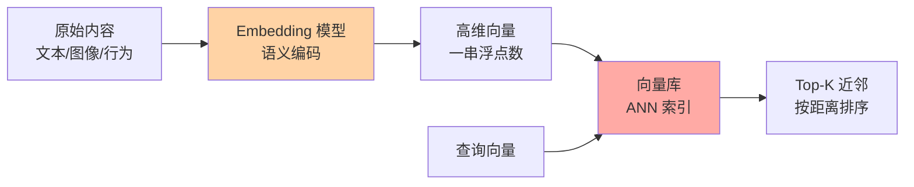
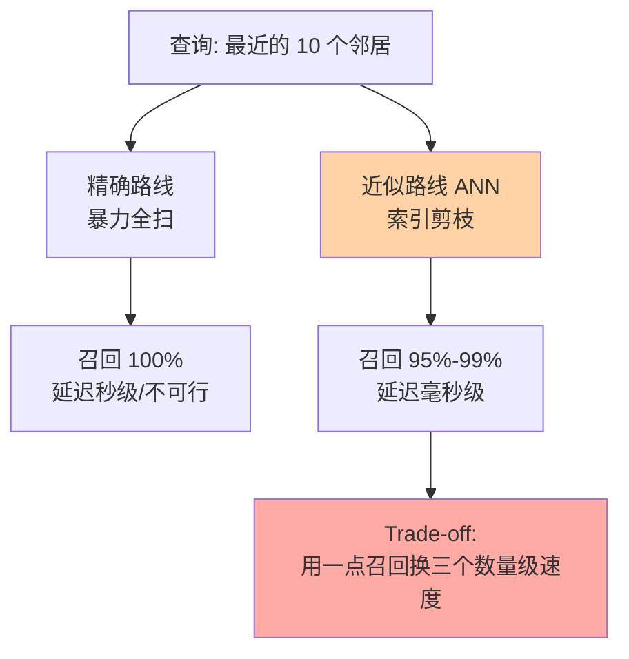

# 向量数据库是什么与嵌入原理：把语义变成坐标

> 一句话：向量数据库是「按距离找邻居」的库——把文本/图像/行为先经 Embedding 模型压成一串浮点数（向量），语义相近的内容在向量空间里距离就近，检索时不再比关键词，而是量距离。

## 🎯 本文核心

**核心一句话：Embedding 把语义变成了几何坐标——「相似」从字符串匹配问题变成空间距离问题；而 B+ 树只能查「等值与范围」，查不了「最近的 N 个邻居」，于是必须换一套索引（ANN 近似最近邻），这是向量数据库存在的全部理由。**

机制链：原始内容 → Embedding 模型编码 → 高维向量入库 → 查询向量算距离 → ANN 索引快速召回 Top-K。本篇四段全挂这条线。

## 一句话摘要

Embedding（嵌入）是用神经网络把一段内容映射成固定长度的浮点数组（如 768 维、1536 维）的过程——训练目标决定了「语义相近的内容，向量在空间中也相近」。向量数据库专为此设计：存储这些向量，并在毫秒级内回答「离这个查询向量最近的 K 个向量是谁」。它不做精确匹配（那是 B+ 树的地盘），做的是**近似最近邻检索（ANN）**——用「牺牲一点召回率」换「快几个数量级」的取舍。

## 一、Embedding 是什么：把语义压成一串数

人判断「苹果手机」和「iPhone」是不是一回事，靠语义；传统数据库判断，靠字符串相等——`"苹果手机" != "iPhone"`，于是搜不到。Embedding 的思路是换一个表示层：**让模型把每段内容编码成一个高维空间中的点，语义近的点挤在一起，语义远的点彼此远离**。

几个业内认知级的直觉：

- **维度**：常见开源/商用模型输出 384、768、1024、1536 维。维度越高表达能力越强，但存储与计算成本也越高——一亿条 1536 维 float32 向量约 600 GB（业内认知），光存就先压垮一台单机。
- **语义几何**：训练好的嵌入空间里，常见现象是「国王 - 男 + 女 ≈ 女王」这类向量算术（经典词向量时代的公开结论），说明几何关系承载了语义关系。
- **模型决定空间**：不同模型的向量**不在同一个空间里**，距离不可比、不可混存。换嵌入模型 = 全量重建向量库，这是很多团队踩过的坑——一次线上事故的真实教训：某团队灰度期新旧模型向量混写进同一集合，检索质量莫名劣化，排查三天才发现是「两个空间的坐标混在了一张地图上」（后文实战提示展开）。

追问一层：为什么「语义近」能被训练出来？因为训练目标本身就是这个——对比学习让「互为正例的样本对」（同义句、相关文档）在空间中拉近，负例推远。**相似度不是检索时才有的魔法，而是训练时就刻进几何结构里的**。

从演进视角看，嵌入技术在过去 5 年里完成了三次跳档：词向量（一词一向量）→ 句/段向量（BERT 之后上下文相关）→ 大模型时代的通用文本嵌入（2023 年前后开源与商用模型密度陡增，公开榜单迭代极快）。每一次演进都意味着旧向量全量作废——这也是「模型版本即存储契约」的由来。

## 5W 速记卡

| 维度 | 一句话 |
|---|---|
| What | 存高维向量 + 按「距离最近」检索的数据库（ANN 近似最近邻） |
| Why | 语义相似无法用关键词/B+ 树表达，必须变成几何距离问题 |
| Who | RAG、推荐召回、以图搜图、语义去重这类「找相似」的业务 |
| When | 语义检索为主 + 数据量十万级以上时引入；精确匹配场景不引入 |
| Where | 位于业务库旁边：主数据在 MySQL，向量 + 少量元数据在向量库，按 ID 关联 |

## 二、为什么相似度=距离：三种度量

有了「近=相似」，剩下的问题是：怎么定义「近」？三种主流度量：

| 度量 | 含义 | 适合场景 | 特点 |
|---|---|---|---|
| 余弦相似度 | 两向量夹角的余弦 | 文本语义检索（主流） | 只看方向不看长短，值域 [-1,1] |
| 欧氏距离 L2 | 空间直线距离 | 图像特征、聚类 | 对模长敏感 |
| 内积（点积） | 对应维相乘再求和 | 推荐排序、向量已归一化场景 | 归一化后与余弦等价 |

一个工程细节：**向量归一化（缩放到单位长度）之后，余弦相似度、L2 距离、内积三者的排序结果一致**——所以很多系统干脆统一用内积，计算最快。选错度量的典型症状：明明语义相关的文档排不进 Top-K，排查半天发现是「没归一化还用了 L2」这类配置问题。曾在生产环境见过一次线上复盘：某语义搜索上线后相关文档永远排不进来，最后定位是写入侧做了归一化、查询侧没做，两侧度量约定不一致——这类故障几乎都指向同一个根因：**度量方式是嵌入模型说明书里写死的约定，不是可以随手换的参数**。

打破砂锅再问一层：为什么归一化能让三种度量等价？单位长度下，内积只由夹角决定（等价于余弦）；而 L2 距离的平方 = 2 - 2×内积，单调关系反转后排序完全一致。数学上的一句话，省掉的是线上一次次「排序看起来乱」的故障排查。

## 三、为什么不能用 B+ 树查：ANN 问题

B+ 树（MySQL 索引的底层）解决的是「等值 + 范围」查询：`id = 42`、`age BETWEEN 20 AND 30`——前提是数据**可排序**。而「最近邻」查询的本质不同：

- 一条查询是「**给我离查询向量最近的 10 个向量**」，答案散布在高维空间的各个方向，**不存在一个能圈住它们的连续区间**；
- 高维空间还有「维度灾难」：维度上去之后，点与点的距离分布趋同，传统的空间划分索引（如 KD 树）在高维下性能退化到接近全表扫描——这是计算几何领域的公开结论；
- 暴力扫描（一亿条向量逐条算距离）精度 100%，但一次查询要扫几百 GB 数据，毫秒级响应下不可行。

于是唯一出路是**近似最近邻（ANN）**：不追求 100% 找到真最近邻，追求「95%+ 召回 + 毫秒级延迟」的取舍。怎么近似——靠索引结构提前组织好向量（下一篇讲 HNSW 与 IVF），查询时只访问一小部分数据。这就是向量数据库与 MySQL 的本质分工：**B+ 树回答「它在哪」，ANN 回答「谁跟它最像」**。

## 四、典型使用场景与边界

### 典型使用场景

- **RAG 检索增强生成**：把文档切片做 Embedding 入库，用户提问时先向量检索出相关片段，再喂给大模型生成答案——当前最热的主战场。
- **推荐/相似内容**：把用户与物品都嵌成向量，召回阶段取「离用户兴趣最近的 K 个物品」。
- **图像/音频检索**：以图搜图、以音搜音——像素比对不现实，特征向量比对一行代码。
- **去重与聚类**：语义去重（改写过的抄袭文距离依然很近）、用户分群。

### 量级意识

十万级向量用暴力扫描（flat 索引）就够，精度还最高；百万级开始必须上 ANN 索引；千万级以上要考虑内存容量与分片；亿级则是分布式向量库或量化压缩的必然战场——量级每跳一档，索引选型与成本结构都不同。

### 与关键词检索的区别

| 维度 | 关键词检索（倒排索引/ES） | 向量检索（ANN） |
|---|---|---|
| 匹配逻辑 | 词项精确命中 | 语义距离近似 |
| 查「iPhone」能召回吗 | 搜「苹果手机」搜不到 | 能（语义近） |
| 精确过滤（价格=99） | 强项 | 弱项（需混合查询） |
| 可解释性 | 命中了哪个词，可解释 | 距离近，解释模糊 |

两者不是替代关系——生产实践中的主流是**混合检索**：向量召回语义近邻 + 关键词过滤硬条件，两路结果融合排序。设计的哲学是「语义找相似，结构做过滤」，各干各的强项。

### 误区与不适用

- **误区一：向量库能当主存储**。向量库里通常只存向量 + 少量元数据，业务主数据仍在关系库，靠 ID 关联——把业务字段全塞向量库再反查，是把锤子当扳手用。
- **什么数据都不该直接上向量库**：精确匹配、事务、强过滤为主的场景，老实用 MySQL/ES。向量检索的代价（索引内存、召回率损耗、模型依赖）在这些场景全是纯亏。

💡 **实战提示 1**：换嵌入模型 = 全量重算向量 + 重建索引，业务上等于一次停机级迁移。选型时先把「维度、度量方式、模型版本」当死契约锁定，升级模型要走双写灰度，不要原地换。

💡 **实战提示 2**：先算存储账再选维度。一亿条 768 维 float32 约 300 GB（业内认知），16GB 内存的单机根本装不下全量索引——维度选择是成本决策，不是效果决策。

💡 **实战提示 3**：文本切片（chunk）质量对检索效果的影响常大于向量库选型本身——切片太碎语义不完整，太长噪声稀释相似度。先调切片策略与 top_k，再考虑换库换模型，排查顺序别倒置。

💡 **实战提示 4**：整体架构上把向量库放在「召回层」而不是「真相层」——上游接业务库（真相源），下游接排序模型，上下游各自可独立演进；模块边界画清楚之后，换库、换模型、扩容都只动一层。

## Trade-off：精确、速度、成本三角

向量检索的核心取舍是**召回率-速度-资源**三角：暴力扫描召回 100% 但慢；ANN 索引快但召回 95%-99%；量化压缩省内存但再损一点精度。没有全赢的配置，只有按业务容忍度选的平衡点——这是这门技术的第一性取舍，下一篇的索引参数全是在这个三角上滑动。

## 开放问题与我的判断

值得讨论的两个未定论方向：一是多模态统一嵌入空间会不会让「按内容模态分库」的架构演进成「单库多模态」——我的判断是分库仍会长期存在，因为不同模态的量级与更新节奏差异太大，模块边界拆开反而稳定；二是嵌入模型迭代速度远快于数据库 schema 演进，「向量版本管理」会不会成为向量库的标配能力——这个尚无定论，但双空间灰度切换已是当下可落地的过渡形态。

## 你们可能会问

**Q1：向量一定要用专门的向量数据库存吗？我 MySQL 加一列存 JSON 不行吗？**
存没问题，查不行——MySQL 没有 ANN 索引，只能全表扫描逐行算距离，十万条以上延迟就不可接受了。数据量小（十万级以内、低频查询）确实可以不引入新组件；量级上去后要么专用向量库，要么 pgvector/Elasticsearch 这类内嵌向量能力的现有组件（选型对比在第三篇展开）。

**Q2：Embedding 模型输出的向量我能看懂每一维的含义吗？**
不能，也不需要。维度没有人类可读语义，它是模型内部表征的坐标——理解嵌入靠「距离与聚类」这种整体行为，不靠逐维解读。这也是为什么向量检索的可解释性弱于关键词检索，是结构性的取舍而非工程缺陷。

**Q3：图像和文本能放进同一个向量空间检索吗？**
可以，前提是用**多模态模型**（如公开的 CLIP 类模型）编码——它训练时就把图像与文本对齐到同一空间，所以「用文字搜图」才可行。但两个不同模型编的向量绝不能混存，空间不同距离无意义。

**Q4：为什么向量库都强调「内存友好」？**
因为 ANN 索引（尤其图索引）随机访问多，放磁盘上 IO 次数会拖垮延迟；而全量向量动辄几十上百 GB，内存装不下就要靠量化压缩或磁盘索引（如公开的 DiskANN 路线）做取舍——内存容量是向量库成本结构的核心变量。

## 自测三问

1. 为什么「苹果手机」搜不出「iPhone」，而向量检索可以？（答：语义几何——嵌入空间中两者距离近）
2. 归一化之后，余弦/内积/L2 三个度量的排序结果有什么关系？（答：排序一致，工程上常统一用内积）
3. B+ 树为什么做不了最近邻查询？（答：最近邻散布各方向无连续区间，高维下空间索引退化，只能近似）

## 🎯 核心带走

- **Embedding = 语义坐标化**：相似度从字符串问题变成距离问题，训练目标决定几何结构
- **度量三选一**：余弦看方向、L2 看直线距离、内积最快；归一化后排序等价
- **B+ 树的边界**：等值/范围是它的地盘；最近邻只能走 ANN——用少量召回换毫秒级延迟
- **边界意识**：向量库不做精确匹配与事务；主数据留关系库，向量库只管「找相似」
- **失效点**：换模型=重建全库；度量配错、切片太差，什么库都救不回来

## 📌 数据与事实声明

- 向量维度（384/768/1536 等）、存储体积估算、召回率区间均为业内认知与公开模型文档口径，实际以所选模型与硬件实测为准
- 「国王-男+女」向量算术为词向量研究领域的公开经典结论
- DiskANN、CLIP 为公开项目/论文名称，非商业推荐

## 📚 参考资料

| 资料 | 说明 |
|---|---|
| ANN 最近邻检索相关公开综述（ANN Benchmarks 等） | 近似检索召回率与速度取舍的公开评测 |
| Milvus / Qdrant / pgvector 官方文档 | 度量方式、归一化与索引类型的工程约定 |
| J. Johnson 等《Billion-scale similarity search with GPUs》 | 亿级向量检索的公开论文 |
