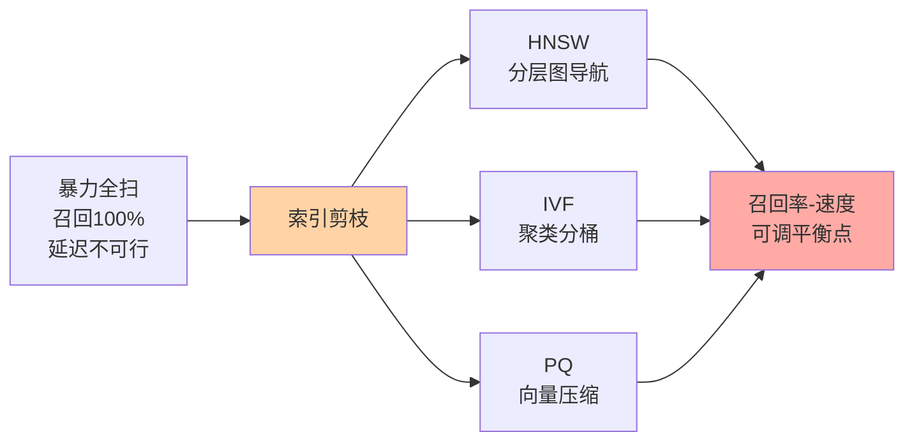
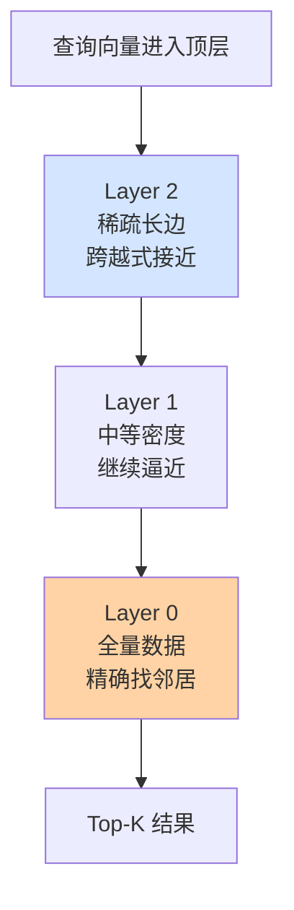
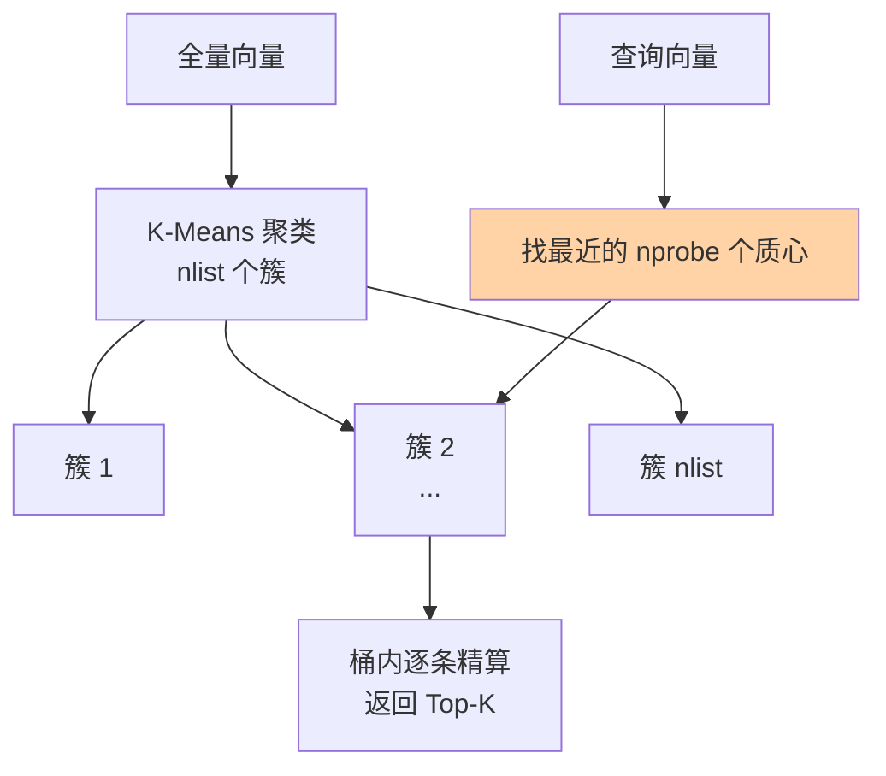

# 索引算法 HNSW 与 IVF：近似检索怎么组织数据

> 一句话：ANN 索引的全部使命是「少算距离还别漏掉真邻居」——HNSW 用分层跳表式地图导航，IVF 先分桶再桶内精查，PQ 把向量压瘪省内存，三者的参数旋钮全在调同一件事：召回率与速度的取舍。

## 🎯 本文核心

**核心一句话：近似检索 = 用索引结构把「全量算距离」剪枝成「只算一小部分」——HNSW 靠分层图导航剪枝，IVF 靠聚类分桶剪枝，PQ 靠压缩降低每次计算与存储的成本；三者的可调参数都是在「召回率-速度-内存」三角上滑动的旋钮。**

机制链：全扫太慢 → 索引剪枝（图导航 / 分桶）→ 参数控制访问量 → 召回率与延迟可调。本篇三段全挂这条线。

## 一句话摘要

HNSW（分层可导航小世界图）把向量组织成「高层稀疏跳远、底层稠密跳近」的多层图，查询从顶层出发逐层下降，像查跳表一样把搜索范围指数收窄；IVF（倒排文件索引）先把向量聚成上千个簇，查询只访问离查询向量最近的几个簇；PQ（乘积量化）把长向量切成子段、每段用码本编号压缩，让内存装得下亿级向量。三者常组合使用（如 IVF-PQ），选型与调参的本质都是**召回率-速度-内存**的取舍。

## 5W 速记卡

| 维度 | 一句话 |
|---|---|
| What | 把「全量算距离」剪枝成「算一小部分」的索引结构：HNSW 图导航 / IVF 分桶 / PQ 压缩 |
| Why | 暴力扫描毫秒级响应下不可行，索引是 ANN 可用的前提 |
| Who | 所有向量检索系统——区别只在选哪种、参数怎么调 |
| When | 十万级以上才需要；量级每跳一档重新审视索引选型 |
| Where | 向量库内核层：建索引是一次性成本，查询时按索引导航 |

## 一、HNSW：分层可导航小世界图

### 直觉：一张跳表亲缘的地图

导航的直觉：在一个陌生城市找某家小店，先看全省地图定位到市，再看市图定位到街区，最后在街区图里逐家找——**每换一层地图，分辨率升一级，搜索范围收一级**。HNSW 把这个直觉数学化：所有向量在底层（Layer 0）互相连成稠密的「近邻图」；往上每层按概率抽样（经典参数 M 个邻居、层间约 1/4 递减，公开论文口径），越往上点越少、连线越「跳远」。

它与跳表的亲缘是结构性的：跳表靠「跨步大的上层索引」把链表查找从 O(n) 压到 O(log n)，HNSW 靠「上层长边」把图搜索的跳数从全图级压到对数级——**上层负责跨越式接近，底层负责精确定位**。

### 查询与建图

查询流程：入口点进顶层 → 贪心地走向「离查询更近的邻居」 → 局部最优后下降一层 → 底层收敛，沿途维护一个候选集，最终取 Top-K。建图则是逐条插入：为新向量在每层找 M 个近邻连边。追问一层：为什么图中导航能逼近全局最近邻而不迷路？靠的是「可导航小世界」性质——图同时具备**聚簇性**（近邻互连）与**捷径性**（长边跨簇），理论上长程边让期望路径长度呈对数级（公开论文结论）。

**失效点**：贪心导航不是全局最优——一旦早期选错「下坡方向」，可能困在局部区域错过真最近邻，这就是召回率不到 100% 的根源，也是 ef（候选队列长度）参数存在的理由：候选集越大，走回头路的余地越大，召回越高、速度越慢。

## 二、IVF：倒排文件的分桶哲学

### 先分桶，再精查

IVF 的思路更朴素：先用 K-Means 把全量向量聚成 nlist 个簇（如 1024 个），每簇记一个「质心」；查询时先算查询向量离哪些质心最近，只去那 nprobe 个簇里逐条精算距离。命名里的「倒排文件」沿用自文本检索——从「簇 → 成员向量」的倒排视角组织数据。

取舍一眼可见：nprobe=1 快但容易漏（真邻居可能落在隔壁簇的边界上）；nprobe 调大召回升、速度降。IVF 的额外优势是**天然支持增量与磁盘友好**（簇内连续存放），缺点是**需要训练**（聚类要在采样数据上先跑一遍），且插入分布漂移后需要重新训练。设计思想上的分野：HNSW 是「图导航」哲学（免训练、内存密集），IVF 是「空间划分」哲学（需训练、结构规整）——没有谁取代谁， workload 不同选择不同。

### 量化压缩：PQ 把向量压瘪

内存是亿级场景的硬约束。PQ（乘积量化）的做法：把 128 维向量切成 8 段，每段 16 维；对每段维度聚成 256 类，得到 8 张「码本」；之后每个子段只记它的类编号（1 字节）——128 个 float（512 字节）压成 8 字节，压缩比 64 倍（经典配置，公开论文口径）。距离计算用查表近似，速度也快。

代价：压缩是有损的，算出的距离是近似值，召回率再降一截。IVF-PQ（分桶+压缩组合）因此成为亿级向量的事实标准组合——**先分桶减少计算量，再压缩减少内存量**，两个瓶颈各用一招。

## 三、典型使用场景与取舍

### 典型使用场景

- **中小规模 + 高召回要求**（百万级以内、内存充裕）：HNSW 是当前业内默认首选——免训练、低延迟稳定（公开文档与benchmark的普遍口径）。
- **超大规模 + 内存敏感**（亿级以上）：IVF-PQ / 磁盘索引路线，接受召回率再让一点，换内存与成本可控。
- **插入频繁、分布漂移**：HNSW 免训练可随时插入；IVF 聚类漂移后要重训——线上生产环境中这个差异常比纯性能数字更能决定选型。

### 参数与量级意识

| 索引 | 关键参数 | 调大效果 | 调小效果 |
|---|---|---|---|
| HNSW | M（每点连边数）/ ef | 召回↑ 内存↑ 速度↓ | 省内存 速度快 召回降 |
| IVF | nlist（簇数）/ nprobe（查桶数） | 召回↑ 延迟↑ | 快但易漏边界邻居 |
| PQ | 子段数 / 每段类数 | 精度↑ 内存↑ | 压缩比高 精度损 |

量级上：十万级用 flat 暴力扫即可，索引都是负优化；百万级 HNSW/IVF 任选；千万级开始算内存账；亿级必须压缩或分片——索引选型跟着量级走，不预支复杂度。

从演进视角看，ANN 索引经历了「树结构（KD 树，高维失效）→ 哈希（LSH，召回不稳）→ 图/分桶（HNSW/IVF，当前主流）→ 混合压缩（IVF-PQ/DiskANN）」的四代更替，过去 5 年里图索引逐渐成为默认底座——算法在演进，但「剪枝换速度」这条主线从未变过。

### 误区与局限

- **误区一：索引越高级越好**。十万级数据上 HNSW 反而比暴力扫描慢（图的导航开销大于省下的计算），适用边界要先看量级。
- **误区二：参数可以拍脑袋定**。ef/nprobe 的合理解读依赖数据分布，别人家的推荐值不可照抄——用标注集实测召回率，是唯一可靠的依据。
- **局限：索引与数据强耦合**。换维度、换度量、大规模删除后，索引都要重建或整理——「建好一劳永逸」不成立，运维成本要计入选型。

### 与 B+ 树类精确索引的区别

| 维度 | B+ 树（精确） | HNSW/IVF（近似 ANN） |
|---|---|---|
| 查询语义 | 等值/范围，结果确定 | 最近邻，结果概率性 |
| 召回保证 | 100% | 95%-99% 可调 |
| 更新 | 随时插入 | HNSW 可插 / IVF 需重训 |
| 结果可复现 | 是 | 参数不变才稳定 |

💡 **实战提示 1**：先测召回率再上线。用一组人工标注的相关集合算 Recall@K，召回不达标先调 ef/nprobe，而不是急着换索引类型——大部分「检索不准」的排查结论是参数保守，不是算法不行。

💡 **实战提示 2**：HNSW 的 ef 必须大于 Top-K，否则候选集比要的结果还少，召回必然塌；生产实践中常见事故是「K 调大了 ef 忘了跟着调」，线上表现为某类查询突然变差，复盘时一查参数对不上。

💡 **实战提示 3**：建索引时间与内存峰值要预演——HNSW 建图是内存密集操作，百万级向量重建一次可能吃掉数 GB 峰值内存（业内认知），别在生产高峰期做全量重建，翻车代价是拖垮同机其他服务。整体架构上索引重建应拆为独立模块：新旧索引并行服务、验证召回达标后再切换上下游流量，模块边界清晰才能随时回退。

💡 **实战提示 4**：一次线上排查记录——某检索服务夜间批量删除后召回率骤降，复盘发现是大量删除让图索引出现「断链」，导航到不了部分区域；结论是删除比例高的场景要选支持软删除与定期整理的索引方案，或干脆用 IVF 路线降低图维护成本。

## Trade-off：没有免费的三赢

召回率、延迟、内存三者构成硬三角：任何参数调优都是在三角上滑动，不可能同时三优。IVF 用「训练成本 + 边界漏检」换「桶内计算量小」；PQ 用「距离失真」换「内存 64 倍压缩」；HNSW 用「内存换稳定低延迟」。选型的本质是回答：**你的业务愿意在哪一维付账单**。

## 开放问题与我的判断

值得讨论的未定论方向：一是磁盘索引（DiskANN 类公开路线）会不会让「内存换速度」的取舍成为历史——我的判断是不会彻底替代，内存索引在延迟尾部稳定性上仍有结构性优势；二是图索引与量化会在更多产品里深度融合（图导航 + 压缩存储），单一索引的边界在演进中越来越模糊——这个趋势在公开的产品文档里已可见端倪，但最终收敛形态尚无定论。

## 你们可能会问

**Q1：为什么 HNSW 召回率到不了 100%？调参数能到吗？**
贪心导航可能困在局部最优——错过藏在「另一侧山坡」的真最近邻。把 ef 调到接近全量时召回逼近 100%，但此时性能退化回暴力扫描，索引失去意义。100% 召回与毫秒延迟在数学上互斥（除非数据量小到全扫可行），这是近似检索的定义级取舍。

**Q2：IVF 聚类要用多少数据训练？新数据一直插入会怎样？**
业内经验口径是用远大于 nlist 的样本（如簇数几十倍）训练质心。持续插入会导致分布漂移——簇的大小与质心位置逐渐失真，边界漏检变多；工程上用「定期重建」或「分而治之的多级 IVF」缓解，HNSW 则没有这个烦恼，这也是它成为默认选项的原因之一。

**Q3：PQ 压缩 64 倍，为什么大家不都用它？**
因为失真。PQ 的距离是查表近似值，排序会出错——对召回敏感的业务（如法律/医疗文档检索）这点精度损失不可接受。压缩比与精度的权衡没有免费午餐，先测业务可接受的召回下限，再决定压不压。

**Q4：这三种索引能组合吗？**
能且常见：IVF-PQ（分桶+压缩）是经典组合；HNSW 也可搭配标量量化。组合的动机是两个瓶颈分开治——计算量靠分桶/导航剪，内存靠压缩省；但每叠一层近似，召回率的管理复杂度也加一层，参数联动测试的成本要计入。

## 自测三问

1. HNSW 与跳表的共同思想是什么？（答：上层稀疏跳远、底层稠密精确，分层把搜索范围指数收窄）
2. IVF 为什么会漏掉真邻居？（答：真邻居可能落在未被选中的相邻簇边界上，nprobe 控制漏检概率）
3. PQ 牺牲了什么换了什么？（答：牺牲距离精度，换数十倍内存压缩与查表加速）

## 🎯 核心带走

- **剪枝是唯一主线**：ANN 索引 = 把「全量算距离」变成「只算一小部分」，HNSW 靠图导航、IVF 靠分桶
- **跳表亲缘**：HNSW 分层图上层跨距、底层精查，期望路径对数级
- **IVF 的软肋**：簇边界漏检 + 需要训练，分布漂移要重训
- **PQ 是内存账**：数十倍压缩换距离失真，亿级场景的必选项
- **失效点**：ef < Top-K、nprobe 过小、PQ 压缩过头——三类典型召回塌方事故全在参数层

## 📌 数据与事实声明

- M/ef/nlist/nprobe/PQ 压缩比等参数效果描述为公开论文与主流开源库文档口径，具体数值随数据分布变化，以实测为准
- 内存峰值、召回率区间为业内认知，非保证值
- HNSW 出自 Malkov 与 Yashunin 公开论文，IVF-PQ 为 Faiss 等公开库的经典组合

## 📚 参考资料

| 资料 | 说明 |
|---|---|
| Malkov & Yashunin《Efficient and robust approximate nearest neighbor search using HNSW graphs》 | HNSW 原始公开论文 |
| Jégou 等《Product Quantization for Nearest Neighbor Search》 | PQ 乘积量化公开论文 |
| Faiss / Milvus / Qdrant 官方文档 | 索引类型、参数默认值与调优建议的工程口径 |
