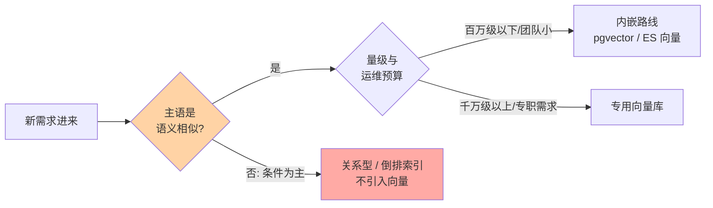
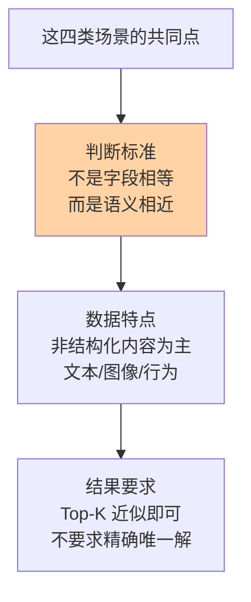

# 场景选型与边界：向量数据库该用在哪、不该用在哪

> 一句话：向量数据库是「语义检索」这件兵器，不是万金油——该用的场景有一个共同前提「按相似度找」，不该用的场景有一个共同信号「条件为主、相似为辅」；选型先分场景，再分路线（专用库 vs 内嵌向量能力）。

## 🎯 本文核心

**核心一句话：向量数据库的选型判断只有两步——第一步问「检索的主语是语义相似还是结构化条件」，前者才轮到向量；第二步问「规模与运维预算养不养得起一个专职组件」，养不起就用 pgvector/Elasticsearch 这类内嵌向量能力的现有组件。**

机制链：场景识别（相似检索吗）→ 路线决策（专职 or 内嵌）→ 边界守住（混合查询/主数据归属）。本篇三段全挂这条线。

## 一句话摘要

该用的场景共享一个画像：**召回的主语是「语义相近」**——RAG 知识检索、推荐相似召回、以图搜图、语义去重；不该用的场景共享另一个画像：**查询主语是精确条件**——等值/范围过滤选普通索引，多条件报表选关系型。定了「该用」之后还有第二层路线决策：专用向量库（Milvus/Qdrant 等公开产品）能力强但多养一个组件；pgvector 或 Elasticsearch 向量能力内嵌在现有存储里，架构简单但规模与功能有上限。两条路线没有对错，只有与量级、团队能力的匹配。

## 5W 速记卡

| 维度 | 一句话 |
|---|---|
| What | 向量数据库的场景边界与选型路线决策：该用/不该用 + 专用库/内嵌两条路线 |
| Why | 语义检索组件被滥用是常见架构事故源，边界先于选型 |
| Who | 评估「要不要引入向量检索」的团队与架构评审 |
| When | 新检索需求立项时先做「查询主语分诊」，再谈组件选型 |
| Where | 决策产物落进架构文档：场景清单 + 路线结论 + 迁移预案 |

## 一、该用的场景：主语是「找相似」

### 四类典型使用场景

- **RAG 检索增强生成**：文档切片 → 嵌入入库 → 按问题向量取 Top-K 相关片段 → 喂给大模型。向量检索是 RAG 的召回引擎，召回质量直接决定回答质量——这是当前向量数据库最主流的落地形态。
- **推荐与相似内容**：用户/物品双塔嵌入，召回阶段取「离兴趣最近的 K 个物品」；内容平台找相似文章、相似视频同理。
- **图像/音频检索**：以图搜图、版权检测、以哼搜歌——像素级比对不可行，特征向量比对是唯一工程解。
- **语义去重与聚类**：改写洗稿后的文本关键词全变但语义不变，向量距离依然很近——内容平台去重、工单合并、用户分群都靠这个性质。

判断口诀：**「如果业务能接受『返回相似的 N 条』，就是向量场景；如果业务要求『返回唯一正确的那条』，就不是」**。

## 二、不该用的场景：误用的代价

## 二、不该用的场景：误用的代价

### 边界清单

- **精确匹配 → 普通索引**：按订单号查订单、按用户名查用户——B+ 树哈希一下精确命中，又快又确定；用向量检索结果是「概率性近似」，纯属用错工具。
- **结构化过滤为主 → 关系型**：「查 2025 年华东区销售额 Top 10 产品」这种多维条件聚合，SQL + 列存/普通索引是主场；向量距离帮不上忙。
- **强事务 → 关系型**：转账扣款要求 ACID，向量库不提供事务保证——数据一致性命悬于向量库是架构红线。
- **纯关键词精确检索 → 倒排索引**：法律条文编号检索、日志关键词过滤，倒排索引（ES 类）精确且可解释。

误用的代价不只是「慢」，更是**结果的不可解释与不可复现**：业务方问「为什么这条没查出来」，向量检索只能回答「距离排不进 Top-K」——排查成本高且难服众。一次真实复盘：某团队把商品搜索从 ES 整体迁到向量检索，上线后客诉激增——用户搜型号编码「A-1000X」返回了一堆「相似但不对」的商品，排查一周才发现根因不在检索质量，而在场景误用；回迁为「倒排精确匹配为主 + 向量相似召回为辅」的混合架构后客诉归零。复盘结论写进了团队选型清单：**查询主语是编码/型号/ID 时，相似性是噪声不是信号**。

追问一层：为什么「语义相似」在这种场景反而有害？因为嵌入模型把「A-1000X」与「A-1000Y」编码得极近——模型认为它们语义像，但业务上它们是两个不同商品。**模型的相似观与业务的相等观不一致时，必须用精确机制兜底**，这是选型判断里最容易被忽略的一层。

## 三、两条路线：专用库 vs 内嵌能力

### 路线对比

| 维度 | 专用向量库（Milvus/Qdrant 等公开产品） | 内嵌向量（pgvector / ES 向量能力） |
|---|---|---|
| 架构复杂度 | 多一个专职组件，需运维扩容 | 复用现有存储，无新组件 |
| 规模上限 | 十亿级、分布式原生 | 千万级以内较从容（业内认知） |
| 功能完整度 | 索引种类/混合查询/多租户全 | 够用为主，高级特性少 |
| 过滤能力 | 元数据过滤原生支持 | pgvector 靠 SQL WHERE，ES 靠过滤器 |
| 适合团队 | 有专职存储运维、量级大 | 中小团队、快速验证 |

### 与全文检索的区别

同为「检索」，向量检索与全文检索（倒排索引）的底层机制完全不同，边界必须画清：

| 维度 | 向量检索 | 全文检索（倒排索引） |
|---|---|---|
| 底层机制 | 高维空间距离计算（ANN 剪枝） | 词项倒排表精确命中 |
| 匹配原理 | 语义相近即召回，同义改写可召回 | 分词后词项必须存在 |
| 结果性质 | 概率性 Top-K，参数可调 | 确定性结果，可复现 |
| 强项场景 | 语义模糊、多模态内容 | 关键词精确、过滤聚合 |

穿透到机制层看：两者连「数据组织」都不同——倒排索引按「词 → 文档列表」组织，向量索引按「空间邻近性」组织；所以混合检索不是「一个引擎两种模式」，而是**两套机制并行、结果融合**，架构上要按两路召回分别设计。

### 路线决策的思考方式

决策依据不是「哪个更强」而是「哪个与当前量级匹配」：十万级验证期，pgvector 一列起步，不引入新组件；百万级功能期，看是否需要混合检索与高级过滤——ES 向量能力适合已有 ES 的团队平滑扩展；千万级以上或多模态大流量，专用库的分布式能力才真正开始产生价值。

从演进视角看，这两条路线的边界在移动：过去 5 年里「专用组件能力不断内嵌进通用数据库」（pgvector 现象），同时专用库也在补元数据过滤与易用性——业内公开的普遍判断是：**中等规模以下内嵌路线会吃掉大部分增量，超大规模仍是专用库的战场**。

💡 **实战提示 1**：先用「查询主语」做分诊再谈选型——把线上查询日志按「语义型/条件型」粗分一遍，条件型占大头就别引入向量组件，省下的是整个运维成本。

💡 **实战提示 2**：混合查询（向量相似 + 条件过滤）是最容易踩坑的地带：先过滤后检索还是先检索后过滤，召回率与延迟差异巨大；选型时把「典型混合查询的比例」当核心测试用例，别只测纯向量查询。

💡 **实战提示 3**：主数据永远留在关系库——向量库只放向量 + 检索所需元数据，靠 ID 关联。上下游边界画清楚，换向量库、重建索引才不会牵连业务主链路；这是架构上最值钱的一条纪律。

## Trade-off：简单与能力的取舍

内嵌路线用「功能上限」换「架构简单」；专用库用「运维成本」换「规模与功能」。选型的本质是给未来 12 个月的数据量级与查询复杂度定价——预支超大规模的架构复杂度是过度设计，滞留在验证期的单机方案扛真实流量是事故温床。追问一层：能不能「先内嵌后迁移」？可以且常见——pgvector 起步、量级到顶再迁专用库是业内成熟路径，但迁移成本（全量重建 + 双写切换）要在起步时就写进架构预案，别当成「到时候再说」。

## 开放问题与我的判断

值得讨论的未定论方向：一是「向量能力内嵌进一切存储」的趋势会不会让独立向量库长期边缘化——我的判断是超大规模与多模态场景仍需要专职引擎，但中小规模市场内嵌化不可逆；二是数据库「多模态合一」（一个库同时做关系/向量/全文）是否会终结「按查询类型选库」的选型方法论——目前公开产品的实现都是「主引擎 + 插件能力」，真正的合体尚无定论，值得持续观察。

## 你们可能会问

**Q1：我的业务既要语义搜索又要精确过滤，怎么办？**
这正是混合检索的标配场景：向量召回语义近邻 + 元数据条件过滤（价格、类目、时间）。路线选择上，ES 向量能力或专用库的过滤支持都成熟；关键是用真实查询分布测「先过滤还是先检索」的延迟与召回，别靠猜。

**Q2：RAG 一定要向量数据库吗？数据量小能不能简化？**
量级小（十万切片以内）时 pgvector 甚至内存检索（如公开的 Faiss 进程内方案）都够；RAG 的效果瓶颈通常在切片策略与重排序，不在库本身。组件选型跟着量级走，别让架构宣传页替你做决定。

**Q3：怎么判断该从 pgvector 迁到专用向量库了？**
三个信号：内存装不下全量索引开始频繁换入换出、查询 P99 持续超标且参数调优无效、需要多模态/多租户等高级特性。命中任一开始预研，命中两个启动迁移——迁移要走双写灰度，别硬切。

**Q4：向量检索与全文检索的边界在哪？同一个 ES 里两者都有，怎么分？**
边界在「匹配语义」：全文检索匹配词项（分词后精确命中），向量匹配语义（距离近似）。ES 里两者是并存的两种字段类型——文本字段走倒排、dense_vector 字段走向量，生产实践中常用「双路召回 + 融合排序」各取所长，而不是二选一。

## 自测三问

1. 判断「该不该用向量库」的第一个问题是什么？（答：查询主语是语义相似还是结构化条件）
2. 专用库与内嵌路线的决策变量是什么？（答：量级、查询复杂度、运维预算三者的匹配，不是绝对强弱）
3. 型号编码搜索为什么不该用向量？（答：主语是精确标识，相似性是噪声；应倒排精确匹配）

## 🎯 核心带走

- **一句话判断法**：能接受「相似的 N 条」→ 向量场景；要求「唯一正确的那条」→ 不是
- **四类该用**：RAG 召回、推荐相似、图像/音频检索、语义去重
- **三类不该用**：精确匹配、结构化过滤为主、强事务——误用的代价是结果不可解释
- **两条路线**：内嵌（pgvector/ES）换简单，专用库换规模；先内嵌后迁移是成熟路径
- **失效点**：主数据混入向量库、混合查询没实测、迁移没预案——三个最贵的坑

## 📌 数据与事实声明

- 各路线规模上限（千万级/十亿级等）为业内认知与公开产品文档口径，实际受硬件与数据分布影响
- Milvus/Qdrant/pgvector/Faiss 为公开开源项目名，仅作技术路线指代，非商业推荐
- 文中复盘场景为行业常见案例的匿名化改写，非特定公司事件

## 📚 参考资料

| 资料 | 说明 |
|---|---|
| pgvector / Milvus / Qdrant 官方文档 | 两条路线的能力边界与规模口径 |
| Elasticsearch 向量检索官方文档 | 混合检索与过滤器的工程实现 |
| 《Retrieval-Augmented Generation for Knowledge-Intensive NLP Tasks》公开论文 | RAG 召回机制原始出处 |
