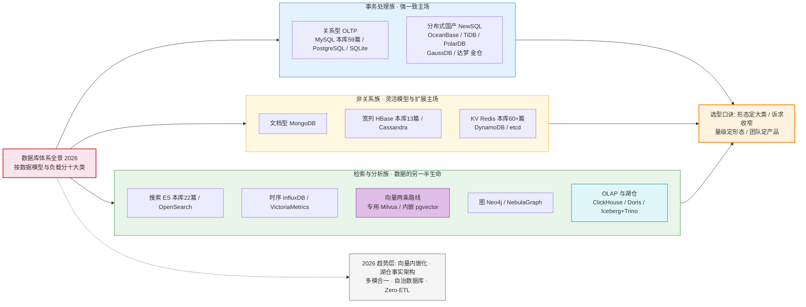
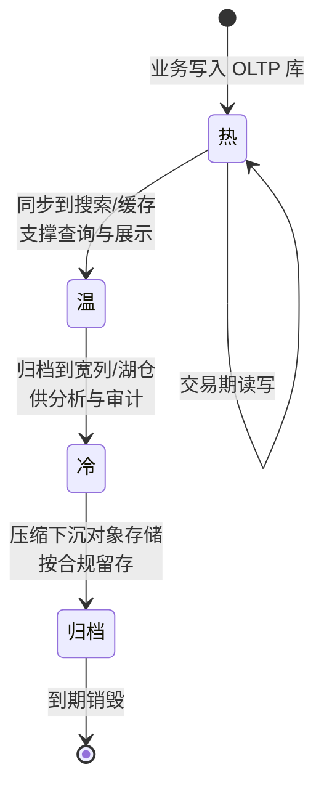
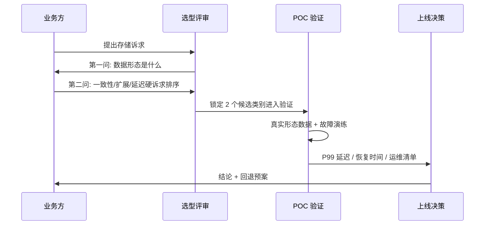
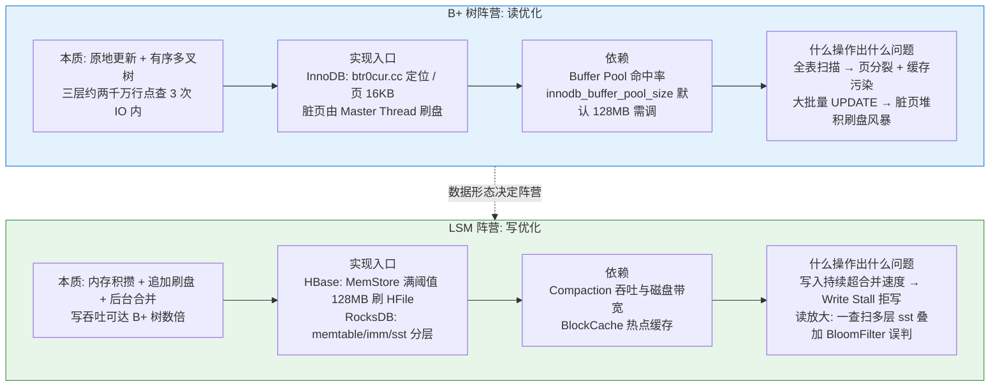
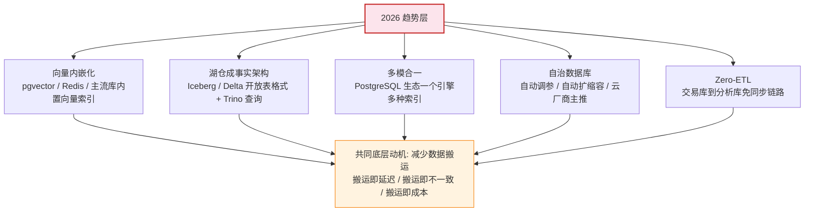
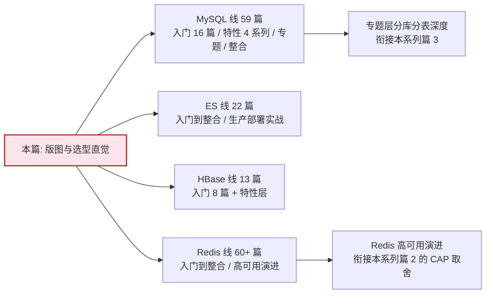

# 数据库全景地图：十大类一张图

> 入门层教你「一个库怎么用」，特性层教你「它为什么快」，专题层教你「场景怎么选」——本篇是数据库体系总论系列的**开篇**：先把整张版图摊开，十大类每类回答三个问题（本质特征是什么 / 代表产品是谁 / 什么时候选它），再叠加 2026 趋势层与**本库已有系列互指地图**。看完这张图，你面对任何一个存储选型问题，都应该能先说出「它属于哪一类、邻座是谁」。

## 一句话摘要

数据库版图按「数据模型 + 工作负载」分成十大类：关系型 OLTP、分布式 NewSQL、文档、宽列、KV、搜索、时序、向量（专用与内嵌两条路线）、图、OLAP+湖仓——**数据形态决定大类，硬诉求收窄产品，量级决定部署形态**；2026 年的版图正在从「分」走向「合」，但每一次「合」都以运维复杂度为代价。

## 🎯 本文核心

**核心一句话：数据库选型的第一性原理是「数据形态决定存储引擎的底层结构，底层结构决定这一类库擅长什么、永远不擅长什么」——B+ 树天生为随机点查与范围扫而生，LSM 树天生为海量写入而生，倒排索引天生为全文检索而生，HNSW 图索引天生为相似度近邻而生。十大类不是十种口味偏好，而是十种不可兼得的物理取舍。**

机制链（本篇的叙述顺序挂在它上面）：全景海报图（版图与口诀）→ 十大类逐类三问（本质/产品/时机）→ B+ 树与 LSM 树的四要素图（版图背后的底层分野）→ 2026 趋势层（分与合的轮回）→ 本库系列互指地图（怎么接着学）。

## 5W 速记卡

| 维度 | 一句话 |
|---|---|
| What | 十大类数据库的版图、每类三问与 2026 趋势层 |
| Why | 选型错误的代价在架构级——换库等于换地基 |
| When | 新项目选型 / 存量系统扩容评审 / 学习路径规划时 |
| Where | 本页版图 → 各库系列（MySQL/ES/HBase/Redis）→ 专题层选型深度 |
| How | 形态定大类 → 诉求收窄 → 量级定形态 → 团队能力定产品 |

## 一、开篇海报图：数据库体系全景（2026 · 十大类）

> 与 `data/index.md` 首页全景图同款设计：三大族分区着色，每类标注代表产品与本库积累，趋势层虚线挂载，口诀收尾。数据截至 2026-09（检索核验口径）。

**怎么读这张海报图**：三大族按「它为谁而生」分区——事务处理族的底层是 B+ 树与 ACID 语义，非关系族的底层是 LSM 树与灵活数据模型，检索与分析族的底层是倒排索引、列存与专用索引结构。每一类格子里标了代表产品与**本库已有积累**（MySQL 59 篇 / ES 22 篇 / HBase 13 篇 / Redis 60+ 篇），学任何一个库时都能顺着格子找到邻座的边界文章。

再补一张**数据的生命周期状态机**——同一份数据往往不止属于一个格子，它会随时间在类别间迁移，这也是「多库并存」的根本原因：

状态机的每一条迁移边都对应一条数据同步链路，每条链路都是成本与不一致风险的来源——**类别选得越准，迁移边越少**，这是全景图除了「选型」之外的第二个用途：审视存量系统的数据流有没有绕远路。

## 二、十大类逐类三问

每类只回答三问：**本质特征是什么（底层结构决定的能力边界）/ 代表产品是谁 / 什么时候选它**。先给横向对比总表，再逐类展开。

| 类别 | 本质特征 | 代表产品 | 选它的第一信号 | 付出的代价 |
|---|---|---|---|---|
| 关系型 OLTP | 行存 B+ 树 / ACID 强事务 / SQL 生态 | MySQL / PostgreSQL / SQLite | 结构化数据 + 强一致交易 | 单机容量与写入天花板 |
| 分布式 NewSQL | 分片透明 + 分布式强一致 | OceanBase / TiDB / PolarDB / GaussDB / 达梦 金仓 | 单机分库分表撑不住且不想改业务 | 组件复杂度 / 运维门槛 |
| 文档型 | 半结构化文档模型 / 灵活 schema | MongoDB | 字段形态多变的业务对象 | 跨文档事务弱 / JOIN 弱 |
| 宽列 | LSM 列族 / 海量随机读写 | HBase / Cassandra / ScyllaDB | 亿级行 + 高吞吐写 | 二级索引与 SQL 弱 |
| KV | 哈希点查 / 内存优先 | Redis / DynamoDB / etcd | 缓存 / 计数 / 分布式锁 | 只适合 key 维度访问 |
| 搜索 | 倒排索引 / 相关性打分 | Elasticsearch / OpenSearch | 全文检索 / 日志检索 | 写入与更新成本高 |
| 时序 | 时间线压缩 / 降采样 | InfluxDB / TimescaleDB / VictoriaMetrics | 监控 / IoT / 指标流水 | 点更新弱 / 通用查询弱 |
| 向量 | 高维相似度近邻检索 | 专用 Milvus / 内嵌 pgvector | embedding 检索 / RAG | 索引内存成本 / 召回率取舍 |
| 图 | 邻接表 / 多跳遍历 | Neo4j / NebulaGraph | 关系网络多跳查询 | 大规模聚合分析弱 |
| OLAP+湖仓 | 列存 / 向量化 / 开放表格式 | ClickHouse / Doris / Iceberg+Trino | 亿级聚合分析 / 统一分析入口 | 实时点更新弱 |

### 2.1 关系型 OLTP 与分布式 NewSQL

**关系型**的本质是「行存 + B+ 树 + 事务日志」：数据按行组织，主键点查与范围扫都是对数层级（一棵三层 B+ 树可承载约两千万行的定位，业内认知口径），事务由 undo/redo 日志与锁/MVCC 协议兜底。选它当且仅当你有**结构化数据 + 一致性硬要求**——账户余额、订单状态这类「错了就是资损」的数据没有第二选项。代价是单机扩展天花板，这正是 NewSQL 存在的理由。

**NewSQL** 的本质是「把分片做进数据库内核，把分布式一致性藏在 SQL 接口下面」：业务看到的还是一张逻辑大表，内核按范围或哈希分片，用 Paxos/Raft 多数派协议保证副本一致。**为什么不用「分库分表中间件 + MySQL 集群」这个反方案？**——中间件方案业务要自己选分片键、自己处理跨库 JOIN 与分布式事务，改造侵入性强；NewSQL 用运维复杂度换业务透明度。**追问一层：中间件方案是不是就不该选？**——恰恰相反，数据量在千万级、团队对 MySQL 运维经验深厚时，中间件方案的确定性远高于引入一套全新内核；反方案的对错永远挂在对的量级上。信创场景下国产库（达梦 / 金仓 / OceanBase 等，信创前二梯队为公开报道口径）进一步推动了这一类在金融与政务的落地。

### 2.2 文档 / 宽列 / KV：非关系三兄弟

**文档型**的本质是「schema 跟着文档走」：一行就是一个 JSON 文档，字段可增减、可嵌套。适合「对象形态因业务而异」的场景（商品详情、用户画像标签集）。代价：跨文档的事务与 JOIN 弱——需要跨对象强关联查询时它是错误答案。

**宽列**的本质是「LSM 树 + 列族」：写内存、批量刷盘、追加型合并，天然扛海量写入与随机读。适合消息流水、订单归档、用户行为流这类亿级行数据。代价是模型原始——二级索引、复杂查询都要自己搭。本库 HBase 系列 13 篇从数据模型一路讲到 RowKey 设计与 Compaction 治理，是这一类的完整落地叙事。

**KV** 的本质是「哈希点查 + 内存优先」：Redis 把热数据放内存换亚毫秒延迟，etcd 把一致性与_watch 能力做进分布式协调。代价：只能按 key 维度访问，当持久真相源用是事故之源（篇 4 会展开）。

### 2.3 搜索 / 时序 / 图：专用索引三剑客

**搜索**的本质是「倒排索引 + 相关性打分」：分词后建「词 → 文档列表」的映射，查询走倒排链求交。适合全文检索、日志检索、多条件过滤聚合。代价：写入要分词建索引、更新接近重写——把它当主库写是典型误用。

**时序**的本质是「时间线 + 压缩 + 降采样」：同一指标的时间戳序列有极强规律性，专用压缩能把存储压一个数量级。适合监控指标、IoT 传感流水。代价：旧数据点更新几乎不可行。

**图**的本质是「邻接结构原生存储 + 免 JOIN 多跳遍历」：关系型做三度好友关系要多次自连接，图库一次遍历。适合风控关联网络、知识图谱、社交推荐。代价：大规模聚合统计反而不如列存。

### 2.4 向量：2026 年最特殊的一类

**向量库的本质是「高维相似度近邻检索（ANN）」**：把文本/图像 embedding 成几百维向量，用 HNSW 图索引或 IVF 量化索引做「找最相似的 K 个」。它特殊在**两条路线并存**：专用库（Milvus/Qdrant 等）追求规模与召回率调优；内嵌路线（pgvector / Redis / MongoDB 内置向量能力，公开报道口径）把向量做成通用库的一个索引类型。**内嵌化的底层动机**：多数业务的向量数据量在百万到千万级，内嵌索引足以覆盖，还省掉一套独立运维与数据同步链路。**专用库什么时候不可替代？**——亿级向量、需要混合过滤 + 高召回、需要独立扩缩容的场景。

### 2.5 三问怎么问出来：选型评审的现场时序

三问不是文档练习，是评审会上的提问顺序——按这个时序走，能让「形态之争」在动工前暴露：

**设计思想在于把争论前置成提问**：评审会最常见的失败模式是先聊产品再聊需求，聊到最后发现两拨人说的根本不是同一种数据形态。三问时序强制先把「本质特征」问清楚，产品讨论才有共同的坐标系。

## 三、四要素图：版图背后的底层分野（B+ 树 vs LSM 树）

十大类的分野最终落到两种主流存储引擎结构的对抗——这是理解整个版图的「底层开关」。

**这张图的推论**：关系型/NewSQL 的读稳态、宽列/时序的写吞吐、搜索的倒排、向量的 HNSW——每类库的「性格」都能追到引擎层的这个选择。所以选型时问「它底层是什么结构」比问「它支持什么功能」更能预判生产表现；功能会加，结构的物理约束不会消失。这也是存储领域最核心的设计哲学：**为读优化的结构必然牺牲写，为写优化的结构必然牺牲读——没有例外，只有选择。**

## 四、2026 趋势层：五个方向（公开报道口径）

以下趋势均为 2026-09 检索核验的行业公开报道口径，不预测具体产品份额。

**向量内嵌化**：专用向量库解决「有没有」，内嵌化解决「值不值得独立部署」——数据同步链路是隐藏成本，能内嵌就少一套系统。**反直觉的是**：内嵌路线的普及反而扩大了专用库的市场——向量应用先在内嵌路线上验证价值，规模撞顶后再迁移专用库。**湖仓成事实架构**：开放表格式（Iceberg/Delta）让「一份数据多引擎读」成立，数仓与数据湖的边界在消失。**多模合一**：PostgreSQL 生态一个库里塞进了 JSON、时序、向量、全文多种能力（公开报道口径的生态动向）——**设计思想是「标准化接口比专用性能更抗周期」**。**自治数据库**：云厂商把调参、备份、扩缩容自动化，本质是把 DBA 的机械劳动产品化。**Zero-ETL**：交易库到分析库的同步链路被平台内置，ETL 从「你要写的作业」变成「平台送的管道」。

**追问链：五个趋势会不会让专用库消失？**——预判三层。第一层：不会，内嵌化覆盖的是「中小规模 + 通用查询」，规模与特异性场景专用库仍是终局。第二层：为什么多模合一这么慢？——单引擎多种索引的工程复杂度指数上升，资源隔离与故障域混在一起，五十年来每次「合一」都伴随性能特异性的让步。第三层：失效了怎么办？——合一方案的退化路径是「拆回专用库」，所以选型时保持数据出口开放（标准 SQL、开放表格式），别把数据锁死在单一引擎里。

## 五、本库系列互指地图

版图是骨架，本库已有系列是血肉——按这张路径图接着学，每条线都有完整的三层积累。

| 系列 | 篇数 | 入口 | 与本系列的关系 |
|---|---|---|---|
| MySQL 系列 | 59 篇 | [0_系列导读](../../mysql/入门层/从零开始认识MySQL系列/0_系列导读-全景.md) | 关系型类的完整纵深：事务/MVCC/锁/日志/分库分表 |
| Elasticsearch 系列 | 22 篇 | [0_系列导读](../../elasticsearch/入门层/从零开始认识Elasticsearch系列/0_系列导读-全景.md) | 搜索类的纵深：倒排/打分/写入链路/生产实战 |
| HBase 系列 | 13 篇 | [0_系列导读](../../hbase/入门层/从零开始认识HBase系列/0_系列导读-全景.md) | 宽列类的纵深：LSM/RowKey/Compaction |
| Redis 系列 | 60+ 篇（中间件域） | [高可用演进](../../../middleware/redis/整合层/1_Redis高可用演进之路-深度.md) | KV 类的纵深：持久化/复制/集群/多活 |

**时序视角看一次学习闭环**：先读版图（本篇）定位大类 → 进入该类代表库的入门层 → 特性层穿透机制 → 回到本系列篇 4 做数据归属决策。这是一条「广度定位 → 深度穿透 → 回到决策」的闭环，比横向平铺十个库的入门文效率高一个量级。

## 六、不同量级的思考：约束驱动选型

量级变了，约束来源就变了，思考方式必须跟着换——同一套「最佳实践」换个量级就是事故配方。

- **十万级（日增万行以内）**：约束来源是**人力而不是机器**——一个人维护得过来的架构才是好架构。这一档的核心问题是**把认知成本压到最低，而不是为想象中的增长提前设计**；思考方式是**认知负载驱动**：单机 MySQL + 合理索引就够，分库分表是过度设计，向量/图之类的「新鲜库」每多一个都是一笔长期运维债。
- **百万级（日增十万行）**：约束来源是**读放大**——数据量上来后读路径的缓存与索引开始吃紧。这一档的核心问题是**读扩展与缓存治理，而不是急着拆库**；思考方式是**读路径驱动**：主从分离 + 缓存层 + 慢查询治理，绝大多数业务到不了需要 NewSQL 的量级。
- **千万级（单表几千万行）**：约束来源是**单机物理天花板**——B+ 树层高、Buffer Pool 命中率、磁盘 IO 同时逼近上限。这一档的核心问题是**写入与容量的分片改造，而不是继续垂直升配**；思考方式是**分片边界驱动**：分库分表或迁移 NewSQL 的决策窗口就在这一档，晚了改造要在生产流量下做。
- **亿级（日增百万行以上）**：约束来源是**一致性成本与故障域**——跨节点事务、副本同步、故障恢复全都成为日常。这一档的核心问题是**按数据域拆分异构存储并接受最终一致，而不是把一种库用到极限**；思考方式是**数据域驱动**：交易归 NewSQL、行为归宽列、检索归搜索、分析归湖仓——这就是篇 4 决策树的起点。

**自下而上与触发升级**：从十万级到亿级，没有一步是「提前设计」出来的，每一步都有明确的触发信号（容量水位 / 延迟预算 / 故障频率）——自下而上长出来的架构才扛得住生产；但每个量级的**出口**要在上一档就预留（十万级时保证 SQL 标准可迁移、百万级时预留分片键设计），触发升级时才有路可走。

## Trade-off：十大类没有全胜者

| 选择 | 买到 | 付出 |
|---|---|---|
| 关系型 | 一致性 + SQL 生态 | 扩展天花板 |
| 宽列/文档 | 水平扩展 + 灵活模型 | 跨行事务与 JOIN |
| KV | 亚毫秒延迟 | 只能 key 维度访问 |
| 搜索 | 相关性检索 | 写入与更新成本 |
| 时序 | 写吞吐 + 压缩比 | 点更新不可行 |
| 向量 | 相似度检索 | 内存成本 + 召回率取舍 |
| 专用库 | 性能特异性 | 独立运维 + 同步链路 |
| 内嵌/多模 | 运维简化 | 规模上限 + 资源混部 |

**为什么这一节值得单独存在？**——选型事故的大多数根因不是「选了差的库」，而是「只看到买到的那一半」：看到 ES 查得快，没看到写入成本；看到 Redis 快，没看到它不是真相源。把代价摊在同一张桌面上，是全景图存在的全部意义。

## 十大类第一眼参数清单

> 选完类进入具体产品时的第一张调参表（默认值为官方文档口径/业内认知口径，版本间有差异，以所用版本文档为准）。

| 配置项 | 默认值 | 分档推荐 | 为什么 |
|---|---|---|---|
| MySQL innodb_buffer_pool_size | 134217728（128MB） | 物理内存 50%-70% | 默认值在专用 DB 机器上严重偏小，缓存命中率决定读性能 |
| MySQL max_connections | 151 | 按连接池规划 500-2000 | 默认值撑不住微服务多实例连接数，但盲目调大拖垮内存 |
| Redis maxmemory | 0（不限制） | 物理内存 70% + 淘汰策略 | 不设上限的 Redis 是 OOM 事故第一名 |
| ES JVM heap | 1GB | 物理内存一半且不超过约 31GB | 超限后压缩指针失效，GC 停顿反升（业内认知口径） |
| HBase hbase.hregion.memstore.flush.size | 134217728（128MB） | 大写入场景 256MB 起 | 刷盘过频产生过多小文件，加重 Compaction |
| MongoDB wiredTiger 缓存 | 约（内存-1GB）/2 | 独占机器时调至 60% 左右 | 默认值按混部机器保守估计，独占时可上调 |
| ClickHouse max_threads | CPU 核数 | 保持默认 | 向量化执行按核并行，改小只在高混部场景 |

## 步骤级：拿到一个新库的第一周验证动作

**前置条件**：测试环境一台隔离机器（禁用生产数据）；明确两类负载样本（典型点查 + 典型扫描）；明确容量目标（一年后的数据量）。

**步骤**：
1. 按官方文档部署单机版，跑通建库/写入/查询最小闭环——验证：官网示例可复现，无报错退出码为 0。
2. 导入压测数据（用真实形态的脱敏样本，数据量到目标容量的三分之一），用自带 benchmark 工具压典型负载——验证：P99 延迟与吞吐达到官方标称的一半以上（达不到先查配置再怀疑选型）。
3. 手动制造一次故障（kill 进程 / 断电模拟），验证恢复时间与数据完整性——验证：重启后数据一致，恢复时间在业务预算内。
4. 记录一份参数基线（上面清单里你改过的每一项 + 理由）——验证：基线文档可评审、可回滚。

**回退**：每一步都只动测试环境；压测不达标时的回退动作是「调参重测一轮，仍不达标则回到选型表看邻座类别」，禁止带着未验证的库上线。

## 💡 实战提示

💡 **选型评审先问「数据形态」，再问「技术偏好」**——大量选型争论本质是两个人脑子里想的是两种数据形态（一个是交易流水，一个是行为日志）。先在白板上画出数据形态，争论会自动消失一半。

💡 **「本库积累」列是学习优先级的隐藏排序**——MySQL 59 篇与 Redis 60+ 篇意味着这两类的问题在本库几乎都有现成答案；向量/图这类新类别学习时预期要自己踩坑，预留试错预算。

💡 **趋势层用来做「出口设计」，不用来做「今天的技术选型」**——向量内嵌化、Zero-ETL 都还在演进期，生产决策仍按当下能力表来；但新系统设计数据出口时保持标准接口（SQL/开放表格式），未来切换才有路。

💡 **每季度把全景图过一遍**——数据库版图是所有技术版图里变化最快的之一，季度巡检时对照自己系统里的存储清单问一句「这一类还成立吗」，比出事后再看省一个数量级的成本。

## 你们可能会问

**问：十大类记不住怎么办？**——记三大族就够了：事务处理族（数据是资产，错了赔钱）、非关系族（数据是流水，错了可重放）、检索分析族（数据是视角，服务查询）。三大族定了，类就是族内的细分。

**问：向量库选专用还是内嵌？**——按数据量与召回要求二分：千万级以下、与业务数据强关联查询的选内嵌（pgvector 路线），亿级或有独立扩缩容诉求的选专用。篇 1 先建立这个直觉，后续向量专题再展开参数级对比。

**问：信创背景下的选型有什么不同？**——多了「合规」这条约束来源：关系型与 NewSQL 类里有成熟国产产品线（OceanBase / TiDB / 达梦 / 金仓等，信创前二梯队为公开报道口径），迁移成本与生态兼容性是主考量，这属于产品选型维度而非类别维度——类别判断不变。

**问：图数据库什么时候真的需要？**——当你的核心查询是「多跳关系遍历」且频率高到值得独立部署时。只是偶尔查「谁推荐给谁的」，关系型递归 CTE 就够——图库的维护成本不为低频查询买单。

**问（开放问题）：多模合一最终会吞掉专用库吗？**——这是一个值得讨论但未定论的问题。一方的论据是 PostgreSQL 生态的扩张速度与内嵌化的经济性；另一方论据是五十年来每一轮「合一」都伴随性能特异性让步，专用需求总会重新长出来。**我的判断**：两条路线会长期并存，分界线就是本篇的三问——形态越通用越走向内嵌，形态越特异越走向专用；与其押注谁吞掉谁，不如押注标准化接口的抗周期能力。

## 什么时候用 / 不用：明确推荐

**用全景图（并按它选型）**：新项目立项选型 / 存量系统容量评审 / 团队学习路径规划——这三个场景直接照三大族的顺序过一遍。

**不要**：把全景图当「产品推荐表」——它回答「哪一类」，不回答「哪个产品」；类内产品对比要叠加团队运维能力、云厂商绑定、社区活跃度三个维度，见篇 5 决策总图。

**不要**：因为趋势热就引入新类别——没有对应数据形态与查询形态的库，引入即负债；「我们先部署一个向量库备用」是预算浪费的典型开头。

## 🎯 核心带走

**核心一句话：数据形态决定存储引擎的底层结构，底层结构决定能力边界——十大类是十种不可兼得的物理取舍，选型的顺序永远是形态定大类、诉求收窄、量级定形态、团队定产品。**

链条复述：海报图（三大族 + 口诀）→ 逐类三问（本质/产品/时机）→ 四要素图（B+ 树读优化 vs LSM 写优化的底层分野）→ 趋势层（向量内嵌化/湖仓/多模/自治/Zero-ETL，共同动机是减少数据搬运）→ 互指地图（四大系列按线深钻）。

失效点与边界：本篇是版图级认知，不替代任何单库的深度——把「知道有这一类」当成「会用这一类」是最常见的自我高估；类内产品演进快，参数与能力表以官方文档为准，趋势判断以季度为窗口复核。

## 自测三问

1. 你所在系统用到的每一类库，能说出它底层的引擎结构吗（B+ 树/LSM/倒排/HNSW）？
2. 十大类里哪一类你们该用而没用？哪一类用了但只用了它不擅长的方式？
3. 2026 五个趋势里，哪个对你的系统影响最大？你的数据出口为此做好准备了吗？

## 📌 数据与事实声明

- 数据截至 2026-09（检索核验口径，检索来源见本库 `_internal/trend-radar/2026-09.md` 与 DB-Engines 公开榜单口径）
- 「本库积累篇数」为本库 gate 统计口径，随批次更新
- 文中参数默认值为官方文档口径与业内认知口径，随版本演进有差异，以所用版本文档为准
- 信创梯队描述为公开报道口径；免责任何具体产品份额预测

## 📚 参考资料

| 类型 | 标题 | 来源 |
|---|---|---|
| 站内 | 本系列下一篇：关系型与非关系型的本质差异 | `data/整合层/从零认识数据库体系系列/2_关系型与非关系型：本质差异与选型-整合.md` |
| 站内 | MySQL 系列导读（59 篇） | `data/mysql/入门层/从零开始认识MySQL系列/` |
| 站内 | Elasticsearch 系列导读（22 篇） | `data/elasticsearch/入门层/从零开始认识Elasticsearch系列/` |
| 站内 | HBase 系列导读（13 篇） | `data/hbase/入门层/从零开始认识HBase系列/` |
| 站内 | Redis 高可用演进之路 | `middleware/redis/整合层/1_Redis高可用演进之路-深度.md` |
| 站内 | 数据存储域首页全景图 | `data/index.md` |
| 趋势 | DB-Engines / 中国数据库流行度（2026-09） | 公开报道口径 |
