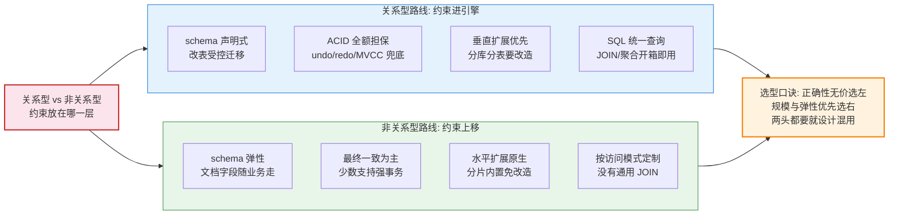
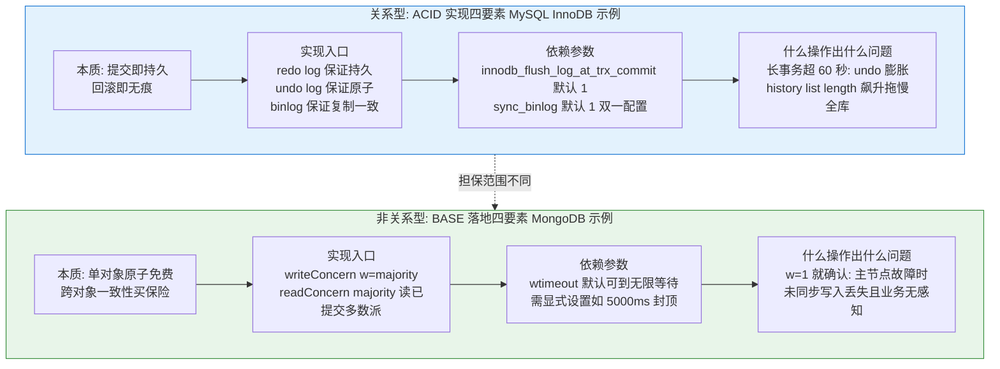
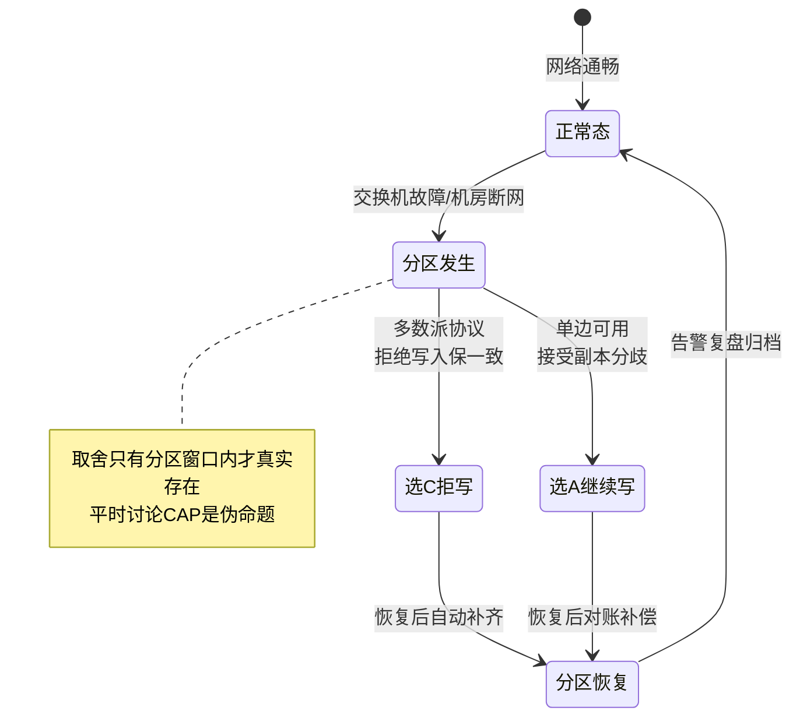
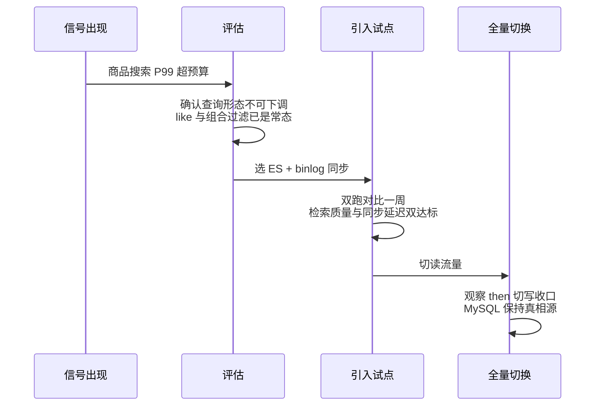
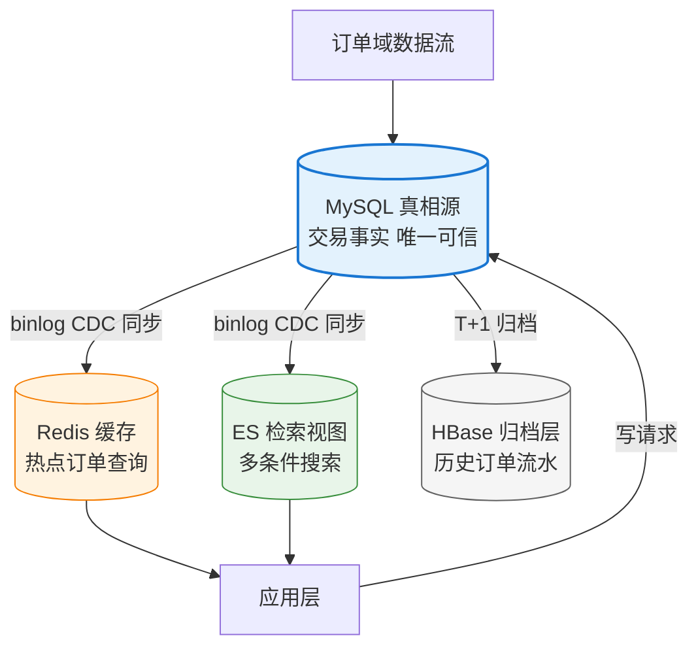

# 关系型与非关系型：本质差异与选型

> 上一篇给了十大类的版图，这一篇把版图上最粗的那条分界线讲透：**关系型 vs 非关系型**。市面上大多数对比文停留在「MySQL 和 MongoDB 哪个好」——这个问题本身问错了层级。本篇把差异拆到四个本质维度（schema 约束 / 事务模型 / 扩展模型 / 查询模型），再讲 CAP 取舍的准确读法、什么信号告诉你该换类、以及混用架构的正确姿势。

## 一句话摘要

关系型与非关系型的差异不在「功能多少」，而在四组底层契约：**schema 写在库上还是挂在应用上、事务是 ACID 全额担保还是分区容忍下的最终一致、扩展靠垂直升级还是水平分片、查询靠关系代数还是按访问模式定制**——四维契约决定了一个系统从第一天起就该往哪边走，也决定了混用时谁当真相源。

## 🎯 本文核心

**核心一句话：两族数据库的本质差异是「不变式约束的位置」——关系型把约束（schema/事务/引用完整性）放进存储引擎，用灵活性换正确性与统一查询；非关系型把约束上移到应用层，用正确性责任换扩展性与模型弹性。选型即选择「你愿意把正确性的责任放在哪一层」。**

机制链：开篇海报（两族分野）→ 四维契约逐维穿透（每一维都追到引擎层的实现选择）→ CAP 的准确读法 → 换类信号清单 → polyglot 混用架构与它的同步链路代价。

## 5W 速记卡

| 维度 | 一句话 |
|---|---|
| What | 两族数据库的四维本质差异、CAP 取舍与混用架构 |
| Why | 把正确性约束放错层，是架构级返工的第一大来源 |
| When | 新系统定型 / 单库开始「两头都不像」时 / 混用评审 |
| Where | 接本系列篇 1 版图，向下衔接篇 3 的扩展演进 |
| How | 四维契约定位 → CAP 定取舍 → 信号定换类时机 → 真相源定混用 |

## 一、开篇海报图：两条路线的分野

海报图里四个格子的顺序刻意一致（schema → 事务 → 扩展 → 查询）——**这就是接下来四维契约的展开顺序**，两族在每个维度上的差异都能追到「约束放在哪一层」这一个原点。线上评审里大量争论（「非关系型不用写迁移脚本多爽」vs「没有外键数据乱」）其实是同一个原点的两个投影。

## 二、四维本质差异：逐维穿透到引擎层

| 维度 | 关系型 | 非关系型 | 追到底层是什么差异 |
|---|---|---|---|
| schema 约束 | 库上声明，DDL 受控变更 | 挂在应用，文档自描述 | 校验时机：写入时引擎校验 vs 读取时应用自洽 |
| 事务模型 | ACID，跨行跨表原子 | 单文档原子为底线，多文档按协议 | 提交协议：WAL+锁+MVCC vs 多数派复制协议 |
| 扩展模型 | 垂直优先，分片是改造 | 分片内置，加节点扩容 | 分片责任：中间件/应用 vs 内核路由 |
| 查询模型 | 关系代数，优化器选路径 | 按访问模式建索引设计 | 查询能力：通用计算下推 vs 预设访问路径 |

### 2.1 schema 约束：校验时机之争

关系型的 schema 是**写入时合同**：字段类型、非空、唯一、外键都在引擎层强制，数据「从结构上就不可能脏」。非关系型的 schema 是**读取时默契**：文档里有没有这个字段、类型对不对，由写入方与读取方的代码约定保证。**追问一层：为什么 MongoDB 后来也加了 schema validation？**——因为「完全无 schema」在生产里是事故配方：字段改名这类变更没有合同约束时，坏数据要等到消费端报错才暴露，排查路径从「写入即报错」恶化成「下游故障反推」。所以真实世界的结论是：**两族都在走向「有 schema，但松紧不同」**，差异只在变更成本（DDL 在线变更 vs 应用多版本共存）。

### 2.2 事务模型：担保范围的差异

关系型的事务是**默认全额**：四条语句跨三张表，要么全成要么全滚，引擎用 undo/redo 日志与 MVCC 兜底，应用不感知。非关系型的事务是**按需购买**：单文档原子免费，跨文档事务要么不支持、要么要显式指定协议参数（如 MongoDB 的因果会话与 writeConcern majority，公开报道口径）。四要素图把这条差异拆到实现：

图里两个示例值都来自真实事故模式：**长事务拖垮 undo 链**与 **w=1 写入丢失**——前者是关系型的「担保的代价」，后者是非关系型的「省担保的代价」，一正一反印证同一个原点。

### 2.3 扩展模型：分片责任之争

关系型的扩展默认**垂直**：加内存、换 SSD、升配主从——到了单机物理天花板才进入分库分表的改造世界（篇 3 的主题）。非关系型的扩展默认**水平**：分片路由是内核能力，加节点即扩容。**为什么关系型不把分片做进内核？**——历史原因与设计目标叠加：单机引擎把「一张表在一台机器上」当成不变式，主从复制、备份恢复、优化器全部建立在这个不变式上，打破它等于重写内核——这正是 NewSQL 的定义（篇 3 展开）。**反方案视角**：有人主张「业务一开始就上分片型非关系库，一劳永逸」——恰恰相反，绝大多数系统死在十万到百万级，为不存在的量级预付分布式复杂度是典型的过度设计，量级分档见本篇第六节。

### 2.4 查询模型：通用计算与预设路径

关系型给你一门**通用语言**（SQL + 优化器）：同一张表，明天来了新报表需求，写条 SQL 就能跑。非关系型给你**预设的高速公路**：查询能力围绕访问模式设计，HBase 的 RowKey、DynamoDB 的分区键与排序键、宽列的列族——**访问模式在设计表的那一刻就锁定了**。线上最贵的一句话是「这个查询当初没设计」：在非关系库上补一个没预料的查询维度，往往意味着重建表或引入外部索引（如 HBase 配 Phoenix/ES）。这就是为什么篇 4 的数据归属决策要先问「这份数据的查询形态是什么」再定库。

## 三、CAP 取舍的准确读法

CAP 被误用的频率和它被引用的频率一样高。准确的读法分三层：

**第一层，P 不是选项**——网络分区在分布式系统里是物理事实，不是可开关的配置。所以 CAP 的实际含义是：**分区发生的那一刻，你必须在 C 与 A 之间选一个**；平时（无分区）C 和 A 都能拿到。

**第二层，取舍发生在分区窗口内**——选 C：拒绝服务直到分区恢复（多数派协议的法定人数不可达就拒写）；选 A：继续服务但接受数据分歧（主从双写、旧副本继续读）。

**第三层，业务语义决定选哪边**——扣款类操作分区时选 C（宁可不可用，不能多扣）；点赞/浏览计数选 A（宁可暂时少算，不能服务中断）。**反直觉的是**：同一个系统里两类数据并存是常态，所以现代分布式库的普遍答案是**把取舍做成可配置的一致性机制**（按操作指定级别），而不是系统级二选一。

**追问：为什么不能既强一致又高可用？**——再深一层是物理定律：副本间确认要走网络，网络有延迟与分区，同步确认的等待时间在分区时会无限放大。取舍来自物理约束而不是工程不努力——这也是本系列一贯的立场：**看清约束来源，才不会被「全都要」的方案宣传带走**。

## 四、什么信号该换类：换类不是换口味

换类是有代价的重构，触发它的是明确的信号，不是技术潮流。信号清单：

| 信号 | 典型表现 | 该往哪类换 |
|---|---|---|
| 单表容量信号 | 单表行数逼近亿级，DDL 变更窗口撑不住 | 分片路线（篇 3） |
| 写入吞吐信号 | 主库写入 CPU/IO 持续高位，升配到头 | 宽列/LSM 路线 |
| 查询形态信号 | 同一份关系数据要全文检索/多条件组合查询 | 搜索路线 + 同步链路 |
| 数据形态信号 | 字段因业务频繁增减，DDL 频率高于查询优化 | 文档路线 |
| 时延信号 | 点查 P99 压不住，DB 成为调用链最慢一跳 | KV 缓存层前置 |
| 新负载信号 | 出现相似度检索/图遍历诉求 | 向量/图路线 |

**时序视角看一次典型的换类决策**：

**事故叙事一**：某内容平台把评论从关系型迁到文档库，理由是「字段灵活」——三个月后运营要一个「按评论点赞数 + 时间范围」的聚合报表，文档库聚合能力不足，最后被迫再加一条同步链路回关系型做报表。复盘结论：**换类前先枚举未来半年的查询形态**，只为「可能灵活」而换，代价会在第一个新报表需求上收回。

**事故叙事二**：某交易系统用「宽列库当交易主库」追求写入吞吐，半年后一个「按用户查最近订单 + 状态筛选」的需求暴露了 RowKey 设计缺陷——当初为写入优化的键设计覆盖不了新查询，只能全量重刷数据重建表。设计思想层面的教训：**写入优化的结构由写入时的键决定读取能力，读多写少且查询形态多变的交易数据，不该放进 LSM 世界的预设路径里**。

## 五、混用架构：polyglot persistence 的正确姿势

两族对峙的终局不是谁消灭谁，而是**按数据域分家**——polyglot persistence（多语言持久化）的核心不是「每个需求一个库」，而是**先定真相源，再挂视图**：

三条混用纪律，比选哪些库更重要：

1. **真相源唯一**——每个数据域指定一个权威库，其余全是可重建的视图（缓存可失效重载、索引可全量重建、归档可冷备回放）。视图丢了不丢数据，才叫视图。
2. **同步链路是架构的一部分**——binlog 到搜索/缓存的每条链路都有延迟与故障率。**事故叙事三**：某平台 ES 同步积压（消费组重平衡卡了二十分钟），用户「已支付订单查不到」，客诉暴涨才暴露——复盘后补了两条纪律：同步延迟监控告警阈值一分钟，关键查询提供「以交易库为准」的逃生接口。**排查这类问题的关键动作是把「数据在哪一层是新的」做成可观测指标**（binlog 位点延迟 / 消费组 Lag），而不是等用户报障。
3. **跨库没有事务，用业务设计补**——订单写 MySQL 成功、ES 索引失败怎么办？答案是补偿：失败重投 + 定期对账任务 + 查询侧兜底。想要「跨库强一致」是需求错误，不是技术难点。

**反方案分析：为什么不用一个大库全包？**——如果存在「事务、检索、缓存、分析全都要还全都强」的库，混用架构就是多余的。现实是全能候选只有两类：要么性能特异性不足（通用库的每个维度都是均值），要么把故障域合并（一个引擎故障全链路瘫痪）。混用买的是「每个数据域用最贴的引擎」，付出的是同步链路的复杂度——这笔账在数据域超过三个、量级过千万之后才划算。

## 六、不同量级的思考：约束驱动选型

- **十万级（单表千万行内）**：约束来源是**团队认知与变更成本**。这一档的核心问题是**用一种库一种事务模型解决全部问题，而不是为两族混合支付同步链路成本**；思考方式是**单一真相源驱动**：一个关系库 + 备份演练就够，此档谈 CAP 是伪命题——单机根本没有分区对象。
- **百万级（读写开始分层）**：约束来源是**读放大与缓存治理**。这一档的核心问题是**把读路径治理好（缓存 + 主从 + 索引），而不是提前拆分数据域**；思考方式是**读路径驱动**：第一次混用通常发生在此档（加一层 Redis），同步链路的纪律要从此档开始建立。
- **千万级（单表与单库逼近极限）**：约束来源是**单机物理天花板与查询形态分化**。这一档的核心问题是**按查询形态拆分检索视图（引入 ES）与归档层，而不是无脑继续升配**；思考方式是**数据域驱动**：真相源 + 视图的混用架构在此档成为标配，同步延迟 SLA 要写进值班手册。
- **亿级（数据域全面分化）**：约束来源是**一致性成本与故障域隔离**。这一档的核心问题是**给每类数据域配对引擎并接受跨域最终一致，而不是把一种库用到它不擅长的维度**；思考方式是**一致性分级驱动**：交易域强一致、检索域秒级一致、分析域分钟级一致——按业务语义逐域定价一致性，全局统一一致性是不存在的优化目标。

**自下而上与触发升级**：四档的混用深度是逐级长出来的——没有哪家公司在十万级就需要 polyglot 架构，但每家到了亿级都会需要；关键是在每档预留下一档的出口（表结构不锁死同步工具、字段命名可跨库映射），触发升级时链路改造才不会推翻业务代码。

## Trade-off：换类与混用的代价账单

| 决策 | 买到 | 付出 |
|---|---|---|
| 坚守关系型 | 单一事务模型 / 统一查询 / 低认知成本 | 查询形态分化后性能塌陷 |
| 换向非关系型 | 扩展性 / 模型弹性 | 放弃通用查询 / 正确性责任上移 |
| 混用架构 | 每域最优引擎 | 同步链路复杂度 / 跨库无事务 |
| 不混用硬扛 | 链路简单 | 每个维度都在均值水平 |

**为什么「换类」比「加机器」贵一个量级？**——加机器是运维动作（天级），换类是数据迁移 + 双跑 + 代码改造 + 团队学习（月级），且换错的回退成本极高。所以信号清单（第四节）里每一条都标了「确认不可下调」的前提：先确认当前类的能力真的顶到墙，再谈换类。

## 步骤级：引入第二类库的评审与落地 SOP

**前置条件**：信号清单中至少一条持续两周不缓解；现有类内调参与扩容手段已用尽（有调参记录为证）；数据形态与查询形态清单已评审。

**步骤**：
1. 定真相源与视图边界——新库是真相源还是视图？写进架构决策记录（一句话即可：谁可重建、谁不可）——验证：评审会上能一句话说清数据流向。
2. 搭同步链路并压测——用 CDC 工具（binlog 解析类）打通，模拟峰值两倍流量——验证：端到端延迟 P99 低于业务预算（如一分钟），断点续传可恢复。
3. 双跑对比——新旧两套同时服务读流量，对比结果一致性与性能——验证：连续一周结果差异率低于约定阈值（如万分之一）且全部差异可解释。
4. 切读、观察、切写收口——先切读流量灰度放量，稳定后处理写路径——验证：每一步有回退开关且演练过。
5. 老链路下线与文档归档——同步对账任务转日常，值班手册更新——验证：一周内无回退事件，监控无未知告警。

**回退**：每个阶段保留开关；双跑期任何一致性异常先切回旧链路再排查；上线后两周内保留全量重建视图的能力，作为最终回退手段。

## 💡 实战提示

💡 **把「四维契约」做成评审清单贴在文档里**——每次选型评审过一遍 schema/事务/扩展/查询四问，五分钟能拦住八成拍脑袋选型；比争论产品口碑有效得多。

💡 **CAP 问题在评审里的正确问法是「分区时你的核心操作选 C 还是 A」**——问「系统是 CP 还是 AP」得不到可执行结论；落到操作粒度（扣款选 C、计数选 A）才能直接指导参数配置。

💡 **同步链路的延迟监控要和业务监控同级告警**——视图层延迟不是「数据团队的事」，用户看到的就是产品故障；把消费组 Lag 接进值班告警是混用架构的第一条纪律。

💡 **换类决策写一页纸决策记录（背景/候选/结论/回退）**——半年后有人问「为什么用这个库」，git 里的这一页纸比所有会议纪要都可靠。

## 你们可能会问

**问：非关系型现在也有事务了，差异是不是消失了？**——能力表在收敛，成本结构没有：关系型的事务是默认免费全额担保，非关系型的跨文档事务要显式配置且有性能代价。差异从「有没有」变成了「默认与代价」，四维契约的框架依然成立。

**问：小团队是不是不该碰非关系型？**——不是禁区，是场景题：文档形态确实多变（如内容管理）时 MongoDB 单库比 MySQL+JSON 字段更自洽；关键是保持单一真相源纪律，别一上来就搭三套库。

**问：CAP 里「三选二」的说法为什么错？**——因为 P（分区容忍）描述的是环境会不会出分区，不是你的选择；正确的表述是「分区发生时选 C 还是选 A」。这个误读会导致真实评审里出现「我们选 CA」这种不可实现的结论。

**问（开放问题）：未来会不会出现统一四维的「终极数据库」？**——值得讨论但未定论。多模合一的趋势（篇 1 趋势层）在收窄差异，但每一轮「合」都以某个维度的性能特异性让步为代价。**我的判断**：四维契约作为分析框架会比任何具体产品活得久——产品会合，约束不会消失。

## 什么时候用 / 不用：明确推荐

**明确推荐**：新系统先在关系型定型（真相源 + 事务语义清晰），遇到信号清单条目时按 SOP 引入第二类库——这是过去十年被反复验证的低风险路径。

**不要**：以「数据量会很大」为由跳过关系型直接上分布式非关系型——预付的分布式复杂度大概率等不来那个量级；量级到了，篇 3 的演进路径会告诉你怎么走。

**不要**：混用架构里出现「两个真相源」——「ES 也存一份完整的，偶尔以它为准」是数据不一致事故的标准开头；发现两个真相源，先修架构再修数据。

## 🎯 核心带走

**核心一句话：两族的差异是「正确性约束放在哪一层」——关系型把约束放进引擎换统一查询与 ACID，非关系型把约束上移应用换扩展与弹性；选型即选择正确性责任的位置，混用即按数据域分配这个位置并守住唯一真相源。**

链条复述：海报（两族四格）→ 四维契约（schema 校验时机 / 事务担保范围 / 分片责任 / 查询模型）→ CAP 准确读法（P 是事实，取舍在分区窗口内按操作粒度配置）→ 换类信号（容量/吞吐/查询/形态/时延/新负载六条）→ 混用三纪律（真相源唯一 / 链路可观测 / 跨库无事务用补偿）。

失效点与边界：本篇的信号阈值是定性描述，具体数字（单表行数、延迟预算）因业务而异，评审时用量级分档校准；混用架构的同步链路成本常被低估，三个以内数据域之前优先考虑「能不能不混」。

## 自测三问

1. 你系统里每个数据域的真相源是哪个库？能一句话说清每个视图怎么重建吗？
2. 分区发生时，你的扣款类操作和计数类操作分别选 C 还是 A？参数上怎么体现？
3. 上一次「该换类」的信号出现时，你们是先调参/扩容验证过，还是直接讨论换库？

## 📌 数据与事实声明

- 数据截至 2026-09（检索核验口径，产品事务能力描述为公开报道口径，以官方文档为准）
- 事故叙事为行业常见模式的脱敏改写，不含任何真实公司数据
- 参数默认值（innodb_flush_log_at_trx_commit / sync_binlog 等）为官方文档口径，版本间有差异
- 同步延迟、双跑差异率等阈值为示例值，评审时按业务预算校准

## 📚 参考资料

| 类型 | 标题 | 来源 |
|---|---|---|
| 站内 | 本系列上一篇：数据库全景地图 | `data/整合层/从零认识数据库体系系列/1_数据库全景地图：十大类一张图-整合.md` |
| 站内 | 本系列下一篇：架构演进到 NewSQL | `data/整合层/从零认识数据库体系系列/3_数据库架构演进：单机到分布式NewSQL-整合.md` |
| 站内 | MySQL 事务与 MVCC 系列 | `data/mysql/特性层/深入理解事务与MVCC系列/` |
| 站内 | HBase 与 MySQL Redis ES 的区别和选型 | `data/hbase/入门层/从零开始认识HBase系列/6_与MySQL Redis ES的区别和选型-入门.md` |
| 论文/概念 | Brewer CAP 定理（2000/2012 修正版） | 公开学术口径 |
