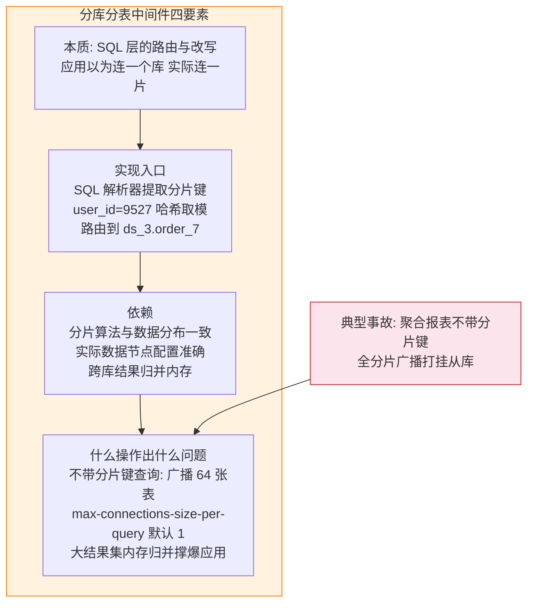
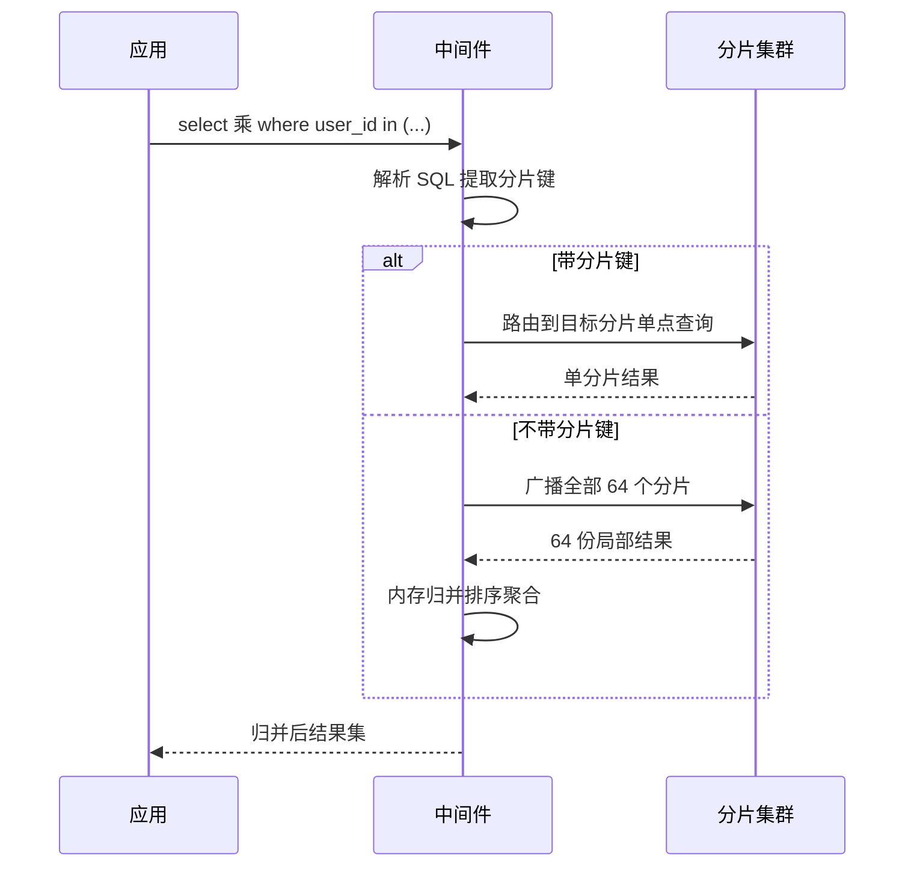
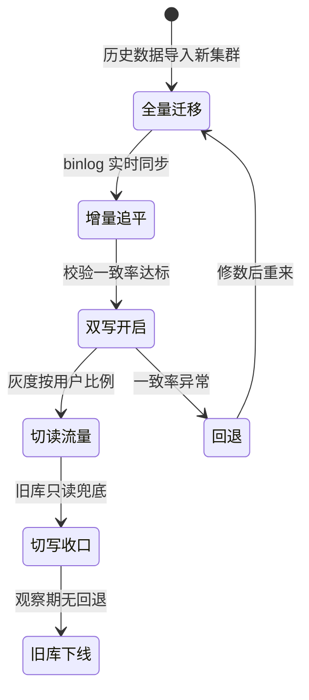

# 数据库架构演进：单机到分布式 NewSQL

> 版图（篇 1）回答「哪一类」，契约（篇 2）回答「什么信号该动」——这一篇讲**动了之后往哪走**：单机 → 主从 → 分库分表 → 分布式 NewSQL 的四级演进，每一级解决什么问题、付出什么代价、下一步的触发条件是什么，以及五十年轮回里「分」与「合」的辩证。这是关系型路线的纵深叙事，也是理解 NewSQL 为什么存在的必经之路。

## 一句话摘要

关系型架构的每一级演进都在交换：**主从用复制延迟换读扩展，分库分表用业务改造换容量，NewSQL 用运维复杂度换业务透明**——没有一级是免费的；演进的纪律只有一条：**每一级只解决上一级解决不了的瓶颈，跳级是过度设计，恋级是技术债**。

## 🎯 本文核心

**核心一句话：四级演进的本质是「故障域与数据边界的一次次重新划分」——单机的边界是机器，主从的边界是角色，分库分表的边界是分片键，NewSQL 的边界被重新收回内核；每一次边界移动都重新定义了「什么是故障」与「谁能看到全量数据」。**

机制链：演进总图（四级每级的解决/付出/触发）→ 单机与主从（复制机制的底层）→ 分库分表（中间件四要素 + 路由机制）→ 分布式 NewSQL（把分片收回内核的设计）→ 分与合的轮回（跨周期视角）。

## 5W 速记卡

| 维度 | 一句话 |
|---|---|
| What | 单机到 NewSQL 的四级演进叙事与分合轮回 |
| Why | 每级的触发信号与代价账单决定演进时机 |
| When | 容量水位 / 写入瓶颈 / DDL 窗口撑不住时逐级评估 |
| Where | 衔接篇 2 换类信号，纵深到 MySQL 分库分表系列 |
| How | 读扩展 → 容量分片 → 内核化分片，逐级解锁 |

## 一、开篇海报图：四级演进总图

读这张图的正确姿势：每一级先看「解决什么」，再看「付出什么」，最后看级间箭头上的触发条件——**跳过任何一级的代价，都会在下一级以更贵的形态出现**（没做过主从就上分库分表的团队，会在复制延迟与分片路由两个战场同时作战）。

## 二、单机与主从：读扩展的第一课

**单机不是罪**——一台配置合理、索引正确、备份演练过的单机 MySQL，能服务的数据量远超多数人的想象（业内认知口径：单表千万行内 + 索引得当，常规点查毫秒级）。单机的真问题是**可用性与数据安全**：进程挂服务停、磁盘坏数据丢。所以离开单机的第一站不是分片，是主从。

主从的底层机制是**复制**：主库把变更写入 binlog，从库拉取并重放。这个机制给两样东西——**数据冗余**（主库坏了从库顶上）与**读扩展**（读流量分散到多个从库）。同时引入两个新问题：

- **复制延迟**：从库重放永远慢于主库写入。用户刚下单就刷新订单列表（读从库），看不到订单——这是线上最常见的「写后读不一致」事故。**追问一层：为什么不用同步复制消灭延迟？**——同步确认把写入延迟绑在最慢的从库上，任何一个副本抖动全体写入跟着抖；半同步（至少一个从库确认）是常见的折中，牺牲一点点写性能换一个「至少有一份实时副本」的担保。
- **切换复杂度**：主库故障时谁提升为主、客户端怎么感知——人工脚本时代是分钟到小时级，引入哨兵类组件后收敛到秒级，但脑裂防护（旧主复活后的处理）成为新的排查课题。**常被误解的一点：主从不是备份**——主库上的误删表会原样重放到从库，秒级同步意味着秒级污染；真正的兜底是延迟备份实例与定期全量备份，复制解决的是硬件故障，不是逻辑错误。

**这一级的正确动作**：主从延迟监控（seconds_behind_master / GTID 位点差）、写后读一致性按业务语义处理（关键查询强制走主库）、故障切换演练季度化。**触发升级的信号**：写入量与容量逼近单机上限——注意，这是容量驱动的信号，与读问题无关；读的问题在主从级就该解决完。

## 三、分库分表：容量问题的业务级解法

写入与容量到顶，垂直升配有物理上限，剩下的路是**把一份数据按分片键拆到多台机器**。这是四级里**改造代价最高**的一级——它把「数据库问题」变成了「业务代码问题」。

### 3.1 中间件四要素图

以主流的 ShardSphere 类中间件（JDBC 增强形态）为例，一条 SQL 的分片之旅拆成四要素：

### 3.2 分片键：这一级最贵的决策

分片键一旦选定，**所有查询形态都被它锁死**：按 user_id 分片，那么「按商户查交易」就是跨库广播；反之亦然。**追问一层：为什么自增主键不能当分片键？**——自增值的写入永远落在范围最大的那个分片，所有新增流量集中打在最后一台机器上，其余分片闲着看戏——这叫写入热点，是分片设计的第一反模式。哈希取模把连续自增值打散到各分片，正是为了摊平这种热点。

**设计思想层面的原则：分片键必须是最高频查询的过滤维度**——宁可为此做一份数据冗余（按两个维度各存一份，或用异构索引表），也不要选一个「看起来均匀但查询用不上」的键。

**事故叙事一**：某平台按 create_time 范围分片——写入均匀了，但「查用户最近订单」变成全分片扫描，大促期间查询风暴打挂集群。复盘后迁到 user_id 哈希 + 时间冗余列，广播查询归零。**代价转移视角**：这次改造没有消灭代价，只是把「跨分片查询」的代价转移成了「冗余数据一致性」的代价——每一级演进都是代价转移，不是代价消灭。

**事故叙事二**：分表数量一步到位设了 4096 张，结果单表数据稀疏、DDL 变更要扫四千张表、运维脚本全要适配。业内经验的分寸感：**单表规划到目标容量的三到五分之一即可**（如目标 5000 万行就拆到单表 1000-2000 万行的粒度），表数够用且留有翻倍余量，别为十年后的假设今天买单。

**不带分片键的查询长什么样？**——一条跨库查询在中间件里的完整旅程（时序视角）：

alt 与 else 的分界就是性能分界：带键走单点（毫秒级），不带键走广播（分片数线性放大）。**这个分界直接翻译成一条代码评审规则：所有 SQL 必须携带分片键，评审扫到无分片键查询即打回**——广播查询不是不能跑，是要在报表库/归档库跑，别在生产交易链路上跑。

**跨库事务怎么办？**——第一答案是**业务设计回避**：同一用户的数据落在同一分片（分片键即用户维度），事务天然不跨库；实在回避不了的跨库操作，用消息最终一致 + 对账补偿（篇 2 第五节纪律）。分布式强事务（XA/TCC/Saga）是最后的手段，每一种都有性能或复杂度账单——**为什么不用 XA 一劳永逸？**——同步锁跨网络后，锁持有时间被最慢参与者放大，吞吐塌方；行业主流已经用脚投票选了最终一致。

### 3.3 第一眼参数清单

> 进入主从与分片阶段后最先要对齐的参数（默认值为官方文档口径/业内认知口径，版本间有差异，以所用版本文档为准）。

| 配置项 | 默认值 | 分档推荐 | 为什么 |
|---|---|---|---|
| MySQL max_connections | 151 | 分片集群单实例 300-800 | 每个分片被应用池 + 中间件共享，连接预算要先算再调 |
| MySQL innodb_buffer_pool_size | 134217728（128MB） | 独占实例内存 50%-70% | 分片后单实例数据变少但实例数变多，缓存按实例分别配足 |
| 半同步复制等待超时 rpl_semi_sync_master_timeout | 10000（10 秒） | 1000ms 左右 | 超时过长时写入被慢从库拖住，退化策略要先想清楚 |
| 中间件 max-connections-size-per-query | 1 | 归并查询按分片数与内存评估 | 默认 1 走内存严格归并防打爆，调大前先算结果集 |
| 中间件 sql-show（SQL 打印） | false | 排查期临时开启 | 常开有性能损耗，排查路由问题时的第一开关 |
| MySQL server_id / GTID | 无默认（必配唯一值） | 全局规划不重复 | 主从与迁移状态机都依赖复制位点，ID 冲突是搭建期高频错误 |

### 3.4 扩容与数据迁移：状态机视角

分片方案上线不是终点——数据继续涨，扩容（翻倍扩分片）是必经之路。主流做法是双写迁移，本质是一个状态机：

**这一级的正确动作**：迁移前对账脚本先行（行数抽样 + 关键字段全量比对）、双写期读写双开关独立控制、每次切流留观察窗。**回退预案不是文档装饰**：双写期发现一致率异常的回退动作（关闭新库写开关、以旧库为准修数）必须演练过，线上第一次演练回退不应该发生在真实事故里。

## 四、分布式 NewSQL：把分片收回内核

分库分表解决了容量，代价是业务承担了分片的全部复杂度——选键、改写、跨库查询、扩容迁移。NewSQL 的**设计哲学**一句话：**把分库分表团队每年做的事，做进数据库内核**。

三个内核化机制值得穿透到底层：

- **自动分片**：数据按 Range（如 TiDB 的 Region，默认约 96MB 一段，公开报道口径）或哈希切分，调度器自动均衡——业务再也不选分片键，热点Region 自动拆分迁移。
- **Raft 多数派复制**：每个分片三副本，写入多数派确认才算提交——故障切换不再是独立组件的事务，而是复制协议的内生行为；分区时多数派不可达自动拒写（篇 2 的选 C 语义，协议级实现）。
- **分布式事务**：跨分片的 ACID 用 Percolator 类两阶段提交 + 时间戳排序实现——**为什么这很难？**——跨节点提交的原子性需要一个全局一致的「提交时刻」，时钟漂移会直接造成数据错乱，这是 NewSQL 引入集中式时钟（TSO）或混合逻辑时钟的底层原因，也是它与「最终一致型分布式库」的本质分界。**再问一层：TSO 集中时钟会不会成为单点？**——会是个可用性焦点，但不是正确性单点：时钟组件只发放时间戳不存数据，宕机重启即可恢复，主流实现用多副本 + 租约续期把它的不可用窗口压到秒级——这也是排障清单里必须认识的一个组件。

**反方案分析：为什么不跳过分库分表直接 NewSQL？**——三个现实约束：其一，团队运维能力——NewSQL 组件（PD/调度/多副本/双时钟语义）的排障门槛高于「MySQL + 成熟中间件」；其二，业务规模——千万级以下的量级，NewSQL 的复杂度是纯负债（量级分档见第六节）；其三，存量迁移成本——从单机 MySQL 到 NewSQL 比到分库分表容易，但从「已经分了 256 张表」的存量迁 NewSQL，等于再做一次全量迁移。跳级的代价在每一级都是真实存在的。

**国产 NewSQL 的行业格局**：OceanBase / TiDB / PolarDB / GaussDB / GoldenDB 等在金融核心与信创场景大规模落地（信创前二梯队为公开报道口径）——这一层趋势的驱动力是合规与「去 IOE」诉求叠加技术成熟，选型时除技术对比外要把**生态兼容性（MySQL 协议兼容度）与迁移工具链成熟度**放进评估表。

## 五、分与合的轮回：跨周期视角

把四级演进拉远看，是数据库五十年「分—合」轮回的最新一轮：

**为什么这是轮回而不是直线？**——「合」的收益是降低认知与运维成本，「分」的收益是榨取性能特异性；两者此消彼长的根本原因是**通用性与特异性的物理矛盾**（篇 1 四要素图已论证）。对选型的跨周期启示：**押注标准化接口（MySQL/PostgreSQL 协议、开放表格式）比押注任何单一产品更抗周期**——轮回转下去，接口是唯一的常量。

## 六、不同量级的思考：约束驱动演进

- **十万级（单表千万行内）**：约束来源是**备份与变更纪律**。这一档的核心问题是**把索引、备份、DDL 流程做规范，而不是讨论架构演进**；思考方式是**规范驱动**：单机 + 每日备份 + 慢查询巡检，此档的故障九成是人为误操作，九成与架构无关。
- **百万级（读压力出现）**：约束来源是**读放大与缓存一致性**。这一档的核心问题是**上主从 + 缓存把读路径理顺，而不是为写容量提前分片**；思考方式是**角色分离驱动**：写主读从、热点进缓存、关键读走主库——这一级的改造是应用透明度最高的，别拖到读写互相拖累才做。
- **千万级（单表逼近上限）**：约束来源是**单机写入与容量的物理天花板**。这一档的核心问题是**分库分表改造（或评估迁移 NewSQL），而不是继续垂直升配**；思考方式是**分片边界驱动**：分片键选型、表数规划、迁移状态机三件事的评审质量直接决定未来三年的痛苦程度——这是四级里最需要「停下来想清楚」的一级。
- **亿级（业务透明度成为刚需）**：约束来源是**跨分片复杂度与团队规模**。这一档的核心问题是**把分片复杂度从业务代码里收走交给内核，而不是让每个业务团队都成为分库分表专家**；思考方式是**平台化驱动**：NewSQL 的价值在亿级才真正兑现——业务透明、自动均衡、协议级强一致，此前每一档它都是过度设计。

**自下而上与触发升级**：四级之间没有捷径但有岔路——量级永远到不了亿级的业务，停在主从或分库分表就是最优解；触发升级的永远是水位数据（容量趋势/写入延迟/DDL 窗口），不是技术公告区的版本号。每级预留下一级的出口（SQL 保持标准、分片键设计留冗余维度），升级时才不必推翻业务。

## Trade-off：每一级都是一场交换

| 级别 | 买到 | 付出 | 不可逆性 |
|---|---|---|---|
| 单机 | 最简运维 / 全功能 | 可用性为零 | 随时可加从库 |
| 主从 | 读扩展 / 数据冗余 | 复制延迟 / 切换复杂度 | 可回单机（代价小） |
| 分库分表 | 容量与写入水平扩展 | 业务改造 / 跨库查询与事务 | 回退需数据迁移 |
| NewSQL | 业务透明 / 自动均衡 / 强一致 | 组件复杂度 / 运维门槛 | 迁移成本最高的二级间切换 |

**为什么「分库分表到 NewSQL」的回退最难？**——业务代码已经依赖中间件的分片语义，回退意味着再迁一次全量数据；所以这两级之间的决策要放最多的评审时间，倒挂的评审投入（前面级轻、后面级重）是演进节奏的隐藏纪律。

## 步骤级：分库分表改造的最小验证闭环

**前置条件**：容量水位报告（当前与 18 个月预测）；查询形态清单（每类查询的过滤维度统计）；分片键候选与路由规则评审通过；回滚预案含演练记录。

**步骤**：
1. 影子库验证——新分片集群全量导入后，跑对账脚本比对行数与抽样字段——验证：行数一致且抽样差异率为零。
2. 双写灰度——按用户尾号 1% 开启双写，对比新旧库读写结果——验证：连续三日一致率达标（如 99.999%），延迟 P99 在预算内。
3. 读切流——按比例逐步把读流量切到新集群，每档观察一至两天——验证：各档位业务指标（下单成功率/查询 P99）无劣化。
4. 写切流与旧库只读——写流量切新库，旧库转只读保留两周作为逃生通道——验证：观察期内无一次回退触发。
5. 收口归档——旧库数据归档，中间件配置与对账任务转日常运维——验证：值班手册与监控面板更新完成。

**回退**：阶段 2-4 任一环节一致率或性能异常，关闭对应开关即回旧链路（双写期数据以旧库为准修数）；切换完成后两周内保留全量反向迁移脚本作为最终手段。

## 💡 实战提示

💡 **分片键评审会上必须回答「第二高频查询怎么办」**——只按第一高频维度选键是评审常见漏洞；把第二查询维度写进决策记录（冗余列 / 异构索引 / 接受广播），一年后的自己会感谢今天这一问。

💡 **复制延迟的监控要带业务语义**——「延迟 800ms」是技术指标，「下单后 5 秒内查不到订单」是业务故障；把延迟阈值与写后读场景绑定告警，排查效率高一个量级。

💡 **迁移演练先演练回退再演练前进**——双写迁移的回退开关如果不曾在预发环境真关过一次，线上第一次按下去就是盲盒；回退演练是迁移计划里性价比最高的一小时。

💡 **NewSQL 评估用「运维问题清单」而非「功能对比表」**——容量扩展谁都答得上；_region 热点怎么看、时钟组件挂了怎么办、版本升级滚动策略是什么——这些问题的答案质量才决定生产体验。

## 你们可能会问

**问：现在还有必要学分库分表吗？NewSQL 会不会取代它？**——会长期共存：存量系统里分库分表是主流形态（改造成本决定它不会消失），千万级与亿级之间量级的团队它仍是首选。学它的意义不只在使用——分片键、路由、跨库事务这些概念是理解 NewSQL 的前置知识。

**问：主从延迟多少算不可接受？**——没有通用数字，只有业务预算：写后读窗口 1 秒内大多数场景无感，报表类 1 分钟也够。正确做法是把「业务能接受的延迟」翻译成监控阈值，而不是反过来背一个通用常数。

**问：分表数到底怎么定？**——两个约束取交集：单表容量约束（目标行数 / 表数 ≤ 单表健康行数）与运维约束（DDL 与脚本扫描的表数量上限）。先定单表健康线（业内经验口径 1000-2000 万行），再反推表数，取 2 的幂留翻倍余量。

**问（开放问题）：NewSQL 之后还会有第五级吗？**——值得讨论但未定论。云厂商的 Serverless 数据库（自动扩缩到零、按用量计费）正在把「运维边界」进一步收回平台——**我的判断**：演进的下一级不是更强的分片，而是「数据库作为无感基础设施」；对使用者的要求从「会运维」转向「会设计数据边界」——本系列的篇 4 正是为此准备。

## 什么时候用 / 不用：明确推荐

**明确推荐**：按四级顺序逐级演进，每级用第六节的量级档校准触发时机；容量预测显示 12-18 个月内会撞单机上限时，提前一个季度启动下一级评审——演进要提前，但只提前一个季度。

**不要**：在百万级以下部署分库分表或 NewSQL——为不存在的量级支付复杂度，是本系列见过最普遍的过度设计；同样**不要**在亿级仍死守手工分库分表让每个业务线自建路由——平台化的时机到了就该收口。

**不要**：把「分库分表」当成简历任务清单来做——每一次分片改造都应该是容量数据的驱动结果，评审会上拿不出水位报告的改造申请应当场否决。

## 🎯 核心带走

**核心一句话：四级演进是「数据边界」的逐级重划——单机扛全部、主从分角色、分库分表分数据、NewSQL 把分片收回内核；每一级解决上一级解决不了的瓶颈，每一级都是代价转移而非代价消灭。**

链条复述：单机（规范做足不是罪）→ 主从（复制换读扩展，延迟与切换是新课题）→ 分库分表（分片键是最贵决策，迁移是状态机）→ NewSQL（自动分片 + Raft + 分布式事务的设计哲学）→ 分合轮回（押注标准接口抗周期）。

失效点与边界：本篇的量级阈值是业内经验口径，具体业务的自有约束（合规、团队技能栈、存量形态）可能改变触发时机；四级框架针对关系型路线——非关系型的扩展叙事（如宽列的原生分片）在篇 1 版图中另成一线。

## 自测三问

1. 你负责的库现在处于哪一级？触发下一级的信号是什么、水位数据在哪里？
2. 如果明天必须做分库分表，你的分片键候选是什么？第二高频查询怎么处理？
3. 分与合的轮回里，你的系统当前押注在「合」（通用库/标准接口）还是「分」（专用库）上？这个押注的出口设计了吗？

## 📌 数据与事实声明

- 数据截至 2026-09；Region 大小、单表健康行数等为业内认知口径与公开报道口径，以官方文档为准
- 事故叙事为行业常见模式的脱敏改写，不含真实公司数据
- 国产数据库格局描述为公开报道口径，不构成选型推荐
- 迁移一致率、灰度比例等阈值为示例值，按业务预算校准

## 📚 参考资料

| 类型 | 标题 | 来源 |
|---|---|---|
| 站内 | 本系列上一篇：关系型与非关系型的本质差异 | `data/整合层/从零认识数据库体系系列/2_关系型与非关系型：本质差异与选型-整合.md` |
| 站内 | 本系列下一篇：什么数据放什么库 | `data/整合层/从零认识数据库体系系列/4_什么数据放什么库：业务分配决策树-整合.md` |
| 站内 | 亿级订单分库分表实战（整合层） | `data/mysql/整合层/3_亿级订单分库分表实战-深度.md` |
| 站内 | MySQL 分片机制系列 | `data/mysql/特性层/深入理解分片机制系列/` |
| 站内 | MySQL 主从复制与高可用 | `data/mysql/入门层/从零开始认识MySQL系列/13_高可用方案-入门.md` |
| 论文/概念 | Spanner / Percolator 论文（NewSQL 技术源头） | 公开学术口径 |
