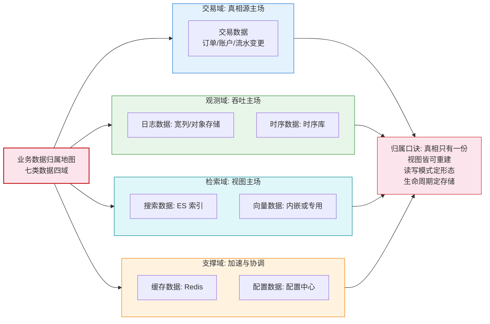
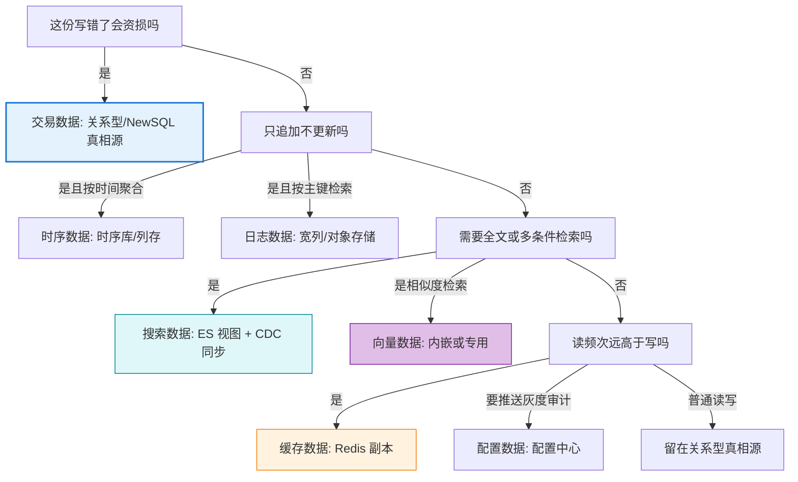
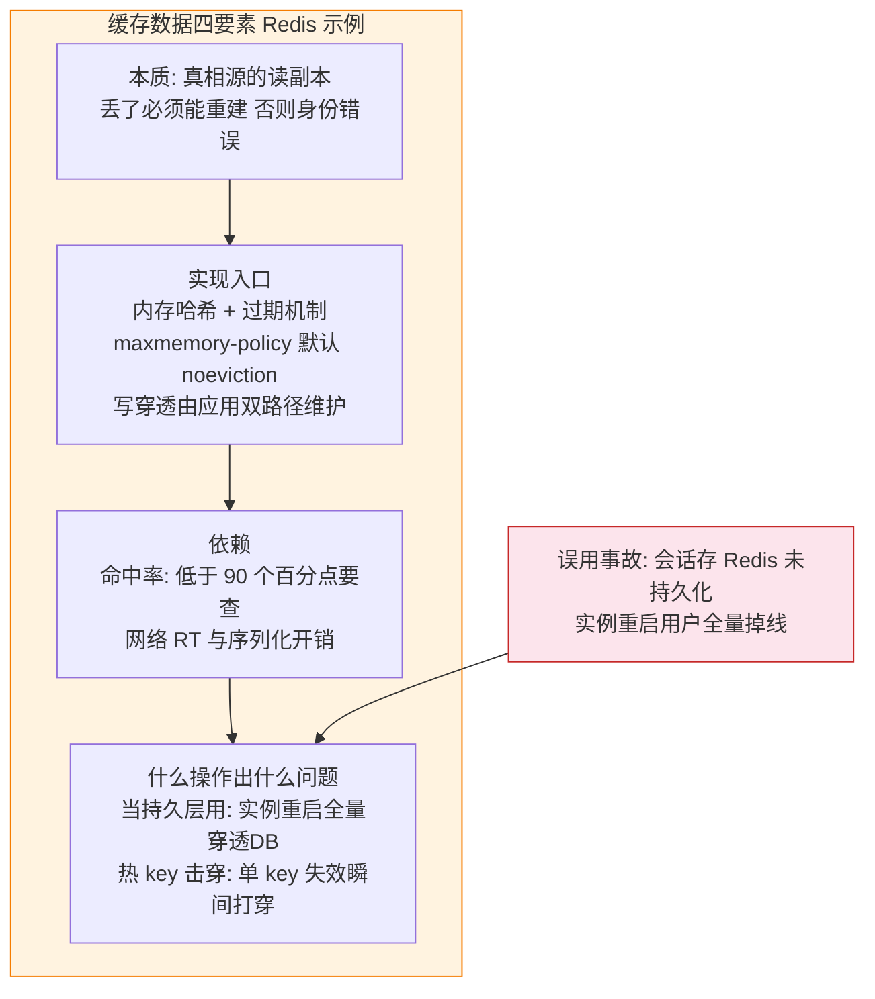
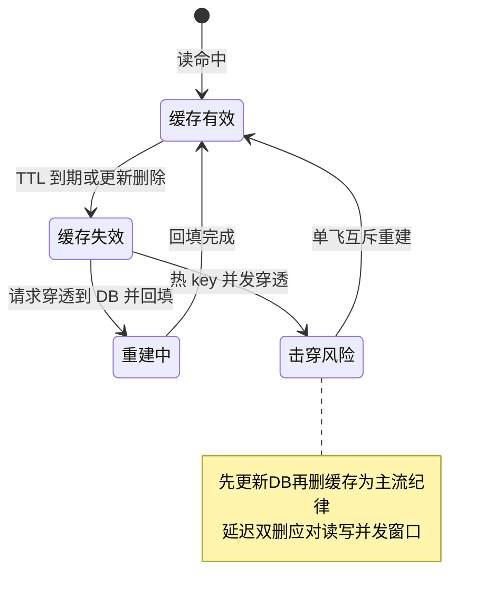
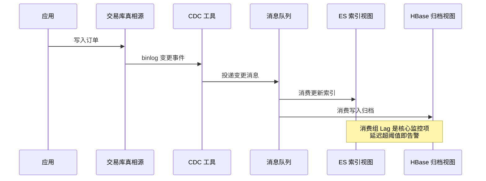

# 什么数据放什么库：业务分配决策树

> 版图（篇 1）给了十大类，契约（篇 2）给了两族分界，演进（篇 3）给了关系型的纵深——这一篇回到最日常的现场问题：**一个业务系统里，每一份数据该放哪个库**。交易、日志、时序、搜索、向量、缓存、配置七类数据逐一给归属决策树，再把混布反模式（用错库的典型现场）与同步链路的代价摊开讲透。

## 一句话摘要

数据归属的本质是**按「读写模式 + 一致性要求 + 生命周期」三维给数据定位**：交易数据要强事务进关系型、日志流水要写吞吐进宽列或对象存储、指标时间线进时序库、检索视图进搜索引擎、embedding 进向量路线、热读副本进缓存、配置进配置中心——**归属错了不是慢，是把两类库都不擅长的负载压给了一类库**。

## 🎯 本文核心

**核心一句话：数据归属决策 = 先问「这份数据的真相在哪」再问「它以什么形态被读写」——真相源必须是强一致库（关系型/NewSQL），其余一切形态（缓存/索引/归档/分析）都是真相源的可重建视图；决策树的第一层永远是「真相还是视图」，而不是「哪个库快」。**

机制链：归属海报图（七类数据四域）→ 逐类决策三问 → 决策树总图 → 缓存四要素图（最容易放错的一类）→ 混布反模式与 CDC 链路 → 生命周期与量级收束。

## 5W 速记卡

| 维度 | 一句话 |
|---|---|
| What | 七类业务数据的归属决策树与混布反模式 |
| Why | 放错库的代价是双向的——两类库同时变慢 |
| When | 新业务建模评审 / 存量库扩容评审 / 故障复盘归因 |
| Where | 衔接篇 1 版图与篇 2 真相源纪律 |
| How | 真相/视图二分 → 读写模式定形态 → 生命周期定存储层 |

## 一、开篇海报图：七类数据的归属地图

四个域的底层逻辑不同：交易域卖**正确性**，观测域卖**吞吐与压缩**，检索域卖**查询形态适配**，支撑域卖**低延迟与协调**——归属争议出现时，先判断数据属于哪个域，争议往往当场消解。

## 二、七类数据逐类归属：每类三问

### 2.1 交易数据：唯一不可重建的一类

判断问题只有一条：**写错了会资损吗？**——会，就进关系型/NewSQL 真相源。订单状态、账户余额、支付流水都属此类。它的读写模式（点查 + 事务 + 范围扫）与关系型 B+ 树结构严丝合缝（篇 1 四要素图）。**误放代价**：放进宽列/KV 意味着放弃事务，对账逻辑全部上移到应用层；某团队曾把优惠券核销放 KV 库「图快」，超发事故后回迁，改造月余——**资损类数据没有试错空间**。

### 2.2 日志数据：量大价廉优先

应用日志、审计流水、行为埋点——**写入一次、几乎不更新、按时间/TraceID 查询**。归属优先级：合规与长留存走对象存储压缩归档；需要近线检索的走宽列或日志平台（本质是 ES 或列存的封装）。**误放代价**：日志进交易主库是经典事故——某系统把操作审计写进订单主库同实例，审计表写入高峰把 Buffer Pool 搅浑，订单查询 P99 翻倍。日志与交易必须物理隔离，这是混布反模式第一名。

### 2.3 时序数据：时间线即主键

监控指标、IoT 传感、调用链指标——**只有追加没有更新、按时间范围聚合、旧数据可降采样**。归属时序库（或列存的时序引擎）：时间线压缩比通用行存高一个数量级（业内认知口径）。**误放代价**：放 MySQL 的经典下场是分区表 + 定时清数据的自造轮子，压缩率低、聚合慢、清理任务自己成为故障源。判断问题：**这份数据的更新语义存在吗？**——不存在（只追加），就往时序/列存走。**设计取舍的关键在降采样策略**：原始精度保留多久、聚合精度保留多久，这两个数字决定存储成本的曲线——上线前不定，一年后磁盘账单会替你定，且没有回头路（原始数据已经清掉了）。

### 2.4 搜索数据：它是视图不是真相

商品检索、订单多维查询、内容全文搜索——查询形态（分词/多条件/相关性）决定必须走倒排索引。**关键纪律：搜索库是索引视图，真相仍在交易库**，靠 CDC 同步（第五节展开）。**误放代价**：把 ES 当真相源直接写——写入模型（近实时 refresh）意味着丢写窗口内数据无感知，且更新成本极高；行业里「ES 单独当主库」的项目几乎都以数据丢失事故收场。

### 2.5 向量数据：两条路线的判断

embedding 数据的归属判断只有两问：**规模多大？与业务数据的关系查询多紧？**——百万级以下且常与业务字段混合过滤，走内嵌路线（pgvector 类，少一条同步链路）；亿级或独立扩缩容诉求，走专用向量库。**误放代价**：把向量塞进生产关系库主表当普通 BLOB 列——无索引结构，相似度查询退化为全表扫描；向量必须配向量索引（HNSW/IVF），没有索引结构的向量存储只是占空间的数组。

**追问一层：为什么向量检索必须专用索引？**——相似度查询的语义是「离我最近的 K 个」，在几百维空间里没有排序可用，B+ 树的范围扫完全失效；HNSW 把向量组织成多层近邻图，查询沿图跳跃逼近，用百分之几的召回率让步换几个数量级的加速——**这里的设计权衡是：近邻检索从第一天起就在「精度换延迟」的曲线上做选择题**，所以向量的归属决策永远要带上「召回率要求」这一项，只问 QPS 不问召回的压测结论不可信。

### 2.6 缓存数据：最容易被放错「身份」的一类

缓存不是数据类别，是**读路径的加速副本**——它没有独立身份，身份永远跟着真相源。正因为「人人知道它是缓存」，它的误用最隐蔽（放真相源用、当持久存储用），值得一张四要素图单独穿透，见第四节。

归属判定还有一个常见盲区：**缓存收益模型**。一份缓存的收益 = 命中频次 × 单次重建代价，两头都低的数据（低频访问且重建便宜）放进缓存只增加不一致面与运维面；反过来高频访问但重建极贵的（复杂聚合结果）恰恰是最该缓存的。评审时用这个模型过一遍候选清单，一半的「顺手加个缓存」会被当场劝退。

### 2.7 配置数据：读多改极少 + 要推送

业务开关、限流阈值、灰度名单——判断问题：**改了之后需要多快生效、要不要审计灰度？**——需要秒级推送 + 灰度 + 回滚的进配置中心；纯静态的进代码仓库或关系库均可。**误放代价**：配置放数据库表，每次变更靠发布窗口执行 SQL——变更没有灰度、没有审计、回滚靠手工逆向 SQL，一次手滑就是全量事故。

## 三、决策树总图

**用这张树的纪律：从根走到叶的路径必须记录在数据建模文档里**——不是结论重要，是「为什么判到这个叶」的依据重要；半年后新需求来时，走的是同一条路径还是该换叶，有了记录才可评审。

## 四、四要素图：缓存数据的身份穿透

四要素里最值钱的是第一条：**「丢了能不能重建」是缓存与其他一切库的分界测试**——答案为「能」才是缓存身份，答案为「不能」说明这是真相数据，Redis 只是个错误的选择。**事故叙事**：某系统把用户会话与登录态存 Redis 且未设持久化，实例内存升级重启后全量用户掉线，登录风暴反过来打挂了认证服务——复盘结论一句话：**副本丢了会伤的，就不是副本**。

缓存一致性机制的运行时视角（状态机）：

## 五、混布反模式清单与同步链路

| 反模式 | 现场表现 | 正确形态 |
|---|---|---|
| 日志进交易库 | 审计/埋点表与订单同实例，高峰互相拖垮 | 日志走宽列/日志平台，物理隔离 |
| Redis 当真相源 | 会话/库存直接以 Redis 为准 | Redis 只做副本，真相在关系型 |
| ES 单独当主库 | 直接写 ES 且以它为唯一数据源 | 交易库为真相，CDC 同步索引 |
| 时序数据行存硬扛 | 分区表 + 定时清理的自造轮子 | 时序库原生压缩与降采样 |
| 向量无索引裸存 | embedding 当普通列，查询全表扫 | 向量索引结构（HNSW/IVF） |
| 配置靠 SQL 发布 | 变更走发布窗口手工执行 | 配置中心推送 + 灰度 + 审计 |

混布的解法不是「换库」，是**建同步链路**——真相源与其他视图之间的 CDC 管道：

**事故叙事**：某平台大促后 ES 消费组重平衡，索引同步静默积压四十分钟——用户「已支付订单搜不到」，客诉进来才被发现。复盘补上三条：消费组 Lag 接入值班告警、关键查询提供「以交易库为准」的逃生开关、同步链路的容量按大促峰值三倍预留。**排查这类问题的第一动作永远是看 Lag 指标**——「数据在哪一层是新的」必须是一眼可见的数字，不能靠猜。

**反方案分析：为什么不用双写代替 CDC？**——应用层同时写两个库看似简单，实际是**一致性陷阱**：两次写入之间进程崩溃就是永久不一致，且每新增一个视图所有写入方都要改代码。CDC 从 binlog 拿变更，应用单写真相源、视图异步跟上——崩溃窗口内最多延迟，不会丢失；这也是行业收敛到 CDC 路线的根本原因。**追问：CDC 链路自己挂了怎么办？**——链路的可靠性设计有三层兜底：消息队列做缓冲（消费端挂了变更先攒着）、断点续传做恢复（位点回拨重放）、定期对账做最终防线（视图与真相源抽样比对，差异触发修复）；三层各自独立故障域，任何一层失效都不至于丢数据，只损失新鲜度。

## 六、不同量级的思考：约束驱动归属

- **十万级（日增万行内）**：约束来源是**变更成本与人力**。这一档的核心问题是**用最小的库集合覆盖全部数据，而不是按教科书搭满七类组件**；思考方式是**集合最小化驱动**：一个关系库 + 一个缓存就能覆盖七类中的五类，时序/向量等类别等真实负载出现再引入——晚引入的成本远低于白养。
- **百万级（读压力分化）**：约束来源是**读路径的形态分化**。这一档的核心问题是**把搜索视图与缓存层建起来，让读路径各走各的索引，而不是让一种库硬扛所有查询形态**；思考方式是**视图分层驱动**：这是多数系统的第一次归属拆分，真相源纪律（篇 2）必须在此档立住。
- **千万级（写入与容量分化）**：约束来源是**写入吞吐的引擎适配**。这一档的核心问题是**把日志/时序类高吞吐数据迁出交易库，给真相源减负，而不是给交易库无限升配**；思考方式是**负载隔离驱动**：归档流水进宽列、指标进时序库后，交易库的 Buffer Pool 才真正服务交易。
- **亿级（数据域全面成型）**：约束来源是**链路复杂度与故障域隔离**。这一档的核心问题是**治理同步链路的可靠性与成本（Lag/补偿/对账），而不是继续增加数据类别**；思考方式是**链路治理驱动**：此档的归属问题已经从「放哪」变成「怎么搬」——链路数量本身成为架构负债，每加一条视图都要过成本评审。

**自下而上与触发升级**：归属拆分永远由真实负载触发——先有查询形态撑不住的事实，再有视图层；先有写入拖垮主库的事实，再有日志迁出。每一档把当前类别的数据建模文档写清楚（真相/视图身份 + 重建方式），升级时这些文档就是迁移清单。

## Trade-off：归属拆分是买维护卖性能

| 决策 | 买到 | 付出 |
|---|---|---|
| 全部塞一个库 | 零链路 / 零同步成本 | 每种负载都在错误引擎上跑 |
| 按归属拆分 | 每类负载贴身引擎 | CDC 链路 + 最终一致 + 运维面扩大 |
| 内嵌路线（向量等） | 少一条链路 | 规模上限与资源混部 |
| 专用路线 | 性能与规模 | 链路 + 独立运维 |

**为什么归属决策值得开评审会？**——因为它不可逆成本高：数据放错了库，迁走要过一遍全量迁移 + 双跑（篇 3 状态机），比一开始放对的成本高一个量级；归属评审是全系列里投入产出比最高的半小时。

## 第一眼参数清单

> 归属落地时的第一张参数表（默认值为官方文档口径/业内认知口径，以所用版本文档为准）。

| 配置项 | 默认值 | 分档推荐 | 为什么 |
|---|---|---|---|
| Redis maxmemory | 0（不限制） | 物理内存 70% + 淘汰策略 | 缓存实例必须显式上限，noeviction 默认值会 OOM |
| 缓存 TTL | 无默认（需显式设置） | 30 分钟左右 + 随机抖动 | 无 TTL 的缓存失去自愈能力；抖动防集体失效雪崩 |
| MySQL binlog 保留 binlog_expire_logs_seconds | 2592000（30 天） | 按磁盘与 CDC 消费速度定 | CDC 链路的断点续传窗口由它兜底 |
| Kafka log.retention.hours | 168（7 天） | 变更消息按回放窗口定 | CDC 缓冲队列的容量即故障恢复窗口 |
| HBase 表 TTL | FOREVER | 归档表按合规期限设置 | 日志/流水类必须有到期策略，否则只进不出 |
| ES ILM rollover 上限 | 约 50GB/索引（业内认知口径） | 按分片 30GB 内规划 | 索引过大重平衡慢，滚动窗口保写入稳定 |

## 步骤级：新业务数据落库评审 SOP

**前置条件**：数据建模文档（字段清单 + 读写模式 + 一致性要求 + 生命周期）；决策树路径记录（走的是哪条枝、依据是什么）；容量预测（一年数据量）。

**步骤**：
1. 真相/视图身份判定——按第四节「丢了能不能重建」测试给数据定身份——验证：文档里每张表标了真相或视图，视图标注真相源与重建方式。
2. 决策树走枝——按第三节总图从根到叶，记录判据——验证：评审会上两人独立走枝结论一致。
3. 归属落地与链路设计——视图类数据画同步链路图（含 Lag 监控点）——验证：链路图评审通过，逃生开关方案明确。
4. 容量与参数基线——按参数清单定初值并记录——验证：基线文档入库可追溯。
5. 一季度回看——数据量与查询形态对照建模文档——验证：偏差超过一档量级即触发归属复审。

**回退**：上线后发现归属错误（查询形态与预估不符），在视图层纠正（换索引结构 / 调 TTL）优先于迁移真相源；真相源错误的回退走篇 3 迁移状态机，评审会更要把这一步的成本算给需求方看。

## 💡 实战提示

💡 **把「丢了能不能重建」做成评审第一个问题**——这一问一秒分清缓存与真相、视图与主库；比争论「要不要用 Redis 存这个」快十倍，且不会误伤。

💡 **同步链路按「视图重要性」分级保障**——搜索视图延迟一分钟可接受、风控索引延迟一分钟可能就是资损；分级配 SLA 与告警阈值，避免所有链路一套标准互相拖累。

💡 **日志数据的物理隔离不留余地**——「就一点审计日志放同实例吧」是混布事故的标准开头；独立实例/独立库的边际成本远低于一次互相拖垮的故障。

💡 **每个季度扫一遍决策树**——业务变了数据形态就变了：去年判进缓存的读热点今年可能冷了，去年不存在的相似度查询今年可能来了；归属决策要跟业务一起演进，不是建完即终局。

## 你们可能会问

**问：一个数据看起来既像交易又像日志（如支付流水）怎么判？**——按「会不会被更新/冲正」判：需要状态流转与对账冲正的是交易（进真相源）；只追加只查询的是日志语义（可同步到宽列做分析视图）。同一条数据可以有交易身份 + 日志副本，身份不同、库不同。

**问：配置放关系库到底行不行？**——行，如果变更频率低到可以走发布流程且无灰度诉求；一旦要秒级生效 + 灰度 + 审计，配置中心的推送机制就是刚需。判断的锚是「变更生效路径」而不是「数据大小」。

**问：小业务也要搞 CDC 这么重的链路吗？**——不需要：百万级以内「定时全量重建索引」往往比 CDC 更简单可靠（重建十分钟跑完，够新）。链路复杂度要配得上数据量，CDC 的价值在「增量窗口大到全量重建扛不住」之后才显现。

**问（开放问题）：多模数据库会不会让归属决策消失？**——值得讨论但未定论：一个库内置多种索引（文档 + 向量 + 全文）确实能少拆几份。**我的判断**：决策不会消失，只会从「选哪个库」上移为「选哪组索引」——「读写模式定形态」的判断逻辑原样保留，这正是本篇决策树比具体产品更值得沉淀的原因。

## 什么时候用 / 不用：明确推荐

**明确推荐**：每个新业务模块建模时走一遍决策树并留下路径记录；存量系统在扩容评审与故障复盘时反向对照（每一类库里的数据，还属于当初判定的那类吗）。

**不要**：以「以后可能要分析」为由把明细数据一式三份预建三类视图——视图按真实查询需求建，预建视图是同步链路的负债；**不要**在缓存里存「重建代价超过缓存收益」的数据（如超长计算结果没有复用频次）——缓存收益 = 命中频次 × 重建代价，两低的缓存只会增加不一致面。

## 🎯 核心带走

**核心一句话：数据归属 = 真相/视图二分打头，读写模式定形态，生命周期定存储层——真相源只有一份且必须强一致，其余形态全部可重建；归属错误的代价是双向的，评审半小时省迁移一个季度。**

链条复述：海报（七类四域）→ 逐类三问（交易保正确 / 日志时序保吞吐 / 搜索向量保查询形态 / 缓存保延迟 / 配置保变更路径）→ 决策树总图（资损一问定真相）→ 缓存四要素（丢了能重建才是缓存）→ 反模式与 CDC（真相唯一 + Lag 可观测 + 补偿兜底）。

失效点与边界：决策树覆盖的是常见七类，混合形态数据（交易 + 分析双属性）按主身份归属、副身份建视图；多模合一趋势会持续改写「落哪个库」的答案，但不会改写「真相/视图 + 读写模式」的判断逻辑。

## 自测三问

1. 你系统里每张核心表的「丢了能不能重建」答案是什么？缓存身份的数据有几张真的过得了这一问？
2. 现有同步链路的 Lag 指标在哪看？阈值多少？逃生开关演练过吗？
3. 哪一类数据正在用错误的引擎硬扛？搬到正确归属的迁移成本与继续硬扛的成本，各算过吗？

## 📌 数据与事实声明

- 数据截至 2026-09；压缩比、命中率、保留期等参数为官方文档口径与业内认知口径，以所用版本文档为准
- 事故叙事为行业常见模式的脱敏改写，不含真实公司数据
- 决策树为工程实践方法论，具体业务以建模评审结论为准
- 阈值示例（命中率 90、TTL 30 分钟等）为经验值，按业务校准

## 📚 参考资料

| 类型 | 标题 | 来源 |
|---|---|---|
| 站内 | 本系列上一篇：架构演进到 NewSQL | `data/整合层/从零认识数据库体系系列/3_数据库架构演进：单机到分布式NewSQL-整合.md` |
| 站内 | 本系列下一篇：选型决策总图与脑图 | `data/整合层/从零认识数据库体系系列/5_收官：选型决策总图与脑图-整合.md` |
| 站内 | HBase RowKey 设计与数据模型 | `data/hbase/入门层/从零开始认识HBase系列/3_RowKey设计-入门.md` |
| 站内 | ES 索引生命周期与冷热 | `data/elasticsearch/入门层/从零开始认识Elasticsearch系列/14_索引生命周期与冷热-入门.md` |
| 站内 | Redis 高可用演进（缓存身份与容量） | `middleware/redis/整合层/1_Redis高可用演进之路-深度.md` |
