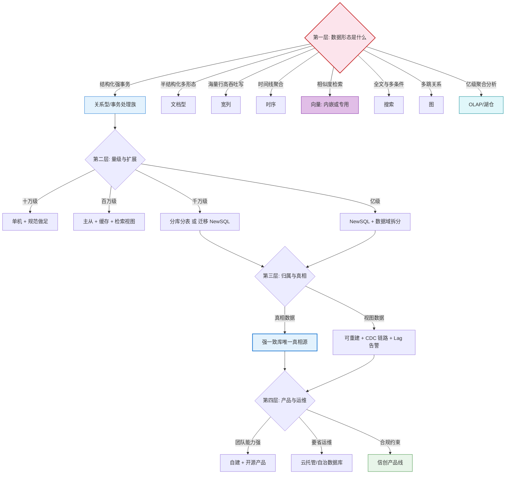
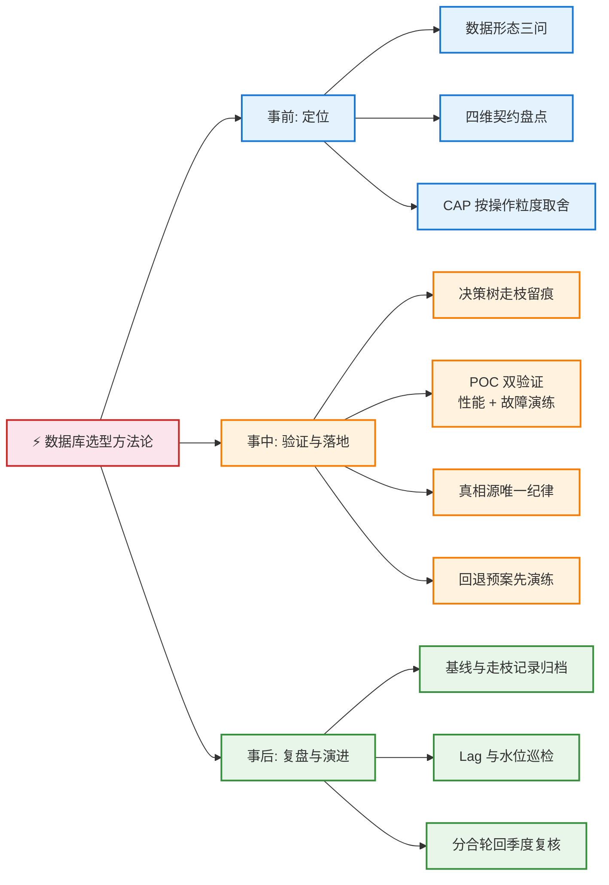
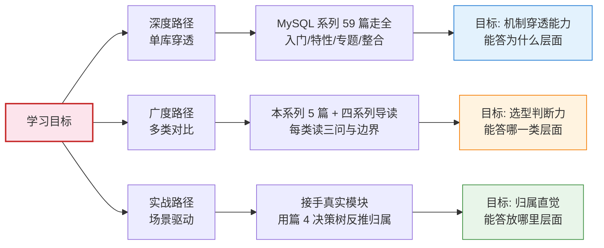
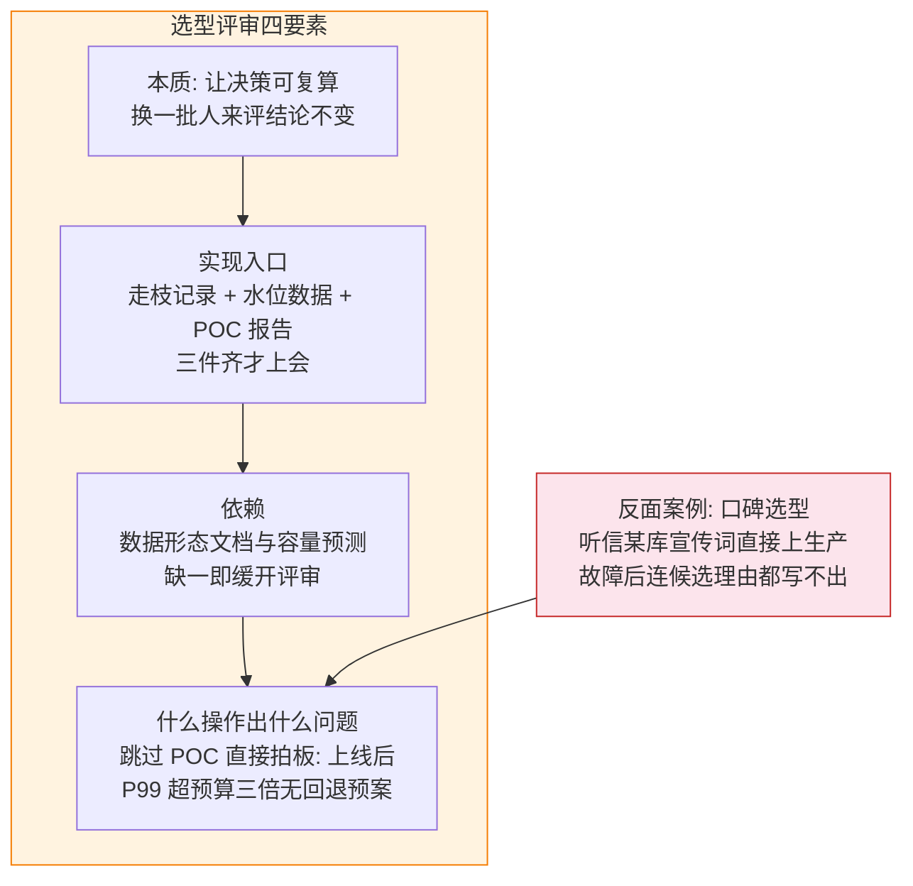
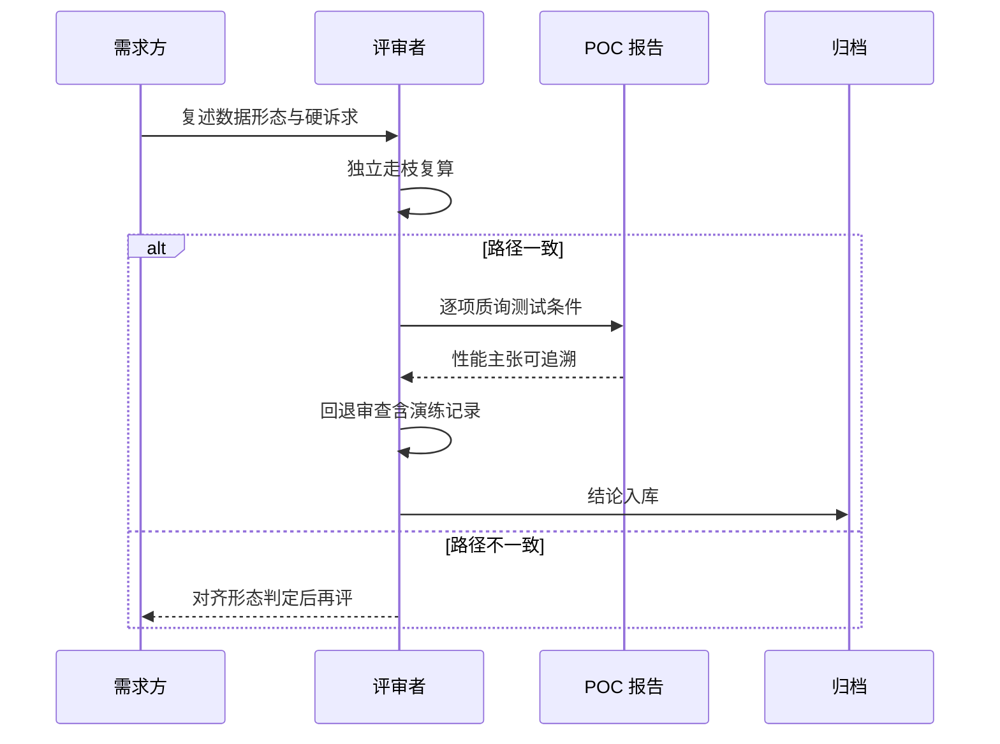
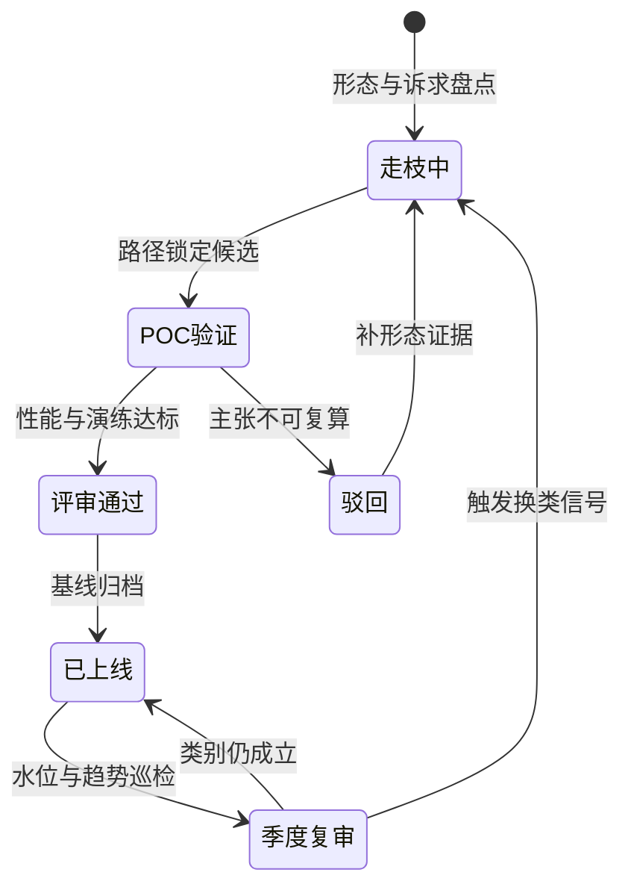

# 收官：选型决策总图与脑图

> 版图（篇 1）、契约（篇 2）、演进（篇 3）、归属（篇 4）——四篇各答一层问题，这一篇把它们**收束成一套可携带的决策装备**：一张决策树总图（从需求到库的完整走枝）、一张方法论脑图（事前-事中-事后一页收束）、三条学习路径（把这个体系装进自己脑子里的路线）。收官篇不再引入新机制，只做压缩与连接。

## 一句话摘要

数据库选型方法论可以压缩成一条动线：**事前盘点约束与形态 → 事中按决策树走枝并用 POC 验证 → 事后复盘并监控演进信号**——决策树管单次选型的走枝正确性，脑图管方法论的复述与传承，学习路径管这套认知如何长在自己身上。

## 🎯 本文核心

**核心一句话：选型的可靠性不来自记住多少产品，而来自「决策过程可以被复述、被检验、被回滚」——总图保证每次走枝有据可查，脑图保证方法论三十秒可复述，POC 与回退预案保证错了能退；三者合起来，把选型从「个人经验」变成「团队资产」。**

机制链：开篇海报（完整动线）→ 决策树总图（四层收束）→ 方法论脑图（四色一页）→ 三条学习路径（深度/广度/实战）→ 评审四要素与量级收束。

## 5W 速记卡

| 维度 | 一句话 |
|---|---|
| What | 选型决策总图 + 方法论脑图 + 三条学习路径 |
| Why | 分散在四篇的判断需要压缩成可复述可执行的装备 |
| When | 选型评审前 / 团队新人培养 / 方法论对齐时 |
| Where | 汇总篇 1-4 全部判断工具，是本系列的使用说明书 |
| How | 走枝有记录 / 复述有脑图 / 学习有路径 |

## 一、开篇海报图：一次完整选型的全景动线

```mermaid
flowchart LR
    ROOT["一次完整选型的动线<br/>从需求到生产"]
    subgraph PRE["事前: 约束与形态"]
        P1["数据形态判定<br/>结构化/文档/时序/向量"]
        P2["硬诉求排序<br/>一致性/扩展/延迟/运维能力"]
    end
    subgraph MID["事中: 走枝与验证"]
        M1["决策树走枝定大类<br/>诉求收窄定产品"]
        M2["POC 验证<br/>真实形态数据 + 故障演练"]
        M3["评审与回退预案<br/>水位数据说话"]
    end
    subgraph POST["事后: 复盘与演进"]
        O1["基线归档<br/>参数/结论/走枝记录"]
        O2["季度巡检<br/>类别还成立吗"]
    end
    ROOT --> PRE --> MID --> POST
    POST --> K["动线口诀: 形态先行 / 诉求收窄<br/>量级定形态 / POC 定生死<br/>预案定回退 / 巡检定演进"]
    style ROOT fill:#fce4ec,stroke:#c62828,stroke-width:2px
    style PRE fill:#e3f2fd,stroke:#1976d2
    style MID fill:#fff3e0,stroke:#f57c00
    style POST fill:#e8f5e9,stroke:#388e3c
    style K fill:#fce4ec,stroke:#c62828
```

这张动线图是全系列的「使用顺序」：事前两步用篇 1 的三问与篇 2 的四维契约，事中三步用本篇总图与篇 4 归属树，事后两步用篇 3 的演进信号——每个环节都能回指到具体篇目与具体工具。

## 二、选型决策总图：四层收束

四层的**设计思想**是「越靠前的层越稳定，越靠后的层越易变」：数据形态几乎不变（改形态等于重做业务），量级以年为单位变化，归属随业务形态漂移，产品选型最常变动——**决策的评审深度应该与层的稳定性成反比**：第一层花一半时间，第四层花最后的时间。走枝纪律与篇 4 一致：**每条路径记录在案**，评审可复算、半年后可复盘。

实战里最常见的三种走枝错误，评审前自查：

- **跳层**：从需求直接跳到产品层（「我们用 X 库吧」）——形态与量级两层没走，错误要到上线后才暴露；自查方法是问「第一层的结论写出来了吗」。
- **串层**：把产品层理由用来反驳形态层结论（「这个库也有事务，所以算强一致」）——能力表存在不等于默认与成本结构成立，篇 2 的契约框架管这个；自查方法是每层结论只引用本层证据。
- **倒枝**：从偏好的产品反推形态（先喜欢某库再找数据形态论证）——这是口碑选型的正式化版本，自查方法是交换评审：让没参与讨论的人只看形态文档独立走枝，结论对不上就重来。

## 三、全景脑图：选型方法论一页收束

> 方法论脑图规范（flowchart LR 单向展开 + 四色语义：根粉/事前蓝/事中橙/事后绿）。适用性判定：方法论总览属于「层次主导」型信息——把顺序箭头删掉依然成立，适合脑图形态；若是强时序流程则应改用流程图。

**怎么用这张脑图**：新人入职讲选型规范，用它在十分钟内复述全系列骨架；评审会前自查，十个叶节点逐一过——任何一叶答不上来，就回到对应篇目补深度。脑图不是知识本身，是知识的**目录索引**；它刻意不展开参数与产品名，因为那一层变化太快，属于各篇正文与官方文档的范畴。

**合理应用判定的边界**：脑图适合「层次主导」的方法论信息（删掉顺序箭头依然成立），不适合强时序流程与包含具体示例值的机制讲解——后者请用流程图与四要素图（本系列各篇的示范）。一张方法论只收束一张脑图，多张脑图等于没有脑图；叶节点数控制在 10-15 个，超过就说明你在脑图里写正文了。

**追问：脑图与总图会不会重复？**——不会，二者粒度不同：总图是「走枝工具」（带判断分支，每次选型走一遍），脑图是「复述工具」（无分支，纯层次，一次成形长期复用）；一个管执行的准确性，一个管传承的效率。**架构层面的分工**：总图属于评审流程的上下游衔接件，脑图属于团队认知的公共资产——前者服务决策现场，后者服务组织记忆。

## 四、三条学习路径

把十大类与四大系列装进脑子，有三种走法，按目标选：

| 路径 | 适合谁 | 入口 | 验收标准 |
|---|---|---|---|
| 深度路径 | 要吃透一个主库的 | [MySQL 系列导读](../../mysql/入门层/从零开始认识MySQL系列/0_系列导读-全景.md) | 能脱稿讲清一条写请求的四层日志链路 |
| 广度路径 | 要建立版图判断力的 | 本系列篇 1 + [HBase 导读](../../hbase/入门层/从零开始认识HBase系列/0_系列导读-全景.md) + [ES 导读](../../elasticsearch/入门层/从零开始认识Elasticsearch系列/0_系列导读-全景.md) | 十大类每类能答三问且说清邻座边界 |
| 实战路径 | 要马上做归属决策的 | 本系列篇 4 + [Redis 高可用](../../../middleware/redis/整合层/1_Redis高可用演进之路-深度.md) | 手头模块每张表能画出归属与重建方式 |

三条路径不互斥，**推荐的组合顺序是广度打底 → 实战校准 → 深度穿透**：先用广度建立坐标系，再在实战里发现「哪些深度值得花时间」，避免一上来就平铺十个库的入门文（那是最常见的低效学法）。

这套组合顺序背后的**设计哲学**值得点透：学习资源的分配要服从「边际收益递减」——广度阶段每多读一类，选型判断力都在涨；单库深度读到第三层机制之后，收益开始依赖你是否真的在生产里用到它。所以深度不该提前囤积，该由实战信号触发。**反直觉的是**：多数人的低效不是学太浅，是「在没用的地方学太深」——把第一个学的库当成全部世界的模板，MySQL 学成之后用单机直觉去理解 HBase 的 Region 分裂，处处别扭；广度打底的价值正是先知道「结构有多少种」，再选一个扎下去，扎的每一步都知道自己在坐标系里的位置。**设计取舍的另一面**：广度打底的时间成本是真实的（本系列加四个导读约一天），对明确只想吃透单库的人可以直接走深度路径——路径选择本身也要按需求走枝，这正是本系列方法论的自反应用。

## 五、四要素图：选型评审的可靠性从哪来

评审可靠性的敌人不是「选错」，是「说不清当初为什么选」——所以四要素把重心放在**留痕与可复算**上：走枝记录让结论可复算，水位数据让触发可验证，POC 报告让性能主张有出处，回退预案让错误可挽回。**事故叙事**：某团队按技术社区口碑引入一个新存储，半年后容量模型不匹配需要换回，却发现当初没有留下任何评审记录——换回的方案要重新走一遍本该半年前走完的论证，双倍成本全部来自「当初没留痕」。

评审现场的执行时序（与执行清单一一对应）：

alt 分支标出了评审的**中途出口**：形态判定对不齐就不该进入产品质询——顺序错了的评审，结论只是把争论推迟到上线后。

选型结论不是「通过即终点」，它有自己的生命周期：

状态机里最容易被跳过的迁移边是「季度复审」——多数团队的选型结论默认永久有效，而数据库版图（篇 1）是变化最快的版图之一；**复审不是不信任当初的决策，是承认「约束会漂移」**：量级涨了、查询形态变了、趋势层（内嵌化/多模合一）落地了，都会让两年前正确的结论今天变成负债。

## 六、不同量级的思考：约束驱动学习与选型

- **十万级（学习与演示场景）**：约束来源是**搭建成本与认知负载**。这一档的核心问题是**用最少的组件跑通最大覆盖面的学习闭环，而不是复刻大厂全家桶**；思考方式是**最小闭环驱动**：一个容器编排文件拉起单机 MySQL + Redis 就能练完本系列七成概念，向量与时序等进阶类用嵌入式单机版即可。
- **百万级（小到中型生产）**：约束来源是**真实读写分化的第一次出现**。这一档的核心问题是**在真实流量里校准课本阈值（命中率/延迟/复制延迟），而不是直接套用行业常数**；思考方式是**实测校准驱动**：自己的业务 P99 预算、自己的写入形态，让篇 2 的信号清单在这一档变成自己系统的数字。
- **千万级（改造决策密集期）**：约束来源是**不可逆成本陡增**。这一档的核心问题是**把评审深度与决策不可逆性配对（分片键/归属/产品三个决策上花足评审时间），而不是平均用力**；思考方式是**可逆性分级驱动**：每一档决策先问「错了退回去多少钱」，钱越多的决策走枝记录越细、回退演练越真。
- **亿级（平台化阶段）**：约束来源是**组织规模与决策规模的不匹配**。这一档的核心问题是**把个人判断沉淀为平台能力（选型模板/归属基线/巡检清单），而不是让每个团队重新踩一遍同样的坑**；思考方式是**资产化驱动**：本系列的决策树、脑图、参数清单在这一档的价值兑现——它们从「个人学习笔记」变成「组织的选型基础设施」。

**自下而上与触发升级**：学习路径与选型动线一样要自下而上——从十万级的单机闭环长起，每一档把上一档的认知压成工具（清单/脑图/模板），触发升级时工具随人走；跳级学习的代价是概念悬空（没养过单机的人学分片，永远不知道分片在解决什么）。

## Trade-off：压缩与展开的取舍

| 形态 | 买到 | 付出 |
|---|---|---|
| 脑图/总图（压缩态） | 三十秒复述 / 新人传承 | 丢失参数与例外的细节 |
| 系列正文（展开态） | 机制与事故的完整逻辑 | 复述成本高，不宜做日常速查 |
| 清单模板（执行态） | 评审现场逐项可打勾 | 只覆盖已知项，新形态要人工补 |

三种形态各司其职——**为什么三种都要**？因为选型知识的失效方式不同：脑图失效于「没人记得住」，正文失效于「没人读得到」，清单失效于「没人打得全」；压缩态管传承，展开态管理解，执行态管落地。这也是本系列以「总图 + 脑图 + 清单」收官而非以「知识点清单」收官的原因：知识不落成工具，半年后只剩标题。

## 第一眼参数清单：验证环境的最小配置

> 搭建学习/POC 环境的第一张表（默认值为官方文档口径/业内认知口径，以所用版本文档为准）。

| 配置项 | 默认值 | 分档推荐 | 为什么 |
|---|---|---|---|
| MySQL innodb_buffer_pool_size | 134217728（128MB） | 演示环境 512MB 起 | 默认值过小会让演示环境的查询延迟失真，误导 POC 结论 |
| Redis maxmemory | 0（不限制） | 容器限额的 70% | 容器内存限额 + 无上限缓存 = 第一颗 OOM 雷 |
| ES JVM heap | 1GB | 单机演示 2GB 内 | 演示环境不必追 31GB 上限，稳定性优先 |
| pgvector HNSW lists | 无默认（建索引必填） | 十万级数据 100 左右起 | 参考值随数据量按平方根量级调整（业内认知口径） |
| ClickHouse max_memory_usage | 约内存九成（公开口径） | 容器环境显式设小 | 分析型查询吃内存猛，容器限额下必须显式封顶 |
| HBase hbase.hregion.memstore.flush.size | 134217728（128MB） | 单机演示保持默认 | 默认值对学习场景已够，改小反而增加刷盘噪音 |

## 步骤级：一次标准选型评审的执行清单

**前置条件**：数据形态文档与容量预测（缺一缓开）；决策树走枝记录（第一到第四层的路径与依据）；POC 报告（性能数据 + 故障演练记录）；回退预案（含演练记录）。

**步骤**：
1. 需求复述——评审开始由需求方复述数据形态与硬诉求排序——验证：走枝记录第一层结论与复述一致。
2. 走枝复算——评审者独立沿总图走一遍，对照申请方路径——验证：两方路径一致；不一致时先对齐形态判定再谈产品。
3. POC 质询——按报告逐项质询压测条件（数据量/形态/故障场景是否贴近生产）——验证：每项性能主张能追溯到测试条件。
4. 回退审查——回退预案的触发条件与演练记录——验证：回退动作在预发真跑过一次。
5. 结论归档——决策记录（背景/候选/结论/回退/复审日期）入库——验证：一周内任何人可凭记录复算出同一结论。

**回退**：评审本身无回退，但「缓开评审」是合法输出——前置材料不齐时宁可延期，评审会上补材料的决策质量必然打折；上线后按归档的复审日期触发季度巡检（篇 1 趋势层 + 本篇总图）。

## 💡 实战提示

💡 **把总图四层的「评审时间分配」写进评审议程**——形态与归属层花七成时间、产品层花三成；现实评审往往反过来（产品争论一小时，形态十分钟），这是选型返工的会议根源。

💡 **脑图打印贴墙不如放入 onboarding 文档**——贴墙的图三个月后没人看；把脑图挂进新人入职清单，配合「十分钟复述」检查，才真正完成传承。

💡 **POC 报告必须写「测试条件」而不只写「测试结果」**——同样的库，点查为主的测试与扫描为主的测试结论可以完全相反；只看结果的评审会被测试形态无意（或有意）误导。

💡 **学习路径每季度回看一次完成度**——用验收标准（表里的三句话）自测，达标的打勾；学习计划没有验收标准，与没有计划等价。

## 你们可能会问

**问：总图四层会不会漏掉某些维度（成本/合规/团队）？**——成本与合规在第四层「产品与运维」里（云托管/信创分支），团队运维能力贯穿第二到第四层的收窄判断；总图刻意不把所有维度画成节点——节点越多走枝越难执行，维度归入层内的判断项更可操作。

**问：方法论脑图为什么用 LR 而不是放射状 mindmap？**——单向展开（flowchart LR）让阅读顺序确定、层级关系稳定，放射状布局的节点位置随渲染浮动，复述时「从哪说起」不统一；四色语义（事前蓝/事中橙/事后绿/根粉）承担了第二层信息。

**问：三条学习路径必须走完吗？**——不必，按目标选一条走深：深度路径适合吃透主库的，广度路径适合做选型判断的，实战路径适合马上接模块的；本系列五篇是广度路径的主干，也是另两条路径的坐标系。

**问（开放问题）：这套决策装备会不会被 AI 选型助手替代？**——值得讨论但未定论：助手可以压缩产品对比的展开态，但形态判定依赖业务上下文、回退预案依赖组织现实，这两层短期内仍是人的责任。**我的判断**：工具会接管第四层（产品对比），第一到第三层（形态/量级/归属）的判断框架反而因为工具普及而更值钱——会提问的人才能用好会回答的工具。

## 什么时候用 / 不用：明确推荐

**明确推荐**：每次正式选型评审按本篇执行清单走全程；团队 onboarding 用脑图 + 学习路径组合；季度巡检用总图对照存量系统（每一层重新过一遍）。

**不要**：把总图当表格逐格填——它是走枝工具，走枝的核心是「记录判断依据」，填格子式使用会把方法论退化成新形式的拍脑袋；**不要**用脑图替代正文学习——脑图是索引，只有索引没有正文的知识体系经不起追问，而选型评审的本质就是追问。

## 🎯 核心带走

**核心一句话：选型的可靠性来自决策过程的可复算、可复述、可回滚——总图管走枝有据，脑图管复述有形，清单管落地有钩，学习路径管认知长在自己身上；知识不压成工具，半年后只剩标题。**

链条复述：动线海报（事前-事中-事后）→ 总图四层（形态/量级/归属/产品，评审深度与层稳定性成反比）→ 脑图一页（四色复述骨架）→ 三条路径（广度打底、实战校准、深度穿透）→ 评审四要素（留痕与可复算）。

失效点与边界：本篇工具为通用骨架，团队自有约束（既有技术栈、合规边界）要在走枝时叠加为额外判断项；产品层信息变化最快，引用前先对照篇 1 趋势层与官方文档复核。

## 自测三问

1. 用脑图对同事复述本系列，十分钟能不能讲完十个叶节点？
2. 你最近一次选型决策，走枝记录与回退预案现在找得到吗？
3. 三条学习路径里你在哪一条？验收标准自测能过吗？

## 📌 数据与事实声明

- 数据截至 2026-09；参数默认值为官方文档口径与业内认知口径，以所用版本文档为准
- 反面案例为行业常见模式的脱敏改写，不含真实公司数据
- 学习路径篇数为本库 gate 统计口径，随批次更新
- 决策总图与脑图为工程方法论沉淀，不构成任何产品推荐

## 📚 参考资料

| 类型 | 标题 | 来源 |
|---|---|---|
| 站内 | 本系列篇 1：数据库全景地图 | `data/整合层/从零认识数据库体系系列/1_数据库全景地图：十大类一张图-整合.md` |
| 站内 | 本系列篇 2：关系型与非关系型的本质差异 | `data/整合层/从零认识数据库体系系列/2_关系型与非关系型：本质差异与选型-整合.md` |
| 站内 | 本系列篇 3：架构演进到 NewSQL | `data/整合层/从零认识数据库体系系列/3_数据库架构演进：单机到分布式NewSQL-整合.md` |
| 站内 | 本系列篇 4：什么数据放什么库 | `data/整合层/从零认识数据库体系系列/4_什么数据放什么库：业务分配决策树-整合.md` |
| 站内 | 数据存储域首页全景图 | `data/index.md` |
| 站内 | MySQL / ES / HBase / Redis 四系列 | 各域 index.md 入口 |
