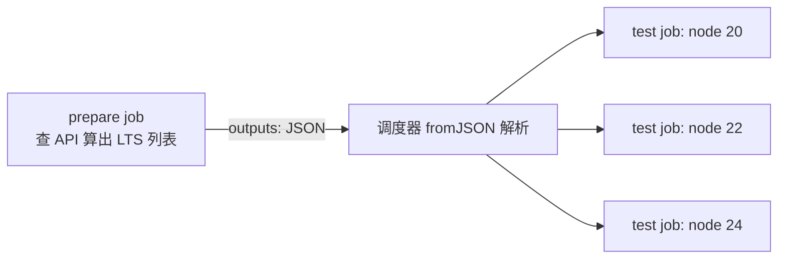
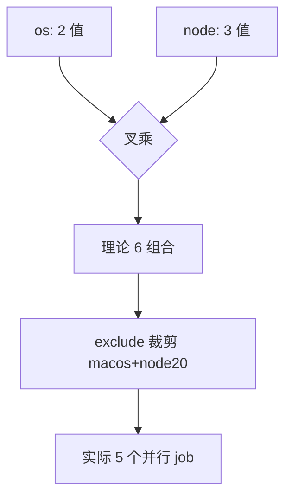

# Matrix 矩阵实战：多版本多环境测试的正确姿势

> **一句话摘要**：matrix 用「一组键值组合生成 N 个 job」——多语言版本、多操作系统、多配置的测试矩阵一条配置搞定；本篇给可复制的矩阵模板与进阶技巧（include/exclude/动态矩阵），以及四个矩阵特有的踩坑。

前置阅读：[GHA 实战总览](../github-actions/1_overview.md)。

## 1. 场景与适用边界

适用：库/SDK 要验证「多版本兼容」（Node 20/22/24 × Linux/macOS）、应用要验证「多配置组合」（数据库版本 × 缓存开关）。不适用：组合数爆炸的场景（3 维度 × 各 5 值 = 125 job，额度与时长都失控）——先做正交裁剪再上矩阵。

## 2. 基础矩阵（可直接复制）

```yaml
jobs:
  test:
    runs-on: ${{ matrix.os }}
    strategy:
      fail-fast: false            # 一个组合失败不要取消其余(见踩坑1)
      max-parallel: 6             # 并发上限: 控额度
      matrix:
        os: [ubuntu-latest, macos-latest]
        node: [20, 22, 24]
        exclude:
          - os: macos-latest      # 裁剪低价值组合
            node: 20
    steps:
      - uses: actions/checkout@v4
      - uses: actions/setup-node@v4
        with: { node-version: "${{ matrix.node }}", cache: npm }
      - run: npm ci
      - run: npm test
```

6 个有效组合并行跑，`matrix.node`/`matrix.os` 在 step 里引用当前组合。**分片均衡**原则：每个组合的耗时差不宜过大（慢 OS 会拖长整体），差异大就把慢组合单独拆 job。

## 3. 进阶：include 补充与动态矩阵

```yaml
    strategy:
      matrix:
        node: [20, 22]
        include:
          # include 追加"额外维度"的组合: 仅在最新版上跑 windows
          - node: 22
            os: windows-latest
            coverage: true          # 自定义变量随组合下发
    steps:
      - run: npm test ${{ matrix.coverage == 'true' && '-- --coverage' || '' }}
```

组合本身要动态生成时（如「对最近三个 LTS 版本测试」），在**前置 job 里算出 JSON**、后置 job 用 `fromJSON` 消费——这个两阶段模式的机制原理是：matrix 定义在 job 调度之前就要确定，所以「动态值」必须先由一个普通 job 算出来、经 outputs 传给调度器：

```yaml
jobs:
  prepare:
    runs-on: ubuntu-latest
    outputs:
      versions: ${{ steps.calc.outputs.v }}
    steps:
      - id: calc
        run: echo "v=[20,22,24]" >> "$GITHUB_OUTPUT"   # 实际场景查 API 动态算
  test:
    needs: prepare
    strategy:
      matrix:
        node: ${{ fromJSON(needs.prepare.outputs.versions) }}
    runs-on: ubuntu-latest
```



矩阵组合的生成关系（正交展开 + exclude 裁剪）：



从 CI 架构的上下游看，矩阵是「一台 runner 的验证能力」向「一组环境的验证矩阵」的横向扩展——它把「多版本兼容」从人工排期演进成每次提交的例行公事；组合数量的代价（额度与时长）就是它的权衡成本，正交裁剪是第一步功课。

## 4. 四个矩阵特有的踩坑（现象/根因/解决/验证）

1. **现象：一个组合红了，其他组合全部被取消，看起来「大面积崩了」**。根因：默认 `fail-fast: true`——第一个失败立即取消进行中的兄弟 job。解决：测试矩阵显式 `fail-fast: false`（要全部结果做兼容性判断）；发布流水线才用 fail-fast 省额度。验证：制造一个必败组合，其余组合照常跑完。
2. **现象：矩阵全绿但某版本其实没测到**。根因：exclude 写错（对象字段不匹配）静默裁掉了组合。解决：job 名里带上完整组合（`name` 字段拼接 `matrix.os` 与 `matrix.node` 两个上下文变量），一眼核对组合清单。验证：Actions 页面数 job 数量与设计组合数一致。
3. **现象：多版本测试互相污染**。根因：矩阵 job 共享了外部资源（同一个测试数据库、同一个缓存键）。解决：每个组合独立资源后缀（把 `matrix` 组合值拼进库名/缓存键）。验证：并行跑两个组合，检查各自连接串。
4. **现象：动态矩阵 `fromJSON` 报错**。根因：前置 job 的 output 是字符串，或 JSON 带空格换行。解决：`echo "v=['20','22']" >> "$GITHUB_OUTPUT"` 严格紧凑 JSON；调试时先 `echo` 出来看。验证：prepare job 的 outputs 面板里 JSON 可直接解析。

## 5. 方案取舍

| 取舍 | 选项 A | 选项 B | 依据 |
|---|---|---|---|
| 组织方式 | 单 workflow 内 matrix | 拆多个 workflow | 同质组合（同步骤不同值）用 matrix；流程不同的拆 workflow |
| 矩阵来源 | 静态枚举 | 动态生成（prepare job） | 值稳定用静态（直观）；跟随外部事实（LTS 列表）用动态 |
| fail-fast | true（省额度） | false（全量结果） | 兼容性测试要 false；快速失败型发布流水线要 true |

## 6. 端到端验证清单

- [ ] job 数量 = 预期组合数（exclude 裁剪后），名称含组合信息
- [ ] 人为制造失败 → 其他组合跑完（fail-fast: false 生效）
- [ ] 各组合使用独立外部资源（库名/缓存键带矩阵后缀）
- [ ] max-parallel 生效：同时运行数不超上限
- [ ] 矩阵总时长 ≈ 最慢组合（而非组合之和）

---

## 📌 数据与事实声明

本文版本锚点（截至 2026-09-09）：GitHub Actions Runner v2.337.0。matrix/include/exclude/fromJSON 语义为 GitHub 官方文档内容；分片均衡为行业实践。具体行为以官方文档为准。

## 📚 参考资料

| 类型 | 标题 | 来源 |
|---|---|---|
| 文档 | GitHub Actions: using a matrix | docs.github.com/actions |
| 系列文章 | GHA 总览 / 可复用工作流 | 本仓库 docs/devops/cicd/ |
