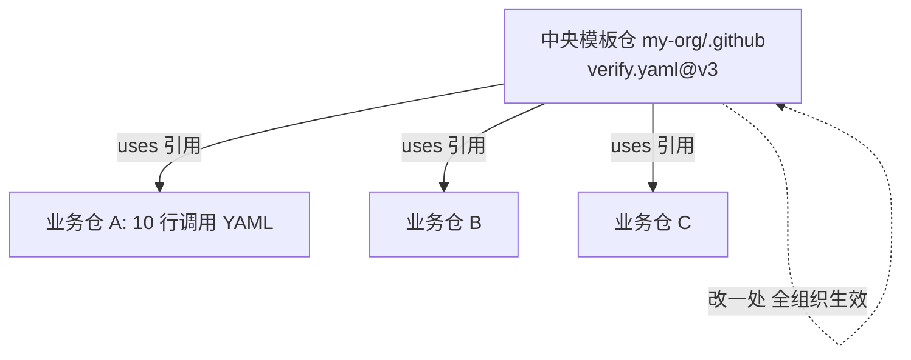

# 可复用工作流实战：组织级流水线标准化

> **一句话摘要**：reusable workflow 让「一条标准流水线」被全组织仓库引用——定义一次（workflow_call），各仓库传参数调用；它是把[流水线设计原则](../入门层/从零开始认识CICD系列/2_流水线设计原则-入门.md)落成组织资产的机制，配套版本策略与权限边界。

前置阅读：[GHA 实战总览](../github-actions/1_overview.md)。

## 1. 场景与适用边界

适用：10+ 仓库的团队要统一「验证/打包/发布」流程——改一处生效全局，避免每个仓库各抄一份 YAML 后各自漂移。不适用：单仓库小项目（一层抽象的维护成本大于收益）；流程差异极大的仓库（复用「骨架 + 钩子」而不是硬套同一模板）。

## 2. 定义与调用（可直接复制）

```yaml
# .github/workflows/verify.yaml  —— 定义方（组织模板仓库）
name: Verify
on:
  workflow_call:
    inputs:
      node-version: { type: string, default: "22" }
      run-e2e:       { type: boolean, default: false }
    secrets:
      REGISTRY_TOKEN: { required: true }
    outputs:
      version:
        value: ${{ jobs.build.outputs.version }}

jobs:
  verify:
    runs-on: ubuntu-latest
    steps:
      - uses: actions/checkout@v4
      - uses: actions/setup-node@v4
        with: { node-version: "${{ inputs.node-version }}", cache: npm }
      - run: npm ci && npm run lint && npm test
```

```yaml
# 业务仓库 .github/workflows/ci.yaml  —— 调用方
jobs:
  verify:
    uses: my-org/.github/.github/workflows/verify.yaml@v3   # 版本化引用
    with:
      node-version: "22"
      run-e2e: true
    secrets:
      REGISTRY_TOKEN: ${{ secrets.REGISTRY_TOKEN }}

  deploy:
    needs: verify
    if: github.ref == 'refs/heads/main'
    runs-on: ubuntu-latest
    steps:
      - run: echo "deploy version ${{ needs.verify.outputs.version }}"
```

读法：`uses:` 直接指向另一个仓库的 workflow 文件；`with`/`secrets` 传参；`needs` + `outputs` 取结果。**secrets 不自动透传**（显式声明才能拿到，这是安全设计，也是头号踩坑）。复用的组织形态一张图：



这套机制的演进意义：把流水线从「每个仓库各自维护的脚本」变成「组织级的基础设施资产」——版本策略（@v3 档）让各仓库按自己的节奏跟进更新，架构上则把「流程定义」与「业务仓库」的上下游解耦：模板仓管流程的正确性与安全基线，业务仓只管传参数。

## 3. 版本策略与权限边界

- **引用版本三档**：`@main`（实时生效——改一处全组织立即变，风险高）；`@v3`（大版本浮动——兼容性更新自动获得）；完整 SHA（审计级钉死）。业内惯例：业务仓库用 `@v3` 档，模板仓库用「main 开发 → 发版 tag」的发布纪律，重大不兼容改版发 `v4`。三档的风险与更新及时性是一组权衡：

```mermaid
flowchart LR
    M[模板仓 main 更新] --> V1[@main: 立即生效<br/>风险高]
    M -->|发版 tag v3| V2[@v3: 兼容更新自动获得<br/>日常推荐]
    M -->|记下完整 SHA| V3[SHA: 钉死<br/>审计级]
```
- **GITHUB_TOKEN 权限**：被调用方拿到的 token 权限 ≤ 调用方声明。模板里显式 `permissions:` 最小集；调用方把 `permissions: contents: read` 等按需下发——权限在两边的交集里，收紧要两边同步。
- **模板仓库的组织位置**：惯例放 `my-org/.github`（GitHub 约定特殊仓库）或 `my-org/workflows`，配合 CODEOWNERS 让模板变更走专属评审——模板是组织级基础设施，改动要有 owner。

## 4. 五大高频踩坑（现象/根因/解决/验证）

1. **现象：被调用方报「secret 未找到」**。根因：secrets 不自动透传，且 `secrets: inherit` 一下传全部是宽授权。解决：显式声明 secrets 清单（required/optional）；确需全传时用 `secrets: inherit` 并写明理由与审计。验证：新仓库接入时只配清单内 secret 即可跑通。
2. **现象：改了模板，业务仓库没生效**。根因：引用的是 `@v3` 而修改推在了 main——tag 不动当然不生效。解决：模板改完走发版（移动/新发 tag），并带「发版公告」让各仓库知悉重大变更。验证：业务仓库 Actions 页看 verify job 的 ref 与版本号。
3. **现象：job 里拿不到调用方的上下文**。根因：被调用 workflow 里 `github.event`/`github.ref` 是调用方的值，但部分上下文（如 `github.token` 权限）按声明收敛——直接照搬单仓代码常踩。解决：把依赖的上下文显式做成 `inputs` 传入，模板不「偷看」调用方环境。验证：模板里打印关键 inputs（脱敏）核对。
4. **现象：调用链复杂后「改一个小模板、全组织大排队」**。根因：所有仓库在 main 分支高频触发同一模板，并发额度被吃满。解决：模板层内置 `concurrency` 分组与触发收敛（见[GHA 总览](../github-actions/1_overview.md)）；额度评估进模板变更流程。验证：高峰期排队时长监控。
5. **现象：两个模板互相调用形成环，或 job 深度超限**。根因：复用链路无规划（A 调 B、B 调 A），或单链超过 GHA 的调用深度上限（4 层）。解决：复用链单向分层（基础模板 ← 业务模板 ← 仓库入口），画一张复用关系图随模板仓维护。验证：架构图核对调用方向，最深链 ≤ 4 层。

## 5. 方案取舍

| 取舍 | 选项 A | 选项 B | 依据 |
|---|---|---|---|
| 复用机制 | reusable workflow（整条流水线级） | composite action（step 级复用） | 复用「流程」用 workflow（有 job/needs 语义）；复用「几步命令」用 composite（轻量、无 secrets 语义） |
| 版本策略 | 浮动大版本 @v3 | 钉死 SHA | 通用流水线用 v 档（自动获修复）；安全敏感/审计要求高的钉 SHA |
| 组织形态 | 中央模板仓 | 各域自治模板 | 强一致性诉求用中央仓；域差异大用「基础 + 域模板」两层 |

## 6. 端到端验证清单

- [ ] 新仓库接入：复制 10 行调用 YAML + 配 2 个 secret 即跑通
- [ ] 模板发新版本 tag 后，抽查 3 个仓库生效版本一致
- [ ] 显式 secrets 清单之外的 secret 泄漏测试：模板内引用未声明 secret 时报错而非静默
- [ ] permissions 最小集：被调用 job 无法执行未声明的写操作
- [ ] 复用关系图与实际调用链一致，最深 ≤ 4 层

---

## 📌 数据与事实声明

本文版本锚点（截至 2026-09-09）：GitHub Actions Runner v2.337.0。workflow_call/inputs/secrets/复用深度上限（4 层）为 GitHub 官方文档内容；版本策略与模板仓组织形态为业内实践惯例。具体行为以官方文档为准。

## 📚 参考资料

| 类型 | 标题 | 来源 |
|---|---|---|
| 文档 | GitHub Actions: reusable workflows | docs.github.com/actions |
| 文档 | About `my-org/.github` 约定仓库 | docs.github.com |
| 系列文章 | GHA 总览 / Matrix 实战 | 本仓库 docs/devops/cicd/ |
