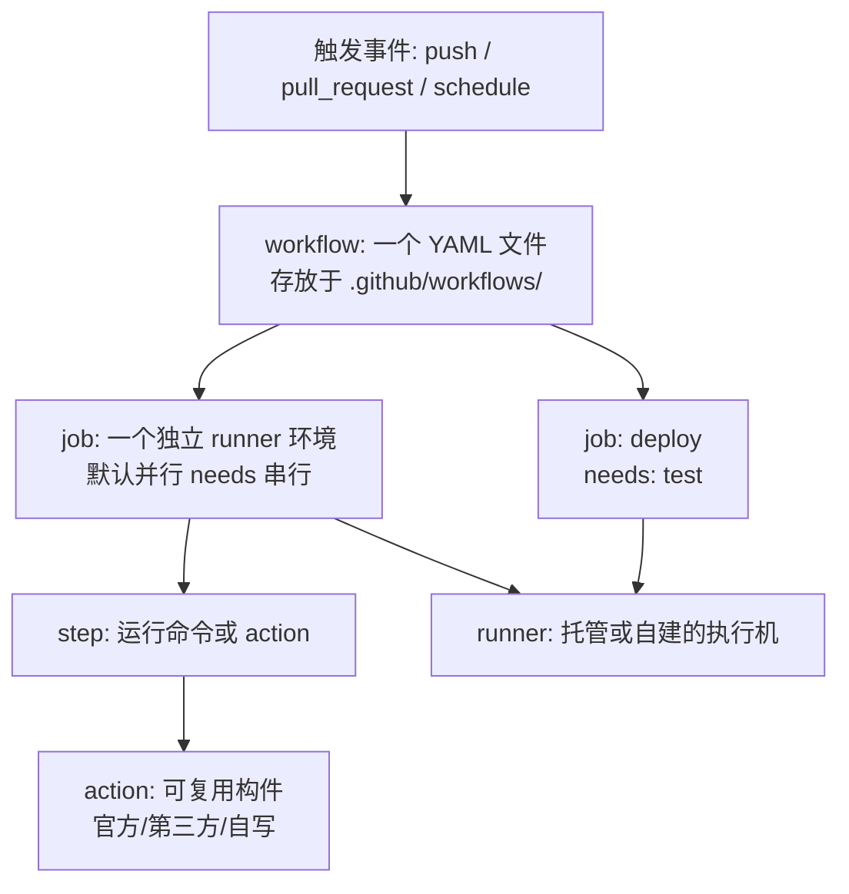
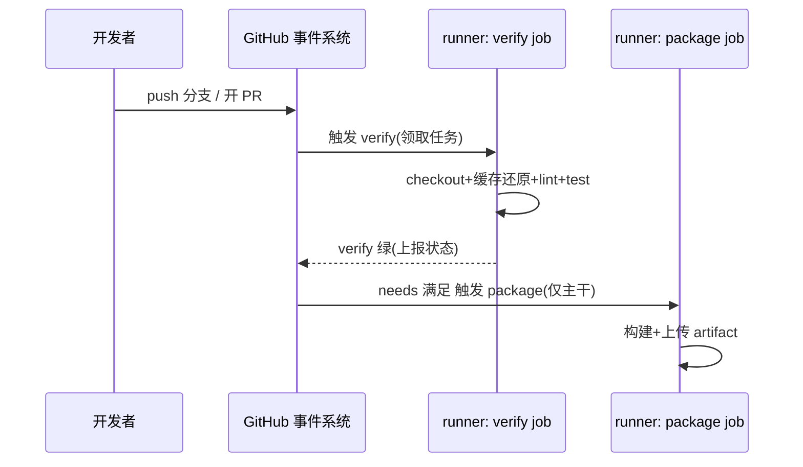

# GitHub Actions 实战总览：心智模型与最小可用流水线

> **一句话摘要**：GHA 的全部概念只有五层——workflow（文件）→ job（机器）→ step（步骤）→ action（复用件），跑在 runner（机器池）上；本篇用一条「lint + 测试 + 打包」的可复制 workflow 把五层概念一次跑通，并给出配置要点与五个高频踩坑。

前置阅读：[流水线设计原则](../入门层/从零开始认识CICD系列/2_流水线设计原则-入门.md)（本篇是它的 GHA 实现）。

## 1. 场景与适用边界

适用：代码在 GitHub（或迁移中）、需要 PR 验证/主干打包/发布自动化的团队——GHA 零运维、生态最全。不适用：强内网隔离环境（runner 出不了网）、超大并发的重度使用（托管额度成本，可自建 runner 缓解）。

## 2. 心智模型：五层概念一张图



读图要点：**job 是计费与隔离单元**（每个 job 一个干净环境，状态不共享，靠 artifacts 传递产物）；**needs 表达依赖**（`deploy` 需要 `test` 绿了才跑）；**action 是复用单元**（`actions/checkout@v4` 这类引用，区别于手写 `run:` 命令）。这套模型从 2018 年 GHA 上线以来机制层面保持稳定——十年间演进的是生态（action 数量、托管能力、组织级复用），架构上的五层抽象没变过；理解这一点，换平台时也能按「事件 → job → step」的上下游模型快速映射。一次 PR 触发的执行时序：



## 3. 最小可用 workflow（可直接复制）

```yaml
# .github/workflows/ci.yaml
name: CI
on:
  pull_request:                 # PR 触发验证
  push:
    branches: [main]            # 主干触发打包

concurrency:                    # 同分支新提交取消旧任务: 省额度
  group: ci-${{ github.ref }}
  cancel-in-progress: true

jobs:
  verify:
    runs-on: ubuntu-latest
    steps:
      - uses: actions/checkout@v4
      - uses: actions/setup-node@v4
        with: { node-version: 22, cache: npm }   # 官方缓存入口
      - run: npm ci
      - run: npm run lint
      - run: npm test -- --coverage
      - uses: actions/upload-artifact@v4      # 产物传给下游 job
        if: always()
        with:
          name: coverage-report
          path: coverage/

  package:
    needs: verify               # 依赖: 验证绿了才打包
    if: github.ref == 'refs/heads/main'
    runs-on: ubuntu-latest
    steps:
      - uses: actions/checkout@v4
      - uses: actions/setup-node@v4
        with: { node-version: 22, cache: npm }
      - run: npm ci && npm run build
      - uses: actions/upload-artifact@v4
        with: { name: dist, path: dist/ }
```

这 40 行覆盖了日常九成需求：触发收敛（PR + 主干）、并发取消、官方缓存、依赖编排、产物传递。复杂化之前先把这条跑顺——**先设计链路（见流水线设计篇），再往里加东西**。

## 4. 关键配置与决策点

- **密钥**：YAML 里用 `secrets` 上下文引用密钥（模板标记包 `secrets.XXX`），值从仓库 Settings → Secrets 注入，仓库文件里只有引用；注意 fork PR 默认拿不到 secrets（这是保护，见踩坑 2）。
- **缓存**：优先用官方 setup-action 的内置 cache；非标目录用 `actions/cache@v4`，键设计规则见[构建提速篇](../入门层/从零开始认识CICD系列/3_构建提速-缓存与并行-入门.md)。
- **job 间传数据**：产物走 `upload/download-artifact`，小数据（版本号等）走 job `outputs`。文件系统在 job 之间不存在，硬记。
- **权限**：`permissions:` 显式声明最小 GITHUB_TOKEN 权限（默认权限过大，业内惯例收紧到 job 需要的最小集）。

## 5. 五大高频踩坑（现象/根因/解决/验证）

1. **现象：第三方 action 突然行为变化/被投毒**。根因：引用了 `@main` 浮动版本，作者推送即生效（供应链风险）。解决：引用 pin 到主版本 tag（`@v4`），关键流水线 pin 到完整 SHA。验证：流水线日志里版本号固定；依赖的 action 有 release 纪律。
2. **现象：fork PR 构建行为异常或「神秘失败」**。根因：fork PR 拿不到 secrets（安全设计），构建依赖了 secrets 时必挂。解决：`pull_request_target` 慎用（它给 fork 代码 secrets 权限，是已知提权漏洞来源）；需要 secrets 的步骤放在「合并后」跑。验证：fork PR 只跑无密验证集。
3. **现象：缓存「配置了但没命中」**。根因：键里含不存在的文件哈希（hashFiles 找不到文件返回空串）或 path 写错。解决：键依赖的锁文件必须先 checkout；`cache-hit` 步骤输出打出来看。验证：日志出现 `Cache restored` 与预期键值。
4. **现象：job 顺序「有时候对有时候乱」**。根因：忘了 `needs`，靠时间先后碰运气。解决：所有顺序依赖显式 `needs`。验证：workflow 图（Actions 页面可视化）连线与设计一致。
5. **现象：额度消耗暴涨**。根因：每次 push 全量触发 + 矩阵放大 + 无并发取消。解决：触发收敛 + `concurrency` 取消 + 分片均衡（见构建提速篇）。验证：Usage 页用量曲线回落。

## 6. 方案取舍

| 取舍 | 选项 A | 选项 B | 依据 |
|---|---|---|---|
| 平台 | GHA：生态最全、零运维 | GitLab CI：与自建 GitLab 一体 | 代码托管在哪、自建意愿多强 |
| runner | 托管：零维护、按分钟计费 | 自建：缓存常驻、内网可达 | 用量与网络边界决定，大用量自建省钱 |
| 部署方式 | workflow 里直接部署 | workflow 只出制品，GitOps 接管 | K8s 场景推荐后者（审计与漂移检测，见[部署策略篇](../入门层/从零开始认识CICD系列/6_部署策略与回滚-入门.md)） |

## 7. 端到端验证清单

- [ ] PR 提交后 1 分钟内任务启动（排队不算）
- [ ] lint 故意写错 → verify 秒级红、package 未启动（needs 生效）
- [ ] 同分支连推两次 → 第一次任务被取消（concurrency 生效）
- [ ] coverage-report 产物可从 Actions 页面下载
- [ ] secrets 注入的变量在日志中被掩码（打码不是泄漏）

---

## 📌 数据与事实声明

本文版本锚点（截至 2026-09-09，gh CLI 实测）：GHA Runner v2.337.0、checkout@v4/setup-node@v4/cache@v4/upload-artifact@v4。语法与安全机制（fork PR 无 secrets、`pull_request_target` 风险）为 GitHub 官方文档与公开安全公告内容。具体行为以官方文档为准。

## 📚 参考资料

| 类型 | 标题 | 来源 |
|---|---|---|
| 文档 | GitHub Actions workflow syntax | docs.github.com/actions |
| 文档 | Security hardening for GitHub Actions | docs.github.com/actions |
| 系列文章 | 矩阵实战 / 可复用工作流 | 本仓库 docs/devops/cicd/advanced/ |
