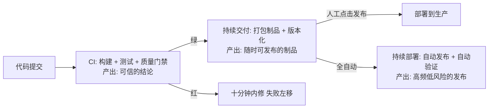
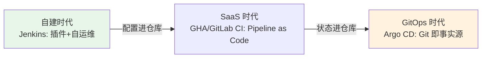

# CI/CD 是什么与演进

> **一句话摘要**：CI/CD 是把「从代码提交到线上生效」全自动化的工程实践——CI（持续集成）保证「改动是好的」，持续交付保证「随时可以发布」，持续部署保证「自动发布上线」；三段的能力边界不同，演进史上工具换了几代，链路职责从未变过。

前置阅读：[系列导读](./0_系列导读-全景.md)。镜像作为制品的构建细节归[Docker 系列](../../../docker/入门层/从零开始认识Docker系列/0_系列导读-全景.md)。

## 1. 背景：为什么需要持续集成/部署

在没有 CI 的年代，集成是一次性大事件：各分支各写几周，最后合代码、修冲突、一起调试上线——「集成地狱」。CI 的原始动机很简单：**每天多次把所有人的改动合进主干，每次都自动构建和测试**，让集成变成日常小事。CD 在此之上回答另一个问题：既然主干随时是「可构建、可测试」的，为什么不能随时发布？——于是把「发布」也标准化、自动化，变成低风险日常操作。

两个动机对应两个工程收益：**缺陷发现成本随时间指数上涨**（提交后 10 分钟发现 vs 上线后发现，修复成本差一个数量级——行业共识），**发布能力决定业务迭代速度**（发布恐惧的团队，功能堆在分支上发不出去）。

## 2. 核心机制：CI、持续交付、持续部署三段论

三段的边界要分清，混用会带来错误预期：

| 阶段 | 回答的问题 | 产出 | 自动化终点 |
|---|---|---|---|
| 持续集成（CI） | 改动是不是好的？ | 测试结论 + 门禁状态 | 合并前验证 |
| 持续交付（CD-delivery） | 能不能随时发布？ | 不可变制品 + 一键发布能力 | 制品就绪，发布需人工确认 |
| 持续部署（CD-deployment） | 发布能不能全自动？ | 高频自动发布 + 自动验证 | 全链路无人干预 |

大多数团队的现实落点是「CI + 持续交付 + 人工触发发布」——自动到制品、发布有人拍板，兼顾速度与稳妥。持续部署适合验证体系完备（金丝雀 + 自动回滚，见[部署策略篇](./6_部署策略与回滚-入门.md)）的团队。

## 3. 落地实践：从零搭一条最小流水线

1. **先定义「绿」的标准**：构建成功 + 单测全过 + lint 干净。标准没有共识，流水线会沦为「重试到绿」的装饰。
2. **按反馈速度排阶段**：最快的检查放最前（lint 秒级 → 单测分钟级 → 集成测试最后），任何一步红了立即终止——「失败左移」让最快的检查拦下最多的问题。
3. **每条主干提交触发一次**：PR 触发验证 + 合并后触发打包，频率是 CI 的灵魂——一天一次的「持续集成」不是持续集成。
4. **产物进制品仓库并打版本**：构建的镜像/包带着版本号进仓库，后续部署只引用制品，不在部署机上现场构建（原因见[制品管理篇](./5_制品管理与镜像仓库-入门.md)）。

## 4. 生产视角：CI/CD 失效的形态

- **「红着的主干」**：CI 长期红着，团队默认「红是常态」，真实缺陷淹没在噪音里。这是 CI 腐化的终点形态——回修纪律（谁红谁修、修不好回滚提交）比流水线配置重要。
- **15 分钟阈值**：构建时长超过这个量级（行业经验值），开发者开始攒提交、上下文切换成本上升，「持续」名存实亡。构建提速是 CI 的第一生产力投资（方法论见[构建提速篇](./3_构建提速-缓存与并行-入门.md)）。
- **「在我这能过」的漂移**：本地能过 CI 不过（或反之），根因是环境不一致。修法是把验证环境容器化——CI 里跑的与应用运行时同源（与 Docker 系列的环境一致性主张闭环）。
- **发布窗口恐惧**：只能在深夜低峰发、发完守到半夜——说明缺的不是勇气是机制：金丝雀验证 + 分钟级回滚（见[部署策略篇](./6_部署策略与回滚-入门.md)）。发布越自动越可控，越可控越敢高频。

## 5. 主流方案怎么做：平台演进与定位

| 世代 | 代表 | 机制特点 | 现状定位 |
|---|---|---|---|
| 自建时代 | Jenkins（2011 起） | 插件生态最全、完全自控 | 传统企业存量巨大，维护成本高 |
| SaaS 时代 | GitHub Actions / GitLab CI（2015-2019 兴起） | Pipeline as Code、托管 runner、开箱集成 | 开源与云原生主流（GHA runner 截至 2026-09 已迭代到 v2.337） |
| GitOps 时代 | Argo CD / Flux | Git 仓库作为部署状态唯一事实源，集群向 Git 收敛 | K8s 交付的主流演进方向 |

演进的底层逻辑：**流水线定义从「平台上的配置」变成「仓库里的代码」**（可评审、可版本化、可复用），部署状态从「脑中的记忆」变成「Git 的声明」（可审计、可漂移检测）。工具会继续换，这两个方向不会回退。从交付架构的上下游看，三代平台的分工边界也在演进——自建时代流水线与制品混在一起，SaaS 时代构建与托管解耦，GitOps 时代把「期望状态」从流水线剥离给 Git；每一步解耦都降低了单点的代价，这是平台架构演进真正的权衡主线：

## 6. 典型场景

- **开源库**（反馈级）：PR 触发多版本测试矩阵 + 质量门禁，合并即发布预览版——社区协作的信任基础。
- **单体业务应用**（交付级）：主干 CI + 制品化 + 每日定时部署窗口，发布节奏与业务节奏对齐。
- **微服务集群**（规模级）：各服务独立流水线 + 统一的可复用工作流模板 + GitOps 收敛部署状态——规模化的标准化诉求（实践见[可复用工作流篇](../../advanced/reusable-workflows.md)）。

## 7. 与相邻概念的区别

- **持续交付 vs 持续部署**：交付 = 制品随时可发布（发布人工触发）；部署 = 发布也全自动。一词之差，自动化终点不同。
- **CI/CD vs DevOps**：DevOps 是工程文化与组织实践（开发与运维协作一体化），CI/CD 是其中自动化交付的具体工程实践——CI/CD 是 DevOps 的子集与抓手。
- **流水线 vs 编排**：流水线管「代码到制品的加工顺序」；容器编排（K8s）管「制品跑起来的运行态」。分界线就是制品——很多团队把两者混在一个域里维护，边界模糊是复杂度失控的起点。

## 8. 常见误区与不适用

- **「CI/CD 就是装个 Jenkins / 写个 workflow 文件」**：工具是载体，链路设计（阶段、门禁、制品、回滚）才是本体。本系列 2-6 篇讲的全部是链路，不是工具操作。
- **「测试都过了就能上生产」**：测试验证「代码行为符合预期」，验证不了「生产环境与预期一致」（配置、数据、依赖、容量）。发布验证（金丝雀 + 指标观察）是独立环节。
- **「自动化程度越高越好」**：自动化的每一步都要有配套的验证与回滚能力。没有金丝雀验证就上持续部署，等于给事故装上了油门——自动化程度要与可控性能力匹配。
- **「CI 是 CI 平台的事，与开发无关」**：CI 红了不修、测试写得又慢又脆、本地不验证就推——工程习惯决定 CI 有效性，平台只是执法者。

## 9. 你们可能会问

- **小团队要不要上 CI/CD？** 两个人也要：一条「lint + 测试 + 打包」的最小流水线成本半天，收益从第一个 bug 提前发现开始计。规模不重要，纪律重要。
- **先上 Jenkins 还是直接 GHA/GitLab？** 新项目直接托管平台（GHA/GitLab CI）——零运维、生态集成好；已有 Jenkins 存量且稳定的项目，先修链路再谈迁移。
- **发布频率多少算健康？** 没有标准答案——「想发就能发、发了敢睡觉」比频率数字重要。有些团队日发布数十次，有些周发布一次但流程确定，都是健康的。
- **CI 的成本账怎么算？** 托管 runner 计费按分钟、自建 runner 按机器——真正的大头是「慢 CI 的人力成本」：构建时长 × 每日次数 × 团队人数的等待时间，通常远超平台账单。
- **GitOps 是必需的吗？** K8s 交付场景强烈推荐（漂移检测 + 审计 + 回滚都白送）；虚拟机部署场景收益有限，按需选择。

## 10. 一句话总结 + 5W 速记卡 + 自测三问

**一句话总结**：CI/CD = 三段自动化（集成验证 → 制品就绪 → 发布上线），每段的生命线不同——CI 拼反馈速度，交付拼制品确定性，部署拼可控性；工具演进十年三代，链路职责未变。

**5W 速记卡**：

| 维度 | 内容 |
|---|---|
| What | CI/持续交付/持续部署三段论 + 平台演进三代 |
| Why | 缺陷发现成本随时间指数涨；发布能力决定迭代速度 |
| When | 项目起步第一天就该有最小流水线 |
| Where | 代码仓库与制品仓库之间的整条交付链 |
| How | 定「绿」标准 → 快反馈排序 → 制品化 → 发布机制化 |

**自测三问**：

1. 你的流水线从提交到「绿」要多久？超过 15 分钟的部分都花在哪？
2. 你现在处于三段论的哪一段？为什么没有往前走？
3. 上一次发布，如果 5 分钟后发现有问题，你能回到上一版吗？

---

**下篇预告**：链路清楚了，怎么设计阶段——下一篇[流水线设计原则](./2_流水线设计原则-入门.md)讲阶段划分、触发策略与失败左移。

---

## 📌 数据与事实声明

本文版本锚点（截至 2026-09-09，gh CLI 实测）：GitHub Actions Runner v2.337.0。「15 分钟阈值」「缺陷修复成本差一个数量级」为行业经验值与共识；平台演进时间线为公开技术史实。具体平台能力以官方文档为准。

## 📚 参考资料

| 类型 | 标题 | 来源 |
|---|---|---|
| 图书 | Continuous Delivery（Humble & Farley） | Addison-Wesley（2010） |
| 文章 | Continuous Integration /分支模型相关论述 | martinfowler.com |
| 文档 | GitHub Actions 文档 | docs.github.com/actions |
