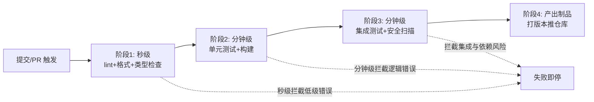
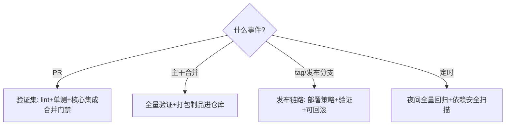

# 流水线设计原则

> **一句话摘要**：流水线设计的全部原则服务于两个目标——「失败得早」（失败左移：最快的检查拦最多的问题）与「反馈得快」（阶段并行、缓存、精准触发）；阶段划分不是照抄模板，是从你项目的风险分布推导出来的。

前置阅读：[CI/CD 是什么与演进](./1_CICD是什么与演进-入门.md)。本篇讲链路设计，平台操作细节归三篇实践篇（GHA 系列）。

## 1. 背景：为什么流水线需要「设计」

流水线不是把构建命令串起来就完事。设计差的流水线有两种死法：**慢**——所有检查串行跑完 40 分钟，开发者去喝咖啡，反馈循环断裂；**假绿**——关键检查被跳过或放在没人看的最后，门禁形同虚设。好的流水线设计要在「验证充分性」与「反馈速度」这对天然矛盾里做权衡，而权衡的依据是**你项目的风险分布**：哪里最容易出错，检查就放在哪里。从系统架构的上下游看，流水线是「代码世界」与「制品/运行世界」之间的加工线——每个阶段都是一次质量关卡，关卡的位置与密度决定了下游拿到的东西有多可信。

## 2. 核心机制：阶段划分与失败左移

- **按「反馈速度 × 拦截概率」排序**：lint/类型检查秒级完成且能拦下最多低级错误——永远放第一；单元测试次之；集成测试、端到端最贵放最后。每多花一分钟跑后面的阶段，前面的检查必须值得这份等待。
- **失败即停（fail fast）**：前序失败立即终止整条流水线，不浪费下游资源，也让失败原因尽可能靠近触发原因。
- **阶段并行与依赖**：互不依赖的检查并行跑（lint 与单测并行、多版本测试矩阵并行），总时长从「各阶段之和」压到「最长分支」。但并行有代价：资源消耗与结果聚合的复杂度，值得并行的只有耗时长且独立的分支。
- **触发策略（什么时候跑什么）**：PR 触发全量验证（合并门禁）；主干合并触发制品打包；tag/发布分支触发生产发布链路；定时触发（夜间全量回归、依赖安全扫描）。**不是所有事件都跑全量**——PR 上跑生产部署链路既是浪费也是风险。触发到动作的映射画成决策图：

### 2.2 门禁：让「绿」有牙齿

门禁（quality gate）= 「不满足条件就不允许进入下一环」的强制规则，落地在三个位置：**合并门禁**（PR 必须全绿 + 覆盖率达标才允许 merge，用分支保护规则强制而非口头约定）、**制品门禁**（安全扫描高危漏洞阻断制品晋级）、**发布门禁**（发布前检查清单自动化：数据库迁移兼容性、配置齐备性）。门禁的失败模式是「形同虚设」：阈值定得过高导致天天豁免，豁免通道一旦常态化，门禁就死了——**豁免必须带过期时间与审批记录**。

## 3. 落地实践：一条流水线的设计评审清单

给现有流水线做一次体检，逐项回答：

1. **最慢的阶段是哪个？** 它是不是放在了所有快速检查之后？（顺序错了）
2. **有哪几段互相独立可以并行？** 矩阵/并行的收益算过吗？
3. **PR 触发跑了多少与 PR 无关的事？**（最常见浪费：PR 上跑生产部署准备）
4. **每次失败，开发者 30 秒内能看出「什么坏了、在哪个阶段」吗？**（可观测性：阶段命名清晰、失败摘要置顶）
5. **门禁规则在平台强制了吗？** 还是「约定俗成」？（分支保护/required checks）
6. **秘钥怎么进流水线的？** 明文写在 YAML 里是最高频泄密事故（用平台 secrets 注入，原理同[Docker 安全篇](../../../docker/入门层/从零开始认识Docker系列/7_容器安全与资源限制-入门.md)的密钥不落层）。

## 4. 生产视角：设计失衡的形态

- **全量串行的 40 分钟流水线**：开发节奏被 CI 时长绑架——修法不是「忍」，是重排（快前慢后）+ 并行（独立分支）+ 缓存（见[构建提速篇](./3_构建提速-缓存与并行-入门.md)），三招下来通常能压掉 60% 以上时长（行业经验）。
- **「重跑就好了」的 flaky 循环**：不稳定的测试让团队学会「红了解释、失败重跑」，门禁信用破产。flaky 治理（隔离→修复→下架）见[测试策略篇](./4_测试策略与质量门禁-入门.md)。
- **豁免通胀**：紧急合并且绕过门禁一次，就有第二次——三个月后门禁只剩 lint 还活着。数据要留在门禁里（豁免率作为团队健康指标看板化），异常立刻暴露。
- **触发失控**：每次 push 触发全量流水线，高峰期任务排队 20 分钟——「排队时长」是流水线的隐性时长，触发策略要按分支与事件精打细算。

## 5. 主流方案怎么做：设计要素的平台实现

| 设计要素 | GHA 的机制 | GitLab CI 的机制 | Jenkins 的机制 |
|---|---|---|---|
| 阶段与依赖 | jobs + needs | stages | pipeline 阶段 DSL |
| 并行 | job matrix | parallel | 并行 stage |
| 触发 | on: push/pr/schedule | rules | webhook/cron |
| 门禁 | branch protection + required checks | protected branches + merge checks | 插件 + 审批节点 |
| 复用 | reusable workflows（见[实践篇](../../advanced/reusable-workflows.md)） | include/templates | shared library |

规律：**设计要素在三大平台一一对应**——先画链路图（本篇的阶段图），再翻译成任何平台，翻译成本低；反过来「照着平台文档堆配置」，换平台即归零。

## 6. 典型场景

- **库/SDK 项目**（门禁级）：PR 全量矩阵测试 + 覆盖率门禁 + 发布 tag 自动出包——对外质量即信誉。
- **业务应用**（交付级）：PR 验证 → 主干打包制品 → 每日发布窗口部署，门禁覆盖合并与发布两个关口。
- **Monorepo**（效率级）：路径过滤触发（改了哪个目录只跑对应流水线）+ 按项目复用模板——规模化的反馈速度保卫战。

## 7. 与相邻概念的区别

- **流水线设计 vs 流水线实现**：设计回答「哪些阶段、什么顺序、什么门禁」（平台无关）；实现是翻译成具体平台语法。设计错误的实现优化是白费。
- **CI 门禁 vs 测试策略**：门禁是「强制规则」（过不了不让走）；测试策略是「测什么、怎么分层」（金字塔、覆盖重点）。策略产出检查项，门禁赋予强制力，缺一不可。
- **构建流水线 vs 部署流水线**：前者代码到制品（CI 域），后者制品到环境（CD 域）。分界是制品——部署段不应再构建，只引用制品。

## 8. 常见误区与不适用

- **「照抄大厂模板就是好设计」**：阶段划分要从自己项目的风险分布推导——前端项目与 ML 项目的关键检查完全不同。模板可参考，依据要自证。
- **「检查越多越安全」**：每个检查都有时长与维护成本。低价值检查（对当前代码库从未拦截过问题的规则）应该清理——验证充分性按风险分布配，不是堆数量。
- **「门禁越严越好」**：门禁的信用来自「红线少而硬」，红线多而软等于没有红线。高频豁免的门禁比宽松但稳定的门禁更危险。
- **「失败信息给机器人看」**：流水线的用户是开发者，失败输出要把「哪个阶段、什么原因、怎么修」三件事放最显眼处——可观测性是流水线设计的一部分。
- **「秘钥放 YAML 的 secrets 上下文就安全了」**：还要管住「secrets 被打印进日志」「被传给不可信的第三方 action」两条泄漏路径——密钥治理是持续动作不是一次性配置。

## 9. 你们可能会问

- **阶段粒度怎么定？** 粒度服务于「失败定位速度」——一个阶段失败时能 30 秒内说清坏什么；粒度过粗（一个大 job）定位靠翻日志，过碎（上百个 job）编排成本高。
- **PR 上要不要跑集成测试？** 要——合并后的主干问题比分编辑问题贵一个数量级。时长压力大时用「PR 跑核心路径 + 主干跑全量」的分层折中。
- **怎么度量流水线好坏？** 三个指标：P95 时长（反馈速度）、失败率与 flaky 率（信号质量）、豁免率（门禁信用）——比「绿了多少次」诚实得多。
- **紧急修复怎么走流程？** 预设「紧急通道」而不是临时绕过：最小验证集 + 发布后补全量回归 + 事后复盘豁免原因——通道存在且被审计，绕过才会减少。
- **流水线代码要不要代码评审？** 要——workflow 文件就是代码（它还握着秘钥与部署权限），改流水线不走 PR 等于给生产开了个绕过评审的门。

## 10. 一句话总结 + 5W 速记卡 + 自测三问

**一句话总结**：流水线设计 = 按风险分布排序检查（失败左移）+ 压反馈时长（并行/缓存/精准触发）+ 给「绿」装牙齿（强制门禁、豁免可审计）。

**5W 速记卡**：

| 维度 | 内容 |
|---|---|
| What | 阶段划分、失败左移、触发策略、门禁三关口 |
| Why | 反馈速度与验证充分性需要显式权衡，不设计就是慢与假绿 |
| When | 新项目搭流水线、时长劣化、门禁失效时 |
| Where | 仓库的 workflow 定义与平台保护规则 |
| How | 风险分布推导阶段 → 快前慢后 → 独立并行 → 门禁平台强制 |

**自测三问**：

1. 你流水线的 P95 时长是多少？最慢阶段排在第几位、为什么？
2. 上一次紧急合并，门禁是被绕过的吗？有记录吗？
3. 流水线失败时，开发者平均多久能定位到原因？

---

**下篇预告**：反馈速度的第一杀手是慢构建——下一篇[构建提速](./3_构建提速-缓存与并行-入门.md)讲缓存分层与并行矩阵。

---

## 📌 数据与事实声明

本文版本锚点（截至 2026-09-09）：GitHub Actions Runner v2.337.0。「三招压掉六成时长」「30 秒定位」为行业经验值；三大平台机制对照为官方文档内容。具体平台行为以官方文档为准。

## 📚 参考资料

| 类型 | 标题 | 来源 |
|---|---|---|
| 图书 | Continuous Delivery（Humble & Farley） | Addison-Wesley（2010） |
| 文档 | GitHub Actions workflow 语法 | docs.github.com/actions |
| 系列文章 | 构建提速 / 测试门禁（本系列） | 本仓库同系列 |
