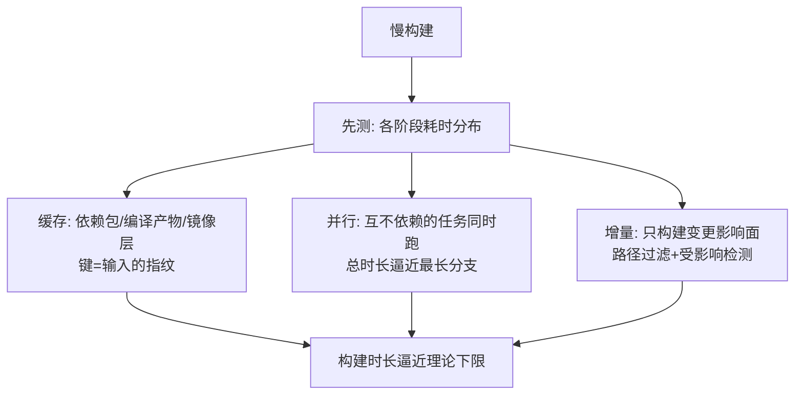
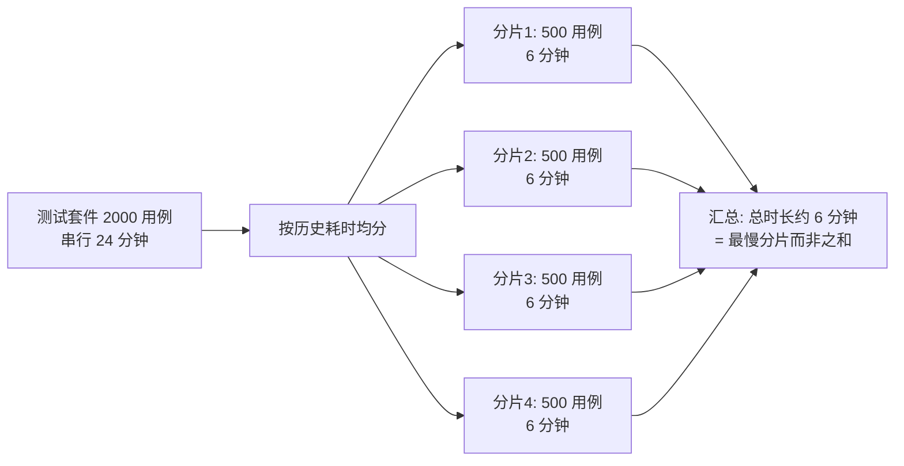

# 构建提速：缓存与并行

> **一句话摘要**：慢构建的解法收敛为三招——缓存（不重复做：依赖/编译产物/镜像层）、并行（同时做：矩阵与分支）、增量（只做变的：精准触发与路径过滤）；每一招都要先测「时间花在哪」，提速不靠玄学。

前置阅读：[流水线设计原则](./2_流水线设计原则-入门.md)。Docker 镜像层缓存的构建器级机制归[Docker 构建缓存深度篇](../../../docker/特性层/深入理解Docker系列/1_镜像分层与构建缓存-深度.md)。

## 1. 背景：为什么构建时长是 CI 的第一指标

构建时长 × 触发次数 × 团队人数 = 团队每天被 CI 吞掉的总等待。这条账算下来，构建提速通常是小团队性价比最高的工程投资：把 20 分钟压到 5 分钟，等于给每个开发者每天还回半小时以上的专注时间（考虑上下文切换的真实代价还远不止）。

提速的思路与性能优化一脉相承：**先测量再动手**。构建日志里每个阶段的耗时分布是唯一可信的依据——80% 的慢构建死在三处：依赖反复下载、全量重编译、串行等 longest path。

## 2. 核心机制：三招的原理



- **缓存**：把「上一次的劳动成果」按输入指纹存起来，输入没变直接复用。三个常用层：**依赖缓存**（包管理器下载目录，键=锁文件哈希）、**编译产物缓存**（编译中间物，键=源码哈希）、**镜像层缓存**（键=层链，机制归 Docker 深度篇）。缓存的机制核心是**键设计**：键不含全部输入 → 脏缓存（用了旧产物）；键过细（含时间戳类噪声）→ 永不命中。
- **并行**：互不依赖的任务同时跑，总时长从「任务之和」变「最长分支」。两个层面：任务内并行（测试分片、编译内核数）、流水线级并行（独立 job 矩阵，见[实践篇 Matrix](../../advanced/actions-matrix.md)）。
- **增量**：只做受变更影响的事。最粗粒度是路径过滤（Monorepo 里改了 A 目录只触发 A 的流水线），细粒度是受影响检测（构建系统按依赖图判定需要重建的模块）。三招的收益结构在最近几年的平台演进里越来越「开箱化」——缓存与矩阵已成为流水线平台的默认能力，架构上真正需要自己设计的只剩「键怎么定、片怎么分」；而从系统架构的上下游看，构建提速的终极形态是把「只做变的」下沉进构建系统本身。

## 3. 落地实践：按顺序做这五件事

1. **量出分布**：构建日志按阶段统计耗时，找出 Top3 慢点——没有分布，一切优化是猜。
2. **依赖缓存先行**：收益最大、风险最小。以 GHA 为例（机制跨平台通用）：

```yaml
- uses: actions/cache@v4
  with:
    path: ~/.npm                # 包管理器下载目录
    key: npm-${{ runner.os }}-${{ hashFiles('package-lock.json') }}
    restore-keys: npm-${{ runner.os }}-   # 键不精确命中时按前缀兜底
```

3. **镜像构建接层缓存**：依赖安装与源码 COPY 分层（Dockerfile 层序，见[Dockerfile 篇](../../../docker/入门层/从零开始认识Docker系列/3_Dockerfile与构建-入门.md)）+ CI 侧 registry 缓存或 BuildKit cache mount（深度篇专讲）。
4. **测试分片并行**：慢测试套件按文件/时间均分到 N 个 runner 并行，总时长 ≈ 最慢分片；分片要均衡（按历史耗时分配，不是按文件数）。分片的机制一张图：


5. **触发收口**：路径过滤 + 只在必要事件跑全量（PR 核心集、主干全量、夜间更全量）。

## 4. 生产视角：提速手段的失效与代价

- **脏缓存的隐形炸弹**：缓存键设计不周（比如忘了锁文件参与键），依赖升级了缓存还在用旧包——「本地好的 CI 坏」的经典来源。修法：所有影响输出的输入必须进键；对缓存保持不信任，关键版本升级时跑一次 no-cache 全量验证。
- **缓存膨胀与清理**：缓存目录只增不减，runner 磁盘被打满反而拖慢构建。惯例：缓存分层保留（基础依赖长留、编译产物滚动清理），平台侧设缓存上限与淘汰策略。
- **并行的隐性账单**：分片 ×N = runner 计费 ×N——并行是用钱换时间，矩阵规模要有账单意识（免费额度与并发上限，托管平台都有配额）。并行也有收益拐点：分片过碎时调度与安装环境的固定开销吃掉并行收益。
- **增量构建的正确性问题**：构建系统的增量判定偶有漏网（编译器缓存 bug、代码生成遗漏），「增量快但偶尔产出错误制品」比「全量慢」危险得多。惯例：主干打包用全量或带校验的增量，PR 层才放开激进增量。

## 5. 主流方案怎么做：平台机制对照

| 招式 | GHA 机制 | GitLab CI 机制 | tips |
|---|---|---|---|
| 依赖缓存 | actions/cache（键+restore-keys） | cache: key/paths | restore-keys 前缀兜底是命中率的第二引擎 |
| 任务并行 | matrix strategy | parallel: N | 分片均衡按历史耗时 |
| 镜像层缓存 | buildx cache-from/to（registry/gha） | 同思路 | 机制细节归 Docker 深度篇 |
| 触发过滤 | on.push.paths | rules:changes | Monorepo 必备 |
| 加速硬件 | 更大 runner / 自建 | 同 | 纵向兜底，先做完前三招再花钱 |

规律：**三招（缓存/并行/增量）在所有平台都有对应机制**——先设计键与分片策略，再选平台实现；顺序反了会陷入平台细节的泥潭。

## 6. 典型场景

- **前端项目**（依赖级）：node_modules 缓存 + dist 产物缓存 + PR 只跑受影响包——10 分钟全量压到 2 分钟量级（行业常见量级）。
- **镜像服务**（构建级）：Dockerfile 层序 + registry 层缓存 + 多阶段，增量构建秒级出层。
- **Monorepo**（规模级）：路径过滤 + 受影响构建 + 按项目复用工作流——规模越大，增量招的收益越大。

## 7. 与相邻概念的区别

- **构建缓存 vs 制品缓存**：构建缓存加速「产出制品的过程」，制品缓存加速「部署时拉取制品」（镜像仓库的层分发）。两者都省时间，环节不同。
- **并行 vs 并发触发**：单条流水线内的任务并行（本篇），多条流水线同时排队执行是平台的并发配额问题（排队时长是隐性时长）。
- **增量构建 vs 增量部署**：增量构建指「只重建受影响部分」；增量部署指「只更新变化的实例」（滚动发布）。分属 CI 与 CD 两域。

## 8. 常见误区与不适用

- **「加了缓存就一定快」**：键设计差（永不命中）或缓存恢复耗时超过重算耗时的场景（超大缓存目录的解压还原），缓存反而是负优化。上线前后对比 P95 数据。
- **「并行数拉满」**：受 runner 配额与成本约束，且下游资源（数据库测试环境、外部 API 限速）会成为新瓶颈。并行度按瓶颈资源规划，不按 runner 数。
- **「缓存可以无脑信任」**：缓存的正确性由键完整性保证——输入进键不完整就是脏缓存。关键路径要有「定期 no-cache 全量」的校验机制。
- **「提速就是优化 CI 配置」**：很多时候根因在构建物本身——没拆分的巨型工程、无限增长的测试套件、拉全量依赖的脚本。工程侧的模块化才是天花板。
- **「Monorepo 必须上重型增量构建系统」**：项目规模没到（几个包、构建分钟级），路径过滤 + 依赖缓存已足够；重型工具的学习与维护成本要先算。

## 9. 你们可能会问

- **缓存键里该放什么？** 一切「会改变输出」的输入：锁文件、源码哈希、关键环境变量值、工具链版本。不该放：时间戳、随机数、机器路径。
- **restore-keys 是什么？** 键不精确命中时按前缀取最近的缓存——牺牲部分命中率换「大部分命中」，是缓存命中率的实用兜底。
- **测试分片怎么分才均衡？** 按历史耗时分配（第一次按文件数，之后记录各分片耗时做再平衡），目标是最慢分片 ≈ 平均分片。
- **自建 runner 和托管 runner 怎么选？** 大用量/特殊硬件/内网环境选自建（缓存还能常驻），小用量选托管（零运维）。缓存常驻是自建 runner 的隐性大福利。
- **构建提速到多少算够？** 反馈心理阈值：5 分钟内开发者愿意等（喝口水就回来），15 分钟以上就会切走干别的。把「最慢 PR 检查」压进 5 分钟是常见目标（行业经验值）。

## 10. 一句话总结 + 5W 速记卡 + 自测三问

**一句话总结**：构建提速三招——缓存复用不做过的（键=输入指纹）、并行压最长分支、增量只做变的；先测耗时分布再动手，缓存正确性靠键完整性兜底。

**5W 速记卡**：

| 维度 | 内容 |
|---|---|
| What | 依赖/编译/镜像三层缓存 + 并行分片 + 路径增量 |
| Why | 构建时长 × 触发 × 人数 = 团队最大隐性时间税 |
| When | 构建 >5 分钟、排队严重、账单超预算时 |
| Where | CI 配置的缓存键、矩阵、触发规则三处 |
| How | 量分布 → 依赖缓存 → 镜像层缓存 → 分片 → 收口触发 |

**自测三问**：

1. 你构建的耗时分布 Top3 是什么？各占多少秒？
2. 你的缓存键包含锁文件哈希吗？上一次依赖升级，缓存正确更新了吗？
3. 测试分片均衡吗？最慢分片是平均值的几倍？

---

**下篇预告**：跑得快之外还要「测得对」——下一篇[测试策略与质量门禁](./4_测试策略与质量门禁-入门.md)讲测试金字塔落位与门禁设计。

---

## 📌 数据与事实声明

本文版本锚点（截至 2026-09-09）：GitHub Actions Runner v2.337.0、actions/cache@v4。缓存/矩阵/路径过滤机制为平台官方文档内容；「5/15 分钟阈值」「压掉 60% 时长」为行业经验值；成本与配额以各平台计费文档为准。

## 📚 参考资料

| 类型 | 标题 | 来源 |
|---|---|---|
| 文档 | GitHub Actions: caching dependencies | docs.github.com/actions |
| 系列文章 | 镜像分层与构建缓存（Docker 深度篇） | 本仓库 docs/devops/docker/特性层/ |
| 系列文章 | 流水线设计原则（本系列） | 本仓库同系列 |
