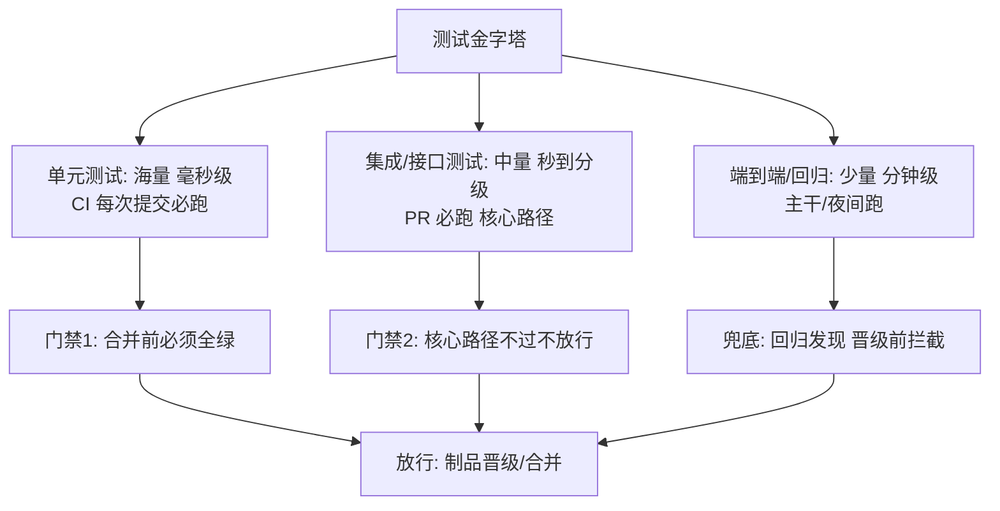
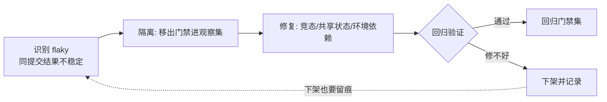

# 测试策略与质量门禁

> **一句话摘要**：CI 里的测试策略 = 把测试金字塔翻译成流水线分层（快测试把门、慢测试兜底）+ 用门禁赋予强制力（不过不放行）+ 治理 flaky 保住信号信用；门禁的价值不在规则多，在「红线少而硬」。

前置阅读：[流水线设计原则](./2_流水线设计原则-入门.md)。本篇讲 CI 视角的测试组织，测试方法本身（怎么写好单测/集成测试）归各语言工程实践域。

## 1. 背景：为什么「有测试」不等于「有质量信号」

很多团队的 CI 里跑着成百上千个测试，但没人敢信：flaky 测试天天红、关键路径反而没覆盖、测试全绿照样出事故。问题不在测试数量，在**策略**——测什么、在哪层测、结果怎么被使用。CI 是测试信号的最大消费者：它每天消费成千上万次测试结果来回答「这次改动能不能放行」，信号质量直接决定门禁的信用与发布的安全性。

## 2. 核心机制：金字塔落位与门禁设计

- **金字塔翻译成流水线层**：单元测试（毫秒级 × 海量）每次提交跑，承担「快速反馈」；集成测试（秒到分级 × 中量）PR 必跑，承担「组件间契约」；端到端（分钟级 × 少量）只在主干与发布前跑，承担「最终兜底」。**倒金字塔**（端到端海量、单测稀少）是 CI 时长失控与 flaky 泛滥的共同根源——慢测试天然不稳定且定位成本高。
- **门禁的三个位置**：合并门禁（PR 必须全绿，分支保护强制）、晋级门禁（制品从一个环境到下一个环境要过安全/回归检查）、发布门禁（发布前自动化检查清单）。门禁是策略的强制力来源——没有门禁的测试只是「参考信息」。
- **覆盖率的角色**：覆盖率是「盲区探测器」不是「质量分数」。业内惯例：新增代码的覆盖率门槛（防盲区扩大）远比「全库覆盖率必须 80%」（催生凑数测试）有效——增量门槛防止劣化，全库门槛催生垃圾。

## 3. 落地实践：门禁规则与 flaky 治理

1. **定红线**：合并门禁 = 单测全绿 + lint 干净 + 新增代码覆盖率达增量门槛 + 关键安全扫描无高危。红线 3-5 条，每条都真正执行。
2. **分层触发**：PR 跑单测 + 核心集成；主干全量；夜间加端到端与依赖安全扫描——时长与覆盖按流水线分层原则配平（见[构建提速](./3_构建提速-缓存与并行-入门.md)）。
3. **flaky 治理流程**：标记（自动识别「同一提交结果不稳定」的测试）→ 隔离（移出门禁集，进观察集）→ 修复（定位竞态/环境依赖/测试耦合）→ 回归或下架。**红线是「flaky 不进门禁」**——一个 flaky 测试在门禁里，污染的是整个门禁的信用。治理流程画成环：

治理的成本收益要算明白：隔离与修复的人工代价 vs flaky 留在门禁里对全部红绿信号的污染代价——短期看隔离更快，长期账只有修复与下架两种终态，权衡的依据是「这个测试守护的路径值多少钱」。
4. **信号度量**：失败率、flaky 率、平均定位时长（从红到定位到原因）三个指标看板化——测试资产的健康度要像生产服务一样被监控。这套体系是十几年测试左移演进的结果：从「上线前人工回归」到「每次提交自动验证」，测试的位置在交付架构的上下游里不断前移——越靠上游发现，代价越低，这也是门禁存在的架构理由。

## 4. 生产视角：信号失真的形态

- **「重跑就好了」文化**：flaky 常态化后，团队对所有红色脱敏，真缺陷被「再跑一次」淹没——这是测试体系癌症晚期。数据特征：失败重跑通过率高于某个量级（行业经验：重跑通过率显著即为 flaky 系统性存在问题）。
- **凑覆盖率的垃圾测试**：断言 `assert true`、快照测试从不 review、为覆盖率生成的空转测试——覆盖率上去了，拦截率没变。治理靠 review 纪律与「拦截贡献」审计：定期看哪些测试真的拦过问题。
- **门禁被绕穿的路径**：`--skip-tests` 的紧急通道、豁免标签的滥用、改测试断言让测试「适配」错误行为——每一条都是门禁信用流失。紧急通道要有（见[流水线设计](./2_流水线设计原则-入门.md)），但要审计与补课。
- **测试环境与生产的漂移**：集成测试的环境（依赖版本、数据形态）与生产脱节后，「全绿」的含金量持续贬值。惯例是环境配置代码化、与生产同源管理。

## 5. 主流方案怎么做：生态工具链

| 环节 | 主流机制 | tips |
|---|---|---|
| 单测框架 | 各语言标配（JUnit/pytest/go test/jest） | 输出统一成 CI 可解析的格式（JUnit XML 一类） |
| 报告聚合 | CI 平台的测试报告 + 失败摘要 | 失败定位信息置顶（哪个用例、什么断言、相关日志） |
| 覆盖率 | 语言工具生成 + CI 上传展示 | 用增量门槛，别设全库高门槛 |
| 安全扫描 | 依赖审计（SCA）+ 静态扫描（SAST） | 高危进门禁，中低危出工单 |
| flaky 识别 | 重跑检测 / 平台 flaky 标记 | GHA 有 re-run 机制，自建靠「同提交多次结果比对」 |

规律：**测试资产的工程化程度（可度量、可治理、可监控）决定 CI 信号质量的可持续性**——工具都在，纪律是分水岭。

## 6. 典型场景

- **核心服务**（交易级）：单测 + 契约测试 + 核心链路集成测试进门禁；端到端在发布前跑金丝雀验证——把测试火力集中在资金与体验的关键路径。
- **开源库**（信誉级）：多版本矩阵（见[实践篇 Matrix](../../advanced/actions-matrix.md)）+ 覆盖率徽章 + PR 全绿才能 merge——对外质量即产品。
- **遗留系统**（改造级）：先给「要动的区域」补测试（特征测试 pin 住现有行为），门禁从「只管新增代码」起步，逐步扩大红线范围——拒绝「先补齐全量测试再开发」的不现实要求。

## 7. 与相邻概念的区别

- **测试策略 vs 测试方法**：策略管「在哪层测、哪些进门禁」（本篇）；方法管「怎么写一个好测试」（隔离、断言质量、可维护性，归语言工程域）。
- **门禁 vs 监控告警**：门禁在发布前拦截（静态验证代码行为）；监控在生产中发现（运行时验证系统状态）。两者覆盖不同时间窗，互不替代——「测试全绿 + 生产告警」是常态而非矛盾。
- **契约测试 vs 集成测试**：集成测试验证「两个真实组件放一起能跑」；契约测试验证「两边的接口约定没有单方面变化」（微服务间协议防漂移）。服务多的团队用契约测试替代一部分重量级集成测试。

## 8. 常见误区与不适用

- **「覆盖率越高越好」**：覆盖率只证明「执行过」，不证明「断言过」。全库高覆盖率门槛的必然产物是凑数测试——增量门槛 + 拦截率审计的组合才有效。
- **「测试慢就异步跑，不挡发布」**：完全异步的测试没人看结果——慢测试的正确位置是「流水线的后置门禁」（晋级前必须过），不是「爱看不看的旁路」。
- **「flaky 测试先标个 skip，回头修」**：skip 没有过期时间 = 永不修。flaky 处理要么进修复流程（带 owner 与期限），要么直接删除——「挂着」是最差状态。
- **「门禁过了就不需要发布验证」**：测试验证的是「代码在测试环境的行为」，配置差异、数据形态、容量问题都验证不了——发布验证（金丝雀 + 指标）是独立环节（见[部署策略](./6_部署策略与回滚-入门.md)）。
- **「测试是 QA 的事」**：CI 时代测试资产由开发者维护——谁提交谁负责测试通过与质量，这条纪律不成立，门禁很快就名存实亡。

## 9. 你们可能会问

- **单测/集成/端到端的比例多少合适？** 金字塔直觉：数量上单测占大头、端到端只留核心路径。比例数字因项目而异，判断标准是「CI 时长可控 + 关键路径有兜底」，不是精确比例。
- **覆盖率增量门槛设多少？** 常见起点「新增可测代码 ≥70-80%」（行业经验值），配「不下降」硬约束；比数字更重要的是「增量不劣化」。
- **flaky 的常见根因有哪些？** Top3：异步/时序依赖（sleep 等待）、测试间共享状态（顺序依赖）、依赖外部环境（网络/时钟/数据库残留）——三类都有标准修法，修比跳过便宜（长期账）。
- **遗留代码没有测试，门禁怎么起步？** 增量策略：只对新增/修改代码要求测试（diff coverage），配合「动到哪补到哪」；特征测试先 pin 现行为再重构。
- **安全扫描也进门禁吗？** 高危 + 可利用的依赖漏洞进合并/晋级门禁；扫描误报多的规则降级为工单——门禁规则同样要按「拦截率」维护。

## 10. 一句话总结 + 5W 速记卡 + 自测三问

**一句话总结**：CI 测试体系 = 金字塔分层（快的把门、慢的兜底）+ 门禁强制（红线少而硬、豁免带过期）+ flaky 治理（不让不稳定污染门禁信用），信号质量要像生产服务一样被度量。

**5W 速记卡**：

| 维度 | 内容 |
|---|---|
| What | 金字塔落位、三门禁（合并/晋级/发布）、flaky 治理流程 |
| Why | CI 每天消费测试信号做放行决策，信号质量决定发布安全 |
| When | 搭流水线、flaky 泛滥、测试全绿仍出事故时 |
| Where | 流水线的分层触发与平台保护规则 |
| How | 定红线 → 分层触发 → 增量覆盖门槛 → flaky 隔离修复 → 度量看板 |

**自测三问**：

1. 你门禁里的红线有几条？最近一次豁免是什么原因、补课了吗？
2. 你的测试套件 flaky 率是多少？最近一个 flaky 测试从发现到修复用了几天？
3. 上一次「测试全绿但生产出问题」，漏掉的是哪类验证？

---

**下篇预告**：验证过的代码要变成可信的制品——下一篇[制品管理与镜像仓库](./5_制品管理与镜像仓库-入门.md)讲不可变制品与仓库治理。

---

## 📌 数据与事实声明

本文版本锚点（截至 2026-09-09）：GitHub Actions Runner v2.337.0。测试金字塔概念（Mike Cohn）与增量覆盖率实践为公开工程共识；「新增 70-80% 门槛」「重跑通过率显著」为行业经验值。具体工具能力以官方文档为准。

## 📚 参考资料

| 类型 | 标题 | 来源 |
|---|---|---|
| 图书 | Succeeding with Agile（测试金字塔出处） | Mike Cohn（2009） |
| 文档 | GitHub Actions: about status checks | docs.github.com/actions |
| 系列文章 | 流水线设计原则 / 部署策略（本系列） | 本仓库同系列 |
