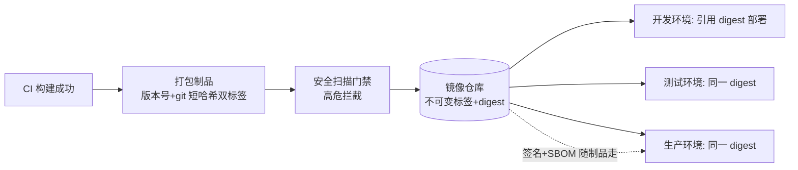
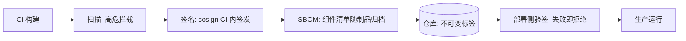

# 制品管理与镜像仓库

> **一句话摘要**：制品是 CI 与 CD 之间的契约——不可变、有唯一版本、可追溯来源；镜像仓库是这个契约的保管方，治理三件事：命名与版本规则、保留与清理策略、供应链安全（扫描/签名/物料清单）。

前置阅读：[CI/CD 是什么与演进](./1_CICD是什么与演进-入门.md)。镜像的分层结构与构建细节归[Docker 系列](../../../docker/入门层/从零开始认识Docker系列/2_镜像与分层-入门.md)。

## 1. 背景：为什么制品是交付链路的「契约」

没有制品管理的交付链路是「口头契约」：部署机现场拉代码构建，同一版本号在不同时间构建出不同内容，「我发布的就是我测试过的」无从证明。制品化把这个契约变成实体：CI 产出一个**不可变、带唯一版本、带来源记录**的工件（镜像/包/二进制），之后所有环境部署的都是这同一个工件——「一次构建、处处一致」从口号变成可验证的事实。

镜像仓库（registry）是镜像类制品的家：存取、版本管理、访问控制、漏洞扫描都在这里发生。它出了问题，整条交付链路的确定性跟着塌。

## 2. 核心机制：不可变、版本化、可追溯

三条机制支柱：

- **不可变（immutability）**：同一版本标签的内容永不覆盖——要改就发新版本。这是「测试过的制品 = 线上制品」的前提；仓库侧配套「标签不可变策略」强制执行（Harbor 一类支持，见[Docker 镜像篇](../../../docker/入门层/从零开始认识Docker系列/2_镜像与分层-入门.md)的标签 vs 摘要）。
- **版本化（versioning）**：双标签惯例——语义版本（人读：1.4.2）+ git 短哈希（机器溯源：a3f8c21），生产部署清单引用摘要（digest）。`latest` 只属于开发机（原因见 Docker 镜像篇的 `latest` 事故分析）。
- **可追溯（provenance）**：制品能回答「哪个提交、哪条流水线、什么配置构建的」。演进方向是构建来源证明（SLSA provenance，BuildKit 已自动生成）+ 签名（cosign）+ SBOM（软件物料清单，列出制品内全部组件）——供应链安全的三件套。三件套随制品走完整条链路：

把供应链这条链放进系统架构看：它覆盖了「构建、存储、分发、运行」的上下游每一环——任何一环缺少验证，攻击者都能从那里注入；这也是为什么近年的合规演进把「可追溯」从最佳实践升级为硬性要求，因为事后追责的代价远高于事前留痕的成本。

## 3. 落地实践：仓库治理四件事

1. **命名与路径规则**：`<项目>/<组件>:<版本>` 一层项目域一层组件名，团队共识进文档——命名混乱的仓库半年后没人能清库。
2. **版本与标签纪律**：CI 产出统一双标签 + digest；「不可变标签」仓库策略打开；`latest` 仅限本地开发。
3. **保留与清理**：镜像只增不减是仓库磁盘的宿命。惯例分级：生产用过的版本长留、未晋级的构建产物滚动清理（保 N 天）、未打标签的悬空层自动清——清理策略写进仓库配置，不靠人肉。
4. **供应链门禁**：CI 构建后自动扫描（高危阻断晋级）+ 签名（cosign，CI 里签）+ SBOM 生成随制品归档；拉取侧只信私有仓库（生产环境禁止直连公共仓库——投毒防御的第一道墙）。

## 4. 生产视角：制品治理失效的形态

- **「生产跑的到底是谁」**：线上服务出了问题，没人说得清运行的是哪个构建——因为没有 digest 记录或制品被覆盖。复盘时「版本考古」比修 bug 还久。修法就是不可变 + digest 引用两条铁律。
- **仓库磁盘爆炸**：几年不清理的镜像仓库塞满无主构建产物，存储告警与拉取变慢一起到来。清理策略要在大约一年内建立（行业经验量级），晚建的成本是第一次大清理的人肉考古。
- **公共镜像直连的风险**：生产环境直接拉公共仓库镜像——一次仓库故障或镜像更新就造成生产事故或供应链投毒。惯例：公共镜像「搬运进私有仓库再引用」（copy 模式），生产只认私有源。
- **签名有了但没人验**：签名只签名不验签等于没签。验签要挂在部署侧（CD 流水线或集群准入控制），验签失败拒绝部署——链路两头都要有牙。

## 5. 主流方案怎么做：仓库选型

| 仓库 | 定位 | tips |
|---|---|---|
| Harbor | 自建主流（CNCF） | 漏洞扫描、标签不可变、签名验证、多租户项目权限一应俱全，生产自建默认选项 |
| ghcr.io | GitHub 生态托管 | 与 GHA 权限体系无缝，开源项目首选 |
| 云厂商 ACR/ECR | 云上托管 | 与云 CI/弹性伸缩联动顺滑，注意跨区拉取流量费 |
| Nexus / Artifactory | 多类型制品（jar/npm/镜像混管） | 非 Docker 制品占大头的团队用混合仓库 |

规律：**选型看「生态亲和 + 治理能力」两轴**——GHA 团队顺手 ghcr，K8s 自建生态顺手 Harbor，云上全家桶顺手云仓库；治理能力（不可变/扫描/签名）是生产环境的硬指标，开发玩具仓库随便选。

## 6. 典型场景

- **微服务团队**（规模级）：Harbor 按团队分项目 + CI 统一签名扫描模板 + 部署侧验签——供应链治理组织化。
- **开源项目**（分发级）：ghcr 发布多架构镜像 + 版本发布自动出包 + SBOM 随 release 归档。
- **金融合规**（审计级）：制品全链路 provenance 留痕（谁构建、谁审批、部署到哪）+ 保留策略满足审计年限 + 拉取侧白名单——合规要求把「可追溯」做成硬指标。

## 7. 与相邻概念的区别

- **制品 vs 构建**：构建是过程（代码 → 工件），制品是产物（不可变工件）。部署段引用制品、不再构建——「部署时构建」是制品管理的头号反模式。
- **镜像仓库 vs 包仓库**：镜像仓库存容器镜像（整应用+环境），包仓库存语言依赖/库（npm/maven）。大团队两者都要，混合仓库统一管。
- **digest vs 标签**：标签是人读的可变指针，digest 是内容指纹（不可变）。治理目标：仓库内标签不可变 + 部署引用 digest——双保险。

## 8. 常见误区与不适用

- **「打上版本标签就是制品化了」**：标签可覆盖就还是口头契约。制品化的判定标准是「不可变 + 可溯源」，缺一条都不算。
- **「latest 方便，内部环境用用没事」**：漂移从内部环境开始——测试环境 latest 与生产 tag 漂移后，「测过了」三个字失效。latest 只在本地开发机存活。
- **「扫描过了就安全」**：扫描覆盖已知 CVE，逻辑后门、依赖投毒不在射程。扫描 + 签名 + 来源可信（私有源搬运）三层组合才是供应链防御。
- **「制品保留越久越安全」**：全量永留的仓库很快不可用。保留策略按「用途分级」：生产用过长留（可回滚）、未晋级滚动清、悬空自动清。
- **「SBOM 是合规负担」**：SBOM 同时是漏洞响应的基础设施——新 CVE 爆出时，有 SBOM 十分钟回答「我们受影响吗」，没有就全库考古。把它当资产不是负担。

## 9. 你们可能会问

- **版本号怎么管？** 语义版本（major.minor.patch）+ 自动化打标：CI 从 tag 触发构建并打同名版本，禁止手工改标签。发布节奏随团队，规则本身要机械化。
- **制品该保留多久？** 生产用过的版本至少覆盖「当前版本 + 前两个大版本」的回滚窗口（行业惯例量级），合规场景按审计年限；其余滚动清理。
- **怎么防止镜像被篡改？** 链路三段：仓库侧开标签不可变 + 传输侧 TLS + 部署侧验签（cosign 签名核对）。部署侧验签是最后一道牙，不能省。
- **公共镜像怎么安全使用？** 「搬运 + 钉版本」：CI 定期把公共基础镜像搬进私有仓库并 pin digest，后续构建只用私有源——公共仓库故障与投毒都被隔离在外。
- **Monorepo 的制品怎么组织？** 按可部署单元出制品（一个服务一个镜像），共享库走包仓库（语义版本）；不要把 monorepo 打成一个巨石镜像——制品粒度应与部署粒度一致。

## 10. 一句话总结 + 5W 速记卡 + 自测三问

**一句话总结**：制品管理 = 不可变 + 版本化 + 可追溯三支柱，仓库治理抓命名/保留/供应链三件事；「一次构建、处处一致」靠 digest 引用与验签落成事实。

**5W 速记卡**：

| 维度 | 内容 |
|---|---|
| What | 制品三支柱 + 仓库治理四件事 + 供应链三件套 |
| Why | 制品是 CI 与 CD 的契约，契约不可变才有发布确定性 |
| When | 搭流水线产出制品、仓库混乱、供应链审计时 |
| Where | CI 打包段 → 镜像/包仓库 → 各环境部署清单 |
| How | 双标签+digest → 不可变策略 → 扫描签名 SBOM → 分级保留 |

**自测三问**：

1. 生产环境现在运行的镜像 digest 是多少？和测试环境一致吗？
2. 你的镜像仓库清理策略是什么？上一次磁盘告警是什么时候？
3. 如果明天爆出一个镜像基础层的高危 CVE，你多久能列出受影响的全部制品？

---

**下篇预告**：制品就绪后怎么安全地放到线上——下一篇[部署策略与回滚](./6_部署策略与回滚-入门.md)讲滚动、蓝绿、金丝雀与回滚设计。

---

## 📌 数据与事实声明

本文版本锚点（截至 2026-09-09）：GitHub Actions Runner v2.337.0；Harbor/ghcr/云仓库能力为各官方文档公开内容；SLSA provenance 与 SBOM 为公开供应链安全框架；保留年限为行业惯例量级。具体行为以官方文档为准。

## 📚 参考资料

| 类型 | 标题 | 来源 |
|---|---|---|
| 文档 | Harbor 官方文档（不可变标签/扫描/验签） | goharbor.io |
| 框架 | SLSA（供应链完整性等级） | slsa.dev |
| 工具 | cosign / Syft（签名与 SBOM） | github.com/sigstore/cosign · github.com/anchore/syft |
| 系列文章 | 镜像与分层（Docker 入门层） | 本仓库 docs/devops/docker/ |
