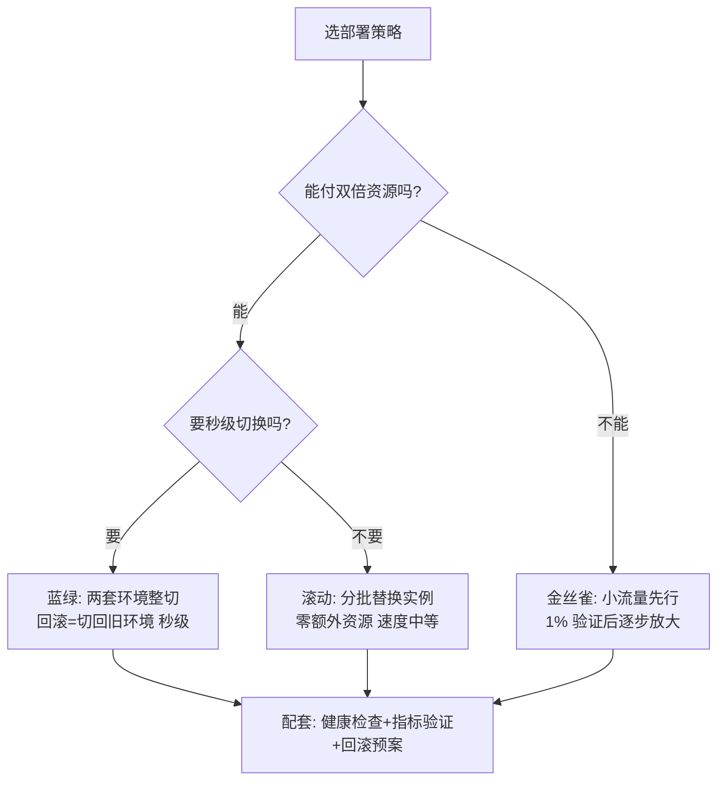
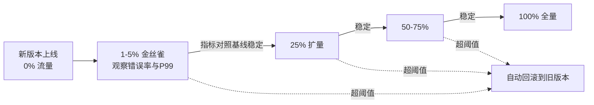

# 部署策略与回滚

> **一句话摘要**：部署策略回答「新版本怎么替换旧版本」——滚动省钱、蓝绿快切、金丝雀精细，选型是成本与风险的权衡；回滚是发布体系的牙齿——能分钟级回滚的团队才敢高频发布，回滚能力是设计出来的（制品可回溯 + 配置可回退 + 数据变更可兼容）。

前置阅读：[制品管理与镜像仓库](./5_制品管理与镜像仓库-入门.md)。运行期灰度的机制与稳定性兜底归本仓库[稳定性工程](../../../../architecture/service-governance/stability/index.md)，本篇只讲发布流水线侧。

## 1. 背景：为什么部署需要「策略」

「把新版本放上去」这个动作里藏着一整个风险问题：替换过程中服务会不会中断？新版本有问题时影响面多大？能不能快速退回？部署策略就是这三个问题的工程答案。没有策略意识的团队用「停机更新」或「全量直接上」，前者的代价是停机窗口，后者的代价是全量赌博——每一次发布都押上全部流量。

部署策略的本质是**控制新版本的暴露面**：先让多少流量、什么样的流量看到新版本，验证没问题再扩大。暴露面控制得越精细，单次发布的风险上限越低。

## 2. 核心机制：三种主流策略

| 策略 | 机制 | 优势 | 代价与风险 |
|---|---|---|---|
| 滚动（rolling） | 分批替换实例，新旧并存过渡 | 零额外资源，平台原生支持 | 过渡期两版本共存（接口要向前兼容）；失败时「半新半旧」 |
| 蓝绿（blue-green） | 新旧两套完整环境，流量整切 | 切换秒级、回滚=切回，验证环境 = 生产环境 | 双倍资源成本；数据库等共享层不随环境切换 |
| 金丝雀（canary） | 小比例流量先到新版本，按指标逐步放大 | 影响面最小、指标驱动决策、可随时中止 | 需要精细的流量分流与指标监控，工程复杂度最高 |

三个策略都需要的公共件：**健康检查**（新实例就绪才接流量）、**指标验证**（金丝雀的「眼睛」：错误率/延迟/业务指标对照）、**回滚预案**（预演过的回退动作）。没有这三件，任何策略都只是形状不同的赌博。金丝雀的放量节奏画出来：

放量策略的演进方向是「阈值自动化」：从人盯指标人喊停，到平台按指标对照自动放大与回滚——每一档放量之间的验证窗口，都是拿发布时长换风险上限的权衡，架构上没有免费的比例。

### 2.2 数据库变更：部署策略的特殊约束

代码可以回滚，数据回滚往往不可逆——所以数据库变更有自己的纪律：**向后兼容的渐进式变更**（expand-migrate-contract 三段式：先加列不删列 → 双写迁移 → 确认后再清理旧列）。这样任何一步回滚都不会踩坏旧版本代码依赖的数据结构。「发新版本顺手删了旧列」是让回滚直接失效的经典事故（机制细节归 MySQL 系列）。

## 3. 落地实践：一条带回滚能力的发布链

1. **制品可回溯**：每个环境部署的镜像 digest 都记录在案（部署清单即记录），回滚 = 把上一个 digest 重新部署——回滚的速度取决于「找旧版本」的速度（见[制品管理](./5_制品管理与镜像仓库-入门.md)）。
2. **配置可回退**：配置变更与代码发布同审计——回滚代码不回滚配置，是「回滚了还是坏」的第二大根因。配置中心的历史版本与一键回退是标配（机制归配置中心主题）。
3. **分批与验证**：滚动发布按批次（如每批 25%），批间插验证窗口（错误率/延迟对照基线）；金丝雀从 1%-5% 起步，指标稳定再放大。
4. **自动回滚的阈值**：预定义「回滚触发条件」（错误率 > 基线 2 倍持续 N 分钟），达标自动执行回滚——人工决策在小半夜是最大的 MTTR 来源（行业共识），自动化阈值把恢复时间压到分钟级。
5. **回滚演练**：发布流程上线前真实演练一次回滚——「回滚命令存在」与「回滚真的能跑通」之间隔着一个没人验证过的假设。

## 4. 生产视角：发布事故的形态

- **「回滚失败」**：最痛的一类——决定回滚了，发现旧版本制品已被清理、或配置结构已不兼容、或数据库变更不可逆。三个根因对应制品保留策略、配置版本化、兼容性纪律三条预防线，任何一条断了回滚就是空谈。
- **金丝雀的盲区**：1% 流量验证通过不代表 100% 没问题——长尾场景（特定用户数据形态、特定时段缓存状态）可能在小流量下不暴露。对策：金丝雀指标看分位数（P99 而非平均值）+ 关键业务指标（转化/支付成功率）不只看技术指标。
- **发布窗口的「低峰迷信」**：低峰发布减少了影响面，也减少了观察信号——凌晨发布的问题往往在早高峰才暴露，而那时值班的人已经不在状态。机制（金丝雀+自动回滚）健全的团队反而不依赖低峰窗口。
- **变更叠加**：一次发布里塞了代码变更 + 配置变更 + 数据库变更，回滚时无法归因。惯例：发布原子化——一次发布一个关注点，多类变更分开走各自的流水线。

## 5. 主流方案怎么做：平台与 GitOps

| 层 | 主流机制 | tips |
|---|---|---|
| K8s 原生 | Deployment 滚动更新（maxSurge/maxUnavailable 控节奏） | 平台默认，满足多数场景；`revisionHistoryLimit` 保留回滚点 |
| 渐进式交付 | Argo Rollouts / Flagger | 金丝雀 + 指标驱动自动放大/回滚的编排器，金丝雀的工程化方案 |
| GitOps | Argo CD / Flux | Git 声明期望状态，集群自动收敛——「回滚 = git revert」的体验，审计与漂移检测白送 |
| 虚拟机/传统 | 发布脚本 + 负载均衡切流 | 蓝绿用双组机器 + LB 切换；滚动用分组脚本 |
| 配套 | 特性开关（feature flag） | 部署与发布解耦：代码上了但功能没开，发布=拨开关，风险进一步下降 |

规律：**部署策略的平台化程度在提高**——从「手写脚本控批次」到「声明渐进式交付策略」，金丝雀的工程门槛在快速下降；GitOps 把「回滚」变成「回退一个 commit」，发布与审计体验统一收敛到 Git。

## 6. 典型场景

- **高频发布的互联网服务**（速度级）：金丝雀 + 自动指标验证 + 自动回滚，发布频率日多次——发布这件事的边际风险被压到接近零。
- **企业内部系统**（稳妥级）：滚动发布 + 发布窗口 + 发布前检查清单自动化——频率低但每次可控，金丝雀的复杂度不必强上。
- **数据库敏感型业务**（兼容级）：expand-migrate-contract 三段式 + 代码与 DDL 分开发布 + 回滚演练每月一次——把「数据不可逆」变成流程约束下的可控项。

## 7. 与相邻概念的区别

- **部署 vs 发布**：部署 = 制品进入环境（技术动作）；发布 = 流量看到新功能（业务动作）。解耦手段：金丝雀的流量比例、特性开关的开关状态。解耦后「部署高频、发布从容」。
- **回滚 vs 前滚（roll forward）**：回滚退回旧版本；前滚是「用新版本修复新版本」（revert commit 再走一次发布）。缺陷可快速热修时前滚更快，缺陷根因不明时回滚更稳——两条路都要通。
- **发布策略 vs 运行期灰度**：发布灰度管「新版本逐步放量」（发布流水线侧，本篇）；运行期灰度管「线上流量的精细调度」（按用户/地域/设备特征路由，归服务治理与稳定性工程）。工程上常配合使用，机制与责任分属两域。

## 8. 常见误区与不适用

- **「有回滚命令就等于能回滚」**：回滚能力 = 制品还在 + 配置可退 + 数据兼容 + 链路演练过。四个条件缺一个，命令就是装饰。判定标准永远是演练，不是文档。
- **「蓝绿 = 万无一失」**：蓝绿切换的是应用层，数据库等共享状态层不随切换——「切过去发现数据格式不兼容」的蓝绿事故并不少见。共享层的兼容设计是蓝绿的前置条件。
- **「金丝雀要 50% 流量才放心」**：金丝雀的价值在「早期信号」——1%-5% 的流量足以暴露系统性问题（错误率、延迟分位）；比例越大，「回滚影响面最小」的优势越弱。
- **「自动回滚比人工稳」**：自动回滚的前提是指标阈值可信（基线准、不误报）。阈值拍脑袋的自动回滚会在流量波动时反复横跳——先让指标可信，再自动化。
- **「发布验证 = 看服务没挂」**：健康只证明「进程活着」，业务正确性（订单成功率、支付转化）要靠业务指标对照。技术指标全绿 + 业务指标暴跌的金丝雀是真实存在的。

## 9. 你们可能会问

- **小团队从哪个策略起步？** 滚动 + 健康检查 + 演练过的人工回滚——成本低、覆盖八成风险；金丝雀等发布频率和指标体系上来后再上。
- **回滚时要不要回滚数据库？** 尽量不——靠「向前兼容的数据变更」让旧代码也能跑在新表结构上（expand 段的产物），数据库回滚只在极端场景走预先准备的逆向脚本。
- **金丝雀指标怎么选？** 分两层：技术指标（错误率、P99 延迟、饱和度）对照基线自动判定；业务指标（转化率、成功率）人看但要在看板上。只盯技术指标会漏「服务正常但业务受损」的事故。
- **发布频率低还要金丝雀吗？** 不必——月发布一次的系统，滚动 + 充分的发布前验证 + 回滚演练更划算。策略要与发布频率匹配，不为先进而先进。
- **GitOps 回滚真的一行 revert 就行吗？** 仓库状态会收敛回去，但「下游动作」（数据库迁移、缓存刷新、外部系统调用）不随 revert 自动回来——GitOps 管状态声明，管不了副作用，副作用要单独设计可逆。

## 10. 一句话总结 + 5W 速记卡 + 自测三问

**一句话总结**：部署策略 = 控制新版本暴露面（滚动/蓝绿/金丝雀按成本与风险选），回滚能力 = 制品可回溯 + 配置可回退 + 数据可兼容 + 演练过——四条齐了才敢说「敢发布」。

**5W 速记卡**：

| 维度 | 内容 |
|---|---|
| What | 三策略对比 + 发布三公共件 + 回滚四条件 + 数据兼容三段式 |
| Why | 发布频率的上限由回滚能力决定，不由勇气决定 |
| When | 设计发布流程、发布事故复盘、上金丝雀前 |
| Where | CD 流水线的部署段与集群/平台的发布配置 |
| How | 选策略 → 建验证与回滚 → 演练 → 指标驱动自动化 |

**自测三问**：

1. 你的系统现在能在几分钟内回到上一个版本？这个数字验证过还是估计的？
2. 最近一次数据库变更，旧版本代码能在新表结构上跑吗？
3. 你的回滚预案，上一次真实演练是什么时候？

---

## 本系列与兄弟系列的地图

| 知识域 | 位置 | 关系 |
|---|---|---|
| 镜像构建与容器化 | [Docker 系列](../../../docker/入门层/从零开始认识Docker系列/0_系列导读-全景.md) | CI 构建段产出镜像制品，缓存机制互指 |
| 编排与运行态 | [K8s 生态系列](../../../kubernetes/入门层/从零开始认识K8s生态系列/0_系列导读-全景.md) | CD 部署段的落地平台 |
| 运行期稳定性 | [稳定性工程](../../../../architecture/service-governance/stability/index.md) | 发布后的灰度调度、限流兜底、应急响应 |
| 配置管理 | 配置中心（服务治理子域） | 配置可回退是回滚四条件之一 |
| 数据变更 | MySQL 系列 | expand-migrate-contract 的实现层 |

---

## 📌 数据与事实声明

本文版本锚点（截至 2026-09-09）：GitHub Actions Runner v2.337.0；Argo Rollouts/Argo CD/Flagger 为 CNCF 生态公开项目。「金丝雀 1%-5% 起步」「错误率 2 倍阈值」为行业经验值；三策略机制为公开工程实践归纳。具体平台行为以官方文档为准。

## 📚 参考资料

| 类型 | 标题 | 来源 |
|---|---|---|
| 图书 | Continuous Delivery（Humble & Farley，部署管线章节） | Addison-Wesley（2010） |
| 文档 | Argo Rollouts（渐进式交付） | argo-rollouts.readthedocs.io |
| 文档 | K8s Deployment 滚动更新 | kubernetes.io |
| 系列文章 | 稳定性工程（运行期灰度） | 本仓库 docs/architecture/service-governance/stability/ |
