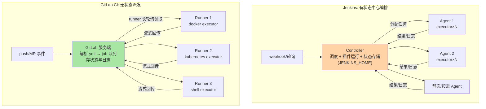
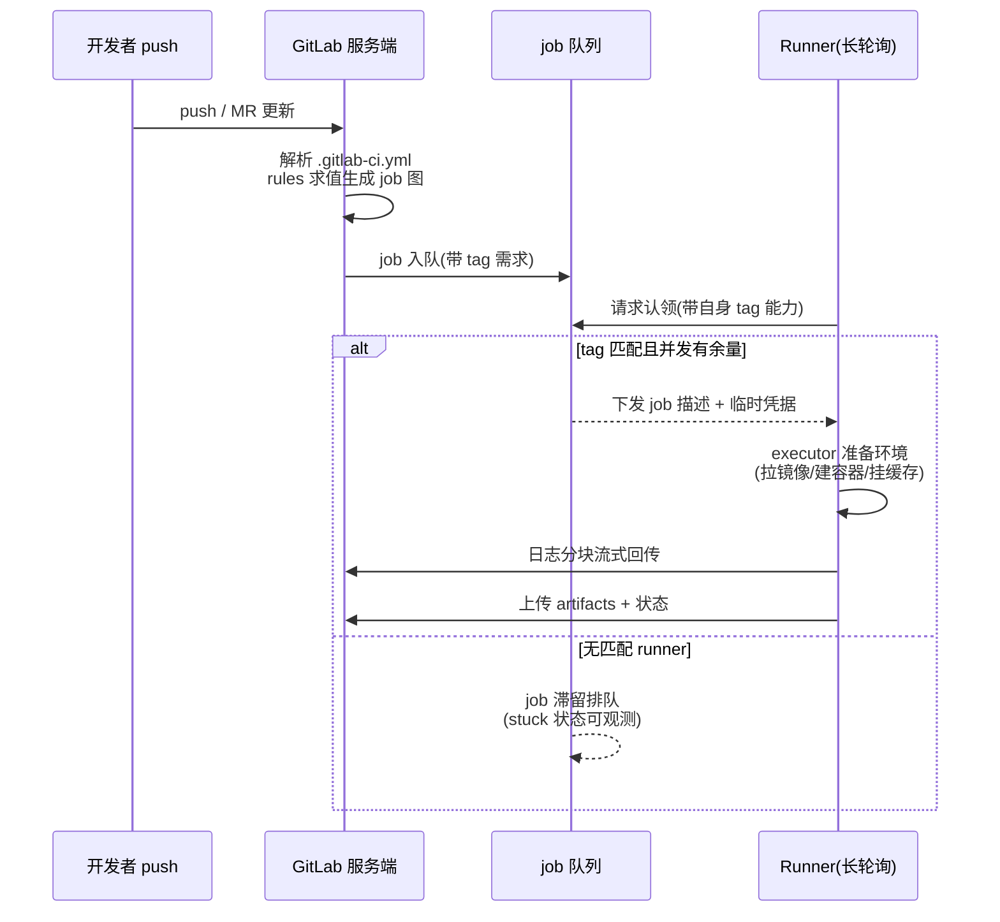
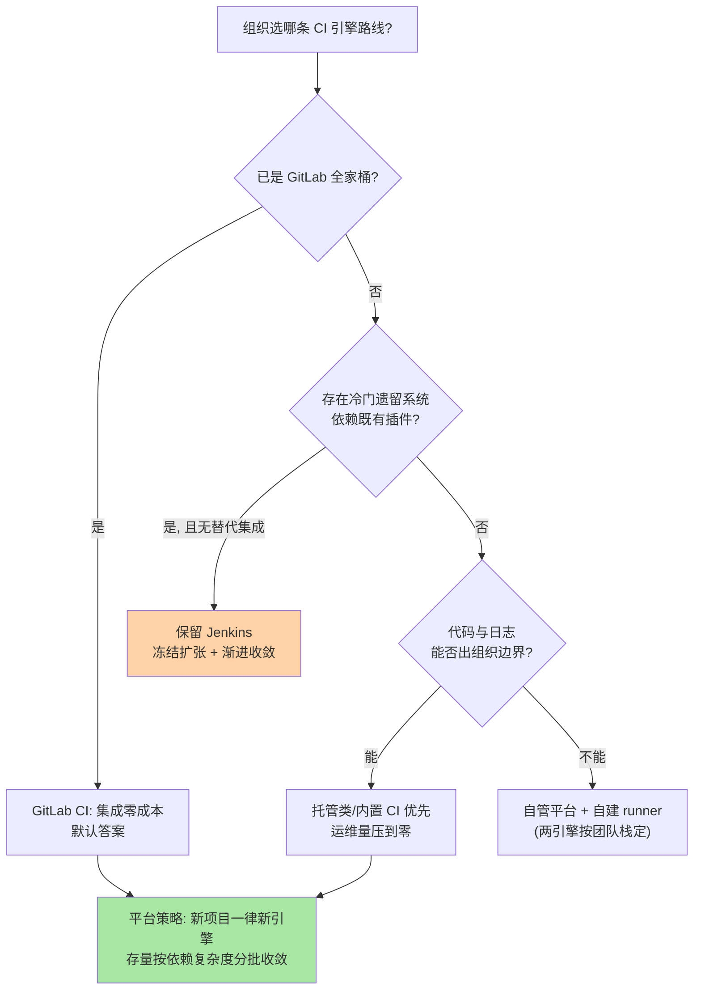

# Jenkins 与 GitLab CI 选型：两种引擎的机制差异与成本结构

> 一句话摘要：Jenkins 与 GitLab CI 的差异不在「功能清单」，而在**引擎机制**——Jenkins 是「常驻中心编排器（controller）+ 自注册 agent」的有状态架构，插件在 controller 进程内运行；GitLab CI 是「应用服务器管状态、无状态 runner 执行」的派发架构，job 在一次性容器里跑。机制决定成本结构：前者灵活性上限高、维护成本挂在插件矩阵上；后者边界清晰、扩展性挂在 runner 弹性上。选型就是给组织的「维护预算」和「灵活性需求」定价。

## 🎯 本文核心

**核心机制一句话**：Jenkins 把「调度、执行环境管理、插件逻辑」集中在 controller 进程；GitLab CI 把「状态与调度」留在服务端、把「执行」推给可水平扩展的 runner——架构分界线就是故障域与维护成本的分界线。

**机制链**：Jenkins 侧：webhook → controller 调度 → 分配 executor → agent（JNLP/SSH 入站连接）执行 Pipeline（Groovy DSL）→ 结果回写 controller；GitLab CI 侧：push/MR 事件 → GitLab 解析 `.gitlab-ci.yml` 生成 job → runner 长轮询领 job → 在 executor（shell/docker/kubernetes）里执行 → 日志与状态实时回传。四个坐标：引擎机制差异（controller-agent vs runner 派发）、插件生态与维护成本、Pipeline as code 的表达力差异、自建与托管的成本模型。

从架构上下游看：CI 引擎是「代码仓库与部署目标」之间的中间层——上游是版本控制事件，下游是制品库与环境，模块边界即「引擎只管把提交变成制品与部署动作，不该承载业务逻辑」。

## 一句话摘要

两种引擎的选型问题本质是**两个成本函数的对比**：Jenkins 的成本函数是「初始近乎免费，随插件数量与 controller 复杂度二次增长」；GitLab CI 的成本函数是「跟随平台版本演进，随 runner 规模线性增长」。插件生态给了 Jenkins 无与伦比的覆盖面（历史插件数千个，业内认知量级），但每个插件都是 controller 内存里的一段不可控代码——升级冲突与安全通告是长期税。GitLab CI 内置闭环（MR 流水线、环境、制品库、密钥管理一体），扩展靠 API 与集成而非进程内插件——能力上限低一档，但运行边界干净。**自建 vs 托管**是第三个独立变量：Jenkins 必然自建（或商业发行版），GitLab 可在 SaaS 共享 runner 与自建 runner 之间按数据主权与成本灵活切分。

## 一、边界：入门层讲过什么，本文讲什么

| 内容 | 入门层 | 本文 |
|---|---|---|
| CI 的概念与基础流水线写法 | ✅ 讲过 | 不重复 |
| 两种引擎的架构机制与故障域 | 未讲 | **本文核心一** |
| 插件生态的成本结构 | 未讲 | **本文核心二** |
| 自建与托管的决策模型 | 未讲 | **本文核心三** |

## 二、引擎机制差异：controller-agent vs server-runner



四个机制级推论，每一个都直接影响日常运维：

1. **故障域不同**。Jenkins controller 同时承担调度与执行逻辑（插件跑在它进程内），controller 挂 = 全公司构建停摆，插件内存泄漏或死锁是全局故障；GitLab 的 job 执行崩了只影响单个 runner，服务端故障属于 GitLab 平台自身的可用性问题——故障域被物理隔离。这也是「中心化编排 vs 分布式派发」的设计取舍在 CI 领域的具体化。
2. **执行环境的可变性不同**。GitLab runner 的 docker/kubernetes executor 默认每个 job 一个全新容器——环境不可变、无残留；Jenkins agent 的 workspace 默认跨构建复用，脏状态（残留产物、被改的本地配置）是经典问题源，需要 workspace 清理策略兜底。
3. **弹性路径不同**。Jenkins 的弹性靠按需拉起 agent（云插件按负载启停 EC2 类实例），弹性单元是「带工具链的机器」；GitLab CI 的弹性单元是 runner 进程或 kubernetes Pod——后者在容器化基础设施上几乎零边际成本，job 级弹性天然成立。
4. **配置的表达模型不同**。Jenkinsfile 是 Groovy DSL（声明式语法套壳图灵完备语言），表达力上限极高，代价是流水线逻辑可能失控地「写代码」、`sh` 步骤满天飞；`.gitlab-ci.yml` 是声明式 YAML + 有限的原语（stages/needs/rules/artifacts/cache），表达力弱一档但同构可审计——所有流水线长得差不多，治理更容易。

## 三、插件生态与维护成本：两种税表

Jenkins 的插件生态是它二十年生命力的来源，也是它最大的负债：

- **能力税**：几乎所有第三方系统的集成都能找到插件——老牌商业系统、异构构建工具链、冷门协议。这是 GitLab CI 短期补不齐的护城河，异构遗留资产多的组织常因此保留 Jenkins。
- **升级税**：插件与内核、插件与插件之间存在版本矩阵（业内公开口径：安全通告常态化）。controller 升级 = 先全量核对插件兼容性，核心插件一次停更就可能卡住整个升级路径。生产惯例是「季度级升级节奏 + 插件白名单」，这本身就是一笔组织成本。
- **稳定性税**：插件在 controller 进程内运行，一个插件的内存泄漏拖垮全局调度——把 controller 当「生产关键系统」做容量规划与监控是 Jenkins 团队的必修课。

GitLab CI 的对应成本结构：**版本升级税**（跟随平台大版本，需按官方升级路径走，不能跳版本）与**能力上限税**（平台没有的能力只能等官方或走 API 外挂）。业内惯例的对照一句话：**Jenkins 的成本是「持续小额、不可预期」，GitLab 的成本是「定期大额、可预期」**——财务视角上后者对治理更友好。

## 四、自建与托管：第三个独立变量

选型讨论常把「引擎选择」与「谁来运维」混在一起，拆开更清楚：

| 维度 | Jenkins 自建 | GitLab SaaS + 共享 runner | GitLab 自管 + 自建 runner |
|---|---|---|---|
| 初始成本 | 低（装即用） | 最低 | 中（平台 + runner 双层运维） |
| 数据主权 | 完全自持 | 代码与日志出组织边界 | 完全自持 |
| 扩容弹性 | 需自建 agent 弹性 | 平台侧弹性（并发配额内） | kubernetes executor 弹性最好 |
| 升级责任 | 自己（内核+插件） | 无感 | 自己（按升级路径） |
| 适用的组织形态 | 有平台组、异构资产重 | 小团队快速起步 | 合规敏感 + 规模化工程组织 |

合规与成本之外，一个常被忽略的量级因素是**并发定价模型**：托管类产品按并发 runner 计费，job 时长直接换算成钱——这会反向推动流水线的提速与缓存治理（互指本系列篇 1），把「构建效率」从工程美德变成财务指标，是托管模式一个被低估的正外部性。

## 五、源码/关键路径：一次 push 在两种引擎里的旅程

```text
Jenkins:
 push → webhook 插件接收 → controller 触发 multibranch 扫描
  → Jenkinsfile 解析(declarative → 内部模型) → 排队
  → scheduler 挑 agent(label 匹配 + 可用 executor)
  → agent 进程加载 pipeline 库, 逐步执行 stage
  → sh/bat 步骤在 agent 工作目录起子进程
  → 步骤结果/日志回传 controller 持久化

GitLab CI:
 push → GitLab 服务端接收 → 按 .gitlab-ci.yml + rules 生成 pipeline 与 job 图
  → job 入队 → runner 长轮询(拿 job 描述 + 凭据)
  → executor 准备执行环境(拉镜像/建容器/挂缓存)
  → 逐 script 行执行, 日志分块流式回传服务端
  → artifacts 按 job 声明上传 → 供下游 job/部署环节消费
```

关键差异在「调度决策发生在谁那里」：Jenkins 的调度器在 controller、带着全部插件上下文做决策；GitLab 的调度是「服务端入队 + runner 拉取」的对等模型——runner 只认领自己有资格（tag 匹配）的 job。理解这一点，「runner 打错 tag 导致 job 永远排队」这类问题就有了确定性的排查入口：先查 job 需求与 runner 能力的匹配表，再查队列。

GitLab 侧的派发交互细看一遍时序：



注意「stuck 状态可观测」这一分支：派发模型的排队是**显式状态**而非黑盒等待——服务端能直接列出哪些 job 没有匹配 runner，这比中心调度引擎的「排队原因」透明得多，是排障体验上的结构性差异。

## 六、什么时候用与不用：明确推荐

| 场景 | 推荐 | 理由 |
|---|---|---|
| GitLab 全家桶用户 | **GitLab CI** | 代码/MR/流水线同源，集成零成本 |
| 新团队、无历史包袱 | **托管/内置 CI 优先** | 维护成本函数最平缓 |
| 异构遗留资产多、冷门集成需求 | **保留 Jenkins** | 插件生态短期无可替代 |
| 大规模容器化基础设施 | **GitLab CI + k8s executor** | job 级弹性与不可变环境 |
| 强合规、代码不可出边界 | **自管 + 自建 runner**（两引擎皆可） | 数据主权优先于引擎差异 |

明确推荐：**新起点一律从内置/托管 CI 起步；存量 Jenkins 不做「迁移运动」，按「插件依赖少的流水线先迁」的顺序渐进收敛，把 Jenkins 停留在它不可替代的集成角落，直到那些角落也被生态覆盖。** 反方向（全面换 Jenkins）在现代容器化环境下几乎不再成立。

选型决策图（从入口往下走，命中即得结论）：



这张图的设计思想是「**让默认路径最短**」：大多数组织最终会落在 GitLab CI 或托管类答案上——Jenkins 分支只留给「冷门集成」这个显式理由，而不是默认选项；自建分支由合规驱动，而不是由「想自己维护」驱动。

## 七、质疑者追问链

**追问一层：Jenkins 既然维护成本这么高，为什么它还活得到现在？**——真相是迁移成本与插件锁定：数百条流水线、多年沉淀的共享库与插件集成是组织资产，「引擎退役」项目的收益（维护成本下降）是渐进的，风险（流水线行为差异、历史产物断链）是即时的——理性组织的选择是冻结扩张、渐进替代，而不是一刀切。这也是「引擎选型」很少被彻底翻盘的原因：成本结构决定了惯性。

**再追问：那把两者混着用、按项目自选行不行？**——反方案分析：双引擎意味着双份维护（两套凭据体系、两套制品流转、两套监控）、流水线知识不互通、审计口径割裂。「按项目自选」短期看是自由，两年后看就是平台治理的负债清单。打破砂锅问到底：选型问题的正确问法不是「哪个引擎好」，而是「组织愿意为哪一种成本函数付账」——答案必须全组织唯一，例外要显式审批。

**打破砂锅：为什么不选更云原生的流水线引擎（Tekton/Argo 类）直接跳过两者？**——反方案分析：以 kubernetes CRD 为底座的引擎概念上最贴合不可变基础设施，但抽象层级更底（一切皆 YAML 拼 PR），流水线工程的组织级易用性与生态成熟度仍在追赶（业内公开口径的社区共识）。它的合理位置是「平台团队自建内部 CI 平台」的底座，而不是业务团队直接消费的日常工具。打破砂锅的结论：引擎分层看——云原生底座解决「怎么跑」，Jenkins/GitLab CI 解决「组织怎么用」，多数组织缺的是后者不是前者。

## 八、典型场景与事故复盘

**事故一：controller 磁盘被构建日志与 workspace 撑满。**某组织的 Jenkins 在一次大版本开发期变得极不稳定：构建排队、页面超时。排查路径：controller 宿主机磁盘使用率接近满载——JENKINS_HOME 下的构建日志按「保留永久」策略累积数年，加上多分支项目的 workspace 从不清理。应急为先：清理最老日志与孤儿 workspace 恢复服务；复盘动作：全局设置构建保留策略（按天数+按构建数双上限）、workspace 自动清理步骤进流水线模板、磁盘水位进监控告警。复盘的机制层结论：**controller 是有状态系统，存储增长模型必须显式设计**——GitLab 自管架构同样有对应项（日志与产物存储），只是默认保留策略更保守。

**事故二：runner 并发配置错误导致流水线全公司排队。**某团队迁移到 GitLab CI 后高峰期 job 排队严重。排查发现公共 runner 的并发配置（concurrent）仍是个位数值，docker executor 逐个串行执行；更隐蔽的是同一个 shell executor 的老 runner 上，前后 job 因共享 workspace 相互污染，偶发构建失败。复盘：按团队划分 runner 与 tag 路由、kubernetes executor 弹性承接峰值、并发水位进容量评审。两次事故的共同复盘教训：**CI 引擎的容量与隔离是平台工程问题，不是「装好就完」的一次性配置**——引擎机制差异（有状态中心 vs 弹性派发）直接决定了容量规划的对象不同。

## 九、Trade-off 与代价分析

**表达力 vs 可治理性**：Groovy DSL 能写出任意复杂的流水线逻辑，也让每个仓库的流水线都长得不一样；声明式 YAML 表达力弱，但全部流水线同构，平台团队可以做静态审计与统一模板。取舍的是「单条流水线的自由」与「千条流水线的秩序」——规模化组织几乎总应该选秩序，用共享模板/组件把表达力收回平台层。

**插件自由 vs 平台闭环**：插件生态让「什么都能接」，也让「接了什么没人说得清」；平台闭环让能力有边界，也让安全基线与升级路径有单一负责人。安全视角上闭环占优：进程内插件是 controller 的信任边界问题（详见本系列篇 2 的凭据与最小权限）。

**自建 vs 托管**：自建换来数据主权与无限定制，代价是把「平台可用性」背在自己身上；托管把可用性外包，代价是边界内规则（并发配额、网络策略、合规条款）由平台说了算。业内惯例的判断句式：**代码资产敏感度决定自建与否，组织规模决定自建成本能否摊薄**。

## 十、不同量级的思考：架构约束驱动解法

- **十万级（日构建百次内、团队十人档）**：约束来源是人力而非机器——没人愿意维护 CI 本身。这一档的核心问题是**把运维量压到零**，而不是架构最优；思考方式是托管驱动：SaaS + 共享 runner，一条 yml 走天下。
- **百万级（日 pipeline 千次、组织百人档）**：约束来源是峰值并发与资源公平——多团队抢 runner。这一档的核心问题是**弹性容量与调度公平**，而不是单 job 快慢；思考方式是容量驱动：kubernetes executor + 团队级 tag 路由 + 缓存治理，构建时长进报表。
- **千万级（日 pipeline 万次、平台工程组织）**：约束来源是全局治理——凭据、审计、成本分摊、流水线爆炸半径。这一档的核心问题是**平台化治理能力**，而不是引擎功能清单；思考方式是平台驱动：统一模板库、流水线即代码的评审门禁、成本与失败率指标体系，引擎只是平台的执行底座。

## 十一、业内惯例

- **流水线即代码、模板集中管**：业务仓只引用平台维护的模板/组件（两引擎都有对应机制），局部自定义要评审——散落的流水线脚本是治理负债的起点。
- **controller/平台按生产系统对待**：备份、监控、容量规划、升级演练一样不少；「CI 挂了全公司停工」不是段子是常态，可用性等级要明说。
- **构建时长与失败率进指标体系**：把流水线健康度当工程效率指标看，劣化在周报层面暴露，而不是等团队爆发。
- **渐进迁移、冻结扩张**：存量引擎不再新增流水线，新项目一律新引擎——迁移是收敛过程不是立项运动。
- **版本锚点**：Jenkins 2.x（declarative pipeline 为主线）、GitLab CI 随平台版本演进（rules/needs 等原语为当前口径，公开口径），具体行为以官方文档为准。

## 十二、常见误区

- **「选型就是比功能清单」**：引擎机制决定成本函数，功能清单只是表象——机制差异（本篇第二节）才是选型变量。
- **「GitLab CI 的 YAML 表达力不够，所以上 Jenkins」**：表达力缺口应该用平台模板与架构调整（拆 job、并行化）解决，而不是为个别复杂流水线引入一个引擎。
- **「runner/agent 装上就不用管」**：执行节点的版本、安全、容量是持续运维项——runner 与服务端版本偏差过大会出现兼容问题（公开口径的运维建议是同步升级）。
- **「迁移 = 平移流水线」**：迁移应该借机收敛（模板化、缓存化、去脚本化），一比一平移是把旧债搬新家。

## 十三、你们可能会问

**Q1：已有几十条 Jenkinsfile 的组织，迁移顺序怎么定？**
按「插件依赖少 → 多、构建环境标准 → 异构」排序，先迁标准容器化构建的流水线（收益立现、风险最小）；异构构建与冷门插件依赖的留在原地，等替代生态成熟或架构改造后自然消解。

**Q2：两边的流水线缓存机制差异大吗？**
机制层同源（按 key 存取目录/制品），实现细节不同：GitLab cache 按 job 声明由 runner 存储或对接对象存储，Jenkins 常用 workspace 复用或外部存储插件。机制对照详见本系列篇 1（缓存机制与构建加速），两引擎的缓存键设计原则一致。

**Q3：小团队用 Jenkins 还有什么理由？**
三类：强离线/内网隔离环境、冷门遗留系统的既有插件集成、以及团队已有 Jenkins 运维能力（边际成本为零）。除此之外，新起点的默认答案已不偏向它——这是业内认知的当前格局，不是绝对判断。

## 十四、自测三问

1. 两种引擎的机制差异（调度位置、故障域、执行环境、配置模型）各是什么？
2. Jenkins 的三种「税」（能力/升级/稳定性）分别挂在什么成本上？
3. 「引擎选择」与「自建/托管」为什么是两个独立变量？各自的判断句式是什么？

## 开放问题

- 云原生底座引擎与平台型 CI 的边界仍在移动：底座引擎补易用性、平台 CI 补可扩展性，几年后的「默认答案」可能重新洗牌。
- AI 辅助的流水线生成与修复在改变「表达力」的权重——当流水线可以被可靠生成时，声明式与图灵完备 DSL 的取舍可能被重新定价，值得持续观察。

## 💡 实战提示

- 💡 排障先查「调度匹配表」：job 需求（label/tag）与执行节点能力（agent 标签/runner tag）的匹配是排队类问题第一嫌疑，其次才是队列与资源。
- 💡 Jenkins controller 把磁盘与内存当一等监控对象：构建日志保留策略 + workspace 清理 + 水位告警，三件套缺一不可。
- 💡 流水线模板平台化：业务仓引用集中模板，自定义走评审——把「千条流水线的秩序」建在平台层而不是口头规范上。
- 💡 选型结论落成一句「成本函数承诺」：选哪个、为什么愿意付哪种账、例外审批找谁——写进平台文档，防止两年后被重新翻案。
- 💡 迁移用「冻结扩张 + 渐进收敛」节奏：新流水线一律新引擎，存量按依赖复杂度排序分批，禁止一刀切立项。

## 🎯 核心带走

- **核心一句话**：Jenkins = 有状态中心编排 + 插件生态（成本随插件矩阵增长），GitLab CI = 无状态 runner 派发 + 平台闭环（成本随规模线性增长）；选型 = 给组织的维护预算与灵活性需求定价。
- **机制链**：Jenkins：webhook → controller 调度 → agent executor 执行 → 回写；GitLab：事件 → yml 生成 job 图 → runner 拉取 → 一次性容器执行 → 流式回传。
- **失效点/边界**：controller 是有状态生产系统（磁盘/内存/插件矩阵三处易爆）；runner tag 错配即静默排队；双引擎并行是治理负债；YAML 表达力缺口用模板与架构解，不用换引擎解。

## 📌 数据与事实声明

写于 2026-09-18，口径锚点：Jenkins 2.x（declarative pipeline）与 GitLab CI 当前主线（公开口径）；controller/agent 与 server/runner 架构、executor 类型、升级路径为官方文档公开内容。插件数千个、成本曲线形状、并发定价等为业内认知/公开口径的量级归纳，非实测基准；事故案例为多来源实践信息的脱敏复合描述，不指向任何特定公司。具体行为以官方文档为准。

## 📚 参考资料

| 类型 | 标题 | 来源 |
|---|---|---|
| 官方文档 | Jenkins Architecture（controller/agent）与 Pipeline | jenkins.io/doc |
| 官方文档 | GitLab CI/CD（runners/executors/config） | docs.gitlab.com |
| 社区 | Jenkins 插件站点与安全通告 | plugins.jenkins.io |
| 关联阅读 | 本系列篇 1（缓存与构建加速）/ 篇 2（密钥与安全） | 本目录 |
