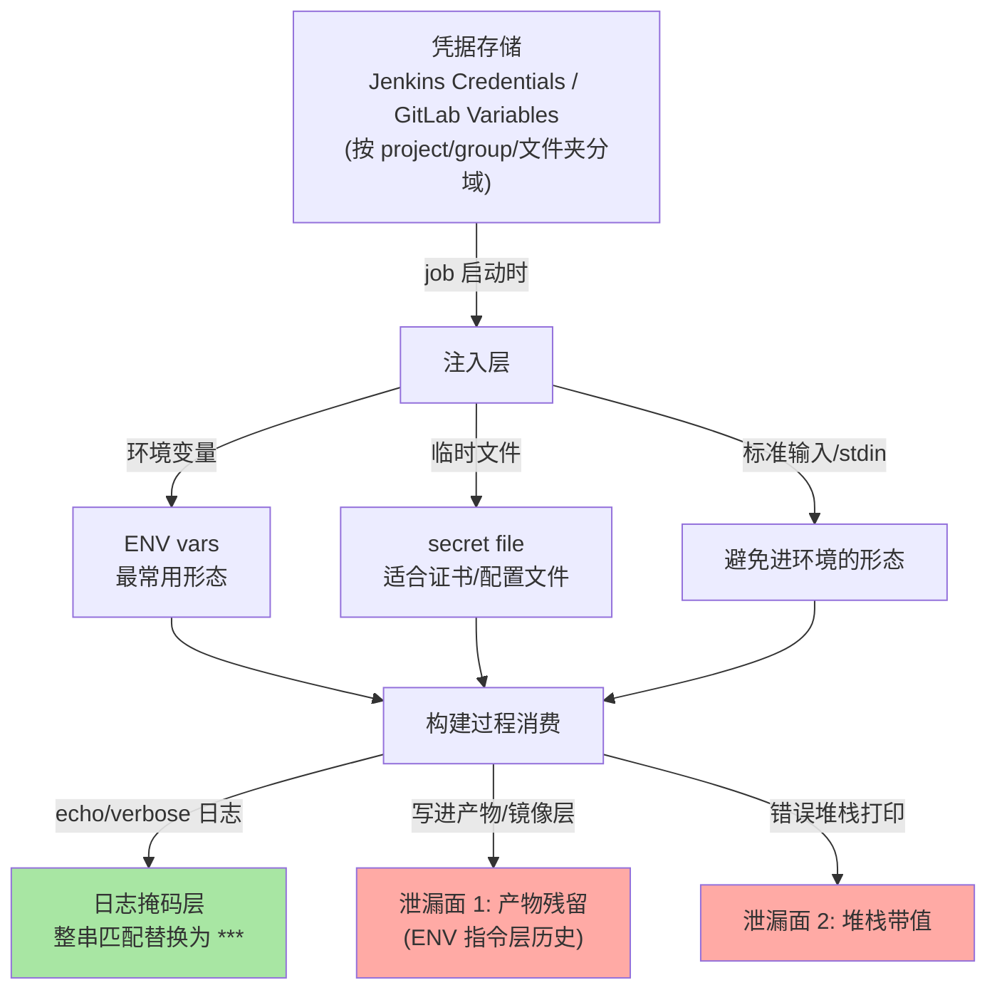
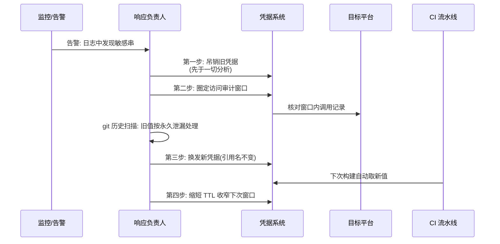
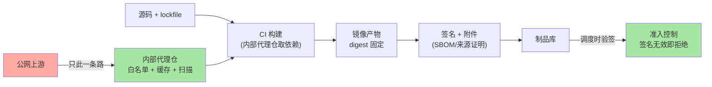

# 流水线密钥管理与安全：凭据注入、轮换与供应链防线

> 一句话摘要：CI 流水线是全公司密钥的**汇聚点与分发站**——数据库密码、云凭证、签名私钥都在这里流通。安全机制因此围绕四道问题展开：密钥**怎么进**（凭据注入机制，运行时注入而非写进代码）、**怎么防漏**（日志掩码与注入边界）、**怎么换**（轮换与短时效凭证）、**怎么保证拿到的依赖与产物可信**（供应链锁定与签名准入）。一句话原则：让密钥「使用面最小、存活期最短、暴露面最窄」。

## 🎯 本文核心

**核心机制一句话**：流水线密钥管理的正解是「中心化存储 + 运行时注入 + 使用面最小化 + 全链路可轮换」——构建过程只在执行瞬间持有凭据，产物与日志零残留。

**机制链**：密钥进流水线（Credentials/Variables 存储按作用域分发）→ job 启动时注入（环境变量/临时文件）→ 构建过程消费 → 日志掩码拦截整串泄漏 → job 结销毁；供应链侧：依赖来源锁定（lockfile + 内部代理仓白名单）→ 完整性校验 → 产物签名与准入验签。四个坐标：凭据注入机制（Jenkins Credentials Binding / GitLab Masked Variables 的机制与掩码边界）、密钥轮换（静态密钥的轮换流程与 OIDC 短时效凭证）、供应链安全（依赖来源锁定与产物签名）、最小权限 runner（执行节点的信任边界）。

从架构上下游看：CI 是「开发者提交与生产部署」之间的信任枢纽——上游是人的身份与代码，下游是生产环境凭据，模块边界即「枢纽必须是全链路里审计最严、权限最小的一段，而不是最宽的一段」。

## 一句话摘要

流水线密钥事故的形态高度收敛：**日志泄漏、产物残留、runner 被攻破、依赖投毒**四类。对应的机制防线也是四道：① 凭据只从凭据系统运行时注入，永不进代码/配置/镜像层；② 日志掩码 + 输出纪律拦截显式泄漏，但要清楚掩码的机制局限（编码变换即绕过）；③ 用短时效凭证（OIDC 联合身份换临时 token）把「轮换」从应急动作变成默认状态；④ 依赖与产物两端做完整性锚定（lockfile + 代理仓白名单 + 产物签名与部署准入）。看懂「注入边界在哪、掩码原理是什么、信任链怎么锚定」，流水线安全的所有配置项都有坐标。

## 一、边界：入门层讲过什么，本文讲什么

| 内容 | 入门层/本系列 | 本文 |
|---|---|---|
| 流水线基本写法与触发 | ✅ 讲过 | 不重复 |
| 凭据注入机制与掩码边界 | 未讲 | **本文核心一** |
| 轮换与短时效凭证 | 未讲 | **本文核心二** |
| 供应链锁定与签名准入 | 未讲 | **本文核心三** |
| runner 最小权限 | 未讲 | **本文核心四** |

## 二、凭据注入机制：密钥怎么进构建过程



两家引擎的机制对照：

| 机制 | Jenkins | GitLab CI |
|---|---|---|
| 存储 | Credentials 存储（支持对接外部凭据提供方） | project/group/instance 级 Variables |
| 注入 | `withCredentials` 绑定块，作用域受控 | job 级环境变量，作用域整 job |
| 掩码 | Password 参数类凭据在日志中掩码 | masked 变量在日志中掩码 |
| 保护分支 | 靠权限模型控制 job/凭据使用 | protected + masked 组合控制 |
| 临时文件 | secret file / SSH key 类型 | file 类型变量 |

三个机制级要点值得单列：

1. **掩码的原理是「整串匹配替换」**——引擎把凭据串登记进掩码表，日志流中出现完整命中才替换。反直觉的推论：把密钥 base64 编码后再打印、拆两半打印、或由依赖库做了变换后输出，掩码全部失效。**掩码是最后一道兜底网，不是安全边界**；安全边界是「不把密钥送进任何输出路径」的输出纪律（关闭调试开关、审查依赖的 verbose 日志、错误堆栈不落值）。
2. **GitLab 的 masked 变量有格式前提**（长短与字符集约束，公开口径）——含特殊字符的密钥可能根本无法标记为 masked，配置时要验证掩码确实生效，而不是看选项勾上了就放心。
3. **注入作用域要最小**：Jenkins 的 `withCredentials` 把凭据限定在一个代码块内，是比 job 级环境变量更小的暴露面；GitLab 的 job 级变量无法缩到 step 级，所以更要靠「一个 job 只给一把钥匙」的拆分纪律来逼近最小暴露面。

## 三、密钥轮换：从应急动作到默认状态

**静态密钥的轮换流程**（泄漏应急与定期轮换共用同一套机制）——设计目标只有一个：**把旧值的残余寿命压到最短**：




时序图里的决策与下面的分步清单一一对应（文字版便于执行时对照）：

```text
1. 吊销: 立即作废泄漏凭据(比替换优先, 让旧值先失效)
2. 审计: 用凭据系统的访问日志圈定泄漏窗口内的异常使用
3. 历史清理: git 历史里的旧值同样危险
   → 重写历史或直接视为永久泄漏(换新值 + 吊销旧值)
4. 换发: 新凭据经凭据系统下发, 流水线引用名不变值变
5. 缩期: 把 TTL/有效期压短, 让下一次泄漏窗口变窄
```

机制演进的方向是**让长期静态密钥消失**：OIDC 联合身份让流水线先拿到平台签发的短时效身份令牌，再向云厂商交换分钟级有效的临时凭证——云资源访问不再需要任何长期 AK/SK，轮换问题被「凭证天生短命」直接消解。这是当前业内公开口径下最推荐的方向，代价是每个目标平台都要做一次联合配置。秘密管理服务（动态生成、按租期回收的数据库凭据类能力）是另一条同方向的路：凭据有租期、到期自动作废，轮换由系统而不是人执行。

**设计思想**收拢成一句：**轮换成本 × 泄漏概率 = 期望损失，机制演进的全部目标就是把这两项同时压小**——短 TTL 压泄漏窗口，注入纪律压泄漏概率，二者相乘才是流水线密钥的真实风险面。这套取舍的设计哲学与前一篇选型篇同源：**不要指望人记得轮换，要让机制让「不轮换」变得不可能**——凭据天生短命的世界里，忘记轮换不再是一种事故形态。

## 四、供应链安全：依赖来源锁定与产物签名

流水线不仅分发密钥，还是「外部代码进入生产」的必经闸口——供应链防线在流水线上有三个锚点：

**锚点一：依赖来源锁定。**lockfile 提交并校验（CI 里校验清单与实际安装树一致，防「同清单不同树」）；依赖统一走内部代理仓（制品库做上游缓存），出网白名单只指向代理仓，开发者机器与 CI 都不直连公网源；关键包启用完整性校验（哈希锁定，防上游被篡改后同名替换）。

**锚点二：构建过程与基础镜像锚定。**基础镜像按 digest 固定（tag 可变、digest 不可变，互指镜像体系系列）；构建环境本身最小化（构建工具越多，被投毒面越大）。

**锚点三：产物签名与准入。**构建产物（镜像）在流水线末端签名，部署侧准入控制只放行「签名有效 + 来源仓合法 + digest 匹配」的产物——签名把「这个镜像确实由我们的流水线构建」从口头承诺变成密码学事实（SLSA 类框架把这条 provenance 链分级标准化，公开口径）。



## 五、最小权限 runner：执行节点的信任边界

runner 是「凭据 × 外部输入代码」同时在场的地方，是流水线信任链上最脆的一环：

- **Docker socket 等价于宿主 root**：把宿主 `/var/run/docker.sock` 挂给 runner 容器，等于授予宿主完全控制权——容器内进程借 socket 可再起一个挂载宿主根目录的容器逃逸出去。业内惯例：优先用 rootless 容器 executor 或 kubernetes executor，绝不把宿主 socket 当便利配置随手挂。
- **shell executor 共享 workspace 是隐蔽污染源**：前后 job 同一目录、同一份依赖树，前一个 job 的残留（被改过的脚本、被替换的依赖）直接喂给下一个 job——不可变容器 executor 的价值正在这里。
- **fork/外部贡献的流水线拿不到机密**：来自外部贡献的变更触发流水线时，protected/masked 凭据默认不注入（GitLab 默认行为；Jenkins 需要显式配置外部 PR 不给凭据）——「外部代码可触发但不可见密钥」是底线配置，配错方向就是开源供应链事故的标准开场。
- **出网白名单**：runner 的出网目标收敛到代理仓、凭据系统、部署目标——被投毒的依赖在构建期想外传数据，出网白名单是最后一道物理约束。

## 六、什么时候用与不用：明确推荐

| 场景 | 推荐 | 理由 |
|---|---|---|
| 云资源部署凭据 | **OIDC 短时效凭证** | 消灭长期 AK/SK，轮换归零 |
| 数据库凭据 | **动态凭据/短租期** | 到期自动作废，泄漏窗口分钟级 |
| 内部工具的低敏 token | 平台 Variables + masked | 机制成本最低，够用即可 |
| 签名私钥/根凭据 | 专用签名服务/KMS 托管 | 私钥绝不进流水线内存 |
| 构建产物 | 必签名 + 部署准入验签 | 供应链完整性锚定 |

明确推荐：**「静态密钥尽快换短时效」是唯一长期答案；过渡期用「凭据系统 + 掩码 + 输出纪律 + runner 最小权限」四件套兜住——缺任何一件都不要自认安全。**

## 七、质疑者追问链

**追问一层：掩码既然能被编码绕过，那它存在的意义是什么？**——掩码针对的是**最高频事故形态**：人手滑 `echo $SECRET`、脚本调试输出。它把「无意识泄漏」的成本降为零，但不防「有意识的变换泄漏」——后者的防线在依赖审查与出网控制。每道防线都只对一类威胁负责，把掩码当万能网才是事故的开端。

**再追问：依赖都走内部代理仓了，投毒包不还是从上游进来了？**——代理仓解决的是「来源收敛与可审计」，不是「上游可信」：上游被投毒，缓存照样把毒分发进来。真正的组合拳是代理仓（收敛 + 扫描）+ 完整性校验（哈希锁定防篡改）+ 新依赖引入评审（防 typosquatting 类命名投毒）。打破砂锅的结论：供应链没有单点防线，是一层层「把信任面换小」的叠加。

**打破砂锅：为什么不选「把密钥加密后提交进仓库、CI 解密使用」的自管方案？**——反方案分析：加密提交（加密文件 + CI 内解密）看似自治，实则把「解密密钥的存放」问题原样递归了——解密钥匙还是要在注入时出现在流水线里；同时失去凭据系统的审计、轮换、作用域控制三件套。打破砂锅问到底：这个方案唯一合理的位置是「凭据系统不可用的隔离环境下的过渡态」，且解密钥匙仍应来自凭据系统而不是环境变量硬编码——本质上还是绕回了中心化凭据系统。

## 八、典型场景与事故复盘

**事故一：依赖库调试日志带出 token。**某团队的 CI job 依赖一个上传组件，某次升级后其 verbose 日志把带凭证的请求头完整打进构建日志，日志被推到全员可见的聚合平台。排查路径：先在日志平台全局检索发现异常头字段 → 定位到新版本的调试开关默认开启 → 立即吊销并换发 token（吊销先于一切分析）→ 审计窗口内无异常调用。复盘动作：构建日志聚合平台对高敏字段做二级脱敏规则；依赖升级强制过一遍「新版本日志输出面」检查；该组件的调试开关在流水线模板里显式关闭。复盘结论：**掩码表是引擎级的，依赖自行格式化的输出不在表里——输出纪律必须覆盖依赖，不只覆盖自己的脚本。**

**事故二：共享 runner 的 socket 配置埋雷。**某组织早期为图省事把宿主 docker socket 挂给共享 runner，某次依赖投毒演练（内部红队行为，脱敏）中，恶意构建脚本借 socket 读到了宿主机上的其他凭据文件。排查复盘：该 runner 立即下线重建；全部 runner 按「不挂宿主 socket、出网白名单、按团队隔离」三原则整改；红队演练常态化。生产环境不能等真实攻击来验证边界——**信任边界的正确性要靠主动验证维持**，两次事故的共同根因都是「便利配置」而非高级攻击。

## 九、Trade-off 与代价分析

**短时效凭证 vs 静态密钥**：短时效消灭轮换负担，代价是每个目标平台一次联合配置、且身份链路多一跳（联合交换可能成为部署路径上的新故障点）；静态密钥简单直连，代价是永续的轮换义务与更宽的泄漏窗口。取舍的是「一次性接入成本」与「永久性运维风险」——长期主义答案明确。

**中心化凭据系统 vs 自管加密**：中心化买来审计/轮换/作用域三件套，代价是凭据系统自身成为高价值目标与可用性强依赖；自管换来自治，代价是递归的密钥问题与更弱的审计。业内惯例：凭据系统按「零号生产系统」做可用性与访问审计。

**供应链强度 vs 构建流畅度**：白名单、哈希锁定、新依赖评审每一条都会让「加依赖」变慢——这是有意为之的摩擦。取舍的是「开发速度的即时感受」与「投毒事故的长尾代价」，摩擦的度应该按团队规模与合规要求调节，而不是追求零摩擦。

## 十、不同量级的思考：架构约束驱动解法

- **十万级（小团队、凭据几十个）**：约束来源是人力——没有专职安全。这一档的核心问题是**别把密钥写进任何仓库**这一条底线，而不是体系完备；思考方式是平台托管驱动：全部用引擎自带的凭据系统 + masked，四件套兜底即可。
- **百万级（组织级、凭据数百个、多团队）**：约束来源是凭据生命周期不可追踪——谁在用、什么时候用过说不清。这一档的核心问题是**集中审计与作用域治理**，而不是加密强度；思考方式是清单驱动：凭据台账（密钥、用途、负责人、TTL）、按团队分域、出网白名单、构建日志脱敏平台化。
- **千万级（平台工程、监管合规）**：约束来源是供应链的系统性风险——任何一台 runner、一个上游都可能是入口。这一档的核心问题是**端到端信任链可验证**，而不是逐点加固；思考方式是纵深体系驱动：OIDC 全面替代静态凭据、产物签名与准入常态化、代理仓扫描门禁、红队演练验证边界。

## 十一、业内惯例

- **密钥永不进三处**：代码仓库、镜像层（ENV 指令）、构建产物——三处的共同点是「一旦进入即难以彻底清除」，防线前移到注入机制。
- **吊销优先于分析**：泄漏确认后的第一动作是吊销，取证在吊销之后——顺序反了就是二次泄漏。
- **外部贡献流水线默认零凭据**：fork 触发的构建拿不到机密是默认态，要放开必须有评审——配置方向配反是开源生态事故的标准成因。
- **runner 不挂宿主 socket、不共享 workspace**：不可变容器 executor 是默认推荐，shell executor 仅用于无法容器化的遗留构建。
- **版本锚点**：Jenkins Credentials Binding 与 GitLab masked/protected variables 的行为细节以各自官方文档为准（公开口径）；masked 变量的字符集与长度约束随版本演进，配置后应实测验证掩码生效。

## 十二、常见误区

- **「变量标了 masked 就安全了」**：掩码只拦整串原样输出，编码/拆分/依赖内部格式化全部绕过——它是兜底网不是边界。
- **「密钥在凭据系统里就等于最小权限」**：作用域配成「全组共享」等于没有作用域——凭据也要按 job 拆分到「一 job 一钥匙」。
- **「签名是发布平台的事，流水线不用管」**：签名必须在产物离开流水线前完成，否则 provenance 链断头，部署侧验签失去锚点。
- **「出网白名单太麻烦，靠行为审计就行」**：审计是事后追责，白名单是事前拦截——投毒脚本的外传行为发生在分钟级，审计追不上。
- **「凭据系统是运维的事」**：注入纪律与作用域设计是流水线作者的设计职责——凭据暴露面在流水线定义的那一刻就被决定了，事后审计改变不了设计取舍。

## 十三、你们可能会问

**Q1：历史 commit 里已经躺着的旧密钥怎么办？**
一律视为永久泄漏：吊销换新，不要相信「重写历史就干净了」——仓库分叉、克隆、缓存都可能留存旧值。机制上，吊销让历史里的值失效，比任何清理都彻底。

**Q2：流水线需要把密钥传给部署脚本里的子进程，怎么控制扩散？**
环境变量会随子进程继承，这是注入形态的固有传播面。惯例做法：凭据以临时文件 + 最小读权限交给需要的单个步骤，用后即删；或部署目标改为「凭据系统侧换发短时凭证」的拉取模型，让流水线只持身份不持密钥。

**Q3：怎么验证我们的掩码真的在工作？**
用测试凭据做一次「故意打印」演练（受控环境）：原样打印、base64 后打印、拆半打印各试一遍——掩码的真实覆盖面一测便知，比读文档可靠。

## 十四、自测三问

1. 凭据注入的四种形态与掩码的机制局限分别是什么？
2. 轮换五步的顺序为什么是「吊销先于分析」？OIDC 短时效凭证消解了什么问题？
3. 供应链三个锚点（来源锁定/镜像锚定/签名准入）各自防的是什么？

## 开放问题

- 短时效凭证的推广仍在半途：非云目标（传统中间件、遗留系统）的凭据短期化缺少统一方案，「最后一公里静态密钥」将长期存在。
- 供应链框架（SLSA 类分级）与平台能力的映射在快速演进，「证明产物由可信流水线构建」正在从最佳实践变成采购与合规的硬要求，边界值得持续跟踪。

## 💡 实战提示

- 💡 用「故意打印」演练验证掩码真实覆盖面：原样/编码/拆半三种形态一次测清，配置了掩码不等于掩码在生效。
- 💡 泄漏应急记死顺序：吊销 → 审计 → 历史处理 → 换发 → 缩期，第一动作永远是让旧值失效。
- 💡 新依赖引入走一遍「三查」：名字（防 typosquatting）、来源与哈希（防篡改）、日志输出面（防 verbose 泄漏）——三查合计十分钟，拦住的是最常见投毒路径。
- 💡 runner 三原则写进基线：不挂宿主 socket、不共享 workspace、出网白名单——每一次「图省事」的例外都要显式登记与定期复审。
- 💡 部署凭据优先「流水线持身份、目标侧换发」：让流水线只拿短时身份令牌，密钥的扩散面从「全链路」缩到「凭据系统与目标平台之间」。

## 🎯 核心带走

- **核心一句话**：流水线密钥安全 = 运行时注入（使用面最小）+ 掩码兜底（懂局限）+ 短时效凭证（轮换默认化）+ 供应链锚定（依赖与产物双向验证）+ runner 最小权限（信任边界收紧）。
- **机制链**：凭据系统分域存储 → job 注入（变量/文件）→ 输出纪律 + 掩码兜底 → 用后销毁；供应链：lockfile + 代理仓白名单 → 哈希锁定 → 产物签名 → 部署准入验签。
- **失效点/边界**：掩码拦不住编码与拆分输出；环境变量随子进程扩散；历史 commit 里的旧值永不「干净」，只能吊销；宿主 socket = 宿主 root。

## 📌 数据与事实声明

写于 2026-09-18，口径锚点：Jenkins Credentials/Binding 插件与 GitLab CI Variables（masked/protected）当前官方文档口径（公开口径）；OIDC 联合身份、SLSA 类供应链分级为业界公开框架描述。掩码字符集约束、凭据数量与团队规模的对应关系为业内认知/公开口径归纳，非实测数据；事故案例为多来源实践信息与内部演练的脱敏复合描述，不指向任何特定公司。具体行为以官方文档为准。

## 📚 参考资料

| 类型 | 标题 | 来源 |
|---|---|---|
| 官方文档 | GitLab CI/CD Variables（masked/protected 规则） | docs.gitlab.com |
| 官方文档 | Jenkins Credentials 与 Credentials Binding | jenkins.io/doc |
| 官方文档 | GitLab CI OIDC（云厂商联合身份） | docs.gitlab.com |
| 框架 | SLSA 供应链分级框架 | slsa.dev |
| 关联阅读 | 本系列篇 1（引擎选型）/ 镜像体系系列（签名与准入） | 本仓库同目录 |
