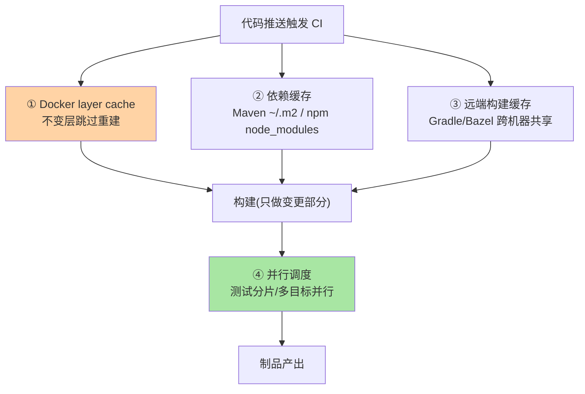
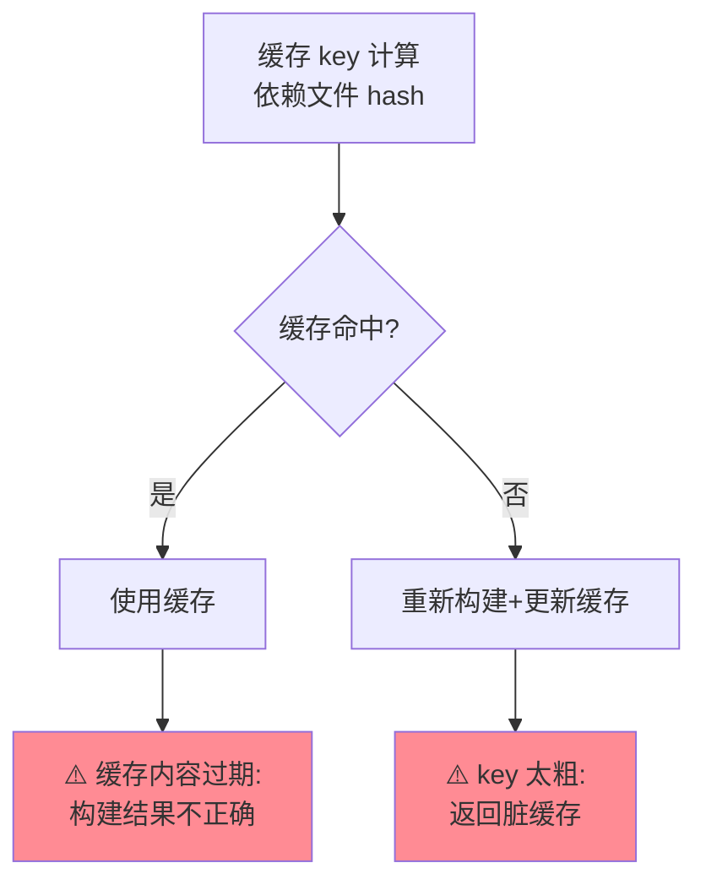

# 流水线缓存与构建加速：CI 流水线的性能工程

> CI 流水线从 20 分钟到 3 分钟不是靠加机器——是靠**缓存策略**（Docker layer cache / 依赖缓存 / 远端缓存）与**并行策略**（任务拆分 + 有向无环图调度）的组合。这篇讲缓存机制与构建加速的工程化。

> **本文核心**：三层缓存——**Docker layer cache**（构建镜像的层级缓存——不变的层跳过重建）、**依赖缓存**（Maven/npm/Go module 下载缓存——避免每次重新下载）、**远端构建缓存**（Gradle/Bazel 的远端缓存——跨机器/跨 CI 的编译结果复用）。**机制链**：代码变更 → 只重建变更影响的层/模块 → 依赖从缓存获取 → 并行执行无依赖的任务 → 总时间 = 关键路径而非全部任务之和。

## 一句话摘要

构建加速的核心认知：**CI 慢的本质是「重复做了不变的事——这是 CI 性能工程从手动加速到系统化演进的底层原理」**——缓存解决重复（不变的事从缓存取）、并行解决串行（无依赖的事同时做）、裁剪解决多余（不需要的事不做）——三者组合从 20 分钟到 3 分钟是工程常态。**缓存的关键是 key 设计**（缓存键决定「什么情况命中什么情况失效」——key 太粗返回过期结果、太细永不命中）。

## 5W 速记卡

| 维度 | 一句话 |
|---|---|
| What | Docker layer cache + 依赖缓存 + 远端缓存 + 并行调度 |
| Why | CI 慢的本质是重复做了不变的事——这是 CI 性能工程从手动加速到系统化演进的底层原理 |
| When | 构建超 SLA、CI 资源成本优化、开发者体验改善 |
| Where | CI 平台（GitHub Actions/Jenkins/GitLab）+ 构建工具 |
| How | 缓存 key 设计 → 分层缓存 → 并行调度 → 持续监控构建时长 |

## 二、三层缓存与并行调度

**缓存 key 设计原则**：依赖缓存 key = 依赖描述文件 hash（`pom.xml`/`package-lock.json` 的 hash——依赖变了缓存失效，没变命中）；Docker layer cache 天然按层（Dockerfile 指令变了后面的层重建，前面不变层命中）——**key 的粒度 = 变更检测的粒度**。

缓存失效的正确性保障：

## 三、并行策略

CI 流水线的 DAG 调度：**静态拆分**（lint / unit test / build 三 job 并行）→ **动态分片**（测试套件按时间均衡分给 N 个 runner——JUnit 5 parallel / pytest-xdist）→ **矩阵构建**（多版本/多平台矩阵并行）——**并行度 = CI 成本与构建时长的权衡**（无限加 runner 成本高但收益递减）。

## 四、典型场景与事故推演

**事故剧本（缓存导致的脏构建）**：某团队用 `cache: npm`（无 key），npm 缓存跨分支污染——分支 A 安装的依赖被分支 B 复用（版本不一致）——测试通过但生产异常。修复：缓存 key 加入 `package-lock.json` hash（依赖变了缓存失效）。**教训**：缓存的正确性依赖 key 的精确性——「key 太粗返回旧依赖」与「无缓存太慢」之间，**精确 key 是正解**。

## 业内惯例

- **构建时长基线告警**：构建超基线 × 2 即告警（慢化渐变先于人感）
- **远端缓存按团队选型**：Gradle 用 Gradle Build Cache / Bazel 用 Remote Cache / Maven 用便宜的自建缓存——工具匹配构建系统
- **3.x/4.x 视角**：GitHub Actions 的 cache action / GitLab 的 cache 关键字 / Jenkins 的 cache step——各平台 API 不同但缓存原理一致；远端缓存（Bazel Remote Cache Protocol）是跨平台标准方向

## 五、常见误区

- **缓存所有东西**：缓存 key 粒度粗 = 脏缓存（返回过期编译结果）——缓存的正确性依赖 key 精确
- **并行度越大越好**：CI runner 有并发上限（成本）——并行度 = 可用 runner 数量 × 每任务时长，超过即排队
- **Dockerfile 不优化就加缓存**：Dockerfile 的层顺序决定缓存命中——把频繁变更的层放后面（COPY 依赖文件 → install → COPY 代码），否则每行代码变更都触发 install 重跑

## 六、与相邻机制的关系

- 本仓库 Docker 系列：镜像分层与构建缓存（L2 深挖互指）
- 《深入理解自动装配与启动流程》：构建产物（jar）的运行时行为与构建优化互补
- tips 互指：K8s 系列（部署环节的性能）——CI 加速管构建、CD 加速管部署

## 你们可能会问

**Q1：Docker build 的层缓存怎么最大化命中？**
Dockerfile 层排序原则：不变层在前（FROM / 系统包）→ 依赖层在后（COPY pom + install）→ 代码层最后（COPY src）——依赖不变时代码变更只重建最后层。

**Q2：monorepo 的 CI 缓存怎么做？**
按目录影响范围触发（只构建变更影响的项目）——Turborepo/Nx/Bazel 的远端缓存 + 任务图调度是 monorepo CI 的标准方案。

**Q3：怎么量化 CI 加速的效果？**
构建时长趋势图（P50/P95）+ 缓存命中率 + runner 使用成本——三个指标证明优化效果并指导后续投入。

## 七、自测三问

1. 三层缓存各解决什么重复？缓存 key 设计的原则？
2. 并行策略的三种形态（静态/动态/矩阵）？
3. Dockerfile 层排序原则与缓存命中的关系？

## 开放问题

- CI 缓存的标准化（跨平台缓存协议统一）仍是碎片化现状——Bazel Remote Cache 协议是最接近标准的。
- AI 预测缓存（按变更内容预测哪些测试需要跑、哪些模块需要重建）是智能 CI 的方向。

## 📎 核心带走

- **核心一句话**：CI 加速 = 缓存（Docker/依赖/远端）解决重复 + 并行（DAG/分片）解决串行 + 裁剪解决多余——缓存 key 精确性决定正确性
- **机制链**：代码推送 → 缓存 key 计算 → 缓存命中/失效 → 只构建变更部分 → 并行执行无依赖任务 → 制品产出
- **失效点/边界**：key 太粗返回脏结果；Dockerfile 层顺序决定缓存命中；并行度受 runner 上限约束

## 💡 实战提示

- 💡 构建时长趋势图（P50/P95/缓存命中率）进 CI 大盘——加速效果可量化可追踪
- 💡 Dockerfile 层排序审查进代码评审 checklist——层顺序是缓存命中的第一因素
- 💡 决策口径：先精确缓存 key 再上远端缓存——缓存正确性优先于缓存命中率
- 💡 缓存策略与构建速度的权衡：缓存粒度越细构建越快但维护越复杂——精确 key 是取舍的正解
- 💡 构建加速策略随 CI 平台与构建工具演进——缓存知识需按年复核，CI 平台的架构演进改变了缓存的最优实现

## 📌 数据与事实声明

- 写于 2026-09-10，缓存机制以 GitHub Actions/GitLab CI/Jenkins 的通用模式归纳
- 事故推演为缓存脏构建的典型模式匿名化复述
- 免责：各平台缓存 API 以官方文档为准

## 📚 参考资料

| 类型 | 标题 | 来源 |
|---|---|---|
| 官方文档 | GitHub Actions Cache / GitLab CI Cache | docs.github.com、docs.gitlab.com |
| 开源工具 | Gradle Build Cache / Bazel Remote Cache / Turborepo | 各官方站点 |
| 关联系列 | 本仓库 Docker 系列特性层（镜像分层互指） | docs/devops/docker/ |
