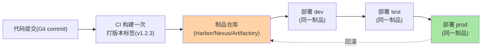

# 制品版本管理与回滚：不可变制品的版本链

> 「构建一次、部署多次（Build Once, Deploy Many）」——不可变制品是 CI/CD 的基石：同一个制品从测试到生产不加改动地流转。这篇讲制品版本管理、回滚链路和制品仓库选型。

> **本文核心**：不可变制品三原则——**① 构建一次**（同一 commit 只构建一次，多环境复用同一制品）；**② 不可变**（制品入库后永不修改——修改 = 新版本。不可变原则与运维稳定性之间的权衡以保留策略对齐）；**③ 可追溯**（制品 → commit → 代码变更全链可回溯）。**机制链**：代码提交 → CI 构建制品（打版本标签）→ 推入制品仓库 → 测试环境部署验证 → 逐环境晋级 → 生产部署 → 回滚 = 切回上一版本制品。

## 一句话摘要

不可变制品与「多环境重建」的对立：如果每个环境重新构建（dev 构建一次、test 重建、prod 再重建）——**不同环境的制品不同**（依赖版本漂移、编译差异），测试通过的制品 ≠ 生产部署的制品——不可变制品保证「测什么就部署什么」。回滚的本质：**切回上一版本制品**（不重建、不改代码——版本切换秒级完成），前提是制品仓库里上一个版本完好无损且配置兼容。

## 5W 速记卡

| 维度 | 一句话 |
|---|---|
| What | 不可变制品 + 版本管理 + 逐环境晋级 + 秒级回滚 |
| Why | 多环境重建导致制品不一致，测试结果不可信——上下游的架构分界在制品不可变点。这是 CI/CD 体系演进的基石决策 |
| When | CI/CD 流水线设计、发布管理、回滚操作 |
| Where | 制品仓库（Harbor/Nexus/Artifactory） |
| How | 构建打标 → 入库 → 晋级 → 部署；回滚切版本 |

## 二、不可变制品的全链路

**回滚的工程纪律**：回滚 = 部署上一版本制品（秒级），不是「改代码重新构建」（分钟级）——**前提是配置兼容**（代码回退但配置中心还是新配置 → 运行时异常）——配置与代码的兼容矩阵纳入回滚检查（互指 config-center 篇 5 的回滚）。

制品全链路的版本追溯：

## 三、制品仓库选型

| 维度 | Harbor | Nexus | Artifactory |
|---|---|---|---|
| 定位 | 容器镜像仓库 | 全类型制品仓库 | 全类型 + 企业级功能 |
| 安全扫描 | 内置 Trivy | 需集成 | 内置 Xray |
| 权限 | 项目级 RBAC | 仓库级 | 细粒度（仓库/格式/操作） |
| 多活/高可用 | 需自建 | 支持 | 企业版支持 |
| 适用 | K8s 生态/容器为主 | 多类型制品（Maven/npm/Docker） | 大企业全格式统一管理 |

**工具关键路径**：CI 构建工具（Maven deploy / Docker push）→ 制品仓库 API（上传/下载/删除）→ 部署工具（kubectl apply image tag / Helm upgrade）——制品的版本标签在全链路中传递与校验。

## 四、典型场景与事故推演

**事故剧本（多环境重建导致的不一致）**：某团队 dev/test/prod 各自构建镜像——test 构建时 npm registry 缓存了旧版依赖包，prod 构建时拉了新版——test 测试通过但 prod 使用不同版本依赖 → 运行时异常。修复：Build Once 原则落地——CI 构建一次打 tag，各环境从制品仓库拉同一 tag 部署。**教训**：「构建一次」不是效率优化，是「测试结果可信」的前提——不贯彻 Build Once 的多环境测试是在浪费测试资源。

## 业内惯例

- **版本号 = Git commit SHA 短哈希**（可追溯到代码变更），语义化版本（v1.2.3）用于正式 release
- **制品保留策略**：prod 部署过的制品永删保护（不可变的核心），dev/test 制品按保留天数清理
- **3.x/4.x 视角**：不可变制品的理念随云原生普及成为标准；SBOM（软件物料清单）与制品签名的组合提升供应链安全等级

## 五、常见误区

- **「重新构建更安全（每次拿最新依赖）」**：恰恰相反——最新依赖引入不可控变更——安全靠依赖锁定（lock 文件）与扫描，不靠重建
- **「回滚 = 重新部署旧代码」**：回滚 = 部署旧制品（不重新构建/不重新测试）——如果旧制品不在仓库里，回滚就不可能
- **制品仓库不做高可用**：仓库挂了所有部署都停——制品仓库的可用性等级不应低于部署目标环境

## 六、与相邻机制的关系

- 《流水线缓存与构建加速》：构建效率与制品管理的流水线上下篇
- 治理域 config-center 系列：配置的不可变管理与制品的不可变原则同源
- tips 互指：K8s 部署（镜像 tag 不可变——latest 标签的反模式）

## 你们可能会问

**Q1：制品版本号用什么？**
Git SHA 短哈希（CI 注入可追溯性）+ 语义化版本（正式 release，供人类理解）双轨——SHA 用于日常部署追溯、SemVer 用于版本间兼容判断。

**Q2：多环境配置差异怎么处理（Build Once 原则下）？**
配置外化——同一制品通过环境变量/配置中心/ConfigMap 在部署时注入环境差异——「构建时固化配置」违反 Build Once。

**Q3：制品仓库的 disaster recovery？**
制品仓库异地备份（Harbor 复制/Nexus 仓库备份）——制品仓库是部署的前置依赖，DR 等级与部署目标环境 SLA 对齐。

## 七、自测三问

1. 不可变制品三原则？多环境重建的事故机制？
2. 回滚的工程定义与配置兼容前提？
3. 三制品仓库的选型差异？

## 开放问题

- 供应链安全的法规推动（SBOM 强制、签名合规）将制品管理从「DevOps 工具」升格为「合规基础设施」。
- AI 生成代码的制品追溯（AI 生成的变更如何进入制品链的审计）是新兴议题。

## 📎 核心带走

- **核心一句话**：不可变制品 = Build Once + 不可变 + 可追溯——回滚 = 切回上一版本制品（秒级），前提是制品在仓库且配置兼容
- **机制链**：提交 → 构建打标 → 入库 → 逐环境晋级（同一制品）→ 生产 → 回滚切版本
- **失效点/边界**：多环境重建毁测试可信度；回滚需配置兼容；制品仓库 DR 不可低于目标 SLA

## 💡 实战提示

- 💡 Build Once 检查进 CI 流水线（同一 commit 不重复构建）——pipeline 级强制
- 💡 回滚演练季度化：实测「决定回滚到生产生效」的耗时——回滚时效是 SLA 的一环
- 💡 决策口径：配置变更与代码变更的兼容矩阵在发布评审时核对——不兼容组合在部署前拦截

## 📌 数据与事实声明

- 写于 2026-09-10，不可变制品原则为业界共识；制品仓库功能以各官方文档为准
- 事故推演为多环境重建的典型模式匿名化复述
- 免责：具体流程按组织发布规范评审

## 📚 参考资料

| 类型 | 标题 | 来源 |
|---|---|---|
| 官方文档 | Harbor / Nexus / Artifactory | 各官方站点 |
| 实践书 | 《Continuous Delivery》Humble & Farley（CD 经典） | 公开出版 |
| 关联系列 | 本仓库治理域 config-center 系列（配置兼容互指） | docs/architecture/service-governance/ |
