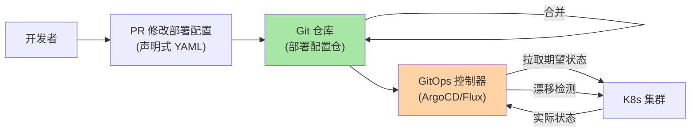
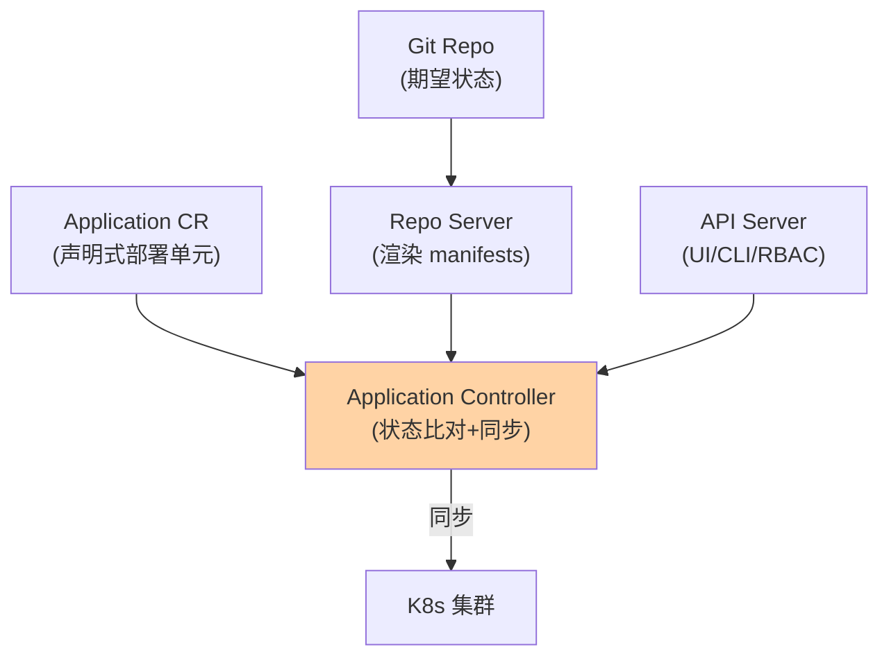

# GitOps 与声明式部署：以 Git 为唯一事实源

> GitOps 把部署从「人执行命令」变成「Git 仓库声明期望状态、控制器自动对齐」——**Push 模式（CI 系统推部署）vs Pull 模式（集群拉取 Git 状态）**的架构分野。这篇讲 GitOps 的核心理念、ArgoCD/Flux 的实现机制、以及漂移检测的闭环。

> **本文核心**：GitOps 四原则——**① 声明式**（期望状态用声明式描述：YAML/HCL）；**② 版本化不可变**（期望状态存储在 Git，变更走 PR）；**③ 自动拉取**（控制器自动从 Git 拉取并应用到集群）；**④ 持续对齐**（控制器持续监测实际状态与期望状态的偏差并纠正）。**机制链**：代码合并到 Git → CI 构建镜像 + 更新部署配置仓 → GitOps 控制器感知配置变更 → 应用到集群 → 持续漂移检测。

## 一句话摘要

Push 与 Pull 的安全边界差异：**Push 模式**（CI 系统持有集群凭证直接部署——CI 被攻破 = 集群被攻破）；**Pull 模式**（集群内控制器拉取 Git 状态——集群凭证不出集群，Git 仓库是唯一部署触发点——CI/CD 与部署系统的上下游模块边界在安全架构上格外重要）——**Pull 模式的安全边界优于 Push**，这是 GitOps 在安全敏感场景普及的核心动因。漂移检测是 GitOps 的闭环：实际状态与 Git 声明的偏差被自动发现并告警/纠正——「谁手动改了集群」不再靠人发现。

## 5W 速记卡

| 维度 | 一句话 |
|---|---|
| What | Git 仓库声明期望状态 + 控制器自动对齐 + 漂移检测 |
| Why | Push 模式的安全边界差、多集群部署不一致 |
| When | K8s 应用部署、多环境/多集群统一管理 |
| Where | Git 仓库 + ArgoCD/Flux + K8s 集群 |
| How | Git PR → 合并 → 控制器感知 → 应用到集群 → 持续对齐 |

## 二、GitOps 全景

**ArgoCD 与 Flux 的差异**：ArgoCD 提供 UI + 多集群管理 + 应用间依赖编排（适合多团队大组织）；Flux 轻量原生 K8s（适合单团队/K8s 深度用户）——两者核心理念一致（Pull + 声明式 + 漂移检测），选型按组织规模与 UI 需求。

ArgoCD 的核心组件架构：

## 三、漂移检测的闭环

漂移的三种来源与 GitOps 的处置：**① 手动变更**（kubectl edit 直接改集群）→ 控制器检测偏差 → 自动恢复为 Git 声明状态（或告警人工裁决）；**② 部分应用失败**（Git 变更应用到集群时部分资源失败）→ 控制器重试 → 最终一致；**③ 外部系统变更**（HPA 自动扩缩容改变了 replicas）→ 需要忽略特定字段的漂移（ArgoCD 的 ignoreDifferences 配置）——**漂移检测的粒度与豁免策略决定了 GitOps 的可用性**。

## 四、典型场景与事故推演

**事故剧本（手动变更引发的连锁故障）**：值班工程师为快速止血直接 `kubectl scale deployment api --replicas=20`——止血成功但 Git 里的声明仍是 10——GitOps 控制器检测到漂移自动恢复为 10——止血操作被回滚（扩容失效，服务再次过载）。修复：止血操作走「Git PR 紧急合并通道」（快速合并到触发自动扩容）或临时禁用该资源的自动对齐——**GitOps 的止血操作也必须走 Git 通道**，这是纪律也是约束。

## 业内惯例

- **应用配置与基础设施分离**（应用部署配置走 ArgoCD Application、基础设施走 Terraform/Infra Module——两层 GitOps）
- **部署配置独立 Git 仓库**（与代码仓库分离——代码变更触发 CI 构建、配置变更触发 CD 部署，解耦变更节奏）
- **3.x/4.x 视角**：GitOps 工具链持续成熟（ArgoCD ApplicationSet 多集群管理增强）；「多集群 GitOps」与「多租户 GitOps」是企业级演进方向

## 五、常见误区

- **「GitOps 就是用 Git 部署」**：核心是「声明式 + 持续对齐」——用 Git 存 YAML 但没有控制器自动对齐不是 GitOps
- **漂移自动纠正 always-on**：某些场景需要允许漂移（如 HPA 自动扩缩容）——ignoreDifferences 的粒度决定 GitOps 的可用性
- **GitOps 替代 CI**：GitOps 管「部署」（CD 的 D），CI 构建仍然必要——CI 构建镜像 + 更新 Git 配置仓 → GitOps 控制器部署，两者是流水线的上下游
- **Secret 明文放 Git**：Git 里的 Secret 必须加密（Sealed Secrets/SOPS/External Secrets Operator——密钥管理互指 config-center 篇 8）

## 六、与相邻机制的关系

- 《制品版本管理与回滚》：GitOps 的回滚 = Git revert PR → 控制器自动回滚部署——回滚的 GitOps 化
- 治理域 graceful-shutdown 系列：GitOps 部署仍需配合优雅上下线原语
- tips 互指：治理域 config-center 系列（声明式配置管理同源）；K8s 系列（GitOps 的目标平台）

## 你们可能会问

**Q1：GitOps 适合所有场景吗？**
K8s 原生资源最佳；非 K8s 资源（VM/云服务）需要扩展控制器（Crossplane 类）——GitOps 的甜区是 K8s 声明式资源，非声明式环境的适配有成本。

**Q2：ArgoCD 的 Application vs ApplicationSet？**
Application 是单应用单集群；ApplicationSet 是模板化批量生成（多集群/多环境 × 多应用的矩阵展开）——ApplicationSet 是多集群 GitOps 的关键能力。

**Q3：GitOps 的灾备怎么做？**
Git 仓库高可用（多远端）+ ArgoCD 自身 HA 部署 + 集群重建时从 Git 全量恢复——Git 仓库就是灾备的「重启点」（重建集群后 GitOps 控制器自动恢复所有应用——**Git 即灾备方案**是 GitOps 的独特优势）。

## 七、自测三问

1. GitOps 四原则与 Push/Pull 的安全边界差异？
2. 漂移的三种来源与各自的处置策略？
3. 「止血操作也必须走 Git 通道」的价值与代价？

## 开放问题

- 多集群/多租户 GitOps 的权限模型（谁可以改哪个集群哪个 namespace 的配置）是平台工程的活跃议题——GitOps 与平台工程的融合是演进方向。
- AI 辅助的配置审查（GitOps PR 的自动安全与合规检查）是智能 DevOps 的应用场景。

## 📎 核心带走

- **核心一句话**：GitOps = 声明式 + Git 版本化 + 自动拉取 + 持续对齐——Pull 模式的安全边界优于 Push，漂移检测闭环是核心价值
- **机制链**：PR 修改配置 → Git 合并 → 控制器感知 → 应用到集群 → 持续漂移检测与纠正 → Git 仓库即灾备
- **失效点/边界**：止血操作也走 Git（纪律）；Secret 必须加密；ignoreDifferences 粒度决定可用性

## 💡 实战提示

- 💡 GitOps 控制器的自动纠正策略（自动恢复 vs 告警人工）按资源重要性分级——核心资源自动恢复、边缘资源告警即可
- 💡 Secret 用 Sealed Secrets 或 External Secrets Operator，Git 里只有密文
- 💡 决策口径：Push 起步简单、Pull 安全成熟——从 Push 演进到 Pull（ArgoCD 支持 Push 模式作为过渡形态）

## 📌 数据与事实声明

- 写于 2026-09-10，GitOps 四原则为 OpenGitOps 公开口径；ArgoCD/Flux 机制以官方文档为准
- 事故推演为 GitOps 漂移的典型模式匿名化复述
- 免责：工具选型按组织架构评审

## 📚 参考资料

| 类型 | 标题 | 来源 |
|---|---|---|
| 官方文档 | ArgoCD / Flux / OpenGitOps | argo-cd.readthedocs.io、fluxcd.io、opengitops.dev |
| 关联系列 | 本仓库 K8s 系列 / config-center 系列 | docs/ |
| 实践书 | 《GitOps Cookbook》Christian Hernandez | 公开出版 |**工具关键路径**：ArgoCD 的 Application Controller（Cluster API 对比实际与期望）→ Repo Server（渲染 Helm/Kustomize manifests）→ K8s API（apply）——ArgoCD 的源码模块化（controller/reposerver/apiserver 分离）与功能解耦对应。

