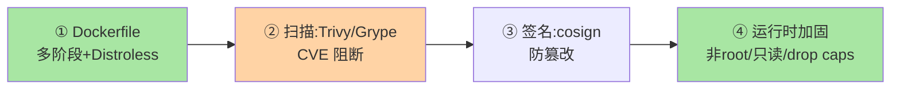
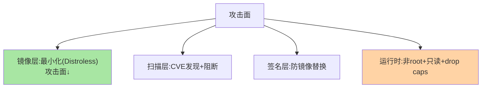

# Docker 安全加固与镜像供应链：从镜像到运行的全链安全

> 容器安全不是单点配置，是**从 Dockerfile 到运行时**的全链加固：镜像构建（最小化 + 无漏洞）、镜像分发（签名 + 扫描）、运行时（rootless + 只读 + 最小权限）。这篇讲全链的每道防线与工具选型。

> **本文核心**：全链四道防线——**① 镜像构建**（多阶段构建 + 最小基础镜像(Distroless/Alpine) + 不装不需要的包）；**② 镜像扫描**（Trivy/Grype 扫 CVE + 阻断高危）；**③ 镜像签名与分发**（cosign 签名 + 内容信任）；**④ 运行时加固**（非 root 用户 / 只读文件系统 / drop capabilities / seccomp）。**机制链**：Dockerfile 构建 → 扫描（阻断） → 签名 → 分发 → 运行时安全策略。

## 一句话摘要

容器安全的核心理念：**最小攻击面**——每一层都在缩减攻击面：基础镜像最小化（Distroless 无 shell 无包管理器）、构建产物最小化（多阶段构建丢弃编译工具链）、运行时权限最小化（非 root + drop ALL capabilities 只加必需的）。**纵深防御的容器表达**：镜像层（缩小攻击面）+ 扫描层（发现已知漏洞）+ 签名层（防篡改）+ 运行时层（限制权限）——任何一层的绕过被下一层拦截。

## 5W 速记卡

| 维度 | 一句话 |
|---|---|
| What | 镜像构建最小化 + 扫描 + 签名 + 运行时加固的全链安全 |
| Why | 容器共享内核，逃逸影响宿主机全部容器 |
| When | 镜像构建、镜像上线前、运行时安全审计 |
| Where | Dockerfile + CI/CD + 运行时配置 |
| How | 最小化构建 → 扫描阻断 → 签名验证 → 权限最小化 |

## 二、全链四道防线



**Distroless 的取舍**：无 shell/包管理器/libc → 攻击面极小，但排障只能用 sidecar/debug tag——**安全性与可运维性的权衡**：Distroless 起步 + debug tag 排障是标准折中。

安全防线与攻击面的映射：



## 三、镜像扫描与签名

| 工具 | 扫描内容 | 特点 |
|---|---|---|
| Trivy | OS 包 + 语言依赖（多语言） | 简单快、社区活跃 |
| Grype | 多源 CVE 数据库 | Anchore 生态 |
| Snyk | 依赖 + 容器 + IaC | 商业产品 |

**签名流程**：CI 构建镜像 → cosign sign（密钥来自 KMS/keyless OIDC）→ 推送镜像+签名 → 部署时验签（Kyverno/OPA 策略）——**签名与验证闭环**确保「跑的镜像就是构建的镜像」。

## 四、运行时加固清单

```text
□ USER 非 root（Dockerfile USER 指令）
□ read_only: true（根文件系统只读）
□ cap_drop: [ALL]（drop 全部再按需 add）
□ no-new-privileges: true（禁止提权）
□ seccomp profile（系统调用白名单）
□ 资源限制（memory/cpus 显式设置，互指运维篇）
□ 不挂载 docker.sock（挂 sock = 宿主机 root）
```

**量级演进视角**：5 个容器手工加固够用；50 个容器需要安全基线模板 + CI 扫描门禁；500 个容器必须平台化（策略引擎 Kyverno + 自动签名 + SBOM 管理）——安全治理的自动化程度随容器量级升级。

**事故推演**：某团队未启用镜像扫描，生产镜像包含带 CVE 的基础镜像版本——攻击者利用该 CVE 容器逃逸获取宿主机权限。修复：CI 内嵌 Trivy 扫描（CRITICAL 阻断）+ 存量镜像全量扫描 + 基础镜像定期更新流程。教训：安全漏洞的发现要靠工具（机器扫描）而非运气（人为发现），扫描是门禁不是参考。

## 五、典型场景

- **CVE 扫描阻断**：CI 里 Trivy scan --exit-code 1 --severity CRITICAL——高危 CVE 阻断发布，中低危告警
- **供应链攻击防护**：cosign 签名 + Kyverno 验签——确保部署的镜像来自可信构建流水线
- **最小镜像改造**：Java 应用从 openjdk:17（~500MB）到 Distroless + JRE（~200MB）——攻击面与拉取时间双降

## 业内惯例

- **基础镜像统一管理**：安全团队维护统一基础镜像（定期扫+更新），应用团队不自行选基础镜像
- **CI 强制扫描**：构建流水线内嵌 Trivy 扫描（高危阻断），扫描结果与镜像关联存档
- **3.x/4.x 视角**：容器安全工具链持续成熟（WASM/WASM 容器是新形态）；安全基线随 CVE 数据库与内核演进更新

## 六、常见误区

- **「Alpine 就安全」**：Alpine 用 musl 替代 glibc 可能引入兼容性问题——Distroless 更彻底（无包管理器无 shell）但排障成本高——基础镜像选型是安全与可运维的权衡
- **扫描一次就安全**：CVE 数据库更新——上周扫没漏洞不代表今天没有——扫描进 CI 每次构建执行 + 定期全量扫描存量镜像
- **非 root 用户就够了**：非 root 仍有能力网络/文件操作——只读文件系统 + drop capabilities + seccomp 是多层组合，上下游安全模块的架构边界要同样清晰
- **镜像签名是可选项**：无签名验证 = 任何人可以替换 registry 里的镜像——供应链攻击的入口

## 七、与相邻机制的关系

- 特性层：镜像分层/容器运行时/生产调优（本篇的安全维度延伸）
- 治理域 service-auth 系列：服务间 mTLS 与容器安全互补（传输安全 vs 运行时安全）
- tips 互指：K8s Pod Security Standards（容器安全的 K8s 层表达）

## 你们可能会问

**Q1：Distroless 怎么排障？**
debug tag（同一镜像带 busybox shell 的版本）——生产跑 Distroless、排障时切 debug tag kubectl exec 进去；或用 ephemeral container（K8s 1.23+）注入排障工具。

**Q2：镜像扫描的误报怎么处理？**
Trivy 支持 .trivyignore 忽略指定 CVE（带过期时间与原因）——误报的处理要留审计记录（谁/为什么/何时到期），不允许无痕忽略。

**Q3：rootless Docker 是什么？**
Docker daemon 本身以非 root 用户运行——即使 Docker daemon 被攻破，攻击者也只有普通用户权限（不是宿主机 root）——安全等级高于 root 运行的传统 Docker。

## 八、自测三问

1. 全链四道防线各防什么？
2. Distroless 与 Alpine 的取舍？debug tag 的用法？
3. 镜像签名的验证闭环（签名→推送→部署验签）？

## 开放问题

- WASM 容器（wasmtime/wasmedge）的安全模型与容器不同（沙箱隔离天然强于共享内核）——WASM 容器安全的标准化在早期。
- SBOM（软件物料清单）的强制要求（美国政府行政令推动）将镜像供应链透明度从可选变为合规要求。

## 📎 核心带走

- **核心一句话**：容器安全 = 构建最小化 + 扫描阻断 + 签名防篡改 + 运行时权限最小化的纵深防御——任何一层被绕过被下一层拦
- **机制链**：Dockerfile 最小化 → Trivy 扫描阻断 → cosign 签名 → 分发 → 运行时非 root/只读/drop caps
- **失效点/边界**：Alpine ≠ 安全；扫描要持续；签名不是可选；rootless 不等于无风险

## 💡 实战提示

- 💡 四道防线进 CI/CD 流水线模板——新项目第一天就安全
- 💡 基础镜像统一管理 + 定期更新——基础镜像的 CVE 是所有容器 CVE 的上游
- 💡 决策口径：安全等级按数据敏感度分级——Distroless+rootless 用于核心链路，Alpine+非 root 用于一般服务
- 💡 安全严格度与开发效率的权衡：Distroless 安全但排障难、扫描严格但发布链路长——安全投入与开发效率按合规要求对齐

## 📌 数据与事实声明

- 写于 2026-09-10，安全机制与工具以 Trivy/cosign/Docker 官方文档为准；SBOM 为公开政策口径
- 免责：安全策略按组织安全规范评审

## 📚 参考资料

| 类型 | 标题 | 来源 |
|---|---|---|
| 开源工具 | Trivy / cosign / Distroless | aquasecurity.github.io、sigstore.dev、github.com/GoogleContainerTools/distroless |
| 官方文档 | Docker Security | docs.docker.com/engine/security |
| 公开标准 | NIST SP 800-190（容器安全指南） | nist.gov |
