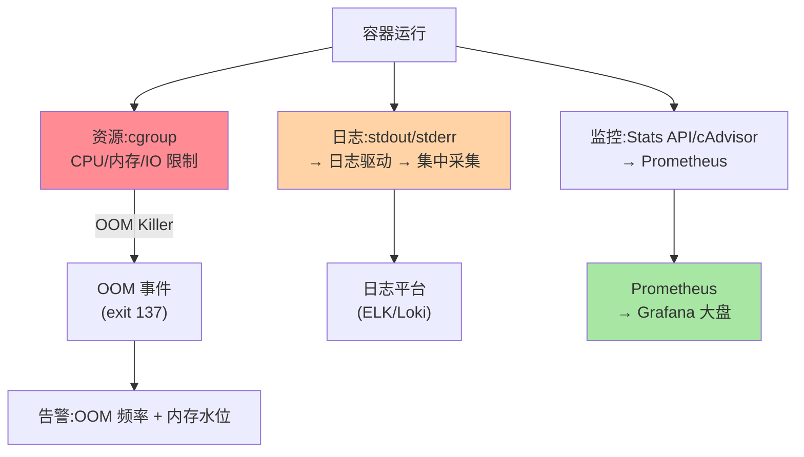
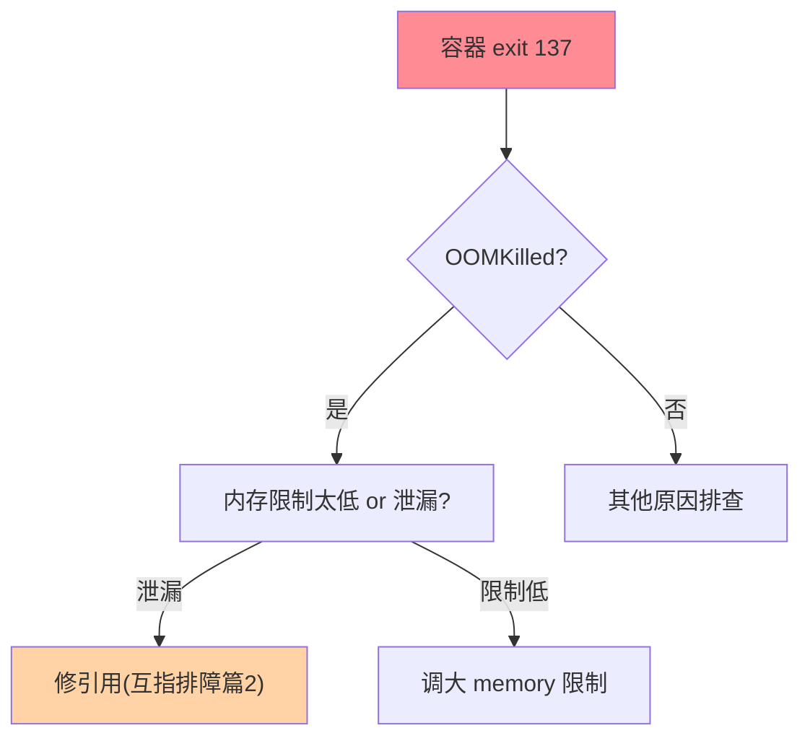

# Docker 生产化运维：日志、监控与资源治理

> 容器化只是第一步——容器跑在 生产环境后，日志怎么收、资源怎么控、异常怎么发现才是真正的运维课题。这篇把 Docker 生产化运维的日志驱动、资源限制与 OOM 处置、监控指标三件套讲成一套体系。

> **本文核心**：生产容器运维的三根支柱——**日志**（日志驱动 json-file/local/syslog/fluentd + 集中采集策略）、**资源**（cgroup 限制 CPU/内存 + OOM Killer 行为理解 + 参数调优）、**监控**（容器指标 cadvisor/Stats API + 宿主机联合视角 + 告警阈值）。**机制链**：容器 → cgroup 资源隔离 → 日志驱动采集 → 监控指标采集 → 告警响应。

## 一句话摘要

容器生产化运维的核心理念：**容器是"有生命周期的进程"，不是"一台小机器"**——日志用 stdout/stderr 由驱动采集（不写容器内文件）、资源用 cgroup 硬限制（不做软限制）、监控用容器原生指标（不做宿主机指标转发）。与虚拟机运维的本质区别：容器的日志/资源/监控全部通过 Docker 引擎与内核接口透出，绕过引擎直接操作容器内部 = 运维盲区。

## 5W 速记卡

| 维度 | 一句话 |
|---|---|
| What | 容器日志驱动 + cgroup 资源治理 + 容器指标监控 |
| Why | 容器是进程不是机器，运维方式与 VM 完全不同 |
| When | 容器化后生产运维、OOM 排查、资源调优 |
| Where | Docker 引擎 + cgroup + 日志驱动 + 监控采集 |
| How | 日志驱动选型 → cgroup 限制设计 → 监控告警联动 |

## 二、三根支柱的体系

## 三、日志驱动：stdout 即日志流

容器日志的**架构约定**：应用输出到 stdout/stderr → Docker 日志驱动接管 → 转发到指定目标。**不写容器内文件**——容器重启文件丢失、容器内文件系统只读安全、写文件消耗容器可写层空间。

| 驱动 | 机制 | 适用 |
|---|---|---|
| json-file（默认） | JSON 写本地文件 | 开发/单机 |
| local | 高效本地文件（压缩+轮转） | 生产推荐（性能优于 json-file） |
| fluentd/syslog | 直接转发到日志平台 | 有集中日志基建 |
| none | 不采集 | 纯计算容器（日志全走外部） |

**日志轮转配置**：json-file/local 驱动必须配 max-size + max-file——否则容器日志文件无限增长打满磁盘（生产 OOM 的常见根因之一）。

## 四、资源限制与 OOM Killer

**cgroup 两版**：cgroup v1（多层级）→ v2（统一层级，现代 Linux 默认）——Docker 通过 cgroup 限制容器的 CPU、内存、IO。**内存限制**：`--memory=512m` 硬限制 + `--memory-reservation` 软限制——超出硬限制触发 OOM Killer（内核杀进程，容器退出码 137）。

**OOM Killer 的行为**：容器内存超限 → 内核 OOM Killer 杀掉容器内最大内存进程 → 容器退出（137）→ 重启策略决定是否重启——**OOM 不是 Docker 的 Bug 是 cgroup 的保护机制**。排查：`docker inspect` 看 OOMKilled 标记 + dmesg 看 OOM 事件。

**CPU 限制**：`--cpus=2.0` 限制 CPU 使用率（基于 CFS 调度器配额）——CPU 超限不杀进程而是限流（throttle，表现为延迟上升）——与内存 OOM 的硬杀不同。

## 五、监控指标

| 指标 | 来源 | 告警阈值 |
|---|---|---|
| CPU 使用率 / 限流次数 | cgroup cpu.stat | 限流次数 > 0 即关注 |
| 内存使用 / OOM 事件 | cgroup memory.stat | 水位 > 80% 告警 |
| 网络 IO | cgroup net_cls | 按业务基线 |
| 磁盘 IO | cgroup blkio | 按磁盘基线 |
| 容器状态 | Docker API（running/exited） | 非 running 告警 |

**监控采集**：cAdvisor（Docker 内置 Stats API 的聚合层）→ Prometheus 抓取 → Grafana 大盘——**容器指标与宿主机指标联合看**（容器内正常但宿主机异常的排障场景常见）。

OOM 处置的排查路径：

**量级演进视角**：单机 3-5 容器手工运维可管；百容器需日志集中采集 + 统一监控大盘；千容器必须有平台化运维——治理强度随规模升级。

## 六、典型场景

- **容器 OOM 频发**：确认 OOMKilled → 检查内存限制是否合理（应用真实需求 vs 限制值）→ 修复内存泄漏或调大限制——调大前先确认不是泄漏（互指排障篇 2 的 OOM 类型学）
- **日志打满磁盘**：json-file 无轮转 → 日志文件膨胀 → 切 local 驱动 + 配轮转 + 集中采集
- **CPU 限流导致延迟**：限流次数高 → 调大 cpus 或优化应用 CPU 效率

## 业内惯例

- **容器不跑 SSH**（运维进容器是反模式——容器不可变，问题排宿主机/日志/监控）
- **资源配置必显式声明**（不依赖默认——默认无限制，一台宿主机上互相竞争）
- **3.x/4.x 视角**：cgroup v2 全面普及、Docker 26.x 的安全默认增强——**Docker 运维知识随内核演进而更新**

## 七、常见误区

- **「容器内写文件没问题」**：可写层随容器销毁——持久化必须用 volume；日志写容器内文件不进日志平台
- **「资源限制越低越省」**：CPU 限流导致延迟、内存 OOM 导致重启——限制值 = 实际需求 × 安全系数
- **「容器监控 = 宿主机监控」**：宿主机正常但单容器 OOM；容器正常但宿主机磁盘满——两层都要看

## 八、与相邻机制的关系

- 《深入理解Docker 系列》特性层：镜像/运行时/网络/存储的机制底座
- K8s 系列：K8s 的 Pod 资源管理是 Docker cgroup 的上层封装（互指）
- tips 互指：排障专题的 OOM 类型学（JVM 视角与容器视角合并看）

## 你们可能会问

**Q1：容器内 JVM 内存怎么配？**
容器内存限制 × 0.5~0.75 给 JVM 堆（留余量给元空间/线程栈/直接内存）；JDK 10+ 的 UseContainerSupport 自动感知容器限额——手工算比自动感知更可控。

**Q2：local 驱动比 json-file 好在哪？**
local 驱动用 mmap + 压缩 + 内置轮转——文件更小、写入更快、自带轮转；json-file 是纯文本无限增长（不配轮转会打满磁盘）。

**Q3：多容器共享宿主机怎么避免资源竞争？**
每容器显式设 CPU/内存限制 + 宿主机总资源 > 所有容器限制之和——超卖是宿主机 OOM 的根源。

## 九、自测三问

1. 容器日志驱动选型的原则与「不写容器内文件」的架构约定？
2. OOM Killer 的触发机制与排查方法（exit 137 → OOMKilled → dmesg）？
3. CPU 限流与内存 OOM 的行为差异？

## 开放问题

- eBPF 对容器可观测的增强（无需 sidecar 的网络/IO 细粒度监控）——传统 cgroup 指标之外的新观测维度。
- WebAssembly 容器（WASM runtime）的运维模型与传统容器不同——新运行时形态的运维标准尚在探索。

## 📎 核心带走

- **核心一句话**：容器生产运维 = 日志走驱动不写文件 + 资源用 cgroup 显式限制 + 监控看容器指标联合宿主机——容器是进程不是机器
- **机制链**：容器 → stdout/stderr → 日志驱动 → 平台；容器 → cgroup 限制 → OOM/限流 → 告警；容器 → Stats API → Prometheus → 大盘
- **失效点/边界**：kill -9 无优雅可言；资源限制是保护不是节约；容器内写文件随容器消失

## 💡 实战提示

- 💡 日志轮转 + OOM 事件 + 限流次数三指标进基础镜像默认配置——新容器零配置即有基础可观测
- 💡 容器配置进代码（docker-compose.yml/Dockerfile）版本管理，运行时参数不再「口头约定」
- 💡 OOM 事件率与内存水位的取舍：限制太紧 OOM 频繁、限制太松宿主机资源浪费——水位监控数据驱动调优
- 💡 决策口径：日志驱动 local 起步（生产），有日志平台切 fluentd/syslog；内存限制 0.75 × 实际需求起步
- 💡 安全与便利的取舍：容器安全加固（rootless/只读文件系统/最小镜像）降低运维便利度——按环境分级（开发宽松/生产严格）

## 📌 数据与事实声明

- 写于 2026-09-10，机制以 Docker 26.x / cgroup v2 为基准（官方文档口径）
- 「OOM 137 常见根因」为生产经验归纳；参数默认值以官方文档为准
- 免责：具体参数按宿主机与应用实测

## 📚 参考资料

| 类型 | 标题 | 来源 |
|---|---|---|
| 官方文档 | Docker Logging / Resource Constraints | docs.docker.com |
| 官方源码 | moby/moby（daemon/logs） | github.com/moby/moby |
| 关联系列 | 本仓库 K8s 系列 / 排障篇 2 OOM 类型学 | docs/devops/ |

**事故推演**：容器 OOM 频发的典型根因——未设内存限制（默认无限但宿主机 OOM 时被杀）+ 日志驱动无轮转（磁盘打满）。三件事防线：显式 memory 限制 + 日志轮转 + 水位告警。
