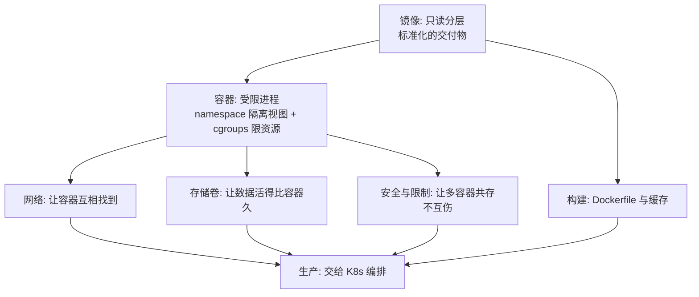

# 从零开始认识 Docker 系列导读

> 本系列共 11 篇（0 导读 + 7 入门正文 + 3 深度篇），覆盖容器化整个知识面：容器本质、镜像分层、构建、网络、存储、本地编排、安全，以及构建缓存、运行时隔离、生产踩坑三个深度专题。
> 本篇是导读：先建立「容器 = 受限进程 + 标准化交付物」的心智模型，再决定从哪读起。

## 一、为什么需要这套系列

「在我机器上能跑」是工程协作里最贵的六个字。环境不一致（依赖版本、系统库、内核参数）造成的联调与部署损耗，几乎每个团队都付过。容器化的价值就是把「应用 + 它的运行环境」打包成一个标准化交付物，让交付链路的上下游（开发、测试、生产）跑的是同一个东西。

但学容器常见两种卡法：**只会敲命令**——`docker run` 背得熟，出了问题（网络不通、磁盘暴涨、进程被杀）完全不知道往哪查；**概念混淆**——容器、镜像、虚拟机、K8s 的关系一团浆糊。这套系列的设计思路：**先建立「容器是受限进程」的本质认知，再逐个机制铺开，最后用三个深度篇打通到生产**。

## 二、全局心智模型

理解这个模型的三个要点：

1. **镜像与容器是「类与实例」的关系**：镜像是只读模板（分层存储），容器是镜像的运行实例（加一层可写层）。所有容器化问题都能归到「镜像怎么构建」和「容器怎么运行」两条线。
2. **容器不是迷你虚拟机**：它是一个被 Linux 内核机制（namespace、cgroups）限制了视野和资源的普通进程——理解这一点，九成的容器怪问题都能定位。
3. **Docker 管「单机」，K8s 管「集群」**：容器是 K8s 的调度单元底座，本系列只讲单机容器化与构建，编排部分在[K8s 生态系列](../../../kubernetes/入门层/从零开始认识K8s生态系列/0_系列导读-全景.md)展开——单机与集群的架构边界，是容器知识体系里最重要的一次分层；越界使用（单机硬扛集群规模）的代价是运维失控。

## 三、系列导航表（11 篇）

| 篇目 | 层 | 一句话定位 |
|---|---|---|
| [1 容器是什么](./1_容器是什么-从虚拟机到容器-入门.md) | 入门 | namespace + cgroups + 联合文件系统，容器 vs 虚拟机 |
| [2 镜像与分层](./2_镜像与分层-入门.md) | 入门 | 只读分层、写时复制、标签与摘要 |
| [3 Dockerfile 与构建](./3_Dockerfile与构建-入门.md) | 入门 | 指令逐条讲透、多阶段构建、构建上下文 |
| [4 容器网络](./4_容器网络-入门.md) | 入门 | bridge/host/overlay、端口映射、容器互访 |
| [5 存储卷](./5_存储卷与数据持久化-入门.md) | 入门 | volume/bind mount/tmpfs、数据生命周期 |
| [6 Docker Compose](./6_DockerCompose与本地编排-入门.md) | 入门 | 多容器本地编排、depends_on 与健康检查 |
| [7 容器安全与资源限制](./7_容器安全与资源限制-入门.md) | 入门 | 以非 root 运行、capabilities、limits、镜像扫描 |
| [1 镜像分层与构建缓存](../../特性层/深入理解Docker系列/1_镜像分层与构建缓存-深度.md) | 特性 | BuildKit 缓存原理、镜像瘦身方法论 |
| [2 容器运行时与隔离](../../特性层/深入理解Docker系列/2_容器运行时与隔离机制-深度.md) | 特性 | namespace/cgroups 关键路径、PID 1 与信号 |
| [3 生产容器化踩坑与调优](../../特性层/深入理解Docker系列/3_生产容器化踩坑与调优-深度.md) | 特性 | OOM/日志/僵尸进程/优雅停机实战 |

## 四、入门者最容易踩的 3 个认知误区

### 误区 1：把容器当「轻量虚拟机」

虚拟机虚拟的是硬件（每个装完整操作系统），容器共享的是内核（只隔离视图和资源）。这个差别决定了：容器秒级启动、镜像以 MB 计；也决定了容器**不能提供虚拟机级的安全隔离**——内核漏洞可能穿透所有容器。

### 误区 2：把容器当「有状态的小服务器」

往容器里写数据、装软件、改配置，容器一删全没了（可写层是临时的）。正确的姿势是：**变化的东西全部外置**——数据放卷、配置放环境变量或挂载、镜像不可变。

### 误区 3：把 Docker 等同于容器技术

Docker 是容器技术最成功的实现和工具链，但镜像格式已标准化为 OCI 规范，运行时有 containerd、运行时 beneath 有 runc。学机制（分层、namespace、cgroups），不绑死在某个工具上——这也是 K8s 在 2022 年移除 dockershim 后生态依然平稳的原因。

## 五、怎么读这套系列

- **零基础**：按 1-7 顺序读，每天 2-3 篇，一周建立完整容器认知
- **要上生产**：直接读特性层三篇（构建缓存 / 运行时 / 生产踩坑），每篇都可独立成篇
- **要与 K8s 衔接**：读完入门层 1-2 后跳[K8s 生态系列](../../../kubernetes/入门层/从零开始认识K8s生态系列/0_系列导读-全景.md)，两边靠「容器是底座」这条线互指

---

下一篇：**[1_容器是什么-从虚拟机到容器](./1_容器是什么-从虚拟机到容器-入门.md)**——namespace、cgroups 与联合文件系统如何把一个进程变成「容器」。

---

## 📌 数据与事实声明

本文版本锚点（截至 2026-09-09，gh CLI 实测）：Docker Engine 最新 release v29.8.0（2026-09-03），Compose v5.5.1，BuildKit v0.33.0。镜像格式 OCI 规范、K8s 1.24 移除 dockershim（2022）为公开事实；具体特性行为请以官方文档为准。

## 📚 参考资料

| 类型 | 标题 | 来源 |
|---|---|---|
| 文档 | Docker 官方文档 | docs.docker.com |
| 规范 | OCI（Open Container Initiative）镜像与运行时规范 | opencontainers.org |
| 系列文章 | K8s 生态系列（编排层） | 本仓库 docs/devops/kubernetes/ |
