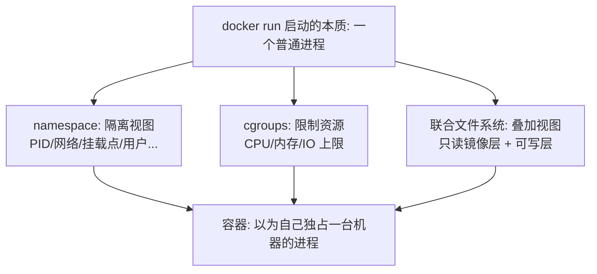
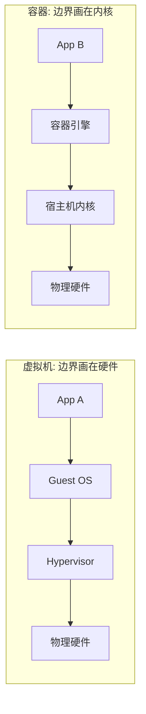

# 容器是什么：从虚拟机到容器

> **一句话摘要**：容器不是轻量虚拟机，是一个被 Linux 内核「限制了视野（namespace）和资源（cgroups）」的普通进程，再配上联合文件系统带来的可移植镜像——理解这三件机制，容器的一切行为都变得可解释。

前置阅读：[系列导读](./0_系列导读-全景.md)。容器在集群里怎么被编排，见[K8s 生态系列](../../../kubernetes/入门层/从零开始认识K8s生态系列/2_容器与K8s关系全景-入门.md)。

## 1. 背景：为什么需要容器

容器要解决的核心问题是**环境一致性**。同一个应用在开发机能跑、测试机报错、生产机崩——根因是三台机器的系统库版本、依赖、内核参数不一致；虚拟机虽然能隔离环境，但每台虚机要装完整操作系统（GB 级、分钟级启动），为「隔离一个 Web 进程」付一台 OS 的代价，太重。

容器换了一个思路：**不虚拟硬件，共享内核**——所有容器跑在同一台宿主机的同一个 Linux 内核上，但每个容器看到的世界被裁剪成「以为自己在独占一台机器」。隔离视图靠 namespace，限额资源靠 cgroups，可移植交付靠联合文件系统。

## 2. 核心机制：三件套如何造出「容器」



- **namespace（隔离视图）**：让进程「看不到别人」。PID namespace 让容器内进程以为自己是一号进程；网络 namespace 给它独立的网卡和端口空间；挂载、用户、IPC 等 namespace 各管一摊。视图隔离不消耗资源，这是容器比虚拟机轻的根源。
- **cgroups（限制资源）**：让进程「用不了别人的」。给容器设 CPU 份额、内存上限、IO 带宽——内存超限的容器会被内核 OOM killer 直接杀掉（这是生产容器「莫名消失」的第一嫌疑，深度篇专讲）。
- **联合文件系统（可移植交付）**：把镜像的多个只读层叠加成一个视图，容器启动时在最上面挂一层可写层。镜像因此可以被成百上千个容器共享（相同层只存一份），这是容器比虚拟机省的另一个根源。

### 2.2 容器 vs 虚拟机

| 维度 | 虚拟机 | 容器 |
|---|---|---|
| 虚拟对象 | 硬件（每台装完整 OS） | 只隔离进程视图（共享内核） |
| 启动速度 | 分钟级（要引导 OS） | 秒级甚至毫秒级（就是起个进程） |
| 体积 | GB 级 | MB 级 |
| 隔离强度 | 强（内核都独立，漏洞难穿透） | 中（共享内核，内核漏洞可能波及全部容器） |
| 适用 | 强隔离需求（多租户 SaaS、异构 OS） | 应用交付（同一内核上的海量实例） |

两者不是替代关系：公有云是「虚拟机之上跑容器」的分层结构。从系统架构的上下游视角看，两者的边界画法不同——虚拟机把抽象边界画在硬件层（上层是完整 OS），容器把边界画在内核的进程视图上（上层直接是应用）；边界画在哪，决定了启动速度、体积与隔离强度这组代价的权衡结果：



## 3. 落地实践：五分钟上手

```bash
# 起第一个容器：-d 后台、-p 端口映射、--name 起名
docker run -d -p 8080:80 --name web nginx:alpine
# 进去看看：容器里就是一个被隔离的进程环境
docker exec -it web sh
# 在容器里确认「进程视图被隔离」：nginx 的 PID 是 1
ps aux
# 用完即删：容器是临时的，别在里面存东西
docker rm -f web
```

验证「容器是进程」只需一条命令：在宿主机执行 `ps aux | grep nginx`，能看到这个「容器内的一号进程」就躺在宿主机进程列表里——它从来都是一个普通进程，只是穿了 namespace 和 cgroups 的「马甲」。

## 4. 生产视角：共享内核的代价

- **容器不是安全沙箱**：同宿主机的容器共享内核，内核提权漏洞（历史上的「逃逸」类 CVE）理论上可波及全部容器。所以不可信代码（用户上传内容的服务端处理、第三方构建脚本）不放裸容器，用强隔离方案（gVisor/Kata 一类安全容器，机制是给容器套一层独立内核）。
- **容器「消失」的头号根因是 OOM**：内存限制触发 cgroups OOM kill，进程直接死、日志往往来不及打。生产容器的内存 limit 必须结合应用真实占用设定，监控要盯容器级内存水位。
- **一个容器一个进程**：容器内 PID 1 收到 SIGTERM 要负责把整个容器带下去——在容器里跑多进程、跑 systemd 都是反模式（为什么，特性层运行时篇专讲）。语义上「一个容器 = 一个进程 = 一个关注点」，多进程用 Compose/K8s 编排多个容器。

## 5. 主流方案怎么做：机制相同、工具链分层

| 层 | 主流实现 | tips |
|---|---|---|
| 容器引擎（用户接口） | Docker Engine v29.x（截至 2026-09 最新 29.8）/ Podman | Podman 无守护进程、支持 rootless，命令与 Docker 兼容（`alias docker=podman` 级别）；Mac/Windows 上 Docker Desktop 是「VM 里跑 Linux 容器」 |
| 高层运行时（生命周期管理） | containerd（事实标准） | Docker Engine 内部也用它；K8s 1.24 移除 dockershim 后直连 containerd，镜像照常通用（OCI 标准化之功） |
| 低层运行时（真正造容器） | runc（OCI 运行时） | 每个容器的最终创建者：调 namespace/cgroups 的那一层 |
| 安全容器（强隔离） | gVisor / Kata Containers | gVisor 拦截系统调用实现「用户态内核」，Kata 是轻量虚拟机；代价是性能损耗与兼容性 |

规律：**机制（namespace/cgroups/OCI）是稳定的，工具（Docker/Podman/containerd）是轮换的**。学机制，工具切换成本趋近于零。

## 6. 典型场景

- **本地开发环境**（效率级）：数据库、缓存、消息队列全部容器化，新人 `docker compose up` 一条命令拿到整套环境，告别「装环境装一天」。
- **CI 构建隔离**（一致性级）：构建步骤跑在容器里，流水线环境与应用运行时完全一致，「CI 上能过、线上必能跑」。
- **微服务交付单元**（交付级）：每个服务一个镜像，开发、测试、生产交付同一个镜像、只换配置——这是容器对交付体系最大的改变。

## 7. 与相邻概念的区别

- **容器 vs 虚拟机**：见第 2.2 节对比表。一句话：虚拟机隔离的是「机器」，容器隔离的是「进程」。
- **Docker vs containerd vs runc**：Docker 是面向开发者的全家桶（CLI + 构建 + 引擎），containerd 是守护进程级的容器生命周期管理器，runc 是按 OCI 规范真正创建容器的底层工具。调用链：`docker` → `containerd` → `containerd-shim` → `runc` → 你的进程。
- **容器 vs 沙箱（Sandbox）**：容器的隔离目标是「资源与视图」，安全强度有限；沙箱（浏览器沙箱、gVisor）的安全目标是「不可信代码逃不出去」。需要后者的强度时，用安全容器而不是裸容器。

## 8. 常见误区与不适用

- **「容器 = 轻量虚拟机，虚拟机的能力它都有」**：容器没有独立内核，跨内核的应用（需要特定内核模块、非 Linux 内核的 Linux 应用）跑不了；隔离强度也到不了虚拟机级别。
- **「容器是安全的，随便跑别人的镜像」**：以 root 跑、带全部 capabilities 的容器接近宿主机权限。来路不明的镜像 + 特权容器 = 把宿主机交出去。
- **「在容器里装个 systemd 管多进程」**：违背「一容器一进程」语义，信号传递、日志收集、生命周期全部变复杂。多进程用多容器编排解决。
- **「容器里改了配置就完事」**：可写层随容器销毁而消失。变化的配置应进环境变量/挂载，或固化进新镜像——容器应是「可随时销毁重建」的。

## 9. 你们可能会问

- **为什么容器启动这么快？** 因为它只是「创建一个带 namespace/cgroups 的进程」+ 挂载镜像层，没有引导操作系统这一步；镜像层已在本地时是秒级，首次要拉镜像才是主要耗时。
- **Mac 上能跑 Linux 容器吗？** 能，但走的是「本机一个轻量 Linux 虚拟机，容器跑在虚拟机里」——Docker Desktop 的实现方式。所以 Mac 上文件挂载性能通常低于 Linux 原生。
- **容器逃逸是什么？** 利用内核或运行时漏洞突破 namespace/cgroups 约束、拿到宿主机权限。防御靠：及时升级内核/运行时、非 root 运行、裁剪 capabilities、不可信负载用安全容器。
- **Windows 容器和 Linux 容器什么关系？** 两套独立实现（Windows 内核的容器机制），镜像互不兼容；生产中绝大多数容器生态是 Linux 容器。
- **学 Docker 还是直接学 Podman？** 先学 Docker（资料与生态最多、命令通用），机制理解后切 Podman 是一天的适应成本——命令设计就是兼容的。

## 10. 一句话总结 + 5W 速记卡 + 自测三问

**一句话总结**：容器 = namespace 隔离视图 + cgroups 限额资源 + 联合文件系统交付镜像的「受限进程」——比虚拟机轻是因为共享内核，隔离也止步于内核。

**5W 速记卡**：

| 维度 | 内容 |
|---|---|
| What | namespace + cgroups + 联合文件系统构成的进程级隔离 |
| Why | 环境一致性：交付「应用 + 运行环境」的标准单位 |
| When | 本地环境、CI 构建、应用交付；强隔离需求除外 |
| Where | 单机容器化（集群编排归 K8s） |
| How | docker run 起手 → 理解「容器是进程」→ 变化外置（卷/配置/镜像） |

**自测三问**：

1. 在宿主机 `ps` 里找到你的容器进程了吗？它的 namespace 和宿主机进程差在哪？
2. 你的容器内存 limit 是多少？被 OOM kill 时应用日志能留下什么？
3. 你容器里的 PID 1 是什么进程？它收到 SIGTERM 会把整个容器带下去吗？

---

**下篇预告**：容器从镜像来——下一篇[镜像与分层](./2_镜像与分层-入门.md)讲只读分层、写时复制、标签与摘要。

---

## 📌 数据与事实声明

本文版本锚点（截至 2026-09-09，gh CLI 实测）：Docker Engine v29.8.0。namespace/cgroups/联合文件系统为 Linux 内核公开机制；K8s 1.24 移除 dockershim（2022-05）为公开事实；虚拟机与容器的启动时长、体积对比为业内通用认知量级。具体命令行为以 Docker 官方文档为准。

## 📚 参考资料

| 类型 | 标题 | 来源 |
|---|---|---|
| 文档 | Docker 官方文档（Run your first container 等） | docs.docker.com |
| 文档 | Linux man pages: namespaces(7), cgroups(7) | man7.org |
| 规范 | OCI Runtime Specification | opencontainers.org |
| 图书 | 数据密集型应用系统设计（DDIA） | O'Reilly（2017 中译） |
