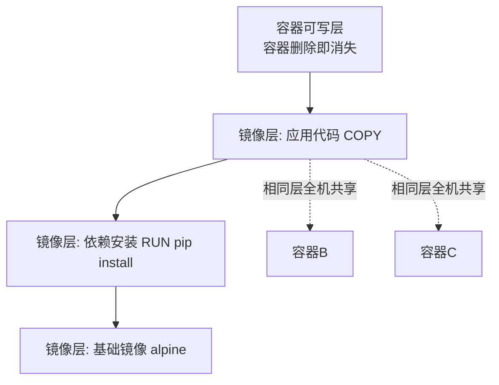
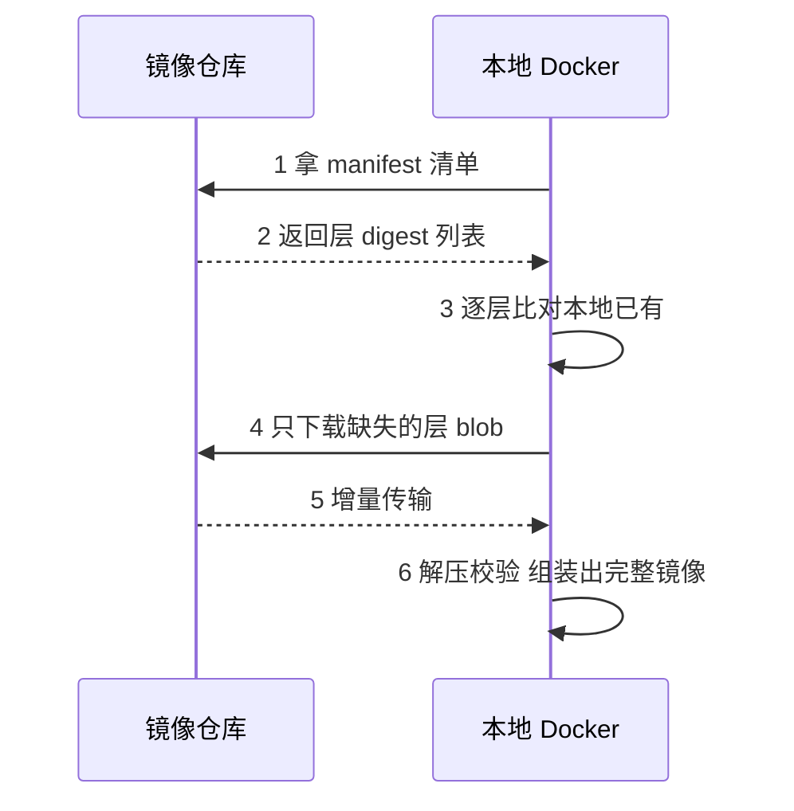

# 镜像与分层

> **一句话摘要**：镜像是「只读分层的联合挂载」——每层是一组文件变更，层可共享、可缓存、可增量拉取，容器启动时只在顶部加一层可写层；标签是给人看的别名，摘要是内容的哈希指纹——生产引用镜像永远用摘要或不可变标签。

前置阅读：[容器是什么](./1_容器是什么-从虚拟机到容器-入门.md)。构建层怎么写、缓存怎么吃到，见[Dockerfile 与构建](./3_Dockerfile与构建-入门.md)与[特性层构建缓存深度篇](../../特性层/深入理解Docker系列/1_镜像分层与构建缓存-深度.md)。

## 1. 背景：为什么镜像要设计成分层

如果镜像是一个整体文件，三个基于同一基础镜像的应用就要存三份几乎相同的 GB 级文件；改一行代码就要重新传输整个镜像。分层把镜像拆成「一层层文件变更的堆叠」：基础层（操作系统根文件系统）全网共享一份，应用层只有几 MB——**存储省（相同层磁盘只存一份）、传输省（已存在的层不重复拉）、构建快（没变的层直接用缓存）**。

分层是容器交付体系的经济学基础：没有分层，镜像仓库的带宽和存储成本、CI 的构建时间都会放大一个数量级。

## 2. 核心机制：分层、写时复制与指纹



三个机制要点：

- **只读层 + 可写层（写时复制 CoW）**：镜像层全部只读；容器要改某文件时，先把它从镜像层复制到自己的可写层再改。多个容器共享同一份镜像层，各写各的可写层——这就是「容器是临时的」的机制根源：删容器只删了那层可写层。
- **层的内容寻址**：每层按内容哈希（digest，`sha256:...`）寻址。拉镜像时本地已存在的层直接跳过；两套镜像共用同一个基础层时，磁盘和网络都只付一次。
- **标签 vs 摘要**：标签（`nginx:1.27`）是仓库里「可移动的指针」——同标签的内容可以被重新推送覆盖；摘要（`nginx@sha256:...`）是指向特定内容的指纹，不可变。生产环境引用镜像的业内惯例：要么 `@sha256` 摘要，要么自建仓库里不可变标签策略。

### 2.2 镜像的数据结构一层层看

一个完整的镜像在仓库里长这样：**manifest（清单）** 记录「配置文件 + 各层的 digest 列表」；每个 **layer blob** 是一层压缩后的文件变更包；**config** 记录启动命令、环境变量、暴露端口等元数据。`docker pull` 就是先拿 manifest、再按 digest 逐层下载缺的 blob——理解这个结构，「为什么拉镜像有的层秒过、有的层很慢」「多架构镜像怎么选到本机版本」（manifest list 按平台分发不同 manifest）都有了答案：



## 3. 落地实践：日常操作与镜像体检

```bash
# 拉取与查看：看分层结构、每层大小、总大小
docker pull nginx:1.27-alpine
docker history nginx:1.27-alpine

# 指纹与不可变引用：拿到 digest 用于生产部署
docker inspect --format '{{index .RepoDigests 0}}' nginx:1.27-alpine

# 镜像体检三件套：大小是否合理、层里有没有多余文件、能不能再瘦身
docker images                      # 本地清单与体积
docker save nginx:1.27-alpine | tar -tv | head  # 层内文件粗看
docker run --rm image sh -c 'du -sh /*'         # 容器内目录占用
```

体检的判断标准：一个简单 Web 服务镜像超过几百 MB 就值得怀疑（大概率带了构建工具链或包管理缓存——瘦身的系统方法见特性层深度篇）；`history` 里出现「下载依赖」层比「代码」层还大，说明依赖没做缓存友好拆分。

## 4. 生产视角：标签与仓库的坑

- **`latest` 是事故词汇**：`latest` 只是「没人指定标签时的默认指针」，不代表最新版本，更不代表稳定。今天和上周拉到的 `latest` 可能是两个东西，回滚时 `latest` 已指向新版本——回滚失败。生产惯例：CI 产出的镜像用「语义版本 + git 短哈希」双标签，部署清单里用摘要。
- **同标签内容漂移**：自建仓库若允许重复推送同标签，两个环境的「同一个镜像」就是两个镜像。Harbor 一类仓库支持「标签不可变」策略，打开它。
- **磁盘与带宽的隐形消耗**：旧镜像长期不清理，构建机的磁盘会被几十个版本的层吃满（`docker system prune` 系列命令清理，但注意别清掉缓存层——利弊见构建缓存深度篇）；跨机房拉镜像的带宽账要算，「镜像预分发 / P2P 分发」是大规模场景的演进方向。
- **镜像 provenance 与安全**：镜像从哪来、谁构建的、有没有漏洞——SBOM（软件物料清单）与镜像签名（cosign 一类）正在成为供应链安全的业内标配，机制见[容器安全篇](./7_容器安全与资源限制-入门.md)。

## 5. 主流方案怎么做：仓库与规范生态

| 环节 | 主流选择 | tips |
|---|---|---|
| 镜像规范 | OCI 镜像规范（行业标准） | Docker 镜像格式已捐给 OCI，podman/buildkit/containerd 全部通用，工具切换不换镜像 |
| 公共仓库 | Docker Hub / ghcr.io | Hub 有拉取限速（按账号级别），ghcr 与 GitHub Actions 集成最顺 |
| 自建仓库 | Harbor（主流）/ Nexus | Harbor 自带漏洞扫描（Trivy 集成）、标签不可变、镜像签名验证；生产自建基本默认 Harbor |
| 云托管 | 各云 ACR/ECR | 与云上 CI/弹性伸缩联动最顺；注意跨区拉取流量费 |
| 多架构 | manifest list（docker buildx） | 一条命令构建 amd64/arm64 双架构镜像，Apple Silicon 开发机普及后的刚需 |

## 6. 典型场景

- **CI 产出镜像**（交付级）：流水线构建 → 推 Harbor → 部署清单引用摘要，全程「一个镜像走到生产」。
- **瘦身与加速**（成本级）：基础镜像换 alpine/distroless、依赖层与代码层拆开吃缓存，构建时间与拉取带宽同步下降（方法见深度篇）。
- **离线/内网交付**（合规级）：`docker save/load` 打包镜像过物理隔离，或内网 Harbor 做中转——金融与政企内网的常规操作。

## 7. 与相邻概念的区别

- **镜像 vs 容器**：镜像是只读模板（类），容器是运行实例（对象 = 镜像 + 可写层 + 进程）。一个镜像可以起 N 个容器。
- **标签 vs 摘要**：标签是可变指针（给人用），摘要是内容指纹（给机器与生产用）。`image:1.27` 与 `image@sha256:abc` 指向的内容可能随时分离。
- **镜像 vs 传统制品（jar/war）**：jar 只含应用与依赖，运行环境（JVM 版本、系统库、参数）靠机器保证；镜像把「应用 + 环境内核之外的一切」整体固化——这是「同一镜像处处一致」的根据，也是「镜像比制品大两个数量级」的代价。

## 8. 常见误区与不适用

- **「latest = 最新版，用它准没错」**：latest 既不是最新的保证、也不是稳定的保证，它只是默认指针。生产引用它等于把部署结果交给运气。
- **「镜像分层会自动帮我省一切」**：分层省钱的前提是「层设计得好」——把天天变的文件写进底层，缓存与增量拉取全部失效（Dockerfile 指令顺序决定分层，见下一篇）。
- **「容器里删了文件，镜像就变小了」**：可写层里删除文件不会让下面的镜像层变小，只是「标记不可见」。瘦身必须在构建阶段（换基础镜像、合并层、清缓存），不能靠运行时删。
- **「镜像不可变 = 容器里的数据也安全」**：镜像不可变说的是只读层；容器可写层既是临时的也是非持久的——数据要活过容器，用[存储卷](./5_存储卷与数据持久化-入门.md)。

## 9. 你们可能会问

- **两个镜像怎么判断「内容完全一样」？** 比较 manifest digest。相同 digest = 逐位相同；相同标签只说明「指针指向过」。
- **为什么拉镜像时「Already exists」这么多？** 好事——那些层本地已有（其他镜像共享过），分层内容寻址的直接收益。
- **基础镜像怎么选？** 三档：发行版精简版（alpine，几 MB，注意 musl 与 glibc 的兼容差异）、distroless（只留运行时，无 shell，安全面最小）、云厂商优化版。判定标准是「最小可运行」，调试需求用 debug 侧车容器补。
- **多阶段构建和分层什么关系？** 多阶段构建让「编译工具链」留在中间阶段，最终镜像只 COPY 产物——镜像层数变少、体积数量级下降，机制详解见深度篇。
- **镜像扫描报了几百个 CVE 怎么办？** 先分清基础层 CVE 与应用依赖 CVE：前者换新基础镜像重建，后者走依赖升级；扫描要进 CI 门禁而不是上线前抽查。

## 10. 一句话总结 + 5W 速记卡 + 自测三问

**一句话总结**：镜像 = 内容寻址的只读分层堆叠——层共享省存储与带宽、缓存加速构建；标签是可变指针、摘要是不可变指纹，生产引用永远基于摘要思维。

**5W 速记卡**：

| 维度 | 内容 |
|---|---|
| What | 只读分层 + 写时复制 + manifest/layer/config 结构 |
| Why | 存储/传输/构建三重经济学，是容器交付的基石 |
| When | 构建镜像、选基础镜像、设计 Dockerfile 层序时 |
| Where | 本地构建机 → 仓库（Harbor 等）→ 各运行环境 |
| How | history 体检 → 版本+摘要引用 → 不可变标签策略 → CI 门禁扫描 |

**自测三问**：

1. 你生产部署清单里的镜像引用是标签还是摘要？回滚时它能指回旧版本吗？
2. 你的应用镜像多少 MB？`history` 里最大的一层是什么、能不能消除？
3. 同一镜像在测试环境和生产环境的 digest 一致吗？你怎么验证的？

---

**下篇预告**：分层好不好，全看 Dockerfile 怎么写——下一篇[Dockerfile 与构建](./3_Dockerfile与构建-入门.md)讲指令逐条取舍、多阶段构建与构建上下文。

---

## 📌 数据与事实声明

本文版本锚点（截至 2026-09-09）：Docker Engine v29.8.0、BuildKit v0.33.0。分层/CoW/manifest 结构为 OCI 镜像规范公开内容；Docker Hub 拉取限速、Harbor 功能为官方公开信息；镜像体积量级为业内通用认知。具体行为以官方文档为准。

## 📚 参考资料

| 类型 | 标题 | 来源 |
|---|---|---|
| 规范 | OCI Image Specification | opencontainers.org |
| 文档 | Docker 官方文档：images / registry | docs.docker.com |
| 文档 | Harbor 文档（不可变标签/扫描） | goharbor.io |
| 系列文章 | 镜像分层与构建缓存（深度篇） | 本仓库 docs/devops/docker/特性层/ |
