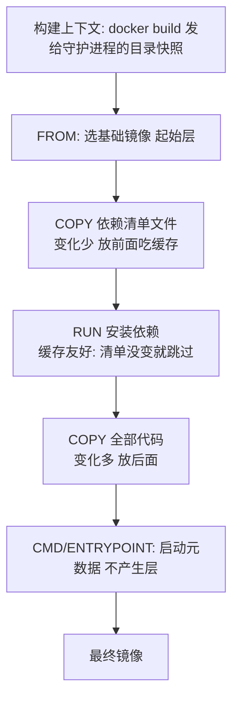
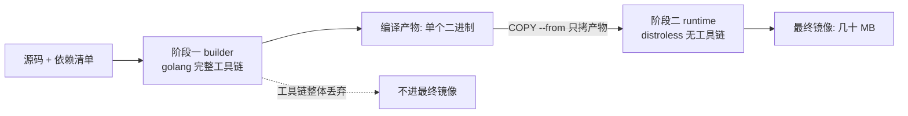

# Dockerfile 与构建

> **一句话摘要**：Dockerfile 是「每条指令生成一层」的构建配方——指令顺序决定缓存命中率，RUN 的写法决定镜像体积，多阶段构建决定「编译工具链进不进最终镜像」；构建上下文是新手最常踩的隐形坑。

前置阅读：[镜像与分层](./2_镜像与分层-入门.md)。缓存命中的底层机制与瘦身方法论，见[特性层构建缓存深度篇](../../特性层/深入理解Docker系列/1_镜像分层与构建缓存-深度.md)。

## 1. 背景：为什么 Dockerfile 值得单独一篇

Dockerfile 看起来只是十几行脚本，但它同时决定三件事：**镜像多大**（每条 RUN 都可能留下几百 MB 垃圾）、**构建多快**（层缓存命中与否差一个数量级）、**多不安全**（带不带编译工具链、是不是 root）。同一个应用，写得好的 Dockerfile 产出 50MB 镜像、增量构建 10 秒；写得差的产出 1.5GB、每次全量 10 分钟——差距全在「懂不懂每条指令的分层语义」。

## 2. 核心机制：指令的分层语义



高频指令的取舍要点：

- **FROM**：选「最小可运行」的基础镜像。同一个应用，`alpine`（约 5MB 级）与 `ubuntu`（约 70MB 级）起步就差一个数量级；注意 alpine 用 musl libc，个别依赖 glibc 的二进制不兼容。
- **RUN**：每条 RUN 是新的一层，且**上一层的文件删了也不减体积**（删除动作只是新层里的「标记」）。所以「下载 + 使用 + 清理」必须写在**同一条** RUN 里（`&&` 连接），清理才有意义。
- **COPY / ADD**：COPY 语义明确（纯复制），ADD 的自动解压与远程 URL 是隐性行为，业内惯例是只用 COPY。指令顺序遵循「**变化频率递增**」：依赖清单在前、源码在后——改代码不推翻依赖层缓存。
- **CMD vs ENTRYPOINT**：CMD 提供默认命令（易被 run 参数覆盖），ENTRYPOINT 定死主程序（参数追加）。业内惯例：ENTRYPOINT 定程序 + CMD 给默认参数，两者配合语义最清晰。
- **EXPOSE / ENV / LABEL**：EXPOSE 只是文档声明（不真正开端口），ENV 注意「构建期可见也运行期可见」，敏感信息**永远不进 ENV 指令**（会留在镜像层历史里）。

### 2.2 构建上下文：隐形的第一坑

`docker build .` 里的 `.` 是构建上下文——整个目录会**先打包发给构建守护进程**，Dockerfile 里 `COPY . .` 复制的是它。上下文里混进 `.git`、`node_modules`、数据集，构建直接慢一个数量级，敏感文件也可能被打进镜像层。根治手段：`.dockerignore`（与 `.gitignore` 同语法），把无关目录与密钥文件全部挡在上下文外。

## 3. 落地实践：一个多阶段构建模板

```dockerfile
# 阶段一: 构建（工具链只存在于这个阶段）
FROM golang:1.24-alpine AS builder
WORKDIR /src
COPY go.mod go.sum ./
RUN go mod download            # 依赖层在前, 清单不变就命中缓存
COPY . .
RUN go build -o /out/app .     # 编译工具链的几百 MB 留在本阶段

# 阶段二: 运行（只拷贝产物, 无 shell 无工具链）
FROM gcr.io/distroless/static AS runtime
COPY --from=builder /out/app /app
ENTRYPOINT ["/app"]
```

这个模板体现三条业内惯例：**依赖清单与源码分开 COPY**（吃依赖缓存）、**多阶段隔离工具链**（最终镜像从 GB 级降到几十 MB）、**distroless 运行时**（无 shell，攻击面最小，代价是没法 `exec sh` 进去调试——调试用临时容器挂载同镜像文件系统）。通用构建参数用 `ARG`（构建期）与 `ENV`（运行期）区分，版本号走 ARG 注入。多阶段构建的数据流一张图看清：



## 4. 生产视角：构建出问题的样子

- **缓存永远不命中**：现象是每次构建都是全量十几分钟。排查顺序：Dockerfile 是否把 `COPY . .` 放在依赖安装之前？`.dockerignore` 是否缺失导致上下文里总在变的文件（日志、本地配置）污染了层？——把变化频率排序，通常立刻恢复增量。
- **镜像悄悄膨胀**：某次迭代后镜像从 80MB 涨到 300MB。用 `history` 逐层看体积，常见根因：新加的 RUN 没有同条清理（包管理缓存留下）、调试工具被 COPY 进最终阶段、日志/数据文件进了上下文。膨胀要修在 Dockerfile，不是上线后删文件。
- **构建机磁盘告警**：构建缓存与悬空层长期堆积。`docker builder prune`/`system prune` 清理——注意生产构建机上「激进清理」会牺牲缓存命中率，业内惯例是定时清理 + 保留热依赖层。
- **镜像里发现密钥**：CI 的构建日志或镜像层历史里扫出 token。根因几乎都是「ARG/ENV 传密钥」或密钥文件进了上下文。正解：密钥走构建平台 secrets（BuildKit 的 `--mount=type=secret`，不落层），`.dockerignore` 挡文件，CI 里加密钥扫描门禁。

## 5. 主流方案怎么做：构建器生态

| 工具 | 定位 | tips |
|---|---|---|
| BuildKit（v0.33，截至 2026-09） | 现代构建引擎，Docker 23+ 默认 | 并行构建独立阶段、缓存挂载（cache mount）、secret 挂载、跳过未用阶段——深度篇专讲它的缓存模型 |
| buildx / docker build | 多架构构建入口 | `--platform linux/amd64,linux/arm64` 一次构建双架构，产出 manifest list |
| Kaniko / Buildah | 无 Docker 守护进程构建（K8s 内 CI 场景） | 容器里构建容器镜像，规避「docker in docker」的特权问题 |
| Jib（Java 生态） | 不写 Dockerfile 的构建 | Java 应用直接从 Maven/Gradle 产出分层镜像，依赖层天然与代码层分离 |

规律：**构建器在「缓存效率 + 安全（无特权/不落密钥）」上演进**，Dockerfile 语法本身很稳定——把层序写对，换构建器零成本。

## 6. 典型场景

- **Web 服务镜像**（交付级）：多阶段 + distroless/alpine 运行时 + 版本 ARG 注入，产出几十 MB 可复制到任何环境的镜像。
- **CI 流水线构建**（效率级）：依赖缓存挂载 + 上下文瘦身，把 10 分钟构建压到 1 分钟内，流水线反馈速度直接决定团队迭代节奏。
- **一次性工具容器**（效率级）：`docker build -t toolbox . && docker run --rm toolbox` 把重环境工具（编译器、CLI 套件）封装成即抛容器，不污染本机。

## 7. 与相邻概念的区别

- **Dockerfile vs 镜像**：Dockerfile 是配方（文本），镜像是产物（分层文件集）。配方改了不重建，产物不变——「我改了 Dockerfile 为什么没生效」多半是构建缓存或没重新 build。
- **构建期 vs 运行期**：ARG 只在构建期有效，ENV 运行期持续有效；构建期变量不等于运行时配置——运行时配置应走环境变量注入（`docker run -e`）或编排层的 ConfigMap（归 K8s 系列）。
- **CMD vs ENTRYPOINT**：CMD 是默认值（覆盖式），ENTRYPOINT 是固定主程序（追加式）。分开用才能「程序定死、参数可调」。

## 8. 常见误区与不适用

- **「RUN apt-get clean 能给镜像瘦身」**：写在下一条 RUN 里等于没清——清理与安装必须在同一条 RUN 的 `&&` 链里，这是 Dockerfile 第一条铁律。
- **「COPY . . 方便，全拷进去」**：上下文污染三连——构建变慢、缓存失效、密钥进镜像。`.dockerignore` 是必写文件，不是可选项。
- **「ADD 比 COPY 功能多，用 ADD 更好」**：自动解压与远程下载是隐性行为，构建结果不可预期。业内惯例全用 COPY。
- **「密钥用 ARG 传入，构建完就没了」**：ARG 会留在镜像层历史与构建缓存里，`history` 可见。密钥走 secrets 挂载，永不落层。
- **「镜像越小越好，全都换 alpine」**：alpine 的 musl libc 与某些二进制不兼容，排查成本可能超过体积收益。选择标准是「最小可运行 + 团队可排障」。

## 9. 你们可能会问

- **多阶段构建为什么能减体积？** COPY --from 只拷贝产物文件，工具链所在的中间阶段整体被丢弃——镜像里根本不存在那些层。
- **缓存什么时候失效？** 某层指令或其输入（COPY 的文件内容）变了，该层及之后所有层全部重建——所以「变化频率递增」排序是命中的关键。
- **Dockerfile 里能跑测试吗？** 能（RUN 做构建期自检），但业内惯例是测试放 CI 流水线而不是构建期——镜像构建应该「只生产制品」，测试失败不该产生半成品镜像的缓存污染。
- **怎么固定基础镜像版本？** 用具体版本标签 + 摘要（`alpine:3.20@sha256:...`），升级走「改版本 → CI 重建 → 扫描门禁」的受控流程，不要依赖 latest。
- **构建很慢先查什么？** 三连：构建上下文多大（.dockerignore 缺失最常见）、哪层最耗时（BuildKit 的进度输出）、缓存命中没（层序问题）。

## 10. 一句话总结 + 5W 速记卡 + 自测三问

**一句话总结**：Dockerfile 的功夫在分层语义——指令按变化频率排序吃缓存、RUN 同条清理控体积、多阶段隔离工具链、.dockerignore 守住上下文。

**5W 速记卡**：

| 维度 | 内容 |
|---|---|
| What | 逐指令分层语义 + 多阶段构建 + 构建上下文 |
| Why | 同一个应用，镜像体积与构建速度可差一个数量级 |
| When | 写/改 Dockerfile、构建变慢、镜像膨胀时 |
| Where | 开发机与 CI 的每一次 docker build |
| How | 变化频率排序 → 同条清理 → 多阶段 → dockerignore → secrets 不落层 |

**自测三问**：

1. 你的 Dockerfile 里依赖安装层在源码 COPY 之前吗？改一行代码重建要多久？
2. `docker history` 里最大的一层来自哪条指令？能消除吗？
3. 构建上下文目录有多大？`.dockerignore` 上次更新是什么时候？

---

**下篇预告**：容器跑起来了，怎么和外界通信——下一篇[容器网络](./4_容器网络-入门.md)讲 bridge/host/overlay 与端口映射。

---

## 📌 数据与事实声明

本文版本锚点（截至 2026-09-09，gh CLI 实测）：Docker Engine v29.8.0、BuildKit v0.33.0。指令语义与多阶段构建为 Docker 官方文档内容；alpine/distroless 体积为公开量级；「密钥不落层」为业内安全惯例。具体行为以官方文档为准。

## 📚 参考资料

| 类型 | 标题 | 来源 |
|---|---|---|
| 文档 | Dockerfile reference / Multi-stage builds | docs.docker.com |
| 文档 | BuildKit（cache mount / secret mount） | github.com/moby/buildkit |
| 系列文章 | 镜像分层与构建缓存（深度篇） | 本仓库 docs/devops/docker/特性层/ |
