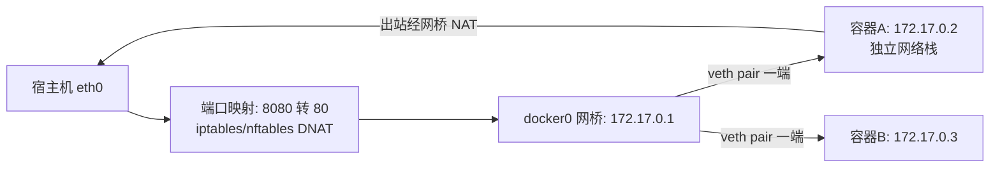
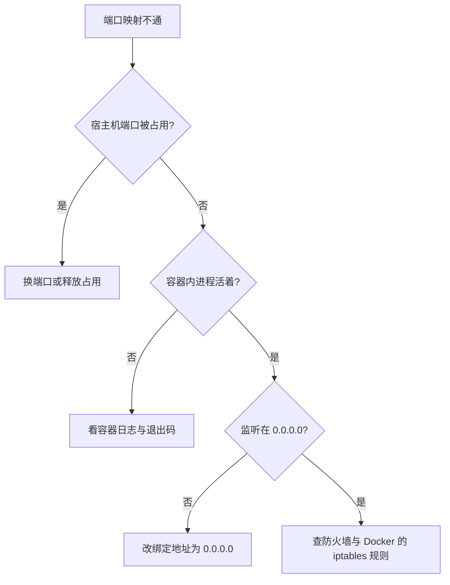

# 容器网络

> **一句话摘要**：容器网络的本体是「网络 namespace + 虚拟网桥 + NAT/端口映射」——每个容器一套独立网络栈，bridge 模式靠网桥互访、靠端口映射对外；跨主机是 overlay 的事，进集群则是 K8s 的 CNI 接管。

前置阅读：[容器是什么](./1_容器是什么-从虚拟机到容器-入门.md)。跨主机网络与服务发现的生产形态，见[K8s 生态系列](../../../kubernetes/入门层/从零开始认识K8s生态系列/0_系列导读-全景.md)。

## 1. 背景：为什么容器网络值得单独讲

容器给了每个应用独立的进程空间，但应用不能活在孤岛里：Web 要访问数据库、服务要对外提供端口。而容器的网络 namespace 又把网络栈隔开了——「容器里的 80 端口」宿主机根本看不见。容器网络要回答的就是三个问题：**容器怎么上网**（出站）、**外面怎么访问容器**（入站）、**容器之间怎么互访**（东西向）。单机模式下这三件事都由 Docker 的网络模式与网桥机制解决；理解了单机，跨主机与集群网络只是同一套机制的放大。

## 2. 核心机制：网桥、veth 与端口映射



- **网络 namespace**：每个容器一套独立的网卡、路由表、iptables 规则——容器里的 `localhost` 只属于自己，这是「容器 A 访问不到容器 B 的 localhost」的机制根源。
- **veth pair（虚拟网线）**：一根成对的虚拟网线，一端插在容器 namespace 里（容器看到的 eth0），另一端挂在宿主机的 docker0 网桥上。容器之间的流量就是经网桥二层转发。
- **端口映射（入站）**：`-p 8080:80` 的实现是宿主机上的 NAT 规则——访问宿主机 8080 的流量被 DNAT 改写目标地址后送进网桥、转到容器 80。所以端口映射有性能代价（多一次 NAT），且容器内监听 `127.0.0.1` 是映射不通的（NAT 后目标地址是容器 IP，不是回环地址）——这是新手第二大坑。
- **出站**：容器访问外网经网桥 → 宿主机路由 → SNAT 伪装成宿主机 IP 出去。容器内外看到的源 IP 不同，日志里「客户端 IP 全是网关地址」就是这么来的。

### 2.2 四种网络模式一句话定位

| 模式 | 机制 | 适用 |
|---|---|---|
| bridge（默认） | 独立 namespace + docker0 网桥 + NAT | 绝大多数单机场景 |
| host | 不建 namespace，直接用宿主机网络栈 | 追求极致网络性能（代价：端口冲突、隔离归零） |
| none | 只有回环接口 | 完全离线的任务容器 |
| 自定义 bridge | 同 bridge 但内建 DNS | **多容器互访的推荐模式**：容器名即域名 |

## 3. 落地实践：把三个通信问题一次配对

```bash
# 1) 外面访问容器: 端口映射
docker run -d -p 8080:80 --name web nginx:alpine

# 2) 容器之间互访: 自定义网络 + 容器名当域名
docker network create appnet
docker run -d --network appnet --name db postgres:16
docker run -d --network appnet --name app myapp:latest
# app 容器里直接: 连接串写 postgresql://db:5432/... (容器名解析成 IP)

# 3) 容器出站: 默认可达; 排障三板斧
docker exec app ping -c 2 db          # 通不通
docker network inspect appnet         # 谁在这个网络里
docker logs app                       # 应用层报什么
```

默认 bridge 网络没有内建 DNS（只能用老式 `--link`，已弃用），所以**互访场景一律先建自定义网络**——这是单机容器网络的第一个肌肉记忆。

## 4. 生产视角：网络问题的常见形态

- **「容器里连不上自己的服务」**：十有八九是服务绑定了 `127.0.0.1`。容器内要被别人访问，必须监听 `0.0.0.0`——绑回环地址等于把门焊死在 namespace 里面。
- **端口映射不通的三连排查**：宿主机端口被占（`-p` 失败或行为异常）→ 容器内进程没起来（`docker ps` 看 status）→ 进程监听回环地址（进容器 `netstat -tlnp` 看）。顺序基本能解决九成「映射不通」。
- **源 IP 变形与限流失效**：经 NAT 后应用看到的客户端 IP 是网关地址，基于 IP 的限流、审计全部失效。生产做法：拿真实 IP 用 host 网络（牺牲隔离）或七层代理透传（X-Forwarded-For，代理归网关机制——见服务治理子域）。
- **DNS 解析飘忽**：自定义网络的 DNS 以容器名为准，容器重建后 IP 变了但名字不变——应用要依赖名字而不是 IP。把 IP 写进配置文件是容器化的经典反模式。
- **Mac/Windows 的文件与网络开销**：桌面版容器的端口映射与挂载多一层虚拟化，性能低于 Linux 原生——压测数据不要在开发机上测网络吞吐。

## 5. 主流方案怎么做：从单机到集群

| 层级 | 主流机制 | tips |
|---|---|---|
| 单机互访 | 自定义 bridge + 内建 DNS | 一台机器上的本地栈（Compose 底层就是它） |
| 单机对外 | iptables/nftables DNAT 端口映射 | 生产单机对外建议前置 Nginx/Caddy 做七层统一入口 |
| 跨主机 | overlay 网络（VXLAN 封装） | Swarm 时代的方案，单机 Docker 一般用不到，知道存在即可 |
| 集群 | CNI 插件接管（Calico/Flannel/Cilium） | K8s 里没有「端口映射」概念，Pod 网络平面直通——这是单机容器与集群网络的分水岭 |
| 服务发现 | 单机: Docker DNS；集群: K8s Service/DNS | 名字解析的机制一致，实现层次不同 |

规律：**容器网络的演进方向是「NAT 越来越少、直通越来越多」**——CNI 的 Underlay/直路由方案、Cilium 的 eBPF 数据面都在消 NAT。把单机容器网络放进整个系统架构的上下游看：它对内提供网桥与 DNS、对外经 NAT 与反代衔接物理网络，是应用与基础设施之间的衔接层——架构评审时，这一层的边界（谁暴露、谁互访、谁可出站）要作为上下游契约显式固定下来。单机模式下先把 bridge 模型吃透，上集群前只需换概念映射。

排障时把「映射不通」的三连排查画成决策链：



## 6. 典型场景

- **本地全栈开发**（效率级）：Compose 把 Web/API/DB/缓存放进一个自定义网络，互访全走容器名，宿主机只暴露 Web 的端口。
- **单机多服务部署**（成本级）：一台机器上 Docker 起多个服务 + Nginx 反代统一入口，比虚拟机方案密度高一个数量级。
- **临时调试网络**（排障级）：起一个带网络工具的容器（`nicolaka/netshoot` 镜像）加入目标网络，`ping/dig/tcpdump` 全套排查。

## 7. 与相邻概念的区别

- **bridge vs host 模式**：bridge 换隔离与灵活性（NAT 代价），host 换性能与简单（隔离归零、端口自管）。无状态高性能场景（如代理转发）才考虑 host。
- **容器网络 vs K8s 网络**：单机是「网桥 + NAT + 端口映射」；K8s 是「Pod 直通平面 + Service 虚拟 IP + CNI」。概念映射：`-p` ≈ Service 的 NodePort，容器名 DNS ≈ Service DNS，其余机制分叉。
- **端口映射 vs 反向代理**：端口映射是四层转发（快、无路由能力）；反代是七层（域名路由、TLS、限流）。对外多服务入口用反代，映射只给单个服务临时暴露用。

## 8. 常见误区与不适用

- **「容器里监听了就能被访问」**：监听 `127.0.0.1` 对外不可达，必须 `0.0.0.0`；这是容器网络第一坑。
- **「默认 bridge 网络也能用容器名互访」**：默认网络没有内建 DNS，互访请建自定义网络——不要用已弃用的 `--link`。
- **「端口映射 = 高性能入口」**：每次映射多一层 NAT，高并发入口应交给专门的反代/网关，映射只用于调试与低频暴露。
- **「IP 是稳定的，写进配置吧」**：容器重建 IP 必变，配置里只允许出现容器名/服务名。依赖 IP 的部署脚本在第一次扩容时就会碎。
- **「宿主机防火墙开了就行」**：Docker 会自己写 iptables 规则，某些发行版上 `-p` 发布的端口**绕过** ufw/firewalld 规则直接可达——公网机器上「以为没开放的端口」是真的开着，这是真实的安全事故来源。

## 9. 你们可能会问

- **两个容器端口相同会冲突吗？** 不会——各自 namespace 里独立，`-p` 映射到宿主机不同端口即可；只有 host 模式才会真冲突。
- **容器怎么拿到「真实的客户端 IP」？** 单机 NAT 下拿不到，要么 host 网络，要么前置七层代理透传 X-Forwarded-For；集群里 CNI 直通模式下源 IP 保留。
- **容器间通信有性能损耗吗？** 网桥是内核态二层转发，损耗很小（单机内微秒级）；跨主机 overlay 的封包损耗才值得优化。
- **怎么限制容器能用哪些网络？** 网络策略在单机 Docker 里能力有限（`--network none` 或防火墙规则），细粒度策略（谁跟谁通）是 K8s NetworkPolicy 的领域。
- **IPv6 怎么办？** Docker 27+ 默认启用 IPv6 支持的路线上仍以双栈配置为主，生产启用前核对网络插件与内核参数（以官方文档为准）。

## 10. 一句话总结 + 5W 速记卡 + 自测三问

**一句话总结**：容器网络 = namespace 隔离 + veth 接网桥 + NAT 进出——互访靠自定义网络与容器名 DNS，对外靠端口映射或反代，监听必须 0.0.0.0，IP 永远不稳定。

**5W 速记卡**：

| 维度 | 内容 |
|---|---|
| What | 网络模式、veth/网桥、端口映射、容器 DNS |
| Why | 容器网络栈被隔离，进出互访都要显式搭桥 |
| When | 起容器、连不上、端口不通、日志 IP 异常时 |
| Where | 单机 Docker；跨主机与集群归 CNI/K8s |
| How | 自定义网络互访 → -p 映射对外 → 0.0.0.0 监听 → 名字不写 IP |

**自测三问**：

1. 你容器里的服务监听在什么地址上？宿主机 curl 一下验证过吗？
2. 你的应用配置里有写死的容器 IP 吗？容器重建后它会怎样？
3. 公网宿主机上，Docker 发布的端口在防火墙规则里吗——真的拦得住吗？

---

**下篇预告**：网络通了，数据怎么活得比容器久——下一篇[存储卷](./5_存储卷与数据持久化-入门.md)讲 volume、bind mount 与数据生命周期。

---

## 📌 数据与事实声明

本文版本锚点（截至 2026-09-09）：Docker Engine v29.8.0。veth/网桥/NAT 机制、默认网络行为、`--link` 弃用为官方文档公开内容；「Docker 端口绕过 ufw」为公开记录的已知行为（各发行版表现有差异，上线前务必实测）；性能量级为业内通用认知。以官方文档与自身实测为准。

## 📚 参考资料

| 类型 | 标题 | 来源 |
|---|---|---|
| 文档 | Docker networking overview | docs.docker.com |
| 文档 | K8s 网络（CNI/Service）对照 | kubernetes.io |
| 系列文章 | K8s 生态系列 | 本仓库 docs/devops/kubernetes/ |
